# Java高级开发工程师技术清单

> 📚 全面的技术栈知识体系，助你成为顶尖Java工程师

---

## 🎯 目录结构

### ✅ 已完成文档
- [MySQL核心机制详解](./MySQL核心机制详解.md)
- [Redis核心机制详解](./Redis核心机制详解.md)
- [RocketMQ核心机制详解](./RocketMQ核心机制详解.md)
- [Nacos核心机制详解](./Nacos核心机制详解.md)

### 📝 待学习/深入的核心技术

---

## 1️⃣ Java核心基础（必须精通）

### 1.1 JVM虚拟机 ⭐⭐⭐⭐⭐
**为什么重要**：Java应用性能调优的核心基础

**核心知识点**：
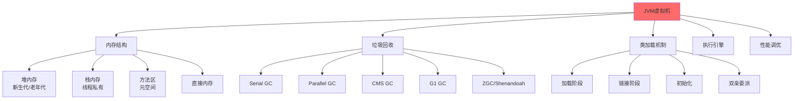

**必须掌握**：
- ✅ 内存模型（JMM）：堆、栈、方法区、直接内存
- ✅ GC算法：标记-清除、标记-整理、复制算法
- ✅ 垃圾收集器：Serial、Parallel、CMS、G1、ZGC对比
- ✅ 类加载机制：双亲委派模型、自定义类加载器
- ✅ JVM参数调优：-Xms、-Xmx、-XX:+UseG1GC等
- ✅ 性能分析工具：jstat、jmap、jstack、MAT、Arthas
- ✅ 内存泄漏排查：堆dump分析、OOM问题定位

**实战场景**：
- 线上OOM问题排查
- 接口响应慢，频繁Full GC优化
- 大促前系统容量评估和JVM调优

---

### 1.2 Java并发编程 ⭐⭐⭐⭐⭐
**为什么重要**：高并发系统开发的必备技能

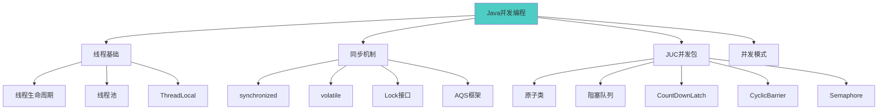

**必须掌握**：
- ✅ 线程基础：创建、生命周期、状态转换
- ✅ 线程池：ThreadPoolExecutor核心参数、拒绝策略
- ✅ synchronized：锁升级（偏向锁→轻量级锁→重量级锁）
- ✅ volatile：内存可见性、禁止指令重排
- ✅ Lock接口：ReentrantLock、ReadWriteLock、StampedLock
- ✅ AQS框架：AbstractQueuedSynchronizer原理
- ✅ 并发容器：ConcurrentHashMap、CopyOnWriteArrayList
- ✅ 原子操作：AtomicInteger、LongAdder原理
- ✅ 线程安全：happens-before规则、内存屏障

**实战场景**：
- 秒杀系统并发库存扣减
- 异步任务处理（线程池使用）
- 分布式定时任务并发控制

---

### 1.3 Java集合框架 ⭐⭐⭐⭐
**为什么重要**：日常开发最常用的数据结构

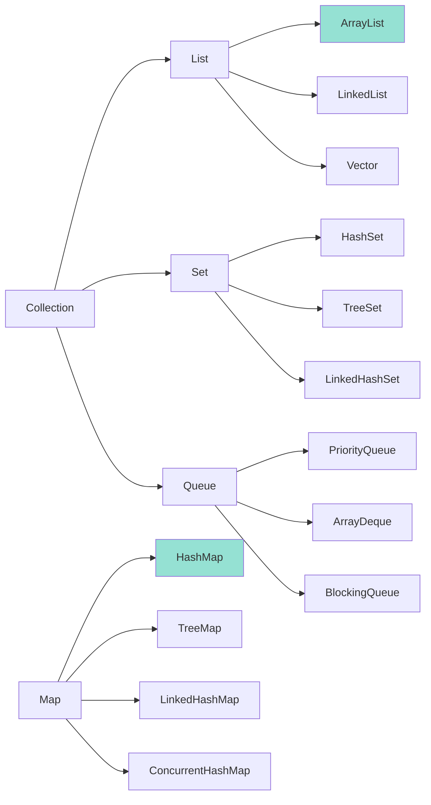

**必须掌握**：
- ✅ ArrayList vs LinkedList：底层实现、时间复杂度
- ✅ HashMap：1.7链表 vs 1.8红黑树、扩容机制、线程不安全
- ✅ ConcurrentHashMap：1.7分段锁 vs 1.8 CAS+synchronized
- ✅ TreeMap：红黑树实现、有序性
- ✅ HashSet：基于HashMap实现
- ✅ LinkedHashMap：LRU缓存实现
- ✅ fail-fast vs fail-safe机制

**实战场景**：
- 实现本地LRU缓存（LinkedHashMap）
- 大数据量去重（HashSet + 布隆过滤器）
- 优先级队列（PriorityQueue）

---

## 2️⃣ Spring生态（企业级必备）

### 2.1 Spring Framework核心 ⭐⭐⭐⭐⭐

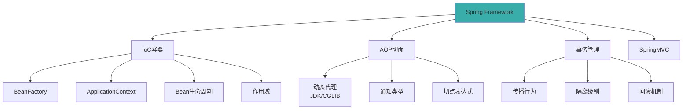

**必须掌握**：
- ✅ IoC容器：Bean定义、依赖注入、循环依赖解决
- ✅ Bean生命周期：实例化→属性赋值→初始化→销毁
- ✅ AOP原理：JDK动态代理 vs CGLIB代理
- ✅ 事务管理：7种传播行为、4种隔离级别
- ✅ SpringMVC流程：DispatcherServlet→HandlerMapping→Controller
- ✅ 自动装配：@Autowired、@Resource、@Qualifier

**核心源码**：
```java
// Spring IoC容器核心接口
BeanFactory
  └─ ApplicationContext
      └─ AnnotationConfigApplicationContext
      
// Bean生命周期关键方法
BeanPostProcessor.postProcessBeforeInitialization()
InitializingBean.afterPropertiesSet()
@PostConstruct
自定义init-method
BeanPostProcessor.postProcessAfterInitialization()
```

---

### 2.2 Spring Boot ⭐⭐⭐⭐⭐

**必须掌握**：
- ✅ 自动装配原理：@SpringBootApplication、@EnableAutoConfiguration
- ✅ starter机制：spring-boot-starter-*依赖管理
- ✅ 配置文件：application.yml优先级、多环境配置
- ✅ 内嵌容器：Tomcat、Jetty、Undertow
- ✅ Actuator监控：健康检查、指标监控
- ✅ 自定义starter开发

---

### 2.3 Spring Cloud微服务 ⭐⭐⭐⭐

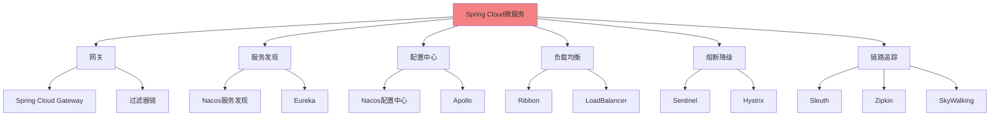

**必须掌握**：
- ✅ 服务网关：Spring Cloud Gateway路由、过滤器、限流
- ✅ 服务发现：Nacos/Eureka注册中心
- ✅ 负载均衡：Ribbon/LoadBalancer策略
- ✅ 熔断降级：Sentinel规则配置、热点限流
- ✅ 配置中心：Nacos动态配置、配置刷新
- ✅ 链路追踪：SkyWalking APM监控
- ✅ 分布式事务：Seata AT/TCC模式

---

## 3️⃣ 数据库与缓存（已完成 ✅）

### 3.1 MySQL ✅
- [MySQL核心机制详解](./MySQL核心机制详解.md)
- 索引、事务、锁机制、MVCC

### 3.2 Redis ✅
- [Redis核心机制详解](./Redis核心机制详解.md)
- 数据结构、持久化、集群、缓存策略

### 3.3 MongoDB（NoSQL） ⭐⭐⭐
**适用场景**：
- 文档型数据存储
- 日志系统
- 内容管理系统（CMS）

**必须掌握**：
- ✅ 文档型数据库特点
- ✅ CRUD操作
- ✅ 索引优化
- ✅ 副本集（Replica Set）
- ✅ 分片（Sharding）

---

## 4️⃣ 消息队列（已完成 ✅）

### 4.1 RocketMQ ✅
- [RocketMQ核心机制详解](./RocketMQ核心机制详解.md)
- 事务消息、延迟消息、顺序消息

### 4.2 Kafka ⭐⭐⭐⭐
**为什么重要**：大数据场景首选MQ

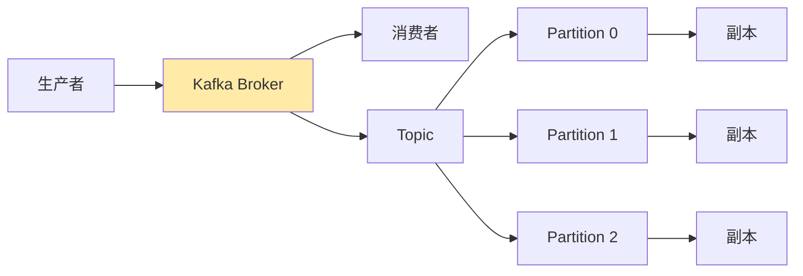

**必须掌握**：
- ✅ 架构：Broker、Topic、Partition、Replica
- ✅ 零拷贝技术：mmap、sendfile
- ✅ 顺序写磁盘：性能优化原理
- ✅ ISR机制：In-Sync Replicas同步
- ✅ 消费者组：Rebalance机制
- ✅ 消息可靠性：ACK机制、幂等性、事务
- ✅ 性能优化：批量发送、压缩

**对比RocketMQ**：
| 特性 | Kafka | RocketMQ |
|------|-------|----------|
| **定位** | 日志收集、大数据 | 业务消息、金融 |
| **吞吐量** | 百万级TPS | 10万级TPS |
| **延迟** | 毫秒级 | 毫秒级 |
| **事务消息** | ✅ 支持（0.11+） | ✅ 支持 |
| **延迟消息** | ❌ 不支持 | ✅ 18个级别 |
| **消息回溯** | ✅ 按offset | ✅ 按时间 |

---

## 5️⃣ 分布式架构

### 5.1 分布式理论 ⭐⭐⭐⭐⭐

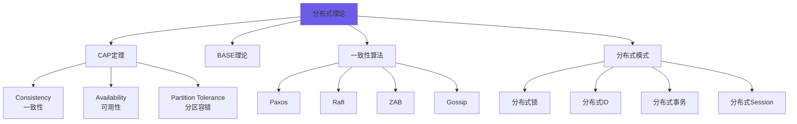

**必须掌握**：
- ✅ CAP定理：最多满足两项（CP/AP选择）
- ✅ BASE理论：基本可用、软状态、最终一致性
- ✅ Paxos算法：Multi-Paxos优化
- ✅ Raft算法：Leader选举、日志复制
- ✅ 一致性Hash：虚拟节点解决数据倾斜

---

### 5.2 分布式锁 ⭐⭐⭐⭐⭐

**实现方案对比**：
| 方案 | 优点 | 缺点 | 适用场景 |
|------|------|------|---------|
| **MySQL** | 简单、强一致 | 性能差、单点 | 低并发 |
| **Redis** | 高性能 | 需考虑一致性 | 高并发 |
| **Zookeeper** | 强一致、可靠 | 性能一般 | 一致性要求高 |
| **Etcd** | 强一致、云原生 | 运维复杂 | K8s场景 |

**Redis分布式锁（必须掌握）**：
```java
// 1. 加锁（SET NX EX）
SET lock:resource_id unique_value NX EX 30

// 2. Lua脚本解锁（原子性）
if redis.call("get", KEYS[1]) == ARGV[1] then
    return redis.call("del", KEYS[1])
else
    return 0
end

// 3. Redlock算法（多节点）
向N个独立Redis实例请求锁
成功数 >= N/2 + 1 则加锁成功
```

**Redisson实现**（推荐）：
- 自动续期（看门狗机制）
- 可重入锁
- 读写锁
- 联锁（MultiLock）

---

### 5.3 分布式ID ⭐⭐⭐⭐

**方案对比**：
| 方案 | 特点 | 优点 | 缺点 |
|------|------|------|------|
| **UUID** | 全局唯一 | 简单 | 无序、占空间 |
| **数据库自增** | 有序 | 简单 | 性能瓶颈 |
| **Redis INCR** | 有序、高性能 | - | 依赖Redis |
| **雪花算法** | 有序、高性能 | 本地生成 | 时钟回拨问题 |
| **美团Leaf** | 号段模式 | 高性能 | 需部署服务 |
| **百度UidGenerator** | 改进雪花 | 解决时钟回拨 | - |

**雪花算法（Snowflake）**：
```
64位Long型ID结构：
┌─────────────────────────────────────────┐
│1bit│  41bit时间戳  │10bit机器ID│12bit序列号│
└─────────────────────────────────────────┘
  0  |  毫秒级时间戳   | 数据中心+机器 | 毫秒内序列

特点：
- 趋势递增（有序）
- 每毫秒可生成 2^12 = 4096 个ID
- 支持分布式部署（1024台机器）
- 69年不会重复
```

---

### 5.4 分布式事务 ⭐⭐⭐⭐⭐

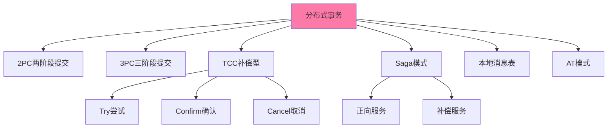

**必须掌握**：

**1. 2PC/3PC（强一致性）**：
- 协调者+参与者模式
- 阻塞、单点故障问题
- 适用场景：银行转账

**2. TCC（Try-Confirm-Cancel）**：
```java
// 订单服务
@Transactional
public void createOrder() {
    // Try: 预留资源
    inventoryService.tryDeduct(productId, quantity);
    accountService.tryFreeze(userId, amount);
    
    // 业务逻辑...
    
    // Confirm: 确认扣减
    inventoryService.confirmDeduct();
    accountService.confirmDeduct();
    
    // 如果失败，Cancel: 释放资源
    inventoryService.cancelDeduct();
    accountService.cancelDeduct();
}
```

**3. Saga模式（长事务）**：
- 正向服务 + 补偿服务
- 最终一致性
- 适用场景：跨多个微服务的长流程

**4. 本地消息表**：
```
订单服务：
1. 本地事务：创建订单 + 插入消息表
2. 定时任务：扫描消息表，发送到MQ
3. 消费者：处理消息，更新库存

优点：最终一致性、简单可靠
缺点：数据库压力、延迟较高
```

**5. Seata（阿里开源）**：
- AT模式：自动补偿（类似2PC）
- TCC模式：手动补偿
- Saga模式：长事务编排
- XA模式：强一致性

---

## 6️⃣ 网络与通信

### 6.1 Netty ⭐⭐⭐⭐⭐
**为什么重要**：高性能网络编程框架，RocketMQ、Dubbo底层都用它

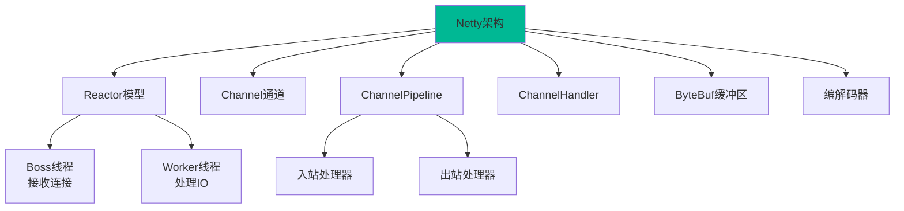

**必须掌握**：
- ✅ Reactor模型：主从Reactor多线程
- ✅ Channel：NioSocketChannel、NioServerSocketChannel
- ✅ ChannelPipeline：责任链模式
- ✅ ByteBuf：零拷贝、引用计数
- ✅ 编解码器：LengthFieldBasedFrameDecoder
- ✅ 心跳检测：IdleStateHandler
- ✅ 零拷贝技术：堆外内存、文件传输优化

**应用场景**：
- RPC框架（Dubbo、gRPC）
- 长连接推送（IM即时通讯）
- 游戏服务器
- API网关

---

### 6.2 HTTP/HTTPS ⭐⭐⭐⭐

**必须掌握**：
- ✅ HTTP/1.1 vs HTTP/2 vs HTTP/3
- ✅ HTTPS加密：TLS握手过程
- ✅ 常见状态码：200、301、302、304、400、401、403、404、500、502、503
- ✅ HTTP方法：GET、POST、PUT、DELETE、PATCH
- ✅ 缓存机制：强缓存（Expires、Cache-Control）、协商缓存（ETag、Last-Modified）
- ✅ Cookie vs Session vs JWT
- ✅ 跨域问题：CORS、JSONP

---

### 6.3 RPC框架 ⭐⭐⭐⭐⭐

#### Dubbo（阿里）
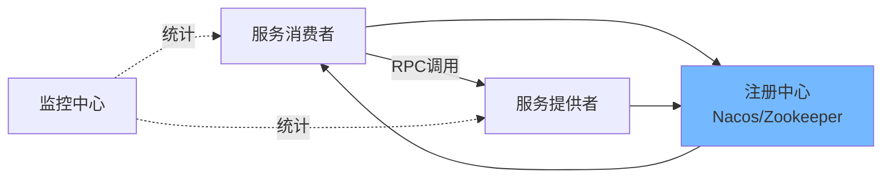

**必须掌握**：
- ✅ 服务注册与发现
- ✅ 负载均衡：随机、轮询、最少活跃、一致性Hash
- ✅ 集群容错：Failover、Failfast、Failsafe
- ✅ 服务降级：Mock、Stub
- ✅ 泛化调用：无需依赖接口
- ✅ SPI机制：Dubbo扩展点
- ✅ 协议：dubbo、http、hessian、thrift

#### gRPC（Google）
- Protocol Buffers序列化
- HTTP/2传输
- 跨语言支持

---

## 7️⃣ 搜索引擎

### 7.1 Elasticsearch ⭐⭐⭐⭐⭐
**为什么重要**：全文搜索、日志分析、实时数据分析

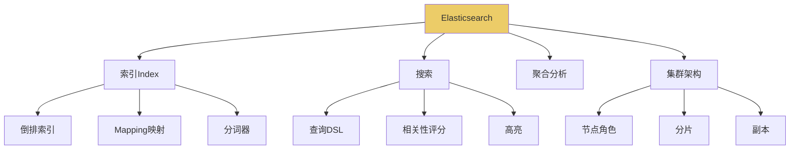

**必须掌握**：
- ✅ 倒排索引原理
- ✅ 分词器：IK中文分词器
- ✅ 查询DSL：match、term、bool、range
- ✅ 聚合：terms、avg、sum、date_histogram
- ✅ 集群架构：主节点、数据节点、协调节点
- ✅ 分片与副本：提高吞吐量和可用性
- ✅ 性能优化：批量操作、路由优化

**应用场景**：
- 商品搜索（电商）
- 日志分析（ELK Stack）
- 用户行为分析
- 实时监控

---

## 8️⃣ 容器与云原生

### 8.1 Docker ⭐⭐⭐⭐⭐

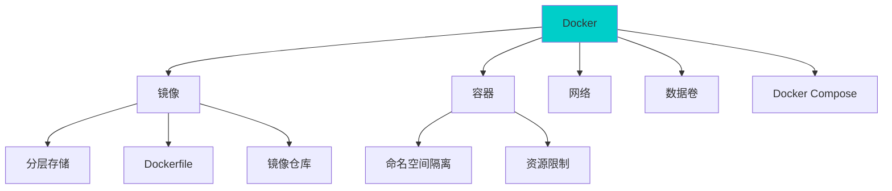

**必须掌握**：
- ✅ 镜像与容器：镜像是静态定义，容器是运行实例
- ✅ Dockerfile：FROM、RUN、COPY、CMD、ENTRYPOINT
- ✅ 分层存储：Union FS、COW（写时复制）
- ✅ 网络模式：bridge、host、none、container
- ✅ 数据卷：持久化数据
- ✅ Docker Compose：多容器编排
- ✅ 镜像优化：多阶段构建、Alpine基础镜像

---

### 8.2 Kubernetes (K8s) ⭐⭐⭐⭐

```mermaid
graph TB
    K8s[Kubernetes]
    
    K8s --> Pod[Pod]
    K8s --> Deploy[Deployment]
    K8s --> Service[Service]
    K8s --> Ingress[Ingress]
    K8s --> ConfigMap[ConfigMap]
    K8s --> PV[持久化存储]
    
    Pod --> Container[容器]
    Deploy --> ReplicaSet[副本集]
    Service --> LoadBalance[负载均衡]
    
    style K8s fill:#2d3436
```

**必须掌握**：
- ✅ 核心概念：Pod、Deployment、Service、Ingress
- ✅ 调度机制：资源限制、亲和性
- ✅ 服务发现：ClusterIP、NodePort、LoadBalancer
- ✅ 配置管理：ConfigMap、Secret
- ✅ 存储：PV、PVC、StorageClass
- ✅ 健康检查：Liveness、Readiness探针
- ✅ 自动扩缩容：HPA（Horizontal Pod Autoscaler）

---

## 9️⃣ 监控与运维

### 9.1 监控体系 ⭐⭐⭐⭐

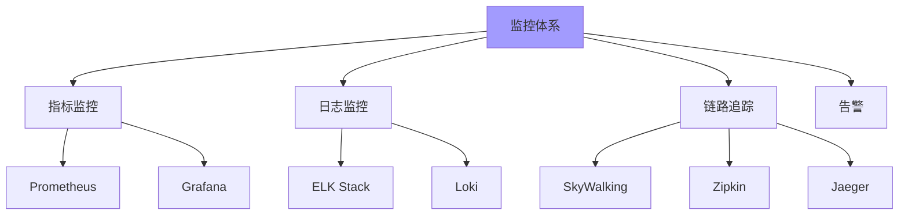

**必须掌握**：

**Prometheus + Grafana**：
- Metrics指标采集
- PromQL查询语言
- Grafana可视化大盘

**ELK Stack（日志）**：
- Elasticsearch：存储和搜索
- Logstash：日志采集和处理
- Kibana：可视化

**SkyWalking（链路追踪）**：
- 分布式链路追踪
- 服务拓扑图
- 性能分析

---

### 9.2 APM工具 ⭐⭐⭐⭐

| 工具 | 特点 | 适用场景 |
|------|------|---------|
| **Arthas** | 阿里开源、Java诊断 | 线上问题排查 |
| **SkyWalking** | 全链路追踪、APM | 微服务监控 |
| **Prometheus** | 时序数据库、指标 | 系统指标监控 |
| **Grafana** | 可视化平台 | 监控大盘 |
| **Sentry** | 异常监控 | 错误追踪 |

---

## 🔟 设计模式与架构

### 10.1 设计模式 ⭐⭐⭐⭐

**必须掌握的23种设计模式**：

**创建型（5种）**：
- ✅ 单例模式：双重检查锁、静态内部类、枚举
- ✅ 工厂模式：简单工厂、工厂方法、抽象工厂
- ✅ 建造者模式：Builder链式调用
- ✅ 原型模式：深拷贝、浅拷贝
- 适配器模式

**结构型（7种）**：
- ✅ 代理模式：静态代理、JDK动态代理、CGLIB
- ✅ 装饰器模式：Java IO流
- ✅ 适配器模式：接口适配
- 桥接模式、组合模式、外观模式、享元模式

**行为型（11种）**：
- ✅ 策略模式：替代if-else
- ✅ 模板方法模式：定义算法骨架
- ✅ 观察者模式：事件监听
- ✅ 责任链模式：Filter、Interceptor
- 命令模式、迭代器模式、中介者模式、备忘录模式、状态模式、访问者模式、解释器模式

---

### 10.2 架构设计 ⭐⭐⭐⭐⭐

**必须掌握**：

**1. 单体架构 → 微服务架构演进**
```
单体应用
  ↓
垂直拆分（按业务）
  ↓
SOA服务化
  ↓
微服务架构
  ↓
Service Mesh服务网格
```

**2. 高并发架构设计**：
- 缓存：本地缓存（Caffeine） + 分布式缓存（Redis）
- 限流：单机限流（Guava）+ 分布式限流（Sentinel）
- 降级：熔断（Hystrix/Sentinel）+ 降级策略
- 削峰：消息队列异步处理
- 读写分离：MySQL主从
- 分库分表：ShardingSphere

**3. 高可用架构设计**：
- 冗余：多活机房
- 隔离：线程池隔离、数据库隔离
- 限流：保护系统不被击垮
- 降级：保证核心功能可用
- 超时：快速失败
- 重试：幂等性保证

---

## 1️⃣1️⃣ 性能优化

### 11.1 性能调优 ⭐⭐⭐⭐⭐

**必须掌握**：

**JVM调优**：
- 堆内存设置：-Xms、-Xmx
- 垃圾收集器选择：G1、ZGC
- GC日志分析：-Xloggc、GCEasy

**MySQL调优**：
- 索引优化：explain分析
- 慢查询优化：slow_query_log
- 连接池调优：HikariCP参数

**Redis调优**：
- 内存优化：maxmemory-policy
- 持久化优化：混合持久化
- 慢查询分析：slowlog

**代码层面**：
- 减少锁竞争：CAS、分段锁
- 异步处理：线程池、消息队列
- 批量操作：批量插入、Pipeline
- 对象复用：对象池、ThreadLocal

---

## 1️⃣2️⃣ 安全

### 12.1 安全体系 ⭐⭐⭐⭐

**必须掌握**：

**认证授权**：
- ✅ JWT：无状态认证
- ✅ OAuth 2.0：第三方授权
- ✅ Spring Security：权限框架
- ✅ RBAC：基于角色的访问控制

**常见攻击防御**：
- ✅ SQL注入：PreparedStatement、参数绑定
- ✅ XSS攻击：输入过滤、输出转义
- ✅ CSRF攻击：Token验证
- ✅ 接口防刷：限流、验证码
- ✅ 数据加密��AES、RSA

---

## 📊 技术栈能力矩阵

### 高级工程师必备技能（1-5星）

| 技术栈 | 重要程度 | 掌握程度要求 |
|--------|---------|-------------|
| **JVM** | ⭐⭐⭐⭐⭐ | 深入原理、能调优 |
| **并发编程** | ⭐⭐⭐⭐⭐ | 精通JUC、解决实际问题 |
| **Spring全家桶** | ⭐⭐⭐⭐⭐ | 源码级别理解 |
| **MySQL** | ⭐⭐⭐⭐⭐ | 索引优化、锁机制 |
| **Redis** | ⭐⭐⭐⭐⭐ | 集群架构、缓存策略 |
| **消息队列** | ⭐⭐⭐⭐⭐ | 至少精通一种MQ |
| **分布式理论** | ⭐⭐⭐⭐⭐ | CAP、一致性算法 |
| **微服务治理** | ⭐⭐⭐⭐⭐ | 熟悉Spring Cloud生态 |
| **Netty** | ⭐⭐⭐⭐ | 了解原理、能使用 |
| **Dubbo/gRPC** | ⭐⭐⭐⭐ | 至少熟悉一种RPC |
| **Elasticsearch** | ⭐⭐⭐⭐ | 搜索场景必备 |
| **Docker** | ⭐⭐⭐⭐ | 容器化部署 |
| **K8s** | ⭐⭐⭐ | 了解基本概念 |
| **监控体系** | ⭐⭐⭐⭐ | 线上问题排查 |
| **设计模式** | ⭐⭐⭐⭐ | 灵活运用 |
| **架构设计** | ⭐⭐⭐⭐⭐ | 高并发、高可用 |

---

## 🎯 学习路线建议

### 阶段1：夯实基础（1-3个月）
1. **JVM虚拟机** - 内存模型、GC算法、性能调优
2. **并发编程** - 线程、锁、JUC包
3. **集合框架** - HashMap、ConcurrentHashMap源码
4. **Spring核心** - IoC、AOP、事务原理

### 阶段2：中间件精通（3-6个月）
1. **MySQL深入** - 索引、事务、锁、MVCC ✅
2. **Redis精通** - 数据结构、持久化、集群 ✅
3. **RocketMQ/Kafka** - 消息队列原理 ✅
4. **Elasticsearch** - 全文搜索、倒排索引

### 阶段3：分布式架构（6-12个月）
1. **分布式理论** - CAP、BASE、一致性算法
2. **分布式组件** - 锁、ID、事务、Session
3. **微服务治理** - Spring Cloud、服务网格
4. **RPC框架** - Dubbo/gRPC原理

### 阶段4：架构设计能力（持续提升）
1. **高并发设计** - 缓存、限流、降级、削峰
2. **高可用设计** - 冗余、隔离、超时、重试
3. **系统设计** - 秒杀、抢红包、短链接
4. **技术选型** - 根据业务场景选择技术栈

---

## 📚 推荐学习资源

### 书籍
- 《深入理解Java虚拟机》- 周志明
- 《Java并发编程实战》- Brian Goetz
- 《Spring源码深度解析》- 郝佳
- 《MySQL技术内幕：InnoDB存储引擎》- 姜承尧
- 《Redis设计与实现》- 黄健宏
- 《深入分布式缓存》- 陈波
- 《分布式系统原理与范型》
- 《高性能MySQL》
- 《Netty权威指南》- 李林锋
- 《Kafka权威指南》

### 开源项目学习
- Spring Framework源码
- MyBatis源码
- Dubbo源码
- Netty源码
- RocketMQ源码

### 在线资源
- 美团技术博客
- 阿里云开发者社区
- InfoQ
- 掘金
- GitHub Trending

---

## 🚀 实战项目经验

### 必须有的项目经验
1. **高并发秒杀系统** - 缓存、限流、削峰
2. **分布式电商系统** - 微服务、分布式事务
3. **实时数据分析平台** - Kafka、Flink、ES
4. **API网关** - 路由、限流、熔断
5. **监控告警系统** - Prometheus、Grafana

---

## 💡 面试高频考点

### JVM
- 内存模型、GC算法、类加载机制
- OOM问题排查、性能调优

### 并发
- synchronized vs Lock
- volatile原理
- ThreadPoolExecutor核心参数
- ConcurrentHashMap 1.7 vs 1.8

### Spring
- IoC容器启动流程
- AOP代理实现
- 事务传播行为
- 循环依赖解决

### 分布式
- CAP理论、BASE理论
- 分布式锁实现
- 分布式事务方案
- 一致性Hash算法

### 中间件
- Redis持久化、集群
- MySQL索引、MVCC
- RocketMQ事务消息
- Kafka零拷贝

---

## ✅ 技能自检清单

### 基础能力（必须全部掌握）
- [ ] JVM内存模型能画出来
- [ ] 能解释volatile原理
- [ ] 能实现单例模式的5种方式
- [ ] 能解释Spring Bean生命周期
- [ ] 能手写LRU缓存

### 中间件能力
- [ ] 能解释MySQL索引失效场景
- [ ] 能设计Redis缓存方案
- [ ] 能实现RocketMQ事务消息
- [ ] 能配置Nacos集群

### 架构能力
- [ ] 能设计秒杀系统
- [ ] 能实现分布式锁
- [ ] 能解决缓存穿透/击穿/雪崩
- [ ] 能设计高可用架构

### 调优能力
- [ ] 能分析JVM堆dump
- [ ] 能优化慢SQL
- [ ] 能排查Redis性能问题
- [ ] 能使用Arthas诊断问题

---

## 📈 进阶方向

### 成为架构师
- 业务建模能力
- 系统设计能力
- 技术选型能力
- 团队管理能力

### 成为技术专家
- 深入某个领域（如性能优化）
- 开源项目贡献
- 技术分享和输出
- 行业影响力

---

**文档版本**: v1.0  
**最后更新**: 2025-10-25  
**作者**: AI Assistant  
**建议**: 循序渐进，重实践，多总结
