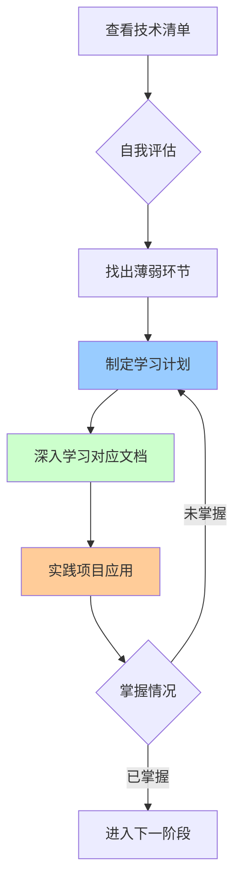
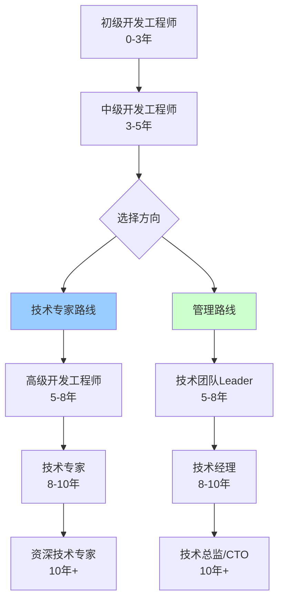

# 综合技术资料

> 综合性技术清单、技能矩阵、学习路线等资料

---

## 📋 文档列表

### 1. Java高级工程师技术清单 ⭐ 推荐
📄 [Java高级工程师技术清单.md](./Java高级工程师技术清单.md)

**核心内容**：
- ✅ **12大技术领域完整知识图谱**
- ✅ **Java核心基础**：JVM、并发、集合框架
- ✅ **Spring生态**：Spring Framework、Spring Boot、Spring Cloud
- ✅ **数据库与缓存**：MySQL、Redis核心机制
- ✅ **消息队列**：RocketMQ、Kafka
- ✅ **分布式架构**：理论、锁、ID、事务
- ✅ **网络与通信**：Netty、HTTP、RPC
- ✅ **搜索引擎**：Elasticsearch
- ✅ **容器与云原生**：Docker、Kubernetes
- ✅ **监控与运维**：Prometheus、ELK、SkyWalking
- ✅ **设计模式与架构**
- ✅ **性能优化**
- ✅ **安全**

**技能矩阵**：
| 等级 | 技能要求 | 薪资范围 |
|------|----------|----------|
| **初级（1-3年）** | 熟悉Java基础、Spring、MySQL | 10-20K |
| **中级（3-5年）** | 掌握并发、JVM、Redis、MQ | 20-35K |
| **高级（5-8年）** | 精通分布式、微服务、性能优化 | 35-60K |
| **架构师（8年+）** | 系统设计、技术选型、团队管理 | 60K+ |

**学习路径**：
```
阶段1: 夯实基础（1-3个月）
  → JVM、并发、Spring核心

阶段2: 中间件精通（3-6个月）
  → MySQL、Redis、MQ、ES

阶段3: 分布式架构（6-12个月）
  → 分布式理论、微服务治理、RPC

阶段4: 架构设计（持续提升）
  → 高并发设计、高可用设计、系统设计
```

**技能自检清单**：
- [ ] JVM内存模型能画出来
- [ ] 能解释volatile原理
- [ ] 能实现单例模式的5种方式
- [ ] 能解释Spring Bean生命周期
- [ ] 能解释MySQL索引失效场景
- [ ] 能设计Redis缓存方案
- [ ] 能实现分布式锁
- [ ] 能设计秒杀系统
- [ ] 能解决缓存穿透/击穿/雪崩
- [ ] 能设计高可用架构

**适合人群**：
- ✅ 想系统提升的Java开发者
- ✅ 准备面试的高级工程师
- ✅ 希望成为架构师的技术人员
- ✅ 技术管理者（做技术规划）

---

## 🎯 如何使用技术清单

### 1️⃣ 作为学习路线图



### 2️⃣ 作为面试准备

**高频面试题对应**：
- Java基础：[01_Java核心/Java基础核心原理.md](../01_Java核心/Java基础核心原理.md)
- JVM相关：[01_Java核心/JVM虚拟机详解.md](../01_Java核心/JVM虚拟机详解.md)
- MySQL相关：[03_数据库/MySQL核心机制详解.md](../03_数据库/MySQL核心机制详解.md)
- Redis相关：[04_缓存/Redis核心机制详解.md](../04_缓存/Redis核心机制详解.md)
- 分布式相关：[07_分布式系统/](../07_分布式系统/)

### 3️⃣ 作为技术选型参考

**场景驱动选型**：
- 需要消息队列？→ 查看清单中的MQ对比
- 需要注册中心？→ 查看微服务组件对比
- 需要缓存方案？→ 查看Redis使用场景

### 4️⃣ 作为团队技能矩阵

**团队能力评估**：
```
团队成员技能评估表：
┌─────────┬────────┬────────┬──────────┬──────────┐
│ 成员    │ 基础   │ 中间件 │ 分布式   │ 架构设计 │
├─────────┼────────┼────────┼──────────┼──────────┤
│ 张三    │ ⭐⭐⭐⭐⭐ │ ⭐⭐⭐⭐   │ ⭐⭐⭐     │ ⭐⭐      │
│ 李四    │ ⭐⭐⭐   │ ⭐⭐⭐⭐⭐ │ ⭐⭐⭐⭐   │ ⭐⭐⭐    │
│ 王五    │ ⭐⭐⭐⭐ │ ⭐⭐⭐   │ ⭐⭐⭐⭐⭐ │ ⭐⭐⭐⭐  │
└─────────┴────────┴────────┴──────────┴──────────┘

根据评估结果：
- 张三需要加强分布式和架构能力
- 李四需要补充Java基础
- 王五可以担任架构师角色
```

---

## 📚 扩展学习资源

### 书籍推荐

#### Java基础
- 《深入理解Java虚拟机（第3版）》- 周志明
- 《Java并发编程实战》- Brian Goetz
- 《Effective Java（第3版）》- Joshua Bloch

#### 框架与中间件
- 《Spring Boot编程思想》- 小马哥
- 《深入理解Apache Dubbo与实战》- 诸葛
- 《RocketMQ技术内幕》- 丁威

#### 数据库
- 《高性能MySQL（第4版）》
- 《MySQL技术内幕：InnoDB存储引擎》
- 《Redis设计与实现》

#### 架构设计
- 《凤凰架构》- 周志明
- 《微服务架构设计模式》- Chris Richardson
- 《大型网站技术架构》- 李智慧

### 在线资源
- 📺 [极客时间](https://time.geekbang.org/)
- 📺 [慕课网](https://www.imooc.com/)
- 📖 [美团技术团队博客](https://tech.meituan.com/)
- 📖 [阿里技术](https://developer.aliyun.com/group/)

---

## 🎓 学习方法论

### 费曼学习法
```
1. 选择一个概念
2. 用简单的语言解释给别人听
3. 发现不理解的地方，重新学习
4. 简化和类比，直到能让小白听懂
```

### 刻意练习
```
1. 明确目标（我要掌握什么）
2. 拆解技能（分解成小的知识点）
3. 集中练习（高强度专注学习）
4. 持续反馈（验证是否掌握）
```

### 项目驱动学习
```
1. 找一个实际问题/项目
2. 尝试用新技术解决
3. 遇到问题查文档/源码
4. 总结经验，形成自己的理解
```

---

## 💡 职业发展建议

### Java后端工程师发展路径



### 技能提升优先级

**P0（必须掌握）**：
- Java核心（JVM、并发、集合）
- Spring全家桶
- MySQL + Redis
- 常用中间件（MQ、ES等）

**P1（重要）**：
- 分布式架构理论
- 微服务治理
- 性能优化
- 系统设计

**P2（加分项）**：
- 大数据技术（Hadoop、Spark）
- 云原生（K8s、Docker）
- AI/ML基础
- 前端技术

---

## 🔗 相关文档

- 📄 [01_Java核心](../01_Java核心/) - Java基础、JVM、并发
- 📄 [02_Spring生态](../02_Spring生态/) - Spring、Spring Boot
- 📄 [03_数据库](../03_数据库/) - MySQL核心机制
- 📄 [04_缓存](../04_缓存/) - Redis核心机制
- 📄 [05_消息队列](../05_消息队列/) - RocketMQ核心机制
- 📄 [06_微服务](../06_微服务/) - Nacos、Spring Cloud Alibaba、Dubbo
- 📄 [07_分布式系统](../07_分布式系统/) - 分布式事务、分布式锁

---

## 🔄 持续更新

- [ ] 前端工程师技术清单
- [ ] 架构师技能图谱
- [ ] 技术面试题库
- [ ] 开源项目推荐清单

---

*最后更新：2025-10-27*

