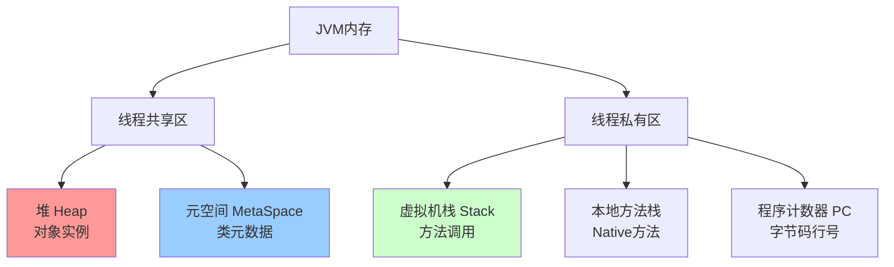

# JVM虚拟机详解

> 深入理解Java虚拟机的内存模型、类加载、垃圾回收、性能调优

---

## 📋 目录

1. [JVM内存模型](#1-jvm内存模型)
2. [类加载机制](#2-类加载机制)
3. [垃圾回收机制](#3-垃圾回收机制)
4. [GC调优实战](#4-gc调优实战)
5. [JVM监控与诊断](#5-jvm监控与诊断)
6. [常见问题与解决方案](#6-常见问题与解决方案)

---

## 1. JVM内存模型

### 1.1 运行时数据区



### 1.2 堆内存结构（Java 8+）

```
堆内存 (Heap)
├── 年轻代 (Young Generation) - 1/3
│   ├── Eden区 - 80%
│   ├── Survivor0 (From) - 10%
│   └── Survivor1 (To) - 10%
│
└── 老年代 (Old Generation) - 2/3
    └── 存放长期存活的对象
```

### 1.3 内存分配示例

```java
/**
 * JVM内存分配演示
 * -Xms20m -Xmx20m -Xmn10m -XX:+PrintGCDetails
 */
public class MemoryAllocationDemo {
    
    private static final int _1MB = 1024 * 1024;
    
    public static void main(String[] args) {
        // 1. 对象优先在Eden分配
        byte[] allocation1 = new byte[2 * _1MB];
        byte[] allocation2 = new byte[2 * _1MB];
        byte[] allocation3 = new byte[2 * _1MB];
        
        // 2. Eden不足，触发Minor GC
        byte[] allocation4 = new byte[4 * _1MB];
    }
}
```

**输出分析**：
```
[GC (Allocation Failure) [PSYoungGen: 7291K->1016K(9216K)] 7291K->5144K(19456K)]
           
- PSYoungGen: 年轻代使用Parallel Scavenge收集器
- 7291K->1016K: 年轻代从7291K降到1016K
- 7291K->5144K(19456K): 整个堆从7291K增加到5144K（部分对象晋升到老年代）
```

---

## 2. 类加载机制

### 2.1 类加载过程


### 2.2 类加载器层次

```java
/**
 * 类加载器层次结构
 */
public class ClassLoaderDemo {
    public static void main(String[] args) {
        // 1. 启动类加载器（Bootstrap ClassLoader）- null
        System.out.println("String类加载器: " + String.class.getClassLoader());
        
        // 2. 扩展类加载器（Extension ClassLoader）
        System.out.println("ZipInfo类加载器: " + 
            com.sun.tools.javac.util.Convert.class.getClassLoader());
        
        // 3. 应用类加载器（Application ClassLoader）
        System.out.println("当前类加载器: " + 
            ClassLoaderDemo.class.getClassLoader());
        
        // 4. 查看类加载器层次
        ClassLoader classLoader = ClassLoaderDemo.class.getClassLoader();
        while (classLoader != null) {
            System.out.println(classLoader);
            classLoader = classLoader.getParent();
        }
    }
}
```

### 2.3 双亲委派模型

```
工作流程：
1. 类加载器收到加载请求
2. 委派给父加载器加载（递归）
3. 父加载器无法加载，子加载器才尝试加载

优点：
✅ 避免类的重复加载
✅ 保护核心类库（防止核心类被篡改）
✅ 保证Java程序的稳定运行
```

**双亲委派实现源码**：
```java
protected Class<?> loadClass(String name, boolean resolve)
    throws ClassNotFoundException {
    synchronized (getClassLoadingLock(name)) {
        // 1. 检查是否已加载
        Class<?> c = findLoadedClass(name);
        if (c == null) {
            try {
                if (parent != null) {
                    // 2. 委派给父加载器
                    c = parent.loadClass(name, false);
                } else {
                    // 3. 父加载器为null，委派给启动类加载器
                    c = findBootstrapClassOrNull(name);
                }
            } catch (ClassNotFoundException e) {
                // 父加载器无法加载
            }
            
            if (c == null) {
                // 4. 父加载器无法加载，自己加载
                c = findClass(name);
            }
        }
        return c;
    }
}
```

### 2.4 自定义类加载器

```java
/**
 * 自定义类加载器
 * 用途：热部署、加密类文件、从网络加载类
 */
public class CustomClassLoader extends ClassLoader {
    
    private String classPath;
    
    public CustomClassLoader(String classPath) {
        this.classPath = classPath;
    }
    
    @Override
    protected Class<?> findClass(String name) throws ClassNotFoundException {
        byte[] classData = loadClassData(name);
        if (classData == null) {
            throw new ClassNotFoundException();
        }
        return defineClass(name, classData, 0, classData.length);
    }
    
    private byte[] loadClassData(String className) {
        String fileName = classPath + File.separatorChar +
            className.replace('.', File.separatorChar) + ".class";
        try (InputStream ins = new FileInputStream(fileName);
             ByteArrayOutputStream baos = new ByteArrayOutputStream()) {
            byte[] buffer = new byte[1024];
            int length;
            while ((length = ins.read(buffer)) != -1) {
                baos.write(buffer, 0, length);
            }
            return baos.toByteArray();
        } catch (IOException e) {
            e.printStackTrace();
            return null;
        }
    }
    
    public static void main(String[] args) throws Exception {
        CustomClassLoader loader = new CustomClassLoader("/tmp/classes");
        Class<?> clazz = loader.loadClass("com.example.MyClass");
        Object instance = clazz.newInstance();
    }
}
```

---

## 3. 垃圾回收机制

### 3.1 对象存活判断

#### 引用计数算法（已废弃）
```
原理：为对象添加引用计数器，引用+1，失效-1
缺点：无法解决循环引用问题

示例：
objA.instance = objB;
objB.instance = objA;
// objA和objB相互引用，计数器永远不为0
```

#### 可达性分析算法（主流）
```
原理：从GC Roots开始向下搜索，不可达的对象为可回收对象

GC Roots包括：
✅ 虚拟机栈中的引用对象
✅ 方法区中的静态变量
✅ 方法区中的常量引用
✅ 本地方法栈中的引用对象
✅ 已启动且未停止的线程
```

### 3.2 四种引用类型

```java
/**
 * Java四种引用类型
 */
public class ReferenceDemo {
    
    // 1. 强引用（Strong Reference）- 永不回收
    public void strongReference() {
        Object obj = new Object();
        // 只要obj还在作用域内，GC永不回收
    }
    
    // 2. 软引用（Soft Reference）- 内存不足时回收
    public void softReference() {
        SoftReference<byte[]> soft = new SoftReference<>(new byte[1024 * 1024]);
        // 内存充足时保留，内存不足时回收
        byte[] data = soft.get(); // 可能返回null
    }
    
    // 3. 弱引用（Weak Reference）- GC时回收
    public void weakReference() {
        WeakReference<byte[]> weak = new WeakReference<>(new byte[1024]);
        // 下次GC时一定被回收
        System.gc();
        byte[] data = weak.get(); // 可能返回null
    }
    
    // 4. 虚引用（Phantom Reference）- 对象回收时通知
    public void phantomReference() {
        ReferenceQueue<byte[]> queue = new ReferenceQueue<>();
        PhantomReference<byte[]> phantom = 
            new PhantomReference<>(new byte[1024], queue);
        // 无法通过get()获取对象，仅用于跟踪对象回收
    }
}
```

### 3.3 垃圾回收算法

#### 标记-清除算法（Mark-Sweep）
```
过程：
1. 标记：标记所有需要回收的对象
2. 清除：回收被标记的对象

优点：简单直接
缺点：
❌ 效率不高（两次遍历）
❌ 产生内存碎片
```

#### 标记-复制算法（Mark-Copy）
```
过程：
1. 将内存分为两块
2. 只使用其中一块
3. GC时将存活对象复制到另一块
4. 清空当前块

优点：
✅ 不产生碎片
✅ 效率高（只需遍历存活对象）

缺点：
❌ 浪费一半内存

应用：年轻代（Eden + Survivor）
```

#### 标记-整理算法（Mark-Compact）
```
过程：
1. 标记：标记存活对象
2. 整理：将存活对象移动到一端
3. 清除：清理边界外的内存

优点：
✅ 不产生碎片
✅ 不浪费内存

缺点：
❌ 需要移动对象（效率较低）

应用：老年代
```

### 3.4 分代收集理论

```
弱分代假说：绝大多数对象都是朝生夕灭的
强分代假说：熬过越多次GC的对象越难以消亡

分代策略：
┌────────────────────────────────────┐
│  年轻代 (Young Generation)        │
│  - 对象存活时间短                  │
│  - 使用复制算法                    │
│  - Minor GC频繁，速度快            │
├────────────────────────────────────┤
│  老年代 (Old Generation)          │
│  - 对象存活时间长                  │
│  - 使用标记-整理算法               │
│  - Major GC不频繁，速度慢          │
└────────────────────────────────────┘
```

---

## 4. GC调优实战

### 4.1 垃圾收集器选择

#### G1收集器（推荐）- JDK 9+默认
```bash
# G1收集器参数
-XX:+UseG1GC                    # 启用G1
-XX:MaxGCPauseMillis=200        # 最大停顿时间
-XX:G1HeapRegionSize=n          # Region大小
-XX:InitiatingHeapOccupancyPercent=45  # 触发并发GC的堆占用阈值
```

**G1特点**：
```
✅ 可预测的停顿时间
✅ 不产生内存碎片
✅ 并发标记
✅ 适合大堆内存（6GB+）

工作流程：
1. Young GC（年轻代回收）
2. Concurrent Mark（并发标记）
3. Mixed GC（混合回收，包含部分老年代）
4. Full GC（最后手段，STW）
```

#### CMS收集器（已过时）
```bash
# CMS参数
-XX:+UseConcMarkSweepGC         # 启用CMS
-XX:CMSInitiatingOccupancyFraction=75  # 老年代占用75%时触发
-XX:+UseCMSCompactAtFullCollection     # Full GC时整理碎片
```

#### ZGC/Shenandoah（低延迟）
```bash
# ZGC参数（JDK 11+）
-XX:+UseZGC
-XX:ZCollectionInterval=120     # GC间隔
-XX:ZAllocationSpikeTolerance=5

# Shenandoah参数（JDK 12+）
-XX:+UseShenandoahGC
```

### 4.2 JVM参数调优

#### 堆内存设置
```bash
# 基础参数
-Xms4g              # 初始堆大小
-Xmx4g              # 最大堆大小（建议与Xms相同）
-Xmn2g              # 年轻代大小
-Xss256k            # 线程栈大小

# 建议配置
# 堆大小：物理内存的50%-80%
# 年轻代：堆大小的1/3到1/2
# Xms = Xmx（避免动态扩容）
```

#### GC日志参数
```bash
# JDK 8及以前
-XX:+PrintGCDetails
-XX:+PrintGCDateStamps
-XX:+PrintGCTimeStamps
-Xloggc:/var/log/gc.log

# JDK 9+（统一日志）
-Xlog:gc*:file=/var/log/gc.log:time,level,tags
```

#### 完整生产参数示例
```bash
java -jar app.jar \
  -Xms4g -Xmx4g \
  -XX:+UseG1GC \
  -XX:MaxGCPauseMillis=200 \
  -XX:+HeapDumpOnOutOfMemoryError \
  -XX:HeapDumpPath=/var/log/heapdump.hprof \
  -XX:+PrintGCDetails \
  -XX:+PrintGCDateStamps \
  -Xloggc:/var/log/gc.log \
  -XX:MetaspaceSize=256m \
  -XX:MaxMetaspaceSize=512m \
  -XX:+DisableExplicitGC
```

### 4.3 调优案例

#### 案例1：频繁Full GC
**问题现象**：
```
应用每10分钟Full GC一次，停顿时间5-10秒
```

**排查步骤**：
```java
// 1. 查看GC日志
[Full GC (Metadata GC Threshold) 2G->1.9G(4G), 8.5 secs]

// 2. 分析原因
- Metadata GC Threshold：元空间不足
- 老年代回收效果差（2G->1.9G）

// 3. 解决方案
-XX:MetaspaceSize=256m
-XX:MaxMetaspaceSize=512m
-XX:+CMSClassUnloadingEnabled  // 回收无用类
```

#### 案例2：内存泄漏
**问题现象**：
```
应用运行一段时间后OOM
```

**排查工具**：
```bash
# 1. 生成堆转储文件
jmap -dump:format=b,file=heap.hprof <pid>

# 2. 使用MAT分析
# - 查看Dominator Tree
# - 查看Leak Suspects
# - 分析大对象

# 3. 常见泄漏点
- 集合类（List、Map）持续增长
- 缓存未设置过期时间
- 监听器未移除
- ThreadLocal未清理
```

---

## 5. JVM监控与诊断

### 5.1 命令行工具

```bash
# jps - 查看Java进程
jps -l  # 显示完整类名
jps -v  # 显示JVM参数

# jstat - 查看GC统计
jstat -gc <pid> 1000 10      # 每秒输出GC信息，共10次
jstat -gcutil <pid>          # 查看GC统计百分比
jstat -gccause <pid>         # 查看GC原因

# jmap - 查看内存信息
jmap -heap <pid>             # 查看堆信息
jmap -histo <pid>            # 查看对象统计
jmap -dump:format=b,file=heap.hprof <pid>  # 导出堆转储

# jstack - 查看线程栈
jstack <pid>                 # 查看线程堆栈
jstack -l <pid>              # 查看锁信息

# jinfo - 查看JVM配置
jinfo -flags <pid>           # 查看JVM参数
jinfo -flag MaxHeapSize <pid>  # 查看特定参数
```

### 5.2 可视化工具

#### JConsole
```
连接方式：
- 本地进程：直接选择
- 远程进程：配置JMX参数

监控内容：
✅ 内存使用情况
✅ 线程状态
✅ 类加载情况
✅ CPU使用率
```

#### VisualVM
```
功能：
✅ 监控应用性能
✅ 线程分析
✅ 堆转储分析
✅ CPU/内存采样

插件推荐：
- Visual GC（可视化GC）
- BTrace（动态跟踪）
```

#### Arthas（阿里开源）
```bash
# 启动Arthas
java -jar arthas-boot.jar

# 常用命令
dashboard       # 查看实时数据
thread          # 查看线程信息
jvm             # 查看JVM信息
heapdump        # 生成堆转储
gc              # 查看GC情况
monitor         # 方法监控
```

---

## 6. 常见问题与解决方案

### 6.1 OutOfMemoryError

#### Java heap space
```
原因：堆内存不足
解决：
1. 增加堆内存：-Xmx4g
2. 排查内存泄漏
3. 优化对象创建
```

#### GC overhead limit exceeded
```
原因：GC占用时间过多（超过98%）
解决：
1. 增加堆内存
2. 优化代码，减少对象创建
3. -XX:-UseGCOverheadLimit（不推荐）
```

#### Metaspace
```
原因：元空间不足（加载类过多）
解决：
1. 增加元空间：-XX:MaxMetaspaceSize=512m
2. 启用类卸载：-XX:+CMSClassUnloadingEnabled
```

### 6.2 StackOverflowError
```java
原因：
1. 递归调用过深
2. 线程栈空间不足

示例：
public void recursion() {
    recursion(); // 无限递归
}

解决：
1. 检查递归终止条件
2. 增加栈空间：-Xss512k
3. 优化递归为循环
```

### 6.3 高CPU占用
```bash
# 排查步骤
# 1. 找到Java进程
top

# 2. 找到占用CPU高的线程
top -Hp <pid>

# 3. 将线程ID转为16进制
printf "%x\n" <线程ID>

# 4. 查看线程堆栈
jstack <pid> | grep <16进制线程ID> -A 20

# 常见原因：
- 死循环
- 频繁GC
- 正则表达式回溯
```

### 6.4 死锁问题
```java
// 死锁示例
public class DeadLockDemo {
    private static Object lock1 = new Object();
    private static Object lock2 = new Object();
    
    public static void main(String[] args) {
        new Thread(() -> {
            synchronized (lock1) {
                System.out.println("Thread1 获取lock1");
                sleep(100);
                synchronized (lock2) {
                    System.out.println("Thread1 获取lock2");
                }
            }
        }).start();
        
        new Thread(() -> {
            synchronized (lock2) {
                System.out.println("Thread2 获取lock2");
                sleep(100);
                synchronized (lock1) {
                    System.out.println("Thread2 获取lock1");
                }
            }
        }).start();
    }
}

// 排查方法
jstack <pid> | grep "deadlock"
```

---

## 📚 参考资料

- 📖 《深入理解Java虚拟机（第3版）》- 周志明
- 📖 《Java性能权威指南》- Scott Oaks
- 🔗 [Oracle JVM规范](https://docs.oracle.com/javase/specs/jvms/se11/html/)
- 🔗 [GC调优指南](https://docs.oracle.com/en/java/javase/11/gctuning/)

---

*最后更新：2025-10-27*
