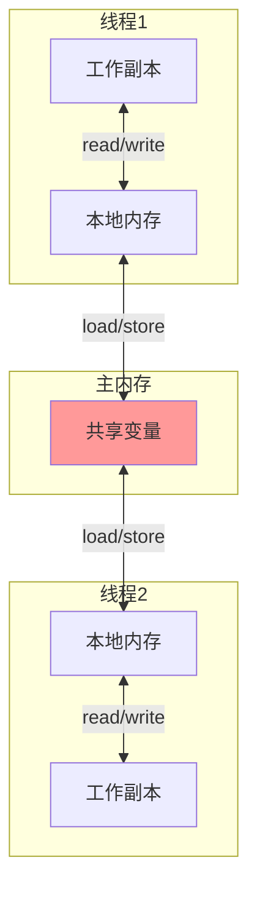
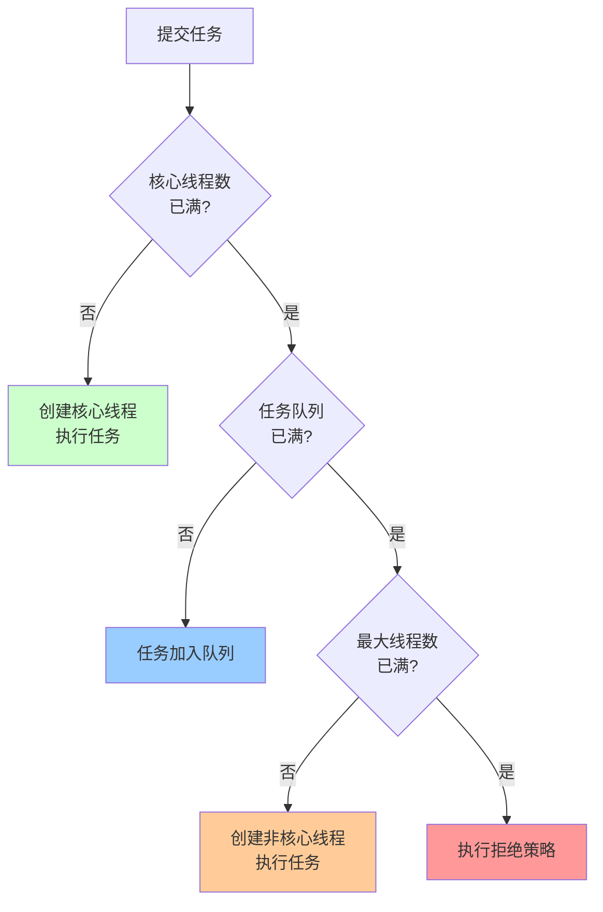

# Java并发编程详解

> 深入理解Java并发机制、线程安全、锁优化、并发工具类

---

## 📋 目录

1. [Java内存模型（JMM）](#1-java内存模型jmm)
2. [synchronized原理](#2-synchronized原理)
3. [volatile原理](#3-volatile原理)
4. [Lock与AQS](#4-lock与aqs)
5. [并发工具类](#5-并发工具类)
6. [线程池详解](#6-线程池详解)
7. [并发实战案例](#7-并发实战案例)

---

## 1. Java内存模型（JMM）

### 1.1 JMM内存模型



### 1.2 JMM三大特性

#### 1.2.1 原子性（Atomicity）
```java
/**
 * 原子性：操作不可分割
 */
public class AtomicityDemo {
    private int count = 0;
    
    // ❌ 非原子操作
    public void increment() {
        count++; // 分为三步：读取、加1、写入
    }
    
    // ✅ 原子操作（synchronized）
    public synchronized void incrementSync() {
        count++;
    }
    
    // ✅ 原子操作（Atomic类）
    private AtomicInteger atomicCount = new AtomicInteger(0);
    public void incrementAtomic() {
        atomicCount.incrementAndGet();
    }
}
```

#### 1.2.2 可见性（Visibility）
```java
/**
 * 可见性：一个线程修改共享变量，其他线程能立即看到
 */
public class VisibilityDemo {
    
    // ❌ 无可见性保证
    private boolean flag = false;
    
    public void writer() {
        flag = true; // 线程1修改
    }
    
    public void reader() {
        while (!flag) {
            // 线程2可能永远看不到flag的变化
        }
    }
    
    // ✅ volatile保证可见性
    private volatile boolean volatileFlag = false;
    
    public void writerVolatile() {
        volatileFlag = true;
    }
    
    public void readerVolatile() {
        while (!volatileFlag) {
            // 能立即看到变化
        }
    }
}
```

#### 1.2.3 有序性（Ordering）
```java
/**
 * 有序性：禁止指令重排序
 */
public class OrderingDemo {
    private int a = 0;
    private boolean flag = false;
    
    // 线程1
    public void writer() {
        a = 1;           // 1
        flag = true;     // 2
        // 可能被重排序为：2 -> 1
    }
    
    // 线程2
    public void reader() {
        if (flag) {      // 3
            int i = a;   // 4
            // 可能读到a=0（因为1、2被重排序）
        }
    }
    
    // ✅ volatile禁止重排序
    private volatile boolean volatileFlag = false;
}
```

### 1.3 happens-before原则

```
1. 程序次序规则：单线程内，按代码顺序执行
2. 锁定规则：unlock先于后续的lock
3. volatile规则：写volatile先于后续的读volatile
4. 传递性：A happens-before B，B happens-before C => A happens-before C
5. 线程启动规则：Thread.start()先于线程的每个动作
6. 线程终止规则：线程所有操作先于Thread.join()返回
7. 中断规则：interrupt()先于检测到中断
8. 对象终结规则：构造函数先于finalize()
```

---

## 2. synchronized原理

### 2.1 synchronized用法

```java
/**
 * synchronized三种用法
 */
public class SynchronizedDemo {
    
    // 1. 修饰实例方法（锁当前实例对象）
    public synchronized void instanceMethod() {
        // 同一实例的线程互斥
    }
    
    // 2. 修饰静态方法（锁Class对象）
    public static synchronized void staticMethod() {
        // 所有实例的线程互斥
    }
    
    // 3. 修饰代码块（锁指定对象）
    private final Object lock = new Object();
    public void blockMethod() {
        synchronized (lock) {
            // 锁lock对象
        }
    }
}
```

### 2.2 synchronized底层原理

#### 对象头结构
```
Java对象内存布局：
├── 对象头 (Object Header)
│   ├── Mark Word（8字节）- 存储锁信息
│   └── Class Pointer（4/8字节）- 类型指针
├── 实例数据 (Instance Data)
└── 对齐填充 (Padding)

Mark Word结构（64位JVM）：
┌─────────────────────────────────────────────────────────────┐
│ 锁状态        │ 25bit      │ 31bit  │ 1bit   │ 4bit  │ 1bit │
├─────────────────────────────────────────────────────────────┤
│ 无锁          │ hashcode               │ age   │ 0  │ 01  │
│ 偏向锁        │ ThreadID │ Epoch │ age   │ 1  │ 01  │
│ 轻量级锁      │ 指向栈中锁记录的指针            │ 00  │
│ 重量级锁      │ 指向Monitor的指针               │ 10  │
│ GC标记        │                                 │ 11  │
└─────────────────────────────────────────────────────────────┘
```

### 2.3 锁升级过程


#### 偏向锁
```
适用场景：锁总是被同一个线程获取
工作原理：
1. 第一次获取锁，在Mark Word记录线程ID
2. 下次该线程再次获取锁，检查ThreadID即可
3. 无需CAS操作，性能最好

撤销条件：
- 其他线程尝试获取锁
- 调用wait()方法
```

#### 轻量级锁
```
适用场景：多线程交替执行，无实际竞争
工作原理：
1. 在线程栈中创建Lock Record
2. CAS将Mark Word复制到Lock Record
3. CAS将Mark Word更新为指向Lock Record的指针
4. 成功则获取锁，失败则自旋

解锁：
1. CAS将Lock Record内容写回Mark Word
2. 成功则释放锁，失败则升级为重量级锁
```

#### 重量级锁
```
适用场景：存在实际竞争
工作原理：
1. 使用操作系统互斥量（Mutex）
2. 线程阻塞，放入等待队列
3. 涉及用户态和内核态切换

性能：最差，但功能最强
```

### 2.4 synchronized优化

```java
/**
 * synchronized锁优化技巧
 */
public class SynchronizedOptimization {
    
    // ❌ 锁粒度太大
    public synchronized void badMethod() {
        // 大量非同步代码
        doSomething();
        // 少量同步代码
        criticalSection();
        // 大量非同步代码
        doSomethingElse();
    }
    
    // ✅ 缩小锁范围
    public void goodMethod() {
        doSomething();
        synchronized (this) {
            criticalSection(); // 只锁关键代码
        }
        doSomethingElse();
    }
    
    // ✅ 锁分离
    private final Object lock1 = new Object();
    private final Object lock2 = new Object();
    
    public void operation1() {
        synchronized (lock1) {
            // 操作1
        }
    }
    
    public void operation2() {
        synchronized (lock2) {
            // 操作2（不互斥）
        }
    }
}
```

---

## 3. volatile原理

### 3.1 volatile特性

```java
/**
 * volatile两大特性
 */
public class VolatileDemo {
    
    // 1. 保证可见性
    private volatile boolean flag = false;
    
    public void setFlag() {
        flag = true; // 立即刷新到主内存
    }
    
    public void checkFlag() {
        if (flag) {  // 从主内存读取最新值
            // ...
        }
    }
    
    // 2. 禁止指令重排序
    private int a = 0;
    private volatile boolean initialized = false;
    
    public void writer() {
        a = 1;                  // 1
        initialized = true;     // 2（volatile写）
        // 1一定在2之前执行
    }
    
    public void reader() {
        if (initialized) {      // 3（volatile读）
            int b = a;          // 4
            // 3一定在4之前执行，且能读到a=1
        }
    }
}
```

### 3.2 内存屏障

```
volatile写操作：
┌─────────────┐
│ StoreStore  │ 禁止前面的普通写和后面的volatile写重排序
├─────────────┤
│ volatile写  │
├─────────────┤
│ StoreLoad   │ 禁止volatile写和后面的volatile读/写重排序
└─────────────┘

volatile读操作：
┌─────────────┐
│ LoadLoad    │ 禁止volatile读和后面的普通读重排序
├─────────────┤
│ volatile读  │
├─────────────┤
│ LoadStore   │ 禁止volatile读和后面的普通写重排序
└─────────────┘
```

### 3.3 volatile vs synchronized

```
┌──────────────┬──────────┬──────────┬──────────┐
│ 特性         │ volatile │ synchronized │ 建议 │
├──────────────┼──────────┼──────────┼──────────┤
│ 原子性       │ ❌       │ ✅        │          │
│ 可见性       │ ✅       │ ✅        │          │
│ 有序性       │ ✅       │ ✅        │          │
│ 阻塞         │ 不阻塞    │ 可能阻塞  │          │
│ 开销         │ 小       │ 大        │          │
│ 适用场景     │ 状态标志  │ 同步操作  │          │
└──────────────┴──────────┴──────────┴──────────┘
```

### 3.4 volatile应用场景

#### 场景1：状态标志
```java
public class ShutdownDemo {
    private volatile boolean shutdown = false;
    
    public void shutdown() {
        shutdown = true;
    }
    
    public void doWork() {
        while (!shutdown) {
            // 执行任务
        }
    }
}
```

#### 场景2：双重检查锁（DCL）单例
```java
public class Singleton {
    // 必须用volatile，防止指令重排序
    private static volatile Singleton instance;
    
    private Singleton() {}
    
    public static Singleton getInstance() {
        if (instance == null) {              // 1
            synchronized (Singleton.class) { // 2
                if (instance == null) {      // 3
                    instance = new Singleton(); // 4
                }
            }
        }
        return instance;
    }
}

// 为什么需要volatile？
// new Singleton()分为三步：
// 1. 分配内存
// 2. 初始化对象
// 3. 将instance指向内存
// 可能重排序为1->3->2，导致其他线程看到未初始化的对象
```

---

## 4. Lock与AQS

### 4.1 ReentrantLock

```java
/**
 * ReentrantLock使用示例
 */
public class ReentrantLockDemo {
    private final ReentrantLock lock = new ReentrantLock();
    
    // 基本用法
    public void basicUsage() {
        lock.lock();
        try {
            // 临界区代码
        } finally {
            lock.unlock(); // 必须在finally中释放
        }
    }
    
    // 可中断锁
    public void interruptibleLock() throws InterruptedException {
        lock.lockInterruptibly();
        try {
            // 可响应中断
        } finally {
            lock.unlock();
        }
    }
    
    // 尝试获取锁
    public void tryLock() {
        if (lock.tryLock()) {
            try {
                // 获取锁成功
            } finally {
                lock.unlock();
            }
        } else {
            // 获取锁失败，做其他事情
        }
    }
    
    // 超时获取锁
    public void tryLockWithTimeout() throws InterruptedException {
        if (lock.tryLock(3, TimeUnit.SECONDS)) {
            try {
                // 3秒内获取到锁
            } finally {
                lock.unlock();
            }
        } else {
            // 超时未获取到锁
        }
    }
    
    // 公平锁
    private final ReentrantLock fairLock = new ReentrantLock(true);
}
```

### 4.2 ReentrantLock vs synchronized

```
┌────────────────┬──────────────┬──────────────┐
│ 特性           │ synchronized │ ReentrantLock│
├────────────────┼──────────────┼──────────────┤
│ 锁实现         │ JVM实现      │ JDK实现      │
│ 性能           │ 相当         │ 相当         │
│ 可中断         │ ❌           │ ✅           │
│ 超时获取       │ ❌           │ ✅           │
│ 公平锁         │ ❌           │ ✅           │
│ 条件变量       │ 1个（wait）  │ 多个（Condition）│
│ 自动释放       │ ✅           │ ❌（需finally）│
│ 锁信息         │ 无法获取     │ 可获取       │
└────────────────┴──────────────┴──────────────┘

选择建议：
- 优先使用synchronized（简单、自动释放）
- 需要高级功能时使用ReentrantLock
```

### 4.3 ReadWriteLock

```java
/**
 * ReadWriteLock：读写分离锁
 * 读锁：共享锁，多个线程可同时读
 * 写锁：独占锁，只有一个线程可写
 */
public class ReadWriteLockDemo {
    private final ReadWriteLock rwLock = new ReentrantReadWriteLock();
    private final Lock readLock = rwLock.readLock();
    private final Lock writeLock = rwLock.writeLock();
    
    private Map<String, String> cache = new HashMap<>();
    
    // 读操作
    public String get(String key) {
        readLock.lock();
        try {
            return cache.get(key);
        } finally {
            readLock.unlock();
        }
    }
    
    // 写操作
    public void put(String key, String value) {
        writeLock.lock();
        try {
            cache.put(key, value);
        } finally {
            writeLock.unlock();
        }
    }
}
```

### 4.4 AQS原理

```
AQS (AbstractQueuedSynchronizer)

核心思想：
- 状态（state）：表示资源状态
- 队列（FIFO）：等待线程队列
- CAS：修改状态

工作流程：
1. 尝试获取资源（tryAcquire）
2. 失败则加入等待队列
3. 释放资源时唤醒队列中的线程

基于AQS实现的同步器：
✅ ReentrantLock
✅ Semaphore
✅ CountDownLatch
✅ CyclicBarrier
✅ ReentrantReadWriteLock
```

```java
/**
 * 自定义AQS同步器示例
 */
public class MyLock {
    
    private static class Sync extends AbstractQueuedSynchronizer {
        // 尝试获取锁
        @Override
        protected boolean tryAcquire(int arg) {
            if (compareAndSetState(0, 1)) {
                setExclusiveOwnerThread(Thread.currentThread());
                return true;
            }
            return false;
        }
        
        // 尝试释放锁
        @Override
        protected boolean tryRelease(int arg) {
            if (getState() == 0) {
                throw new IllegalMonitorStateException();
            }
            setExclusiveOwnerThread(null);
            setState(0);
            return true;
        }
    }
    
    private final Sync sync = new Sync();
    
    public void lock() {
        sync.acquire(1);
    }
    
    public void unlock() {
        sync.release(1);
    }
}
```

---

## 5. 并发工具类

### 5.1 CountDownLatch

```java
/**
 * CountDownLatch：倒计时门闩
 * 用途：等待多个线程完成
 */
public class CountDownLatchDemo {
    
    // 示例：等待所有Worker线程完成
    public void example() throws InterruptedException {
        int workerCount = 5;
        CountDownLatch latch = new CountDownLatch(workerCount);
        
        // 启动Worker线程
        for (int i = 0; i < workerCount; i++) {
            new Thread(() -> {
                try {
                    // 执行任务
                    doWork();
                } finally {
                    latch.countDown(); // 完成后计数-1
                }
            }).start();
        }
        
        // 等待所有线程完成
        latch.await();
        System.out.println("所有Worker完成");
    }
    
    // 实际应用：并行计算
    public int parallelSum(int[] array) throws InterruptedException {
        int threadCount = 4;
        int chunkSize = array.length / threadCount;
        CountDownLatch latch = new CountDownLatch(threadCount);
        AtomicInteger result = new AtomicInteger(0);
        
        for (int i = 0; i < threadCount; i++) {
            int start = i * chunkSize;
            int end = (i == threadCount - 1) ? array.length : (i + 1) * chunkSize;
            
            new Thread(() -> {
                int sum = 0;
                for (int j = start; j < end; j++) {
                    sum += array[j];
                }
                result.addAndGet(sum);
                latch.countDown();
            }).start();
        }
        
        latch.await();
        return result.get();
    }
}
```

### 5.2 CyclicBarrier

```java
/**
 * CyclicBarrier：循环栅栏
 * 用途：等待所有线程到达屏障点，然后一起继续执行
 */
public class CyclicBarrierDemo {
    
    // 示例：多线程计算后汇总
    public void example() {
        int threadCount = 3;
        CyclicBarrier barrier = new CyclicBarrier(threadCount, () -> {
            // 所有线程到达后执行
            System.out.println("所有线程已到达，开始汇总");
        });
        
        for (int i = 0; i < threadCount; i++) {
            new Thread(() -> {
                try {
                    // 阶段1
                    System.out.println(Thread.currentThread().getName() + " 完成阶段1");
                    barrier.await(); // 等待其他线程
                    
                    // 阶段2
                    System.out.println(Thread.currentThread().getName() + " 完成阶段2");
                    barrier.await();
                    
                } catch (Exception e) {
                    e.printStackTrace();
                }
            }, "Thread-" + i).start();
        }
    }
    
    // CountDownLatch vs CyclicBarrier
    /*
    CountDownLatch：
    - 一次性，计数为0后不能重置
    - 一个或多个线程等待其他线程完成
    - await()阻塞，countDown()不阻塞
    
    CyclicBarrier：
    - 可重复使用（reset()）
    - 所有线程互相等待
    - await()阻塞所有线程
    */
}
```

### 5.3 Semaphore

```java
/**
 * Semaphore：信号量
 * 用途：限制同时访问资源的线程数
 */
public class SemaphoreDemo {
    
    // 示例：数据库连接池
    public static class ConnectionPool {
        private final Semaphore semaphore;
        private final List<Connection> connections;
        
        public ConnectionPool(int poolSize) {
            this.semaphore = new Semaphore(poolSize);
            this.connections = new ArrayList<>(poolSize);
            for (int i = 0; i < poolSize; i++) {
                connections.add(createConnection());
            }
        }
        
        public Connection getConnection() throws InterruptedException {
            semaphore.acquire(); // 获取许可
            return getAvailableConnection();
        }
        
        public void releaseConnection(Connection conn) {
            returnConnection(conn);
            semaphore.release(); // 释放许可
        }
    }
    
    // 实际应用：限流
    public static class RateLimiter {
        private final Semaphore semaphore;
        
        public RateLimiter(int maxConcurrent) {
            this.semaphore = new Semaphore(maxConcurrent);
        }
        
        public void execute(Runnable task) {
            try {
                if (semaphore.tryAcquire(1, TimeUnit.SECONDS)) {
                    try {
                        task.run();
                    } finally {
                        semaphore.release();
                    }
                } else {
                    System.out.println("请求被限流");
                }
            } catch (InterruptedException e) {
                Thread.currentThread().interrupt();
            }
        }
    }
}
```

### 5.4 Exchanger

```java
/**
 * Exchanger：交换器
 * 用途：两个线程之间交换数据
 */
public class ExchangerDemo {
    
    // 示例：生产者-消费者交换缓冲区
    public void example() {
        Exchanger<List<String>> exchanger = new Exchanger<>();
        
        // 生产者
        new Thread(() -> {
            List<String> buffer = new ArrayList<>();
            try {
                for (int i = 0; i < 10; i++) {
                    buffer.add("Data-" + i);
                    if (buffer.size() >= 5) {
                        // 交换缓冲区
                        buffer = exchanger.exchange(buffer);
                    }
                }
            } catch (InterruptedException e) {
                Thread.currentThread().interrupt();
            }
        }, "Producer").start();
        
        // 消费者
        new Thread(() -> {
            List<String> buffer = new ArrayList<>();
            try {
                while (true) {
                    // 交换缓冲区
                    buffer = exchanger.exchange(buffer);
                    // 处理数据
                    for (String data : buffer) {
                        System.out.println("处理: " + data);
                    }
                    buffer.clear();
                }
            } catch (InterruptedException e) {
                Thread.currentThread().interrupt();
            }
        }, "Consumer").start();
    }
}
```

---

## 6. 线程池详解

### 6.1 ThreadPoolExecutor

```java
/**
 * 线程池核心参数
 */
public class ThreadPoolDemo {
    
    // 自定义线程池
    ThreadPoolExecutor executor = new ThreadPoolExecutor(
        5,                      // corePoolSize: 核心线程数
        10,                     // maximumPoolSize: 最大线程数
        60L,                    // keepAliveTime: 空闲线程存活时间
        TimeUnit.SECONDS,       // unit: 时间单位
        new LinkedBlockingQueue<>(100),  // workQueue: 任务队列
        Executors.defaultThreadFactory(), // threadFactory: 线程工厂
        new ThreadPoolExecutor.CallerRunsPolicy() // handler: 拒绝策略
    );
}
```

### 6.2 线程池工作流程



### 6.3 拒绝策略

```java
/**
 * 四种拒绝策略
 */
public class RejectedExecutionHandlerDemo {
    
    // 1. AbortPolicy（默认）：抛出异常
    new ThreadPoolExecutor.AbortPolicy();
    
    // 2. CallerRunsPolicy：调用者线程执行
    new ThreadPoolExecutor.CallerRunsPolicy();
    
    // 3. DiscardPolicy：直接丢弃
    new ThreadPoolExecutor.DiscardPolicy();
    
    // 4. DiscardOldestPolicy：丢弃队列中最老的任务
    new ThreadPoolExecutor.DiscardOldestPolicy();
    
    // 5. 自定义拒绝策略
    RejectedExecutionHandler customHandler = (r, executor) -> {
        // 记录日志
        log.error("Task rejected: {}", r);
        // 存入数据库或Redis
        saveToDatabase(r);
    };
}
```

### 6.4 线程池最佳实践

```java
/**
 * 线程池最佳实践
 */
public class ThreadPoolBestPractices {
    
    // ❌ 不推荐：使用Executors创建
    ExecutorService badPool1 = Executors.newFixedThreadPool(10);
    // 问题：队列无界，可能OOM
    
    ExecutorService badPool2 = Executors.newCachedThreadPool();
    // 问题：最大线程数Integer.MAX_VALUE，可能耗尽系统资源
    
    // ✅ 推荐：手动创建ThreadPoolExecutor
    ThreadPoolExecutor goodPool = new ThreadPoolExecutor(
        10,                          // 核心线程数
        20,                          // 最大线程数
        60L, TimeUnit.SECONDS,       // 空闲线程存活时间
        new ArrayBlockingQueue<>(100), // 有界队列
        new ThreadFactoryBuilder()
            .setNameFormat("my-pool-%d")
            .setDaemon(false)
            .build(),
        new ThreadPoolExecutor.CallerRunsPolicy()
    );
    
    // 线程数设置建议
    /*
    CPU密集型：
    线程数 = CPU核心数 + 1
    
    IO密集型：
    线程数 = CPU核心数 * (1 + IO耗时/CPU耗时)
    = CPU核心数 * 2（经验值）
    
    混合型：
    根据实际情况调整，通过压测确定最优值
    */
    
    // 优雅关闭
    public void shutdown() {
        goodPool.shutdown(); // 不再接受新任务
        try {
            if (!goodPool.awaitTermination(60, TimeUnit.SECONDS)) {
                goodPool.shutdownNow(); // 强制关闭
            }
        } catch (InterruptedException e) {
            goodPool.shutdownNow();
            Thread.currentThread().interrupt();
        }
    }
}
```

---

## 7. 并发实战案例

### 7.1 线程安全的单例模式

```java
/**
 * 五种线程安全的单例模式
 */
public class SingletonPatterns {
    
    // 1. 饿汉式（类加载时初始化）
    static class EagerSingleton {
        private static final EagerSingleton INSTANCE = new EagerSingleton();
        private EagerSingleton() {}
        public static EagerSingleton getInstance() {
            return INSTANCE;
        }
    }
    
    // 2. 懒汉式（synchronized）
    static class LazySingleton {
        private static LazySingleton instance;
        private LazySingleton() {}
        public static synchronized LazySingleton getInstance() {
            if (instance == null) {
                instance = new LazySingleton();
            }
            return instance;
        }
    }
    
    // 3. 双重检查锁（DCL）⭐ 推荐
    static class DCLSingleton {
        private static volatile DCLSingleton instance;
        private DCLSingleton() {}
        public static DCLSingleton getInstance() {
            if (instance == null) {
                synchronized (DCLSingleton.class) {
                    if (instance == null) {
                        instance = new DCLSingleton();
                    }
                }
            }
            return instance;
        }
    }
    
    // 4. 静态内部类 ⭐ 推荐
    static class StaticInnerSingleton {
        private StaticInnerSingleton() {}
        private static class Holder {
            private static final StaticInnerSingleton INSTANCE = 
                new StaticInnerSingleton();
        }
        public static StaticInnerSingleton getInstance() {
            return Holder.INSTANCE;
        }
    }
    
    // 5. 枚举 ⭐ 最推荐
    enum EnumSingleton {
        INSTANCE;
        public void doSomething() {}
    }
}
```

### 7.2 生产者-消费者模式

```java
/**
 * 生产者-消费者模式（多种实现）
 */
public class ProducerConsumerPatterns {
    
    // 1. wait/notify实现
    static class WaitNotifyImpl {
        private final Queue<Integer> queue = new LinkedList<>();
        private final int capacity = 10;
        
        public void produce() throws InterruptedException {
            int value = 0;
            while (true) {
                synchronized (this) {
                    while (queue.size() == capacity) {
                        wait(); // 队列满，等待
                    }
                    queue.offer(value++);
                    System.out.println("生产: " + value);
                    notifyAll(); // 通知消费者
                    Thread.sleep(1000);
                }
            }
        }
        
        public void consume() throws InterruptedException {
            while (true) {
                synchronized (this) {
                    while (queue.isEmpty()) {
                        wait(); // 队列空，等待
                    }
                    int value = queue.poll();
                    System.out.println("消费: " + value);
                    notifyAll(); // 通知生产者
                    Thread.sleep(1000);
                }
            }
        }
    }
    
    // 2. BlockingQueue实现 ⭐ 推荐
    static class BlockingQueueImpl {
        private final BlockingQueue<Integer> queue = 
            new ArrayBlockingQueue<>(10);
        
        public void produce() throws InterruptedException {
            int value = 0;
            while (true) {
                queue.put(value++); // 自动阻塞
                System.out.println("生产: " + value);
                Thread.sleep(1000);
            }
        }
        
        public void consume() throws InterruptedException {
            while (true) {
                int value = queue.take(); // 自动阻塞
                System.out.println("消费: " + value);
                Thread.sleep(1000);
            }
        }
    }
    
    // 3. Condition实现
    static class ConditionImpl {
        private final Lock lock = new ReentrantLock();
        private final Condition notFull = lock.newCondition();
        private final Condition notEmpty = lock.newCondition();
        private final Queue<Integer> queue = new LinkedList<>();
        private final int capacity = 10;
        
        public void produce() throws InterruptedException {
            int value = 0;
            while (true) {
                lock.lock();
                try {
                    while (queue.size() == capacity) {
                        notFull.await();
                    }
                    queue.offer(value++);
                    System.out.println("生产: " + value);
                    notEmpty.signal();
                } finally {
                    lock.unlock();
                }
                Thread.sleep(1000);
            }
        }
        
        public void consume() throws InterruptedException {
            while (true) {
                lock.lock();
                try {
                    while (queue.isEmpty()) {
                        notEmpty.await();
                    }
                    int value = queue.poll();
                    System.out.println("消费: " + value);
                    notFull.signal();
                } finally {
                    lock.unlock();
                }
                Thread.sleep(1000);
            }
        }
    }
}
```

### 7.3 并发容器

```java
/**
 * 并发容器使���示例
 */
public class ConcurrentCollections {
    
    // 1. ConcurrentHashMap
    ConcurrentHashMap<String, String> concurrentMap = new ConcurrentHashMap<>();
    
    // 常用操作
    concurrentMap.put("key", "value");
    concurrentMap.putIfAbsent("key", "value"); // 不存在才put
    concurrentMap.computeIfAbsent("key", k -> "value"); // 计算并put
    
    // 2. CopyOnWriteArrayList（读多写少）
    CopyOnWriteArrayList<String> cowList = new CopyOnWriteArrayList<>();
    cowList.add("item"); // 写时复制
    
    // 3. ConcurrentLinkedQueue
    ConcurrentLinkedQueue<String> queue = new ConcurrentLinkedQueue<>();
    queue.offer("item");
    String item = queue.poll();
    
    // 4. BlockingQueue系列
    // ArrayBlockingQueue：有界队列
    BlockingQueue<String> arrayQueue = new ArrayBlockingQueue<>(100);
    
    // LinkedBlockingQueue：可选有界/无界
    BlockingQueue<String> linkedQueue = new LinkedBlockingQueue<>(100);
    
    // PriorityBlockingQueue：优先级队列
    BlockingQueue<Task> priorityQueue = new PriorityBlockingQueue<>();
    
    // DelayQueue：延迟队列
    BlockingQueue<DelayedTask> delayQueue = new DelayQueue<>();
    
    // SynchronousQueue：不存储元素的队列
    BlockingQueue<String> syncQueue = new SynchronousQueue<>();
}
```

### 7.4 Future与CompletableFuture

```java
/**
 * 异步编程：Future vs CompletableFuture
 */
public class FutureDemo {
    
    ExecutorService executor = Executors.newFixedThreadPool(10);
    
    // 1. Future（JDK 5）
    public void futureExample() throws Exception {
        Future<String> future = executor.submit(() -> {
            Thread.sleep(1000);
            return "Hello Future";
        });
        
        // 阻塞等待结果
        String result = future.get(); // 阻塞
        String result2 = future.get(5, TimeUnit.SECONDS); // 超时等待
        
        // 取消任务
        future.cancel(true);
    }
    
    // 2. CompletableFuture（JDK 8）⭐ 推荐
    public void completableFutureExample() {
        
        // 异步执行
        CompletableFuture<String> future = CompletableFuture.supplyAsync(() -> {
            return "Hello";
        });
        
        // 链式调用
        CompletableFuture<String> result = future
            .thenApply(s -> s + " World")        // 转换
            .thenApply(String::toUpperCase)      // 再转换
            .exceptionally(ex -> "Error")        // 异常处理
            .whenComplete((r, ex) -> {           // 完成时回调
                if (ex != null) {
                    System.out.println("Error: " + ex);
                } else {
                    System.out.println("Result: " + r);
                }
            });
        
        // 组合多个Future
        CompletableFuture<String> future1 = CompletableFuture.supplyAsync(() -> "Hello");
        CompletableFuture<String> future2 = CompletableFuture.supplyAsync(() -> "World");
        
        // 都完成后执行
        CompletableFuture<String> combined = future1.thenCombine(future2, (s1, s2) -> s1 + " " + s2);
        
        // 任意一个完成后执行
        CompletableFuture<String> any = future1.applyToEither(future2, s -> s);
        
        // 等待所有完成
        CompletableFuture.allOf(future1, future2).join();
        
        // 等待任意一个完成
        CompletableFuture.anyOf(future1, future2).join();
    }
}
```

---

## 📚 参考资料

- 📖 《Java并发编程实战》- Brian Goetz
- 📖 《Java并发编程的艺术》- 方腾飞
- 📖 《深入理解Java虚拟机》- 周志明
- 🔗 [JDK并发包文档](https://docs.oracle.com/javase/8/docs/api/java/util/concurrent/package-summary.html)

---

*最后更新：2025-10-27*
