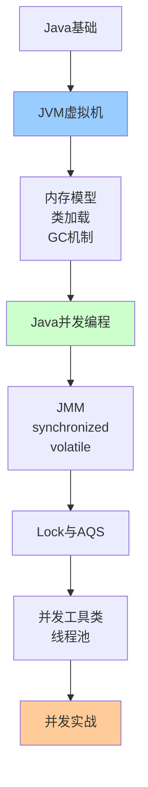

# Java核心机制详解

> 深入理解JVM虚拟机、Java并发编程等核心技术

---

## 📋 文档列表

### 1. Java基础核心原理 ⭐ 新增
📄 [Java基础核心原理.md](./Java基础核心原理.md)

**核心内容**：
- ✅ **面向对象核心**：封装、继承、多态原理
- ✅ **Java类型系统**：基本类型、包装类、自动装箱
- ✅ **字符串深度解析**：不可变性、常量池、intern()
- ✅ **集合框架原理**：ArrayList、LinkedList、HashMap、ConcurrentHashMap
- ✅ **异常处理机制**：Checked vs Unchecked、try-catch-finally
- ✅ **Java IO体系**：字节流、字符流、缓冲流、NIO
- ✅ **反射机制**：Class对象、Method.invoke()原理
- ✅ **泛型原理**：类型擦除、通配符、PECS原则
- ✅ **注解与处理器**：元注解、运行时处理、编译时处理

**核心特性**：
```
集合框架体系：
├── List：ArrayList、LinkedList
├── Set：HashSet、TreeSet
├── Map：HashMap、LinkedHashMap、TreeMap、ConcurrentHashMap
└── Queue：PriorityQueue、ArrayDeque

HashMap核心机制（JDK 8+）：
数组 + 链表 + 红黑树
- 容量必须是2的幂
- 负载因子0.75
- 链表长度≥8转红黑树
- 扩容2倍
```

**适合场景**：
- Java基础巩固
- 面试准备（集合、异常、IO、反射必考）
- 理解Java底层原理
- 框架源码阅读前置知识

**预计阅读时间**：3-4小时

---

### 2. JVM虚拟机详解 ⭐ 推荐
📄 [JVM虚拟机详解.md](./JVM虚拟机详解.md)

**核心内容**：
- ✅ **JVM内存模型**：堆、栈、元空间、程序计数器
- ✅ **类加载机制**：加载、验证、准备、解析、初始化
- ✅ **垃圾回收机制**：标记-清除、标记-复制、标记-整理
- ✅ **垃圾收集器**：G1、CMS、ZGC、Shenandoah
- ✅ **GC调优实战**：参数配置、案例分析
- ✅ **JVM监控与诊断**：jstat、jmap、jstack、Arthas

**核心特性**：
```
JVM内存结构：
├── 堆（Heap）- 对象实例
│   ├── 年轻代（Young Gen）
│   │   ├── Eden - 80%
│   │   ├── Survivor0 - 10%
│   │   └── Survivor1 - 10%
│   └── 老年代（Old Gen）
├── 元空间（MetaSpace）- 类元数据
├── 虚拟机栈（Stack）- 方法调用
├── 本地方法栈 - Native方法
└── 程序计数器（PC）- 字节码行号
```

**锁升级过程**：
```
无锁 → 偏向锁 → 轻量级锁 → 重量级锁
```

**适合场景**：
- JVM性能调优
- 内存溢出排查
- GC问题分析
- 面试准备

---

### 3. Java并发编程详解 ⭐ 推荐
📄 [Java并发编程详解.md](./Java并发编程详解.md)

**核心内容**：
- ✅ **Java内存模型（JMM）**：原子性、可见性、有序性
- ✅ **synchronized原理**：锁升级、对象头、Monitor
- ✅ **volatile原理**：内存屏障、禁止重排序
- ✅ **Lock与AQS**：ReentrantLock、ReadWriteLock、AQS实现
- ✅ **并发工具类**：CountDownLatch、CyclicBarrier、Semaphore
- ✅ **线程池详解**：ThreadPoolExecutor、拒绝策略、最佳实践
- ✅ **并发实战案例**：单例模式、生产者消费者、Future

**核心特性**：
```
JMM三大特性：
✅ 原子性（Atomicity）
✅ 可见性（Visibility）
✅ 有序性（Ordering）

happens-before原则：
✅ 程序次序规则
✅ 锁定规则
✅ volatile规则
✅ 传递性
✅ 线程启动规则
✅ 线程终止规则
```

**synchronized vs ReentrantLock**：
| 特性 | synchronized | ReentrantLock |
|------|--------------|---------------|
| 锁实现 | JVM实现 | JDK实现 |
| 可中断 | ❌ | ✅ |
| 超时获取 | ❌ | ✅ |
| 公平锁 | ❌ | ✅ |
| 条件变量 | 1个 | 多个 |
| 自动释放 | ✅ | ❌ |

**适合场景**：
- 多线程编程
- 并发问题排查
- 性能优化
- 面试准备

---

## 🎯 学习路径



**推荐顺序**：
1. 先学习《Java基础核心原理》，打牢基础（面向对象、集合、IO、反射）
2. 再学习《JVM虚拟机详解》，理解Java运行原理
3. 最后学习《Java并发编程详解》，掌握并发编程
4. 结合实际项目应用

---

## 💡 核心知识点速查

### Java基础相关

**Q1: HashMap的底层原理是什么？**
- 答：数组+链表+红黑树（JDK 8+），容量2的幂，负载因子0.75，链表长度≥8转红黑树
- 详见：[Java基础核心原理.md](./Java基础核心原理.md#54-hashmap核心原理)

**Q2: String为什么是不可变的？**
- 答：char[]被final修饰，没有修改方法，保证线程安全、字符串常量池、HashCode缓存
- 详见：[Java基础核心原理.md](./Java基础核心原理.md#41-string核心特性)

**Q3: ArrayList和LinkedList的区别？**
- 答：ArrayList基于数组（查询O(1)），LinkedList基于双向链表（插入O(1)）
- 详见：[Java基础核心原理.md](./Java基础核心原理.md#52-arraylist核心原理)

**Q4: ConcurrentHashMap如何实现线程安全？**
- 答：JDK 8使用CAS+synchronized，锁粒度小（锁到Node），支持并发扩容
- 详见：[Java基础核心原理.md](./Java基础核心原理.md#57-concurrenthashmap原理)

**Q5: 泛型的类型擦除是什么？**
- 答：编译后泛型信息被擦除，T替换为Object或上界，编译器自动插入强转
- 详见：[Java基础核心原理.md](./Java基础核心原理.md#92-类型擦除)

**Q6: 反射的原理是什么？**
- 答：运行时动态获取Class对象，通过Method.invoke()调用方法，前15次JNI，后续生成字节码
- 详见：[Java基础核心原理.md](./Java基础核心原理.md#8-反射机制)

### JVM相关

**Q1: JVM内存结构是怎样的？**
- 答：堆（对象实例）+ 元空间（类元数据）+ 栈（方法调用）+ PC（程序计数器）
- 详见：[JVM虚拟机详解.md](./JVM虚拟机详解.md#11-运行时数据区)

**Q2: GC是如何工作的？**
- 答：标记-清除、标记-复制、标记-整理三种算法，分代收集
- 详见：[JVM虚拟机详解.md](./JVM虚拟机详解.md#33-垃圾回收算法)

**Q3: 如何排查内存溢出？**
- 答：jmap生成堆转储 → MAT分析 → 查找泄漏点
- 详见：[JVM虚拟机详解.md](./JVM虚拟机详解.md#43-调优案例)

**Q4: synchronized锁是如何升级的？**
- 答：无锁 → 偏向锁 → 轻量级锁 → 重量级锁
- 详见：[JVM虚拟机详解.md](./JVM虚拟机详解.md#23-锁升级过程)

**Q5: 如何进行GC调优？**
- 答：选择合适的垃圾收集器（G1推荐）+ 调整堆大小 + 分析GC日志
- 详见：[JVM虚拟机详解.md](./JVM虚拟机详解.md#4-gc调优实战)

### 并发相关

**Q1: volatile是如何保证可见性的？**
- 答：通过内存屏障，强制读写主内存，禁止指令重排序
- 详见：[Java并发编程详解.md](./Java并发编程详解.md#31-volatile特性)

**Q2: synchronized和ReentrantLock如何选择？**
- 答：优先synchronized（简单），需要高级功能用ReentrantLock
- 详见：[Java并发编程详解.md](./Java并发编程详解.md#42-reentrantlock-vs-synchronized)

**Q3: 什么是AQS？**
- 答：AbstractQueuedSynchronizer，是Lock、Semaphore等的基础
- 详见：[Java并发编程详解.md](./Java并发编程详解.md#44-aqs原理)

**Q4: 线程池如何配置？**
- 答：CPU密集型=核心数+1，IO密集型=核心数*2，使用有界队列
- 详见：[Java并发编程详解.md](./Java并发编程详解.md#64-线程池最佳实践)

**Q5: 如何实现线程安全的单例？**
- 答：推荐双重检查锁（DCL）、静态内部类、枚举
- 详见：[Java并发编程详解.md](./Java并发编程详解.md#71-线程安全的单例模式)

---

## 🛠️ 实战工具箱

### JVM诊断工具

```bash
# 1. 查看JVM参数
jinfo -flags <pid>

# 2. 查看GC情况
jstat -gc <pid> 1000 10

# 3. 生成堆转储
jmap -dump:format=b,file=heap.hprof <pid>

# 4. 查看线程栈
jstack <pid> > thread.txt

# 5. Arthas诊断
java -jar arthas-boot.jar
dashboard    # 实时监控
thread       # 线程分析
heapdump     # 堆转储
```

### 并发调试技巧

```java
// 1. 查看线程状态
Thread.currentThread().getState()

// 2. 打印线程堆栈
Thread.currentThread().getStackTrace()

// 3. 检测死锁
ThreadMXBean tmx = ManagementFactory.getThreadMXBean();
long[] deadlockedThreads = tmx.findDeadlockedThreads();

// 4. 监控线程池
ThreadPoolExecutor executor = ...;
executor.getPoolSize();       // 当前线程数
executor.getActiveCount();    // 活动线程数
executor.getCompletedTaskCount(); // 完成任务数
executor.getTaskCount();      // 总任务数
```

---

## 📊 性能优化

### JVM优化

**堆内存配置**：
```bash
# 建议Xms=Xmx，避免动态扩容
-Xms4g -Xmx4g

# 年轻代大小（堆的1/3到1/2）
-Xmn2g

# G1收集器（推荐）
-XX:+UseG1GC
-XX:MaxGCPauseMillis=200
```

**GC日志**：
```bash
# JDK 8
-XX:+PrintGCDetails
-XX:+PrintGCDateStamps
-Xloggc:/var/log/gc.log

# JDK 9+
-Xlog:gc*:file=/var/log/gc.log:time,level,tags
```

### 并发优化

**减少锁竞争**：
```java
// ❌ 锁粒度太大
public synchronized void method() {
    doA();
    doB(); // 只有这里需要同步
    doC();
}

// ✅ 缩小锁范围
public void method() {
    doA();
    synchronized (this) {
        doB();
    }
    doC();
}

// ✅ 锁分离
private final Object lock1 = new Object();
private final Object lock2 = new Object();

public void operation1() {
    synchronized (lock1) { /* ... */ }
}

public void operation2() {
    synchronized (lock2) { /* ... */ } // 不互斥
}
```

**使用并发容器**：
```java
// ❌ 同步容器
Map<String, String> map = Collections.synchronizedMap(new HashMap<>());

// ✅ 并发容器
ConcurrentHashMap<String, String> concurrentMap = new ConcurrentHashMap<>();
```

---

## 🚨 常见问题

### 1️⃣ OutOfMemoryError

**Java heap space**：
```
原因：堆内存不足
解决：
1. 增加堆内存：-Xmx4g
2. 排查内存泄漏（MAT分析）
3. 优化代码，减少对象创建
```

**GC overhead limit exceeded**：
```
原因：GC占用时间过多（超过98%）
解决：
1. 增加堆内存
2. 优化代码
3. -XX:-UseGCOverheadLimit（不推荐）
```

**Metaspace**：
```
原因：元空间不足（类太多）
解决：
1. 增加元空间：-XX:MaxMetaspaceSize=512m
2. 启用类卸载：-XX:+CMSClassUnloadingEnabled
```

### 2️⃣ StackOverflowError

```
原因：
1. 递归调用过深
2. 线程栈空间不足

解决：
1. 检查递归终止条件
2. 增加栈空间：-Xss512k
3. 优化递归为循环
```

### 3️⃣ 死锁

```bash
# 排查方法
jstack <pid> | grep "deadlock"

# 预防死锁
1. 按顺序获取锁
2. 使用tryLock()超时获取
3. 使用Lock.lockInterruptibly()可中断锁
```

### 4️⃣ 高CPU占用

```bash
# 排查步骤
1. top 找到Java进程
2. top -Hp <pid> 找到占用CPU高的线程
3. printf "%x\n" <线程ID> 转为16进制
4. jstack <pid> | grep <16进制ID> -A 20

# 常见原因：
- 死循环
- 频繁GC
- 正则表达式回溯
```

---

## 🔗 相关资源

- 📚 《深入理解Java虚拟机（第3版）》- 周志明
- 📚 《Java并发编程实战》- Brian Goetz
- 📚 《Java并发编程的艺术》- 方腾飞
- 📚 《Java性能权威指南》- Scott Oaks
- 🔗 [Oracle JVM规范](https://docs.oracle.com/javase/specs/jvms/se11/html/)
- 🔗 [JDK并发包文档](https://docs.oracle.com/javase/8/docs/api/java/util/concurrent/package-summary.html)

---

## 🔄 持续更新

- [x] Java基础核心原理（2025-10-27新增）✅
- [x] JVM虚拟机详解 ✅
- [x] Java并发编程详解 ✅
- [ ] Java NIO深度解析（计划中）
- [ ] Java动态代理详解（计划中）
- [ ] Java注解与字节码（计划中）

---

*最后更新：2025-10-27*

