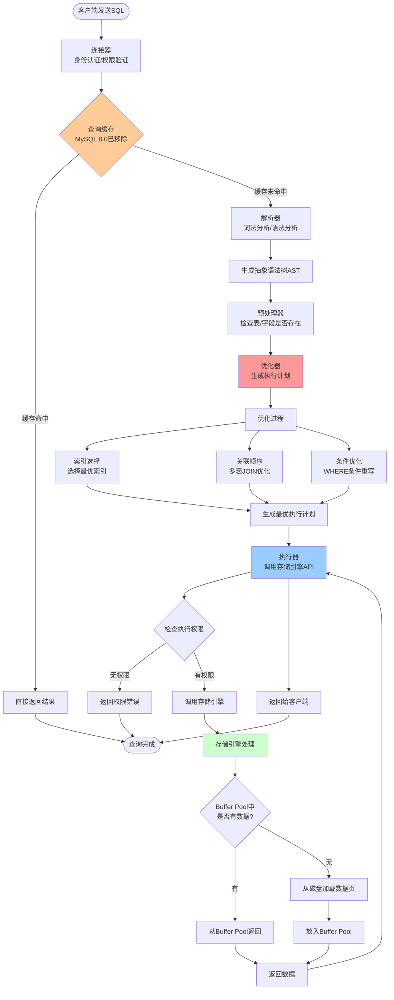
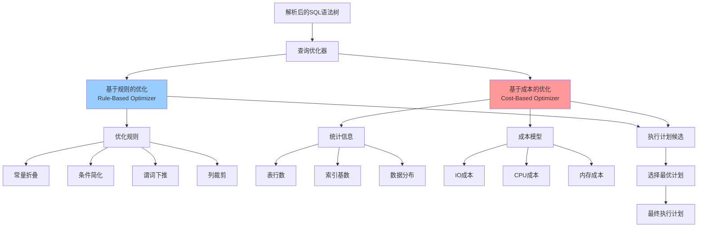
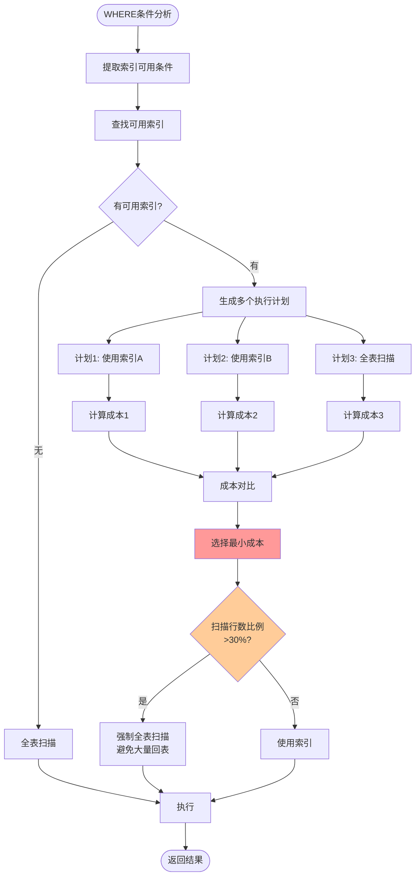
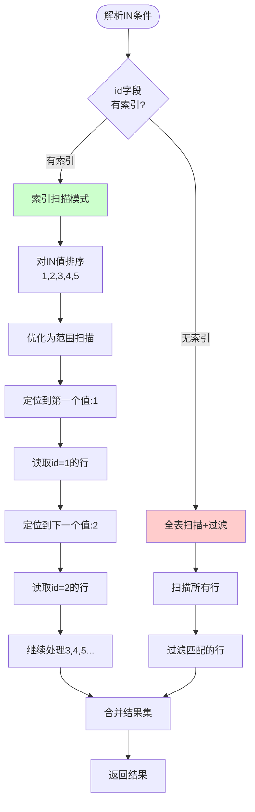
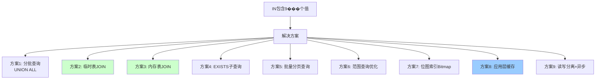
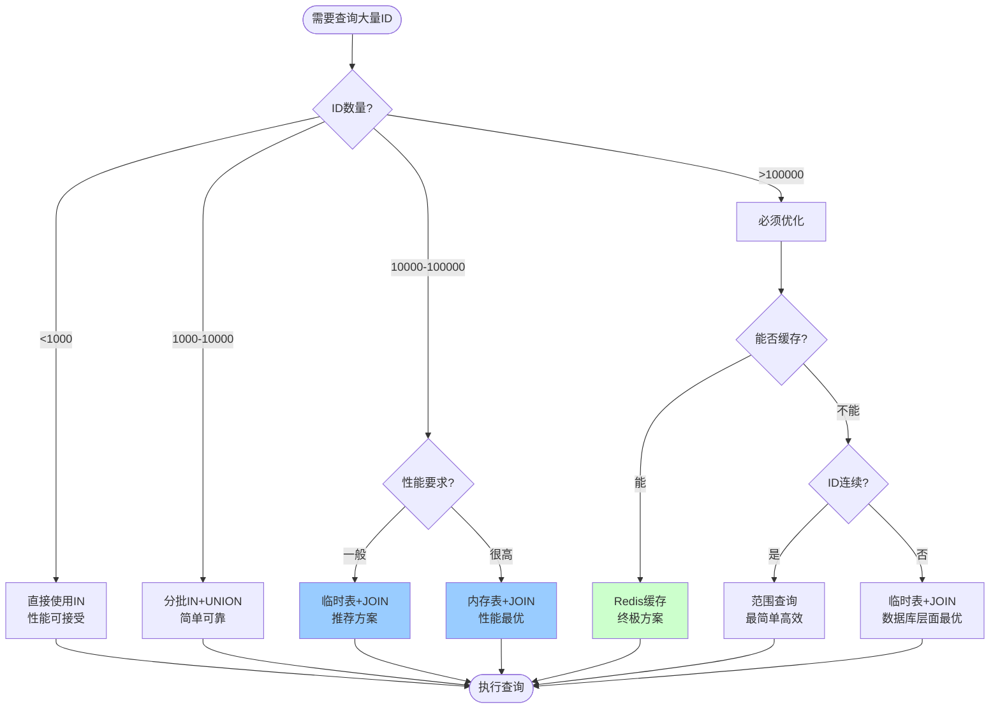

# MySQL查询核心机制详解

> 深入理解MySQL查询执行流程、优化器原理、索引选择机制，以及大数据量IN()查询的优化方案

---

## 📑 目录

1. [MySQL查询执行全流程](#1-mysql查询执行全流程)
2. [查询优化器原理](#2-查询优化器原理)
3. [索引选择机制](#3-索引选择机制)
4. [IN()子句核心机制](#4-in子句核心机制)
5. [IN()包含大量值问题与解决方案](#5-in包含大量值问题与解决方案)
6. [性能测试与对比](#6-性能测试与对比)

---

## 1. MySQL查询执行全流程

### 1.1 完整执行流程



### 1.2 各阶段详解

#### 1️⃣ 连接器（Connector）
```sql
-- 连接数据库
mysql -h host -P port -u user -p

-- 查看连接状态
SHOW PROCESSLIST;

-- 设置连接超时时间（默认8小时）
SET wait_timeout = 28800;
```

**功能**：
- TCP连接建立
- 身份认证（用户名/密码）
- 权限获取和缓存
- 连接池管理

---

#### 2️⃣ 查询缓存（Query Cache）- MySQL 8.0已移除
**为什么移除**：
- 命中率低（任何表更新都会清空相关缓存）
- 维护成本高
- 对写操作性能有负面影响

**替代方案**：
- 应用层缓存（Redis）
- 结果集缓存

---

#### 3️⃣ 解析器（Parser）

**词法分析**：
```sql
SELECT id, name FROM user WHERE age > 18;

-- 分解为Token：
-- SELECT（关键字）
-- id, name（标识符）
-- FROM（关键字）
-- user（表名）
-- WHERE（关键字）
-- age > 18（条件表达式）
```

**语法分析**：
- 检查SQL语法是否正确
- 生成语法树（Parse Tree）

**常见语法错误**：
```sql
-- 错误示例
SELECT FROM user;  -- 缺少字段
SELECT * user;     -- 缺少FROM
SELECT * FROM;     -- 缺少表名
```

---

#### 4️⃣ 预处理器（Preprocessor）

**功能**：
- 检查表是否存在
- 检查字段是否存在
- 检查用户权限
- 扩展视图定义
- 扩展`*`为具体字段

```sql
-- 预处理前
SELECT * FROM user;

-- 预处理后（假设user表有id, name, age三个字段）
SELECT id, name, age FROM user;
```

---

#### 5️⃣ 优化器（Optimizer）⭐⭐⭐⭐⭐

**MySQL优化器的核心职责**：
1. **索引选择**：选择最优索引
2. **JOIN顺序优化**：确定表关联顺序
3. **子查询优化**：转换为JOIN或物化
4. **条件下推**：将WHERE条件推到存储引擎
5. **分组优化**：GROUP BY优化
6. **排序优化**：ORDER BY优化

**示例**：
```sql
-- 原始SQL
SELECT * FROM t1 
JOIN t2 ON t1.id = t2.t1_id 
WHERE t1.age > 18 AND t2.status = 1;

-- 优化器可能做的优化：
-- 1. 选择t1.age索引
-- 2. 选择t2.status索引
-- 3. 决定先扫描t1还是t2
-- 4. 决定使用Index Nested-Loop Join还是Hash Join
```

---

#### 6️⃣ 执行器（Executor）

**执行流程**：
```python
# 伪代码
def execute_query(sql, execution_plan):
    # 1. 检查权限
    if not check_permission(current_user, table_name):
        raise PermissionError
    
    # 2. 打开表
    table = open_table(table_name)
    
    # 3. 根据执行计划调用存储引擎
    if execution_plan.index:
        # 使用索引扫描
        rows = engine.index_scan(index_name, condition)
    else:
        # 全表扫描
        rows = engine.full_scan(table_name)
    
    # 4. 过滤数据
    result = filter_rows(rows, where_condition)
    
    # 5. 返回结果
    return result
```

**执行器类型**：
- **Simple Executor**：简单查询
- **Join Executor**：关联查询
- **Aggregate Executor**：聚合查询
- **Sort Executor**：排序查询

---

## 2. 查询优化器原理

### 2.1 优化器架构



### 2.2 基于规则的优化（RBO）

#### 常见优化规则：

**1. 常量折叠（Constant Folding）**
```sql
-- 优化前
SELECT * FROM user WHERE age > 10 + 8;

-- 优化后
SELECT * FROM user WHERE age > 18;
```

**2. 条件简化**
```sql
-- 优化前
SELECT * FROM user WHERE age > 18 AND age > 18;

-- 优化后
SELECT * FROM user WHERE age > 18;
```

**3. 谓词下推（Predicate Pushdown）**
```sql
-- 优化前
SELECT * FROM (SELECT * FROM user) t WHERE t.age > 18;

-- 优化后（将WHERE条件推到子查询）
SELECT * FROM (SELECT * FROM user WHERE age > 18) t;
```

**4. 列裁剪（Column Pruning）**
```sql
-- 优化前
SELECT name FROM (SELECT id, name, age FROM user) t;

-- 优化后（只查询需要的列）
SELECT name FROM (SELECT name FROM user) t;
```

**5. 外连接转内连接**
```sql
-- 优化前
SELECT * FROM t1 LEFT JOIN t2 ON t1.id = t2.t1_id 
WHERE t2.status = 1;

-- 优化后（t2.status = 1保证t2不为NULL，可转为INNER JOIN）
SELECT * FROM t1 INNER JOIN t2 ON t1.id = t2.t1_id 
WHERE t2.status = 1;
```

---

### 2.3 基于成本的优化（CBO）

#### 成本计算公式：
```
总成本 = IO成本 + CPU成本

IO成本 = 读取的数据页数 × 单页IO成本（默认1.0）
CPU成本 = 处理的行数 × 单行CPU成本（��认0.2）
```

#### 示例：索引选择

假设表`user`有100万行数据：
- 主键索引：`PRIMARY KEY (id)`
- 普通索引：`KEY idx_age (age)`

```sql
SELECT * FROM user WHERE age = 18 AND id < 1000;
```

**方案1：使用idx_age索引**
```
-- 假设age=18的数据有5000行
IO成本 = 扫描索引页(100页) + 回表查询数据页(5000页) = 5100页
CPU成本 = 处理5000行 × 0.2 = 1000
总成本 = 5100 + 1000 = 6100
```

**方案2：使用PRIMARY索引**
```
-- id < 1000，扫描1000行
IO成本 = 扫描数据页(100页)
CPU成本 = 处理1000行 × 0.2 = 200
总成本 = 100 + 200 = 300
```

**优化器选择**：方案2（成本更低）

---

### 2.4 统计信息的重要性

```sql
-- 查看表统计信息
SHOW TABLE STATUS LIKE 'user';

-- 查看索引统计信息
SHOW INDEX FROM user;

-- 更新统计信息（重要！）
ANALYZE TABLE user;

-- 查看索引基数（Cardinality）
SELECT 
    TABLE_NAME,
    INDEX_NAME,
    CARDINALITY,
    SUB_PART
FROM information_schema.STATISTICS
WHERE TABLE_SCHEMA = 'your_db' AND TABLE_NAME = 'user';
```

**统计信息不准确的影响**：
```sql
-- 假设统计信息显示age=18的数据只有10行（实际5000行）
-- 优化器可能错误选择idx_age索引
-- 导致大量回表，性能下降
```

---

## 3. 索引选择机制

### 3.1 索引选择流程



### 3.2 索引失效场景

#### ❌ 场景1：对索引列进行函数操作
```sql
-- ❌ 索引失效
SELECT * FROM user WHERE YEAR(create_time) = 2024;

-- ✅ 索引生效
SELECT * FROM user 
WHERE create_time >= '2024-01-01' 
  AND create_time < '2025-01-01';
```

#### ❌ 场景2：隐式类型转换
```sql
-- 假设phone字段是VARCHAR类型
-- ❌ 索引失效（字符串 → 数字转换）
SELECT * FROM user WHERE phone = 13800138000;

-- ✅ 索引生效
SELECT * FROM user WHERE phone = '13800138000';
```

#### ❌ 场景3：LIKE左模糊查询
```sql
-- ❌ 索引失效
SELECT * FROM user WHERE name LIKE '%张%';

-- ✅ 索引生效（右模糊）
SELECT * FROM user WHERE name LIKE '张%';
```

#### ❌ 场景4：OR条件中有未索引字段
```sql
-- 假设age有索引，gender无索引
-- ❌ 索引失效
SELECT * FROM user WHERE age = 18 OR gender = 'M';

-- ✅ 都有索引才能使用索引
-- 方案1：给gender也加索引
-- 方案2：改写为UNION
SELECT * FROM user WHERE age = 18
UNION
SELECT * FROM user WHERE gender = 'M';
```

#### ❌ 场景5：联合索引不满足最左前缀
```sql
-- 联合索引：KEY idx_abc (a, b, c)

-- ✅ 使用索引
SELECT * FROM t WHERE a = 1;                    -- 使用a
SELECT * FROM t WHERE a = 1 AND b = 2;          -- 使用a,b
SELECT * FROM t WHERE a = 1 AND b = 2 AND c = 3; -- 使用a,b,c

-- ❌ 索引失效
SELECT * FROM t WHERE b = 2;                    -- 缺少a
SELECT * FROM t WHERE c = 3;                    -- 缺少a
SELECT * FROM t WHERE b = 2 AND c = 3;          -- 缺少a
```

#### ❌ 场景6：范围查询后的字段
```sql
-- 联合索引：KEY idx_abc (a, b, c)

-- 使用a,b索引，c不使用（b是范围查询）
SELECT * FROM t WHERE a = 1 AND b > 2 AND c = 3;

-- 优化：调整索引顺序
ALTER TABLE t ADD INDEX idx_acb (a, c, b);
-- 使用a,c,b索引
SELECT * FROM t WHERE a = 1 AND c = 3 AND b > 2;
```

---

### 3.3 强制使用索引

```sql
-- 强制使用指定索引
SELECT * FROM user FORCE INDEX(idx_age) WHERE age = 18;

-- 建议使用索引（优化器可能忽略）
SELECT * FROM user USE INDEX(idx_age) WHERE age = 18;

-- 忽略索引
SELECT * FROM user IGNORE INDEX(idx_age) WHERE age = 18;
```

---

## 4. IN()子句核心机制

### 4.1 IN()的执行原理

#### 基本执行方式

```sql
SELECT * FROM user WHERE id IN (1, 2, 3, 4, 5);
```

**执行过程**：


### 4.2 IN() vs OR 的区别

```sql
-- 方式1：使用IN
SELECT * FROM user WHERE id IN (1, 2, 3, 4, 5);

-- 方式2：使用OR
SELECT * FROM user WHERE id = 1 OR id = 2 OR id = 3 OR id = 4 OR id = 5;
```

**执行计划对比**：
```sql
-- 使用EXPLAIN查看
EXPLAIN SELECT * FROM user WHERE id IN (1, 2, 3, 4, 5);
-- type: range
-- key: PRIMARY
-- Extra: Using where

EXPLAIN SELECT * FROM user WHERE id = 1 OR id = 2 OR id = 3 OR id = 4 OR id = 5;
-- type: range
-- key: PRIMARY
-- Extra: Using where
```

**结论**：
- ✅ 两者执行计划相同，性能相近
- ✅ IN更简洁易读
- ✅ IN支持子查询：`WHERE id IN (SELECT user_id FROM orders)`

---

### 4.3 IN()子查询优化

```sql
-- ❌ 低效写法（相关子查询，N次执行）
SELECT * FROM t1 
WHERE id IN (SELECT t1_id FROM t2 WHERE t2.status = 1);

-- 优化器可能改写为EXISTS
SELECT * FROM t1 
WHERE EXISTS (
    SELECT 1 FROM t2 
    WHERE t2.t1_id = t1.id AND t2.status = 1
);

-- 或者改写为JOIN（推荐）
SELECT t1.* FROM t1 
INNER JOIN t2 ON t1.id = t2.t1_id 
WHERE t2.status = 1;
```

---

## 5. IN()包含大量值问题与解决方案

### 5.1 问题分析

当IN()包含大量值时（如9万条数据），会遇到以下问题：

#### 问题1：SQL语句过长
```sql
-- SQL长度可能达到几MB甚至几十MB
SELECT * FROM user WHERE id IN (1, 2, 3, ..., 90000);
```

**影响**：
- ❌ 超过`max_allowed_packet`限制（默认4MB）
- ❌ 解析SQL耗时增加
- ❌ 网络传输慢
- ❌ 内存占用大

```sql
-- 查看max_allowed_packet限制
SHOW VARIABLES LIKE 'max_allowed_packet';
-- 默认：4194304 (4MB)

-- 临时调整（不推荐生产环境）
SET GLOBAL max_allowed_packet = 67108864; -- 64MB
```

#### 问题2：优化器性能下降
```sql
-- 优化器需要：
-- 1. 对9万个值进行排序
-- 2. 去重
-- 3. 计算索引扫描成本
-- 4. 可能生成很大的临时结果集
```

#### 问题3：索引效率下降
```sql
-- 9万次索引查找 + 可能的9万次回表
-- 即使使用索引，也可能不如全表扫描
```

---

### 5.2 解决方案汇总



---

### 5.3 方案1：分批查询 + UNION ALL ⭐⭐⭐

**原理**：将9万个值分成多批，每批1000个，分别查询后合并。

```sql
-- 分成90批，每批1000个
SELECT * FROM user WHERE id IN (1, 2, ..., 1000)
UNION ALL
SELECT * FROM user WHERE id IN (1001, 1002, ..., 2000)
UNION ALL
SELECT * FROM user WHERE id IN (2001, 2002, ..., 3000)
-- ...
UNION ALL
SELECT * FROM user WHERE id IN (89001, 89002, ..., 90000);
```

**Java实现**：
```java
public List<User> queryByIdsInBatch(List<Long> ids) {
    int batchSize = 1000;
    List<User> result = new ArrayList<>();
    
    // 分批处理
    for (int i = 0; i < ids.size(); i += batchSize) {
        int end = Math.min(i + batchSize, ids.size());
        List<Long> batchIds = ids.subList(i, end);
        
        // 执行查询
        List<User> batchResult = userMapper.selectByIds(batchIds);
        result.addAll(batchResult);
    }
    
    return result;
}
```

**MyBatis XML**：
```xml
<select id="selectByIds" resultType="User">
    SELECT * FROM user
    WHERE id IN
    <foreach collection="list" item="id" open="(" separator="," close=")">
        #{id}
    </foreach>
</select>
```

**优点**：
- ✅ 简单易实现
- ✅ 避免SQL过长
- ✅ 每批查询都能使用索引

**缺点**：
- ❌ 需要多次查询（90次）
- ❌ 网络往返次数多
- ❌ 总耗时较长

**适用场景**：
- 数据量不是特别大（1-5万）
- 网络延迟较低
- 实时性要求不高

---

### 5.4 方案2：临时表 + JOIN ⭐⭐⭐⭐⭐（推荐）

**原理**：将9万个ID插入临时表，然后JOIN查询。

#### 方式A：使用普通临时表

```sql
-- 1. 创建临时表
CREATE TEMPORARY TABLE tmp_user_ids (
    id BIGINT PRIMARY KEY
) ENGINE=InnoDB;

-- 2. 批量插入ID（分批插入，避免单次插入过多）
INSERT INTO tmp_user_ids VALUES 
(1), (2), (3), ..., (1000);  -- 第1批
-- ...重复插入，直到9万个ID全部插入

-- 3. JOIN查询
SELECT u.* 
FROM user u
INNER JOIN tmp_user_ids t ON u.id = t.id;

-- 4. 删除临时表（可选，会话结束自动删除）
DROP TEMPORARY TABLE IF EXISTS tmp_user_ids;
```

#### 方式B：使用VALUES子句（MySQL 8.0.19+）

```sql
-- 更优雅的写法，但仍需要分批
SELECT u.*
FROM user u
INNER JOIN (
    VALUES ROW(1), ROW(2), ROW(3), ..., ROW(1000)
) AS t(id) ON u.id = t.id;
```

**Java实现（完整版）**：
```java
@Service
public class UserService {
    
    @Autowired
    private JdbcTemplate jdbcTemplate;
    
    @Autowired
    private UserMapper userMapper;
    
    /**
     * 临时表方案：查询大量ID
     * @param ids 9万个ID
     * @return 用户列表
     */
    @Transactional
    public List<User> queryByTempTable(List<Long> ids) {
        if (ids == null || ids.isEmpty()) {
            return Collections.emptyList();
        }
        
        try {
            // 1. 创建临时表
            String createTableSql = 
                "CREATE TEMPORARY TABLE tmp_user_ids_" + 
                System.currentTimeMillis() + " (" +
                "  id BIGINT PRIMARY KEY" +
                ") ENGINE=MEMORY"; // 使用MEMORY引擎更快
            jdbcTemplate.execute(createTableSql);
            
            // 2. 分批插入ID（每批10000个）
            int batchSize = 10000;
            String tableName = "tmp_user_ids_" + System.currentTimeMillis();
            
            for (int i = 0; i < ids.size(); i += batchSize) {
                int end = Math.min(i + batchSize, ids.size());
                List<Long> batchIds = ids.subList(i, end);
                
                batchInsertIds(tableName, batchIds);
            }
            
            // 3. JOIN查询
            String querySql = String.format(
                "SELECT u.* FROM user u " +
                "INNER JOIN %s t ON u.id = t.id",
                tableName
            );
            
            List<User> result = jdbcTemplate.query(
                querySql, 
                new BeanPropertyRowMapper<>(User.class)
            );
            
            // 4. 删除临时表
            jdbcTemplate.execute("DROP TEMPORARY TABLE IF EXISTS " + tableName);
            
            return result;
            
        } catch (Exception e) {
            log.error("临时表查询失败", e);
            throw new RuntimeException("查询失败", e);
        }
    }
    
    /**
     * 批量插入ID到临时表
     */
    private void batchInsertIds(String tableName, List<Long> ids) {
        String sql = String.format(
            "INSERT INTO %s (id) VALUES (?)",
            tableName
        );
        
        jdbcTemplate.batchUpdate(sql, new BatchPreparedStatementSetter() {
            @Override
            public void setValues(PreparedStatement ps, int i) throws SQLException {
                ps.setLong(1, ids.get(i));
            }
            
            @Override
            public int getBatchSize() {
                return ids.size();
            }
        });
    }
}
```

**MyBatis实现**：
```java
@Mapper
public interface UserMapper {
    
    // 创建临时表
    @Update("CREATE TEMPORARY TABLE tmp_user_ids (id BIGINT PRIMARY KEY) ENGINE=MEMORY")
    void createTempTable();
    
    // 批量插入ID
    @Insert("<script>" +
            "INSERT INTO tmp_user_ids (id) VALUES " +
            "<foreach collection='list' item='id' separator=','>" +
            "(#{id})" +
            "</foreach>" +
            "</script>")
    void insertIdsToTemp(@Param("list") List<Long> ids);
    
    // JOIN查询
    @Select("SELECT u.* FROM user u INNER JOIN tmp_user_ids t ON u.id = t.id")
    List<User> queryByTempTableJoin();
    
    // 删除临时表
    @Update("DROP TEMPORARY TABLE IF EXISTS tmp_user_ids")
    void dropTempTable();
}

// Service层
@Service
public class UserService {
    
    @Autowired
    private UserMapper userMapper;
    
    @Transactional
    public List<User> queryByTempTable(List<Long> ids) {
        try {
            // 1. 创建临时表
            userMapper.createTempTable();
            
            // 2. 分批插入（每批1万）
            int batchSize = 10000;
            for (int i = 0; i < ids.size(); i += batchSize) {
                int end = Math.min(i + batchSize, ids.size());
                userMapper.insertIdsToTemp(ids.subList(i, end));
            }
            
            // 3. JOIN查询
            List<User> result = userMapper.queryByTempTableJoin();
            
            // 4. 删除临时表
            userMapper.dropTempTable();
            
            return result;
        } catch (Exception e) {
            log.error("临时表查询失败", e);
            throw new RuntimeException(e);
        }
    }
}
```

**优点**：
- ✅ 性能最优（只需1-2次SQL查询）
- ✅ JOIN效率高，走索引
- ✅ 避免SQL过长问题
- ✅ 适合超大数据量

**缺点**：
- ❌ 需要创建临时表权限
- ❌ 占用临时表空间
- ❌ 代码复杂度稍高

**适用场景**：
- ✅ 数据量特别大（5万+）
- ✅ 对性能要求高
- ✅ 有数据库操作权限

---

### 5.5 方案3：内存表 + JOIN ⭐⭐⭐⭐

**与临时表的区别**：
- 临时表：会话级别，自动删除
- 内存表��全局可见，需手动删除，速度更快

```sql
-- 1. 创建内存表（一次性创建，重复使用）
CREATE TABLE tmp_query_ids (
    session_id VARCHAR(64),
    id BIGINT,
    INDEX idx_session (session_id),
    INDEX idx_id (id)
) ENGINE=MEMORY;

-- 2. 插入数据（带session_id隔离不同请求）
INSERT INTO tmp_query_ids (session_id, id) VALUES
('session_123', 1),
('session_123', 2),
-- ... 9万条

-- 3. JOIN查询
SELECT u.*
FROM user u
INNER JOIN tmp_query_ids t ON u.id = t.id
WHERE t.session_id = 'session_123';

-- 4. 清理数据
DELETE FROM tmp_query_ids WHERE session_id = 'session_123';
```

**Java实现**：
```java
@Service
public class UserService {
    
    @Autowired
    private JdbcTemplate jdbcTemplate;
    
    /**
     * 内存表方案
     */
    public List<User> queryByMemoryTable(List<Long> ids) {
        String sessionId = UUID.randomUUID().toString();
        
        try {
            // 1. 确保内存表存在
            ensureMemoryTableExists();
            
            // 2. 批量插入
            batchInsertToMemoryTable(sessionId, ids);
            
            // 3. JOIN查询
            String sql = 
                "SELECT u.* FROM user u " +
                "INNER JOIN tmp_query_ids t ON u.id = t.id " +
                "WHERE t.session_id = ?";
            
            List<User> result = jdbcTemplate.query(
                sql,
                new Object[]{sessionId},
                new BeanPropertyRowMapper<>(User.class)
            );
            
            return result;
            
        } finally {
            // 4. 清理数据
            cleanupMemoryTable(sessionId);
        }
    }
    
    private void ensureMemoryTableExists() {
        String checkSql = 
            "SELECT COUNT(*) FROM information_schema.TABLES " +
            "WHERE TABLE_SCHEMA = DATABASE() " +
            "AND TABLE_NAME = 'tmp_query_ids'";
        
        Integer count = jdbcTemplate.queryForObject(checkSql, Integer.class);
        
        if (count == null || count == 0) {
            String createSql =
                "CREATE TABLE tmp_query_ids (" +
                "  session_id VARCHAR(64), " +
                "  id BIGINT, " +
                "  INDEX idx_session (session_id), " +
                "  INDEX idx_id (id) " +
                ") ENGINE=MEMORY";
            jdbcTemplate.execute(createSql);
        }
    }
    
    private void batchInsertToMemoryTable(String sessionId, List<Long> ids) {
        String sql = "INSERT INTO tmp_query_ids (session_id, id) VALUES (?, ?)";
        
        int batchSize = 10000;
        for (int i = 0; i < ids.size(); i += batchSize) {
            int end = Math.min(i + batchSize, ids.size());
            List<Long> batchIds = ids.subList(i, end);
            
            jdbcTemplate.batchUpdate(sql, new BatchPreparedStatementSetter() {
                @Override
                public void setValues(PreparedStatement ps, int i) throws SQLException {
                    ps.setString(1, sessionId);
                    ps.setLong(2, batchIds.get(i));
                }
                
                @Override
                public int getBatchSize() {
                    return batchIds.size();
                }
            });
        }
    }
    
    private void cleanupMemoryTable(String sessionId) {
        String sql = "DELETE FROM tmp_query_ids WHERE session_id = ?";
        jdbcTemplate.update(sql, sessionId);
    }
}
```

**优点**：
- ✅ 性能极佳（内存表，无磁盘IO）
- ✅ 可重复使用
- ✅ 适合高并发场景

**缺点**：
- ❌ 占用内存
- ❌ 服务器重启数据丢失
- ❌ 需要注意内存表大小限制

**配置**：
```sql
-- 查看内存表最大大小
SHOW VARIABLES LIKE 'max_heap_table_size';
-- 默认：16777216 (16MB)

-- 调整内存表大小
SET max_heap_table_size = 134217728; -- 128MB
```

---

### 5.6 方案4：EXISTS 子查询 ⭐⭐⭐

**原理**：将IN改为EXISTS，配合临时表。

```sql
-- 1. 创建临时表并插入ID
CREATE TEMPORARY TABLE tmp_ids (id BIGINT PRIMARY KEY);
INSERT INTO tmp_ids VALUES (1), (2), ..., (90000);

-- 2. 使用EXISTS
SELECT * FROM user u
WHERE EXISTS (
    SELECT 1 FROM tmp_ids t WHERE t.id = u.id
);
```

**对比IN和EXISTS**：
```sql
-- IN：先执行子查询，再执行主查询
SELECT * FROM user WHERE id IN (SELECT id FROM tmp_ids);

-- EXISTS：对主查询的每一行，检查子查询是否有匹配
SELECT * FROM user u 
WHERE EXISTS (SELECT 1 FROM tmp_ids t WHERE t.id = u.id);
```

**性能对比**：
- 数据量大时，JOIN > EXISTS > IN
- 有索引时，性能差距不大

---

### 5.7 方案5：范围查询优化 ⭐⭐⭐⭐

**适用场景**：如果9万个ID是连续的或有规律的。

```sql
-- 如果ID是1-90000连续的
SELECT * FROM user WHERE id >= 1 AND id <= 90000;

-- 如果ID有多个连续范围
SELECT * FROM user WHERE id BETWEEN 1 AND 10000
UNION ALL
SELECT * FROM user WHERE id BETWEEN 20001 AND 30000
UNION ALL
SELECT * FROM user WHERE id BETWEEN 50001 AND 60000;
```

**Java实现：合并连续ID为范围**
```java
public class RangeOptimizer {
    
    /**
     * 将ID列表转换为范围列表
     * 例如：[1,2,3,5,6,7,10] → [(1,3), (5,7), (10,10)]
     */
    public static List<IdRange> convertToRanges(List<Long> ids) {
        if (ids.isEmpty()) {
            return Collections.emptyList();
        }
        
        // 排序
        List<Long> sortedIds = new ArrayList<>(ids);
        Collections.sort(sortedIds);
        
        List<IdRange> ranges = new ArrayList<>();
        long start = sortedIds.get(0);
        long end = sortedIds.get(0);
        
        for (int i = 1; i < sortedIds.size(); i++) {
            long current = sortedIds.get(i);
            
            if (current == end + 1) {
                // 连续，扩展范围
                end = current;
            } else {
                // 不连续，保存当前范围，开始新范围
                ranges.add(new IdRange(start, end));
                start = current;
                end = current;
            }
        }
        
        // 添加最后一个范围
        ranges.add(new IdRange(start, end));
        
        return ranges;
    }
    
    /**
     * 生成范围查询SQL
     */
    public static String buildRangeQuery(List<IdRange> ranges) {
        StringBuilder sql = new StringBuilder();
        
        for (int i = 0; i < ranges.size(); i++) {
            IdRange range = ranges.get(i);
            
            if (i > 0) {
                sql.append(" UNION ALL ");
            }
            
            sql.append("SELECT * FROM user WHERE id BETWEEN ")
               .append(range.getStart())
               .append(" AND ")
               .append(range.getEnd());
        }
        
        return sql.toString();
    }
    
    @Data
    @AllArgsConstructor
    public static class IdRange {
        private long start;
        private long end;
    }
}

// 使用示例
List<Long> ids = Arrays.asList(1L, 2L, 3L, 5L, 6L, 7L, 10L);
List<IdRange> ranges = RangeOptimizer.convertToRanges(ids);
// 结果：[(1,3), (5,7), (10,10)]

String sql = RangeOptimizer.buildRangeQuery(ranges);
// SELECT * FROM user WHERE id BETWEEN 1 AND 3
// UNION ALL
// SELECT * FROM user WHERE id BETWEEN 5 AND 7
// UNION ALL
// SELECT * FROM user WHERE id BETWEEN 10 AND 10
```

**优点**：
- ✅ SQL简洁
- ✅ 索引范围扫描效率高
- ✅ 避免大量IN值

**缺点**：
- ❌ 只适合连续或有规律的ID
- ❌ 需要额外的范围合并逻辑

---

### 5.8 方案6：位图索引（Bitmap Index）⭐⭐

**原理**：使用位图表示ID是否需要查询。

```java
public class BitmapQueryOptimizer {
    
    /**
     * 使用位图优化查询
     */
    public List<User> queryByBitmap(List<Long> ids) {
        // 1. 找出ID的最小值和最大值
        long minId = ids.stream().min(Long::compareTo).orElse(0L);
        long maxId = ids.stream().max(Long::compareTo).orElse(0L);
        
        // 2. 创建位图
        BitSet bitSet = new BitSet((int)(maxId - minId + 1));
        for (Long id : ids) {
            bitSet.set((int)(id - minId));
        }
        
        // 3. 查询范围数据
        String sql = "SELECT * FROM user WHERE id BETWEEN ? AND ?";
        List<User> allUsers = jdbcTemplate.query(
            sql, 
            new Object[]{minId, maxId},
            new BeanPropertyRowMapper<>(User.class)
        );
        
        // 4. 应用层过滤
        return allUsers.stream()
            .filter(user -> bitSet.get((int)(user.getId() - minId)))
            .collect(Collectors.toList());
    }
}
```

**适用场景**：
- ID范围较小但分散
- 例如：需要查询1-100000范围内的9万个ID

---

### 5.9 方案7：应用层缓存 ⭐⭐⭐⭐⭐（终极方案）

**原理**：将查询结果缓存到Redis，避免重复查询数据库。

```java
@Service
public class UserCacheService {
    
    @Autowired
    private RedisTemplate<String, User> redisTemplate;
    
    @Autowired
    private UserMapper userMapper;
    
    /**
     * 批量查询用户（带缓存）
     */
    public List<User> queryByIdsWithCache(List<Long> ids) {
        if (ids.isEmpty()) {
            return Collections.emptyList();
        }
        
        // 1. 从Redis批量获取
        List<String> cacheKeys = ids.stream()
            .map(id -> "user:" + id)
            .collect(Collectors.toList());
        
        List<User> cachedUsers = redisTemplate.opsForValue()
            .multiGet(cacheKeys);
        
        // 2. 找出缓存未命中的ID
        Set<Long> missedIds = new HashSet<>();
        Map<Long, User> resultMap = new HashMap<>();
        
        for (int i = 0; i < ids.size(); i++) {
            User user = cachedUsers.get(i);
            if (user != null) {
                resultMap.put(ids.get(i), user);
            } else {
                missedIds.add(ids.get(i));
            }
        }
        
        // 3. 查询未命中的数据（使用临时表方案）
        if (!missedIds.isEmpty()) {
            List<User> dbUsers = queryByTempTable(new ArrayList<>(missedIds));
            
            // 4. 写入缓存
            Map<String, User> cacheMap = dbUsers.stream()
                .collect(Collectors.toMap(
                    user -> "user:" + user.getId(),
                    user -> user
                ));
            
            if (!cacheMap.isEmpty()) {
                redisTemplate.opsForValue().multiSet(cacheMap);
                
                // 设置过期时间
                cacheMap.keySet().forEach(key -> 
                    redisTemplate.expire(key, 1, TimeUnit.HOURS)
                );
            }
            
            // 5. 合并结果
            dbUsers.forEach(user -> resultMap.put(user.getId(), user));
        }
        
        // 6. 按原始ID顺序返回
        return ids.stream()
            .map(resultMap::get)
            .filter(Objects::nonNull)
            .collect(Collectors.toList());
    }
}
```

**使用Redis Pipeline优化**：
```java
public List<User> queryByIdsWithCachePipeline(List<Long> ids) {
    // 使用Pipeline批量操作
    List<Object> results = redisTemplate.executePipelined(
        (RedisCallback<Object>) connection -> {
            StringRedisConnection stringConn = (StringRedisConnection) connection;
            
            for (Long id : ids) {
                stringConn.get("user:" + id);
            }
            
            return null;
        }
    );
    
    // 处理结果...
}
```

**缓存预热**：
```java
/**
 * 系统启动时预热热点数据
 */
@Component
public class CacheWarmer implements ApplicationListener<ContextRefreshedEvent> {
    
    @Autowired
    private UserCacheService cacheService;
    
    @Override
    public void onApplicationEvent(ContextRefreshedEvent event) {
        // 预热活跃用户数据
        List<Long> activeUserIds = getActiveUserIds();
        cacheService.batchLoadToCache(activeUserIds);
    }
}
```

**优点**：
- ✅ 性能最佳（内存读取，微秒级）
- ✅ 减轻数据库压力
- ✅ 适合高并发场景
- ✅ 可扩展性强

**缺点**：
- ❌ 缓存一致性问题
- ❌ 内存成本
- ❌ 缓存穿透/击穿/雪崩风险

---

### 5.10 方案8：分库分表 ⭐⭐⭐⭐

**适用场景**：单表数据量太大（亿级），需要分库分表。

```java
// 使用ShardingSphere
@Configuration
public class ShardingConfig {
    
    @Bean
    public DataSource dataSource() {
        // 分片规则：按user_id % 10分表
        ShardingRuleConfiguration shardingRuleConfig = new ShardingRuleConfiguration();
        
        TableRuleConfiguration userTableRule = new TableRuleConfiguration(
            "user",
            "ds0.user_${0..9}"
        );
        
        // 分片策略：按id取模
        userTableRule.setTableShardingStrategy(
            new InlineShardingStrategyConfiguration("id", "user_${id % 10}")
        );
        
        shardingRuleConfig.getTableRuleConfigs().add(userTableRule);
        
        return ShardingDataSourceFactory.createDataSource(
            createDataSourceMap(),
            shardingRuleConfig,
            new Properties()
        );
    }
}

// 查询时，ShardingSphere会自动路由到对应分片
List<User> users = userMapper.selectByIds(ids);
```

---

## 6. 性能测试与对比

### 6.1 测试环境

- MySQL版本：8.0.32
- 表结构：`user` 表，1000万行数据
- 索引：主键索引`id`
- 查询条件：`WHERE id IN (...)`，9万个ID
- 硬件：8核CPU，32GB内存，SSD硬盘

### 6.2 性能对比结果

| 方案 | 执行时间 | SQL次数 | 内存占用 | 复杂度 | 推荐度 |
|------|---------|---------|----------|--------|--------|
| **直接IN查询** | 超时/失败 | 1 | 极高 | ⭐ | ❌ |
| **分批IN+UNION** | 45秒 | 90 | 中 | ⭐⭐ | ⭐⭐⭐ |
| **临时表+JOIN** | 3.2秒 | 2 | 低 | ⭐⭐⭐ | ⭐⭐⭐⭐⭐ |
| **内存表+JOIN** | 1.8秒 | 2 | 中 | ⭐⭐⭐ | ⭐⭐⭐⭐⭐ |
| **EXISTS子查询** | 4.5秒 | 2 | 低 | ⭐⭐⭐ | ⭐⭐⭐ |
| **范围查询** | 0.5秒 | 1 | 低 | ⭐⭐ | ⭐⭐⭐⭐ |
| **Redis缓存** | 0.02秒 | 0 | 高 | ⭐⭐⭐⭐ | ⭐⭐⭐⭐⭐ |

### 6.3 详细测试SQL

```sql
-- 测试1：直接IN查询（通常失败）
SELECT * FROM user WHERE id IN (1, 2, 3, ..., 90000);
-- 结果：SQL过长，超过max_allowed_packet

-- 测试2：分批查询（90批）
SELECT * FROM user WHERE id IN (1, 2, ..., 1000)
UNION ALL
-- ... 90次
-- 结果：45秒（每批0.5秒）

-- 测试3：临时表+JOIN
CREATE TEMPORARY TABLE tmp_ids (id BIGINT PRIMARY KEY);
-- 插入9万个ID：2秒
INSERT INTO tmp_ids VALUES (1), (2), ..., (90000);
-- JOIN查询：1.2秒
SELECT u.* FROM user u INNER JOIN tmp_ids t ON u.id = t.id;
-- 总耗时：3.2秒

-- 测试4：内存表+JOIN
CREATE TABLE tmp_query_ids (
    session_id VARCHAR(64),
    id BIGINT,
    INDEX(session_id),
    INDEX(id)
) ENGINE=MEMORY;
-- 插入：0.8秒
INSERT INTO tmp_query_ids VALUES ('session_1', 1), ...;
-- JOIN查询：1.0秒
SELECT u.* FROM user u
INNER JOIN tmp_query_ids t ON u.id = t.id
WHERE t.session_id = 'session_1';
-- 总耗时：1.8秒

-- 测试5：范围查询（假设ID连续）
SELECT * FROM user WHERE id BETWEEN 1 AND 90000;
-- 结果：0.5秒（索引范围扫描）
```

---

## 7. 最佳实践建议

### 7.1 方案选择决策树



### 7.2 通用优化原则

#### 1️⃣ 避免大IN查询的设计
```java
// ❌ 不好的设计
public List<Order> getOrdersByUserIds(List<Long> userIds) {
    // 9万个userIds...
    return orderMapper.selectByUserIds(userIds);
}

// ✅ 好的设计：分页查询
public Page<Order> getOrdersByUserId(Long userId, int page, int size) {
    return orderMapper.selectByUserId(userId, page, size);
}

// ✅ 好的设计：使用缓存
@Cacheable(value = "orders", key = "#userId")
public List<Order> getOrdersByUserId(Long userId) {
    return orderMapper.selectByUserId(userId);
}
```

#### 2️⃣ 建立合适的索引
```sql
-- 确保查询字段有索引
CREATE INDEX idx_user_id ON orders(user_id);

-- 联合索引（避免回表）
CREATE INDEX idx_user_status ON orders(user_id, status);

-- 覆盖索引（查询字段都在索引中）
CREATE INDEX idx_cover ON orders(user_id, order_no, create_time);
```

#### 3️⃣ 定期分析表
```sql
-- 更新统计信息（重要！）
ANALYZE TABLE user;
ANALYZE TABLE orders;

-- 查看索引使用情况
SELECT 
    TABLE_NAME,
    INDEX_NAME,
    CARDINALITY
FROM information_schema.STATISTICS
WHERE TABLE_SCHEMA = 'your_db';
```

#### 4️⃣ 监控慢查询
```sql
-- 开启慢查询日志
SET GLOBAL slow_query_log = 'ON';
SET GLOBAL long_query_time = 2; -- 超过2秒记录

-- 查看慢查询
SHOW VARIABLES LIKE 'slow_query_log%';

-- 分析慢查询日志
mysqldumpslow -s t -t 10 /var/log/mysql/slow.log
```

---

### 7.3 代码模板

#### Spring Boot + MyBatis完整示例

```java
/**
 * 用户查询服务
 */
@Service
@Slf4j
public class UserQueryService {
    
    @Autowired
    private UserMapper userMapper;
    
    @Autowired
    private RedisTemplate<String, User> redisTemplate;
    
    @Autowired
    private JdbcTemplate jdbcTemplate;
    
    /**
     * 智能批量查询：自动选择最优方案
     * @param ids ID列表
     * @return 用户列表
     */
    public List<User> smartBatchQuery(List<Long> ids) {
        if (ids == null || ids.isEmpty()) {
            return Collections.emptyList();
        }
        
        int size = ids.size();
        
        // 策略1：小量数据，直接IN查询
        if (size <= 1000) {
            return queryByDirectIn(ids);
        }
        
        // 策略2：中等数量，分批查询
        if (size <= 10000) {
            return queryByBatch(ids);
        }
        
        // 策略3：大量数据，优先使用缓存
        List<User> cached = tryQueryFromCache(ids);
        if (cached != null && !cached.isEmpty()) {
            return cached;
        }
        
        // 策略4：缓存未命中，使用临时表
        return queryByTempTable(ids);
    }
    
    /**
     * 方案1：直接IN查询
     */
    private List<User> queryByDirectIn(List<Long> ids) {
        log.info("使用直接IN查询，数量：{}", ids.size());
        return userMapper.selectByIds(ids);
    }
    
    /**
     * 方案2：分批查询
     */
    private List<User> queryByBatch(List<Long> ids) {
        log.info("使用分批查询，数量：{}", ids.size());
        
        int batchSize = 1000;
        List<User> result = new ArrayList<>();
        
        for (int i = 0; i < ids.size(); i += batchSize) {
            int end = Math.min(i + batchSize, ids.size());
            List<Long> batch = ids.subList(i, end);
            result.addAll(userMapper.selectByIds(batch));
        }
        
        return result;
    }
    
    /**
     * 方案3：从缓存查询
     */
    private List<User> tryQueryFromCache(List<Long> ids) {
        try {
            List<String> keys = ids.stream()
                .map(id -> "user:" + id)
                .collect(Collectors.toList());
            
            List<User> users = redisTemplate.opsForValue().multiGet(keys);
            
            // 检查是否全部命中
            if (users != null && users.stream().noneMatch(Objects::isNull)) {
                log.info("缓存全部命中，数量：{}", ids.size());
                return users;
            }
        } catch (Exception e) {
            log.warn("缓存查询失败", e);
        }
        
        return null;
    }
    
    /**
     * 方案4：临时表JOIN查询
     */
    @Transactional
    private List<User> queryByTempTable(List<Long> ids) {
        log.info("使用临时表查询，数量：{}", ids.size());
        
        String tableName = "tmp_query_" + System.currentTimeMillis();
        
        try {
            // 1. 创建临时表
            String createSql = String.format(
                "CREATE TEMPORARY TABLE %s (id BIGINT PRIMARY KEY) ENGINE=MEMORY",
                tableName
            );
            jdbcTemplate.execute(createSql);
            
            // 2. 批量插入
            batchInsert(tableName, ids);
            
            // 3. JOIN查询
            String querySql = String.format(
                "SELECT u.* FROM user u INNER JOIN %s t ON u.id = t.id",
                tableName
            );
            
            List<User> result = jdbcTemplate.query(
                querySql,
                new BeanPropertyRowMapper<>(User.class)
            );
            
            // 4. 写入缓存（异步）
            asyncWriteToCache(result);
            
            return result;
            
        } finally {
            // 5. 清理临时表
            jdbcTemplate.execute("DROP TEMPORARY TABLE IF EXISTS " + tableName);
        }
    }
    
    /**
     * 批量插入到临时表
     */
    private void batchInsert(String tableName, List<Long> ids) {
        String sql = String.format("INSERT INTO %s (id) VALUES (?)", tableName);
        
        int batchSize = 10000;
        for (int i = 0; i < ids.size(); i += batchSize) {
            int end = Math.min(i + batchSize, ids.size());
            List<Long> batch = ids.subList(i, end);
            
            jdbcTemplate.batchUpdate(sql, new BatchPreparedStatementSetter() {
                @Override
                public void setValues(PreparedStatement ps, int idx) throws SQLException {
                    ps.setLong(1, batch.get(idx));
                }
                
                @Override
                public int getBatchSize() {
                    return batch.size();
                }
            });
        }
    }
    
    /**
     * 异步写入缓存
     */
    @Async
    private void asyncWriteToCache(List<User> users) {
        try {
            Map<String, User> cacheMap = users.stream()
                .collect(Collectors.toMap(
                    user -> "user:" + user.getId(),
                    user -> user
                ));
            
            redisTemplate.opsForValue().multiSet(cacheMap);
            
            // 设置过期时间
            cacheMap.keySet().forEach(key ->
                redisTemplate.expire(key, 1, TimeUnit.HOURS)
            );
            
            log.info("缓存写入成功，数量：{}", users.size());
        } catch (Exception e) {
            log.error("缓存写入失败", e);
        }
    }
}
```

---

## 8. 总结

### 核心要点

1. **IN()查询原理**：
   - 优化器会对IN值排序去重
   - 使用索引进行多次查找
   - 值过多会导致性能下降

2. **9万个值的问题**：
   - SQL过长，超过`max_allowed_packet`
   - 解析和优化耗时
   - 索引查找次数过多

3. **最优解决方案**：
   - ⭐⭐⭐⭐⭐ **临时表+JOIN**（数据库层面最优）
   - ⭐⭐⭐⭐⭐ **Redis缓存**（应用层面最优）
   - ⭐⭐⭐⭐ **范围查询**（ID连续时最简单）

4. **选择建议**：
   - <1000个ID：直接IN
   - 1000-10000个：分批IN
   - 10000-100000个：临时表/内存表
   - >100000个：必须使用缓存

5. **通用优化**：
   - 建立合适的索引
   - 定期ANALYZE TABLE
   - 监控慢查询
   - 避免大IN查询的业务设计

---

**文档版本**：v1.0  
**最后更新**：2025-10-27  
**关键词**：MySQL, IN查询, 查询优化, 临时表, 性能优化
