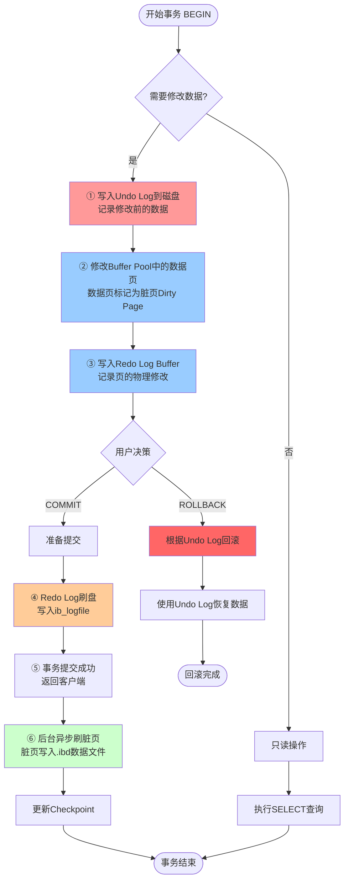
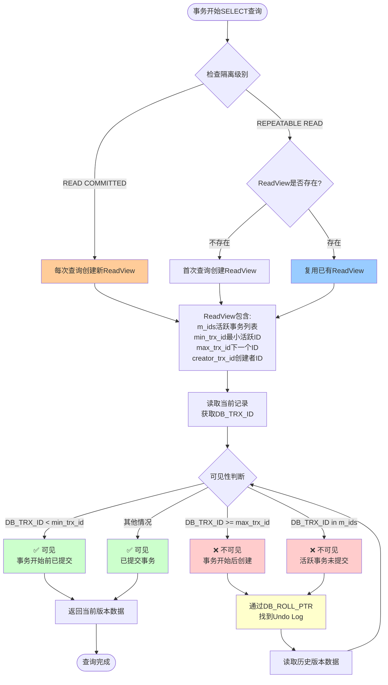
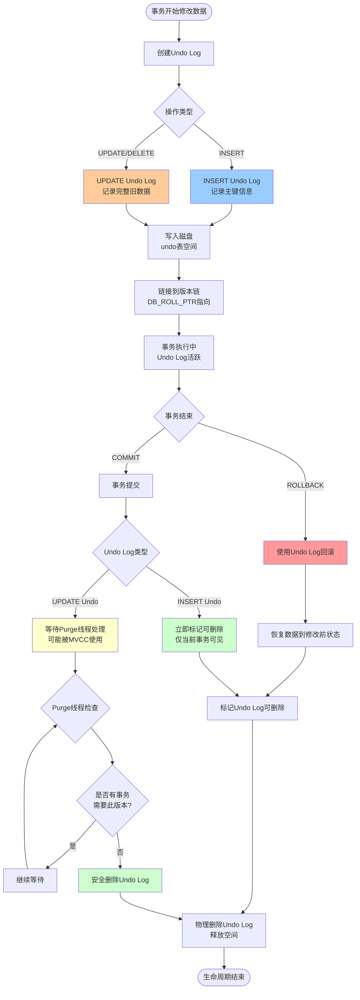
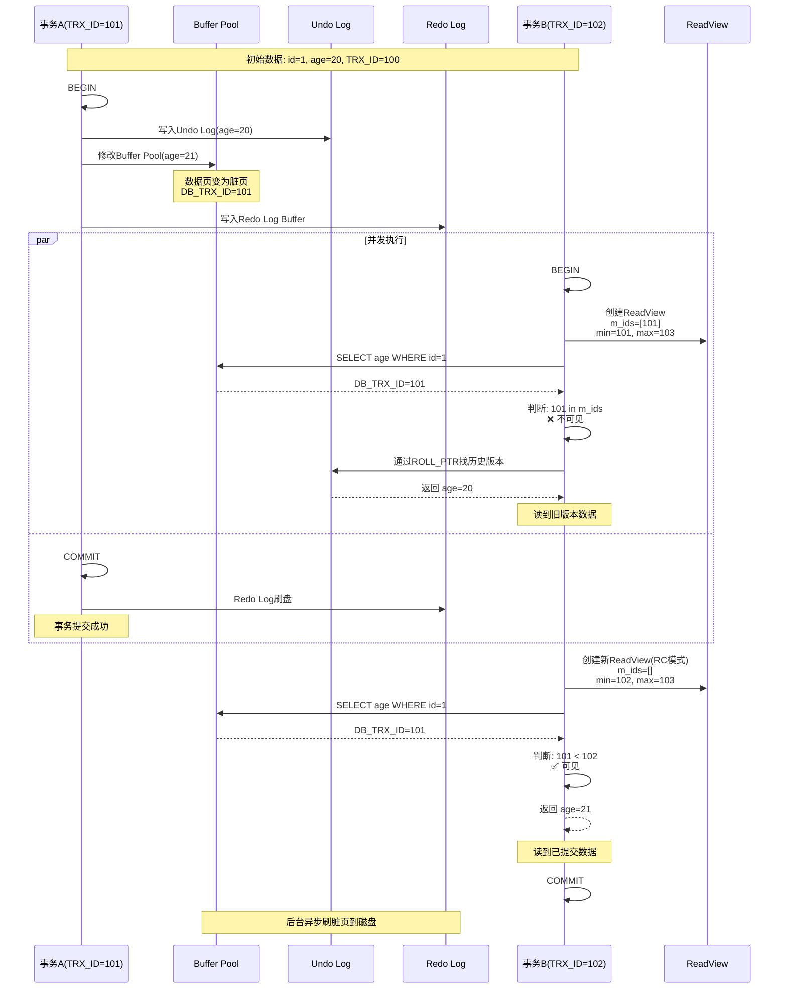
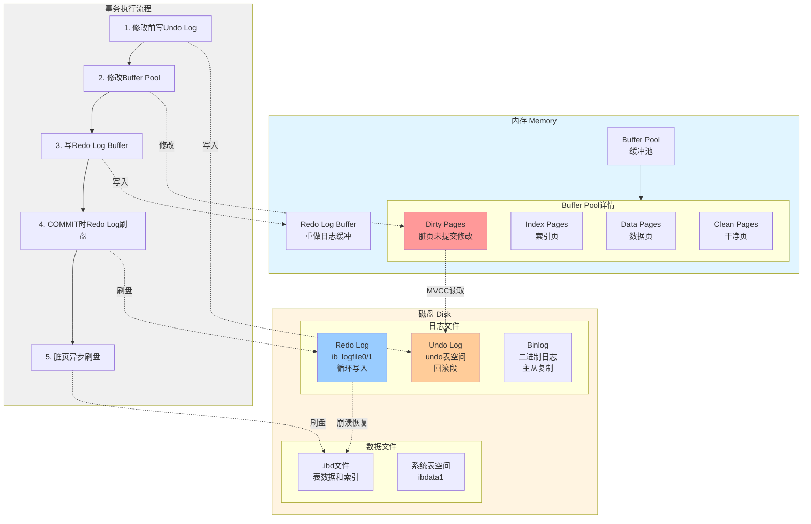
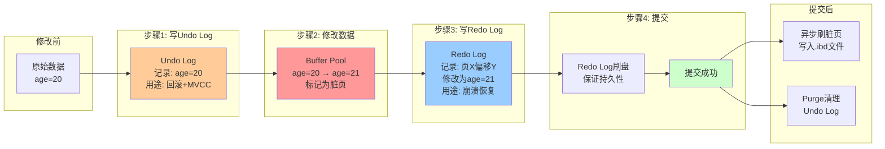

# MySQL核心机制详解

## 1. MySQL数据库commit提交前数据在哪

### 数据存储位置
在事务commit提交之前，数据会存在于以下几个地方：

#### 1.1 Buffer Pool（缓冲池）
- **位置**：内存中
- **作用**：InnoDB的核心内存结构，用于缓存数据页和索引页
- **修改过程**：
  - 当执行UPDATE/INSERT/DELETE时，先在Buffer Pool中修改数据页
  - 这些被修改但未提交的数据页称为"脏页"（Dirty Page）
  - 提交前，修改只存在于内存的Buffer Pool中

#### 1.2 Redo Log Buffer（重做日志缓冲）
- **位置**：内存中
- **作用**：暂存即将写入磁盘的redo log
- **内容**：记录了数据页的物理修改（页号、偏移量、修改值）

#### 1.3 Undo Log（回滚日志）
- **位置**：磁盘（共享表空间或独立undo表空间）
- **作用**：记录修改前的数据，用于事务回滚和MVCC
- **时机**：在修改数据之前就已经写入undo log

### 提交流程
```
修改数据 → Buffer Pool(脏页) 
        → Redo Log Buffer(内存)
        → Undo Log(磁盘)
        
COMMIT → Redo Log持久化到磁盘(Redo Log File)
       → 事务提交成功
       → 脏页异步刷新到磁盘(数据文件.ibd)
```

---

## 2. MVCC（Multi-Version Concurrency Control）多版本并发控制

### 2.1 核心概念
MVCC是一种并发控制机制，通过保存数据的多个历史版本，实现读写不阻塞，提高并发性能。

### 2.2 实现原理

#### 隐藏字段
InnoDB在每行记录后面添加三个隐藏字段：
- **DB_TRX_ID（6字节）**：最后修改该行的事务ID
- **DB_ROLL_PTR（7字节）**：回滚指针，指向undo log中的上一个版本
- **DB_ROW_ID（6字节）**：行ID（无主键时自动生成）

#### 版本链
```
当前记录(v3) → DB_ROLL_PTR
                    ↓
              Undo Log(v2) → DB_ROLL_PTR
                                ↓
                          Undo Log(v1)
```

### 2.3 ReadView（读视图）
ReadView决定了事务能看到哪些数据版本：

#### ReadView包含的信息：
- **m_ids**：当前活跃的事务ID列表
- **min_trx_id**：最小活跃事务ID
- **max_trx_id**：下一个要分配的事务ID
- **creator_trx_id**：创建该ReadView的事务ID

#### 可见性判断规则：
```
if (DB_TRX_ID < min_trx_id):
    # 记录创建在ReadView之前，可见
    return 可见
    
if (DB_TRX_ID >= max_trx_id):
    # 记录创建在ReadView之后，不可见
    return 不可见
    
if (DB_TRX_ID in m_ids):
    # 记录由活跃事务创建，不可见
    return 不可见
else:
    # 记录由已提交事务创建，可见
    return 可见
```

### 2.4 隔离级别与ReadView

#### READ COMMITTED（读已提交）
- **特点**：每次读取都生成新的ReadView
- **效果**：能读到其他事务已提交的数据（不可重复读）

#### REPEATABLE READ（可重复读）
- **特点**：事务开始时生成ReadView，之后一直复用
- **效果**：整个事务期间读取的数据保持一致

### 2.5 MVCC的优势
- ✅ 读不加锁，写不阻塞读
- ✅ 提高并发性能
- ✅ 实现一致性非锁定读
- ✅ 解决脏读、不可重复读问题

---

## 3. Undo Log（回滚日志）

### 3.1 核心作用

#### 作用一：事务回滚
- 记录事务修改前的数据
- ROLLBACK时根据undo log恢复数据

#### 作用二：MVCC实现
- 提供数据的历史版本
- 支持一致性非锁定读

### 3.2 Undo Log类型

#### INSERT Undo Log
- **记录内容**：插入记录的主键
- **回滚操作**：删除该记录
- **特点**：只对当前事务可见，提交后可立即删除

#### UPDATE Undo Log
- **记录内容**：更新前的完整记录
- **回滚操作**：用旧值覆盖新值
- **特点**：需要为MVCC提供历史版本，不能立即删除

### 3.3 Undo Log存储结构

```
Undo Log Segment
    ├── Undo Log Header
    ├── Undo Log Record 1
    │   ├── 事务ID
    │   ├── 回滚指针
    │   ├── 主键值
    │   └── 旧值数据
    ├── Undo Log Record 2
    └── ...
```

### 3.4 Undo Log的生命周期

```
1. 事务开始修改数据前
   └→ 写入Undo Log到磁盘

2. 事务执行过程中
   └→ Undo Log用于MVCC读取历史版本

3. 事务提交后
   └→ INSERT Undo Log标记为可删除
   └→ UPDATE Undo Log等待Purge线程清理

4. Purge线程清理
   └→ 判断没有事务需要该版本
   └→ 删除Undo Log
```

### 3.5 Undo Log与Redo Log的区别

| 特性 | Undo Log | Redo Log |
|------|----------|----------|
| **作用** | 事务回滚、MVCC | 数据恢复、持久性保证 |
| **记录内容** | 逻辑日志（修改前数据） | 物理日志（页的修改） |
| **写入时机** | 修改数据前 | 修改数据后 |
| **保存位置** | 共享表空间/独立undo表空间 | ib_logfile0/1 |
| **循环使用** | 否（需要Purge清理） | 是（覆盖写入） |

### 3.6 Undo Log相关配置

```sql
-- 查看undo表空间
SELECT * FROM information_schema.INNODB_TABLESPACES 
WHERE NAME LIKE '%undo%';

-- undo日志保留时间（秒）
SHOW VARIABLES LIKE 'innodb_undo_log_truncate';

-- undo表空间数量
SHOW VARIABLES LIKE 'innodb_undo_tablespaces';

-- undo日志回滚段数量
SHOW VARIABLES LIKE 'innodb_rollback_segments';
```

---

## 4. 完整流程图（Mermaid）

### 4.1 事务完整执行流程



### 4.2 MVCC读取数据流程



### 4.3 Undo Log生命周期



### 4.4 并发事务MVCC示例流程



### 4.5 内存与磁盘数据分布图



### 4.6 Redo Log与Undo Log协作机制



## 5. 实战示例

### 示例：两个事务的并发执行

```sql
-- 初始数据
id | name | age | DB_TRX_ID | DB_ROLL_PTR
1  | Tom  | 20  | 100       | NULL

-- 事务A（TRX_ID=101）
BEGIN;
UPDATE user SET age=21 WHERE id=1;
-- 此时：
-- 1. Undo Log记录：age=20（旧值）
-- 2. Buffer Pool中：age=21（新值，脏页）
-- 3. DB_TRX_ID=101, DB_ROLL_PTR指向undo log

-- 事务B（TRX_ID=102，READ COMMITTED）
BEGIN;
SELECT * FROM user WHERE id=1;
-- 生成ReadView：m_ids=[101], min=101, max=103
-- 判断DB_TRX_ID(101) in m_ids → 不可见
-- 通过DB_ROLL_PTR找到undo log → 读到age=20

-- 事务A提交
COMMIT;
-- Redo Log刷盘，事务提交成功

-- 事务B再次查询（READ COMMITTED会生成新ReadView）
SELECT * FROM user WHERE id=1;
-- 新ReadView：m_ids=[], min=102, max=103
-- 判断DB_TRX_ID(101) < min(102) → 可见
-- 读到age=21（已提交的数据）
```

---

## 6. 总结

### commit前数据位置：
- 内存：Buffer Pool（脏页）、Redo Log Buffer
- 磁盘：Undo Log（已写入）

### MVCC核心：
- 通过版本链 + ReadView实现读写不阻塞
- 不同隔离级别通过ReadView生成时机控制可见性

### Undo Log核心：
- 支持事务回滚
- 提供MVCC的历史版本
- 与Redo Log配合保证数据一致性

---

*创建时间：2025-10-25*
*关键词：MySQL, InnoDB, MVCC, Undo Log, 事务, 并发控制*

