# Redis 核心机制与工作原理详解

## 目录
- [1. Redis 架构概览](#1-redis-架构概览)
- [2. 数据结构](#2-数据结构)
- [3. 持久化机制](#3-持久化机制)
- [4. 过期策略与内存淘汰](#4-过期策略与内存淘汰)
- [5. 事件驱动模型](#5-事件驱动模型)
- [6. 主从复制](#6-主从复制)
- [7. 哨兵模式](#7-哨兵模式)
- [8. 集群模式](#8-集群模式)
- [9. 缓存策略](#9-缓存策略)
- [10. 性能优化](#10-性能优化)

---

## 1. Redis 架构概览

### 1.1 核心特性

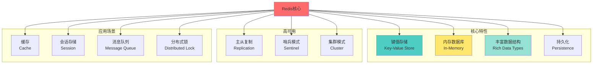
```mermaid
graph TB
    Redis[Redis核心]
    
    subgraph 核心特性
        KV[键值存储<br/>Key-Value Store]
        Memory[内存数据库<br/>In-Memory]
        DataType[丰富数据结构<br/>Rich Data Types]
        Persist[持久化<br/>Persistence]
    end
    
    subgraph 高可用
        Replication[主从复制<br/>Replication]
        Sentinel[哨兵模式<br/>Sentinel]
        Cluster[集群模式<br/>Cluster]
    end
    
    subgraph 应用场景
        Cache[缓存<br/>Cache]
        Session[会话存储<br/>Session]
        Queue[消息队列<br/>Message Queue]
        Lock[分布式锁<br/>Distributed Lock]
    end
    
    Redis --> KV
    Redis --> Memory
    Redis --> DataType
    Redis --> Persist
    
    Redis --> Replication
    Redis --> Sentinel
    Redis --> Cluster
    
    Redis --> Cache
    Redis --> Session
    Redis --> Queue
    Redis --> Lock
    
    style Redis fill:#ff6b6b
    style KV fill:#4ecdc4
    style Memory fill:#ffe66d
    style DataType fill:#95e1d3
```

### 1.2 Redis 单机架构

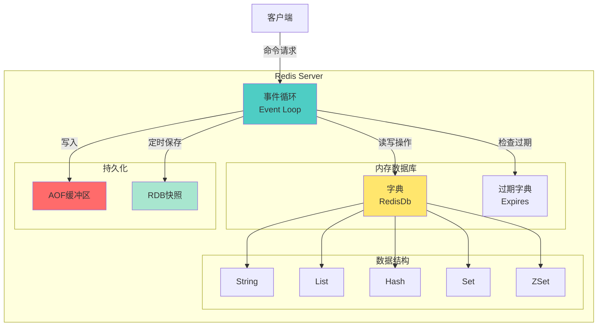
```mermaid
graph TB
    Client[客户端]
    
    subgraph Redis Server
        EventLoop[事件循环<br/>Event Loop]
        
        subgraph 内存数据库
            Dict[字典<br/>RedisDb]
            Expires[过期字典<br/>Expires]
        end
        
        subgraph 持久化
            AOF[AOF缓冲区]
            RDB[RDB快照]
        end
        
        subgraph 数据结构
            String[String]
            List[List]
            Hash[Hash]
            Set[Set]
            ZSet[ZSet]
        end
    end
    
    Client -->|命令请求| EventLoop
    EventLoop -->|读写操作| Dict
    EventLoop -->|检查过期| Expires
    
    Dict --> String
    Dict --> List
    Dict --> Hash
    Dict --> Set
    Dict --> ZSet
    
    EventLoop -->|写入| AOF
    EventLoop -->|定时保存| RDB
    
    style EventLoop fill:#4ecdc4
    style Dict fill:#ffe66d
    style AOF fill:#ff6b6b
    style RDB fill:#a8e6cf
```

### 1.3 Redis 核心组件

| 组件 | 功能 | 特点 |
|------|------|------|
| **RedisDb** | 数据库实例 | 默认16个数据库（0-15） |
| **Dict** | 哈希表 | 存储键值对 |
| **EventLoop** | 事件循环 | 单线程模型（IO多线程） |
| **AOF** | 追加式持久化 | 记录写命令 |
| **RDB** | 快照持久化 | 全量数据备份 |

---

## 2. 数据结构

### 2.1 五种基本数据类型

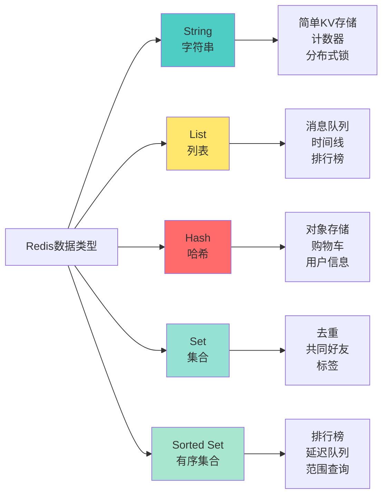
```mermaid
graph LR
    Redis[Redis数据类型]
    
    Redis --> String[String<br/>字符串]
    Redis --> List[List<br/>列表]
    Redis --> Hash[Hash<br/>哈希]
    Redis --> Set[Set<br/>集合]
    Redis --> ZSet[Sorted Set<br/>有序集合]
    
    String --> S1[简单KV存储<br/>计数器<br/>分布式锁]
    List --> L1[消息队列<br/>时间线<br/>排行榜]
    Hash --> H1[对象存储<br/>购物车<br/>用户信息]
    Set --> SE1[去重<br/>共同好友<br/>标签]
    ZSet --> Z1[排行榜<br/>延迟队列<br/>范围查询]
    
    style String fill:#4ecdc4
    style List fill:#ffe66d
    style Hash fill:#ff6b6b
    style Set fill:#95e1d3
    style ZSet fill:#a8e6cf
```

### 2.2 底层数据结构实现

#### 2.2.1 简单动态字符串（SDS）

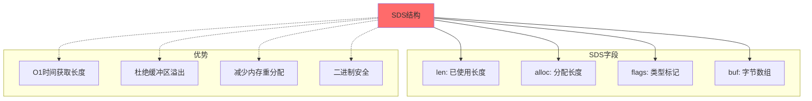
```mermaid
graph TB
    SDS[SDS结构]
    
    subgraph SDS字段
        len[len: 已使用长度]
        alloc[alloc: 分配长度]
        flags[flags: 类型标记]
        buf[buf: 字节数组]
    end
    
    SDS --> len
    SDS --> alloc
    SDS --> flags
    SDS --> buf
    
    subgraph 优势
        A1[O1时间获取长度]
        A2[杜绝缓冲区溢出]
        A3[减少内存重分配]
        A4[二进制安全]
    end
    
    SDS -.-> A1
    SDS -.-> A2
    SDS -.-> A3
    SDS -.-> A4
    
    style SDS fill:#ff6b6b
```

**SDS vs C字符串对比**：

| 特性 | C字符串 | SDS |
|------|---------|-----|
| **获取长度** | O(n) 遍历 | O(1) 直接读取 |
| **缓冲区溢出** | 不检查，可能溢出 | 自动扩容 |
| **内存重分配** | 每次修改都重分配 | 空间预分配+惰性释放 |
| **二进制安全** | ❌ 不支持（\0结尾） | ✅ 支持 |

#### 2.2.2 链表（LinkedList）

```c
// 链表节点结构
typedef struct listNode {
    struct listNode *prev;  // 前驱节点
    struct listNode *next;  // 后继节点
    void *value;            // 节点值
} listNode;

// 链表结构
typedef struct list {
    listNode *head;         // 头节点
    listNode *tail;         // 尾节点
    unsigned long len;      // 节点数量
    // 函数指针
    void *(*dup)(void *ptr);
    void (*free)(void *ptr);
    int (*match)(void *ptr, void *key);
} list;
```

**特点**：
- ✅ 双向链表
- ✅ 无环（head前驱和tail后继都指向NULL）
- ✅ 带头指针和尾指针
- ✅ 带长度计数器
- ✅ 多态（void*指针）

#### 2.2.3 字典（Hash Table）

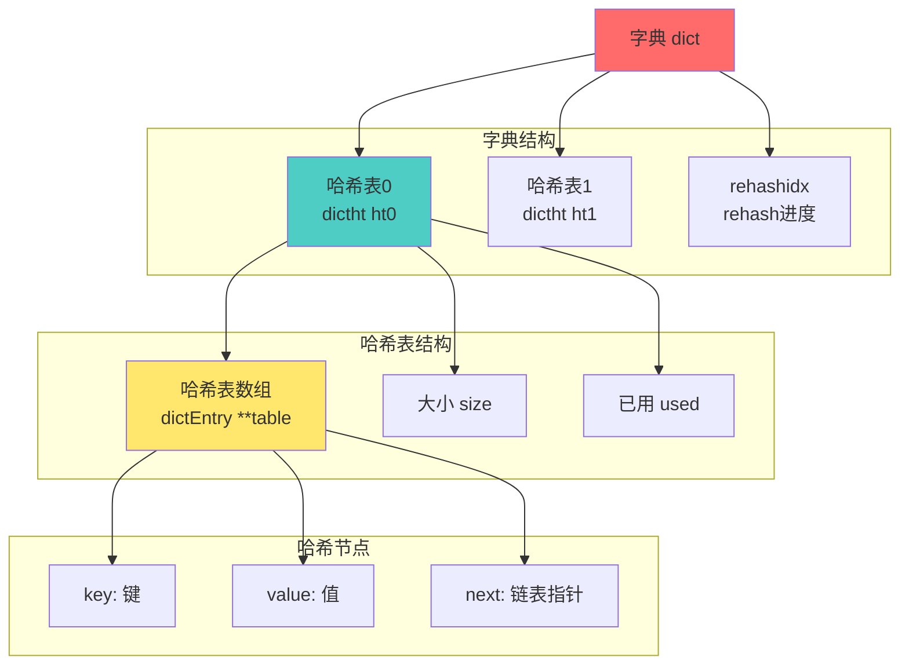
```mermaid
graph TB
    Dict[字典 dict]
    
    subgraph 字典结构
        ht0[哈希表0<br/>dictht ht0]
        ht1[哈希表1<br/>dictht ht1]
        rehashidx[rehashidx<br/>rehash进度]
    end
    
    Dict --> ht0
    Dict --> ht1
    Dict --> rehashidx
    
    subgraph 哈希表结构
        table[哈希表数组<br/>dictEntry **table]
        size[大小 size]
        used[已用 used]
    end
    
    ht0 --> table
    ht0 --> size
    ht0 --> used
    
    subgraph 哈希节点
        key[key: 键]
        value[value: 值]
        next[next: 链表指针]
    end
    
    table --> key
    table --> value
    table --> next
    
    style Dict fill:#ff6b6b
    style ht0 fill:#4ecdc4
    style table fill:#ffe66d
```

**渐进式Rehash机制**：

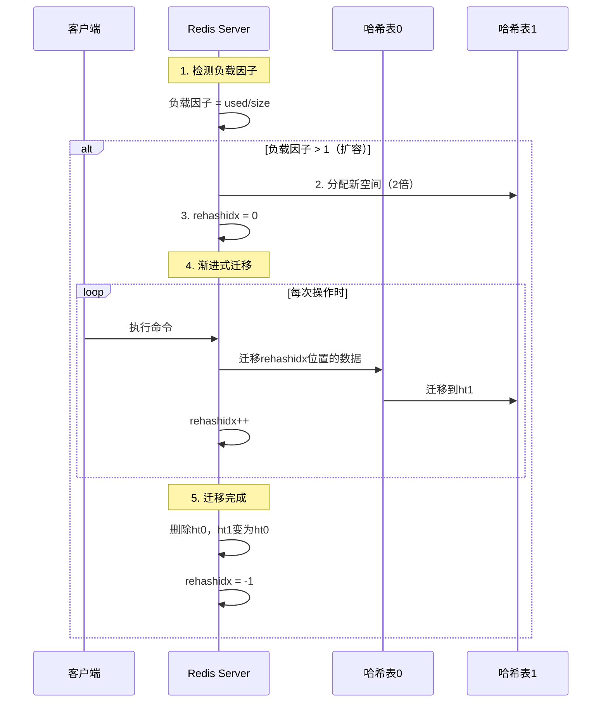
```mermaid
sequenceDiagram
    participant Client as 客户端
    participant Redis as Redis Server
    participant ht0 as 哈希表0
    participant ht1 as 哈希表1
    
    Note over Redis: 1. 检测负载因子
    Redis->>Redis: 负载因子 = used/size
    
    alt 负载因子 > 1（扩容）
        Redis->>ht1: 2. 分配新空间（2倍）
        Redis->>Redis: 3. rehashidx = 0
        
        Note over Redis: 4. 渐进式迁移
        loop 每次操作时
            Client->>Redis: 执行命令
            Redis->>ht0: 迁移rehashidx位置的数据
            ht0->>ht1: 迁移到ht1
            Redis->>Redis: rehashidx++
        end
        
        Note over Redis: 5. 迁移完成
        Redis->>Redis: 删除ht0，ht1变为ht0
        Redis->>Redis: rehashidx = -1
    end
```

#### 2.2.4 跳跃表（Skip List）

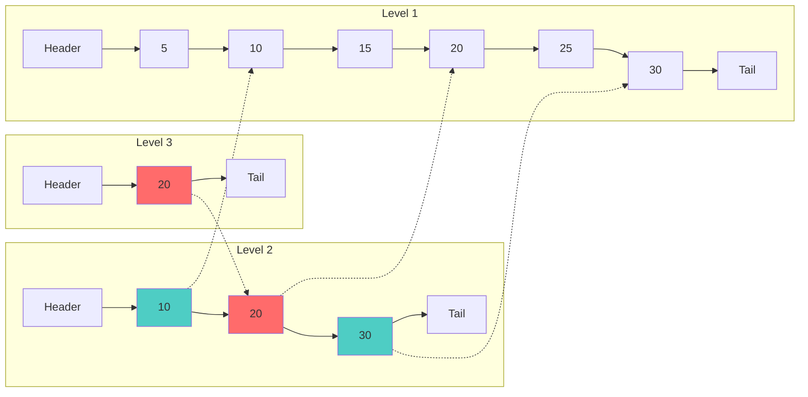
```mermaid
graph LR
    subgraph Level 3
        L3_H[Header] --> L3_1[20]
        L3_1 --> L3_T[Tail]
    end
    
    subgraph Level 2
        L2_H[Header] --> L2_1[10]
        L2_1 --> L2_2[20]
        L2_2 --> L2_3[30]
        L2_3 --> L2_T[Tail]
    end
    
    subgraph Level 1
        L1_H[Header] --> L1_1[5]
        L1_1 --> L1_2[10]
        L1_2 --> L1_3[15]
        L1_3 --> L1_4[20]
        L1_4 --> L1_5[25]
        L1_5 --> L1_6[30]
        L1_6 --> L1_T[Tail]
    end
    
    L3_1 -.-> L2_2
    L2_1 -.-> L1_2
    L2_2 -.-> L1_4
    L2_3 -.-> L1_6
    
    style L3_1 fill:#ff6b6b
    style L2_1 fill:#4ecdc4
    style L2_2 fill:#ff6b6b
    style L2_3 fill:#4ecdc4
```

**跳跃表特点**：
- ✅ 有序数据结构
- ✅ 平均O(logN)、最坏O(N)的查找复杂度
- ✅ 实现简单（相比红黑树）
- ✅ 支持范围查询

**应用场景**：
- ZSet（有序集合）的底层实现
- 集群节点内部数据结构

#### 2.2.5 整数集合（IntSet）

```c
typedef struct intset {
    uint32_t encoding;  // 编码方式：int16_t/int32_t/int64_t
    uint32_t length;    // 元素数量
    int8_t contents[];  // 柔性数组，实际存储数据
} intset;
```

**编码升级**：
- 初始编码：int16_t（-32768 ~ 32767）
- 添加更大值时自动升级为int32_t
- 只升级不降级

#### 2.2.6 压缩列表（ZipList）

```
┌─────────┬─────────┬─────────┬─────────┬─────────┬─────────┐
│ zlbytes │ zltail  │  zllen  │  entry  │  entry  │  zlend  │
│  4字节  │  4字节  │  2字节  │   ...   │   ...   │  1字节  │
└─────────┴─────────┴─────────┴─────────┴─────────┴─────────┘
```

**字段说明**：
- `zlbytes`：ziplist占用字节数
- `zltail`：尾节点偏移量
- `zllen`：节点数量
- `entry`：节点（可变长度）
- `zlend`：特殊值0xFF，标记末端

**优势**：
- 内存紧凑，节省空间
- 适合小数据量（< 512个元素）

**缺点**：
- 连锁更新问题（级联更新导致性能下降）

### 2.3 编码转换

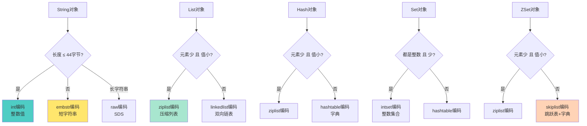
```mermaid
graph TB
    String[String对象]
    
    String --> E1{长度 ≤ 44字节?}
    E1 -->|是| int[int编码<br/>整数值]
    E1 -->|否| embstr[embstr编码<br/>短字符串]
    E1 -->|长字符串| raw[raw编码<br/>SDS]
    
    List[List对象]
    List --> E2{元素少 且 值小?}
    E2 -->|是| ziplist[ziplist编码<br/>压缩列表]
    E2 -->|否| linkedlist[linkedlist编码<br/>双向链表]
    
    Hash[Hash对象]
    Hash --> E3{元素少 且 值小?}
    E3 -->|是| ziplistH[ziplist编码]
    E3 -->|否| hashtable[hashtable编码<br/>字典]
    
    Set[Set对象]
    Set --> E4{都是整数 且 少?}
    E4 -->|是| intset[intset编码<br/>整数集合]
    E4 -->|否| hashtableS[hashtable编码]
    
    ZSet[ZSet对象]
    ZSet --> E5{元素少 且 值小?}
    E5 -->|是| ziplistZ[ziplist编码]
    E5 -->|否| skiplist[skiplist编码<br/>跳跃表+字典]
    
    style int fill:#4ecdc4
    style embstr fill:#ffe66d
    style ziplist fill:#a8e6cf
    style skiplist fill:#ffd3b6
```

**编码转换条件**：

| 数据类型 | 编码1（紧凑） | 编码2（正常） | 转换条件 |
|---------|-------------|-------------|---------|
| **String** | int/embstr | raw | 长度>44字节 |
| **List** | ziplist | linkedlist | 元素>512 或 值>64字节 |
| **Hash** | ziplist | hashtable | 元素>512 或 值>64字节 |
| **Set** | intset | hashtable | 非整数 或 元素>512 |
| **ZSet** | ziplist | skiplist+dict | 元素>128 或 值>64字节 |

---

## 3. 持久化机制

### 3.1 RDB（Redis Database）

#### 3.1.1 RDB工作原理

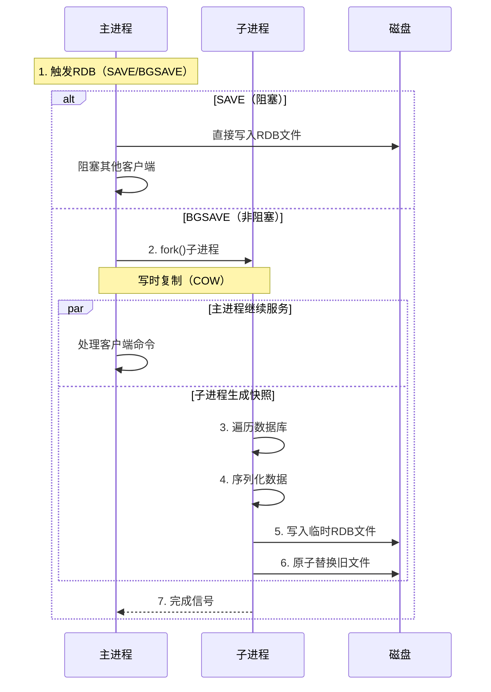
```mermaid
sequenceDiagram
    participant Main as 主进程
    participant Child as 子进程
    participant Disk as 磁盘
    
    Note over Main: 1. 触发RDB（SAVE/BGSAVE）
    
    alt SAVE（阻塞）
        Main->>Disk: 直接写入RDB文件
        Main->>Main: 阻塞其他客户端
    else BGSAVE（非阻塞）
        Main->>Child: 2. fork()子进程
        Note over Main,Child: 写时复制（COW）
        
        par 主进程继续服务
            Main->>Main: 处理客户端命令
        and 子进程生成快照
            Child->>Child: 3. 遍历数据库
            Child->>Child: 4. 序列化数据
            Child->>Disk: 5. 写入临时RDB文件
            Child->>Disk: 6. 原子替换旧文件
        end
        
        Child-->>Main: 7. 完成信号
    end
```

#### 3.1.2 RDB配置与触发

```bash
# redis.conf 配置
# 格式：save <seconds> <changes>
save 900 1      # 900秒内至少1次修改
save 300 10     # 300秒内至少10次修改
save 60 10000   # 60秒内至少10000次修改

# RDB文件名
dbfilename dump.rdb

# RDB文件目录
dir /var/lib/redis

# 压缩RDB文件
rdbcompression yes

# 检查校验和
rdbchecksum yes
```

**触发方式**：
1. 手动触发：`SAVE` 或 `BGSAVE` 命令
2. 自动触发：满足save配置条件
3. 主从复制：从节点全量同步
4. 关闭服务：执行`SHUTDOWN`时自动SAVE

#### 3.1.3 写时复制（COW）机制

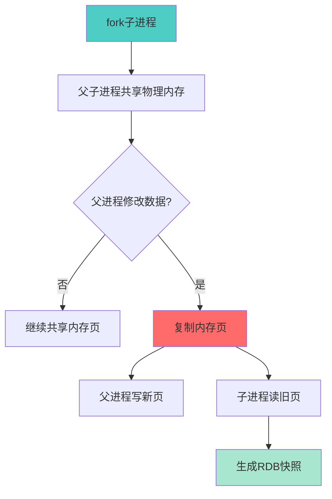
```mermaid
graph TB
    A[fork子进程] --> B[父子进程共享物理内存]
    B --> C{父进程修改数据?}
    
    C -->|否| D[继续共享内存页]
    C -->|是| E[复制内存页]
    
    E --> F[父进程写新页]
    E --> G[子进程读旧页]
    
    G --> H[生成RDB快照]
    
    style A fill:#4ecdc4
    style E fill:#ff6b6b
    style H fill:#a8e6cf
```

**优势**：
- ✅ 父进程不阻塞，继续处理请求
- ✅ 只复制修改的内存页，节省内存
- ✅ 快照数据一致性

### 3.2 AOF（Append Only File）

#### 3.2.1 AOF工作原理

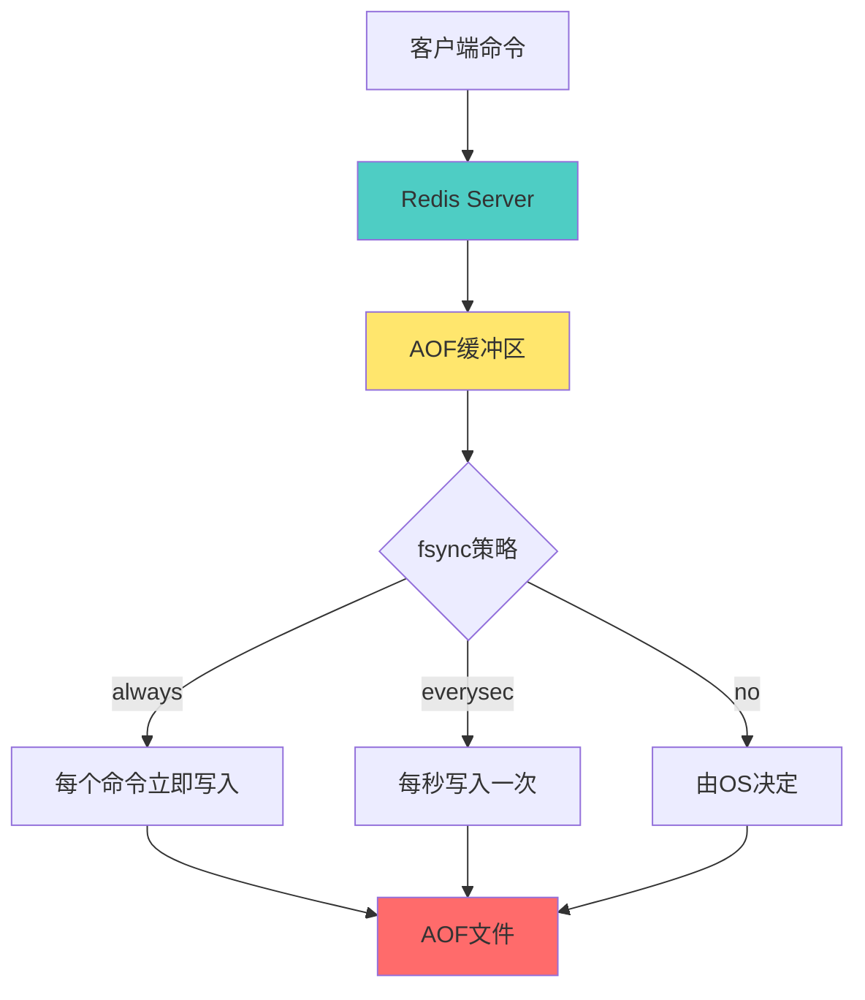
```mermaid
graph TB
    Client[客户端命令]
    
    Client --> Server[Redis Server]
    Server --> AOF_Buf[AOF缓冲区]
    
    AOF_Buf --> Sync{fsync策略}
    
    Sync -->|always| Write1[每个命令立即写入]
    Sync -->|everysec| Write2[每秒写入一次]
    Sync -->|no| Write3[由OS决定]
    
    Write1 --> Disk[AOF文件]
    Write2 --> Disk
    Write3 --> Disk
    
    style Server fill:#4ecdc4
    style AOF_Buf fill:#ffe66d
    style Disk fill:#ff6b6b
```

#### 3.2.2 AOF配置

```bash
# 开启AOF
appendonly yes

# AOF文件名
appendfilename "appendonly.aof"

# fsync策略
appendfsync everysec   # 推荐：每秒同步
# appendfsync always   # 最安全：每个命令同步
# appendfsync no       # 最快：交给OS

# AOF重写
auto-aof-rewrite-percentage 100  # 增长100%触发重写
auto-aof-rewrite-min-size 64mb   # 最小64MB触发重写
```

#### 3.2.3 AOF重写机制

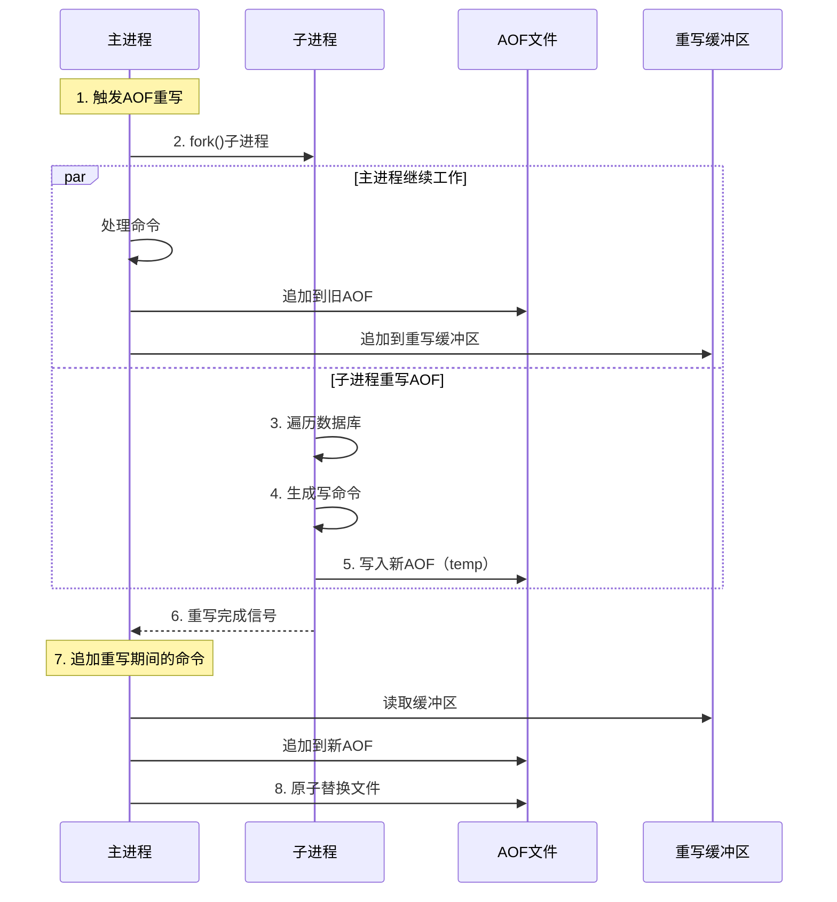
```mermaid
sequenceDiagram
    participant Main as 主进程
    participant Child as 子进程
    participant AOF as AOF文件
    participant Rewrite_Buf as 重写缓冲区
    
    Note over Main: 1. 触发AOF重写
    Main->>Child: 2. fork()子进程
    
    par 主进程继续工作
        Main->>Main: 处理命令
        Main->>AOF: 追加到旧AOF
        Main->>Rewrite_Buf: 追加到重写缓冲区
    and 子进程重写AOF
        Child->>Child: 3. 遍历数据库
        Child->>Child: 4. 生成写命令
        Child->>AOF: 5. 写入新AOF（temp）
    end
    
    Child-->>Main: 6. 重写完成信号
    
    Note over Main: 7. 追加重写期间的命令
    Main->>Rewrite_Buf: 读取缓冲区
    Main->>AOF: 追加到新AOF
    
    Main->>AOF: 8. 原子替换文件
```

**AOF重写优势**：
- 减少文件体积（合并冗余命令）
- 提高加载速度
- 不阻塞主进程

**重写示例**：
```bash
# 重写前（多条命令）
SET key value1
SET key value2
SET key value3
INCR counter
INCR counter
INCR counter

# 重写后（合并为最终状态）
SET key value3
SET counter 3
```

### 3.3 RDB vs AOF 对比

| 特性 | RDB | AOF |
|------|-----|-----|
| **持久化方式** | 二进制快照 | 命令日志 |
| **文件大小** | 小（压缩） | 大（文本） |
| **恢复速度** | 快 | 慢 |
| **数据完整性** | 可能丢失数据（两次快照间） | 丢失少（最多1秒） |
| **性能影响** | fork时可能卡顿 | 持续写入磁盘 |
| **适用场景** | 备份、全量复制 | 数据安全性高的场景 |

### 3.4 混合持久化（Redis 4.0+）

```bash
# 开启混合持久化
aof-use-rdb-preamble yes
```

**工作原理**：
- AOF重写时，前半部分使用RDB格式（快照）
- 后半部分使用AOF格式（增量命令）
- 兼顾恢复速度和数据完整性

```
┌──────────────────────────────────────┐
│  AOF文件（混合格式）                  │
├──────────────────────────────────────┤
│  RDB格式数据（快照）                  │
│  ┌────────────────────────────────┐  │
│  │ 二进制快照数据                  │  │
│  │ ...                            │  │
│  └────────────────────────────────┘  │
├──────────────────────────────────────┤
│  AOF格式数据（增量命令）              │
│  ┌────────────────────────────────┐  │
│  │ SET key1 value1                │  │
│  │ INCR counter                   │  │
│  │ ...                            │  │
│  └────────────────────────────────┘  │
└──────────────────────────────────────┘
```

---

## 4. 过期策略与内存淘汰

### 4.1 过期键删除策略

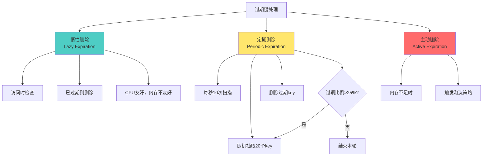
```mermaid
graph TB
    Expire[过期键处理]
    
    Expire --> Lazy[惰性删除<br/>Lazy Expiration]
    Expire --> Periodic[定期删除<br/>Periodic Expiration]
    Expire --> Active[主动删除<br/>Active Expiration]
    
    Lazy --> L1[访问时检查]
    Lazy --> L2[已过期则删除]
    Lazy --> L3[CPU友好，内存不友好]
    
    Periodic --> P1[每秒10次扫描]
    Periodic --> P2[随机抽取20个key]
    Periodic --> P3[删除过期key]
    Periodic --> P4{过期比例>25%?}
    P4 -->|是| P2
    P4 -->|否| P5[结束本轮]
    
    Active --> A1[内存不足时]
    Active --> A2[触发淘汰策略]
    
    style Lazy fill:#4ecdc4
    style Periodic fill:#ffe66d
    style Active fill:#ff6b6b
```

### 4.2 内存淘汰策略

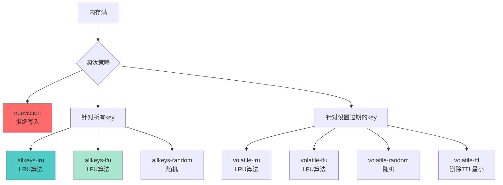
```mermaid
graph TD
    Full[内存满]
    
    Full --> Policy{淘汰策略}
    
    Policy --> noeviction[noeviction<br/>拒绝写入]
    Policy --> allkeys[针对所有key]
    Policy --> volatile[针对设置过期的key]
    
    allkeys --> lru1[allkeys-lru<br/>LRU算法]
    allkeys --> lfu1[allkeys-lfu<br/>LFU算法]
    allkeys --> random1[allkeys-random<br/>随机]
    
    volatile --> lru2[volatile-lru<br/>LRU算法]
    volatile --> lfu2[volatile-lfu<br/>LFU算法]
    volatile --> random2[volatile-random<br/>随机]
    volatile --> ttl[volatile-ttl<br/>删除TTL最小]
    
    style noeviction fill:#ff6b6b
    style lru1 fill:#4ecdc4
    style lfu1 fill:#a8e6cf
```

**配置方式**：
```bash
# 最大内存限制
maxmemory 2gb

# 淘汰策略（推荐）
maxmemory-policy allkeys-lru

# 淘汰样本数量（越大越精确，越慢）
maxmemory-samples 5
```

**策略选择**：

| 场景 | 推荐策略 | 原因 |
|------|---------|------|
| **缓存场景** | allkeys-lru | 优先保留热数据 |
| **缓存+持久化** | volatile-lru | 只淘汰临时数据 |
| **严格数据** | noeviction | 拒绝写入，报错 |
| **访问频率** | allkeys-lfu | 考虑访问频率 |

### 4.3 LRU vs LFU


**LRU（Least Recently Used）最近最少使用**：
- 淘汰最长时间未被访问的key
- 只关心访问时间

**LFU（Least Frequently Used）最不经常使用**：
- 淘汰访问频率最低的key
- 关心访问次数

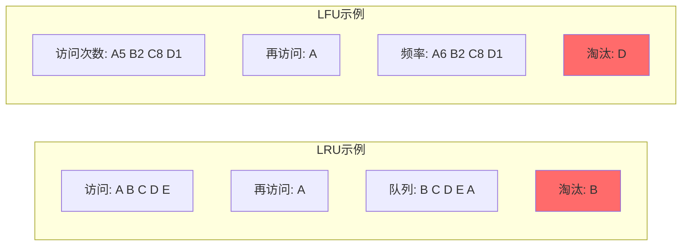
```mermaid
graph LR
    subgraph LRU示例
        L1[访问: A B C D E]
        L2[再访问: A]
        L3[队列: B C D E A]
        L4[淘汰: B]
    end
    
    subgraph LFU示例
        F1[访问次数: A5 B2 C8 D1]
        F2[再访问: A]
        F3[频率: A6 B2 C8 D1]
        F4[淘汰: D]
    end
    
    style L4 fill:#ff6b6b
    style F4 fill:#ff6b6b
```

---

## 5. 事件驱动模型

### 5.1 Reactor模型

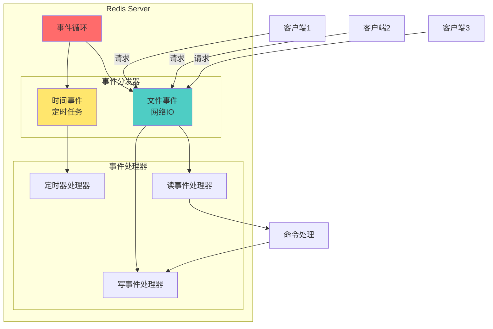
```mermaid
graph TB
    Client1[客户端1]
    Client2[客户端2]
    Client3[客户端3]
    
    subgraph Redis Server
        EventLoop[事件循环]
        
        subgraph 事件分发器
            FileEvent[文件事件<br/>网络IO]
            TimeEvent[时间事件<br/>定时任务]
        end
        
        subgraph 事件处理器
            Read[读事件处理器]
            Write[写事件处理器]
            Timer[定时器处理器]
        end
    end
    
    Client1 -->|请求| FileEvent
    Client2 -->|请求| FileEvent
    Client3 -->|请求| FileEvent
    
    EventLoop --> FileEvent
    EventLoop --> TimeEvent
    
    FileEvent --> Read
    FileEvent --> Write
    TimeEvent --> Timer
    
    Read --> Process[命令处理]
    Process --> Write
    
    style EventLoop fill:#ff6b6b
    style FileEvent fill:#4ecdc4
    style TimeEvent fill:#ffe66d
```

### 5.2 单线程模型

**为什么Redis单线程还这么快？**

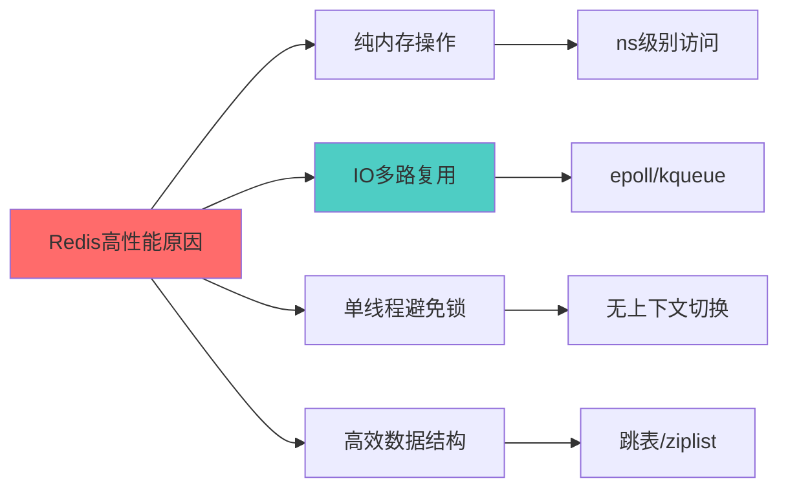
```mermaid
graph LR
    A[Redis高性能原因]
    
    A --> B1[纯内存操作]
    A --> B2[IO多路复用]
    A --> B3[单线程避免锁]
    A --> B4[高效数据结构]
    
    B1 --> C1[ns级别访问]
    B2 --> C2[epoll/kqueue]
    B3 --> C3[无上下文切换]
    B4 --> C4[跳表/ziplist]
    
    style A fill:#ff6b6b
    style B2 fill:#4ecdc4
```

**单线程处理流程**：

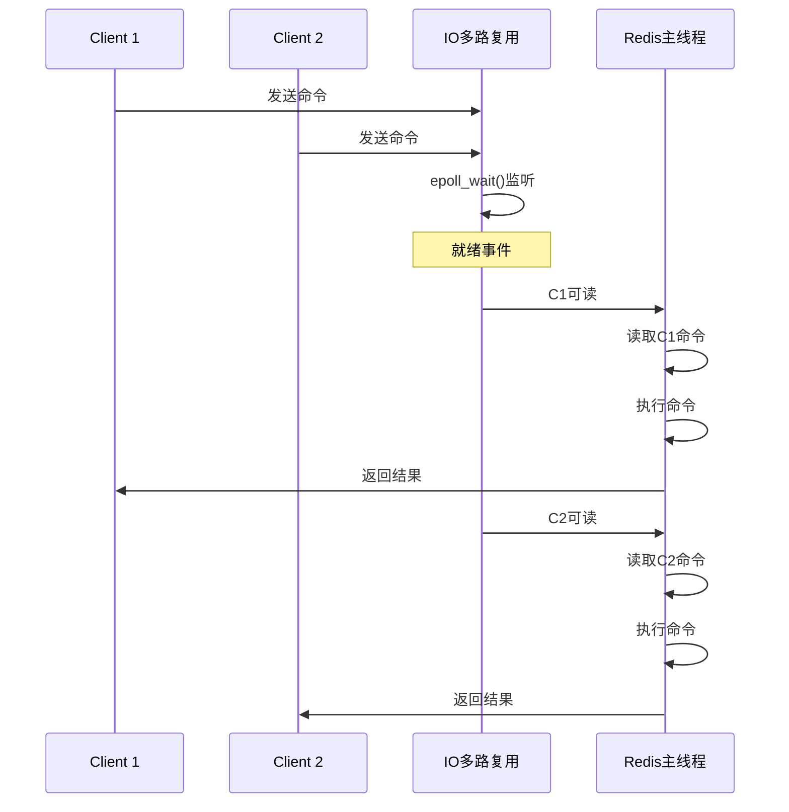
```mermaid
sequenceDiagram
    participant C1 as Client 1
    participant C2 as Client 2
    participant IO as IO多路复用
    participant Redis as Redis主线程
    
    C1->>IO: 发送命令
    C2->>IO: 发送命令
    
    IO->>IO: epoll_wait()监听
    
    Note over IO: 就绪事件
    IO->>Redis: C1可读
    Redis->>Redis: 读取C1命令
    Redis->>Redis: 执行命令
    Redis->>C1: 返回结果
    
    IO->>Redis: C2可读
    Redis->>Redis: 读取C2命令
    Redis->>Redis: 执行命令
    Redis->>C2: 返回结果
```

### 5.3 Redis 6.0 多线程IO

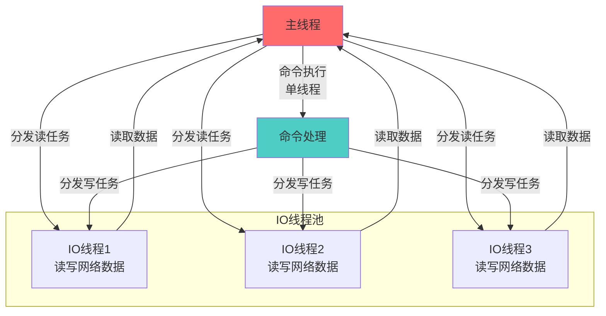
```mermaid
graph TB
    Main[主线程]
    
    subgraph IO线程池
        IO1[IO线程1<br/>读写网络数据]
        IO2[IO线程2<br/>读写网络数据]
        IO3[IO线程3<br/>读写网络数据]
    end
    
    Main -->|分发读任务| IO1
    Main -->|分发读任务| IO2
    Main -->|分发读任务| IO3
    
    IO1 -->|读取数据| Main
    IO2 -->|读取数据| Main
    IO3 -->|读取数据| Main
    
    Main -->|命令执行<br/>单线程| CMD[命令处理]
    
    CMD -->|分发写任务| IO1
    CMD -->|分发写任务| IO2
    CMD -->|分发写任务| IO3
    
    style Main fill:#ff6b6b
    style CMD fill:#4ecdc4
```

**配置方式**：
```bash
# 开启多线程IO
io-threads 4  # IO线程数（建议CPU核数）

# 开启多线程读
io-threads-do-reads yes
```

**注意**：
- 命令执行仍是单线程
- 只是网络IO使用多线程
- 适合网络IO成为瓶颈的场景

---

## 6. 主从复制

### 6.1 主从复制架构

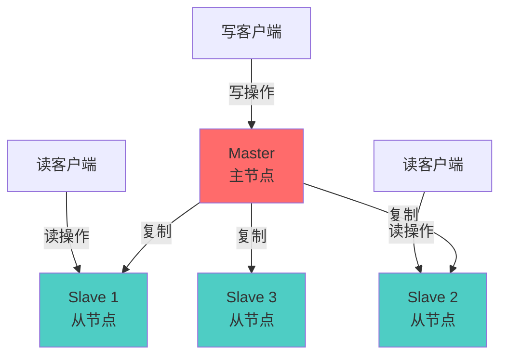
```mermaid
graph TB
    Master[Master<br/>主节点]
    
    Slave1[Slave 1<br/>从节点]
    Slave2[Slave 2<br/>从节点]
    Slave3[Slave 3<br/>从节点]
    
    Master -->|复制| Slave1
    Master -->|复制| Slave2
    Master -->|复制| Slave3
    
    Client1[写客户端] -->|写操作| Master
    Client2[读客户端] -->|读操作| Slave1
    Client3[读客户端] -->|读操作| Slave2
    
    style Master fill:#ff6b6b
    style Slave1 fill:#4ecdc4
    style Slave2 fill:#4ecdc4
    style Slave3 fill:#4ecdc4
```

### 6.2 复制流程

```mermaid
sequenceDiagram
    participant Slave as 从节点
    participant Master as 主节点
    
    Note over Slave: 1. 从节点启动
    Slave->>Slave: 配置：slaveof <master-ip> <port>
    
    Note over Slave,Master: 2. 建立连接
    Slave->>Master: PING
    Master-->>Slave: PONG
    
    Note over Slave,Master: 3. 权限验证
    alt 配置了密码
        Slave->>Master: AUTH <password>
        Master-->>Slave: OK
    end
    
    Note over Slave,Master: 4. 同步数据
    Slave->>Master: PSYNC <replication-id> <offset>
    
    alt 全量复制
        Master->>Master: BGSAVE生成RDB
        Master->>Slave: 发送RDB文件
        Master->>Slave: 发送复制期间的命令
        Slave->>Slave: 清空旧数据
        Slave->>Slave: 加载RDB
        Slave->>Slave: 执行缓冲命令
    else 部分复制
        Master->>Slave: 发送缺失的命令
        Slave->>Slave: 执行命令
    end
    
    Note over Slave,Master: 5. 命令传播
    loop 持续同步
        Master->>Slave: 实时发送写命令
        Slave->>Slave: 执行命令
    end
```

### 6.3 全量复制 vs 部分复制

```mermaid
graph TD
    Start[从节点发起同步]
    Start --> Check{首次同步?}
    
    Check -->|是| Full[全量复制]
    Check -->|否| Partial{部分复制可行?}
    
    Full --> F1[BGSAVE生成RDB]
    F1 --> F2[发送RDB文件]
    F2 --> F3[从节点加载RDB]
    
    Partial -->|是| P1[增量复制]
    Partial -->|否| Full
    
    P1 --> P2[发送缺失命令]
    P2 --> P3[从节点执行]
    
    style Full fill:#ff6b6b
    style P1 fill:#4ecdc4
```

**部分复制原理**：

1. **复制偏移量（Replication Offset）**：
   - 主节点和从节点都维护一个偏移量
   - 主节点每次向从节点传播N字节数据，offset+N
   - 从节点每次接收N字节数据，offset+N

2. **复制积压缓冲区（Replication Backlog）**：
   - 主节点维护的固定长度FIFO队列（默认1MB）
   - 保存最近传播的写命令
   - 从节点断线重连时，根据offset判断是否可部分复制

3. **服务器运行ID（Run ID）**：
   - 每个Redis实例的唯一标识
   - 从节点断线重连后对比run_id，确认是否是同一主节点

**配置**：
```bash
# 从节点配置
slaveof 192.168.1.100 6379
masterauth <password>

# 从节点只读
slave-read-only yes

# 复制积压缓冲区大小
repl-backlog-size 1mb

# 主节点配置
# 最少从节点数
min-slaves-to-write 1
# 从节点最大延迟（秒）
min-slaves-max-lag 10
```

---

## 7. 哨兵模式（Sentinel）

### 7.1 哨兵架构

```mermaid
graph TB
    subgraph Sentinel集群
        S1[Sentinel 1]
        S2[Sentinel 2]
        S3[Sentinel 3]
    end
    
    subgraph Redis集群
        Master[Master<br/>主节点]
        Slave1[Slave 1]
        Slave2[Slave 2]
    end
    
    S1 <-->|监控| Master
    S2 <-->|监控| Master
    S3 <-->|监控| Master
    
    S1 <-->|监控| Slave1
    S2 <-->|监控| Slave2
    S3 <-->|监控| Slave1
    
    S1 <-->|通信| S2
    S2 <-->|通信| S3
    S1 <-->|通信| S3
    
    Master -->|复制| Slave1
    Master -->|复制| Slave2
    
    Client[客户端] -->|询问主节点| S1
    
    style Master fill:#ff6b6b
    style S1 fill:#4ecdc4
    style S2 fill:#4ecdc4
    style S3 fill:#4ecdc4
```

### 7.2 故障转移流程

```mermaid
sequenceDiagram
    participant S1 as Sentinel 1
    participant S2 as Sentinel 2
    participant S3 as Sentinel 3
    participant M as Master
    participant Slave as Slave
    
    Note over S1,M: 1. 主观下线
    loop 每秒PING
        S1->>M: PING
        M-->>S1: PONG
    end
    
    Note over S1: 超时未响应
    S1->>S1: 标记主观下线（SDOWN）
    
    Note over S1,S3: 2. 客观下线
    S1->>S2: 询问Master状态
    S2-->>S1: 同意下线
    S1->>S3: 询问Master状态
    S3-->>S1: 同意下线
    
    Note over S1: 超过quorum数量
    S1->>S1: 标记客观下线（ODOWN）
    
    Note over S1,S3: 3. 选举Leader
    S1->>S2: 请求投票
    S1->>S3: 请求投票
    S2-->>S1: 投票
    S3-->>S1: 投票
    
    Note over S1: S1成为Leader
    
    Note over S1,Slave: 4. 故障转移
    S1->>S1: 选择最优Slave
    S1->>Slave: SLAVEOF NO ONE
    Slave->>Slave: 升级为Master
    
    S1->>S2: 通知新Master地址
    S1->>S3: 通知新Master地址
    
    Note over S1: 5. 旧Master恢复
    M->>S1: 重新上线
    S1->>M: SLAVEOF <new-master>
    M->>M: 降级为Slave
```

### 7.3 哨兵选主规则

选择Slave升级为Master的优先级：

1. **优先级**：`slave-priority`（越小越优先）
2. **复制偏移量**：offset越大越优先（数据越新）
3. **Run ID**：字典序最小的优先

```mermaid
graph TD
    Start[开始选主]
    
    Start --> P1{比较优先级}
    P1 -->|不同| Select1[选择优先级最高]
    P1 -->|相同| P2{比较offset}
    
    P2 -->|不同| Select2[选择offset最大]
    P2 -->|相同| P3{比较Run ID}
    
    P3 --> Select3[选择ID最小]
    
    Select1 --> End[新Master]
    Select2 --> End
    Select3 --> End
    
    style End fill:#4ecdc4
```

### 7.4 哨兵配置

```bash
# sentinel.conf

# 监控的主节点
# sentinel monitor <master-name> <ip> <port> <quorum>
sentinel monitor mymaster 192.168.1.100 6379 2

# 主节点密码
sentinel auth-pass mymaster yourpassword

# 主观下线时间（毫秒）
sentinel down-after-milliseconds mymaster 30000

# 故障转移超时时间
sentinel failover-timeout mymaster 180000

# 并行同步的从节点数
sentinel parallel-syncs mymaster 1

# 通知脚本
sentinel notification-script mymaster /path/to/notify.sh

# 故障转移脚本
sentinel client-reconfig-script mymaster /path/to/reconfig.sh
```

**启动哨兵**：
```bash
redis-sentinel /path/to/sentinel.conf
# 或
redis-server /path/to/sentinel.conf --sentinel
```

---

## 8. 集群模式（Cluster）

### 8.1 集群架构

```mermaid
graph TB
    subgraph Cluster
        subgraph 节点1
            M1[Master 1<br/>Slot 0-5460]
            S1[Slave 1]
        end
        
        subgraph 节点2
            M2[Master 2<br/>Slot 5461-10922]
            S2[Slave 2]
        end
        
        subgraph 节点3
            M3[Master 3<br/>Slot 10923-16383]
            S3[Slave 3]
        end
    end
    
    M1 -->|复制| S1
    M2 -->|复制| S2
    M3 -->|复制| S3
    
    M1 <-->|Gossip协议| M2
    M2 <-->|Gossip协议| M3
    M1 <-->|Gossip协议| M3
    
    Client[客户端] -->|计算slot| M1
    Client -->|计算slot| M2
    Client -->|计算slot| M3
    
    style M1 fill:#ff6b6b
    style M2 fill:#ff6b6b
    style M3 fill:#ff6b6b
```

### 8.2 槽位分配

```mermaid
graph LR
    Key[Key: user:1001]
    
    Key --> CRC16[CRC16哈希]
    CRC16 --> Mod[模16384]
    Mod --> Slot[Slot: 8529]
    
    Slot --> Check{Slot归属}
    Check -->|0-5460| M1[Master 1]
    Check -->|5461-10922| M2[Master 2]
    Check -->|10923-16383| M3[Master 3]
    
    style Slot fill:#4ecdc4
    style M2 fill:#ff6b6b
```

**槽位计算**：
```
HASH_SLOT = CRC16(key) % 16384
```

**槽位分配原则**：
- Redis Cluster有16384个槽位（0-16383）
- 每个Master节点负责一部分槽位
- 槽位可以动态迁移

### 8.3 集群通信（Gossip协议）

```mermaid
sequenceDiagram
    participant N1 as Node 1
    participant N2 as Node 2
    participant N3 as Node 3
    
    Note over N1,N3: Gossip消息类型
    
    Note over N1: MEET消息（加入集群）
    N1->>N2: MEET消息
    N2-->>N1: 返回PONG
    
    Note over N1,N3: PING/PONG（心跳）
    loop 每秒随机选择5个节点
        N1->>N2: PING消息
        N2-->>N1: PONG消息
        
        N2->>N3: PING消息
        N3-->>N2: PONG消息
    end
    
    Note over N1: FAIL消息（节点下线）
    N1->>N1: 检测到N3下线
    N1->>N2: FAIL消息（广播）
    N2->>N2: 标记N3为下线
```

### 8.4 请求重定向

```mermaid
sequenceDiagram
    participant Client as 客户端
    participant N1 as Node 1<br/>Slot 0-5460
    participant N2 as Node 2<br/>Slot 5461-10922
    
    Note over Client: 计算slot: user:1001
    Client->>Client: HASH_SLOT = 8529
    
    Client->>N1: GET user:1001
    
    Note over N1: Slot 8529不在本节点
    N1-->>Client: MOVED 8529 192.168.1.102:6379
    
    Note over Client: 更新槽位缓存
    Client->>N2: GET user:1001
    N2-->>Client: 返回数据
```

**重定向类型**：

1. **MOVED重定向**：
   - 槽位已明确分配给其他节点
   - 客户端应更新槽位缓存
   - `-MOVED 8529 192.168.1.102:6379`

2. **ASK重定向**：
   - 槽位正在迁移中
   - 临时重定向，不更新缓存
   - `-ASK 8529 192.168.1.102:6379`

### 8.5 集群配置

**创建集群**：
```bash
# Redis 5.0+
redis-cli --cluster create \
  192.168.1.101:6379 \
  192.168.1.102:6379 \
  192.168.1.103:6379 \
  192.168.1.104:6379 \
  192.168.1.105:6379 \
  192.168.1.106:6379 \
  --cluster-replicas 1
```

**redis.conf配置**：
```bash
# 启用集群模式
cluster-enabled yes

# 集群配置文件（自动生成）
cluster-config-file nodes-6379.conf

# 节点超时时间
cluster-node-timeout 15000

# 是否所有slot都在线才提供服务
cluster-require-full-coverage yes
```

---

## 9. 缓存策略

### 9.1 缓存模式

#### 9.1.1 Cache-Aside（旁路缓存）

```mermaid
sequenceDiagram
    participant App as 应用
    participant Cache as Redis
    participant DB as 数据库
    
    Note over App: 读操作
    App->>Cache: 1. 读取缓存
    
    alt 缓存命中
        Cache-->>App: 返回数据
    else 缓存未命中
        App->>DB: 2. 查询数据库
        DB-->>App: 返回数据
        App->>Cache: 3. 写入缓存
    end
    
    Note over App: 写操作
    App->>DB: 1. 更新数据库
    App->>Cache: 2. 删除缓存
```

**特点**：
- ✅ 最常用的模式
- ✅ 应用代码控制缓存逻辑
- ❌ 首次访问必然缓存未命中（冷启动）

#### 9.1.2 Read-Through / Write-Through

```mermaid
graph LR
    App[应用] -->|读写| Cache[缓存层]
    Cache -->|透明访问| DB[数据库]
    
    style Cache fill:#4ecdc4
```

**特点**：
- 缓存层负责与数据库交互
- 应用无需关心缓存失效逻辑

#### 9.1.3 Write-Behind（异步写入）

```mermaid
sequenceDiagram
    participant App as 应用
    participant Cache as Redis
    participant Queue as 写队列
    participant DB as 数据库
    
    App->>Cache: 1. 写入缓存
    Cache-->>App: 2. 立即返回
    
    Cache->>Queue: 3. 加入写队列
    
    Note over Queue,DB: 异步批量写入
    loop 定时/批量
        Queue->>DB: 4. 批量写入数据库
    end
```

**特点**：
- ✅ 写性能极高
- ❌ 可能丢失数据（缓存故障）
- 适用场景：日志、点赞数、浏览量

### 9.2 缓存问题

#### 9.2.1 缓存穿透

**问题**：查询不存在的数据，缓存和数据库都没有

```mermaid
graph LR
    User[恶意用户] -->|查询user:-1| App[应用]
    App -->|未命中| Cache[Redis]
    Cache --> App
    App -->|查询| DB[(数据库)]
    DB -->|不存在| App
    
    style User fill:#ff6b6b
    style DB fill:#ff6b6b
```

**解决方案**：

1. **布隆过滤器（Bloom Filter）**：
```java
// 使用Redisson实现
RBloomFilter<String> bloomFilter = redisson.getBloomFilter("user:bloom");
bloomFilter.tryInit(100000, 0.01); // 预期元素数量，误判率

// 添加元素
bloomFilter.add("user:1001");

// 判断元素是否存在
if (!bloomFilter.contains("user:9999")) {
    return null; // 一定不存在
}
```

2. **缓存空值**：
```java
String value = redis.get(key);
if (value == null) {
    value = db.query(key);
    if (value == null) {
        // 缓存空值，设置短过期时间
        redis.setex(key, 60, "NULL");
    } else {
        redis.setex(key, 3600, value);
    }
}
```

#### 9.2.2 缓存击穿

**问题**：热点key过期，大量请求同时打到数据库

```mermaid
sequenceDiagram
    participant C1 as Client 1
    participant C2 as Client 2
    participant C3 as Client 3
    participant Cache as Redis
    participant DB as 数据库
    
    Note over Cache: 热点key过期
    
    par 并发请求
        C1->>Cache: GET hot_key
        C2->>Cache: GET hot_key
        C3->>Cache: GET hot_key
    end
    
    Cache-->>C1: NULL
    Cache-->>C2: NULL
    Cache-->>C3: NULL
    
    par 同时查询DB
        C1->>DB: 查询
        C2->>DB: 查询
        C3->>DB: 查询
    end
    
    style DB fill:#ff6b6b
```

**解决方案**：

1. **互斥锁（Mutex Lock）**：
```java
public String getWithMutex(String key) {
    String value = redis.get(key);
    if (value == null) {
        // 获取分布式锁
        String lockKey = "lock:" + key;
        if (redis.setnx(lockKey, "1", 10)) { // 10秒过期
            try {
                // 查询数据库
                value = db.query(key);
                // 写入缓存
                redis.setex(key, 3600, value);
            } finally {
                redis.del(lockKey);
            }
        } else {
            // 等待后重试
            Thread.sleep(100);
            return getWithMutex(key);
        }
    }
    return value;
}
```

2. **热点数据永不过期**：
- 设置逻辑过期时间（存在value中）
- 异步线程更新缓存

#### 9.2.3 缓存雪崩

**问题**：大量key同时过期，或Redis宕机

```mermaid
graph TB
    Time[某个时刻]
    
    Time --> Expire[大量key同时过期]
    Expire --> Request[海量请求]
    Request --> DB[数据库崩溃]
    
    style Expire fill:#ff6b6b
    style DB fill:#ff6b6b
```

**解决方案**：

1. **过期时间加随机值**：
```java
// 避免同时过期
int expireTime = 3600 + new Random().nextInt(300); // 3600~3900秒
redis.setex(key, expireTime, value);
```

2. **Redis高可用**：
- 主从+哨兵
- Redis Cluster

3. **限流降级**：
```java
// 使用Guava限流
RateLimiter limiter = RateLimiter.create(1000.0); // 每秒1000个请求
if (limiter.tryAcquire()) {
    // 处理请求
} else {
    // 降级返回
    return "服务繁忙";
}
```

4. **多级缓存**：
```
应用 → 本地缓存(Caffeine) → Redis → 数据库
```

---

## 10. 性能优化

### 10.1 慢查询分析

```bash
# 设置慢查询阈值（微秒）
CONFIG SET slowlog-log-slower-than 10000

# 慢查询日志长度
CONFIG SET slowlog-max-len 128

# 查看慢查询
SLOWLOG GET 10

# 清空慢查询
SLOWLOG RESET
```

**慢查询示例输出**：
```
1) 1) (integer) 5          # 日志ID
   2) (integer) 1623456789 # 时间戳
   3) (integer) 12000      # 执行时间（微秒）
   4) 1) "KEYS"            # 命令
      2) "user:*"
```

### 10.2 危险命令

| 命令 | 复杂度 | 危险原因 | 替代方案 |
|------|-------|---------|---------|
| **KEYS** | O(N) | 阻塞服务器 | SCAN命令 |
| **FLUSHALL** | O(N) | 清空所有数据 | 禁用或改名 |
| **FLUSHDB** | O(N) | 清空当前库 | 禁用或改名 |
| **HGETALL** | O(N) | 大hash阻塞 | HSCAN命令 |
| **SMEMBERS** | O(N) | 大set阻塞 | SSCAN命令 |

**禁用危险命令**：
```bash
# redis.conf
rename-command KEYS ""
rename-command FLUSHALL ""
rename-command FLUSHDB ""
rename-command CONFIG "CONFIG_abc123"
```

### 10.3 bigkey问题

**检测bigkey**：
```bash
# 扫描bigkey
redis-cli --bigkeys

# 指定数据库
redis-cli -n 1 --bigkeys

# 慢速扫描（生产环境）
redis-cli --bigkeys --i 0.1
```

**bigkey危害**：
- 网络阻塞（传���大value）
- 操作超时（序列化/反序列化慢）
- 内存不均（集群模式下）
- 过期删除卡顿

**解决方案**：

1. **拆分bigkey**：
```java
// 大hash拆分
// 原：user:1001 -> {name: "张三", age: 20, ...1000个字段}
// 拆分后：
user:1001:base -> {name: "张三", age: 20}
user:1001:profile -> {city: "北京", ...}
user:1001:settings -> {...}
```

2. **删除bigkey**：
```java
// 错误：直接DEL（阻塞）
redis.del("bigkey");

// 正确：分批删除
// Hash
while (redis.hlen("bighash") > 0) {
    redis.hscan("bighash", cursor, count=100);
    redis.hdel("bighash", fields);
}

// List
while (redis.llen("biglist") > 0) {
    redis.ltrim("biglist", 0, -101); // 保留前100个，删除其余
}
```

### 10.4 Pipeline批量操作

```java
// 不使用Pipeline（100次网络往返）
for (int i = 0; i < 100; i++) {
    redis.set("key" + i, "value" + i);
}

// 使用Pipeline（1次网络往返）
Pipeline pipeline = redis.pipelined();
for (int i = 0; i < 100; i++) {
    pipeline.set("key" + i, "value" + i);
}
pipeline.sync(); // 同步执行
```

**Pipeline vs 原生批量命令**：

| 特性 | Pipeline | MGET/MSET |
|------|----------|-----------|
| **命令类型** | 任意命令 | 只能批量GET/SET |
| **原子性** | ❌ 非原子 | ✅ 原子操作 |
| **网络往返** | 1次 | 1次 |
| **适用场景** | 不同类型命令 | 批量读写String |

### 10.5 内存优化

**内存分析**：
```bash
# 查看内存使用
INFO memory

# 内存分析报告
MEMORY DOCTOR

# 查看key内存占用
MEMORY USAGE key
```

**优化策略**：

1. **选择合适的数据结构**：
```
String (SDS): 44字节头部 + 数据
Hash (ziplist): 紧凑，适合小对象
Set (intset): 整数集合，节省内存
```

2. **压缩配置**：
```bash
# Hash压缩（元素少且值小时使用ziplist）
hash-max-ziplist-entries 512
hash-max-ziplist-value 64

# List压缩
list-max-ziplist-size -2
list-compress-depth 0

# Set压缩
set-max-intset-entries 512

# ZSet压缩
zset-max-ziplist-entries 128
zset-max-ziplist-value 64
```

3. **Key设计**：
```java
// 不好：长key浪费内存
user:information:profile:basic:name:1001

// 好：短key节省内存
u:1001:n
```

---

## 11. 分布式锁

### 11.1 基于SETNX的简单实现

```java
public class RedisLock {
    
    // 加锁
    public boolean lock(String key, String value, int expireTime) {
        // SET key value NX EX expireTime
        String result = redis.set(key, value, "NX", "EX", expireTime);
        return "OK".equals(result);
    }
    
    // 解锁（Lua脚本保证原子性）
    public boolean unlock(String key, String value) {
        String script = 
            "if redis.call('get', KEYS[1]) == ARGV[1] then " +
            "    return redis.call('del', KEYS[1]) " +
            "else " +
            "    return 0 " +
            "end";
        
        Object result = redis.eval(script, 
            Collections.singletonList(key),
            Collections.singletonList(value));
        
        return Long.valueOf(1).equals(result);
    }
}
```

### 11.2 Redlock算法

```mermaid
sequenceDiagram
    participant Client as 客户端
    participant R1 as Redis 1
    participant R2 as Redis 2
    participant R3 as Redis 3
    participant R4 as Redis 4
    participant R5 as Redis 5
    
    Note over Client: 1. 获取当前时间 T1
    
    par 向所有实例请求锁
        Client->>R1: SET lock value NX EX 30
        Client->>R2: SET lock value NX EX 30
        Client->>R3: SET lock value NX EX 30
        Client->>R4: SET lock value NX EX 30
        Client->>R5: SET lock value NX EX 30
    end
    
    R1-->>Client: OK
    R2-->>Client: OK
    R3-->>Client: OK
    R4-->>Client: FAIL
    R5-->>Client: FAIL
    
    Note over Client: 2. 获取当前时间 T2
    Note over Client: 3. 计算耗时 T2-T1
    Note over Client: 4. 成功数量 >= N/2+1 (3/5)
    Note over Client: 5. 锁有效时间 = 30s - (T2-T1)
    
    Note over Client: 加锁成功
```

**Redlock步骤**：
1. 获取当前时间（毫秒）
2. 依次向N个Redis实例请求锁
3. 计算获取锁的耗时
4. 判断是否成功：
   - 成功实例数 >= N/2 + 1
   - 总耗时 < 锁过期时间
5. 加锁成功，计算有效时间
6. 失败则向所有实例释放锁

---

## 12. 最佳实践

### 12.1 Key设计规范

```
✅ 好的key设计
业务:对象:ID:属性
user:info:1001:name
order:detail:202301:amount

✅ 使用分隔符
user:1001 (推荐冒号)

✅ 控制长度
不超过44字节（embstr优化）

❌ 避免特殊字符
空格、换行、引号

❌ 避免bigkey
单个key不超过10KB
```

### 12.2 连接池配置

```java
// Jedis连接池配置
JedisPoolConfig poolConfig = new JedisPoolConfig();

// 最大连接数
poolConfig.setMaxTotal(100);

// 最大空闲连接
poolConfig.setMaxIdle(20);

// 最小空闲连接
poolConfig.setMinIdle(10);

// 获取连接最大等待时间（毫秒）
poolConfig.setMaxWaitMillis(3000);

// 连接耗尽时是否阻塞
poolConfig.setBlockWhenExhausted(true);

// 获取连接时检测有效性
poolConfig.setTestOnBorrow(true);

// 空闲时检测有效性
poolConfig.setTestWhileIdle(true);

// 空闲检测周期（毫秒）
poolConfig.setTimeBetweenEvictionRunsMillis(30000);

JedisPool jedisPool = new JedisPool(poolConfig, "127.0.0.1", 6379, 3000, "password");
```

### 12.3 生产环境配置

```bash
# redis.conf 生产环境配置

# 绑定地址（安全）
bind 127.0.0.1 192.168.1.100

# 保护模式
protected-mode yes

# 端口
port 6379

# 密码
requirepass yourStrongPassword

# 最大内存
maxmemory 4gb

# 淘汰策略
maxmemory-policy allkeys-lru

# 持久化（推荐混合）
appendonly yes
aof-use-rdb-preamble yes

# 慢查询
slowlog-log-slower-than 10000
slowlog-max-len 128

# 客户端连接数
maxclients 10000

# 超时时间（秒，0表示永不超时）
timeout 300

# TCP keepalive
tcp-keepalive 300

# 日志级别
loglevel notice

# 日志文件
logfile /var/log/redis/redis.log

# 禁用危险命令
rename-command FLUSHALL ""
rename-command FLUSHDB ""
rename-command CONFIG "CONFIG_SECRET_KEY"
rename-command KEYS ""
```

---

## 13. 监控指标

### 13.1 核心指标

| 类别 | 指标 | 说明 | 告警阈值 |
|------|------|------|---------|
| **内存** | used_memory | 已使用内存 | >80% maxmemory |
| | mem_fragmentation_ratio | 内存碎片率 | <1 或 >1.5 |
| **性能** | instantaneous_ops_per_sec | QPS | - |
| | latency | 命令延迟 | >10ms |
| **持久化** | rdb_last_save_time | 最后RDB时间 | >1小时 |
| | aof_last_rewrite_time_sec | AOF重写耗时 | >300秒 |
| **连接** | connected_clients | 客户端连接数 | >8000 |
| | rejected_connections | 拒绝连接数 | >0 |
| **复制** | master_link_down_since_seconds | 主从断开时间 | >30秒 |
| **命中率** | keyspace_hits / (keyspace_hits + keyspace_misses) | 缓存命中率 | <80% |

### 13.2 监控命令

```bash
# 查看info信息
INFO
INFO memory
INFO stats
INFO replication
INFO persistence

# 实时监控命令
MONITOR

# 查看客户端连接
CLIENT LIST

# 查看慢查询
SLOWLOG GET 10

# 查看延迟
LATENCY DOCTOR
LATENCY HISTORY command
```

---

## 14. 故障排查

### 14.1 常见问题

**问题1：连接超时**
```bash
# 检查Redis进程
ps aux | grep redis

# 检查端口监听
netstat -tuln | grep 6379

# 检查防火墙
iptables -L -n

# 测试连接
redis-cli -h 127.0.0.1 -p 6379 PING
```

**问题2：内存持续增长**
```bash
# 检查内存信息
INFO memory

# 查找bigkey
redis-cli --bigkeys

# 检查过期策略
CONFIG GET maxmemory-policy

# 手动触发清理
MEMORY PURGE
```

**问题3：主从同步延迟**
```bash
# 主节点查看
INFO replication

# 检查复制积压缓冲区
CONFIG GET repl-backlog-size

# 检查网络延迟
redis-cli --latency -h slave-ip

# 增大缓冲区
CONFIG SET repl-backlog-size 10mb
```

---

## 15. 总结

### 15.1 Redis核心优势

✅ **高性能**
- 纯内存操作（ns级）
- IO多路复用
- 单线程避免锁竞争

✅ **丰富的数据结构**
- String、List、Hash、Set、ZSet
- 底层优化（ziplist、skiplist）

✅ **持久化机制**
- RDB快照
- AOF日志
- 混合持久化

✅ **高可用**
- 主从复制
- 哨兵自动故障转移
- 集群模式（16384槽位）

✅ **灵活的过期策略**
- 惰性删除 + 定期删除
- 8种内存淘汰策略

### 15.2 应用场景总结

| 场景 | 数据结构 | 核心特性 |
|------|---------|---------|
| **缓存** | String | 高性能读写 |
| **会话存储** | String/Hash | 序列化用户信息 |
| **排行榜** | ZSet | 有序集合，O(logN)查询 |
| **计数器** | String | INCR原子操作 |
| **分布式锁** | String | SETNX + 过期时间 |
| **消息队列** | List | LPUSH + BRPOP |
| **去重** | Set | 自动去重 |
| **社交关系** | Set | 交集、并集、差集 |
| **购物车** | Hash | 字段独立操作 |
| **延迟队列** | ZSet | score作为时间戳 |

### 15.3 技术选型建议

**选择Redis的场景**：
- 需要高性能缓存
- 需要丰富的数据结构
- 需要持久化
- 单机QPS < 10万

**不适合Redis的场景**：
- 大数据量存储（>内存容量）
- 复杂查询（需要SQL）
- 强一致性要求（银行转账）

---

## 附录：参考资料

- 📚 [Redis官方文档](https://redis.io/documentation)
- 💻 [GitHub仓库](https://github.com/redis/redis)
- 📖 《Redis设计与实现》- 黄健宏
- 📖 《Redis深度历险》- 钱文品
- 🎓 [Redis University](https://university.redis.com/)

---

**文档版本**: v1.0  
**最后更新**: 2025-10-25  
**作者**: AI Assistant  
**适用版本**: Redis 6.x / 7.x
