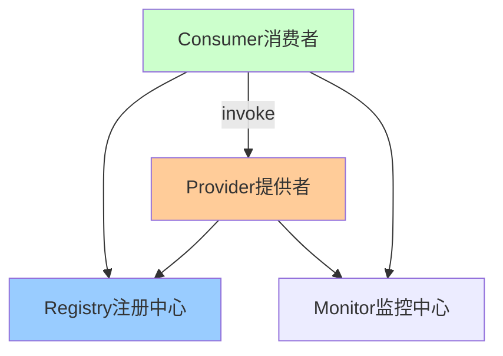

# Dubbo与gRPC详解

> 深入理解高性能RPC框架：Dubbo、gRPC

---

## 📋 目录

1. [RPC框架对比](#1-rpc框架对比)
2. [Dubbo详解](#2-dubbo详解)
3. [gRPC详解](#3-grpc详解)
4. [性能优化](#4-性能优化)
5. [最佳实践](#5-最佳实践)

---

## 1. RPC框架对比

### 1.1 主流RPC框架

```
┌────────────┬──────────────┬──────────────┬──────────────┐
│    特性    │    Dubbo     │     gRPC     │   OpenFeign  │
├────────────┼──────────────┼──────────────┼──────────────┤
│  通信协议  │  Dubbo协议   │    HTTP/2    │    HTTP/1.1  │
│  序列化    │  Hessian     │   Protobuf   │     JSON     │
│  性能      │    ⭐⭐⭐    │   ⭐⭐⭐⭐   │     ⭐⭐     │
│  易用性    │    ⭐⭐      │    ⭐⭐⭐    │   ⭐⭐⭐⭐   │
│  生态      │  阿里系      │    Google    │    Spring    │
│  多语言    │    ✅        │     ✅       │      ❌      │
│  服务治理  │  完善        │    一般      │     基础     │
└────────────┴──────────────┴──────────────┴──────────────┘

选型建议：
✅ Dubbo：Java微服务，需要完善的服务治理
✅ gRPC：多语言、高性能要求、流式传输
✅ OpenFeign：Spring Cloud体系、REST API
```

---

## 2. Dubbo详解

### 2.1 快速开始

**Maven依赖**：
```xml
<dependencies>
    <!-- Dubbo Spring Boot Starter -->
    <dependency>
        <groupId>org.apache.dubbo</groupId>
        <artifactId>dubbo-spring-boot-starter</artifactId>
        <version>3.2.0</version>
    </dependency>
    
    <!-- Nacos注册中心 -->
    <dependency>
        <groupId>com.alibaba.nacos</groupId>
        <artifactId>nacos-client</artifactId>
        <version>2.2.0</version>
    </dependency>
    
    <!-- Dubbo Nacos适配 -->
    <dependency>
        <groupId>org.apache.dubbo</groupId>
        <artifactId>dubbo-registry-nacos</artifactId>
        <version>3.2.0</version>
    </dependency>
</dependencies>
```

### 2.2 服务提供者

**1. 定义接口**（dubbo-api模块）：
```java
public interface OrderService {
    
    /**
     * 创建订单
     */
    Long createOrder(OrderDTO orderDTO);
    
    /**
     * 查询订单
     */
    Order getOrder(Long orderId);
    
    /**
     * 查询订单列表
     */
    List<Order> listOrders(QueryParam param);
}
```

**2. 实现服务**（dubbo-provider模块）：
```java
@DubboService(
    version = "1.0.0",
    timeout = 3000,
    retries = 2,
    loadbalance = "random"
)
public class OrderServiceImpl implements OrderService {
    
    @Autowired
    private OrderMapper orderMapper;
    
    @Override
    public Long createOrder(OrderDTO orderDTO) {
        Order order = new Order();
        BeanUtils.copyProperties(orderDTO, order);
        orderMapper.insert(order);
        return order.getId();
    }
    
    @Override
    public Order getOrder(Long orderId) {
        return orderMapper.selectById(orderId);
    }
    
    @Override
    public List<Order> listOrders(QueryParam param) {
        return orderMapper.selectList(param);
    }
}
```

**3. 配置**（application.yml）：
```yaml
dubbo:
  application:
    name: order-service-provider
  # 协议配置
  protocol:
    name: dubbo
    port: 20880
    # 线程池配置
    threads: 200
    # 序列化方式
    serialization: hessian2
  # 注册中心
  registry:
    address: nacos://localhost:8848
    group: DEFAULT_GROUP
    namespace: dev
  # 元数据配置
  metadata-report:
    address: nacos://localhost:8848
  # 配置中心
  config-center:
    address: nacos://localhost:8848
```

### 2.3 服务消费者

**1. 引用服务**：
```java
@Service
public class PaymentService {
    
    @DubboReference(
        version = "1.0.0",
        timeout = 3000,
        retries = 2,
        check = false  // 启动时不检查服务是否存在
    )
    private OrderService orderService;
    
    public void processPayment(Long orderId) {
        // RPC调用
        Order order = orderService.getOrder(orderId);
        
        // 处理支付逻辑
        doPayment(order);
    }
}
```

**2. 配置**：
```yaml
dubbo:
  application:
    name: payment-service-consumer
  registry:
    address: nacos://localhost:8848
  consumer:
    timeout: 3000
    retries: 2
    check: false
```

### 2.4 Dubbo架构



**核心组件**：
```
1. Provider：服务提供者
2. Consumer：服务消费者
3. Registry：注册中心（Nacos、Zookeeper）
4. Monitor：监控中心
5. Container：服务容器
```

### 2.5 高级特性

**1. 负载均衡**：
```java
@DubboService(loadbalance = "random")  // 随机
// 其他选项：
// - random：随机（默认）
// - roundrobin：轮询
// - leastactive：最少活跃调用数
// - consistenthash：一致性Hash
public class OrderServiceImpl implements OrderService {
    // ...
}
```

**2. 集群容错**：
```java
@DubboService(cluster = "failover")  // 失败自动切换
// 其他选项：
// - failfast：快速失败
// - failsafe：失败安全
// - failback：失败自动恢复
// - forking：并行调用
public class OrderServiceImpl implements OrderService {
    // ...
}
```

**3. 异步调用**：
```java
// 服务端异步
@DubboService
public class OrderServiceImpl implements OrderService {
    
    @Override
    public CompletableFuture<Order> getOrderAsync(Long orderId) {
        return CompletableFuture.supplyAsync(() -> {
            return orderMapper.selectById(orderId);
        });
    }
}

// 客户端异步
@Service
public class PaymentService {
    
    @DubboReference(async = true)
    private OrderService orderService;
    
    public void processAsync(Long orderId) {
        // 异步调用
        CompletableFuture<Order> future = RpcContext.getContext()
            .getCompletableFuture();
        
        future.thenAccept(order -> {
            // 处理订单
            doPayment(order);
        });
    }
}
```

**4. 泛化调用**（无需API接口）：
```java
@Service
public class GenericInvokeService {
    
    @Autowired
    private ApplicationContext context;
    
    public Object invoke(String service, String method, Object[] args) {
        ReferenceConfig<GenericService> reference = new ReferenceConfig<>();
        reference.setInterface(service);
        reference.setGeneric("true");
        reference.setApplication(context.getBean(ApplicationConfig.class));
        reference.setRegistry(context.getBean(RegistryConfig.class));
        
        GenericService genericService = reference.get();
        
        return genericService.$invoke(method, 
            new String[]{"java.lang.Long"}, 
            args
        );
    }
}
```

**5. 服务降级**：
```java
@DubboReference(
    mock = "return null"  // 失败返回null
    // mock = "force:return null"  // 强制降级
    // mock = "fail:return null"   // 失败时降级
    // mock = "com.example.OrderServiceMock"  // 自定义Mock类
)
private OrderService orderService;

// 自定义Mock
public class OrderServiceMock implements OrderService {
    
    @Override
    public Order getOrder(Long orderId) {
        Order order = new Order();
        order.setId(orderId);
        order.setStatus("MOCK");
        return order;
    }
}
```

### 2.6 服务治理

**1. 动态配置**：
```yaml
# 在Nacos配置中心动态修改
dubbo.reference.com.example.OrderService.timeout=5000
dubbo.reference.com.example.OrderService.retries=3
```

**2. 服务路由**（基于条件路由）：
```yaml
# 路由规则配置
scope: application
force: false
runtime: true
enabled: true
key: order-service
conditions:
  - "method=getOrder => host=192.168.1.100"  # 指定方法路由到指定机器
  - "arguments[0]=123 => host=192.168.1.101" # 指定参数路由
```

**3. 流量控制**：
```java
@DubboService(
    executes = 10,  // 服务端并发执行不能超过10
    actives = 5     // 消费端并发调用不能超过5
)
public class OrderServiceImpl implements OrderService {
    // ...
}
```

---

## 3. gRPC详解

### 3.1 快速开始

**Maven依赖**：
```xml
<dependencies>
    <!-- gRPC -->
    <dependency>
        <groupId>io.grpc</groupId>
        <artifactId>grpc-netty-shaded</artifactId>
        <version>1.58.0</version>
    </dependency>
    <dependency>
        <groupId>io.grpc</groupId>
        <artifactId>grpc-protobuf</artifactId>
        <version>1.58.0</version>
    </dependency>
    <dependency>
        <groupId>io.grpc</groupId>
        <artifactId>grpc-stub</artifactId>
        <version>1.58.0</version>
    </dependency>
    
    <!-- Protobuf -->
    <dependency>
        <groupId>com.google.protobuf</groupId>
        <artifactId>protobuf-java</artifactId>
        <version>3.24.0</version>
    </dependency>
</dependencies>

<!-- Protobuf编译插件 -->
<build>
    <extensions>
        <extension>
            <groupId>kr.motd.maven</groupId>
            <artifactId>os-maven-plugin</artifactId>
            <version>1.7.1</version>
        </extension>
    </extensions>
    <plugins>
        <plugin>
            <groupId>org.xolstice.maven.plugins</groupId>
            <artifactId>protobuf-maven-plugin</artifactId>
            <version>0.6.1</version>
            <configuration>
                <protocArtifact>
                    com.google.protobuf:protoc:3.24.0:exe:${os.detected.classifier}
                </protocArtifact>
                <pluginId>grpc-java</pluginId>
                <pluginArtifact>
                    io.grpc:protoc-gen-grpc-java:1.58.0:exe:${os.detected.classifier}
                </pluginArtifact>
            </configuration>
            <executions>
                <execution>
                    <goals>
                        <goal>compile</goal>
                        <goal>compile-custom</goal>
                    </goals>
                </execution>
            </executions>
        </plugin>
    </plugins>
</build>
```

### 3.2 定义Protocol Buffers

**order.proto**：
```protobuf
syntax = "proto3";

package com.example.grpc;

option java_multiple_files = true;
option java_package = "com.example.grpc";
option java_outer_classname = "OrderProto";

// 订单服务
service OrderService {
  // 创建订单（Unary RPC）
  rpc CreateOrder(CreateOrderRequest) returns (CreateOrderResponse);
  
  // 查询订单（Unary RPC）
  rpc GetOrder(GetOrderRequest) returns (Order);
  
  // 订单流（Server Streaming RPC）
  rpc StreamOrders(StreamOrdersRequest) returns (stream Order);
  
  // 批量创建（Client Streaming RPC）
  rpc BatchCreate(stream CreateOrderRequest) returns (BatchCreateResponse);
  
  // 双向流（Bidirectional Streaming RPC）
  rpc OrderChat(stream OrderMessage) returns (stream OrderMessage);
}

// 订单消息
message Order {
  int64 id = 1;
  int64 user_id = 2;
  string product_name = 3;
  int32 count = 4;
  double price = 5;
  string status = 6;
  int64 create_time = 7;
}

// 创建订单请求
message CreateOrderRequest {
  int64 user_id = 1;
  string product_name = 2;
  int32 count = 3;
  double price = 4;
}

// 创建订单响应
message CreateOrderResponse {
  int64 order_id = 1;
  string message = 2;
}

// 查询订单请求
message GetOrderRequest {
  int64 order_id = 1;
}

// 流式查询请求
message StreamOrdersRequest {
  int64 user_id = 1;
  int32 limit = 2;
}

// 批量创建响应
message BatchCreateResponse {
  int32 success_count = 1;
  int32 fail_count = 2;
}

// 订单消息（双向流）
message OrderMessage {
  string message = 1;
  int64 timestamp = 2;
}
```

### 3.3 服务端实现

**1. 实现服务**：
```java
@Slf4j
public class OrderServiceImpl extends OrderServiceGrpc.OrderServiceImplBase {
    
    @Autowired
    private OrderMapper orderMapper;
    
    /**
     * Unary RPC：创建订单
     */
    @Override
    public void createOrder(CreateOrderRequest request,
                           StreamObserver<CreateOrderResponse> responseObserver) {
        try {
            // 业务逻辑
            Order order = new Order();
            order.setUserId(request.getUserId());
            order.setProductName(request.getProductName());
            order.setCount(request.getCount());
            order.setPrice(request.getPrice());
            orderMapper.insert(order);
            
            // 构建响应
            CreateOrderResponse response = CreateOrderResponse.newBuilder()
                .setOrderId(order.getId())
                .setMessage("订单创建成功")
                .build();
            
            responseObserver.onNext(response);
            responseObserver.onCompleted();
        } catch (Exception e) {
            log.error("创建订单失败", e);
            responseObserver.onError(Status.INTERNAL
                .withDescription(e.getMessage())
                .asRuntimeException());
        }
    }
    
    /**
     * Unary RPC：查询订单
     */
    @Override
    public void getOrder(GetOrderRequest request,
                        StreamObserver<Order> responseObserver) {
        Order order = orderMapper.selectById(request.getOrderId());
        
        if (order == null) {
            responseObserver.onError(Status.NOT_FOUND
                .withDescription("订单不存在")
                .asRuntimeException());
            return;
        }
        
        responseObserver.onNext(order);
        responseObserver.onCompleted();
    }
    
    /**
     * Server Streaming RPC：流式返回订单
     */
    @Override
    public void streamOrders(StreamOrdersRequest request,
                            StreamObserver<Order> responseObserver) {
        List<Order> orders = orderMapper.selectByUserId(
            request.getUserId(),
            request.getLimit()
        );
        
        // 流式发送
        for (Order order : orders) {
            responseObserver.onNext(order);
            
            // 模拟延迟
            try {
                Thread.sleep(100);
            } catch (InterruptedException e) {
                Thread.currentThread().interrupt();
            }
        }
        
        responseObserver.onCompleted();
    }
    
    /**
     * Client Streaming RPC：客户端流式发送
     */
    @Override
    public StreamObserver<CreateOrderRequest> batchCreate(
        StreamObserver<BatchCreateResponse> responseObserver) {
        
        return new StreamObserver<CreateOrderRequest>() {
            int successCount = 0;
            int failCount = 0;
            
            @Override
            public void onNext(CreateOrderRequest request) {
                try {
                    // 创建订单
                    Order order = new Order();
                    order.setUserId(request.getUserId());
                    order.setProductName(request.getProductName());
                    orderMapper.insert(order);
                    successCount++;
                } catch (Exception e) {
                    log.error("创建订单失败", e);
                    failCount++;
                }
            }
            
            @Override
            public void onError(Throwable t) {
                log.error("批量创建异常", t);
            }
            
            @Override
            public void onCompleted() {
                BatchCreateResponse response = BatchCreateResponse.newBuilder()
                    .setSuccessCount(successCount)
                    .setFailCount(failCount)
                    .build();
                
                responseObserver.onNext(response);
                responseObserver.onCompleted();
            }
        };
    }
    
    /**
     * Bidirectional Streaming RPC：双向流
     */
    @Override
    public StreamObserver<OrderMessage> orderChat(
        StreamObserver<OrderMessage> responseObserver) {
        
        return new StreamObserver<OrderMessage>() {
            @Override
            public void onNext(OrderMessage message) {
                // 处理客户端消息
                log.info("收到消息：{}", message.getMessage());
                
                // 回复消息
                OrderMessage response = OrderMessage.newBuilder()
                    .setMessage("服务端收到：" + message.getMessage())
                    .setTimestamp(System.currentTimeMillis())
                    .build();
                
                responseObserver.onNext(response);
            }
            
            @Override
            public void onError(Throwable t) {
                log.error("通信异常", t);
            }
            
            @Override
            public void onCompleted() {
                responseObserver.onCompleted();
            }
        };
    }
}
```

**2. 启动服务器**：
```java
@Component
@Slf4j
public class GrpcServer {
    
    @Autowired
    private OrderServiceImpl orderService;
    
    @Value("${grpc.server.port:9090}")
    private int port;
    
    private Server server;
    
    @PostConstruct
    public void start() throws IOException {
        server = ServerBuilder.forPort(port)
            .addService(orderService)
            .build()
            .start();
        
        log.info("gRPC服务启动，端口：{}", port);
        
        // 关闭钩子
        Runtime.getRuntime().addShutdownHook(new Thread(() -> {
            log.info("关闭gRPC服务");
            GrpcServer.this.stop();
        }));
    }
    
    public void stop() {
        if (server != null) {
            server.shutdown();
        }
    }
    
    public void blockUntilShutdown() throws InterruptedException {
        if (server != null) {
            server.awaitTermination();
        }
    }
}
```

### 3.4 客户端实现

```java
@Service
@Slf4j
public class OrderGrpcClient {
    
    private final ManagedChannel channel;
    private final OrderServiceGrpc.OrderServiceBlockingStub blockingStub;
    private final OrderServiceGrpc.OrderServiceStub asyncStub;
    
    public OrderGrpcClient(@Value("${grpc.client.host:localhost}") String host,
                          @Value("${grpc.client.port:9090}") int port) {
        // 创建Channel
        this.channel = ManagedChannelBuilder
            .forAddress(host, port)
            .usePlaintext()  // 不使用TLS
            .build();
        
        // 同步Stub
        this.blockingStub = OrderServiceGrpc.newBlockingStub(channel);
        
        // 异步Stub
        this.asyncStub = OrderServiceGrpc.newStub(channel);
    }
    
    /**
     * 创建订单（同步）
     */
    public Long createOrder(Long userId, String productName, int count, double price) {
        CreateOrderRequest request = CreateOrderRequest.newBuilder()
            .setUserId(userId)
            .setProductName(productName)
            .setCount(count)
            .setPrice(price)
            .build();
        
        CreateOrderResponse response = blockingStub.createOrder(request);
        return response.getOrderId();
    }
    
    /**
     * 查询订单（同步）
     */
    public Order getOrder(Long orderId) {
        GetOrderRequest request = GetOrderRequest.newBuilder()
            .setOrderId(orderId)
            .build();
        
        return blockingStub.getOrder(request);
    }
    
    /**
     * 流式查询订单（异步）
     */
    public void streamOrders(Long userId, int limit) {
        StreamOrdersRequest request = StreamOrdersRequest.newBuilder()
            .setUserId(userId)
            .setLimit(limit)
            .build();
        
        asyncStub.streamOrders(request, new StreamObserver<Order>() {
            @Override
            public void onNext(Order order) {
                log.info("收到订单：{}", order.getId());
            }
            
            @Override
            public void onError(Throwable t) {
                log.error("流式查询异常", t);
            }
            
            @Override
            public void onCompleted() {
                log.info("流式查询完成");
            }
        });
    }
    
    @PreDestroy
    public void shutdown() throws InterruptedException {
        channel.shutdown().awaitTermination(5, TimeUnit.SECONDS);
    }
}
```

---

## 4. 性能优化

### 4.1 Dubbo性能优化

```yaml
dubbo:
  protocol:
    # 1. 使用更快的序列化方式
    serialization: kryo  # kryo > hessian2 > json
    
    # 2. 优化线程池
    threads: 200
    threadpool: cached  # cached线程池
    
    # 3. 启用异步调用
    async: true
    
  provider:
    # 4. 优化超时时间
    timeout: 3000
    
    # 5. 合理设置重试次数
    retries: 0  # 幂等操作可重试，非幂等设为0
    
  consumer:
    # 6. 启用本地缓存
    cache: lru
    
    # 7. 连接数配置
    connections: 2  # 每个服务提供者保持2个长连接
```

### 4.2 gRPC性能优化

```java
// 1. 连接池优化
private static final LoadBalancerRegistry registry = LoadBalancerRegistry.getDefaultRegistry();
static {
    registry.register(new RoundRobinLoadBalancerProvider());
}

ManagedChannel channel = ManagedChannelBuilder
    .forTarget("dns:///example.com:9090")
    .usePlaintext()
    // 2. 启用负载均衡
    .defaultLoadBalancingPolicy("round_robin")
    // 3. 连接池配置
    .maxInboundMessageSize(10 * 1024 * 1024)  // 10MB
    // 4. keepalive配置
    .keepAliveTime(30, TimeUnit.SECONDS)
    .keepAliveTimeout(10, TimeUnit.SECONDS)
    .keepAliveWithoutCalls(true)
    .build();

// 5. 使用异步Stub
OrderServiceGrpc.OrderServiceStub asyncStub = OrderServiceGrpc.newStub(channel);

// 6. 批量处理（Client Streaming）
StreamObserver<CreateOrderRequest> requestObserver = asyncStub.batchCreate(responseObserver);
for (CreateOrderRequest request : requests) {
    requestObserver.onNext(request);
}
requestObserver.onCompleted();
```

---

## 5. 最佳实践

### 5.1 Dubbo最佳实践

```java
/**
 * 1. 接口设计
 */
public interface OrderService {
    // ✅ 推荐：返回值具体
    Order getOrder(Long orderId);
    
    // ❌ 不推荐：返回Map
    Map<String, Object> getOrderMap(Long orderId);
    
    // ✅ 推荐：参数对象化
    List<Order> listOrders(QueryParam param);
    
    // ❌ 不推荐：参数过多
    List<Order> listOrders(Long userId, Integer status, Date startTime, Date endTime);
}

/**
 * 2. 异常处理
 */
@DubboService
public class OrderServiceImpl implements OrderService {
    
    @Override
    public Order getOrder(Long orderId) {
        try {
            return orderMapper.selectById(orderId);
        } catch (Exception e) {
            // 记录日志
            log.error("查询订单失败，orderId={}", orderId, e);
            // 抛出业务异常
            throw new BusinessException("订单查询失败");
        }
    }
}

/**
 * 3. 超时设置
 */
@DubboService(
    timeout = 3000,  // 默认超时
    methods = {
        @Method(name = "createOrder", timeout = 5000),  // 单独配置
        @Method(name = "batchCreate", timeout = 10000)
    }
)
public class OrderServiceImpl implements OrderService {
    // ...
}
```

### 5.2 gRPC最佳实践

```protobuf
// 1. Message设计
message Order {
  // ✅ 使用明确的字段编号
  int64 id = 1;
  int64 user_id = 2;
  
  // ✅ 使用合适的数据类型
  google.protobuf.Timestamp create_time = 3;
  
  // ✅ 预留字段编号
  reserved 4 to 10;
}

// 2. 服务设计
service OrderService {
  // ✅ 命名清晰
  rpc CreateOrder(CreateOrderRequest) returns (CreateOrderResponse);
  
  // ✅ 批量操作使用流
  rpc BatchCreateOrders(stream CreateOrderRequest) returns (BatchCreateResponse);
  
  // ✅ 大数据量使用流
  rpc StreamOrders(StreamOrdersRequest) returns (stream Order);
}
```

```java
// 3. 错误处理
@Override
public void getOrder(GetOrderRequest request,
                    StreamObserver<Order> responseObserver) {
    try {
        Order order = orderMapper.selectById(request.getOrderId());
        
        if (order == null) {
            // 使用标准gRPC错误码
            responseObserver.onError(
                Status.NOT_FOUND
                    .withDescription("订单不存在")
                    .asRuntimeException()
            );
            return;
        }
        
        responseObserver.onNext(order);
        responseObserver.onCompleted();
    } catch (Exception e) {
        log.error("查询订单失败", e);
        responseObserver.onError(
            Status.INTERNAL
                .withDescription(e.getMessage())
                .withCause(e)
                .asRuntimeException()
        );
    }
}

// 4. 超时控制
OrderServiceGrpc.OrderServiceBlockingStub stub = OrderServiceGrpc
    .newBlockingStub(channel)
    .withDeadlineAfter(3, TimeUnit.SECONDS);  // 设置超时
```

---

## 📚 参考资源

- 🔗 [Dubbo官方文档](https://dubbo.apache.org/zh/)
- 🔗 [gRPC官方文档](https://grpc.io/docs/)
- 📖 《Dubbo源码解析与实战》
- 📖 《gRPC实战》

---

*最后更新：2025-10-27*
