# Nacos 核心机制详解

## 目录
- [1. Nacos 架构概览](#1-nacos-架构概览)
- [2. 服务注册与发现](#2-服务注册与发现)
- [3. 配置管理机制](#3-配置管理机制)
- [4. 健康检查机制](#4-健康检查机制)
- [5. 一致性协议](#5-一致性协议)
- [6. 数据同步机制](#6-数据同步机制)
- [7. 客户端推送机制](#7-客户端推送机制)
- [8. 集群部署架构](#8-集群部署架构)
- [9. 服务订阅机制](#9-服务订阅机制)
- [10. 性能优化策略](#10-性能优化策略)

---

## 1. Nacos 架构概览

### 1.1 核心功能

```mermaid
graph TB
    Nacos[Nacos Server]
    
    subgraph 核心功能
        SD[服务发现<br/>Service Discovery]
        CM[配置管理<br/>Configuration Management]
        DNS[DNS服务<br/>Dynamic DNS]
    end
    
    subgraph 服务实例
        P1[Provider 1]
        P2[Provider 2]
        P3[Provider 3]
    end
    
    subgraph 消费者
        C1[Consumer 1]
        C2[Consumer 2]
    end
    
    P1 -->|注册| SD
    P2 -->|注册| SD
    P3 -->|注册| SD
    
    C1 -->|订阅| SD
    C2 -->|订阅| SD
    
    SD -.->|推送变更| C1
    SD -.->|推送变更| C2
    
    P1 -->|获取配置| CM
    C1 -->|获取配置| CM
    
    CM -.->|推送配置| P1
    CM -.->|推送配置| C1
    
    style Nacos fill:#ff6b6b
    style SD fill:#4ecdc4
    style CM fill:#ffe66d
    style DNS fill:#95e1d3
```

### 1.2 核心组件

| 组件 | 职责 | 特点 |
|------|------|------|
| **Naming Service** | 服务注册与发现 | AP模式（临时实例）、CP模式（持久化实例） |
| **Config Service** | 配置管理 | 支持多种格式、配置监听、灰度发布 |
| **Consistency Protocol** | 数据一致性 | Raft（持久化）、Distro（临时实例） |
| **Health Check** | 健康检查 | 客户端心跳、服务端探测 |
| **Push Service** | 数据推送 | UDP推送、长轮询 |

### 1.3 数据模型

```
Namespace（命名空间）
  └── Group（分组）
        ├── Service（服务）
        │     ├── Cluster（集群）
        │     │     └── Instance（实例）
        │     │           ├── IP
        │     │           ├── Port
        │     │           ├── Weight
        │     │           └── Metadata
        │     └── ...
        └── Configuration（配置）
              ├── DataId
              ├── Content
              └── Metadata
```

---

## 2. 服务注册与发现

### 2.1 服务注册流程

```mermaid
sequenceDiagram
    participant Client as 服务提供者
    participant NS as Nacos Server
    participant Registry as 注册表
    participant Health as 健康检查
    
    Note over Client: 1. 服务启动
    Client->>NS: 注册实例信息
    Note over Client: POST /nacos/v1/ns/instance
    
    NS->>NS: 2. 校验参数
    NS->>Registry: 3. 存储实例信息
    
    alt 临时实例（默认）
        Registry->>Registry: 存储到内存（Distro协议）
        NS->>Health: 4a. 启动心跳检测
    else 持久化实例
        Registry->>Registry: 存储到数据库（Raft协议）
        NS->>Health: 4b. 启动主动探测
    end
    
    NS-->>Client: 5. 返回注册成功
    
    Note over Client: 6. 定期发送心跳
    loop 每5秒
        Client->>NS: 发送心跳
        NS->>Registry: 更新最后心跳时间
    end
    
    Note over NS: 7. 推送变更通知
    NS->>NS: 检测到服务变更
    NS->>NS: 触发UDP推送/长轮询
```

### 2.2 服务发现流程

```mermaid
sequenceDiagram
    participant Consumer as 服务消费者
    participant NS as Nacos Server
    participant Cache as 本地缓存
    participant LB as 负载均衡
    
    Note over Consumer: 1. 订阅服务
    Consumer->>NS: 订阅服务实例列表
    Note over Consumer: GET /nacos/v1/ns/instance/list
    
    NS->>NS: 2. 查询实例列表
    NS-->>Consumer: 3. 返回实例列表
    
    Consumer->>Cache: 4. 缓存到本地
    
    Note over Consumer: 5. 建立监听
    Consumer->>NS: 注册UDP端口监听
    
    Note over NS: 6. 服务变更
    NS->>NS: 检测到实例变化
    NS->>Consumer: 7. UDP推送变更
    Consumer->>Cache: 8. 更新本地缓存
    
    Note over Consumer: 9. 发起调用
    Consumer->>Cache: 获取实例列表
    Cache-->>Consumer: 返回可用实例
    Consumer->>LB: 负载均衡选择实例
    LB-->>Consumer: 返回目标实例
    Consumer->>Consumer: 发起RPC调用
```

### 2.3 注册方式对比

| 类型 | 存储方式 | 一致性协议 | 健康检查 | 适用场景 |
|------|---------|-----------|---------|---------|
| **临时实例** | 内存 | Distro（AP） | 客户端心跳 | 微服务、动态扩缩容 |
| **持久化实例** | 数据库 | Raft（CP） | 服务端探测 | DNS、网关、数据库 |

### 2.4 服务注册核心代码

```java
// 服务注册示例
public class NacosServiceRegistry {
    
    private NamingService namingService;
    
    // 注册临时实例
    public void registerInstance() throws NacosException {
        Instance instance = new Instance();
        instance.setIp("192.168.1.100");
        instance.setPort(8080);
        instance.setHealthy(true);
        instance.setWeight(1.0);
        instance.setEphemeral(true); // 临时实例
        
        // 添加元数据
        Map<String, String> metadata = new HashMap<>();
        metadata.put("version", "1.0.0");
        metadata.put("region", "cn-hangzhou");
        instance.setMetadata(metadata);
        
        // 注册到Nacos
        namingService.registerInstance(
            "order-service",      // serviceName
            "DEFAULT_GROUP",      // groupName
            instance
        );
    }
    
    // 注册持久化实例
    public void registerPersistentInstance() throws NacosException {
        Instance instance = new Instance();
        instance.setIp("192.168.1.200");
        instance.setPort(3306);
        instance.setEphemeral(false); // 持久化实例
        
        namingService.registerInstance("mysql-service", instance);
    }
    
    // 服务发现
    public List<Instance> discoverService() throws NacosException {
        // 获取健康实例
        List<Instance> instances = namingService.selectInstances(
            "order-service", 
            true  // healthy = true
        );
        return instances;
    }
    
    // 订阅服务变更
    public void subscribeService() throws NacosException {
        namingService.subscribe("order-service", event -> {
            if (event instanceof NamingEvent) {
                List<Instance> instances = ((NamingEvent) event).getInstances();
                System.out.println("服务实例变更: " + instances);
            }
        });
    }
}
```

---

## 3. 配置管理机制

### 3.1 配置管理流程

```mermaid
sequenceDiagram
    participant Client as 应用客户端
    participant NS as Nacos Server
    participant DB as 配置数据库
    participant Listener as 监听器
    
    Note over Client: 1. 获取配置
    Client->>NS: 请求配置
    Note over Client: dataId + group + namespace
    
    NS->>DB: 2. 查询配置
    DB-->>NS: 返回配置内容
    NS-->>Client: 3. 返回配置
    
    Client->>Client: 4. 缓存配置到本地
    Client->>Client: 5. 计算MD5
    
    Note over Client: 6. 注册监听器
    Client->>NS: 长轮询监听配置变更
    Note over Client: 携带MD5值
    
    alt 配置未变更
        NS->>NS: 比较MD5，配置未变
        NS->>NS: Hold住请求29.5秒
        NS-->>Client: 超时返回（无变更）
    else 配置已变更
        NS->>NS: 比较MD5，配置已变
        NS-->>Client: 立即返回变更通知
    end
    
    Note over Client: 7. 拉取最新配置
    Client->>NS: 请求最新配置
    NS->>DB: 查询最新配置
    DB-->>NS: 返回配置
    NS-->>Client: 返回最新配置
    
    Client->>Listener: 8. 触发监听器
    Listener->>Listener: 9. 刷新配置
```

### 3.2 配置长轮询机制

```mermaid
graph TB
    A[客户端发起长轮询] --> B[携带配置MD5]
    B --> C{服务端比对MD5}
    
    C -->|配置未变| D[Hold请求29.5秒]
    C -->|配置已变| E[立即返回]
    
    D --> F{等待期间}
    F -->|配置变更| E
    F -->|超时| G[返回304<br/>Not Modified]
    
    E --> H[返回变更的<br/>dataId+group]
    G --> I[客户端继续长轮询]
    H --> J[客户端拉取最新配置]
    
    J --> K[更新本地缓存]
    K --> I
    
    style C fill:#4ecdc4
    style E fill:#a8e6cf
    style H fill:#ffd3b6
```

### 3.3 配置发布流程

```mermaid
sequenceDiagram
    participant User as 运维人员
    participant Console as Nacos控制台
    participant Server as Nacos Server
    participant DB as 配置数据库
    participant Dump as Dump任务
    participant Client as 应用客户端
    
    User->>Console: 1. 发布配置
    Console->>Server: 2. 提交配置变更
    
    Server->>DB: 3. 保存配置到数据库
    DB-->>Server: 返回成功
    
    Server->>Server: 4. 更新内存缓存
    Server->>Server: 5. 计算新MD5
    
    par 异步通知
        Server->>Dump: 6a. 触发Dump任务
        Dump->>Dump: 写入本地磁盘
    and
        Server->>Server: 6b. 检查长轮询列表
        Server->>Client: 7. 响应长轮询请求
    end
    
    Client->>Server: 8. 拉取最新配置
    Server-->>Client: 返回最新配置
    
    Client->>Client: 9. 触发监听器
    Client->>Client: 10. 应用配置生效
```

### 3.4 配置管理核心代码

```java
// 配置管理示例
public class NacosConfigManager {
    
    private ConfigService configService;
    
    // 获取配置
    public String getConfig() throws NacosException {
        String dataId = "application.properties";
        String group = "DEFAULT_GROUP";
        String namespace = "dev";
        
        // 超时时间5秒
        String config = configService.getConfig(dataId, group, 5000);
        return config;
    }
    
    // 发布配置
    public boolean publishConfig() throws NacosException {
        String dataId = "application.properties";
        String group = "DEFAULT_GROUP";
        String content = "server.port=8080\nspring.datasource.url=xxx";
        
        return configService.publishConfig(dataId, group, content);
    }
    
    // 监听配置变更
    public void addConfigListener() throws NacosException {
        String dataId = "application.properties";
        String group = "DEFAULT_GROUP";
        
        configService.addListener(dataId, group, new Listener() {
            
            @Override
            public Executor getExecutor() {
                return null; // 使用默认线程池
            }
            
            @Override
            public void receiveConfigInfo(String configInfo) {
                System.out.println("配置已更新: " + configInfo);
                // 刷新Spring上下文
                refreshContext(configInfo);
            }
        });
    }
    
    // 获取配置并监听（推荐方式）
    public String getConfigAndListen() throws NacosException {
        String dataId = "application.properties";
        String group = "DEFAULT_GROUP";
        
        // 先获取配置
        String config = configService.getConfig(dataId, group, 5000);
        
        // 再添加监听器
        addConfigListener();
        
        return config;
    }
}
```

### 3.5 配置灰度发布

```mermaid
graph LR
    A[配置发布] --> B{发布类型}
    
    B -->|全量发布| C[所有客户端]
    B -->|灰度发布| D[Beta客户端]
    
    D --> E[配置Beta IP列表]
    E --> F[Beta客户端生效]
    F --> G{验证成功?}
    
    G -->|是| H[全量发布]
    G -->|否| I[回滚配置]
    
    H --> C
    
    style A fill:#a8e6cf
    style D fill:#ffd3b6
    style H fill:#4ecdc4
    style I fill:#ff6b6b
```

---

## 4. 健康检查机制

### 4.1 健康检查类型

| 检查类型 | 适用实例 | 检查方式 | 检查周期 | 失败判定 |
|---------|---------|---------|---------|---------|
| **客户端心跳** | 临时实例 | 客户端主动上报 | 5秒 | 15秒未心跳标记不健康 |
| **服务端探测** | 持久化实例 | TCP/HTTP/MySQL探测 | 20秒 | 3次失败标记不健康 |

### 4.2 心跳检测流程

```mermaid
sequenceDiagram
    participant Client as 服务实例
    participant NS as Nacos Server
    participant Registry as 注册表
    participant Health as 健康检查器
    
    Note over Client: 实例启动并注册
    Client->>NS: 注册实例
    NS->>Registry: 存储实例信息
    
    Note over Client: 定期发送心跳
    loop 每5秒
        Client->>NS: PUT /beat
        Note over Client: 携带serviceName+ip+port
        
        NS->>Registry: 更新lastBeatTime
        NS-->>Client: 返回心跳间隔
    end
    
    Note over Health: 后台线程检查
    loop 每5秒
        Health->>Registry: 扫描所有实例
        Health->>Health: 检查lastBeatTime
        
        alt 超过15秒未心跳
            Health->>Registry: 标记实例不健康
            Health->>Health: 触发服务变更事件
        end
        
        alt 超过30秒未心跳
            Health->>Registry: 删除实例
            Health->>Health: 触发服务变更事件
        end
    end
```

### 4.3 健康检查状态机

```mermaid
stateDiagram-v2
    [*] --> 健康: 注册成功
    
    健康 --> 不健康: 15秒未心跳
    健康 --> 健康: 持续心跳
    
    不健康 --> 健康: 恢复心跳
    不健康 --> 已删除: 30秒未心跳
    
    已删除 --> [*]
    
    note right of 健康
        正常提供服务
        可被发现
    end note
    
    note right of 不健康
        暂时不可用
        不会被发现
    end note
    
    note right of 已删除
        实例被移除
        需要重新注册
    end note
```

### 4.4 服务端主动探测

```java
// 持久化实例健康检查
public class HealthCheckProcessor {
    
    // TCP健康检查
    public boolean checkTCP(Instance instance) {
        try {
            Socket socket = new Socket();
            socket.connect(
                new InetSocketAddress(instance.getIp(), instance.getPort()),
                2000  // 2秒超时
            );
            socket.close();
            return true;
        } catch (Exception e) {
            return false;
        }
    }
    
    // HTTP健康检查
    public boolean checkHTTP(Instance instance) {
        String url = String.format("http://%s:%d/health", 
            instance.getIp(), instance.getPort());
        try {
            HttpResponse response = httpClient.get(url);
            return response.getStatusCode() == 200;
        } catch (Exception e) {
            return false;
        }
    }
    
    // 定时健康检查任务
    @Scheduled(fixedDelay = 20000) // 每20秒
    public void healthCheckTask() {
        for (Instance instance : getPersistentInstances()) {
            boolean healthy = checkTCP(instance);
            
            if (!healthy) {
                instance.setHealthy(false);
                instance.incrementFailCount();
                
                // 连续3次失败标记为不健康
                if (instance.getFailCount() >= 3) {
                    updateInstanceHealth(instance, false);
                }
            } else {
                instance.setHealthy(true);
                instance.resetFailCount();
                updateInstanceHealth(instance, true);
            }
        }
    }
}
```

---

## 5. 一致性协议

### 5.1 协议选择

```mermaid
graph TD
    A[数据类型] --> B{临时数据 or 持久化数据}
    
    B -->|临时实例| C[Distro协议<br/>AP模式]
    B -->|持久化实例<br/>配置数据| D[Raft协议<br/>CP模式]
    
    C --> E[特点]
    E --> E1[最终一致性]
    E --> E2[高可用优先]
    E --> E3[客户端心跳]
    
    D --> F[特点]
    F --> F1[强一致性]
    F --> F2[一致性优先]
    F --> F3[选举Leader]
    
    style C fill:#4ecdc4
    style D fill:#ff6b6b
```

### 5.2 Distro协议（AP模式）

#### 5.2.1 Distro工作原理

```mermaid
sequenceDiagram
    participant C as Client
    participant N1 as Nacos-1
    participant N2 as Nacos-2
    participant N3 as Nacos-3
    
    Note over N1,N3: 每个节点负责部分数据
    
    C->>N1: 1. 注册实例A
    N1->>N1: 2. 存储到本地（负责节点）
    
    par 异步同步
        N1->>N2: 3. 同步实例A数据
        N1->>N3: 3. 同步实例A数据
    end
    
    N1-->>C: 4. 返回成功（不等待同步）
    
    Note over C,N3: 5. 客户端从任意节点查询
    C->>N2: 查询实例A
    alt N2本地有数据
        N2-->>C: 返回实例A
    else N2本地无数据
        N2->>N1: 转发到负责节点
        N1-->>N2: 返回实例A
        N2-->>C: 返回实例A
    end
```

#### 5.2.2 数据分片规则

```java
// Distro数据分片
public class DistroProtocol {
    
    // 计算数据归属节点
    public String getResponsibleServer(String serviceName) {
        List<String> servers = getAllServers();
        
        // 一致性Hash计算
        int hash = serviceName.hashCode();
        int index = Math.abs(hash % servers.size());
        
        return servers.get(index);
    }
    
    // 数据同步
    public void syncData(Instance instance) {
        String serviceName = instance.getServiceName();
        String responsible = getResponsibleServer(serviceName);
        
        if (isCurrentServer(responsible)) {
            // 本节点负责，存储数据
            storeInstance(instance);
            
            // 异步同步到其他节点
            for (String server : getOtherServers()) {
                asyncSyncToServer(server, instance);
            }
        } else {
            // 转发到负责节点
            forwardToServer(responsible, instance);
        }
    }
}
```

### 5.3 Raft协议（CP模式）

#### 5.3.1 Raft选举流程

```mermaid
sequenceDiagram
    participant N1 as Nacos-1<br/>(Follower)
    participant N2 as Nacos-2<br/>(Candidate)
    participant N3 as Nacos-3<br/>(Follower)
    
    Note over N1,N3: 初始状态：所有节点为Follower
    
    Note over N2: 选举超时，发起选举
    N2->>N2: 1. 转为Candidate
    N2->>N2: 2. 投票给自己
    N2->>N2: 3. term+1
    
    par 请求投票
        N2->>N1: RequestVote(term=2)
        N2->>N3: RequestVote(term=2)
    end
    
    N1->>N1: 检查term和日志
    N1-->>N2: 投票YES
    
    N3->>N3: 检查term和日志
    N3-->>N2: 投票YES
    
    Note over N2: 获得多数票（3/2+1=2票）
    N2->>N2: 4. 成为Leader
    
    par 发送心跳
        N2->>N1: Heartbeat
        N2->>N3: Heartbeat
    end
    
    N1->>N1: 重置选举超时
    N3->>N3: 重置选举超时
```

#### 5.3.2 Raft数据写入

```mermaid
sequenceDiagram
    participant C as Client
    participant L as Leader
    participant F1 as Follower-1
    participant F2 as Follower-2
    
    C->>L: 1. 写入配置请求
    
    L->>L: 2. 写入本地日志（未提交）
    
    par 复制日志
        L->>F1: 3. AppendEntries RPC
        L->>F2: 3. AppendEntries RPC
    end
    
    F1->>F1: 4. 写入本地日志
    F1-->>L: 返回ACK
    
    F2->>F2: 4. 写入本地日志
    F2-->>L: 返回ACK
    
    Note over L: 5. 收到多数派ACK
    L->>L: 6. 提交日志（apply）
    L->>L: 7. 更新commitIndex
    
    L-->>C: 8. 返回成功
    
    par 通知Follower提交
        L->>F1: 下次心跳携带commitIndex
        L->>F2: 下次心跳携带commitIndex
    end
    
    F1->>F1: 9. 提交日志
    F2->>F2: 9. 提交日志
```

### 5.4 协议对比

| 特性 | Distro（AP） | Raft（CP） |
|------|-------------|-----------|
| **数据类型** | 临时实例 | 持久化实例、配置 |
| **一致性** | 最终一致性 | 强一致性 |
| **可用性** | 高（允许脑裂） | 中（需要多数派） |
| **写入性能** | 高（异步） | 中（需要复制） |
| **使用场景** | 服务发现 | 配置管理 |

---

## 6. 数据同步机制

### 6.1 集群数据同步架构

```mermaid
graph TB
    subgraph Nacos集群
        N1[Nacos-1<br/>Leader]
        N2[Nacos-2<br/>Follower]
        N3[Nacos-3<br/>Follower]
    end
    
    subgraph 临时数据
        D1[Distro同步<br/>AP模式]
        D1 --> N1
        D1 --> N2
        D1 --> N3
    end
    
    subgraph 持久化数据
        D2[Raft同步<br/>CP模式]
        N1 --> D2
        N2 --> D2
        N3 --> D2
    end
    
    subgraph 外部存储
        MySQL[(MySQL)]
        D2 --> MySQL
    end
    
    style N1 fill:#ff6b6b
    style D1 fill:#4ecdc4
    style D2 fill:#ffe66d
```

### 6.2 增量同步机制

```mermaid
sequenceDiagram
    participant N1 as Nacos-1
    participant N2 as Nacos-2
    participant N3 as Nacos-3
    
    Note over N1: 数据变更
    N1->>N1: 1. 实例注册/注销/更新
    N1->>N1: 2. 记录变更事件
    
    Note over N1: 批量同步（每500ms）
    N1->>N1: 3. 收集变更数据
    
    par 增量推送
        N1->>N2: 4. 同步变更数据
        N1->>N3: 4. 同步变更数据
    end
    
    N2->>N2: 5. 更新本地数据
    N3->>N3: 5. 更新本地数据
    
    alt 同步失败
        N1->>N1: 6. 记录失败
        N1->>N2: 7. 重试同步（最多3次）
    end
```

### 6.3 全量同步机制

```mermaid
graph TD
    A[新节点加入集群] --> B[发起全量同步请求]
    B --> C[选择健康节点]
    C --> D[拉取所有服务数据]
    
    D --> E{数据校验}
    E -->|MD5一致| F[同步成功]
    E -->|MD5不一致| G[重新同步]
    
    G --> D
    
    F --> H[启动增量同步]
    H --> I[加入集群正常服务]
    
    style A fill:#a8e6cf
    style F fill:#4ecdc4
    style I fill:#ffe66d
```

---

## 7. 客户端推送机制

### 7.1 推送方式对比

| 推送方式 | 原理 | 实时性 | 可靠性 | 使用场景 |
|---------|------|-------|-------|---------|
| **UDP推送** | 服务端主动推送 | 高（毫秒级） | 低（可能丢失） | 服务发现 |
| **长轮询** | 客户端Hold连接 | 中（秒级） | 高 | 配置管理 |

### 7.2 UDP推送流程

```mermaid
sequenceDiagram
    participant S as Nacos Server
    participant C1 as Client-1
    participant C2 as Client-2
    
    Note over C1,C2: 1. 订阅服务并注册UDP端口
    C1->>S: 订阅服务（携带UDP端口）
    C2->>S: 订阅服务（携带UDP端口）
    S->>S: 记录订阅关系
    
    Note over S: 2. 服务实例变更
    S->>S: 检测到实例变化
    S->>S: 触发变更事件
    
    Note over S: 3. UDP推送通知
    par UDP推送
        S->>C1: UDP推送变更数据
        S->>C2: UDP推送变更数据
    end
    
    Note over C1,C2: 4. 客户端处理
    C1->>C1: 更新本地缓存
    C2->>C2: 更新本地缓存
    
    Note over C1,C2: 5. ACK确认（可选）
    C1->>S: HTTP确认收到
    C2->>S: HTTP确认收到
    
    alt UDP推送失败
        S->>S: 6. 等待客户端长轮询
        C1->>S: 定时查询（fallback）
        S-->>C1: 返回最新数据
    end
```

### 7.3 长轮询机制

```java
// 配置长轮询实现
public class LongPollingService {
    
    // 长轮询超时时间：29.5秒
    private static final long TIMEOUT = 29500L;
    
    // 客户端发起长轮询
    public void startLongPolling() {
        while (true) {
            try {
                // 携带本地配置的MD5
                Map<String, String> localMd5 = getLocalConfigMd5();
                
                HttpResponse response = httpClient.post(
                    "/v1/cs/configs/listener",
                    localMd5,
                    TIMEOUT + 5000 // 客户端超时时间 > 服务端
                );
                
                if (response.getStatusCode() == 200) {
                    // 有配置变更
                    List<String> changedConfigs = parseResponse(response);
                    for (String config : changedConfigs) {
                        // 拉取最新配置
                        String content = getConfig(config);
                        updateLocalCache(config, content);
                    }
                } else {
                    // 304 Not Modified，无变更
                    // 继续下一轮长轮询
                }
            } catch (Exception e) {
                // 异常后短暂休眠再重试
                Thread.sleep(2000);
            }
        }
    }
    
    // 服务端处理长轮询
    @RequestMapping("/listener")
    public DeferredResult<String> listen(
            @RequestBody Map<String, String> clientMd5) {
        
        // 设置超时时间29.5秒
        DeferredResult<String> result = new DeferredResult<>(TIMEOUT);
        
        // 比较MD5
        List<String> changedConfigs = compareConfigMd5(clientMd5);
        
        if (!changedConfigs.isEmpty()) {
            // 有变更，立即返回
            result.setResult(JSON.toJSONString(changedConfigs));
        } else {
            // 无变更，Hold住请求
            addToWatchList(clientMd5, result);
            
            // 超时或配置变更时返回
            result.onTimeout(() -> {
                result.setResult(""); // 返回空，客户端继续轮询
            });
        }
        
        return result;
    }
}
```

### 7.4 推送机制优化

```mermaid
graph TD
    A[服务变更事件] --> B[变更聚合<br/>500ms批量]
    B --> C{推送策略}
    
    C -->|优先| D[UDP推送]
    C -->|备用| E[长轮询响应]
    
    D --> F{UDP成功?}
    F -->|是| G[客户端更新缓存]
    F -->|否| E
    
    E --> H[客户端轮询获取]
    H --> G
    
    G --> I[本地缓存生效]
    
    style A fill:#ffd3b6
    style D fill:#4ecdc4
    style E fill:#ffe66d
    style I fill:#a8e6cf
```

---

## 8. 集群部署架构

### 8.1 集群模式

#### 8.1.1 嵌入式存储（Derby）

```mermaid
graph TB
    subgraph Nacos集群
        N1[Nacos-1<br/>内置Derby]
        N2[Nacos-2<br/>内置Derby]
        N3[Nacos-3<br/>内置Derby]
    end
    
    N1 <-->|Raft同步| N2
    N2 <-->|Raft同步| N3
    N1 <-->|Raft同步| N3
    
    C1[Client-1] --> N1
    C2[Client-2] --> N2
    C3[Client-3] --> N3
    
    style N1 fill:#ff6b6b
    style N2 fill:#4ecdc4
    style N3 fill:#ffe66d
```

**特点**：
- ✅ 部署简单，无需外部数据库
- ✅ 适合小规模集群（< 1万服务）
- ❌ 存储容量受限
- ❌ 不支持数据持久化

#### 8.1.2 外部MySQL存储

```mermaid
graph TB
    subgraph Nacos集群
        N1[Nacos-1]
        N2[Nacos-2]
        N3[Nacos-3]
    end
    
    subgraph 数据层
        MySQL[(MySQL<br/>主从复制)]
    end
    
    N1 --> MySQL
    N2 --> MySQL
    N3 --> MySQL
    
    LB[负载均衡<br/>Nginx/SLB]
    
    C1[Client-1] --> LB
    C2[Client-2] --> LB
    C3[Client-3] --> LB
    
    LB --> N1
    LB --> N2
    LB --> N3
    
    style MySQL fill:#ff6b6b
    style LB fill:#4ecdc4
```

**特点**：
- ✅ 数据持久化，高可用
- ✅ 支持大规模集群
- ✅ 支持数据备份
- ❌ 部署复杂度高

### 8.2 高可用部署方案

```mermaid
graph TB
    subgraph 区域1
        LB1[负载均衡1]
        N1[Nacos-1]
        N2[Nacos-2]
        
        LB1 --> N1
        LB1 --> N2
    end
    
    subgraph 区域2
        LB2[负载均衡2]
        N3[Nacos-3]
        N4[Nacos-4]
        
        LB2 --> N3
        LB2 --> N4
    end
    
    subgraph 数据层
        M[MySQL Master]
        S[MySQL Slave]
        
        M -->|主从复制| S
    end
    
    N1 --> M
    N2 --> M
    N3 --> M
    N4 --> M
    
    DNS[DNS/域名]
    DNS --> LB1
    DNS --> LB2
    
    style M fill:#ff6b6b
    style DNS fill:#4ecdc4
```

### 8.3 部署配置示例

```properties
# application.properties

# 集群配置
nacos.inetutils.ip-address=192.168.1.1
server.port=8848

# 数据源配置（使用MySQL）
spring.datasource.platform=mysql
db.num=1
db.url.0=jdbc:mysql://127.0.0.1:3306/nacos?characterEncoding=utf8&connectTimeout=1000&socketTimeout=3000&autoReconnect=true&useSSL=false
db.user=nacos
db.password=nacos

# 集群节点配置（cluster.conf）
# 192.168.1.1:8848
# 192.168.1.2:8848
# 192.168.1.3:8848

# JVM参数
# -Xms2g -Xmx2g -Xmn1g
# -XX:MetaspaceSize=128m -XX:MaxMetaspaceSize=320m
# -XX:-OmitStackTraceInFastThrow
# -XX:+HeapDumpOnOutOfMemoryError
# -XX:HeapDumpPath=/path/to/nacos/logs/java_heapdump.hprof
```

---

## 9. 服务订阅机制

### 9.1 订阅流程

```mermaid
sequenceDiagram
    participant App as 应用启动
    participant Client as Nacos Client
    participant Cache as 本地缓存
    participant Server as Nacos Server
    participant UDP as UDP接收器
    
    Note over App: 1. 应用启动
    App->>Client: 订阅服务
    
    Note over Client: 2. 初始化
    Client->>UDP: 启动UDP接收器
    Client->>Server: 查询服务实例列表
    Server-->>Client: 返回实例列表
    Client->>Cache: 存储到本地缓存
    
    Note over Client: 3. 注册监听
    Client->>Server: 注册UDP端口
    Server->>Server: 记录订阅关系
    
    Note over Client: 4. 定时任务
    loop 每10秒
        Client->>Server: 查询实例列表（防止丢失）
        Server-->>Client: 返回实例列表
        Client->>Cache: 更新缓存
    end
    
    Note over Server: 5. 服务变更
    Server->>Server: 检测实例变化
    Server->>UDP: UDP推送变更
    UDP->>Cache: 更新缓存
    UDP->>App: 触发监听器回调
```

### 9.2 订阅API使用

```java
// 服务订阅示例
public class ServiceSubscriber {
    
    private NamingService namingService;
    
    // 订阅服务
    public void subscribeService() throws NacosException {
        String serviceName = "order-service";
        
        // 注册监听器
        namingService.subscribe(serviceName, new EventListener() {
            @Override
            public void onEvent(Event event) {
                if (event instanceof NamingEvent) {
                    NamingEvent namingEvent = (NamingEvent) event;
                    List<Instance> instances = namingEvent.getInstances();
                    
                    System.out.println("服务变更通知:");
                    System.out.println("服务名: " + namingEvent.getServiceName());
                    System.out.println("实例数: " + instances.size());
                    
                    // 更新本地路由表
                    updateRoutingTable(instances);
                }
            }
        });
    }
    
    // 查询服务实例
    public List<Instance> getInstances() throws NacosException {
        String serviceName = "order-service";
        String clusterName = "DEFAULT";
        
        // 只获取健康实例
        List<Instance> instances = namingService.selectInstances(
            serviceName, 
            clusterName,
            true  // healthy = true
        );
        
        return instances;
    }
    
    // 根据权重选择实例
    public Instance selectInstance() throws NacosException {
        String serviceName = "order-service";
        
        // Nacos客户端自带负载均衡（基于权重）
        Instance instance = namingService.selectOneHealthyInstance(serviceName);
        
        return instance;
    }
    
    // 取消订阅
    public void unsubscribe() throws NacosException {
        namingService.unsubscribe("order-service", eventListener);
    }
}
```

### 9.3 客户端缓存机制

```mermaid
graph TD
    A[服务查询] --> B{检查本地缓存}
    
    B -->|命中| C[返回缓存数据]
    B -->|未命中| D[请求Server]
    
    D --> E[获取实例列表]
    E --> F[写入缓存]
    F --> C
    
    G[定时任务<br/>10秒] --> H[更新缓存]
    I[UDP推送] --> H
    
    H --> J[缓存过期检查]
    J --> K{数据一致?}
    K -->|是| L[保持缓存]
    K -->|否| M[更新缓存]
    
    style B fill:#4ecdc4
    style C fill:#a8e6cf
    style H fill:#ffd3b6
```

---

## 10. 性能优化策略

### 10.1 服务端优化

#### 10.1.1 线程池配置

```properties
# 核心线程池配置
# 处理客户端请求的线程池
nacos.naming.distro.taskDispatchThreadCount=10
nacos.naming.distro.batchSyncKeyCount=1000
nacos.naming.distro.syncRetryDelay=5000

# 心跳检测线程池
nacos.naming.healthCheckThreadCount=100

# 数据同步线程池
nacos.naming.data.syncThreadCount=10
```

#### 10.1.2 内存优化

```java
// JVM参数优化
public class NacosJvmConfig {
    /*
    # 堆内存配置（根据服务数量调整）
    # 1万服务：-Xms2g -Xmx2g
    # 5万服务：-Xms4g -Xmx4g
    # 10万服务：-Xms8g -Xmx8g
    
    -Xms4g
    -Xmx4g
    -Xmn2g
    
    # 元空间
    -XX:MetaspaceSize=256m
    -XX:MaxMetaspaceSize=512m
    
    # GC配置（推荐G1）
    -XX:+UseG1GC
    -XX:MaxGCPauseMillis=200
    -XX:G1HeapRegionSize=16m
    
    # GC日志
    -Xloggc:/path/to/nacos/logs/nacos_gc.log
    -XX:+PrintGCDetails
    -XX:+PrintGCDateStamps
    
    # OOM处理
    -XX:+HeapDumpOnOutOfMemoryError
    -XX:HeapDumpPath=/path/to/nacos/logs/
    */
}
```

### 10.2 客户端优化

#### 10.2.1 连接池配置

```java
// Nacos客户端配置优化
public class NacosClientConfig {
    
    public Properties getOptimizedProperties() {
        Properties properties = new Properties();
        
        // 服务端地址
        properties.put("serverAddr", "192.168.1.1:8848");
        
        // 命名空间
        properties.put("namespace", "prod");
        
        // 心跳间隔（默认5秒）
        properties.put("namingRequestDomainMaxRetryCount", "3");
        
        // 本地缓存目录
        properties.put("cacheDir", "/data/nacos/cache");
        
        // 日志目录
        properties.put("logDir", "/data/nacos/logs");
        
        // 长轮询超时时间（配置监听）
        properties.put("configLongPollTimeout", "30000");
        
        // 配置重试次数
        properties.put("configRetryTime", "3");
        
        // 最大重试次数
        properties.put("maxRetry", "3");
        
        return properties;
    }
}
```

#### 10.2.2 批量操作

```java
// 批量注册服务实例
public class BatchOperations {
    
    // 批量注册（适用于大规模服务）
    public void batchRegister() throws NacosException {
        List<Instance> instances = new ArrayList<>();
        
        for (int i = 0; i < 100; i++) {
            Instance instance = new Instance();
            instance.setIp("192.168.1." + i);
            instance.setPort(8080 + i);
            instances.add(instance);
        }
        
        // 使用批量接口（减少网络开销）
        namingService.batchRegisterInstance(
            "order-service", 
            "DEFAULT_GROUP", 
            instances
        );
    }
    
    // 批量获取配置
    public Map<String, String> batchGetConfig() {
        List<String> dataIds = Arrays.asList(
            "db.properties",
            "redis.properties",
            "mq.properties"
        );
        
        Map<String, String> configs = new ConcurrentHashMap<>();
        
        // 并行获取配置
        dataIds.parallelStream().forEach(dataId -> {
            try {
                String config = configService.getConfig(
                    dataId, "DEFAULT_GROUP", 3000
                );
                configs.put(dataId, config);
            } catch (NacosException e) {
                // 处理异常
            }
        });
        
        return configs;
    }
}
```

### 10.3 性能监控指标

| 类别 | 监控指标 | 说明 | 告警阈值 |
|------|---------|------|---------|
| **服务注册** | 注册TPS | 每秒注册请求数 | - |
| **服务查询** | 查询TPS | 每秒查询请求数 | - |
| **服务数量** | 总服务数 | 注册的服务总数 | >10万 |
| **实例数量** | 总实例数 | 所有服务实例数 | >50万 |
| **心跳处理** | 心跳TPS | 每秒心跳处理数 | - |
| **配置推送** | 推送延迟 | 配置变更到客户端时间 | >3秒 |
| **内存使用** | 堆内存使用率 | JVM堆内存占用 | >85% |
| **磁盘IO** | 磁盘读写 | 数据库/文件读写 | - |

### 10.4 性能测试数据

```mermaid
graph LR
    A[性能指标] --> B[单机性能]
    A --> C[集群性能]
    
    B --> B1[注册TPS: 1万+]
    B --> B2[查询TPS: 5万+]
    B --> B3[支持服务数: 5万]
    
    C --> C1[注册TPS: 3万+]
    C --> C2[查询TPS: 15万+]
    C --> C3[支持服务数: 20万]
    
    style A fill:#ff6b6b
    style B fill:#4ecdc4
    style C fill:#ffe66d
```

---

## 11. 故障排查

### 11.1 常见问题

#### 问题1：服务注册失败

**现象**：客户端注册服务超时或失败

**排查步骤**：
```mermaid
graph TD
    A[服务注册失败] --> B{检查网络}
    B -->|不通| C[检查防火墙<br/>检查端口8848]
    B -->|正常| D{检查Nacos状态}
    
    D -->|异常| E[查看Nacos日志<br/>/nacos/logs]
    D -->|正常| F{检查配置}
    
    F --> G[检查serverAddr]
    F --> H[检查namespace]
    F --> I[检查权限]
    
    style A fill:#ff6b6b
    style C fill:#ffd3b6
    style E fill:#ffd3b6
```

**解决方案**：
```bash
# 1. 检查Nacos Server状态
curl http://localhost:8848/nacos/v1/console/health/readiness

# 2. 检查端口监听
netstat -tuln | grep 8848

# 3. 查看Nacos日志
tail -f /path/to/nacos/logs/naming-server.log

# 4. 检查JVM内存
jstat -gc <nacos-pid> 1000

# 5. 检查数据库连接（使用MySQL时）
show processlist;
```

#### 问题2：服务发现延迟

**现象**：服务实例变更后，消费者感知延迟

**原因分析**：
1. UDP推送丢失
2. 客户端网络不稳定
3. 客户端缓存更新慢

**优化方案**：
```java
// 减少发现延迟的配置
public class DiscoveryOptimization {
    
    public void optimizeDiscovery() throws NacosException {
        Properties properties = new Properties();
        properties.put("serverAddr", "192.168.1.1:8848");
        
        // 1. 缩短定时更新间隔（默认10秒）
        properties.put("namingPollingThreadCount", "10");
        properties.put("namingLoadCacheAtStart", "true");
        
        // 2. 启用Push模式（UDP）
        properties.put("namingPushEmptyProtection", "false");
        
        // 3. 订阅服务时立即获取
        NamingService naming = NamingFactory.createNamingService(properties);
        
        // 主动查询 + 被动监听
        naming.subscribe("order-service", event -> {
            // 收到变更立即刷新
            List<Instance> instances = naming.getAllInstances("order-service");
        });
    }
}
```

#### 问题3：配置推送失败

**现象**：配置变更后，客户端未生效

**排查流程**：
```mermaid
sequenceDiagram
    participant Admin as 管理员
    participant Console as Nacos控制台
    participant Server as Nacos Server
    participant Client as 应用客户端
    
    Admin->>Console: 1. 发布配置
    Console->>Server: 2. 提交配置
    
    Note over Server: 检查点1: 配置是否保存成功
    Server->>Server: 查询数据库/文件
    
    Note over Server: 检查点2: 长轮询是否响应
    Server->>Server: 检查等待列表
    Server-->>Client: 推送变更通知
    
    Note over Client: 检查点3: 客户端是否收到
    Client->>Client: 检查日志
    
    Note over Client: 检查点4: 监听器是否触发
    Client->>Client: 检查回调执行
```

---

## 12. 安全机制

### 12.1 认证授权

```mermaid
graph TD
    A[客户端请求] --> B[认证<br/>Authentication]
    B --> C{用户名密码验证}
    
    C -->|成功| D[生成Token]
    C -->|失败| E[拒绝访问]
    
    D --> F[携带Token请求]
    F --> G[授权<br/>Authorization]
    
    G --> H{检查权限}
    H -->|有权限| I[执行操作]
    H -->|无权限| J[403 Forbidden]
    
    style B fill:#4ecdc4
    style G fill:#ffe66d
    style I fill:#a8e6cf
    style E fill:#ff6b6b
    style J fill:#ff6b6b
```

### 12.2 开启鉴权

```properties
# application.properties

# 开启鉴权
nacos.core.auth.enabled=true

# 自定义密钥（必须修改，用于生成Token）
nacos.core.auth.server.identity.key=customIdentityKey
nacos.core.auth.server.identity.value=customIdentityValue

# Token有效期（秒）
nacos.core.auth.plugin.nacos.token.expire.seconds=18000

# 密钥（用于签名Token，必须修改）
nacos.core.auth.plugin.nacos.token.secret.key=SecretKey012345678901234567890123456789012345678901234567890123456789
```

### 12.3 客户端鉴权配置

```java
// 客户端认证配置
public class NacosAuthConfig {
    
    public NamingService createSecureNamingService() throws NacosException {
        Properties properties = new Properties();
        properties.put("serverAddr", "192.168.1.1:8848");
        
        // 配置用户名密码
        properties.put("username", "nacos");
        properties.put("password", "nacos");
        
        return NamingFactory.createNamingService(properties);
    }
    
    public ConfigService createSecureConfigService() throws NacosException {
        Properties properties = new Properties();
        properties.put("serverAddr", "192.168.1.1:8848");
        properties.put("username", "nacos");
        properties.put("password", "nacos");
        
        return ConfigFactory.createConfigService(properties);
    }
}
```

---

## 13. 与Spring Cloud集成

### 13.1 服务注册集成

```java
// Spring Cloud Alibaba Nacos Discovery
@SpringBootApplication
@EnableDiscoveryClient
public class Application {
    public static void main(String[] args) {
        SpringApplication.run(Application.class, args);
    }
}
```

```yaml
# application.yml
spring:
  application:
    name: order-service
  cloud:
    nacos:
      discovery:
        server-addr: 192.168.1.1:8848
        namespace: prod
        group: DEFAULT_GROUP
        cluster-name: BJ
        metadata:
          version: 1.0.0
          region: cn-beijing
        # 实例类型（临时/持久化）
        ephemeral: true
        # 权重（0-100）
        weight: 1
        # 是否启用
        enabled: true
```

### 13.2 配置中心集成

```yaml
# bootstrap.yml
spring:
  application:
    name: order-service
  cloud:
    nacos:
      config:
        server-addr: 192.168.1.1:8848
        namespace: prod
        group: DEFAULT_GROUP
        # 配置文件格式
        file-extension: yaml
        # 共享配置
        shared-configs:
          - data-id: common-db.yaml
            group: DEFAULT_GROUP
            refresh: true
          - data-id: common-redis.yaml
            group: DEFAULT_GROUP
            refresh: true
        # 扩展配置
        extension-configs:
          - data-id: order-service-dev.yaml
            group: DEFAULT_GROUP
            refresh: true
```

### 13.3 动态刷新配置

```java
// 使用@RefreshScope实现动态刷新
@RestController
@RefreshScope  // 关键注解
public class ConfigController {
    
    @Value("${server.port:8080}")
    private int serverPort;
    
    @Value("${custom.config:default}")
    private String customConfig;
    
    @GetMapping("/config")
    public Map<String, Object> getConfig() {
        Map<String, Object> config = new HashMap<>();
        config.put("serverPort", serverPort);
        config.put("customConfig", customConfig);
        return config;
    }
}

// 监听配置变更事件
@Component
public class NacosConfigListener {
    
    @NacosConfigListener(dataId = "order-service.yaml", groupId = "DEFAULT_GROUP")
    public void onConfigChange(String newConfig) {
        System.out.println("配置已更新: " + newConfig);
        // 执行自定义逻辑
    }
}
```

---

## 14. 最佳实践

### 14.1 服务命名规范

```
规范建议：
├── 服务名：小写字母 + 连字符
│   示例：order-service, user-service, payment-service
│
├── 分组：环境或业务线
│   示例：DEFAULT_GROUP, TRADE_GROUP, USER_GROUP
│
├── 命名空间：环境隔离
│   示例：dev, test, pre, prod
│
└── 集群：地域或机房
    示例：BJ（北京）, SH（上海）, GZ（广州）
```

### 14.2 配置管理规范

```yaml
# 配置分层策略
├── 全局配置（所有服务共享）
│   ├── common-db.yaml       # 数据库配置
│   ├── common-redis.yaml    # Redis配置
│   └── common-mq.yaml       # 消息队列配置
│
├── 服务配置（单个服务）
│   ├── order-service.yaml   # 主配置
│   ├── order-service-dev.yaml   # 开发环境
│   └── order-service-prod.yaml  # 生产环境
│
└── 配置DataId命名
    格式：${spring.application.name}-${profile}.${file-extension}
    示例：order-service-prod.yaml
```

### 14.3 健康检查策略

| 场景 | 实例类型 | 检查方式 | 配置建议 |
|------|---------|---------|---------|
| **微服务** | 临时实例 | 客户端心跳 | 心跳5秒，超时15秒 |
| **数据库** | 持久化实例 | TCP探测 | 探测20秒，失败3次 |
| **网关** | 持久化实例 | HTTP探测 | 探测10秒，/health端点 |
| **消息队列** | 持久化实例 | TCP探测 | 探测30秒，失败5次 |

### 14.4 性能调优checklist

```
✅ 服务端优化
  ├── 使用外部MySQL存储（生产环境）
  ├── 配置合理的JVM参数（根据规模）
  ├── 开启G1 GC
  ├── 集群部署（至少3节点）
  └── 监控告警配置

✅ 客户端优化
  ├── 启用本地缓存
  ├── 合理配置心跳间隔
  ├── 使用@RefreshScope按需刷新
  ├── 批量操作减少网络请求
  └── 配置合理的超时时间

✅ 网络优化
  ├── 客户端与Nacos同机房部署
  ├── 使用内网地址
  ├── 开启UDP推送
  └── 负载均衡配置
```

---

## 15. 总结

### 15.1 Nacos核心优势

✅ **功能全面**
- 服务注册与发现
- 动态配置管理
- 动态DNS服务

✅ **架构灵活**
- AP/CP模式可选
- 支持多种部署方式
- 多租户隔离

✅ **性能优异**
- 百万级并发支持
- 毫秒级推送
- 高效的缓存机制

✅ **易于集成**
- 原生支持Spring Cloud
- 提供多语言SDK
- 完善的控制台

### 15.2 应用场景

| 场景 | Nacos方案 | 优势 |
|------|----------|------|
| **微服务治理** | 服务注册发现 | 自动感知、负载均衡 |
| **配置管理** | 配置中心 | 动态更新、版本管理 |
| **灰度发布** | 配置灰度 | Beta测试、风险可控 |
| **多环境管理** | 命名空间 | 环境隔离、配置隔离 |
| **DNS服务** | Dynamic DNS | 动态解析、高可用 |

### 15.3 技术架构图

```mermaid
graph TB
    subgraph 应用层
        App1[微服务1]
        App2[微服务2]
        App3[微服务3]
    end
    
    subgraph Nacos层
        Discovery[服务发现]
        Config[配置管理]
        DNS[DNS服务]
    end
    
    subgraph 数据层
        Distro[Distro协议<br/>临时数据]
        Raft[Raft协议<br/>持久化数据]
        MySQL[(MySQL)]
    end
    
    App1 --> Discovery
    App2 --> Discovery
    App3 --> Config
    
    Discovery --> Distro
    Config --> Raft
    DNS --> Raft
    
    Raft --> MySQL
    
    style Discovery fill:#4ecdc4
    style Config fill:#ffe66d
    style DNS fill:#95e1d3
```

---

## 附录：参考资料

- 📚 [Nacos官方文档](https://nacos.io/zh-cn/docs/what-is-nacos.html)
- 💻 [GitHub仓库](https://github.com/alibaba/nacos)
- 📖 [架构&原理](https://nacos.io/zh-cn/docs/architecture.html)
- 🎓 [最佳实践](https://nacos.io/zh-cn/docs/best-practice.html)
- 🔧 [运维指南](https://nacos.io/zh-cn/docs/deployment.html)

---

**文档版本**: v1.0  
**最后更新**: 2025-10-25  
**作者**: AI Assistant  
**适用版本**: Nacos 2.x

