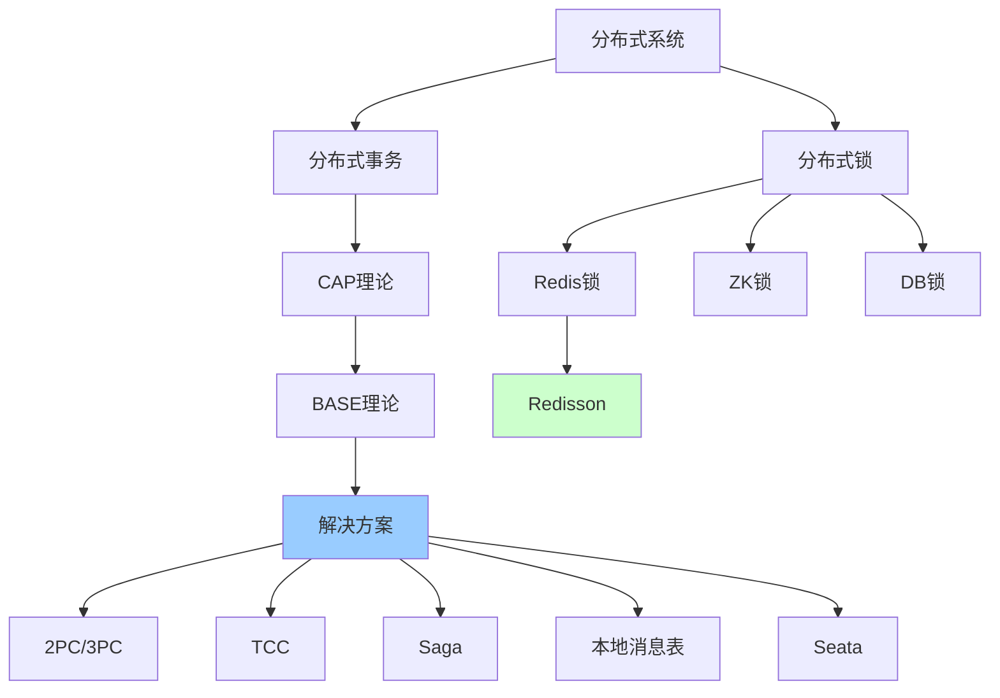

# 分布式系统详解

> 深入理解分布式事务、分布式锁、CAP理论

---

## 📋 文档列表

### 1. 分布式事务详解 ⭐⭐⭐ 核心
📄 [分布式事务详解.md](./分布式事务详解.md)

**核心内容**：
- ✅ **分布式事务基础**：ACID vs BASE、典型场景
- ✅ **CAP与BASE理论**：一致性、可用性、分区容错性
- ✅ **解决方案**：2PC、3PC、TCC、Saga、本地消息表
- ✅ **Seata框架**：AT模式、架构、工作流程
- ✅ **本地消息表**：实现方案、幂等性处理
- ✅ **最佳实践**：方案选型、注意事项

### 2. 分布式锁详解 ⭐⭐⭐ 核心
📄 [分布式锁详解.md](./分布式锁详解.md)

**核心内容**：
- ✅ **分布式锁基础**：为什么需要、核心要求
- ✅ **Redis分布式锁**：SETNX、Lua脚本、自动续期
- ✅ **Redisson框架**：可重入锁、公平锁、读写锁、红锁
- ✅ **Zookeeper分布式锁**：原理、Curator实现
- ✅ **数据库分布式锁**：表设计、实现方案
- ✅ **最佳实践**：方案选型、性能优化

---

## 🎯 学习路径



**推荐顺序**：
1. 理解CAP和BASE理论
2. 学习分布式事务解决方案
3. 掌握Seata框架
4. 理解分布式锁原理
5. 掌握Redisson框架
6. 实战项目应用

---

## 💡 核心知识点速查

### 分布式事务

**Q1: CAP理论是什么？**
```
CAP：分布式系统只能满足其中两个

C - Consistency（一致性）
A - Availability（可用性）
P - Partition tolerance（分区容错性）

选择：
- CP：Zookeeper、etcd
- AP：Eureka、Cassandra
- CA：单机系统（不存在于分布式）
```
- 详见：[分布式事务详解.md](./分布式事务详解.md#21-cap理论)

**Q2: BASE理论是什么？**
```
BASE：CAP的折中方案

BA - Basically Available（基本可用）
S - Soft state（软状态）
E - Eventually consistent（最终一致性）

对比ACID：强一致性 → 最终一致性
```

**Q3: 分布式事务有哪些解决方案？**
```
1. 2PC/3PC：强一致性，性能差
2. TCC：高性能，侵入性强
3. Saga：长事务，需补偿逻辑
4. 本地消息表：最终一致性，简单
5. Seata：综合方案，推荐
```
- 详见：[分布式事务详解.md](./分布式事务详解.md#3-分布式事务解决方案)

**Q4: Seata AT模式是如何工作的？**
```
一阶段：
1. 解析SQL
2. 查询前镜像（before image）
3. 执行业务SQL
4. 查询后镜像（after image）
5. 插入undo_log
6. 提交本地事务

二阶段：
- 提交：删除undo_log
- 回滚：根据undo_log生成反向SQL回滚
```
- 详见：[分布式事务详解.md](./分布式事务详解.md#44-seata-undo-log)

### 分布式锁

**Q5: 分布式锁有哪些实现方案？**
```
1. Redis：
   - 性能好
   - AP模型
   - 推荐：Redisson

2. Zookeeper：
   - 强一致性
   - CP模型
   - 推荐：Curator

3. 数据库：
   - 实现简单
   - 性能较差
```
- 详见：[分布式锁详解.md](./分布式锁详解.md#61-方案选型)

**Q6: Redis分布式锁如何避免误删除？**
```
问题：
线程A加锁 → 超时释放 → 线程B加锁
→ 线程A finally解锁 → 误删B的锁

解决：
使用Lua脚本，解锁时验证是否是自己的锁

if redis.call('get', KEYS[1]) == ARGV[1] then
    return redis.call('del', KEYS[1])
else
    return 0
end
```
- 详见：[分布式锁详解.md](./分布式锁详解.md#22-改进版本lua脚本)

**Q7: Redisson的Watch Dog机制是什么？**
```
Watch Dog（看门狗）：

1. 默认锁过期时间：30秒
2. 自动续期：每10秒检查，如果持有锁，续期30秒
3. 避免死锁：客户端崩溃，看门狗停止，锁自动过期

优点：
✅ 无需担心业务超时
✅ 自动续期
✅ 避免死锁
```
- 详见：[分布式锁详解.md](./分布式锁详解.md#36-redisson看门狗)

---

## 🛠️ 快速开始

### 分布式事务（Seata）

**1. 引入依赖**：
```xml
<dependency>
    <groupId>com.alibaba.cloud</groupId>
    <artifactId>spring-cloud-starter-alibaba-seata</artifactId>
</dependency>
```

**2. 配置**：
```yaml
seata:
  application-id: order-service
  tx-service-group: my_tx_group
```

**3. 使用**：
```java
@GlobalTransactional
public void createOrder(OrderDTO order) {
    // 创建订单
    orderMapper.insert(order);
    
    // 扣减库存（远程调用）
    inventoryClient.deduct(order);
    
    // 扣减余额（远程调用）
    accountClient.deduct(order);
}
```

### 分布式锁（Redisson）

**1. 引入依赖**：
```xml
<dependency>
    <groupId>org.redisson</groupId>
    <artifactId>redisson-spring-boot-starter</artifactId>
    <version>3.23.5</version>
</dependency>
```

**2. 使用**：
```java
RLock lock = redissonClient.getLock("myLock");

try {
    if (lock.tryLock(10, 30, TimeUnit.SECONDS)) {
        // 业务逻辑
        processOrder();
    }
} finally {
    if (lock.isHeldByCurrentThread()) {
        lock.unlock();
    }
}
```

---

## 📊 方案对比

### 分布式事务方案对比

| 方案 | 一致性 | 性能 | 复杂度 | 适用场景 |
|------|--------|------|--------|----------|
| 2PC | 强一致 | 低 | 低 | 强一致性要求 |
| TCC | 最终一致 | 高 | 高 | 高性能要求 |
| Saga | 最终一致 | 中 | 中 | 长事务 |
| 本地消息表 | 最终一致 | 高 | 低 | 异步场景 |
| Seata AT | 强一致 | 中 | 低 | 推荐 |

### 分布式锁方案对比

| 方案 | 性能 | 一致性 | 可用性 | 实现难度 |
|------|------|--------|--------|----------|
| Redis | 高 | 弱 | 高（AP） | 低 |
| Zookeeper | 中 | 强 | 中（CP） | 中 |
| 数据库 | 低 | 强 | 低 | 低 |

---

## 🚨 常见问题

### 分布式事务

**1️⃣ Seata性能问题**

**问题**：全局事务性能差

**解决**：
- 减少全局事务范围
- 异步化非核心操作
- 使用本地消息表替代部分场景

**2️⃣ 分支事务超时**

**问题**：分支事务执行超时

**解决**：
```java
@GlobalTransactional(
    timeoutMills = 60000,  // 增加超时时间
    rollbackFor = Exception.class
)
```

### 分布式锁

**3️⃣ 锁续期失败**

**问题**：Watch Dog续期失败，锁提前释放

**解决**：
- 检查网络连接
- 增加锁过期时间
- 优化业务逻辑，减少持锁时间

**4️⃣ 死锁**

**问题**：客户端崩溃，锁未释放

**解决**：
- 设置合理的过期时间
- 使用Redisson的Watch Dog
- 定时清理过期锁

**5️⃣ 锁竞争激烈**

**问题**：大量请求竞争同一把锁

**解决**：
- 使用分段锁
- 优化业务逻辑
- 使用队列削峰

---

## 📈 最佳实践

### 分布式事务

**1. 方案选型**：
```
✅ 推荐Seata AT模式（大部分场景）
✅ 高性能场景使用TCC
✅ 异步场景使用本地消息表
❌ 避免使用2PC（性能差）
```

**2. 注意事项**：
```java
// ✅ 缩小全局事务范围
@GlobalTransactional
public void createOrder(OrderDTO order) {
    // 核心操作
    orderService.create(order);
    inventoryService.deduct(order);
    
    // 非核心操作异步化（不在全局事务中）
    CompletableFuture.runAsync(() -> {
        notificationService.send(order);
    });
}

// ✅ 幂等性设计
@Transactional
public void deduct(OrderDTO order) {
    // 检查是否已处理
    if (isProcessed(order.getId())) {
        return;
    }
    
    // 处理业务
    doDeduct(order);
    
    // 标记已处理
    markProcessed(order.getId());
}
```

### 分布式锁

**1. 合理设置超时**：
```java
// 等待时间 < 锁过期时间
lock.tryLock(10, 30, TimeUnit.SECONDS);
```

**2. 始终释放锁**：
```java
try {
    lock.lock();
    // 业务
} finally {
    if (lock.isHeldByCurrentThread()) {
        lock.unlock();
    }
}
```

**3. 避免长时间持锁**：
```java
// ❌ 不好
lock.lock();
Thread.sleep(60000);  // 长时间阻塞
processOrder();
lock.unlock();

// ✅ 好
lock.lock();
processQuickly();  // 快速处理
lock.unlock();
```

---

## 🔗 相关资源

- 🔗 [Seata官方文档](https://seata.io/zh-cn/)
- 🔗 [Redisson官方文档](https://github.com/redisson/redisson)
- 🔗 [Curator官方文档](https://curator.apache.org/)
- 📖 《分布式事务：原理与实践》
- 📖 《微服务架构设计模式》

---

*最后更新：2025-10-27*

