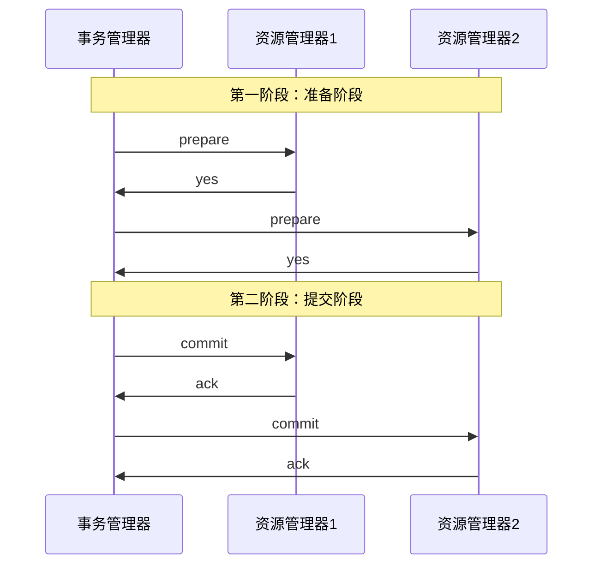
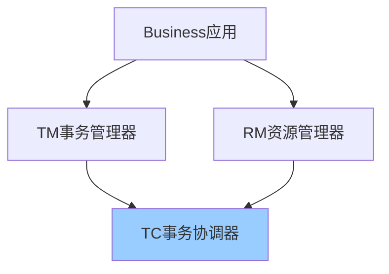
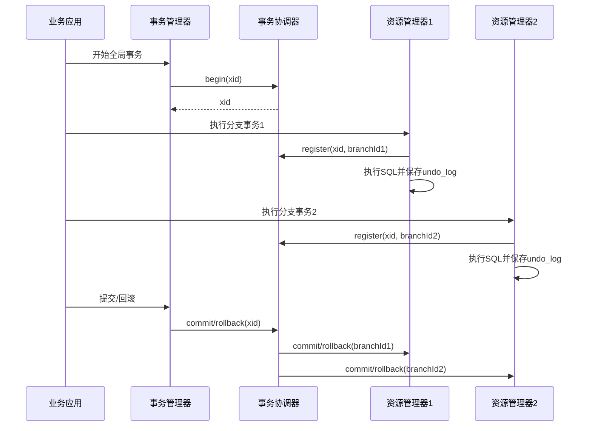

# 分布式事务详解

> 深入理解分布式事务原理、解决方案、Seata框架

---

## 📋 目录

1. [分布式事务基础](#1-分布式事务基础)
2. [CAP与BASE理论](#2-cap与base理论)
3. [分布式事务解决方案](#3-分布式事务解决方案)
4. [Seata框架](#4-seata框架)
5. [本地消息表](#5-本地消息表)
6. [最佳实践](#6-最佳实践)

---

## 1. 分布式事务基础

### 1.1 什么是分布式事务

```
单体应用事务：
┌──────────────────┐
│   Application    │
│  ┌────────────┐  │
│  │  Service   │  │
│  └──────┬─────┘  │
│  ┌──────┴─────┐  │
│  │  Database  │  │
│  └────────────┘  │
└──────────────────┘
事务在单个数据库中完成，ACID由数据库保证

分布式事务：
┌──────────────┐    ┌──────────────┐    ┌──────────────┐
│  Service A   │    │  Service B   │    │  Service C   │
│ ┌──────────┐ │    │ ┌──────────┐ │    │ ┌──────────┐ │
│ │   DB A   │ │    │ │   DB B   │ │    │ │   DB C   │ │
│ └──────────┘ │    │ └──────────┘ │    │ └──────────┘ │
└──────────────┘    └──────────────┘    └──────────────┘
       │                   │                   │
       └───────────────────┴───────────────────┘
              需要保证整体事务一致性
```

**典型场景**：
```
电商下单：
1. 订单服务：创建订单
2. 库存服务：扣减库存
3. 支付服务：扣减余额
4. 积分服务：增加积分

要求：要么全部成功，要么全部失败
```

### 1.2 分布式事务的挑战

```
1. 网络不可靠：
   - 网络延迟
   - 网络分区
   - 消息丢失

2. 性能问题：
   - 两阶段提交阻塞
   - 锁等待时间长
   - 吞吐量下降

3. 复杂性：
   - 异常处理
   - 补偿逻辑
   - 幂等性

4. 一致性与可用性矛盾：
   - CAP理论限制
   - 强一致性 vs 高可用
```

---

## 2. CAP与BASE理论

### 2.1 CAP理论

```
CAP定理：分布式系统只能满足其中两个

C - Consistency（一致性）：
    所有节点同时看到相同的数据

A - Availability（可用性）：
    系统持续可用，请求总能得到响应

P - Partition tolerance（分区容错性）：
    网络分区时系统继续运行

┌─────────────────────────────────┐
│          CAP三角形              │
│                                 │
│            C                    │
│           /  \                  │
│          /    \                 │
│         /  CP  \                │
│        /        \               │
│       /   CAP    \              │
│      /            \             │
│     /   CA    AP   \            │
│    /________________\           │
│   A                  P          │
└─────────────────────────────────┘

选择：
- CP：牺牲可用性，保证一致性（如：Zookeeper）
- AP：牺牲一致性，保证可用性（如：Eureka）
- CA：单机系统（分布式系统必须容忍分区）
```

### 2.2 BASE理论

```
BASE：CAP的折中方案

BA - Basically Available（基本可用）：
     系统大部分时间可用，允许偶尔故障

S - Soft state（软状态）：
    允许中间状态，不要求实时一致

E - Eventually consistent（最终一致性）：
    不要求实时一致，但最终达到一致

对比：
ACID（强一致性）：
- 原子性（Atomicity）
- 一致性（Consistency）
- 隔离性（Isolation）
- 持久性（Durability）

BASE（最终一致性）：
- 基本可用
- 软状态
- 最终一致
```

---

## 3. 分布式事务解决方案

### 3.1 两阶段提交（2PC）



**优点**：
- 强一致性
- 实现简单

**缺点**：
```
1. 同步阻塞：
   - 第一阶段锁定资源
   - 其他事务需要等待

2. 单点故障：
   - 协调者故障导致阻塞

3. 数据不一致：
   - 第二阶段网络分区
   - 部分节点收到commit，部分未收到

4. 性能问题：
   - 多次网络往返
   - 锁定时间长
```

### 3.2 三阶段提交（3PC）

```
3PC改进：
1. CanCommit阶段
2. PreCommit阶段
3. DoCommit阶段

优点：
- 减少阻塞
- 引入超时机制

缺点：
- 仍可能数据不一致
- 实现复杂
```

### 3.3 TCC（Try-Confirm-Cancel）

```java
/**
 * TCC模式
 */
public interface OrderTccService {
    
    /**
     * Try阶段：尝试执行，预留资源
     */
    @TwoPhaseBusinessAction(
        name = "orderTcc",
        commitMethod = "confirm",
        rollbackMethod = "cancel"
    )
    boolean try(@BusinessActionContextParameter(paramName = "orderId") Long orderId);
    
    /**
     * Confirm阶段：确认提交
     */
    boolean confirm(BusinessActionContext context);
    
    /**
     * Cancel阶段：取消回滚
     */
    boolean cancel(BusinessActionContext context);
}

@Service
public class OrderTccServiceImpl implements OrderTccService {
    
    @Override
    public boolean try(Long orderId) {
        // 1. 校验业务
        if (!validateOrder(orderId)) {
            return false;
        }
        
        // 2. 预留资源（冻结库存）
        inventoryService.freeze(orderId);
        
        // 3. 记录事务日志
        tccLogService.saveTryLog(orderId);
        
        return true;
    }
    
    @Override
    public boolean confirm(BusinessActionContext context) {
        Long orderId = context.getActionContext("orderId", Long.class);
        
        // 1. 确认扣减库存
        inventoryService.deduct(orderId);
        
        // 2. 删除冻结记录
        inventoryService.deleteFrozen(orderId);
        
        // 3. 记录日志
        tccLogService.saveConfirmLog(orderId);
        
        return true;
    }
    
    @Override
    public boolean cancel(BusinessActionContext context) {
        Long orderId = context.getActionContext("orderId", Long.class);
        
        // 1. 释放冻结库存
        inventoryService.unfreeze(orderId);
        
        // 2. 记录日志
        tccLogService.saveCancelLog(orderId);
        
        return true;
    }
}
```

**TCC优缺点**：
```
优点：
✅ 性能较好（不锁全局资源）
✅ 灵活性高
✅ 可用性高

缺点：
❌ 侵入性强（需要实现try、confirm、cancel）
❌ 开发成本高
❌ 需要考虑幂等性
```

### 3.4 Saga模式

```java
/**
 * Saga编排模式
 */
@Service
public class OrderSagaService {
    
    public void createOrder(OrderDTO order) {
        Saga saga = sagaFactory.create("order-saga")
            // 步骤1：创建订单
            .addStep(
                () -> orderService.create(order),
                () -> orderService.delete(order.getId())
            )
            // 步骤2：扣减库存
            .addStep(
                () -> inventoryService.deduct(order),
                () -> inventoryService.add(order)
            )
            // 步骤3：扣减余额
            .addStep(
                () -> accountService.deduct(order),
                () -> accountService.add(order)
            )
            // 步骤4：增加积分
            .addStep(
                () -> pointService.add(order),
                () -> pointService.deduct(order)
            );
        
        // 执行Saga
        saga.execute();
    }
}
```

**Saga优缺点**：
```
优点：
✅ 长事务支持
✅ 不需要锁资源
✅ 适合复杂业务流程

缺点：
❌ 难以理解和调试
❌ 需要实现补偿逻辑
❌ 可能存在脏读（补偿前的中间状态）
```

### 3.5 本地消息表

```java
/**
 * 本地消息表模式
 */
@Service
public class OrderWithMessageService {
    
    @Autowired
    private OrderMapper orderMapper;
    
    @Autowired
    private MessageLogMapper messageLogMapper;
    
    @Autowired
    private RocketMQTemplate rocketMQTemplate;
    
    /**
     * 创建订单（本地事务）
     */
    @Transactional
    public void createOrder(OrderDTO orderDTO) {
        // 1. 创建订单
        Order order = new Order();
        BeanUtils.copyProperties(orderDTO, order);
        orderMapper.insert(order);
        
        // 2. 保存消息日志（同一个本地事务）
        MessageLog messageLog = new MessageLog();
        messageLog.setContent(JSON.toJSONString(orderDTO));
        messageLog.setStatus(MessageStatus.PENDING);
        messageLog.setBizType("ORDER_CREATED");
        messageLogMapper.insert(messageLog);
    }
    
    /**
     * 定时发送未发送的消息
     */
    @Scheduled(fixedDelay = 5000)
    public void sendPendingMessages() {
        List<MessageLog> pendingMessages = messageLogMapper.selectPending();
        
        for (MessageLog message : pendingMessages) {
            try {
                // 发送MQ消息
                rocketMQTemplate.syncSend("order-topic", message.getContent());
                
                // 更新消息状态
                message.setStatus(MessageStatus.SENT);
                messageLogMapper.updateById(message);
            } catch (Exception e) {
                log.error("发送消息失败", e);
            }
        }
    }
}

/**
 * 库存服务消费消息
 */
@Service
@RocketMQMessageListener(topic = "order-topic", consumerGroup = "inventory-group")
public class InventoryMessageListener implements RocketMQListener<String> {
    
    @Override
    public void onMessage(String message) {
        OrderDTO order = JSON.parseObject(message, OrderDTO.class);
        
        // 幂等性处理
        if (inventoryService.isProcessed(order.getId())) {
            return;
        }
        
        // 扣减库存
        inventoryService.deduct(order);
        
        // 记录已处理
        inventoryService.markProcessed(order.getId());
    }
}
```

---

## 4. Seata框架

### 4.1 Seata架构



**核心组件**：
```
TC (Transaction Coordinator)：
- 事务协调器
- 维护全局和分支事务的状态
- 驱动全局事务提交或回滚

TM (Transaction Manager)：
- 事务管理器
- 定义全局事务的范围
- 开始、提交或回滚全局事务

RM (Resource Manager)：
- 资源管理器
- 管理分支事务
- 与TC交互注册分支事务和报告分支事务状态
```

### 4.2 Seata AT模式

**Maven依赖**：
```xml
<dependencies>
    <dependency>
        <groupId>com.alibaba.cloud</groupId>
        <artifactId>spring-cloud-starter-alibaba-seata</artifactId>
    </dependency>
    
    <dependency>
        <groupId>io.seata</groupId>
        <artifactId>seata-spring-boot-starter</artifactId>
        <version>1.7.0</version>
    </dependency>
</dependencies>
```

**配置**：
```yaml
seata:
  enabled: true
  application-id: order-service
  tx-service-group: my_tx_group
  service:
    vgroup-mapping:
      my_tx_group: default
  registry:
    type: nacos
    nacos:
      server-addr: localhost:8848
      namespace: public
      group: SEATA_GROUP
```

**使用示例**：
```java
/**
 * 订单服务（TM）
 */
@Service
public class OrderService {
    
    @Autowired
    private OrderMapper orderMapper;
    
    @Autowired
    private InventoryFeignClient inventoryClient;
    
    @Autowired
    private AccountFeignClient accountClient;
    
    /**
     * 创建订单（全局事务）
     */
    @GlobalTransactional(name = "create-order", rollbackFor = Exception.class)
    public void createOrder(OrderDTO orderDTO) {
        // 1. 创建订单
        Order order = new Order();
        BeanUtils.copyProperties(orderDTO, order);
        orderMapper.insert(order);
        
        // 2. 扣减库存（远程调用）
        inventoryClient.deduct(orderDTO.getProductId(), orderDTO.getCount());
        
        // 3. 扣减余额（远程调用）
        accountClient.deduct(orderDTO.getUserId(), orderDTO.getMoney());
        
        // 任何一步失败，全局事务自动回滚
    }
}

/**
 * 库存服务（RM）
 */
@Service
public class InventoryService {
    
    @Autowired
    private InventoryMapper inventoryMapper;
    
    /**
     * 扣减库存（分支事务）
     */
    @Transactional
    public void deduct(Long productId, Integer count) {
        Inventory inventory = inventoryMapper.selectById(productId);
        
        if (inventory.getStock() < count) {
            throw new BusinessException("库存不足");
        }
        
        inventory.setStock(inventory.getStock() - count);
        inventoryMapper.updateById(inventory);
    }
}
```

### 4.3 Seata工作流程



### 4.4 Seata Undo Log

```sql
-- undo_log表结构
CREATE TABLE `undo_log` (
  `id` bigint(20) NOT NULL AUTO_INCREMENT,
  `branch_id` bigint(20) NOT NULL,
  `xid` varchar(100) NOT NULL,
  `context` varchar(128) NOT NULL,
  `rollback_info` longblob NOT NULL,
  `log_status` int(11) NOT NULL,
  `log_created` datetime NOT NULL,
  `log_modified` datetime NOT NULL,
  PRIMARY KEY (`id`),
  UNIQUE KEY `ux_undo_log` (`xid`,`branch_id`)
) ENGINE=InnoDB DEFAULT CHARSET=utf8;
```

**AT模式原理**：
```
1. 一阶段：
   - 解析SQL
   - 查询前镜像（before image）
   - 执行业务SQL
   - 查询后镜像（after image）
   - 插入undo_log
   - 提交本地事务

2. 二阶段提交：
   - 删除undo_log
   - 释放锁

3. 二阶段回滚：
   - 校验脏写
   - 生成反向SQL（根据undo_log）
   - 执行反向SQL
   - 删除undo_log
```

---

## 5. 本地消息表

### 5.1 实现方案

```sql
-- 消息日志表
CREATE TABLE `message_log` (
  `id` bigint(20) NOT NULL AUTO_INCREMENT,
  `content` text NOT NULL COMMENT '消息内容',
  `status` tinyint(4) NOT NULL COMMENT '状态：0-待发送，1-已发送，2-失败',
  `biz_type` varchar(50) NOT NULL COMMENT '业务类型',
  `retry_count` int(11) DEFAULT '0' COMMENT '重试次数',
  `create_time` datetime NOT NULL,
  `update_time` datetime NOT NULL,
  PRIMARY KEY (`id`),
  KEY `idx_status` (`status`),
  KEY `idx_create_time` (`create_time`)
) ENGINE=InnoDB DEFAULT CHARSET=utf8mb4;

-- 消息处理记录表（幂等性）
CREATE TABLE `message_process_log` (
  `id` bigint(20) NOT NULL AUTO_INCREMENT,
  `message_id` varchar(100) NOT NULL COMMENT '消息ID',
  `consumer_group` varchar(100) NOT NULL COMMENT '消费者组',
  `process_time` datetime NOT NULL COMMENT '处理时间',
  PRIMARY KEY (`id`),
  UNIQUE KEY `uk_message_consumer` (`message_id`, `consumer_group`)
) ENGINE=InnoDB DEFAULT CHARSET=utf8mb4;
```

### 5.2 完整实现

```java
/**
 * 消息服务
 */
@Service
public class MessageService {
    
    @Autowired
    private MessageLogMapper messageLogMapper;
    
    @Autowired
    private RocketMQTemplate rocketMQTemplate;
    
    /**
     * 保存并发送消息
     */
    @Transactional
    public void saveAndSend(String content, String bizType) {
        // 1. 保存消息日志
        MessageLog messageLog = new MessageLog();
        messageLog.setContent(content);
        messageLog.setStatus(MessageStatus.PENDING);
        messageLog.setBizType(bizType);
        messageLog.setRetryCount(0);
        messageLogMapper.insert(messageLog);
        
        // 2. 异步发送（防止阻塞）
        CompletableFuture.runAsync(() -> sendMessage(messageLog.getId()));
    }
    
    /**
     * 发送消息
     */
    private void sendMessage(Long messageId) {
        MessageLog messageLog = messageLogMapper.selectById(messageId);
        
        try {
            SendResult result = rocketMQTemplate.syncSend(
                "order-topic",
                messageLog.getContent()
            );
            
            if (result.getSendStatus() == SendStatus.SEND_OK) {
                // 更新状态为已发送
                messageLog.setStatus(MessageStatus.SENT);
                messageLogMapper.updateById(messageLog);
            }
        } catch (Exception e) {
            log.error("发送消息失败，messageId={}", messageId, e);
            // 更新重试次数
            messageLog.setRetryCount(messageLog.getRetryCount() + 1);
            messageLogMapper.updateById(messageLog);
        }
    }
    
    /**
     * 定时重试失败消息
     */
    @Scheduled(cron = "0 */1 * * * ?")  // 每分钟执行一次
    public void retryFailedMessages() {
        // 查询待发送的消息（重试次数<5）
        List<MessageLog> pendingMessages = messageLogMapper.selectList(
            new LambdaQueryWrapper<MessageLog>()
                .eq(MessageLog::getStatus, MessageStatus.PENDING)
                .lt(MessageLog::getRetryCount, 5)
                .lt(MessageLog::getCreateTime, 
                    LocalDateTime.now().minusMinutes(1))  // 1分钟前的消息
        );
        
        for (MessageLog message : pendingMessages) {
            sendMessage(message.getId());
        }
    }
}

/**
 * 消息消费者（幂等性处理）
 */
@Service
@RocketMQMessageListener(topic = "order-topic", consumerGroup = "inventory-group")
public class IdempotentMessageListener implements RocketMQListener<String> {
    
    @Autowired
    private MessageProcessLogMapper processLogMapper;
    
    @Autowired
    private InventoryService inventoryService;
    
    @Override
    @Transactional
    public void onMessage(String message) {
        OrderDTO order = JSON.parseObject(message, OrderDTO.class);
        String messageId = order.getId().toString();
        String consumerGroup = "inventory-group";
        
        // 1. 幂等性检查
        MessageProcessLog existLog = processLogMapper.selectOne(
            new LambdaQueryWrapper<MessageProcessLog>()
                .eq(MessageProcessLog::getMessageId, messageId)
                .eq(MessageProcessLog::getConsumerGroup, consumerGroup)
        );
        
        if (existLog != null) {
            log.info("消息已处理，跳过。messageId={}", messageId);
            return;
        }
        
        try {
            // 2. 处理业务
            inventoryService.deduct(order.getProductId(), order.getCount());
            
            // 3. 记录处理日志
            MessageProcessLog processLog = new MessageProcessLog();
            processLog.setMessageId(messageId);
            processLog.setConsumerGroup(consumerGroup);
            processLog.setProcessTime(LocalDateTime.now());
            processLogMapper.insert(processLog);
            
        } catch (DuplicateKeyException e) {
            // 并发情况下可能插入重复，忽略
            log.warn("消息处理记录已存在（并发）", e);
        }
    }
}
```

---

## 6. 最佳实践

### 6.1 方案选型

```
场景1：强一致性要求
方案：Seata AT模式
示例：金融转账、订单支付

场景2：性能要求高
方案：TCC模式
示例：秒杀、抢购

场景3：长事务、复杂流程
方案：Saga模式
示例：旅游预订（机票+酒店+门票）

场景4：最终一致性即可
方案：本地消息表 + MQ
示例：订单创建后发送短信、积分增加
```

### 6.2 注意事项

```java
// 1. 幂等性设计
@Service
public class IdempotentService {
    
    @Autowired
    private RedisTemplate<String, String> redisTemplate;
    
    public boolean processWithIdempotent(String orderId) {
        String key = "order:processed:" + orderId;
        
        // 使用Redis的SETNX实现幂等
        Boolean success = redisTemplate.opsForValue()
            .setIfAbsent(key, "1", 24, TimeUnit.HOURS);
        
        if (Boolean.FALSE.equals(success)) {
            log.info("订单已处理，orderId={}", orderId);
            return false;
        }
        
        // 处理业务...
        return true;
    }
}

// 2. 超时处理
@GlobalTransactional(
    timeoutMills = 30000,  // 超时时间30秒
    rollbackFor = Exception.class
)
public void createOrder(OrderDTO order) {
    // 业务逻辑...
}

// 3. 异常处理
@GlobalTransactional(rollbackFor = Exception.class)
public void createOrder(OrderDTO order) {
    try {
        // 业务逻辑...
    } catch (BusinessException e) {
        // 业务异常，回滚
        throw e;
    } catch (Exception e) {
        // 系统异常，回滚
        log.error("创建订单失败", e);
        throw new SystemException("系统异常");
    }
}
```

---

## 📚 参考资料

- 🔗 [Seata官方文档](https://seata.io/zh-cn/)
- 📖 《分布式事务：原理与实践》
- 📖 《微服务架构设计模式》

---

*最后更新：2025-10-27*
