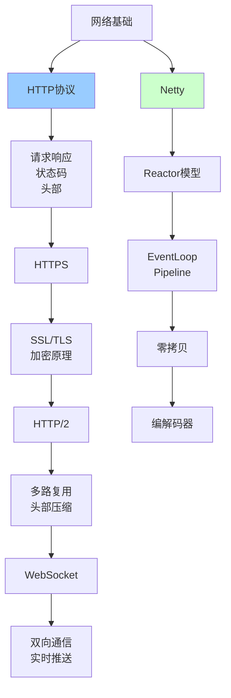

# 网络通信详解

> 深入理解Netty、HTTP、WebSocket等网络通信技术

---

## 📋 文档列表

### 1. Netty核心原理详解 ⭐ 推荐
📄 [Netty核心原理详解.md](./Netty核心原理详解.md)

**核心内容**：
- ✅ **Netty架构设计**：核心组件、整体架构
- ✅ **Reactor线程模型**：单/多线程模型、主从Reactor
- ✅ **核心组件详解**：Channel、Pipeline、Handler、ByteBuf
- ✅ **零拷贝机制**：FileRegion、CompositeByteBuf、DirectByteBuf
- ✅ **编解码器**：自定义协议、粘包拆包、内置编解码器
- ✅ **常见问题解决**：内存泄漏、性能优化、连接管理

**适合场景**：
- 高性能网络编程
- RPC框架开发
- IM系统开发
- 游戏服务器

---

### 2. HTTP协议与网络编程 ⭐ 推荐
📄 [HTTP协议与网络编程.md](./HTTP协议与网络编程.md)

**核心内容**：
- ✅ **HTTP协议基础**：请求响应格式、状态码、HTTP方法
- ✅ **HTTPS加密原理**：对称/非对称加密、SSL/TLS握手、证书验证
- ✅ **HTTP/2新特性**：二进制分帧、多路复用、头部压缩、服务器推送
- ✅ **WebSocket协议**：双向通信、握手流程、帧格式
- ✅ **网络编程最佳实践**：连接池、超时、重试、缓存
- ✅ **常见问题解决**：CORS跨域、限流、长连接、大文件传输

**适合场景**：
- Web开发
- API设计
- 实时通信
- 性能优化

---

## 🎯 学习路径



**推荐顺序**：
1. 先学习《HTTP协议与网络编程》，理解网络通信基础
2. 再学习《Netty核心原理详解》，掌握高性能网络编程
3. 结合实际项目应用

---

## 💡 核心知识点速查

### HTTP相关

**Q1: HTTP请求由哪些部分组成？**
```
1. 请求行：方法 + URL + 协议版本
2. 请求头：Host、User-Agent、Accept等
3. 空行
4. 请求体：POST/PUT的数据
```

**Q2: 常用HTTP状态码有哪些？**
- 2xx成功：200 OK、201 Created、204 No Content
- 3xx重定向：301永久、302临时、304未修改
- 4xx客户端错误：400错误请求、401未授权、404不存在、429限流
- 5xx服务器错误：500内部错误、502网关错误、503不可用
- 详见：[HTTP协议与网络编程.md](./HTTP协议与网络编程.md#13-http状态码)

**Q3: HTTPS握手流程是怎样的？**
```
1. Client Hello（支持的加密算法）
2. Server Hello（选择的加密算法）
3. Certificate（服务器证书）
4. Client Key Exchange（预主密钥）
5. 计算会话密钥
6. Change Cipher Spec
7. Finished
8. 开始加密通信
```
- 详见：[HTTP协议与网络编程.md](./HTTP协议与网络编程.md#22-https握手流程)

**Q4: HTTP/2相比HTTP/1.1有哪些优势？**
- ✅ 二进制分帧
- ✅ 多路复用（单连接）
- ✅ 头部压缩（HPACK）
- ✅ 服务器推送
- ✅ 优先级控制
- 详见：[HTTP协议与网络编程.md](./HTTP协议与网络编程.md#31-http11-vs-http2)

**Q5: WebSocket与HTTP有什么区别？**
```
HTTP：
- 单向通信
- 请求-响应模型
- 无状态

WebSocket：
- 双向通信（全双工）
- 长连接
- 有状态
- 适合实时通信
```
- 详见：[HTTP协议与网络编程.md](./HTTP协议与网络编程.md#41-websocket-vs-http)

### Netty相关

**Q6: Netty的Reactor模型有哪几种？**
```
1. 单Reactor单线程：所有I/O在一个线程
2. 单Reactor多线程：Reactor负责I/O，工作线程处理业务
3. 主从Reactor多线程（Netty）：
   - MainReactor：接收连接
   - SubReactor：处理I/O
   - Worker：处理业务
```
- 详见：[Netty核心原理详解.md](./Netty核心原理详解.md#21-三种reactor模型)

**Q7: Netty的核心组件有哪些？**
- Channel：网络通道
- EventLoop：事件循环
- Pipeline：处理器链
- Handler：处理器
- ByteBuf：字节缓冲区
- 详见：[Netty核心原理详解.md](./Netty核心原理详解.md#3-核心组件详解)

**Q8: Netty的零拷贝是什么？**
```
OS级别：
- FileRegion：sendfile()系统调用
- DirectByteBuf：堆外内存

Netty级别：
- CompositeByteBuf：组合ByteBuf
- slice()：切片共享内存
- duplicate()：复制共享内存
```
- 详见：[Netty核心原理详解.md](./Netty核心原理详解.md#4-零拷贝机制)

**Q9: 如何解决粘包拆包问题？**
```
方案1：固定长度
方案2：分隔符
方案3：长度字段（推荐）
方案4：自定义协议
```
- 详见：[Netty核心原理详解.md](./Netty核心原理详解.md#54-粘包拆包问题)

**Q10: 如何避免Netty内存泄漏？**
```
1. 使用SimpleChannelInboundHandler（自动释放）
2. 手动release()
3. 传递给下一个Handler
4. 开启泄漏检测
```
- 详见：[Netty核心原理详解.md](./Netty核心原理详解.md#61-内存泄漏问题)

---

## 🛠️ 实战工具箱

### HTTP客户端

**OkHttp**：
```java
OkHttpClient client = new OkHttpClient.Builder()
    .connectTimeout(5, TimeUnit.SECONDS)
    .readTimeout(30, TimeUnit.SECONDS)
    .connectionPool(new ConnectionPool(10, 5, TimeUnit.MINUTES))
    .build();

Request request = new Request.Builder()
    .url("https://api.example.com/users")
    .get()
    .build();

Response response = client.newCall(request).execute();
```

**RestTemplate**：
```java
RestTemplate restTemplate = new RestTemplate();
String result = restTemplate.getForObject("https://api.example.com/users", String.class);
```

**WebClient（推荐）**：
```java
WebClient client = WebClient.create("https://api.example.com");
Mono<User> user = client.get()
    .uri("/users/{id}", 1)
    .retrieve()
    .bodyToMono(User.class);
```

### Netty服务端模板

```java
EventLoopGroup bossGroup = new NioEventLoopGroup(1);
EventLoopGroup workerGroup = new NioEventLoopGroup();

try {
    ServerBootstrap b = new ServerBootstrap();
    b.group(bossGroup, workerGroup)
        .channel(NioServerSocketChannel.class)
        .option(ChannelOption.SO_BACKLOG, 1024)
        .childOption(ChannelOption.SO_KEEPALIVE, true)
        .childHandler(new ChannelInitializer<SocketChannel>() {
            @Override
            protected void initChannel(SocketChannel ch) {
                ch.pipeline()
                    .addLast(new LengthFieldBasedFrameDecoder(1024, 0, 4, 0, 4))
                    .addLast(new StringDecoder())
                    .addLast(new StringEncoder())
                    .addLast(new ServerHandler());
            }
        });
    
    ChannelFuture f = b.bind(port).sync();
    f.channel().closeFuture().sync();
} finally {
    bossGroup.shutdownGracefully();
    workerGroup.shutdownGracefully();
}
```

---

## 📊 性能优化

### HTTP优化

**1. 使用HTTP/2**
```nginx
server {
    listen 443 ssl http2;
    ssl_certificate cert.pem;
    ssl_certificate_key key.pem;
}
```

**2. 启用压缩**
```nginx
gzip on;
gzip_types text/plain application/json application/javascript;
gzip_min_length 1000;
```

**3. 配置缓存**
```nginx
location ~* \.(jpg|jpeg|png|css|js)$ {
    expires 1y;
    add_header Cache-Control "public, immutable";
}
```

**4. 连接池**
```java
PoolingHttpClientConnectionManager cm = new PoolingHttpClientConnectionManager();
cm.setMaxTotal(200);
cm.setDefaultMaxPerRoute(20);
```

### Netty优化

**1. 使用内存池**
```java
bootstrap.childOption(ChannelOption.ALLOCATOR, PooledByteBufAllocator.DEFAULT);
```

**2. 调整线程数**
```java
int workerThreads = Runtime.getRuntime().availableProcessors() * 2;
EventLoopGroup workerGroup = new NioEventLoopGroup(workerThreads);
```

**3. TCP参数优化**
```java
bootstrap
    .option(ChannelOption.SO_BACKLOG, 1024)
    .childOption(ChannelOption.SO_KEEPALIVE, true)
    .childOption(ChannelOption.TCP_NODELAY, true);
```

**4. 零拷贝**
```java
// 使用DirectByteBuf
ByteBuf directBuf = Unpooled.directBuffer(1024);

// 使用FileRegion传输文件
FileRegion region = new DefaultFileRegion(fileChannel, 0, fileChannel.size());
ctx.writeAndFlush(region);
```

---

## 🚨 常见问题

### 1️⃣ CORS跨域

**问题**：浏览器拦截跨域请求

**解决**：
```java
@CrossOrigin(origins = "https://example.com")
@RestController
public class ApiController {
    // ...
}
```

### 2️⃣ 连接超时

**问题**：请求超时

**解决**：
```java
RequestConfig config = RequestConfig.custom()
    .setConnectTimeout(5000)
    .setSocketTimeout(30000)
    .build();
```

### 3️⃣ 内存泄漏

**问题**：ByteBuf未释放

**解决**：
```java
// 使用SimpleChannelInboundHandler
public class MyHandler extends SimpleChannelInboundHandler<ByteBuf> {
    @Override
    protected void channelRead0(ChannelHandlerContext ctx, ByteBuf msg) {
        // 自动释放
    }
}
```

### 4️⃣ 粘包拆包

**问题**：TCP流式协议无消息边界

**解决**：
```java
// 使用长度字段解码器
pipeline.addLast(new LengthFieldBasedFrameDecoder(1024, 0, 4, 0, 4));
```

### 5️⃣ 长连接断开

**问题**：连接假死

**解决**：
```java
// 心跳检测
pipeline.addLast(new IdleStateHandler(60, 30, 0));
pipeline.addLast(new HeartbeatHandler());
```

---

## 🔗 相关资源

- 📖 《Netty实战》- Norman Maurer
- 📖 《HTTP权威指南》
- 📖 《图解HTTP》
- 🔗 [Netty官方文档](https://netty.io/)
- 🔗 [HTTP/2规范](https://http2.github.io/)

---

*最后更新：2025-10-27*

