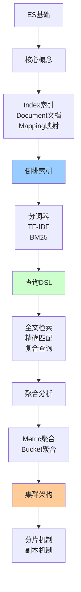

# Elasticsearch搜索引擎详解

> 深入理解Elasticsearch核心原理、倒排索引、查询优化

---

## 📋 文档列表

### 1. Elasticsearch核心原理 ⭐ 推荐
📄 [Elasticsearch核心原理.md](./Elasticsearch核心原理.md)

**核心内容**：
- ✅ **Elasticsearch架构**：核心概念、集群架构、文档CRUD
- ✅ **倒排索引原理**：正排vs倒排、索引结构、分词器、评分算法
- ✅ **查询DSL**：全文检索、精确匹配、复合查询
- ✅ **聚合分析**：指标聚合、桶聚合、管道聚合
- ✅ **集群与分片**：分片机制、文档路由、搜索流程
- ✅ **常见问题解决**：深度分页、脑裂、数据倾斜、性能优化

**适合场景**：
- 全文搜索
- 日志分析
- 数据分析
- 实时监控

---

## 🎯 学习路径



**推荐顺序**：
1. 理解核心概念和架构
2. 掌握倒排索引原理
3. 学习查询DSL和聚合
4. 了解集群和分片机制
5. 实战项目应用

---

## 💡 核心知识点速查

**Q1: ES与MySQL的对应关系？**
```
ES           MySQL
Index     ←→ Database
Type      ←→ Table (7.x已废弃)
Document  ←→ Row
Field     ←→ Column
Mapping   ←→ Schema
```

**Q2: 什么是倒排索引？**
- 正排索引：文档ID → 内容
- 倒排索引：词项 → 文档ID列表
- 优点：快速查找包含特定词的文档
- 详见：[Elasticsearch核心原理.md](./Elasticsearch核心原理.md#21-正排索引-vs-倒排索引)

**Q3: TF-IDF和BM25有什么区别？**
```
TF-IDF：
- TF：词频
- IDF：逆文档频率
- Score = TF × IDF

BM25（ES 5.0+默认）：
- 考虑文档长度
- 词频饱和
- 更符合实际需求
```
- 详见：[Elasticsearch核心原理.md](./Elasticsearch核心原理.md#24-评分算法tf-idfbm25)

**Q4: Query和Filter有什么区别？**
```
Query：
- 计算相关性得分
- 不缓存
- 用于全文检索

Filter：
- 不计算得分
- 可缓存
- 用于精确匹配
```
- 详见：[Elasticsearch核心原理.md](./Elasticsearch核心原理.md#31-查询类型)

**Q5: 如何解决深度分页问题？**
```
方案1：scroll API（不推荐）
方案2：search_after（推荐）
方案3：限制分页深度
```
- 详见：[Elasticsearch核心原理.md](./Elasticsearch核心原理.md#61-深度分页问题)

**Q6: 什么是脑裂？如何避免？**
```
脑裂：网络分区导致多个Master节点

解决：
1. 设置minimum_master_nodes = (节点数/2) + 1
2. 使用专用主节点
3. ES 7.x后自动管理
```
- 详见：[Elasticsearch核心原理.md](./Elasticsearch核心原理.md#62-脑裂问题)

---

## 🛠️ 实战工具箱

### ES客户端

**Java High Level REST Client**：
```java
RestHighLevelClient client = new RestHighLevelClient(
    RestClient.builder(
        new HttpHost("localhost", 9200, "http")
    )
);

// CRUD操作
IndexRequest request = new IndexRequest("users")
    .id("1")
    .source("name", "John", "age", 30);
IndexResponse response = client.index(request, RequestOptions.DEFAULT);
```

**Spring Data Elasticsearch**：
```java
@Document(indexName = "users")
public class User {
    @Id
    private String id;
    private String name;
    private Integer age;
}

@Repository
public interface UserRepository extends ElasticsearchRepository<User, String> {
    List<User> findByName(String name);
}
```

### 常用DSL

**全文检索**：
```json
GET /articles/_search
{
  "query": {
    "match": {
      "content": "elasticsearch tutorial"
    }
  }
}
```

**复合查询**：
```json
GET /articles/_search
{
  "query": {
    "bool": {
      "must": [
        { "match": { "title": "elasticsearch" }}
      ],
      "filter": [
        { "term": { "status": "published" }},
        { "range": { "price": { "gte": 10 }}}
      ]
    }
  }
}
```

**聚合分析**：
```json
GET /products/_search
{
  "size": 0,
  "aggs": {
    "by_category": {
      "terms": { "field": "category" },
      "aggs": {
        "avg_price": {
          "avg": { "field": "price" }
        }
      }
    }
  }
}
```

---

## 📊 性能优化

### 索引优化

**1. 合理设置分片**：
```
单分片大小：20-50GB
分片数 = 数据总量 / 单分片大小
```

**2. 调整refresh间隔**：
```json
PUT /logs/_settings
{
  "index.refresh_interval": "30s"
}
```

**3. 批量写入**：
```json
POST /_bulk
{ "index": { "_index": "products", "_id": "1" }}
{ "name": "Product 1" }
{ "index": { "_index": "products", "_id": "2" }}
{ "name": "Product 2" }
```

### 查询优化

**1. 使用filter**：
```java
builder.query(QueryBuilders.boolQuery()
    .filter(QueryBuilders.termQuery("status", "published"))
);
```

**2. 限制返回字段**：
```java
builder.fetchSource(new String[]{"title", "author"}, null);
```

**3. 使用routing**：
```java
request.routing("user123");
```

### 硬件优化

```
内存：64GB（堆内存30GB + 操作系统缓存）
CPU：16-32核
磁盘：SSD + RAID 0/10
网络：万兆网卡
```

---

## 🚨 常见问题

### 1️⃣ 深度分页慢

**问题**：from + size过大

**解决**：使用search_after

### 2️⃣ 脑裂

**问题**：网络分区导致多Master

**解决**：设置minimum_master_nodes

### 3️⃣ 数据倾斜

**问题**：某些分片数据量过大

**解决**：合理设置分片数、使用routing

### 4️⃣ 查询慢

**问题**：复杂查询性能差

**解决**：使用filter、限制返回字段、优化mapping

### 5️⃣ 写入慢

**问题**：单条写入性能差

**解决**：批量写入、调整refresh间隔

---

## 🔗 相关资源

- 📖 《Elasticsearch权威指南》
- 📖 《Elasticsearch实战》
- 🔗 [Elasticsearch官方文档](https://www.elastic.co/guide/en/elasticsearch/reference/current/index.html)
- 🔗 [Kibana官方文档](https://www.elastic.co/guide/en/kibana/current/index.html)

---

*最后更新：2025-10-27*

