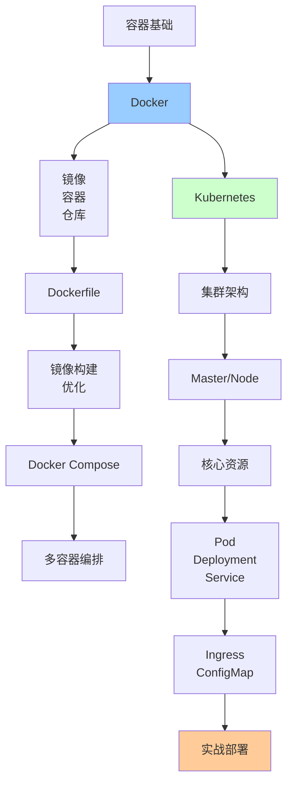

# 容器化技术详解

> 深入理解Docker容器化与Kubernetes编排

---

## 📋 文档列表

### 1. Docker与Kubernetes详解 ⭐ 推荐
📄 [Docker与Kubernetes详解.md](./Docker与Kubernetes详解.md)

**核心内容**：
- ✅ **Docker核心原理**：容器vs虚拟机、Docker架构、底层技术、镜像分层
- ✅ **Docker实战**：Dockerfile最佳实践、Docker Compose、网络、数据持久化
- ✅ **Kubernetes架构**：核心组件、Master/Node节点
- ✅ **K8s核心资源**：Pod、Deployment、Service、ConfigMap、Ingress
- ✅ **服务发现与负载均衡**：DNS、kube-proxy、负载均衡算法
- ✅ **常见问题解决**：镜像拉取、Pod Pending、容器重启、资源优化

**适合场景**：
- 微服务部署
- DevOps实践
- 云原生应用
- 容器编排

---

## 🎯 学习路径



**推荐顺序**：
1. 理解容器和Docker基础
2. 掌握Dockerfile和镜像构建
3. 学习Docker Compose
4. 了解Kubernetes架构
5. 掌握K8s核心资源
6. 实战项目部署

---

## 💡 核心知识点速查

### Docker相关

**Q1: 容器和虚拟机有什么区别？**
```
虚拟机：
- 包含完整OS
- 启动慢（分钟级）
- 体积大（GB级）
- 资源占用高

容器：
- 共享宿主OS
- 启动快（秒级）
- 体积小（MB级）
- 资源占用低
```
- 详见：[Docker与Kubernetes详解.md](./Docker与Kubernetes详解.md#11-容器vs虚拟机)

**Q2: Docker镜像为什么采用分层结构？**
```
优点：
✅ 共享层（多镜像共享基础层）
✅ 快速构建（只重建修改的层）
✅ 节省空间
✅ 写时复制（Copy-on-Write）
```
- 详见：[Docker与Kubernetes详解.md](./Docker与Kubernetes详解.md#14-镜像分层)

**Q3: Dockerfile如何优化？**
```
1. 使用官方基础镜像
2. 合并RUN命令
3. 利用构建缓存
4. 多阶段构建
5. 使用.dockerignore
6. 创建非root用户
```
- 详见：[Docker与Kubernetes详解.md](./Docker与Kubernetes详解.md#21-dockerfile最佳实践)

### Kubernetes相关

**Q4: K8s集群由哪些组件组成？**
```
Master节点：
- API Server：集群入口
- Scheduler：Pod调度
- Controller Manager：控制器管理
- etcd：存储集群状态

Node节点：
- kubelet：节点代理
- kube-proxy：网络代理
- Container Runtime：容器运行时
```
- 详见：[Docker与Kubernetes详解.md](./Docker与Kubernetes详解.md#32-核心组件)

**Q5: Pod和容器有什么区别？**
```
Pod：
- K8s最小调度单元
- 可包含一个或多个容器
- 共享网络和存储
- 同一Pod内容器可通过localhost通信

容器：
- 应用运行实例
- 独立的文件系统
```

**Q6: Service有哪几种类型？**
```
1. ClusterIP：集群内部访问（默认）
2. NodePort：通过节点IP+端口访问
3. LoadBalancer：云厂商负载均衡器
4. ExternalName：映射外部服务
```
- 详见：[Docker与Kubernetes详解.md](./Docker与Kubernetes详解.md#43-service)

**Q7: 如何实现滚动更新？**
```yaml
strategy:
  type: RollingUpdate
  rollingUpdate:
    maxSurge: 1        # 最多增加1个Pod
    maxUnavailable: 1  # 最多不可用1个Pod
```

**Q8: 如何实现自动扩缩容？**
```yaml
# HPA（Horizontal Pod Autoscaler）
apiVersion: autoscaling/v2
kind: HorizontalPodAutoscaler
spec:
  minReplicas: 2
  maxReplicas: 10
  metrics:
  - type: Resource
    resource:
      name: cpu
      target:
        averageUtilization: 70
```

---

## 🛠️ 实战工具箱

### Docker命令

**基础命令**：
```bash
# 镜像操作
docker pull nginx:latest
docker images
docker rmi nginx:latest
docker build -t myapp:1.0 .

# 容器操作
docker run -d -p 8080:80 nginx
docker ps
docker stop container_id
docker rm container_id
docker logs container_id
docker exec -it container_id bash

# 网络操作
docker network create my-network
docker network ls
docker network rm my-network

# 数据卷
docker volume create my-data
docker volume ls
docker volume rm my-data
```

**Docker Compose**：
```bash
docker-compose up -d
docker-compose ps
docker-compose logs -f
docker-compose down
docker-compose restart
```

### Kubectl命令

**基础命令**：
```bash
# 查看资源
kubectl get pods
kubectl get deployments
kubectl get services
kubectl get nodes

# 详细信息
kubectl describe pod myapp-pod
kubectl logs myapp-pod
kubectl logs -f myapp-pod --tail=100

# 创建/更新资源
kubectl apply -f deployment.yaml
kubectl delete -f deployment.yaml
kubectl edit deployment myapp

# 进入容器
kubectl exec -it myapp-pod -- bash

# 端口转发
kubectl port-forward myapp-pod 8080:8080

# 扩缩容
kubectl scale deployment myapp --replicas=5

# 滚动更新
kubectl set image deployment/myapp myapp=myapp:2.0
kubectl rollout status deployment/myapp
kubectl rollout undo deployment/myapp
```

---

## 📊 最佳实践

### Docker最佳实践

**1. 镜像构建**：
```dockerfile
# 使用多阶段构建
FROM maven:3.8-jdk-11 AS build
WORKDIR /app
COPY pom.xml .
RUN mvn dependency:go-offline
COPY src src
RUN mvn package -DskipTests

FROM openjdk:11-jre-slim
COPY --from=build /app/target/app.jar app.jar
ENTRYPOINT ["java", "-jar", "app.jar"]
```

**2. 安全性**：
```dockerfile
# 创建非root用户
RUN addgroup --system appgroup && \
    adduser --system --ingroup appgroup appuser
USER appuser

# 不暴露敏感信息
ENV DB_PASSWORD=***  # ❌
# 使用Secret注入 # ✅
```

**3. 健康检查**：
```dockerfile
HEALTHCHECK --interval=30s --timeout=3s \
  CMD curl -f http://localhost:8080/health || exit 1
```

### Kubernetes最佳实践

**1. 资源限制**：
```yaml
resources:
  requests:
    memory: "256Mi"
    cpu: "500m"
  limits:
    memory: "512Mi"
    cpu: "1000m"
```

**2. 健康检查**：
```yaml
livenessProbe:
  httpGet:
    path: /health
    port: 8080
  initialDelaySeconds: 30
  periodSeconds: 10

readinessProbe:
  httpGet:
    path: /ready
    port: 8080
  initialDelaySeconds: 10
  periodSeconds: 5
```

**3. 配置管理**：
```yaml
# 使用ConfigMap和Secret
env:
- name: CONFIG_VALUE
  valueFrom:
    configMapKeyRef:
      name: myapp-config
      key: config-key
- name: SECRET_VALUE
  valueFrom:
    secretKeyRef:
      name: myapp-secret
      key: secret-key
```

---

## 🚨 常见问题

### 1️⃣ 镜像体积过大

**问题**：镜像体积几个GB

**解决**：
- 使用alpine基础镜像
- 多阶段构建
- 清理缓存和临时文件

### 2️⃣ Pod一直Pending

**问题**：Pod无法调度

**解决**：
- 检查资源是否充足
- 检查节点选择器
- 检查污点和容忍度

### 3️⃣ 容器重启循环

**问题**：CrashLoopBackOff

**解决**：
- 查看容器日志
- 检查健康检查配置
- 检查资源限制

### 4️⃣ Service无法访问

**问题**：无法访问Service

**解决**：
- 检查Selector是否匹配
- 检查Endpoints
- 检查端口映射

### 5️⃣ 资源不足

**问题**：CPU/内存不足

**解决**：
- 合理设置requests/limits
- 使用HPA自动扩容
- 优化应用性能

---

## 🔗 相关资源

- 📖 《Docker技术入门与实战》
- 📖 《Kubernetes权威指南》
- 📖 《Kubernetes实战》
- 🔗 [Docker官方文档](https://docs.docker.com/)
- 🔗 [Kubernetes官方文档](https://kubernetes.io/docs/)
- 🔗 [Docker Hub](https://hub.docker.com/)

---

*最后更新：2025-10-27*

