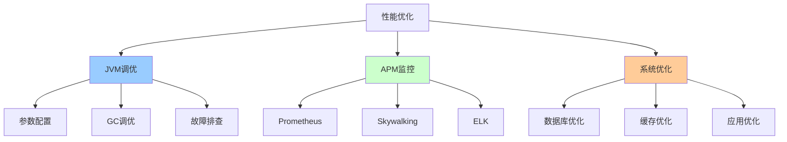

# 性能优化详解

> JVM调优、APM监控、性能测试、数据库优化、系统调优

---

## 📋 文档列表

### 1. JVM调优实战 ⭐⭐⭐ 必学
📄 [JVM调优实战.md](./JVM调优实战.md)

**核心内容**：
- ✅ **JVM参数配置**：堆内存、GC参数、日志参数
- ✅ **GC调优**：G1 GC、CMS GC、ZGC调优策略
- ✅ **内存分析**：Heap Dump、MAT工具、内存泄漏排查
- ✅ **故障排查**：CPU飙高、内存溢出、线程死锁
- ✅ **性能监控**：JMX、Arthas诊断工具
- ✅ **实战案例**：Full GC频繁、接口响应慢

### 2. 性能监控与系统优化 ⭐⭐⭐ 必学
📄 [性能监控与系统优化.md](./性能监控与系统优化.md)

**核心内容**：
- ✅ **APM监控**：Prometheus+Grafana、Skywalking、ELK
- ✅ **性能测试**：JMeter、Gatling、性能基线
- ✅ **数据库优化**：慢查询分析、索引优化、分库分表
- ✅ **缓存优化**：多级缓存、缓存穿透/击穿/雪崩
- ✅ **应用层优化**：异步处理、批量操作、连接池
- ✅ **系统调优**：Linux内核参数、JVM参数

---

## 🎯 学习路径



**推荐顺序**：
1. JVM基础参数配置
2. GC调优（G1 GC）
3. APM监控体系搭建
4. 性能测试与分析
5. 数据库与缓存优化
6. 系统全链路调优

---

## 💡 核心知识点速查

**Q1: 生产环境JVM参数如何配置？**
```bash
# 8G内存服务器推荐配置
java -Xms4g -Xmx4g -Xmn2g -Xss256k \
     -XX:MetaspaceSize=256m -XX:MaxMetaspaceSize=512m \
     -XX:+UseG1GC \
     -XX:MaxGCPauseMillis=200 \
     -XX:+HeapDumpOnOutOfMemoryError \
     -Xlog:gc*:file=/var/log/gc.log \
     -jar app.jar

内存分配：
- 堆内存：4G（50%）
  - 新生代：2G
  - 老年代：2G
- 元空间：512M
- 操作系统：2G
- 缓冲：1.5G
```
- 详见：[JVM调优实战.md](./JVM调优实战.md#11-内存参数)

**Q2: G1 GC如何调优？**
```
关键参数：
-XX:MaxGCPauseMillis=200      # 目标停顿时间
-XX:InitiatingHeapOccupancyPercent=45  # 触发Mixed GC

调优策略：
1. Minor GC频繁 → 增大 -Xmn
2. Mixed GC频繁 → 降低InitiatingHeapOccupancyPercent
3. Full GC发生 → 检查内存泄漏、增大堆
4. 停顿时间长 → 降低MaxGCPauseMillis
```
- 详见：[JVM调优实战.md](./JVM调优实战.md#23-g1-gc调优)

**Q3: 如何排查CPU飙高？**
```bash
# 1. 找到CPU高的进程
top
# PID 1234, CPU 300%

# 2. 找到CPU高的线程
top -Hp 1234
# TID 1250, CPU 150%

# 3. 转为16进制
printf "%x\n" 1250
# 4e2

# 4. 查看线程堆栈
jstack 1234 | grep 4e2 -A 50

# 5. 分析代码找到问题
```
- 详见：[JVM调优实战.md](./JVM调优实战.md#41-cpu飙高排查)

**Q4: 如何搭建APM监控？**
```
推荐方案：Prometheus + Grafana + Skywalking

1. Prometheus：指标采集
   - JVM内存、GC、线程
   - 业务指标（QPS、延迟）

2. Grafana：可视化
   - Dashboard展示
   - 告警配置

3. Skywalking：链路追踪
   - 调用链分析
   - 性能瓶颈定位
```
- 详见：[性能监控与系统优化.md](./性能监控与系统优化.md#1-apm监控体系)

**Q5: 如何进行性能测试？**
```
测试工具：JMeter / Gatling

关键指标：
1. 吞吐量（TPS）：>1000
2. 响应时间：
   - 平均：<200ms
   - P95：<500ms
   - P99：<1000ms
3. 错误率：<1%
4. 资源使用：CPU/内存 <80%

测试策略：
1. 基准测试：确定性能基线
2. 负载测试：找到性能拐点
3. 压力测试：找到系统极限
4. 稳定性测试：长时间运行
```
- 详见：[性能监控与系统优化.md](./性能监控与系统优化.md#2-性能测试)

**Q6: 如何优化数据库性能？**
```
1. SQL优化：
   - 使用EXPLAIN分析
   - 避免全表扫描
   - 避免函数破坏索引

2. 索引优化：
   - 创建合适的索引
   - 使用覆盖索引
   - 联合索引顺序

3. 分库分表：
   - Sharding-JDBC
   - 水平拆分
   - 垂直拆分

4. 连接池优化：
   - HikariCP配置
   - 合理设置连接数
```
- 详见：[性能监控与系统优化.md](./性能监控与系统优化.md#3-数据库性能优化)

**Q7: 缓存三大问题如何解决？**
```
1. 缓存穿透：
   解决：布隆过滤器

2. 缓存击穿：
   解决：分布式锁

3. 缓存雪崩：
   解决：随机过期时间、多级缓存
```
- 详见：[性能监控与系统优化.md](./性能监控与系统优化.md#42-缓存穿透击穿雪崩)

---

## 🛠️ 快速开始

### JVM调优

**生产环境启动脚本**：
```bash
#!/bin/bash
JAVA_OPTS="-server \
-Xms8g -Xmx8g -Xmn4g -Xss256k \
-XX:MetaspaceSize=256m -XX:MaxMetaspaceSize=512m \
-XX:+UseG1GC \
-XX:MaxGCPauseMillis=200 \
-XX:+HeapDumpOnOutOfMemoryError \
-XX:HeapDumpPath=/var/log/heapdump/ \
-Xlog:gc*:file=/var/log/gc.log"

java $JAVA_OPTS -jar app.jar
```

### APM监控

**Spring Boot集成**：
```xml
<dependency>
    <groupId>io.micrometer</groupId>
    <artifactId>micrometer-registry-prometheus</artifactId>
</dependency>
```

```yaml
management:
  endpoints:
    web:
      exposure:
        include: prometheus
```

### 性能测试

**JMeter脚本**：
```
1. 添加线程组：100并发
2. 添加HTTP请求
3. 添加监听器（查看结果树）
4. 运行测试
5. 分析结果
```

---

## 📊 性能基线参考

### Spring Boot应用性能基线

| 指标 | 目标值 | 优秀 | 良好 | 需优化 |
|------|--------|------|------|--------|
| TPS | >1000 | >5000 | >2000 | <1000 |
| P99延迟 | <200ms | <50ms | <100ms | >500ms |
| CPU使用率 | <70% | <50% | <60% | >80% |
| 内存使用率 | <70% | <50% | <60% | >80% |
| GC停顿 | <50ms | <20ms | <30ms | >100ms |

### 常见接口性能标准

| 接口类型 | P99延迟 | TPS | 说明 |
|----------|---------|-----|------|
| 简单查询 | <50ms | >5000 | 单表查询 |
| 复杂查询 | <200ms | >1000 | 多表Join |
| 写入操作 | <100ms | >2000 | 单条写入 |
| 批量操作 | <500ms | >500 | 批量写入 |

---

## 🚨 常见问题

### 1️⃣ Full GC频繁

**现象**：每5分钟Full GC一次，停顿2-3秒

**排查**：
```bash
# 1. 查看GC日志
tail -f /var/log/gc.log

# 2. Dump堆分析
jmap -dump:live,format=b,file=heap.hprof <pid>

# 3. MAT分析内存泄漏
```

**常见原因**：
- ThreadLocal未清理
- 静态集合未清理
- 监听器未移除

### 2️⃣ 接口响应慢

**排查工具**：
```bash
# Arthas分析
java -jar arthas-boot.jar

# 监控方法耗时
trace com.example.OrderService createOrder -n 10
```

**常见原因**：
- N+1查询问题
- 同步调用慢接口
- 数据库索引缺失

### 3️⃣ CPU飙高

**排查步骤**：
1. top找进程
2. top -Hp找线程
3. jstack分析堆栈

**常见原因**：
- 死循环
- 频繁GC
- 正则回溯

---

## 📈 最佳实践

### 1. JVM参数配置

```bash
✅ 堆内存Xms和Xmx设置相同（避免动态扩展）
✅ 新生代占堆的1/2（-Xmn）
✅ 使用G1 GC（JDK 9+）
✅ 开启HeapDump（-XX:+HeapDumpOnOutOfMemoryError）
✅ 配置GC日志
❌ 避免使用-XX:+DisableExplicitGC（影响NIO）
```

### 2. 监控告警

```
✅ 配置Prometheus + Grafana
✅ 设置告警阈值：
   - CPU >80%
   - 内存 >80%
   - GC停顿 >200ms
   - 接口P99 >500ms
✅ 接入Skywalking链路追踪
✅ ELK日志分析
```

### 3. 性能测试

```
✅ 建立性能基线
✅ 每次发布前压测
✅ 监控关键指标
✅ 分析性能瓶颈
✅ 持续优化
```

### 4. 数据库优化

```java
// ✅ 批量操作
orderMapper.insertBatch(orders);

// ✅ 使用索引
@TableField(exist = false)  // 避免查询不存在的字段

// ✅ 连接池配置
spring.datasource.hikari.maximum-pool-size=20

// ❌ 避免N+1查询
for (User user : users) {
    List<Order> orders = orderMapper.selectByUserId(user.getId());
}
```

---

## 🌟 进阶方向

### 1. 全链路压测

```
- 生产环境压测
- 流量录制回放
- 数据隔离
- 性能瓶颈分析
```

### 2. 混沌工程

```
- 故障注入
- 容错测试
- 弹性验证
```

### 3. 智能调优

```
- AI自动调参
- 性能预测
- 智能告警
```

---

## 🔗 相关资源

- 🔗 [Oracle JVM调优指南](https://docs.oracle.com/javase/8/docs/technotes/guides/vm/gctuning/)
- 🔗 [Prometheus官方文档](https://prometheus.io/docs/)
- 🔗 [Skywalking官方文档](https://skywalking.apache.org/)
- 🔗 [Arthas官方文档](https://arthas.aliyun.com/)
- 📖 《深入理解Java虚拟机》
- 📖 《Java性能权威指南》
- 📖 《高性能MySQL》

---

*最后更新：2025-10-27*

