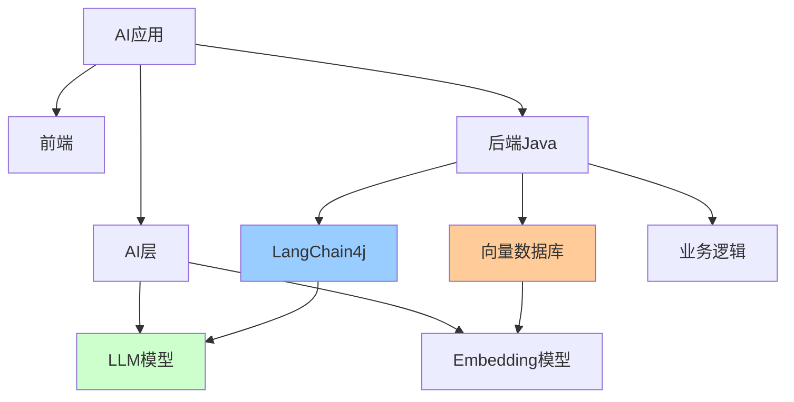
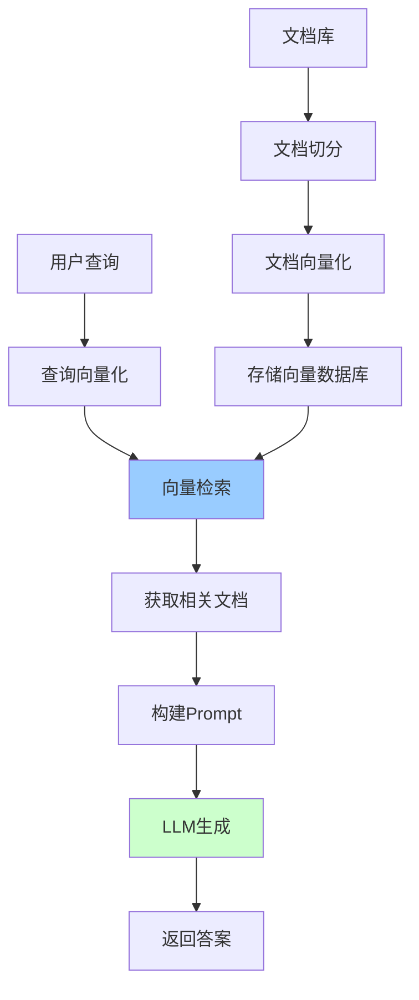

# Java AI开发实战

> AI时代Java工程师必备技能：LangChain4j、向量数据库、RAG、Prompt工程

---

## 📋 目录

1. [AI集成概述](#1-ai集成概述)
2. [LangChain4j框架](#2-langchain4j框架)
3. [向量数据库](#3-向量数据库)
4. [RAG检索增强生成](#4-rag检索增强生成)
5. [Prompt工程](#5-prompt工程)
6. [AI应用架构](#6-ai应用架构)
7. [实战案例](#7-实战案例)

---

## 1. AI集成概述

### 1.1 AI应用技术栈



### 1.2 核心技术点

```
1. LLM集成：
   - OpenAI、Claude、通义千问
   - LangChain4j框架
   - Function Calling
   - Stream响应

2. 向量数据库：
   - Milvus、Pinecone、Weaviate
   - 向量检索
   - 相似度搜索

3. RAG（检索增强生成）：
   - 文档切分
   - 向量化
   - 检索+生成
   - 上下文管理

4. Prompt工程：
   - 提示词设计
   - Few-shot学习
   - Chain of Thought
   - 提示词模板

5. AI Agent：
   - 多步推理
   - 工具调用
   - 记忆管理
   - 自主决策
```

---

## 2. LangChain4j框架

### 2.1 快速开始

**Maven依赖**：
```xml
<dependencies>
    <!-- LangChain4j核心 -->
    <dependency>
        <groupId>dev.langchain4j</groupId>
        <artifactId>langchain4j</artifactId>
        <version>0.28.0</version>
    </dependency>
    
    <!-- OpenAI集成 -->
    <dependency>
        <groupId>dev.langchain4j</groupId>
        <artifactId>langchain4j-open-ai</artifactId>
        <version>0.28.0</version>
    </dependency>
    
    <!-- Spring Boot集成 -->
    <dependency>
        <groupId>dev.langchain4j</groupId>
        <artifactId>langchain4j-spring-boot-starter</artifactId>
        <version>0.28.0</version>
    </dependency>
</dependencies>
```

**基础配置**：
```yaml
# application.yml
langchain4j:
  open-ai:
    api-key: ${OPENAI_API_KEY}
    model-name: gpt-4
    temperature: 0.7
    max-tokens: 2000
    timeout: 60s
```

### 2.2 基础使用

**简单对话**：
```java
import dev.langchain4j.model.chat.ChatLanguageModel;
import dev.langchain4j.model.openai.OpenAiChatModel;

@Service
public class ChatService {
    
    private final ChatLanguageModel chatModel;
    
    public ChatService() {
        this.chatModel = OpenAiChatModel.builder()
            .apiKey(System.getenv("OPENAI_API_KEY"))
            .modelName("gpt-4")
            .temperature(0.7)
            .build();
    }
    
    public String chat(String userMessage) {
        return chatModel.generate(userMessage);
    }
}
```

**流式响应**：
```java
import dev.langchain4j.model.chat.StreamingChatLanguageModel;
import dev.langchain4j.model.openai.OpenAiStreamingChatModel;
import reactor.core.publisher.Flux;

@Service
public class StreamingChatService {
    
    private final StreamingChatLanguageModel streamingModel;
    
    public StreamingChatService() {
        this.streamingModel = OpenAiStreamingChatModel.builder()
            .apiKey(System.getenv("OPENAI_API_KEY"))
            .modelName("gpt-4")
            .build();
    }
    
    public Flux<String> chatStream(String userMessage) {
        return Flux.create(sink -> {
            streamingModel.generate(userMessage, new StreamingResponseHandler() {
                @Override
                public void onNext(String token) {
                    sink.next(token);
                }
                
                @Override
                public void onComplete(Response<AiMessage> response) {
                    sink.complete();
                }
                
                @Override
                public void onError(Throwable error) {
                    sink.error(error);
                }
            });
        });
    }
}
```

### 2.3 Function Calling

**定义工具**：
```java
public class WeatherTools {
    
    @Tool("获取指定城市的天气信息")
    public String getWeather(@P("城市名称") String city) {
        // 调用天气API
        return "北京今天晴天，温度25°C";
    }
    
    @Tool("获取股票价格")
    public String getStockPrice(@P("股票代码") String symbol) {
        // 调用股票API
        return symbol + " 当前价格：150.25";
    }
}
```

**集成工具**：
```java
@Service
public class AIAssistantService {
    
    private final ChatLanguageModel chatModel;
    private final WeatherTools weatherTools;
    
    public String chat(String userMessage) {
        return AiServices.builder(Assistant.class)
            .chatLanguageModel(chatModel)
            .tools(weatherTools)
            .build()
            .chat(userMessage);
    }
    
    interface Assistant {
        String chat(String message);
    }
}
```

### 2.4 对话记忆

```java
import dev.langchain4j.memory.ChatMemory;
import dev.langchain4j.memory.chat.MessageWindowChatMemory;

@Service
public class ConversationService {
    
    private final Map<String, ChatMemory> userMemories = new ConcurrentHashMap<>();
    
    public String chat(String userId, String message) {
        ChatMemory memory = userMemories.computeIfAbsent(userId, 
            id -> MessageWindowChatMemory.withMaxMessages(10)
        );
        
        return AiServices.builder(Assistant.class)
            .chatLanguageModel(chatModel)
            .chatMemory(memory)
            .build()
            .chat(message);
    }
    
    interface Assistant {
        String chat(String message);
    }
}
```

---

## 3. 向量数据库

### 3.1 Milvus集成

**Maven依赖**：
```xml
<dependency>
    <groupId>io.milvus</groupId>
    <artifactId>milvus-sdk-java</artifactId>
    <version>2.3.4</version>
</dependency>

<dependency>
    <groupId>dev.langchain4j</groupId>
    <artifactId>langchain4j-embeddings</artifactId>
    <version>0.28.0</version>
</dependency>
```

**Milvus配置**：
```java
@Configuration
public class MilvusConfig {
    
    @Bean
    public MilvusClient milvusClient() {
        return new MilvusServiceClient(
            ConnectParam.newBuilder()
                .withHost("localhost")
                .withPort(19530)
                .build()
        );
    }
    
    @Bean
    public EmbeddingModel embeddingModel() {
        return OpenAiEmbeddingModel.builder()
            .apiKey(System.getenv("OPENAI_API_KEY"))
            .modelName("text-embedding-ada-002")
            .build();
    }
}
```

**向量存储服务**：
```java
@Service
public class VectorStoreService {
    
    private final MilvusClient milvusClient;
    private final EmbeddingModel embeddingModel;
    private static final String COLLECTION_NAME = "documents";
    
    /**
     * 存储文档
     */
    public void storeDocument(String id, String content, Map<String, String> metadata) {
        // 1. 生成向量
        Embedding embedding = embeddingModel.embed(content).content();
        
        // 2. 准备数据
        List<InsertParam.Field> fields = Arrays.asList(
            new InsertParam.Field("id", Collections.singletonList(id)),
            new InsertParam.Field("content", Collections.singletonList(content)),
            new InsertParam.Field("vector", Collections.singletonList(embedding.vector())),
            new InsertParam.Field("metadata", Collections.singletonList(gson.toJson(metadata)))
        );
        
        // 3. 插入Milvus
        InsertParam insertParam = InsertParam.newBuilder()
            .withCollectionName(COLLECTION_NAME)
            .withFields(fields)
            .build();
        
        milvusClient.insert(insertParam);
    }
    
    /**
     * 相似度搜索
     */
    public List<Document> search(String query, int topK) {
        // 1. 查询向量化
        Embedding queryEmbedding = embeddingModel.embed(query).content();
        
        // 2. 向量检索
        SearchParam searchParam = SearchParam.newBuilder()
            .withCollectionName(COLLECTION_NAME)
            .withMetricType(MetricType.L2)
            .withVectors(Collections.singletonList(queryEmbedding.vector()))
            .withTopK(topK)
            .withParams("{\"nprobe\":10}")
            .build();
        
        R<SearchResults> response = milvusClient.search(searchParam);
        
        // 3. 解析结果
        return parseSearchResults(response.getData());
    }
}
```

### 3.2 创建Collection

```java
@PostConstruct
public void createCollectionIfNotExists() {
    // 1. 检查collection是否存在
    HasCollectionParam hasParam = HasCollectionParam.newBuilder()
        .withCollectionName(COLLECTION_NAME)
        .build();
    
    if (!milvusClient.hasCollection(hasParam).getData()) {
        // 2. 定义Schema
        FieldType idField = FieldType.newBuilder()
            .withName("id")
            .withDataType(DataType.VarChar)
            .withMaxLength(256)
            .withPrimaryKey(true)
            .build();
        
        FieldType contentField = FieldType.newBuilder()
            .withName("content")
            .withDataType(DataType.VarChar)
            .withMaxLength(65535)
            .build();
        
        FieldType vectorField = FieldType.newBuilder()
            .withName("vector")
            .withDataType(DataType.FloatVector)
            .withDimension(1536)  // text-embedding-ada-002维度
            .build();
        
        FieldType metadataField = FieldType.newBuilder()
            .withName("metadata")
            .withDataType(DataType.VarChar)
            .withMaxLength(65535)
            .build();
        
        // 3. 创建Collection
        CreateCollectionParam createParam = CreateCollectionParam.newBuilder()
            .withCollectionName(COLLECTION_NAME)
            .addFieldType(idField)
            .addFieldType(contentField)
            .addFieldType(vectorField)
            .addFieldType(metadataField)
            .build();
        
        milvusClient.createCollection(createParam);
        
        // 4. 创建索引
        CreateIndexParam indexParam = CreateIndexParam.newBuilder()
            .withCollectionName(COLLECTION_NAME)
            .withFieldName("vector")
            .withIndexType(IndexType.IVF_FLAT)
            .withMetricType(MetricType.L2)
            .withExtraParam("{\"nlist\":1024}")
            .build();
        
        milvusClient.createIndex(indexParam);
    }
}
```

---

## 4. RAG检索增强生成

### 4.1 RAG架构



### 4.2 文档处理

**文档切分**：
```java
import dev.langchain4j.data.document.Document;
import dev.langchain4j.data.document.DocumentSplitter;
import dev.langchain4j.data.document.splitter.DocumentSplitters;

@Service
public class DocumentProcessingService {
    
    private final DocumentSplitter splitter;
    
    public DocumentProcessingService() {
        this.splitter = DocumentSplitters.recursive(
            500,  // chunk size
            50    // chunk overlap
        );
    }
    
    /**
     * 处理并存储文档
     */
    public void processDocument(String filePath) {
        // 1. 加载文档
        Document document = FileSystemDocumentLoader.loadDocument(filePath);
        
        // 2. 切分文档
        List<Document> chunks = splitter.split(document);
        
        // 3. 向量化并存储
        for (int i = 0; i < chunks.size(); i++) {
            Document chunk = chunks.get(i);
            String id = document.metadata().getString("file_name") + "_" + i;
            
            Map<String, String> metadata = new HashMap<>();
            metadata.put("source", filePath);
            metadata.put("chunk_index", String.valueOf(i));
            
            vectorStoreService.storeDocument(id, chunk.text(), metadata);
        }
    }
}
```

### 4.3 RAG查询

```java
@Service
public class RAGService {
    
    private final VectorStoreService vectorStore;
    private final ChatLanguageModel chatModel;
    
    /**
     * RAG查询
     */
    public String query(String question) {
        // 1. 检索相关文档
        List<Document> relevantDocs = vectorStore.search(question, 3);
        
        // 2. 构建上下文
        String context = relevantDocs.stream()
            .map(Document::text)
            .collect(Collectors.joining("\n\n"));
        
        // 3. 构建Prompt
        String prompt = """
            基于以下上下文回答问题：
            
            上下文：
            %s
            
            问题：%s
            
            请基于上下文回答，如果上下文中没有相关信息，请说"我不知道"。
            """.formatted(context, question);
        
        // 4. 生成答案
        return chatModel.generate(prompt);
    }
}
```

### 4.4 RAG优化

**混合检索**：
```java
public List<Document> hybridSearch(String query, int topK) {
    // 1. 向量检索
    List<Document> vectorResults = vectorStore.search(query, topK * 2);
    
    // 2. 关键词检索（使用Elasticsearch）
    List<Document> keywordResults = elasticsearchService.search(query, topK * 2);
    
    // 3. 重排序（Reranking）
    List<Document> combined = new ArrayList<>();
    combined.addAll(vectorResults);
    combined.addAll(keywordResults);
    
    // 4. 使用Reranker模型重新排序
    return rerankerService.rerank(query, combined)
        .stream()
        .limit(topK)
        .collect(Collectors.toList());
}
```

**答案引用**：
```java
public RagResponse queryWithCitations(String question) {
    List<Document> relevantDocs = vectorStore.search(question, 3);
    
    String prompt = """
        基于以下上下文回答问题，并在答案中标注引用来源[1]、[2]、[3]：
        
        [1] %s
        [2] %s
        [3] %s
        
        问题：%s
        """.formatted(
            relevantDocs.get(0).text(),
            relevantDocs.get(1).text(),
            relevantDocs.get(2).text(),
            question
        );
    
    String answer = chatModel.generate(prompt);
    
    return new RagResponse(answer, relevantDocs);
}
```

---

## 5. Prompt工程

### 5.1 Prompt模板

```java
@Component
public class PromptTemplates {
    
    /**
     * 系统角色模板
     */
    public static final PromptTemplate SYSTEM_TEMPLATE = PromptTemplate.from("""
        你是一个专业的{{role}}助手。
        你的任务是{{task}}。
        请遵循以下规则：
        {{rules}}
        """);
    
    /**
     * RAG查询模板
     */
    public static final PromptTemplate RAG_TEMPLATE = PromptTemplate.from("""
        基于以下上下文回答问题：
        
        上下文：
        {{context}}
        
        问题：{{question}}
        
        要求：
        1. 仅基于上下文回答
        2. 如果不确定，说"我不知道"
        3. 标注信息来源
        """);
    
    /**
     * Few-shot模板
     */
    public static final PromptTemplate FEW_SHOT_TEMPLATE = PromptTemplate.from("""
        任务：{{task}}
        
        示例1：
        输入：{{example1_input}}
        输出：{{example1_output}}
        
        示例2：
        输入：{{example2_input}}
        输出：{{example2_output}}
        
        现在处理：
        输入：{{input}}
        输出：
        """);
}
```

**使用模板**：
```java
@Service
public class PromptService {
    
    public String generatePrompt(String role, String task, List<String> rules) {
        Map<String, Object> variables = Map.of(
            "role", role,
            "task", task,
            "rules", String.join("\n", rules)
        );
        
        return SYSTEM_TEMPLATE.apply(variables).text();
    }
}
```

### 5.2 Chain of Thought

```java
public String complexReasoning(String question) {
    String prompt = """
        请一步步思考以下问题：
        
        问题：%s
        
        思考过程（请按以下格式）：
        步骤1：[分析问题]
        步骤2：[列出关键信息]
        步骤3：[推理过程]
        步骤4：[得出结论]
        
        最终答案：
        """.formatted(question);
    
    return chatModel.generate(prompt);
}
```

### 5.3 自我反思

```java
public String selfReflection(String question) {
    // 1. 第一次生成答案
    String firstAnswer = chatModel.generate(question);
    
    // 2. 自我评估
    String reflectionPrompt = """
        问题：%s
        
        初步答案：%s
        
        请评估这个答案：
        1. 是否准确？
        2. 是否完整？
        3. 有没有遗漏的重要信息？
        4. 可以如何改进？
        
        改进后的答案：
        """.formatted(question, firstAnswer);
    
    return chatModel.generate(reflectionPrompt);
}
```

---

## 6. AI应用架构

### 6.1 典型架构

```
┌─────────────────────────────────────────┐
│             前端应用                     │
└──────────────┬──────────────────────────┘
               │ HTTP/WebSocket
┌──────────────┴──────────────────────────┐
│          Spring Boot后端                │
│  ┌─────────────────────────────────┐   │
│  │  Controller层（API接口）         │   │
│  └──────────────┬──────────────────┘   │
│  ┌──────────────┴──────────────────┐   │
│  │  Service层（业务逻辑）           │   │
│  │  - ChatService                   │   │
│  │  - RAGService                    │   │
│  │  - DocumentService               │   │
│  └──────────────┬──────────────────┘   │
│  ┌──────────────┴──────────────────┐   │
│  │  AI Integration层               │   │
│  │  - LangChain4j                   │   │
│  │  - Prompt管理                    │   │
│  │  - Memory管理                    │   │
│  └──────────────┬──────────────────┘   │
└─────────────────┼───────────────────────┘
                  │
     ┌────────────┼────────────┐
     │            │            │
┌────┴────┐  ┌───┴────┐  ┌───┴────────┐
│ LLM API │  │ Milvus │  │ MySQL/Redis│
│ (OpenAI)│  │(向量库)│  │  (数据库)   │
└─────────┘  └────────┘  └────────────┘
```

### 6.2 Controller层

```java
@RestController
@RequestMapping("/api/ai")
public class AIController {
    
    private final ChatService chatService;
    private final RAGService ragService;
    
    /**
     * 普通对话
     */
    @PostMapping("/chat")
    public ResponseEntity<ChatResponse> chat(@RequestBody ChatRequest request) {
        String answer = chatService.chat(
            request.getUserId(),
            request.getMessage()
        );
        return ResponseEntity.ok(new ChatResponse(answer));
    }
    
    /**
     * 流式对话
     */
    @GetMapping(value = "/chat/stream", produces = MediaType.TEXT_EVENT_STREAM_VALUE)
    public Flux<String> chatStream(
        @RequestParam String userId,
        @RequestParam String message
    ) {
        return chatService.chatStream(userId, message);
    }
    
    /**
     * RAG查询
     */
    @PostMapping("/rag/query")
    public ResponseEntity<RagResponse> ragQuery(@RequestBody RagRequest request) {
        RagResponse response = ragService.query(request.getQuestion());
        return ResponseEntity.ok(response);
    }
    
    /**
     * 上传文档
     */
    @PostMapping("/documents/upload")
    public ResponseEntity<String> uploadDocument(@RequestParam("file") MultipartFile file) {
        String documentId = documentService.processAndStore(file);
        return ResponseEntity.ok(documentId);
    }
}
```

### 6.3 异步处理

```java
@Service
public class AsyncAIService {
    
    @Async
    public CompletableFuture<String> asyncChat(String message) {
        String response = chatModel.generate(message);
        return CompletableFuture.completedFuture(response);
    }
    
    @Async
    public CompletableFuture<Void> asyncProcessDocument(String filePath) {
        documentProcessingService.processDocument(filePath);
        return CompletableFuture.completedFuture(null);
    }
}
```

### 6.4 缓存优化

```java
@Service
public class CachedChatService {
    
    @Cacheable(value = "ai-responses", key = "#message")
    public String chat(String message) {
        return chatModel.generate(message);
    }
    
    @Cacheable(value = "embeddings", key = "#text")
    public Embedding getEmbedding(String text) {
        return embeddingModel.embed(text).content();
    }
}
```

---

## 7. 实战案例

### 7.1 智能客服系统

```java
@Service
public class CustomerServiceBot {
    
    private final RAGService ragService;
    private final ChatMemory chatMemory;
    
    public String handleCustomerQuery(String userId, String query) {
        // 1. 意图识别
        Intent intent = intentClassifier.classify(query);
        
        // 2. 根据意图路由
        return switch (intent) {
            case FAQ -> ragService.query(query);
            case ORDER_QUERY -> orderService.queryOrder(query);
            case COMPLAINT -> complaintService.handleComplaint(query);
            default -> chatModel.generate(query);
        };
    }
}
```

### 7.2 文档问答系统

```java
@Service
public class DocumentQAService {
    
    public RagResponse answerQuestion(String documentId, String question) {
        // 1. 获取文档相关chunks
        List<Document> chunks = vectorStore.searchByMetadata(
            "document_id", documentId, question, 5
        );
        
        // 2. RAG生成答案
        String context = chunks.stream()
            .map(Document::text)
            .collect(Collectors.joining("\n\n"));
        
        String prompt = """
            基于以下文档内容回答问题：
            
            文档内容：
            %s
            
            问题：%s
            
            答案：
            """.formatted(context, question);
        
        String answer = chatModel.generate(prompt);
        
        return new RagResponse(answer, chunks);
    }
}
```

### 7.3 代码助手

```java
@Service
public class CodeAssistantService {
    
    public String generateCode(CodeRequest request) {
        String prompt = """
            编程语言：%s
            需求描述：%s
            
            请生成代码，要求：
            1. 代码规范
            2. 包含注释
            3. 处理异常
            4. 添加单元测试
            """.formatted(request.getLanguage(), request.getDescription());
        
        return chatModel.generate(prompt);
    }
    
    public String explainCode(String code) {
        String prompt = """
            请解释以下代码的功能和实现原理：
            
            ```
            %s
            ```
            
            请包括：
            1. 代码功能
            2. 关键逻辑
            3. 可能的优化点
            """.formatted(code);
        
        return chatModel.generate(prompt);
    }
}
```

---

## 📚 参考资源

- 🔗 [LangChain4j官方文档](https://docs.langchain4j.dev/)
- 🔗 [Milvus文档](https://milvus.io/docs)
- 🔗 [OpenAI API文档](https://platform.openai.com/docs)
- 📖 《大语言模型应用开发实战》
- 📖 《Prompt Engineering Guide》

---

*最后更新：2025-10-27*
