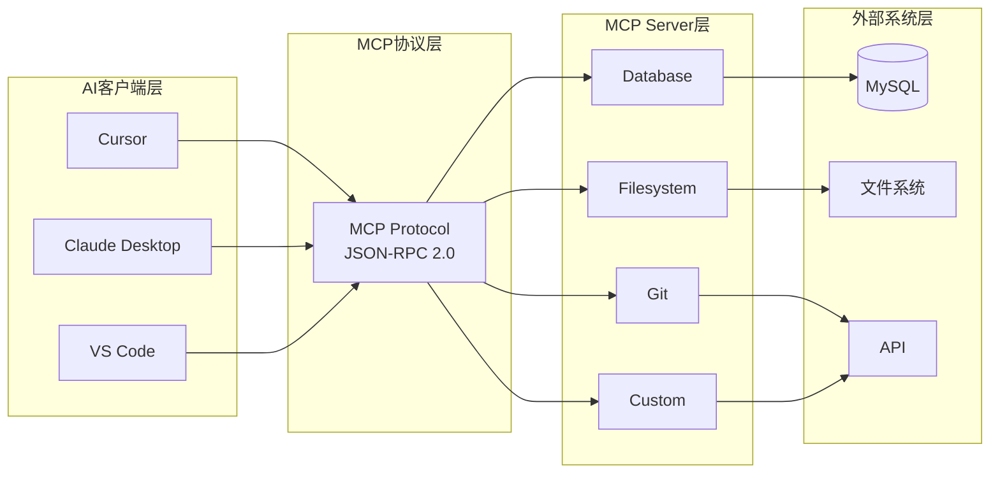

# MCP（Model Context Protocol）协议

> 🚀 Claude官方推出的AI与外部系统交互的标准化协议，打通AI应用开发的"最后一公里"

---

## 📋 文档列表

### 1. MCP协议核心原理与实战 ⭐ 全面系统
📄 [MCP协议核心原理与实战.md](./MCP协议核心原理与实战.md)

**核心内容**：
- ✅ **MCP简介**：协议定义、解决的问题、生态架构
- ✅ **核心概念**：Resources、Prompts、Tools三大组件
- ✅ **架构设计**：Client-Server架构、协议栈、通信流程
- ✅ **协议详解**：JSON-RPC 2.0、核心方法、传输层
- ✅ **MCP Server开发**：TypeScript/Python开发、完整示例
- ✅ **MCP Client集成**：Cursor配置、Claude Desktop配置、自定义Client
- ✅ **实战案例**：代码审查Server、SQL助手Server
- ✅ **最佳实践**：安全控制、性能优化、错误处理
- ✅ **常见问题**：调试方法、问题排查、选型建议

**核心特性**：
- 🌐 **统一标准**：一次开发，到处使用（类似USB标准化）
- 🔗 **打通数据孤岛**：访问本地文件、数据库、内部API
- 🧩 **插件化架构**：AI Client ←→ MCP Server ←→ 外部系统
- 📦 **完整生态**：官方Server + 社区Server + 开发SDK

**适合场景**：
- AI应用开发
- 私有数据接入
- 工具扩展开发
- 企业AI集成

**学习路径**：
```
1. 理解MCP是什么（第1章）
   → 为什么需要MCP？
   → MCP解决什么问题？
   → MCP生态架构

2. 掌握核心概念（第2章）
   → Resources（资源）：只读数据
   → Prompts（提示词）：可复用模板
   → Tools（工具）：可执行操作

3. 学习架构设计（第3章）
   → Client-Server架构
   → MCP协议栈
   → 通信流程

4. 熟悉协议细节（第4章）
   → JSON-RPC 2.0基础
   → MCP核心方法
   → 传输层（stdio、HTTP、WebSocket）

5. 开发MCP Server（第5章）
   → 最简单的Server（Hello World）
   → 文件系统Server
   → 数据库Server（MySQL）

6. 集成MCP Client（第6章）
   → Cursor配置
   → Claude Desktop配置
   → 自定义Client开发

7. 实战案例学习（第7章）
   → 智能代码审查Server
   → 智能SQL助手Server

8. 掌握最佳实践（第8章）
   → 安全控制（目录访问、SQL注入、命令注入）
   → 性能优化（缓存、流式传输、并发控制）
   → 错误处理（统一格式、优雅降级）
   → 日志记录

9. 问题排查（第9章）
   → Server启动失败
   → 工具调用超时
   → 调试方法
```

**三大核心组件对比**：

| 特性 | Resources（资源） | Prompts（提示词） | Tools（工具） |
|------|------------------|------------------|--------------|
| **作用** | 提供数据 | 提供模板 | 执行操作 |
| **读写** | 只读 | 只读 | 读写 |
| **副作用** | ❌ 无 | ❌ 无 | ✅ 有 |
| **参数化** | URI | 占位符 | 函数参数 |
| **返回值** | 数据内容 | 填充后的提示词 | 执行结果 |
| **示例** | 读取文件、查询数据库 | 代码审查模板、文档生成 | 创建文件、执行SQL |

---

## 🎯 MCP核心价值

### 1️⃣ 统一标准协议

```
传统方式：每个AI应用都要重复开发数据连接
- ChatGPT插件：自己的格式
- Cursor：自己的接口
- LangChain：自己的工具
→ 重复造轮子，不兼容

MCP方式：统一标准，一次开发，到处使用
- MCP Server开发一次
- 所有支持MCP的AI客户端都能用
- 类似USB接口标准化
```

**关键点**：
- **开发者友好**：一次开发，多处复用
- **用户友好**：统一配置，简单易用
- **生态繁荣**：官方Server + 社区Server

### 2️⃣ 打通数据孤岛

```
AI的局限性：
- 训练数据是公开的
- 无法访问企业内网数据
- 无法读取本地文件
→ AI能力受限

MCP的解决方案：
✅ 连接本地文件系统
✅ 访问内网数据库
✅ 调用内部API
✅ 读取私有知识库
→ AI + 私有数据
```

**典型应用**：
- **企业知识库问答**：AI访问企业文档库
- **代码智能补全**：AI读取项目文件
- **数据分析助手**：AI查询业务数据库
- **运维自动化**：AI执行运维命令

### 3️⃣ 插件化架构



**架构优势**：
- **松耦合**：AI客户端和Server独立开发
- **易扩展**：添加新Server不影响Client
- **可组合**：一个Client可以连接多个Server

---

## 🔧 快速上手

### 方式1：使用现有MCP Server（最快）

#### Cursor配置

**配置文件**：`~/.cursor/mcp.json`

```json
{
  "mcpServers": {
    "filesystem": {
      "command": "npx",
      "args": [
        "-y",
        "@modelcontextprotocol/server-filesystem",
        "/Users/username/projects"
      ]
    },
    "git": {
      "command": "npx",
      "args": [
        "-y",
        "@modelcontextprotocol/server-git",
        "/Users/username/projects"
      ]
    }
  }
}
```

**重启Cursor**，AI即可：
- 读取项目文件
- 查看Git历史
- 分析代码结构

#### Claude Desktop配置

**配置文件（macOS）**：`~/Library/Application Support/Claude/claude_desktop_config.json`

```json
{
  "mcpServers": {
    "filesystem": {
      "command": "npx",
      "args": ["-y", "@modelcontextprotocol/server-filesystem", "/Users/username/Documents"]
    },
    "brave-search": {
      "command": "npx",
      "args": ["-y", "@modelcontextprotocol/server-brave-search"],
      "env": {
        "BRAVE_API_KEY": "your-api-key"
      }
    }
  }
}
```

**重启Claude Desktop**，AI即可：
- 搜索网页内容
- 读取本地文档

### 方式2：开发自己的MCP Server

#### 最简单的Server（5分钟）

```bash
# 1. 创建项目
mkdir my-mcp-server && cd my-mcp-server
npm init -y

# 2. 安装依赖
npm install @modelcontextprotocol/sdk

# 3. 创建Server
cat > index.js << 'EOF'
import { Server } from "@modelcontextprotocol/sdk/server/index.js";
import { StdioServerTransport } from "@modelcontextprotocol/sdk/server/stdio.js";
import { CallToolRequestSchema, ListToolsRequestSchema } from "@modelcontextprotocol/sdk/types.js";

const server = new Server(
  { name: "hello-server", version: "1.0.0" },
  { capabilities: { tools: {} } }
);

server.setRequestHandler(ListToolsRequestSchema, async () => ({
  tools: [{
    name: "hello",
    description: "Say hello",
    inputSchema: {
      type: "object",
      properties: {
        name: { type: "string", description: "Name" }
      },
      required: ["name"]
    }
  }]
}));

server.setRequestHandler(CallToolRequestSchema, async (request) => {
  if (request.params.name === "hello") {
    const name = request.params.arguments?.name || "World";
    return {
      content: [{ type: "text", text: `Hello, ${name}!` }]
    };
  }
  throw new Error("Unknown tool");
});

const transport = new StdioServerTransport();
await server.connect(transport);
EOF

# 4. 添加到package.json
npm pkg set type="module"

# 5. 运行测试
node index.js
```

#### 在Cursor中使用

**配置文件**：`~/.cursor/mcp.json`

```json
{
  "mcpServers": {
    "my-hello-server": {
      "command": "node",
      "args": ["/absolute/path/to/my-mcp-server/index.js"]
    }
  }
}
```

**重启Cursor**，AI即可调用`hello`工具！

---

## 📊 MCP生态

### 官方MCP Servers

| Server | 功能 | 安装命令 |
|--------|------|---------|
| **filesystem** | 文件系统操作 | `npx -y @modelcontextprotocol/server-filesystem <path>` |
| **git** | Git仓库管理 | `npx -y @modelcontextprotocol/server-git <repo>` |
| **github** | GitHub集成 | `npx -y @modelcontextprotocol/server-github` |
| **postgres** | PostgreSQL数据库 | `npx -y @modelcontextprotocol/server-postgres` |
| **gdrive** | Google Drive | `npx -y @modelcontextprotocol/server-gdrive` |
| **brave-search** | Brave搜索 | `npx -y @modelcontextprotocol/server-brave-search` |

### 社区MCP Servers

- **mcp-server-docker**：Docker容器管理
- **mcp-server-k8s**：Kubernetes集群操作
- **mcp-server-aws**：AWS服务集成
- **mcp-server-jira**：Jira项目管理
- **mcp-server-slack**：Slack消息发送

### 支持MCP的AI客户端

- ✅ **Cursor**：AI代码编辑器
- ✅ **Claude Desktop**：桌面应用
- 🔜 **VS Code**：计划支持
- 🔜 **JetBrains IDE**：计划支持

---

## 🛠️ 开发MCP Server核心步骤

### 步骤1：选择SDK

**TypeScript**（推荐）：
```bash
npm install @modelcontextprotocol/sdk
```

**Python**：
```bash
pip install mcp
```

### 步骤2：创建Server

```typescript
import { Server } from "@modelcontextprotocol/sdk/server/index.js";
import { StdioServerTransport } from "@modelcontextprotocol/sdk/server/stdio.js";

const server = new Server(
  { name: "my-server", version: "1.0.0" },
  { capabilities: { resources: {}, prompts: {}, tools: {} } }
);
```

### 步骤3：注册能力

```typescript
// 注册工具
server.setRequestHandler(ListToolsRequestSchema, async () => ({
  tools: [/* 工具列表 */]
}));

// 处理工具调用
server.setRequestHandler(CallToolRequestSchema, async (request) => {
  // 执行工具逻辑
});

// 注册资源（可选）
server.setRequestHandler(ListResourcesRequestSchema, async () => ({
  resources: [/* 资源列表 */]
}));

// 处理资源读取（可选）
server.setRequestHandler(ReadResourceRequestSchema, async (request) => {
  // 返回资源内容
});
```

### 步骤4：启动Server

```typescript
const transport = new StdioServerTransport();
await server.connect(transport);
```

### 步骤5：配置到AI客户端

```json
{
  "mcpServers": {
    "my-server": {
      "command": "node",
      "args": ["/path/to/server/index.js"]
    }
  }
}
```

---

## 🔐 最佳实践要点

### 1. 安全控制

#### 目录访问控制
```typescript
const ALLOWED_DIRECTORY = "/safe/path";

function validatePath(userPath: string): string {
  const fullPath = path.resolve(ALLOWED_DIRECTORY, userPath);
  
  if (!fullPath.startsWith(ALLOWED_DIRECTORY)) {
    throw new Error("Access denied");
  }
  
  return fullPath;
}
```

#### SQL注入防护
```typescript
// ❌ 不安全
const sql = `SELECT * FROM ${table} WHERE id = ${id}`;

// ✅ 安全
const sql = `SELECT * FROM ?? WHERE id = ?`;
await connection.execute(sql, [table, id]);
```

#### 命令注入防护
```typescript
// 白名单校验
const allowedCommands = ["ls", "cat", "grep"];
if (!allowedCommands.includes(cmd)) {
  throw new Error("Command not allowed");
}
```

### 2. 性能优化

#### 资源缓存
```typescript
const cache = new Map();
const CACHE_TTL = 5000;

// 缓存结果，避免重复计算
if (cache.has(key) && Date.now() - cache.get(key).time < CACHE_TTL) {
  return cache.get(key).data;
}
```

#### 并发控制
```typescript
import pLimit from "p-limit";

const limit = pLimit(5); // 最多5个并发
const tasks = files.map(file => limit(() => processFile(file)));
await Promise.all(tasks);
```

### 3. 错误处理

#### 统一错误格式
```typescript
class MCPError extends Error {
  constructor(public code: number, message: string, public data?: any) {
    super(message);
  }
}

throw new MCPError(-32001, "File not found", { path });
```

#### 优雅降级
```typescript
try {
  return await executeTool(params);
} catch (error) {
  console.error("Tool failed:", error);
  return {
    content: [{ type: "text", text: `失败：${error.message}` }],
    isError: true
  };
}
```

---

## 🚀 学习路线建议

### 初学者路线（1-2周）

```
Day 1-2：理解MCP
- 阅读文档第1-3章
- 理解Resources/Prompts/Tools
- 了解架构设计

Day 3-4：配置使用
- 配置Cursor/Claude Desktop
- 使用官方Filesystem Server
- 体验AI读取本地文件

Day 5-7：开发简单Server
- Hello World Server
- 文件读写Server
- 配置到Cursor使用

Day 8-10：开发实战Server
- 数据库Server
- 或代码审查Server
- 掌握最佳实践

Day 11-14：进阶学习
- 学习安全控制
- 性能优化
- 错误处理
```

### 进阶路线（2-4周）

```
Week 1：深入协议
- JSON-RPC 2.0详解
- 传输层机制
- 自定义Client开发

Week 2：复杂Server开发
- 多数据源集成
- 流式响应
- 异步任务处理

Week 3：企业级实践
- 认证授权
- 日志监控
- 性能调优

Week 4：生态贡献
- 开源MCP Server
- 发布到npm
- 文档编写
```

---

## 🔗 相关资源

### 官方文档
- [MCP官方网站](https://modelcontextprotocol.io/)
- [MCP GitHub](https://github.com/modelcontextprotocol)
- [TypeScript SDK](https://github.com/modelcontextprotocol/typescript-sdk)
- [Python SDK](https://github.com/modelcontextprotocol/python-sdk)

### 工具
- **MCP Inspector**：可视化测试MCP Server
  ```bash
  npm install -g @modelcontextprotocol/inspector
  mcp-inspector node ./dist/index.js
  ```

### 社区
- [MCP Discord](https://discord.gg/mcp)
- [MCP讨论区](https://github.com/modelcontextprotocol/discussions)

---

## 📈 未来发展

### 当前阶段（2024-2025）
- ✅ stdio传输（本地）
- ✅ 基础功能（Resources/Prompts/Tools）
- ✅ Cursor、Claude Desktop支持
- ✅ 官方Server生态

### 未来方向
- 🔜 HTTP/WebSocket远程传输
- 🔜 流式响应（Streaming）
- 🔜 更多IDE支持（VS Code、JetBrains）
- 🔜 MCP Marketplace（Server市场）
- 🔜 企业级功能（认证、审计、监控）
- 🔜 多模态支持（图片、音频）

---

## ✅ 技能自检清单

### 基础能力
- [ ] 理解MCP是什么，解决什么问题
- [ ] 了解Resources、Prompts、Tools的区别
- [ ] 能配置MCP Server到Cursor/Claude Desktop
- [ ] 能使用官方Filesystem Server

### 开发能力
- [ ] 能创建最简单的MCP Server（Hello World）
- [ ] 能开发文件操作Server
- [ ] 能开发数据库Server
- [ ] 了解JSON-RPC 2.0协议

### 进阶能力
- [ ] 掌握安全最佳实践（访问控制、注入防护）
- [ ] 掌握性能优化（缓存、并发）
- [ ] 掌握错误处理（统一格式、优雅降级）
- [ ] 能开发自定义Client

### 专家能力
- [ ] 能设计复杂的MCP Server架构
- [ ] 能实现企业级功能（认证、监控）
- [ ] 能发布开源MCP Server
- [ ] 能为MCP生态做贡献

---

*最后更新：2025-10-27*

