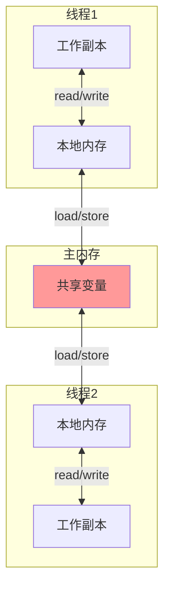
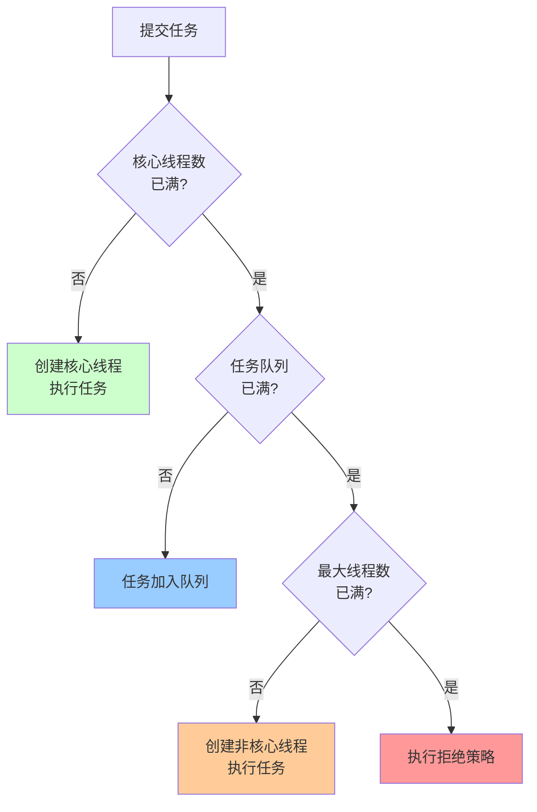

# Java并发编程详解

> 深入理解Java并发机制、线程安全、锁优化、并发工具类

---

## 📋 目录

1. [Java内存模型（JMM）](#1-java内存模型jmm)
2. [synchronized原理](#2-synchronized原理)
3. [volatile原理](#3-volatile原理)
4. [Lock与AQS](#4-lock与aqs)
5. [并发工具类](#5-并发工具类)
6. [线程池详解](#6-线程池详解)
7. [ThreadLocal详解](#7-threadlocal详解)
8. [CAS与原子类](#8-cas与原子类)
9. [并发容器深度解析](#9-并发容器深度解析)
10. [并发实战案例](#10-并发实战案例)
11. [并发编程常见问题](#11-并发编程常见问题)

---

## 1. Java内存模型（JMM）

### 1.1 JMM内存模型



### 1.2 JMM三大特性

#### 1.2.1 原子性（Atomicity）
```java
/**
 * 原子性：操作不可分割
 */
public class AtomicityDemo {
    private int count = 0;
    
    // ❌ 非原子操作
    public void increment() {
        count++; // 分为三步：读取、加1、写入
    }
    
    // ✅ 原子操作（synchronized）
    public synchronized void incrementSync() {
        count++;
    }
    
    // ✅ 原子操作（Atomic类）
    private AtomicInteger atomicCount = new AtomicInteger(0);
    public void incrementAtomic() {
        atomicCount.incrementAndGet();
    }
}
```

#### 1.2.2 可见性（Visibility）
```java
/**
 * 可见性：一个线程修改共享变量，其他线程能立即看到
 */
public class VisibilityDemo {
    
    // ❌ 无可见性保证
    private boolean flag = false;
    
    public void writer() {
        flag = true; // 线程1修改
    }
    
    public void reader() {
        while (!flag) {
            // 线程2可能永远看不到flag的变化
        }
    }
    
    // ✅ volatile保证可见性
    private volatile boolean volatileFlag = false;
    
    public void writerVolatile() {
        volatileFlag = true;
    }
    
    public void readerVolatile() {
        while (!volatileFlag) {
            // 能立即看到变化
        }
    }
}
```

#### 1.2.3 有序性（Ordering）
```java
/**
 * 有序性：禁止指令重排序
 */
public class OrderingDemo {
    private int a = 0;
    private boolean flag = false;
    
    // 线程1
    public void writer() {
        a = 1;           // 1
        flag = true;     // 2
        // 可能被重排序为：2 -> 1
    }
    
    // 线程2
    public void reader() {
        if (flag) {      // 3
            int i = a;   // 4
            // 可能读到a=0（因为1、2被重排序）
        }
    }
    
    // ✅ volatile禁止重排序
    private volatile boolean volatileFlag = false;
}
```

### 1.3 happens-before原则

```
1. 程序次序规则：单线程内，按代码顺序执行
2. 锁定规则：unlock先于后续的lock
3. volatile规则：写volatile先于后续的读volatile
4. 传递性：A happens-before B，B happens-before C => A happens-before C
5. 线程启动规则：Thread.start()先于线程的每个动作
6. 线程终止规则：线程所有操作先于Thread.join()返回
7. 中断规则：interrupt()先于检测到中断
8. 对象终结规则：构造函数先于finalize()
```

---

## 2. synchronized原理

### 2.1 synchronized用法

```java
/**
 * synchronized三种用法
 */
public class SynchronizedDemo {
    
    // 1. 修饰实例方法（锁当前实例对象）
    public synchronized void instanceMethod() {
        // 同一实例的线程互斥
    }
    
    // 2. 修饰静态方法（锁Class对象）
    public static synchronized void staticMethod() {
        // 所有实例的线程互斥
    }
    
    // 3. 修饰代码块（锁指定对象）
    private final Object lock = new Object();
    public void blockMethod() {
        synchronized (lock) {
            // 锁lock对象
        }
    }
}
```

### 2.2 synchronized底层原理

#### 对象头结构
```
Java对象内存布局：
├── 对象头 (Object Header)
│   ├── Mark Word（8字节）- 存储锁信息
│   └── Class Pointer（4/8字节）- 类型指针
├── 实例数据 (Instance Data)
└── 对齐填充 (Padding)

Mark Word结构（64位JVM）：
┌─────────────────────────────────────────────────────────────┐
│ 锁状态        │ 25bit      │ 31bit  │ 1bit   │ 4bit  │ 1bit │
├─────────────────────────────────────────────────────────────┤
│ 无锁          │ hashcode               │ age   │ 0  │ 01  │
│ 偏向锁        │ ThreadID │ Epoch │ age   │ 1  │ 01  │
│ 轻量级锁      │ 指向栈中锁记录的指针            │ 00  │
│ 重量级锁      │ 指向Monitor的指针               │ 10  │
│ GC标记        │                                 │ 11  │
└─────────────────────────────────────────────────────────────┘
```

### 2.3 锁升级过程


#### 偏向锁
```
适用场景：锁总是被同一个线程获取
工作原理：
1. 第一次获取锁，在Mark Word记录线程ID
2. 下次该线程再次获取锁，检查ThreadID即可
3. 无需CAS操作，性能最好

撤销条件：
- 其他线程尝试获取锁
- 调用wait()方法
```

#### 轻量级锁
```
适用场景：多线程交替执行，无实际竞争
工作原理：
1. 在线程栈中创建Lock Record
2. CAS将Mark Word复制到Lock Record
3. CAS将Mark Word更新为指向Lock Record的指针
4. 成功则获取锁，失败则自旋

解锁：
1. CAS将Lock Record内容写回Mark Word
2. 成功则释放锁，失败则升级为重量级锁
```

#### 重量级锁
```
适用场景：存在实际竞争
工作原理：
1. 使用操作系统互斥量（Mutex）
2. 线程阻塞，放入等待队列
3. 涉及用户态和内核态切换

性能：最差，但功能最强
```

### 2.4 synchronized优化

```java
/**
 * synchronized锁优化技巧
 */
public class SynchronizedOptimization {
    
    // ❌ 锁粒度太大
    public synchronized void badMethod() {
        // 大量非同步代码
        doSomething();
        // 少量同步代码
        criticalSection();
        // 大量非同步代码
        doSomethingElse();
    }
    
    // ✅ 缩小锁范围
    public void goodMethod() {
        doSomething();
        synchronized (this) {
            criticalSection(); // 只锁关键代码
        }
        doSomethingElse();
    }
    
    // ✅ 锁分离
    private final Object lock1 = new Object();
    private final Object lock2 = new Object();
    
    public void operation1() {
        synchronized (lock1) {
            // 操作1
        }
    }
    
    public void operation2() {
        synchronized (lock2) {
            // 操作2（不互斥）
        }
    }
}
```

---

## 3. volatile原理

### 3.1 volatile特性

```java
/**
 * volatile两大特性
 */
public class VolatileDemo {
    
    // 1. 保证可见性
    private volatile boolean flag = false;
    
    public void setFlag() {
        flag = true; // 立即刷新到主内存
    }
    
    public void checkFlag() {
        if (flag) {  // 从主内存读取最新值
            // ...
        }
    }
    
    // 2. 禁止指令重排序
    private int a = 0;
    private volatile boolean initialized = false;
    
    public void writer() {
        a = 1;                  // 1
        initialized = true;     // 2（volatile写）
        // 1一定在2之前执行
    }
    
    public void reader() {
        if (initialized) {      // 3（volatile读）
            int b = a;          // 4
            // 3一定在4之前执行，且能读到a=1
        }
    }
}
```

### 3.2 内存屏障

```
volatile写操作：
┌─────────────┐
│ StoreStore  │ 禁止前面的普通写和后面的volatile写重排序
├─────────────┤
│ volatile写  │
├─────────────┤
│ StoreLoad   │ 禁止volatile写和后面的volatile读/写重排序
└─────────────┘

volatile读操作：
┌─────────────┐
│ LoadLoad    │ 禁止volatile读和后面的普通读重排序
├─────────────┤
│ volatile读  │
├─────────────┤
│ LoadStore   │ 禁止volatile读和后面的普通写重排序
└─────────────┘
```

### 3.3 volatile vs synchronized

```
┌──────────────┬──────────┬──────────┬──────────┐
│ 特性         │ volatile │ synchronized │ 建议 │
├──────────────┼──────────┼──────────┼──────────┤
│ 原子性       │ ❌       │ ✅        │          │
│ 可见性       │ ✅       │ ✅        │          │
│ 有序性       │ ✅       │ ✅        │          │
│ 阻塞         │ 不阻塞    │ 可能阻塞  │          │
│ 开销         │ 小       │ 大        │          │
│ 适用场景     │ 状态标志  │ 同步操作  │          │
└──────────────┴──────────┴──────────┴──────────┘
```

### 3.4 volatile应用场景

#### 场景1：状态标志
```java
public class ShutdownDemo {
    private volatile boolean shutdown = false;
    
    public void shutdown() {
        shutdown = true;
    }
    
    public void doWork() {
        while (!shutdown) {
            // 执行任务
        }
    }
}
```

#### 场景2：双重检查锁（DCL）单例
```java
public class Singleton {
    // 必须用volatile，防止指令重排序
    private static volatile Singleton instance;
    
    private Singleton() {}
    
    public static Singleton getInstance() {
        if (instance == null) {              // 1
            synchronized (Singleton.class) { // 2
                if (instance == null) {      // 3
                    instance = new Singleton(); // 4
                }
            }
        }
        return instance;
    }
}

// 为什么需要volatile？
// new Singleton()分为三步：
// 1. 分配内存
// 2. 初始化对象
// 3. 将instance指向内存
// 可能重排序为1->3->2，导致其他线程看到未初始化的对象
```

---

## 4. Lock与AQS

### 4.1 ReentrantLock

```java
/**
 * ReentrantLock使用示例
 */
public class ReentrantLockDemo {
    private final ReentrantLock lock = new ReentrantLock();
    
    // 基本用法
    public void basicUsage() {
        lock.lock();
        try {
            // 临界区代码
        } finally {
            lock.unlock(); // 必须在finally中释放
        }
    }
    
    // 可中断锁
    public void interruptibleLock() throws InterruptedException {
        lock.lockInterruptibly();
        try {
            // 可响应中断
        } finally {
            lock.unlock();
        }
    }
    
    // 尝试获取锁
    public void tryLock() {
        if (lock.tryLock()) {
            try {
                // 获取锁成功
            } finally {
                lock.unlock();
            }
        } else {
            // 获取锁失败，做其他事情
        }
    }
    
    // 超时获取锁
    public void tryLockWithTimeout() throws InterruptedException {
        if (lock.tryLock(3, TimeUnit.SECONDS)) {
            try {
                // 3秒内获取到锁
            } finally {
                lock.unlock();
            }
        } else {
            // 超时未获取到锁
        }
    }
    
    // 公平锁
    private final ReentrantLock fairLock = new ReentrantLock(true);
}
```

### 4.2 ReentrantLock vs synchronized

```
┌────────────────┬──────────────┬──────────────┐
│ 特性           │ synchronized │ ReentrantLock│
├────────────────┼──────────────┼──────────────┤
│ 锁实现         │ JVM实现      │ JDK实现      │
│ 性能           │ 相当         │ 相当         │
│ 可中断         │ ❌           │ ✅           │
│ 超时获取       │ ❌           │ ✅           │
│ 公平锁         │ ❌           │ ✅           │
│ 条件变量       │ 1个（wait）  │ 多个（Condition）│
│ 自动释放       │ ✅           │ ❌（需finally）│
│ 锁信息         │ 无法获取     │ 可获取       │
└────────────────┴──────────────┴──────────────┘

选择建议：
- 优先使用synchronized（简单、自动释放）
- 需要高级功能时使用ReentrantLock
```

### 4.3 ReadWriteLock

```java
/**
 * ReadWriteLock：读写分离锁
 * 读锁：共享锁，多个线程可同时读
 * 写锁：独占锁，只有一个线程可写
 */
public class ReadWriteLockDemo {
    private final ReadWriteLock rwLock = new ReentrantReadWriteLock();
    private final Lock readLock = rwLock.readLock();
    private final Lock writeLock = rwLock.writeLock();
    
    private Map<String, String> cache = new HashMap<>();
    
    // 读操作
    public String get(String key) {
        readLock.lock();
        try {
            return cache.get(key);
        } finally {
            readLock.unlock();
        }
    }
    
    // 写操作
    public void put(String key, String value) {
        writeLock.lock();
        try {
            cache.put(key, value);
        } finally {
            writeLock.unlock();
        }
    }
}
```

### 4.4 AQS原理

```
AQS (AbstractQueuedSynchronizer)

核心思想：
- 状态（state）：表示资源状态
- 队列（FIFO）：等待线程队列
- CAS：修改状态

工作流程：
1. 尝试获取资源（tryAcquire）
2. 失败则加入等待队列
3. 释放资源时唤醒队列中的线程

基于AQS实现的同步器：
✅ ReentrantLock
✅ Semaphore
✅ CountDownLatch
✅ CyclicBarrier
✅ ReentrantReadWriteLock
```

```java
/**
 * 自定义AQS同步器示例
 */
public class MyLock {
    
    private static class Sync extends AbstractQueuedSynchronizer {
        // 尝试获取锁
        @Override
        protected boolean tryAcquire(int arg) {
            if (compareAndSetState(0, 1)) {
                setExclusiveOwnerThread(Thread.currentThread());
                return true;
            }
            return false;
        }
        
        // 尝试释放锁
        @Override
        protected boolean tryRelease(int arg) {
            if (getState() == 0) {
                throw new IllegalMonitorStateException();
            }
            setExclusiveOwnerThread(null);
            setState(0);
            return true;
        }
    }
    
    private final Sync sync = new Sync();
    
    public void lock() {
        sync.acquire(1);
    }
    
    public void unlock() {
        sync.release(1);
    }
}
```

---

## 5. 并发工具类

### 5.1 CountDownLatch

```java
/**
 * CountDownLatch：倒计时门闩
 * 用途：等待多个线程完成
 */
public class CountDownLatchDemo {
    
    // 示例：等待所有Worker线程完成
    public void example() throws InterruptedException {
        int workerCount = 5;
        CountDownLatch latch = new CountDownLatch(workerCount);
        
        // 启动Worker线程
        for (int i = 0; i < workerCount; i++) {
            new Thread(() -> {
                try {
                    // 执行任务
                    doWork();
                } finally {
                    latch.countDown(); // 完成后计数-1
                }
            }).start();
        }
        
        // 等待所有线程完成
        latch.await();
        System.out.println("所有Worker完成");
    }
    
    // 实际应用：并行计算
    public int parallelSum(int[] array) throws InterruptedException {
        int threadCount = 4;
        int chunkSize = array.length / threadCount;
        CountDownLatch latch = new CountDownLatch(threadCount);
        AtomicInteger result = new AtomicInteger(0);
        
        for (int i = 0; i < threadCount; i++) {
            int start = i * chunkSize;
            int end = (i == threadCount - 1) ? array.length : (i + 1) * chunkSize;
            
            new Thread(() -> {
                int sum = 0;
                for (int j = start; j < end; j++) {
                    sum += array[j];
                }
                result.addAndGet(sum);
                latch.countDown();
            }).start();
        }
        
        latch.await();
        return result.get();
    }
}
```

### 5.2 CyclicBarrier

```java
/**
 * CyclicBarrier：循环栅栏
 * 用途：等待所有线程到达屏障点，然后一起继续执行
 */
public class CyclicBarrierDemo {
    
    // 示例：多线程计算后汇总
    public void example() {
        int threadCount = 3;
        CyclicBarrier barrier = new CyclicBarrier(threadCount, () -> {
            // 所有线程到达后执行
            System.out.println("所有线程已到达，开始汇总");
        });
        
        for (int i = 0; i < threadCount; i++) {
            new Thread(() -> {
                try {
                    // 阶段1
                    System.out.println(Thread.currentThread().getName() + " 完成阶段1");
                    barrier.await(); // 等待其他线程
                    
                    // 阶段2
                    System.out.println(Thread.currentThread().getName() + " 完成阶段2");
                    barrier.await();
                    
                } catch (Exception e) {
                    e.printStackTrace();
                }
            }, "Thread-" + i).start();
        }
    }
    
    // CountDownLatch vs CyclicBarrier
    /*
    CountDownLatch：
    - 一次性，计数为0后不能重置
    - 一个或多个线程等待其他线程完成
    - await()阻塞，countDown()不阻塞
    
    CyclicBarrier：
    - 可重复使用（reset()）
    - 所有线程互相等待
    - await()阻塞所有线程
    */
}
```

### 5.3 Semaphore

```java
/**
 * Semaphore：信号量
 * 用途：限制同时访问资源的线程数
 */
public class SemaphoreDemo {
    
    // 示例：数据库连接池
    public static class ConnectionPool {
        private final Semaphore semaphore;
        private final List<Connection> connections;
        
        public ConnectionPool(int poolSize) {
            this.semaphore = new Semaphore(poolSize);
            this.connections = new ArrayList<>(poolSize);
            for (int i = 0; i < poolSize; i++) {
                connections.add(createConnection());
            }
        }
        
        public Connection getConnection() throws InterruptedException {
            semaphore.acquire(); // 获取许可
            return getAvailableConnection();
        }
        
        public void releaseConnection(Connection conn) {
            returnConnection(conn);
            semaphore.release(); // 释放许可
        }
    }
    
    // 实际应用：限流
    public static class RateLimiter {
        private final Semaphore semaphore;
        
        public RateLimiter(int maxConcurrent) {
            this.semaphore = new Semaphore(maxConcurrent);
        }
        
        public void execute(Runnable task) {
            try {
                if (semaphore.tryAcquire(1, TimeUnit.SECONDS)) {
                    try {
                        task.run();
                    } finally {
                        semaphore.release();
                    }
                } else {
                    System.out.println("请求被限流");
                }
            } catch (InterruptedException e) {
                Thread.currentThread().interrupt();
            }
        }
    }
}
```

### 5.4 Exchanger

```java
/**
 * Exchanger：交换器
 * 用途：两个线程之间交换数据
 */
public class ExchangerDemo {
    
    // 示例：生产者-消费者交换缓冲区
    public void example() {
        Exchanger<List<String>> exchanger = new Exchanger<>();
        
        // 生产者
        new Thread(() -> {
            List<String> buffer = new ArrayList<>();
            try {
                for (int i = 0; i < 10; i++) {
                    buffer.add("Data-" + i);
                    if (buffer.size() >= 5) {
                        // 交换缓冲区
                        buffer = exchanger.exchange(buffer);
                    }
                }
            } catch (InterruptedException e) {
                Thread.currentThread().interrupt();
            }
        }, "Producer").start();
        
        // 消费者
        new Thread(() -> {
            List<String> buffer = new ArrayList<>();
            try {
                while (true) {
                    // 交换缓冲区
                    buffer = exchanger.exchange(buffer);
                    // 处理数据
                    for (String data : buffer) {
                        System.out.println("处理: " + data);
                    }
                    buffer.clear();
                }
            } catch (InterruptedException e) {
                Thread.currentThread().interrupt();
            }
        }, "Consumer").start();
    }
}
```

---

## 6. 线程池详解

### 6.1 ThreadPoolExecutor

```java
/**
 * 线程池核心参数
 */
public class ThreadPoolDemo {
    
    // 自定义线程池
    ThreadPoolExecutor executor = new ThreadPoolExecutor(
        5,                      // corePoolSize: 核心线程数
        10,                     // maximumPoolSize: 最大线程数
        60L,                    // keepAliveTime: 空闲线程存活时间
        TimeUnit.SECONDS,       // unit: 时间单位
        new LinkedBlockingQueue<>(100),  // workQueue: 任务队列
        Executors.defaultThreadFactory(), // threadFactory: 线程工厂
        new ThreadPoolExecutor.CallerRunsPolicy() // handler: 拒绝策略
    );
}
```

### 6.2 线程池工作流程



### 6.3 拒绝策略

```java
/**
 * 四种拒绝策略
 */
public class RejectedExecutionHandlerDemo {
    
    // 1. AbortPolicy（默认）：抛出异常
    new ThreadPoolExecutor.AbortPolicy();
    
    // 2. CallerRunsPolicy：调用者线程执行
    new ThreadPoolExecutor.CallerRunsPolicy();
    
    // 3. DiscardPolicy：直接丢弃
    new ThreadPoolExecutor.DiscardPolicy();
    
    // 4. DiscardOldestPolicy：丢弃队列中最老的任务
    new ThreadPoolExecutor.DiscardOldestPolicy();
    
    // 5. 自定义拒绝策略
    RejectedExecutionHandler customHandler = (r, executor) -> {
        // 记录日志
        log.error("Task rejected: {}", r);
        // 存入数据库或Redis
        saveToDatabase(r);
    };
}
```

### 6.4 线程池最佳实践

```java
/**
 * 线程池最佳实践
 */
public class ThreadPoolBestPractices {
    
    // ❌ 不推荐：使用Executors创建
    ExecutorService badPool1 = Executors.newFixedThreadPool(10);
    // 问题：队列无界，可能OOM
    
    ExecutorService badPool2 = Executors.newCachedThreadPool();
    // 问题：最大线程数Integer.MAX_VALUE，可能耗尽系统资源
    
    // ✅ 推荐：手动创建ThreadPoolExecutor
    ThreadPoolExecutor goodPool = new ThreadPoolExecutor(
        10,                          // 核心线程数
        20,                          // 最大线程数
        60L, TimeUnit.SECONDS,       // 空闲线程存活时间
        new ArrayBlockingQueue<>(100), // 有界队列
        new ThreadFactoryBuilder()
            .setNameFormat("my-pool-%d")
            .setDaemon(false)
            .build(),
        new ThreadPoolExecutor.CallerRunsPolicy()
    );
    
    // 线程数设置建议
    /*
    CPU密集型：
    线程数 = CPU核心数 + 1
    
    IO密集型：
    线程数 = CPU核心数 * (1 + IO耗时/CPU耗时)
    = CPU核心数 * 2（经验值）
    
    混合型：
    根据实际情况调整，通过压测确定最优值
    */
    
    // 优雅关闭
    public void shutdown() {
        goodPool.shutdown(); // 不再接受新任务
        try {
            if (!goodPool.awaitTermination(60, TimeUnit.SECONDS)) {
                goodPool.shutdownNow(); // 强制关闭
            }
        } catch (InterruptedException e) {
            goodPool.shutdownNow();
            Thread.currentThread().interrupt();
        }
    }
}
```

---

## 7. ThreadLocal详解

### 7.1 ThreadLocal原理

```java
/**
 * ThreadLocal：线程本地变量
 * 每个线程都有自己的副本，线程间隔离
 */
public class ThreadLocalDemo {
    
    // 基本用法
    private static ThreadLocal<String> threadLocal = new ThreadLocal<>();
    
    public void example() {
        // 设置值
        threadLocal.set("Thread-" + Thread.currentThread().getName());
        
        // 获取值
        String value = threadLocal.get();
        
        // 删除值（重要！）
        threadLocal.remove();
    }
    
    // 带初始值的ThreadLocal
    private static ThreadLocal<Integer> counter = ThreadLocal.withInitial(() -> 0);
    
    public void increment() {
        counter.set(counter.get() + 1);
    }
}
```

### 7.2 ThreadLocal数据结构

```
Thread对象结构：
┌─────────────────────────────────────┐
│ Thread                              │
├─────────────────────────────────────┤
│ threadLocals: ThreadLocalMap        │ ←─┐
│ inheritableThreadLocals             │   │
│ ...                                 │   │
└─────────────────────────────────────┘   │
                                          │
ThreadLocalMap结构：                       │
┌─────────────────────────────────────┐   │
│ Entry[] table                       │ ←─┘
│ ├─ Entry[0]: null                  │
│ ├─ Entry[1]: (ThreadLocal1, value1)│
│ ├─ Entry[2]: null                  │
│ ├─ Entry[3]: (ThreadLocal2, value2)│
│ └─ ...                             │
└─────────────────────────────────────┘

Entry结构（WeakReference）：
┌─────────────────────────────────────┐
│ Entry extends WeakReference         │
├─────────────────────────────────────┤
│ key: ThreadLocal (弱引用)           │
│ value: Object (强引用)              │
└─────────────────────────────────────┘
```

### 7.3 ThreadLocal内存泄漏

```java
/**
 * ThreadLocal内存泄漏问题及解决方案
 */
public class ThreadLocalMemoryLeak {
    
    // ❌ 可能导致内存泄漏
    private static ThreadLocal<LargeObject> badThreadLocal = new ThreadLocal<>();
    
    public void badExample() {
        badThreadLocal.set(new LargeObject());
        // 没有调用remove()
    }
    
    // ✅ 正确用法
    private static ThreadLocal<LargeObject> goodThreadLocal = new ThreadLocal<>();
    
    public void goodExample() {
        try {
            goodThreadLocal.set(new LargeObject());
            // 使用ThreadLocal
        } finally {
            goodThreadLocal.remove(); // 必须清理
        }
    }
    
    /*
    内存泄漏原因：
    1. ThreadLocal被设为null，但线程还存活
    2. Entry的key（ThreadLocal）是弱引用，会被GC
    3. Entry的value是强引用，无法被GC
    4. 如果线程是线程池中的线程，会长期存活
    5. 导致value对象无法回收
    
    解决方案：
    1. 使用完后调用remove()
    2. 使用try-finally确保清理
    3. 避免在线程池中使用ThreadLocal存储大对象
    */
}
```

### 7.4 InheritableThreadLocal

```java
/**
 * InheritableThreadLocal：可继承的ThreadLocal
 * 子线程可以访问父线程的ThreadLocal值
 */
public class InheritableThreadLocalDemo {
    
    private static ThreadLocal<String> threadLocal = new ThreadLocal<>();
    private static InheritableThreadLocal<String> inheritableThreadLocal = 
        new InheritableThreadLocal<>();
    
    public void example() {
        // 父线程设置值
        threadLocal.set("父线程-ThreadLocal");
        inheritableThreadLocal.set("父线程-InheritableThreadLocal");
        
        // 创建子线程
        new Thread(() -> {
            System.out.println("ThreadLocal: " + threadLocal.get()); 
            // 输出：null
            
            System.out.println("InheritableThreadLocal: " + inheritableThreadLocal.get());
            // 输出：父线程-InheritableThreadLocal
        }).start();
    }
}
```

### 7.5 ThreadLocal应用场景

```java
/**
 * ThreadLocal典型应用场景
 */
public class ThreadLocalUseCases {
    
    // 1. 数据库连接管理
    public static class ConnectionManager {
        private static ThreadLocal<Connection> connectionHolder = new ThreadLocal<>();
        
        public static Connection getConnection() {
            Connection conn = connectionHolder.get();
            if (conn == null) {
                conn = createConnection();
                connectionHolder.set(conn);
            }
            return conn;
        }
        
        public static void closeConnection() {
            Connection conn = connectionHolder.get();
            if (conn != null) {
                try {
                    conn.close();
                } catch (SQLException e) {
                    e.printStackTrace();
                } finally {
                    connectionHolder.remove();
                }
            }
        }
    }
    
    // 2. 用户上下文
    public static class UserContext {
        private static ThreadLocal<User> currentUser = new ThreadLocal<>();
        
        public static void setUser(User user) {
            currentUser.set(user);
        }
        
        public static User getUser() {
            return currentUser.get();
        }
        
        public static void clear() {
            currentUser.remove();
        }
    }
    
    // 3. 日期格式化（SimpleDateFormat线程不安全）
    public static class DateFormatUtil {
        private static ThreadLocal<SimpleDateFormat> dateFormat = 
            ThreadLocal.withInitial(() -> new SimpleDateFormat("yyyy-MM-dd HH:mm:ss"));
        
        public static String format(Date date) {
            return dateFormat.get().format(date);
        }
        
        public static Date parse(String dateStr) throws ParseException {
            return dateFormat.get().parse(dateStr);
        }
    }
    
    // 4. 请求追踪（TraceId）
    public static class TraceContext {
        private static ThreadLocal<String> traceId = new ThreadLocal<>();
        
        public static void setTraceId(String id) {
            traceId.set(id);
        }
        
        public static String getTraceId() {
            return traceId.get();
        }
        
        public static void clear() {
            traceId.remove();
        }
    }
}
```

---

## 8. CAS与原子类

### 8.1 CAS原理

```java
/**
 * CAS (Compare And Swap) 比较并交换
 * 原理：V（内存值）、E（预期值）、N（新值）
 * 如果 V == E，则 V = N，返回true
 * 如果 V != E，返回false
 */
public class CASDemo {
    
    // CAS底层实现（伪代码）
    public boolean compareAndSwap(int expectedValue, int newValue) {
        // 原子操作（由CPU保证）
        synchronized (this) {
            if (this.value == expectedValue) {
                this.value = newValue;
                return true;
            }
            return false;
        }
    }
    
    // 实际使用Unsafe类
    private static final Unsafe unsafe = Unsafe.getUnsafe();
    private volatile int value;
    
    public final boolean compareAndSet(int expect, int update) {
        return unsafe.compareAndSwapInt(this, valueOffset, expect, update);
    }
}
```

### 8.2 CAS的ABA问题

```java
/**
 * ABA问题：
 * 1. 线程1读取值A
 * 2. 线程2将A改为B
 * 3. 线程2又将B改回A
 * 4. 线程1执行CAS，发现还是A，以为没变化
 */
public class ABAProblem {
    
    // ❌ 存在ABA问题
    AtomicInteger atomicInt = new AtomicInteger(100);
    
    public void abaProblem() {
        // 线程1
        new Thread(() -> {
            int value = atomicInt.get(); // 读取100
            System.out.println("Thread1 读取: " + value);
            
            // 暂停1秒
            try { Thread.sleep(1000); } catch (InterruptedException e) {}
            
            // CAS操作，此时值还是100，但已经被改过
            boolean success = atomicInt.compareAndSet(value, 200);
            System.out.println("Thread1 CAS: " + success);
        }).start();
        
        // 线程2
        new Thread(() -> {
            atomicInt.compareAndSet(100, 200); // 100 -> 200
            System.out.println("Thread2: 100 -> 200");
            
            atomicInt.compareAndSet(200, 100); // 200 -> 100
            System.out.println("Thread2: 200 -> 100");
        }).start();
    }
    
    // ✅ 解决ABA问题：使用版本号
    AtomicStampedReference<Integer> stampedRef = 
        new AtomicStampedReference<>(100, 1);
    
    public void solveABA() {
        // 线程1
        new Thread(() -> {
            int stamp = stampedRef.getStamp();
            int value = stampedRef.getReference();
            System.out.println("Thread1 读取: " + value + ", 版本: " + stamp);
            
            try { Thread.sleep(1000); } catch (InterruptedException e) {}
            
            // CAS操作，检查版本号
            boolean success = stampedRef.compareAndSet(value, 200, stamp, stamp + 1);
            System.out.println("Thread1 CAS: " + success); // false，版本号已变
        }).start();
        
        // 线程2
        new Thread(() -> {
            int stamp = stampedRef.getStamp();
            stampedRef.compareAndSet(100, 200, stamp, stamp + 1);
            System.out.println("Thread2: 100 -> 200, 版本: " + (stamp + 1));
            
            stamp = stampedRef.getStamp();
            stampedRef.compareAndSet(200, 100, stamp, stamp + 1);
            System.out.println("Thread2: 200 -> 100, 版本: " + (stamp + 1));
        }).start();
    }
}
```

### 8.3 原子类详解

```java
/**
 * JUC原子类大全
 */
public class AtomicClasses {
    
    // 1. 基本类型原子类
    AtomicInteger atomicInteger = new AtomicInteger(0);
    AtomicLong atomicLong = new AtomicLong(0L);
    AtomicBoolean atomicBoolean = new AtomicBoolean(false);
    
    public void basicAtomicDemo() {
        // 常用方法
        int value = atomicInteger.get();              // 获取值
        atomicInteger.set(10);                        // 设置值
        int oldValue = atomicInteger.getAndSet(20);   // 获取并设置
        
        int newValue = atomicInteger.incrementAndGet(); // ++i
        newValue = atomicInteger.getAndIncrement();     // i++
        newValue = atomicInteger.decrementAndGet();     // --i
        newValue = atomicInteger.getAndDecrement();     // i--
        
        newValue = atomicInteger.addAndGet(5);          // i += 5
        newValue = atomicInteger.getAndAdd(5);          // i += 5, 返回旧值
        
        boolean success = atomicInteger.compareAndSet(10, 20); // CAS
    }
    
    // 2. 数组类型原子类
    AtomicIntegerArray atomicIntArray = new AtomicIntegerArray(10);
    AtomicLongArray atomicLongArray = new AtomicLongArray(10);
    AtomicReferenceArray<String> atomicRefArray = new AtomicReferenceArray<>(10);
    
    public void arrayAtomicDemo() {
        // 操作指定索引的元素
        atomicIntArray.set(0, 100);
        int value = atomicIntArray.get(0);
        atomicIntArray.incrementAndGet(0);
        atomicIntArray.compareAndSet(0, 100, 200);
    }
    
    // 3. 引用类型原子类
    AtomicReference<User> atomicRef = new AtomicReference<>();
    AtomicStampedReference<User> stampedRef = new AtomicStampedReference<>(null, 0);
    AtomicMarkableReference<User> markableRef = new AtomicMarkableReference<>(null, false);
    
    public void referenceAtomicDemo() {
        User user1 = new User("张三");
        User user2 = new User("李四");
        
        // AtomicReference
        atomicRef.set(user1);
        atomicRef.compareAndSet(user1, user2);
        
        // AtomicStampedReference（版本号）
        stampedRef.set(user1, 1);
        stampedRef.compareAndSet(user1, user2, 1, 2);
        
        // AtomicMarkableReference（标记）
        markableRef.set(user1, true);
        markableRef.compareAndSet(user1, user2, true, false);
    }
    
    // 4. 字段更新器
    static class User {
        String name;
        volatile int age;
        volatile String address;
        
        User(String name) { this.name = name; }
    }
    
    // 整型字段更新器
    AtomicIntegerFieldUpdater<User> ageUpdater = 
        AtomicIntegerFieldUpdater.newUpdater(User.class, "age");
    
    // 引用类型字段更新器
    AtomicReferenceFieldUpdater<User, String> addressUpdater =
        AtomicReferenceFieldUpdater.newUpdater(User.class, String.class, "address");
    
    public void fieldUpdaterDemo() {
        User user = new User("张三");
        
        // 更新age字段
        ageUpdater.set(user, 20);
        ageUpdater.incrementAndGet(user);
        
        // 更新address字段
        addressUpdater.set(user, "北京");
        addressUpdater.compareAndSet(user, "北京", "上海");
    }
    
    // 5. 累加器（性能更好）JDK 8+
    LongAdder longAdder = new LongAdder();
    LongAccumulator longAccumulator = new LongAccumulator((x, y) -> x + y, 0);
    
    public void adderDemo() {
        // LongAdder（分段累加，高并发性能更好）
        longAdder.increment();
        longAdder.add(10);
        long sum = longAdder.sum();
        
        // LongAccumulator（自定义累加函数）
        longAccumulator.accumulate(5);
        long result = longAccumulator.get();
    }
}
```

### 8.4 AtomicInteger vs LongAdder

```
┌──────────────────┬────────────────┬─────────────────┐
│ 特性             │ AtomicInteger  │ LongAdder       │
├──────────────────┼────────────────┼─────────────────┤
│ 实现原理         │ CAS            │ 分段CAS         │
│ 并发性能         │ 中等           │ 高              │
│ 内存占用         │ 小             │ 大              │
│ 适用场景         │ 低并发计数     │ 高并发计数      │
│ 精确性           │ 实时精确       │ 最终一致        │
└──────────────────┴────────────────┴─────────────────┘

LongAdder原理：
┌────────────────────────────────────────┐
│ LongAdder                              │
├────────────────────────────────────────┤
│ base: long                             │
│ cells: Cell[]                          │
│   ├─ Cell[0]: value1                  │
│   ├─ Cell[1]: value2                  │
│   ├─ Cell[2]: value3                  │
│   └─ ...                              │
└────────────────────────────────────────┘

工作原理：
1. 多个线程操作不同的Cell，减少竞争
2. sum() = base + ∑cells[i].value
3. 适合写多读少的场景
```

---

## 9. 并发容器深度解析

### 9.1 ConcurrentHashMap深度解析

#### JDK 1.7 vs JDK 1.8

```
JDK 1.7 实现（Segment分段锁）：
┌────────────────────────────────────────┐
│ ConcurrentHashMap                      │
├────────────────────────────────────────┤
│ Segment[0]                             │
│   ├─ HashEntry[] table                │
│   └─ lock (ReentrantLock)             │
│ Segment[1]                             │
│   ├─ HashEntry[] table                │
│   └─ lock                             │
│ ...                                    │
└────────────────────────────────────────┘

优点：锁粒度比Hashtable小
缺点：并发度受Segment数量限制

---

JDK 1.8 实现（CAS + synchronized）：
┌────────────────────────────────────────┐
│ ConcurrentHashMap                      │
├────────────────────────────────────────┤
│ Node<K,V>[] table                      │
│   ├─ Node (链表)                      │
│   ├─ TreeNode (红黑树，元素>8)        │
│   └─ ForwardingNode (扩容标记)        │
└────────────────────────────────────────┘

优点：并发度更高，锁粒度到Node级别
优化：
- 链表长度>8转红黑树
- CAS + synchronized替代ReentrantLock
- 支持并发扩容
```

#### 核心方法源码分析

```java
/**
 * ConcurrentHashMap核心方法
 */
public class ConcurrentHashMapAnalysis {
    
    // put操作流程
    public V put(K key, V value) {
        return putVal(key, value, false);
    }
    
    final V putVal(K key, V value, boolean onlyIfAbsent) {
        // 1. key和value不能为null
        if (key == null || value == null) throw new NullPointerException();
        
        // 2. 计算hash
        int hash = spread(key.hashCode());
        
        for (Node<K,V>[] tab = table;;) {
            Node<K,V> f; int n, i, fh;
            
            // 3. 如果表为空，初始化
            if (tab == null || (n = tab.length) == 0)
                tab = initTable();
            
            // 4. 如果当前位置为null，CAS插入（无锁）
            else if ((f = tabAt(tab, i = (n - 1) & hash)) == null) {
                if (casTabAt(tab, i, null, new Node<K,V>(hash, key, value, null)))
                    break;
            }
            
            // 5. 如果在扩容，帮助扩容
            else if ((fh = f.hash) == MOVED)
                tab = helpTransfer(tab, f);
            
            // 6. 否则，锁住当前Node
            else {
                synchronized (f) {
                    // 链表：遍历并插入
                    // 红黑树：调用putTreeVal插入
                }
            }
        }
        
        // 7. 检查是否需要转为红黑树
        addCount(1L, binCount);
        return null;
    }
    
    // get操作（无锁）
    public V get(Object key) {
        Node<K,V>[] tab; Node<K,V> e, p; int n, eh; K ek;
        int h = spread(key.hashCode());
        
        if ((tab = table) != null && (n = tab.length) > 0 &&
            (e = tabAt(tab, (n - 1) & h)) != null) {
            
            // 头节点就是目标
            if ((eh = e.hash) == h) {
                if ((ek = e.key) == key || (ek != null && key.equals(ek)))
                    return e.val;
            }
            // 红黑树查找
            else if (eh < 0)
                return (p = e.find(h, key)) != null ? p.val : null;
            
            // 链表遍历
            while ((e = e.next) != null) {
                if (e.hash == h &&
                    ((ek = e.key) == key || (ek != null && key.equals(ek))))
                    return e.val;
            }
        }
        return null;
    }
}
```

### 9.2 CopyOnWriteArrayList

```java
/**
 * CopyOnWriteArrayList：写时复制
 * 适用场景：读多写少
 */
public class CopyOnWriteArrayListDemo {
    
    private CopyOnWriteArrayList<String> list = new CopyOnWriteArrayList<>();
    
    // add操作（加锁 + 复制数组）
    public boolean add(E e) {
        final ReentrantLock lock = this.lock;
        lock.lock();
        try {
            Object[] elements = getArray();
            int len = elements.length;
            // 复制新数组
            Object[] newElements = Arrays.copyOf(elements, len + 1);
            newElements[len] = e;
            // 替换数组
            setArray(newElements);
            return true;
        } finally {
            lock.unlock();
        }
    }
    
    // get操作（无锁）
    public E get(int index) {
        return get(getArray(), index);
    }
    
    /*
    特点：
    ✅ 读操作无锁，性能高
    ✅ 线程安全
    ❌ 写操作需要复制数组，性能低
    ❌ 内存占用大
    ❌ 数据一致性为最终一致性
    
    适用场景：
    - 读操作远多于写操作
    - 集合数据量不大
    - 黑名单/白名单
    - 监听器列表
    */
}
```

### 9.3 BlockingQueue家族

```java
/**
 * BlockingQueue阻塞队列家族
 */
public class BlockingQueueFamily {
    
    // 1. ArrayBlockingQueue：有界数组队列
    BlockingQueue<String> arrayQueue = new ArrayBlockingQueue<>(100);
    /*
    特点：
    - 底层：数组
    - 容量：固定
    - 锁：一把锁（notEmpty、notFull两个条件）
    - 公平性：支持公平/非公平
    */
    
    // 2. LinkedBlockingQueue：有界/无界链表队列
    BlockingQueue<String> linkedQueue = new LinkedBlockingQueue<>(100);
    /*
    特点：
    - 底层：链表
    - 容量：可选（默认Integer.MAX_VALUE）
    - 锁：两把锁（takeLock、putLock）
    - 吞吐量：高于ArrayBlockingQueue
    */
    
    // 3. PriorityBlockingQueue：优先级队列
    BlockingQueue<Task> priorityQueue = new PriorityBlockingQueue<>();
    /*
    特点：
    - 底层：二叉堆
    - 容量：无界（自动扩容）
    - 排序：自然顺序或Comparator
    - 应用：任务调度
    */
    
    static class Task implements Comparable<Task> {
        int priority;
        String name;
        
        @Override
        public int compareTo(Task o) {
            return Integer.compare(o.priority, this.priority); // 高优先级优先
        }
    }
    
    // 4. DelayQueue：延迟队列
    BlockingQueue<DelayedTask> delayQueue = new DelayQueue<>();
    /*
    特点：
    - 元素必须实现Delayed接口
    - 只有到期的元素才能被取出
    - 应用：定时任务、缓存过期
    */
    
    static class DelayedTask implements Delayed {
        long executeTime;
        String task;
        
        public DelayedTask(long delay, String task) {
            this.executeTime = System.currentTimeMillis() + delay;
            this.task = task;
        }
        
        @Override
        public long getDelay(TimeUnit unit) {
            return unit.convert(executeTime - System.currentTimeMillis(), 
                              TimeUnit.MILLISECONDS);
        }
        
        @Override
        public int compareTo(Delayed o) {
            return Long.compare(this.executeTime, 
                              ((DelayedTask) o).executeTime);
        }
    }
    
    // 5. SynchronousQueue：同步队列
    BlockingQueue<String> syncQueue = new SynchronousQueue<>();
    /*
    特点：
    - 容量：0（不存储元素）
    - 特性：put和take必须配对
    - 应用：线程间直接传递
    - 应用：Executors.newCachedThreadPool()
    */
    
    // 6. LinkedTransferQueue：传输队列
    TransferQueue<String> transferQueue = new LinkedTransferQueue<>();
    /*
    特点：
    - 容量：无界
    - 特性：transfer()方法等待消费者取走元素
    - 性能：CAS无锁算法，性能高
    */
    
    public void transferQueueDemo() throws InterruptedException {
        // transfer：生产者等待消费者
        new Thread(() -> {
            try {
                System.out.println("等待消费者...");
                transferQueue.transfer("data"); // 阻塞直到被消费
                System.out.println("数据已被消费");
            } catch (InterruptedException e) {
                e.printStackTrace();
            }
        }).start();
        
        Thread.sleep(2000);
        String data = transferQueue.take(); // 消费数据
    }
}
```

---

## 10. 并发实战案例

### 10.1 线程安全的单例模式

```java
/**
 * 五种线程安全的单例模式
 */
public class SingletonPatterns {
    
    // 1. 饿汉式（类加载时初始化）
    static class EagerSingleton {
        private static final EagerSingleton INSTANCE = new EagerSingleton();
        private EagerSingleton() {}
        public static EagerSingleton getInstance() {
            return INSTANCE;
        }
    }
    
    // 2. 懒汉式（synchronized）
    static class LazySingleton {
        private static LazySingleton instance;
        private LazySingleton() {}
        public static synchronized LazySingleton getInstance() {
            if (instance == null) {
                instance = new LazySingleton();
            }
            return instance;
        }
    }
    
    // 3. 双重检查锁（DCL）⭐ 推荐
    static class DCLSingleton {
        private static volatile DCLSingleton instance;
        private DCLSingleton() {}
        public static DCLSingleton getInstance() {
            if (instance == null) {
                synchronized (DCLSingleton.class) {
                    if (instance == null) {
                        instance = new DCLSingleton();
                    }
                }
            }
            return instance;
        }
    }
    
    // 4. 静态内部类 ⭐ 推荐
    static class StaticInnerSingleton {
        private StaticInnerSingleton() {}
        private static class Holder {
            private static final StaticInnerSingleton INSTANCE = 
                new StaticInnerSingleton();
        }
        public static StaticInnerSingleton getInstance() {
            return Holder.INSTANCE;
        }
    }
    
    // 5. 枚举 ⭐ 最推荐
    enum EnumSingleton {
        INSTANCE;
        public void doSomething() {}
    }
}
```

### 10.2 生产者-消费者模式

```java
/**
 * 生产者-消费者模式（多种实现）
 */
public class ProducerConsumerPatterns {
    
    // 1. wait/notify实现
    static class WaitNotifyImpl {
        private final Queue<Integer> queue = new LinkedList<>();
        private final int capacity = 10;
        
        public void produce() throws InterruptedException {
            int value = 0;
            while (true) {
                synchronized (this) {
                    while (queue.size() == capacity) {
                        wait(); // 队列满，等待
                    }
                    queue.offer(value++);
                    System.out.println("生产: " + value);
                    notifyAll(); // 通知消费者
                    Thread.sleep(1000);
                }
            }
        }
        
        public void consume() throws InterruptedException {
            while (true) {
                synchronized (this) {
                    while (queue.isEmpty()) {
                        wait(); // 队列空，等待
                    }
                    int value = queue.poll();
                    System.out.println("消费: " + value);
                    notifyAll(); // 通知生产者
                    Thread.sleep(1000);
                }
            }
        }
    }
    
    // 2. BlockingQueue实现 ⭐ 推荐
    static class BlockingQueueImpl {
        private final BlockingQueue<Integer> queue = 
            new ArrayBlockingQueue<>(10);
        
        public void produce() throws InterruptedException {
            int value = 0;
            while (true) {
                queue.put(value++); // 自动阻塞
                System.out.println("生产: " + value);
                Thread.sleep(1000);
            }
        }
        
        public void consume() throws InterruptedException {
            while (true) {
                int value = queue.take(); // 自动阻塞
                System.out.println("消费: " + value);
                Thread.sleep(1000);
            }
        }
    }
    
    // 3. Condition实现
    static class ConditionImpl {
        private final Lock lock = new ReentrantLock();
        private final Condition notFull = lock.newCondition();
        private final Condition notEmpty = lock.newCondition();
        private final Queue<Integer> queue = new LinkedList<>();
        private final int capacity = 10;
        
        public void produce() throws InterruptedException {
            int value = 0;
            while (true) {
                lock.lock();
                try {
                    while (queue.size() == capacity) {
                        notFull.await();
                    }
                    queue.offer(value++);
                    System.out.println("生产: " + value);
                    notEmpty.signal();
                } finally {
                    lock.unlock();
                }
                Thread.sleep(1000);
            }
        }
        
        public void consume() throws InterruptedException {
            while (true) {
                lock.lock();
                try {
                    while (queue.isEmpty()) {
                        notEmpty.await();
                    }
                    int value = queue.poll();
                    System.out.println("消费: " + value);
                    notFull.signal();
                } finally {
                    lock.unlock();
                }
                Thread.sleep(1000);
            }
        }
    }
}
```

### 7.3 并发容器

```java
/**
 * 并发容器使���示例
 */
public class ConcurrentCollections {
    
    // 1. ConcurrentHashMap
    ConcurrentHashMap<String, String> concurrentMap = new ConcurrentHashMap<>();
    
    // 常用操作
    concurrentMap.put("key", "value");
    concurrentMap.putIfAbsent("key", "value"); // 不存在才put
    concurrentMap.computeIfAbsent("key", k -> "value"); // 计算并put
    
    // 2. CopyOnWriteArrayList（读多写少）
    CopyOnWriteArrayList<String> cowList = new CopyOnWriteArrayList<>();
    cowList.add("item"); // 写时复制
    
    // 3. ConcurrentLinkedQueue
    ConcurrentLinkedQueue<String> queue = new ConcurrentLinkedQueue<>();
    queue.offer("item");
    String item = queue.poll();
    
    // 4. BlockingQueue系列
    // ArrayBlockingQueue：有界队列
    BlockingQueue<String> arrayQueue = new ArrayBlockingQueue<>(100);
    
    // LinkedBlockingQueue：可选有界/无界
    BlockingQueue<String> linkedQueue = new LinkedBlockingQueue<>(100);
    
    // PriorityBlockingQueue：优先级队列
    BlockingQueue<Task> priorityQueue = new PriorityBlockingQueue<>();
    
    // DelayQueue：延迟队列
    BlockingQueue<DelayedTask> delayQueue = new DelayQueue<>();
    
    // SynchronousQueue：不存储元素的队列
    BlockingQueue<String> syncQueue = new SynchronousQueue<>();
}
```

### 10.3 高性能缓存实现

```java
/**
 * 基于ConcurrentHashMap实现高性能缓存
 */
public class HighPerformanceCache<K, V> {
    
    private final ConcurrentHashMap<K, V> cache = new ConcurrentHashMap<>();
    
    // 读取数据（带缓存）
    public V get(K key, Function<K, V> loader) {
        return cache.computeIfAbsent(key, loader);
    }
    
    // 带过期时间的缓存
    static class CacheWithExpiration<K, V> {
        private final ConcurrentHashMap<K, CacheEntry<V>> cache = new ConcurrentHashMap<>();
        
        static class CacheEntry<V> {
            V value;
            long expireTime;
            
            CacheEntry(V value, long ttl) {
                this.value = value;
                this.expireTime = System.currentTimeMillis() + ttl;
            }
            
            boolean isExpired() {
                return System.currentTimeMillis() > expireTime;
            }
        }
        
        public V get(K key, Function<K, V> loader, long ttl) {
            CacheEntry<V> entry = cache.get(key);
            
            // 缓存存在且未过期
            if (entry != null && !entry.isExpired()) {
                return entry.value;
            }
            
            // 加载并缓存
            return cache.compute(key, (k, oldEntry) -> {
                if (oldEntry != null && !oldEntry.isExpired()) {
                    return oldEntry;
                }
                V value = loader.apply(k);
                return new CacheEntry<>(value, ttl);
            }).value;
        }
        
        // 定期清理过期数据
        public void cleanUp() {
            cache.entrySet().removeIf(entry -> entry.getValue().isExpired());
        }
    }
}
```

### 10.4 Future与CompletableFuture

```java
/**
 * 异步编程：Future vs CompletableFuture
 */
public class FutureDemo {
    
    ExecutorService executor = Executors.newFixedThreadPool(10);
    
    // 1. Future（JDK 5）
    public void futureExample() throws Exception {
        Future<String> future = executor.submit(() -> {
            Thread.sleep(1000);
            return "Hello Future";
        });
        
        // 阻塞等待结果
        String result = future.get(); // 阻塞
        String result2 = future.get(5, TimeUnit.SECONDS); // 超时等待
        
        // 取消任务
        future.cancel(true);
    }
    
    // 2. CompletableFuture（JDK 8）⭐ 推荐
    public void completableFutureExample() {
        
        // 异步执行
        CompletableFuture<String> future = CompletableFuture.supplyAsync(() -> {
            return "Hello";
        });
        
        // 链式调用
        CompletableFuture<String> result = future
            .thenApply(s -> s + " World")        // 转换
            .thenApply(String::toUpperCase)      // 再转换
            .exceptionally(ex -> "Error")        // 异常处理
            .whenComplete((r, ex) -> {           // 完成时回调
                if (ex != null) {
                    System.out.println("Error: " + ex);
                } else {
                    System.out.println("Result: " + r);
                }
            });
        
        // 组合多个Future
        CompletableFuture<String> future1 = CompletableFuture.supplyAsync(() -> "Hello");
        CompletableFuture<String> future2 = CompletableFuture.supplyAsync(() -> "World");
        
        // 都完成后执行
        CompletableFuture<String> combined = future1.thenCombine(future2, (s1, s2) -> s1 + " " + s2);
        
        // 任意一个完成后执行
        CompletableFuture<String> any = future1.applyToEither(future2, s -> s);
        
        // 等待所有完成
        CompletableFuture.allOf(future1, future2).join();
        
        // 等待任意一个完成
        CompletableFuture.anyOf(future1, future2).join();
    }
}
```

---

## 11. 并发编程常见问题

### 11.1 死锁问题

```java
/**
 * 死锁：多个线程互相等待对方释放锁
 */
public class DeadLockDemo {
    
    private final Object lock1 = new Object();
    private final Object lock2 = new Object();
    
    // ❌ 死锁示例
    public void deadLock() {
        // 线程1
        new Thread(() -> {
            synchronized (lock1) {
                System.out.println("Thread1 获取lock1");
                try { Thread.sleep(100); } catch (InterruptedException e) {}
                synchronized (lock2) { // 等待lock2
                    System.out.println("Thread1 获取lock2");
                }
            }
        }, "Thread-1").start();
        
        // 线程2
        new Thread(() -> {
            synchronized (lock2) {
                System.out.println("Thread2 获取lock2");
                try { Thread.sleep(100); } catch (InterruptedException e) {}
                synchronized (lock1) { // 等待lock1
                    System.out.println("Thread2 获取lock1");
                }
            }
        }, "Thread-2").start();
    }
    
    // ✅ 解决方案1：按顺序加锁
    public void fixByOrder() {
        // 线程1和线程2都按照lock1 -> lock2的顺序加锁
        new Thread(() -> {
            synchronized (lock1) {
                synchronized (lock2) {
                    System.out.println("Thread1 执行");
                }
            }
        }).start();
        
        new Thread(() -> {
            synchronized (lock1) {
                synchronized (lock2) {
                    System.out.println("Thread2 执行");
                }
            }
        }).start();
    }
    
    // ✅ 解决方案2：使用tryLock超时
    ReentrantLock reentrantLock1 = new ReentrantLock();
    ReentrantLock reentrantLock2 = new ReentrantLock();
    
    public void fixByTryLock() throws InterruptedException {
        if (reentrantLock1.tryLock(100, TimeUnit.MILLISECONDS)) {
            try {
                if (reentrantLock2.tryLock(100, TimeUnit.MILLISECONDS)) {
                    try {
                        // 业务逻辑
                    } finally {
                        reentrantLock2.unlock();
                    }
                }
            } finally {
                reentrantLock1.unlock();
            }
        }
    }
}

/**
 * 死锁的四个必要条件：
 * 1. 互斥条件：资源不能被共享
 * 2. 持有并等待：持有资源的同时等待其他资源
 * 3. 不可剥夺：资源不能被强制剥夺
 * 4. 循环等待：存在资源的循环等待链
 * 
 * 预防死锁：破坏任意一个条件即可
 * - 破坏持有并等待：一次性申请所有资源
 * - 破坏不可剥夺：超时释放
 * - 破坏循环等待：按顺序申请资源
 */
```

### 11.2 活锁问题

```java
/**
 * 活锁：线程都在运行但无法推进
 */
public class LiveLockDemo {
    
    static class Spoon {
        private Diner owner;
        
        public Spoon(Diner owner) { this.owner = owner; }
        
        public synchronized void use() {
            System.out.println(owner.name + " 使用勺子");
        }
        
        public synchronized void setOwner(Diner d) {
            owner = d;
        }
        
        public synchronized Diner getOwner() {
            return owner;
        }
    }
    
    static class Diner {
        private String name;
        private boolean isHungry = true;
        
        public Diner(String name) { this.name = name; }
        
        public void eatWith(Spoon spoon, Diner spouse) {
            while (isHungry) {
                // 如果勺子不属于自己，等待
                if (spoon.getOwner() != this) {
                    try { Thread.sleep(1); } catch (InterruptedException e) {}
                    continue;
                }
                
                // 如果配偶饿了，让出勺子（活锁！）
                if (spouse.isHungry) {
                    System.out.println(name + " 让出勺子给 " + spouse.name);
                    spoon.setOwner(spouse);
                    continue;
                }
                
                // 使用勺子
                spoon.use();
                isHungry = false;
                spoon.setOwner(spouse);
            }
        }
    }
    
    // 解决方案：引入随机性或优先级
    public void fixByRandom(Spoon spoon, Diner spouse) {
        Random random = new Random();
        while (isHungry) {
            if (spoon.getOwner() != this) {
                try { Thread.sleep(1); } catch (InterruptedException e) {}
                continue;
            }
            
            // 随机决定是否让出勺子
            if (spouse.isHungry && random.nextBoolean()) {
                spoon.setOwner(spouse);
                continue;
            }
            
            spoon.use();
            isHungry = false;
        }
    }
}
```

### 11.3 线程饥饿问题

```java
/**
 * 线程饥饿：线程长时间无法获得资源
 */
public class StarvationDemo {
    
    // ❌ 非公平锁可能导致饥饿
    private ReentrantLock unfairLock = new ReentrantLock(false);
    
    // ✅ 使用公平锁
    private ReentrantLock fairLock = new ReentrantLock(true);
    
    public void useFairLock() {
        fairLock.lock();
        try {
            // 业务逻辑
        } finally {
            fairLock.unlock();
        }
    }
    
    // 线程池饥饿示例
    public void threadPoolStarvation() {
        ExecutorService executor = Executors.newFixedThreadPool(2);
        
        // ❌ 可能饥饿：高优先级任务占满线程池
        for (int i = 0; i < 100; i++) {
            executor.submit(() -> {
                // 长时间任务
                Thread.sleep(10000);
            });
        }
        
        // 这个任务可能长时间等待
        executor.submit(() -> {
            System.out.println("我被饿死了...");
        });
    }
    
    // ✅ 解决方案：使用优先级队列
    public void fixByPriorityQueue() {
        ThreadPoolExecutor executor = new ThreadPoolExecutor(
            2, 2, 0L, TimeUnit.MILLISECONDS,
            new PriorityBlockingQueue<>()
        );
    }
}
```

### 11.4 伪共享问题

```java
/**
 * 伪共享（False Sharing）：多个线程修改同一缓存行的不同变量
 * 
 * CPU缓存行（Cache Line）：通常64字节
 * 如果两个变量在同一缓存行，一个线程修改会导致另一个线程的缓存失效
 */
public class FalseSharingDemo {
    
    // ❌ 伪共享示例
    static class BadCounter {
        volatile long count1 = 0; // 假设在同一缓存行
        volatile long count2 = 0;
    }
    
    // ✅ 解决方案1：填充（JDK 8之前）
    static class PaddedCounter {
        volatile long p1, p2, p3, p4, p5, p6, p7; // 填充
        volatile long count1 = 0;
        volatile long p8, p9, p10, p11, p12, p13, p14; // 填充
        volatile long count2 = 0;
        volatile long p15, p16, p17, p18, p19, p20, p21; // 填充
    }
    
    // ✅ 解决方案2：@Contended注解（JDK 8+）
    // 需要JVM参数：-XX:-RestrictContended
    @sun.misc.Contended
    static class ContendedCounter {
        volatile long count1 = 0;
        
        @sun.misc.Contended
        volatile long count2 = 0;
    }
    
    // 性能测试
    public void performanceTest() throws InterruptedException {
        BadCounter bad = new BadCounter();
        PaddedCounter good = new PaddedCounter();
        
        // 测试伪共享版本
        long start = System.currentTimeMillis();
        Thread t1 = new Thread(() -> {
            for (long i = 0; i < 100_000_000L; i++) {
                bad.count1++;
            }
        });
        Thread t2 = new Thread(() -> {
            for (long i = 0; i < 100_000_000L; i++) {
                bad.count2++;
            }
        });
        t1.start(); t2.start();
        t1.join(); t2.join();
        System.out.println("伪共享版本耗时: " + (System.currentTimeMillis() - start) + "ms");
        
        // 测试填充版本
        start = System.currentTimeMillis();
        Thread t3 = new Thread(() -> {
            for (long i = 0; i < 100_000_000L; i++) {
                good.count1++;
            }
        });
        Thread t4 = new Thread(() -> {
            for (long i = 0; i < 100_000_000L; i++) {
                good.count2++;
            }
        });
        t3.start(); t4.start();
        t3.join(); t4.join();
        System.out.println("填充版本耗时: " + (System.currentTimeMillis() - start) + "ms");
    }
}
```

### 11.5 并发编程最佳实践

```java
/**
 * 并发编程最佳实践总结
 */
public class ConcurrencyBestPractices {
    
    /*
    1. 优先使用不可变对象
    ✅ 天然线程安全
    ✅ 无需同步
    */
    public final class ImmutablePoint {
        private final int x;
        private final int y;
        
        public ImmutablePoint(int x, int y) {
            this.x = x;
            this.y = y;
        }
        
        public int getX() { return x; }
        public int getY() { return y; }
    }
    
    /*
    2. 减小锁粒度
    ✅ 只锁必要的代码
    ✅ 锁分离
    */
    private final Object lock1 = new Object();
    private final Object lock2 = new Object();
    
    public void operation1() {
        synchronized (lock1) { /* ... */ }
    }
    
    public void operation2() {
        synchronized (lock2) { /* ... */ }
    }
    
    /*
    3. 使用并发工具类
    ✅ ConcurrentHashMap替代Hashtable
    ✅ CopyOnWriteArrayList替代Vector
    ✅ CountDownLatch、CyclicBarrier等
    */
    private ConcurrentHashMap<String, String> map = new ConcurrentHashMap<>();
    private CopyOnWriteArrayList<String> list = new CopyOnWriteArrayList<>();
    
    /*
    4. 避免在锁内调用外部方法
    ❌ 可能导致死锁或性能问题
    */
    public void badMethod(ExternalService service) {
        synchronized (this) {
            // ❌ 锁内调用外部方法
            service.call();
        }
    }
    
    public void goodMethod(ExternalService service) {
        Object data;
        synchronized (this) {
            data = prepareData();
        }
        // ✅ 锁外调用
        service.call(data);
    }
    
    /*
    5. 使用ThreadLocal要及时清理
    */
    private ThreadLocal<Connection> connectionHolder = new ThreadLocal<>();
    
    public void useThreadLocal() {
        try {
            Connection conn = getConnection();
            connectionHolder.set(conn);
            // 使用连接
        } finally {
            connectionHolder.remove(); // ✅ 必须清理
        }
    }
    
    /*
    6. 线程池参数合理配置
    */
    private ThreadPoolExecutor createThreadPool() {
        return new ThreadPoolExecutor(
            10,                              // 核心线程数
            20,                              // 最大线程数
            60L, TimeUnit.SECONDS,           // 空闲存活时间
            new ArrayBlockingQueue<>(100),   // 有界队列
            new ThreadFactoryBuilder()
                .setNameFormat("my-pool-%d")
                .build(),
            new ThreadPoolExecutor.CallerRunsPolicy()
        );
    }
    
    /*
    7. 避免创建过多线程
    ✅ 使用线程池
    ❌ 频繁new Thread()
    */
    
    /*
    8. 注意volatile的使用场景
    ✅ 状态标志
    ✅ 双重检查锁
    ❌ 复合操作（i++）
    */
    private volatile boolean shutdown = false;
    
    /*
    9. 优先使用高层次的并发工具
    CountDownLatch > wait/notify
    ConcurrentHashMap > synchronized HashMap
    ReentrantLock > synchronized (需要高级功能时)
    */
    
    /*
    10. 性能优化建议
    - CPU密集型：线程数 = CPU核心数 + 1
    - IO密集型：线程数 = CPU核心数 * 2
    - 使用JMH进行性能测试
    - 使用JProfiler、VisualVM等工具分析
    */
}
```

### 11.6 并发调试技巧

```java
/**
 * 并发问题调试技巧
 */
public class ConcurrencyDebugging {
    
    // 1. 使用Thread Dump分析死锁
    /*
    jstack <pid>
    
    输出示例：
    Found one Java-level deadlock:
    =============================
    "Thread-1":
      waiting to lock monitor 0x00007f8b4c004e50 (object 0x00000007d5f3e0d0, a java.lang.Object),
      which is held by "Thread-2"
    "Thread-2":
      waiting to lock monitor 0x00007f8b4c004ea0 (object 0x00000007d5f3e0c0, a java.lang.Object),
      which is held by "Thread-1"
    */
    
    // 2. 使用JConsole/VisualVM监控线程
    // 可以查看：
    // - 线程状态
    // - CPU使用率
    // - 死锁检测
    
    // 3. 启用断言
    static {
        ClassLoader.getSystemClassLoader().setDefaultAssertionStatus(true);
    }
    
    private volatile boolean invariant = true;
    
    public void checkInvariant() {
        assert invariant : "不变式被破坏！";
    }
    
    // 4. 日志记录
    private static final Logger logger = LoggerFactory.getLogger(ConcurrencyDebugging.class);
    
    public void logThreadInfo() {
        Thread thread = Thread.currentThread();
        logger.info("线程ID: {}, 线程名: {}, 状态: {}", 
            thread.getId(), thread.getName(), thread.getState());
    }
    
    // 5. 压力测试
    public void stressTest() throws InterruptedException {
        int threadCount = 100;
        CountDownLatch latch = new CountDownLatch(threadCount);
        
        for (int i = 0; i < threadCount; i++) {
            new Thread(() -> {
                try {
                    // 测试代码
                    testConcurrentOperation();
                } finally {
                    latch.countDown();
                }
            }).start();
        }
        
        latch.await();
        System.out.println("压力测试完成");
    }
    
    private void testConcurrentOperation() {
        // 并发操作
    }
}
```

---

## 📚 参考资料

- 📖 《Java并发编程实战》- Brian Goetz
- 📖 《Java并发编程的艺术》- 方腾飞
- 📖 《深入理解Java虚拟机》- 周志明
- 📖 《Java多线程编程核心技术》- 高洪岩
- 🔗 [JDK并发包文档](https://docs.oracle.com/javase/8/docs/api/java/util/concurrent/package-summary.html)
- 🔗 [Doug Lea的并发编程网站](http://gee.cs.oswego.edu/dl/concurrency-interest/index.html)

---

## 🎯 总结

### 核心要点

1. **Java内存模型（JMM）**
   - 三大特性：原子性、可见性、有序性
   - happens-before原则

2. **锁机制**
   - synchronized：偏向锁 → 轻量级锁 → 重量级锁
   - volatile：可见性 + 禁止重排序
   - ReentrantLock：可中断、超时、公平锁

3. **并发工具**
   - CountDownLatch、CyclicBarrier、Semaphore
   - ThreadLocal：线程本地变量
   - CAS与原子类

4. **并发容器**
   - ConcurrentHashMap：分段锁 → CAS+synchronized
   - CopyOnWriteArrayList：写时复制
   - BlockingQueue家族

5. **线程池**
   - 核心参数：核心线程数、最大线程数、队列、拒绝策略
   - 合理配置：CPU密集型 vs IO密集型

6. **常见问题**
   - 死锁、活锁、饥饿
   - 伪共享
   - 内存泄漏

---

*最后更新：2025-10-28*
