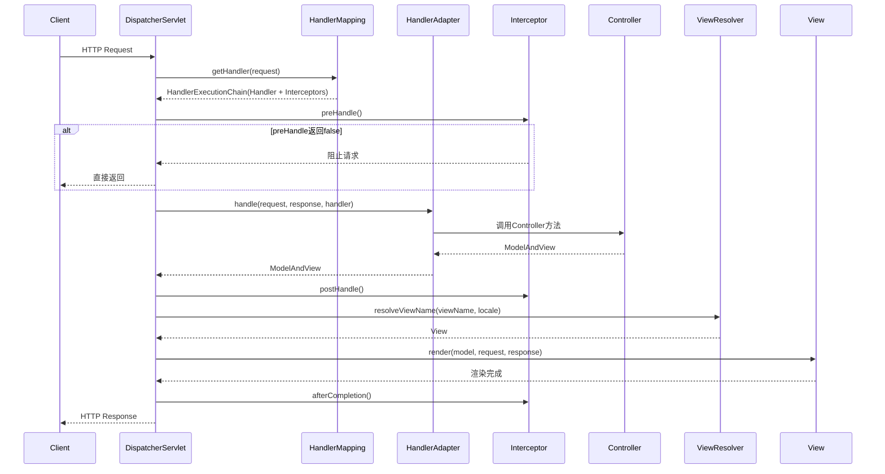

# Spring MVC详解

> 深入理解Spring MVC请求处理流程、核心组件、拦截器、异常处理与RESTful设计

---

## 📋 目录

1. [Spring MVC架构概述](#1-spring-mvc架构概述)
2. [核心组件详解](#2-核心组件详解)
3. [请求处理流程](#3-请求处理流程)
4. [HandlerMapping与HandlerAdapter](#4-handlermapping与handleradapter)
5. [参数解析与数据绑定](#5-参数解析与数据绑定)
6. [拦截器Interceptor](#6-拦截器interceptor)
7. [异常处理ControllerAdvice](#7-异常处理controlleradvice)
8. [视图解析与内容协商](#8-视图解析与内容协商)
9. [RESTful API设计](#9-restful-api设计)
10. [文件上传下载](#10-文件上传下载)
11. [跨域CORS处理](#11-跨域cors处理)
12. [面试题速查](#12-面试题速查)

---

## 1. Spring MVC架构概述

Spring MVC是基于MVC设计模式的Web框架，核心是DispatcherServlet前置控制器模式。

```
Spring MVC架构全景：

                    ┌─────────────────────┐
                    │   DispatcherServlet  │ ← 前端控制器（核心）
                    └──────────┬──────────┘
                               │
           ┌───────────────────┼───────────────────┐
           ▼                   ▼                   ▼
   ┌──────────────┐   ┌──────────────┐   ┌──────────────┐
   │HandlerMapping│   │HandlerAdapter│   │ViewResolver  │
   │  (路由映射)   │   │ (处理器适配)  │   │ (视图解析)    │
   └──────────────┘   └──────────────┘   └──────────────┘
           │                   │
           ▼                   ▼
   ┌──────────────┐   ┌──────────────┐
   │  Controller  │   │HandlerInterceptor│
   │  (业务处理)   │   │  (拦截器链)      │
   └──────────────┘   └──────────────┘
```

### 1.1 核心角色

| 组件 | 作用 | 典型实现 |
|------|------|----------|
| DispatcherServlet | 前端控制器，统一入口 | FrameworkServlet |
| HandlerMapping | 请求→处理器映射 | RequestMappingHandlerMapping |
| HandlerAdapter | 处理器适配执行 | RequestMappingHandlerAdapter |
| HandlerInterceptor | 拦截器（前置/后置/完成） | HandlerInterceptor |
| HandlerExceptionResolver | 异常解析 | ExceptionHandlerExceptionResolver |
| ViewResolver | 视图解析 | InternalResourceViewResolver |
| LocaleResolver | 国际化 | SessionLocaleResolver |
| MultipartResolver | 文件上传 | StandardServletMultipartResolver |

### 1.2 与Servlet的关系

```java
// DispatcherServlet继承关系
DispatcherServlet
    └─ FrameworkServlet
        └─ HttpServletBean
            └─ HttpServlet
                └─ GenericServlet
                    └─ Servlet（接口）

// DispatcherServlet本质上是一个Servlet
// 所有请求统一由DispatcherServlet接收，再分发到具体Controller
```

```xml
<!-- web.xml配置（传统方式） -->
<servlet>
    <servlet-name>dispatcher</servlet-name>
    <servlet-class>org.springframework.web.servlet.DispatcherServlet</servlet-class>
    <init-param>
        <param-name>contextConfigLocation</param-name>
        <param-value>classpath:spring-mvc.xml</param-value>
    </init-param>
    <load-on-startup>1</load-on-startup>
</servlet>
<servlet-mapping>
    <servlet-name>dispatcher</servlet-name>
    <url-pattern>/</url-pattern>
</servlet-mapping>
```

```java
// Spring Boot方式（零配置，自动注册DispatcherServlet）
// 自动配置类：DispatcherServletAutoConfiguration
@SpringBootApplication
public class Application {
    public static void main(String[] args) {
        SpringApplication.run(Application.class, args);
    }
}
// DispatcherServlet自动注册到Servlet容器，映射路径 "/" 
```

---

## 2. 核心组件详解

### 2.1 DispatcherServlet初始化

```java
// DispatcherServlet核心初始化方法
protected void initStrategies(ApplicationContext context) {
    // 初始化九大组件
    initMultipartResolver(context);       // 文件上传解析器
    initLocaleResolver(context);          // 区域解析器
    initThemeResolver(context);           // 主题解析器
    initHandlerMappings(context);         // 处理器映射器
    initHandlerAdapters(context);         // 处理器适配器
    initHandlerExceptionResolvers(context); // 异常解析器
    initRequestToViewNameTranslator(context); // 请求转视图名
    initViewResolvers(context);           // 视图解析器
    initFlashMapManager(context);         // Flash属性管理
}
```

### 2.2 HandlerMapping

```java
// RequestMappingHandlerMapping：处理@RequestMapping注解
@Controller
@RequestMapping("/api/users")
public class UserController {

    @GetMapping("/{id}")
    @ResponseBody
    public User getUser(@PathVariable Long id) {
        return userService.findById(id);
    }

    @PostMapping
    @ResponseBody
    public User createUser(@RequestBody @Valid UserDTO dto) {
        return userService.create(dto);
    }

    @PutMapping("/{id}")
    @ResponseBody
    public User updateUser(@PathVariable Long id, @RequestBody UserDTO dto) {
        return userService.update(id, dto);
    }

    @DeleteMapping("/{id}")
    @ResponseBody
    public void deleteUser(@PathVariable Long id) {
        userService.delete(id);
    }
}
```

### 2.3 HandlerAdapter

```java
// RequestMappingHandlerAdapter：适配@RequestMapping注解方法
// 核心执行流程：
// 1. 调用拦截器 preHandle
// 2. 参数解析（HandlerMethodArgumentResolver）
// 3. 执行Controller方法
// 4. 返回值处理（HandlerMethodReturnValueHandler）
// 5. 调用拦截器 postHandle

// 常用参数解析器：
// - @PathVariable → PathVariableMethodArgumentResolver
// - @RequestParam → RequestParamMethodArgumentResolver
// - @RequestBody → RequestResponseBodyMethodProcessor
// - @ModelAttribute → ModelAttributeMethodProcessor
// - @RequestHeader → RequestHeaderMethodArgumentResolver
// - @CookieValue → ServletCookieValueMethodArgumentResolver
```

---

## 3. 请求处理流程

### 3.1 完整请求流程



### 3.2 源码核心方法

```java
// DispatcherServlet.doDispatch() — 核心分发方法
protected void doDispatch(HttpServletRequest request, HttpServletResponse response) throws Exception {
    HttpServletRequest processedRequest = request;
    HandlerExecutionChain mappedHandler = null;

    try {
        ModelAndView mv = null;
        Exception dispatchException = null;

        try {
            // 1. 文件上传检查
            processedRequest = checkMultipart(request);

            // 2. 获取Handler（含拦截器链）
            mappedHandler = getHandler(processedRequest);
            if (mappedHandler == null) {
                noHandlerFound(processedRequest, response);
                return;
            }

            // 3. 获取HandlerAdapter
            HandlerAdapter ha = getHandlerAdapter(mappedHandler.getHandler());

            // 4. 执行拦截器 preHandle
            if (!mappedHandler.applyPreHandle(processedRequest, response)) {
                return;
            }

            // 5. 执行Controller方法
            mv = ha.handle(processedRequest, response, mappedHandler.getHandler());

            // 6. 设置默认视图名
            applyDefaultViewName(processedRequest, mv);

            // 7. 执行拦截器 postHandle
            mappedHandler.applyPostHandle(processedRequest, response, mv);
        }
        catch (Exception ex) {
            dispatchException = ex;
        }

        // 8. 处理结果（含异常处理、视图渲染）
        processDispatchResult(processedRequest, response, mappedHandler, mv, dispatchException);
    }
    finally {
        // 9. 执行拦截器 afterCompletion
        if (mappedHandler != null) {
            mappedHandler.applyAfterConcurrentHandlingStarted(processedRequest, response);
        }
    }
}
```

---

## 4. HandlerMapping与HandlerAdapter

### 4.1 HandlerMapping体系

```
HandlerMapping
├── AbstractHandlerMapping
│   ├── AbstractHandlerMethodMapping
│   │   └── RequestMappingHandlerMapping  ← 处理@RequestMapping
│   ├── AbstractUrlHandlerMapping
│   │   ├── SimpleUrlHandlerMapping        ← 静态资源映射
│   │   └── BeanNameUrlHandlerMapping      ← Bean名匹配URL
│   └── RouterFunctionMapping              ← 函数式路由（WebFlux兼容）
```

### 4.2 路由匹配规则

```java
// 路由匹配优先级（从高到低）：
// 1. 精确匹配     /api/users/123
// 2. 路径变量匹配  /api/users/{id}
// 3. 通配符匹配   /api/users/*
// 4. 双通配符匹配  /api/**

// Ant路径模式
@Controller
@RequestMapping("/api")
public class ApiController {

    // 精确匹配：GET /api/health
    @GetMapping("/health")
    @ResponseBody
    public String health() { return "OK"; }

    // 路径变量：GET /api/users/123
    @GetMapping("/users/{id}")
    @ResponseBody
    public User getUser(@PathVariable Long id) { ... }

    // 正则约束：GET /api/users/123 (仅数字)
    @GetMapping("/users/{id:[0-9]+}")
    @ResponseBody
    public User getUserNumeric(@PathVariable Long id) { ... }

    // 矩阵变量：GET /api/cars;color=red;year=2024
    @GetMapping("/cars")
    @ResponseBody
    public List<Car> getCars(@MatrixVariable String color, 
                              @MatrixVariable Integer year) { ... }
}
```

---

## 5. 参数解析与数据绑定

### 5.1 常用参数注解

```java
@RestController
@RequestMapping("/api")
public class DemoController {

    // @PathVariable — 路径变量
    @GetMapping("/users/{id}")
    public User getById(@PathVariable("id") Long userId) { ... }

    // @RequestParam — 查询参数
    @GetMapping("/users")
    public Page<User> list(
            @RequestParam(value = "page", defaultValue = "1") int page,
            @RequestParam(value = "size", defaultValue = "10") int size,
            @RequestParam(value = "keyword", required = false) String keyword) { ... }

    // @RequestBody — 请求体JSON
    @PostMapping("/users")
    public User create(@RequestBody @Valid UserDTO dto) { ... }

    // @RequestHeader — 请求头
    @GetMapping("/info")
    public Map<String, String> info(
            @RequestHeader("User-Agent") String userAgent,
            @RequestHeader(value = "X-Token", required = false) String token) { ... }

    // @CookieValue — Cookie
    @GetMapping("/session")
    public String session(@CookieValue("JSESSIONID") String sessionId) { ... }

    // @ModelAttribute — 表单绑定
    @PostMapping("/users/form")
    public User createByForm(@ModelAttribute UserForm form) { ... }

    // HttpServletRequest / HttpServletResponse
    @GetMapping("/raw")
    public String raw(HttpServletRequest request, HttpServletResponse response) {
        String ip = request.getRemoteAddr();
        return ip;
    }

    // Principal — 认证信息
    @GetMapping("/me")
    public String me(Principal principal) {
        return principal.getName();
    }
}
```

### 5.2 自定义参数解析器

```java
// 场景：自动解析当前登录用户
@Target(ElementType.PARAMETER)
@Retention(RetentionPolicy.RUNTIME)
public @interface CurrentUser {
}

// 自定义参数解析器
public class CurrentUserArgumentResolver implements HandlerMethodArgumentResolver {

    @Override
    public boolean supportsParameter(MethodParameter parameter) {
        return parameter.hasParameterAnnotation(CurrentUser.class)
            && parameter.getParameterType().isAssignableFrom(UserInfo.class);
    }

    @Override
    public Object resolveArgument(MethodParameter parameter,
                                   ModelAndViewContainer mavContainer,
                                   NativeWebRequest webRequest,
                                   WebDataBinderFactory binderFactory) {
        HttpServletRequest request = webRequest.getNativeRequest(HttpServletRequest.class);
        String token = request.getHeader("Authorization");
        return userService.parseToken(token); // 解析token返回用户信息
    }
}

// 注册
@Configuration
public class WebConfig implements WebMvcConfigurer {
    @Override
    public void addArgumentResolvers(List<HandlerMethodArgumentResolver> resolvers) {
        resolvers.add(new CurrentUserArgumentResolver());
    }
}

// 使用
@GetMapping("/profile")
public UserInfo profile(@CurrentUser UserInfo user) {
    return user;
}
```

### 5.3 数据校验

```java
// DTO定义
@Data
public class UserDTO {
    @NotBlank(message = "用户名不能为空")
    @Size(min = 3, max = 20, message = "用户名长度3-20")
    private String username;

    @NotBlank(message = "密码不能为空")
    @Pattern(regexp = "^(?=.*[a-z])(?=.*[A-Z])(?=.*\\d).{8,}$", 
             message = "密码至少8位，含大小写字母和数字")
    private String password;

    @Email(message = "邮箱格式错误")
    private String email;

    @Min(value = 18, message = "年龄不能小于18")
    @Max(value = 120, message = "年龄不能超过120")
    private Integer age;
}

// Controller中使用@Valid触发校验
@RestController
public class UserController {

    @PostMapping("/users")
    public User create(@RequestBody @Valid UserDTO dto, 
                       BindingResult result) {
        if (result.hasErrors()) {
            String msg = result.getFieldErrors().stream()
                .map(e -> e.getField() + ": " + e.getDefaultMessage())
                .collect(Collectors.joining("; "));
            throw new ValidationException(msg);
        }
        return userService.create(dto);
    }
}
```

---

## 6. 拦截器Interceptor

### 6.1 拦截器接口

```java
public interface HandlerInterceptor {

    // Controller执行前（返回false则中断）
    default boolean preHandle(HttpServletRequest request, 
                               HttpServletResponse response, 
                               Object handler) throws Exception {
        return true;
    }

    // Controller执行后，视图渲染前
    default void postHandle(HttpServletRequest request,
                             HttpServletResponse response, 
                             Object handler,
                             ModelAndView modelAndView) throws Exception {
    }

    // 请求完成后（视图渲染后，用于资源清理）
    default void afterCompletion(HttpServletRequest request,
                                  HttpServletResponse response,
                                  Object handler, 
                                  Exception ex) throws Exception {
    }
}
```

### 6.2 实战：登录拦截器

```java
@Component
public class LoginInterceptor implements HandlerInterceptor {

    @Override
    public boolean preHandle(HttpServletRequest request, 
                              HttpServletResponse response,
                              Object handler) throws Exception {
        // 静态资源放行
        String uri = request.getRequestURI();
        if (uri.startsWith("/static/") || uri.equals("/login")) {
            return true;
        }

        // 检查token
        String token = request.getHeader("Authorization");
        if (StringUtils.isEmpty(token)) {
            response.setStatus(401);
            response.setContentType("application/json;charset=UTF-8");
            response.getWriter().write("{\"code\":401,\"msg\":\"未登录\"}");
            return false;
        }

        // 验证token
        try {
            UserInfo user = jwtUtil.parseToken(token);
            request.setAttribute("currentUser", user);
            return true;
        } catch (Exception e) {
            response.setStatus(401);
            response.getWriter().write("{\"code\":401,\"msg\":\"token无效\"}");
            return false;
        }
    }

    @Override
    public void afterCompletion(HttpServletRequest request,
                                 HttpServletResponse response,
                                 Object handler, Exception ex) {
        // 清理ThreadLocal
        UserContext.clear();
    }
}
```

### 6.3 注册拦截器

```java
@Configuration
public class WebConfig implements WebMvcConfigurer {

    @Autowired
    private LoginInterceptor loginInterceptor;

    @Override
    public void addInterceptors(InterceptorRegistry registry) {
        registry.addInterceptor(loginInterceptor)
                .addPathPatterns("/api/**")        // 拦截路径
                .excludePathPatterns(               // 排除路径
                    "/api/login",
                    "/api/register",
                    "/api/public/**",
                    "/swagger-ui/**",
                    "/v3/api-docs/**"
                )
                .order(1);                          // 执行顺序
    }
}
```

### 6.4 拦截器 vs Filter

| 维度 | Filter | Interceptor |
|------|--------|-------------|
| 规范 | Servlet规范 | Spring框架 |
| 执行时机 | DispatcherServlet前后 | Controller前后 |
| 依赖 | Servlet容器 | Spring IoC |
| 可获取Handler | 否 | 是 |
| 可中断请求 | 是(chain.doFilter) | 是(preHandle返回false) |
| 执行顺序 | 按注册顺序 | 按order() |

```
请求处理顺序：
Filter#doFilter → DispatcherServlet → Interceptor#preHandle 
→ Controller → Interceptor#postHandle → View渲染 
→ Interceptor#afterCompletion → Filter返回
```

---

## 7. 异常处理ControllerAdvice

### 7.1 全局异常处理

```java
@RestControllerAdvice
public class GlobalExceptionHandler {

    // 业务异常
    @ExceptionHandler(BusinessException.class)
    public ResponseEntity<Result<Void>> handleBusiness(BusinessException e) {
        return ResponseEntity.status(400)
                .body(Result.fail(e.getCode(), e.getMessage()));
    }

    // 参数校验异常
    @ExceptionHandler(MethodArgumentNotValidException.class)
    public ResponseEntity<Result<Void>> handleValidation(MethodArgumentNotValidException e) {
        String msg = e.getBindingResult().getFieldErrors().stream()
                .map(err -> err.getField() + ": " + err.getDefaultMessage())
                .collect(Collectors.joining("; "));
        return ResponseEntity.status(400).body(Result.fail(400, msg));
    }

    // 权限异常
    @ExceptionHandler(AccessDeniedException.class)
    public ResponseEntity<Result<Void>> handleAccessDenied(AccessDeniedException e) {
        return ResponseEntity.status(403).body(Result.fail(403, "无权限"));
    }

    // 兜底异常
    @ExceptionHandler(Exception.class)
    public ResponseEntity<Result<Void>> handleException(Exception e) {
        log.error("系统异常", e);
        return ResponseEntity.status(500).body(Result.fail(500, "系统繁忙"));
    }
}
```

### 7.2 统一返回格式

```java
@Data
@AllArgsConstructor
public class Result<T> {
    private int code;
    private String msg;
    private T data;

    public static <T> Result<T> ok(T data) {
        return new Result<>(200, "success", data);
    }

    public static <T> Result<T> fail(int code, String msg) {
        return new Result<>(code, msg, null);
    }
}

// Controller使用
@RestController
@RequestMapping("/api/users")
public class UserController {

    @GetMapping("/{id}")
    public Result<User> getUser(@PathVariable Long id) {
        return Result.ok(userService.findById(id));
    }
}
```

---

## 8. 视图解析与内容协商

### 8.1 内容协商

```java
// Spring Boot自动配置内容协商
// 同一URL根据Accept头返回不同格式：
// Accept: application/json → JSON响应
// Accept: application/xml  → XML响应
// Accept: text/html        → HTML视图

@RestController  // = @Controller + @ResponseBody（所有方法返回JSON）
public class ApiController {
    @GetMapping("/users/{id}")
    public User getUser(@PathVariable Long id) {
        return userService.findById(id);  // 自动序列化为JSON
    }
}

// 配置JSON/XML
@Configuration
public class WebConfig implements WebMvcConfigurer {
    @Override
    public void configureMessageConverters(List<HttpMessageConverter<?>> converters) {
        // Jackson JSON（默认已配置）
        converters.add(new MappingJackson2HttpMessageConverter());
        // Jackson XML
        converters.add(new MappingJackson2XmlHttpMessageConverter());
    }
}
```

---

## 9. RESTful API设计

### 9.1 RESTful规范

```
HTTP方法语义：
  GET    /api/users      → 查询用户列表（幂等）
  GET    /api/users/123  → 查询单个用户（幂等）
  POST   /api/users      → 创建用户（非幂等）
  PUT    /api/users/123  → 更新用户（全量，幂等）
  PATCH  /api/users/123  → 更新用户（部分，幂等）
  DELETE /api/users/123  → 删除用户（幂等）

HTTP状态码：
  200 OK              → 请求成功
  201 Created         → 资源创建成功
  204 No Content      → 删除成功（无返回体）
  400 Bad Request     → 参数错误
  401 Unauthorized    → 未认证
  403 Forbidden       → 无权限
  404 Not Found       → 资源不存在
  500 Internal Error  → 服务器错误
```

### 9.2 完整RESTful Controller

```java
@RestController
@RequestMapping("/api/users")
@Tag(name = "用户管理", description = "用户CRUD接口")
public class UserController {

    @Autowired
    private UserService userService;

    @GetMapping
    @Operation(summary = "分页查询用户")
    public Result<Page<User>> list(
            @RequestParam(defaultValue = "1") int page,
            @RequestParam(defaultValue = "10") int size,
            @RequestParam(required = false) String keyword) {
        return Result.ok(userService.list(page, size, keyword));
    }

    @GetMapping("/{id}")
    @Operation(summary = "查询用户详情")
    public Result<User> getById(@PathVariable Long id) {
        return Result.ok(userService.findById(id));
    }

    @PostMapping
    @Operation(summary = "创建用户")
    public Result<User> create(@RequestBody @Valid UserDTO dto) {
        return Result.ok(userService.create(dto));
    }

    @PutMapping("/{id}")
    @Operation(summary = "更新用户")
    public Result<User> update(@PathVariable Long id, 
                                @RequestBody @Valid UserDTO dto) {
        return Result.ok(userService.update(id, dto));
    }

    @DeleteMapping("/{id}")
    @Operation(summary = "删除用户")
    @ResponseStatus(HttpStatus.NO_CONTENT)
    public void delete(@PathVariable Long id) {
        userService.delete(id);
    }
}
```

---

## 10. 文件上传下载

### 10.1 文件上传

```java
// application.yml配置
// spring:
//   servlet:
//     multipart:
//       max-file-size: 10MB
//       max-request-size: 100MB

@RestController
@RequestMapping("/api/files")
public class FileController {

    @PostMapping("/upload")
    public Result<String> upload(@RequestParam("file") MultipartFile file) {
        if (file.isEmpty()) {
            throw new BusinessException("文件不能为空");
        }

        String originalName = file.getOriginalFilename();
        String ext = originalName.substring(originalName.lastIndexOf("."));
        String fileName = UUID.randomUUID() + ext;
        String filePath = "/uploads/" + fileName;

        try {
            file.transferTo(new File(filePath));
            return Result.ok("/uploads/" + fileName);
        } catch (IOException e) {
            throw new BusinessException("文件上传失败: " + e.getMessage());
        }
    }

    // 多文件上传
    @PostMapping("/uploads")
    public Result<List<String>> uploads(@RequestParam("files") MultipartFile[] files) {
        List<String> urls = new ArrayList<>();
        for (MultipartFile file : files) {
            urls.add(saveFile(file));
        }
        return Result.ok(urls);
    }
}
```

### 10.2 文件下载

```java
@GetMapping("/download/{fileName}")
public void download(@PathVariable String fileName, 
                      HttpServletResponse response) throws IOException {
    File file = new File("/uploads/" + fileName);
    if (!file.exists()) {
        throw new BusinessException("文件不存在");
    }

    response.setContentType("application/octet-stream");
    response.setHeader("Content-Disposition", 
            "attachment; filename=\"" + URLEncoder.encode(fileName, "UTF-8") + "\"");
    response.setContentLengthLong(file.length());

    try (InputStream is = new FileInputStream(file);
         OutputStream os = response.getOutputStream()) {
        byte[] buffer = new byte[8192];
        int len;
        while ((len = is.read(buffer)) != -1) {
            os.write(buffer, 0, len);
        }
        os.flush();
    }
}
```

---

## 11. 跨域CORS处理

### 11.1 方式一：注解方式

```java
@CrossOrigin(origins = "http://localhost:3000", maxAge = 3600)
@RestController
@RequestMapping("/api")
public class ApiController {

    @CrossOrigin(origins = "http://localhost:3000")
    @GetMapping("/users")
    public List<User> list() { ... }
}
```

### 11.2 方式二：全局配置

```java
@Configuration
public class WebConfig implements WebMvcConfigurer {

    @Override
    public void addCorsMappings(CorsRegistry registry) {
        registry.addMapping("/api/**")
                .allowedOrigins("http://localhost:3000", "http://localhost:8080")
                .allowedMethods("GET", "POST", "PUT", "DELETE", "OPTIONS")
                .allowedHeaders("*")
                .allowCredentials(true)
                .maxAge(3600);
    }
}
```

### 11.3 方式三：Filter方式（推荐微服务场景）

```java
@Component
@Order(Ordered.HIGHEST_PRECEDENCE)
public class CorsFilter implements Filter {

    @Override
    public void doFilter(ServletRequest req, ServletResponse res, FilterChain chain)
            throws IOException, ServletException {
        HttpServletResponse response = (HttpServletResponse) res;
        HttpServletRequest request = (HttpServletRequest) req;

        response.setHeader("Access-Control-Allow-Origin", request.getHeader("Origin"));
        response.setHeader("Access-Control-Allow-Credentials", "true");
        response.setHeader("Access-Control-Allow-Methods", "GET, POST, PUT, DELETE, OPTIONS");
        response.setHeader("Access-Control-Allow-Headers", 
                "Origin, Content-Type, Accept, Authorization, X-Token");
        response.setHeader("Access-Control-Max-Age", "3600");

        if ("OPTIONS".equalsIgnoreCase(request.getMethod())) {
            response.setStatus(HttpServletResponse.SC_OK);
        } else {
            chain.doFilter(req, res);
        }
    }
}
```

---

## 12. 面试题速查

**Q1: Spring MVC的请求处理流程？**

```
1. 客户端发送请求到DispatcherServlet
2. DispatcherServlet调用HandlerMapping获取HandlerExecutionChain
3. 执行拦截器链的preHandle
4. DispatcherServlet调用HandlerAdapter执行Controller
5. Controller返回ModelAndView
6. 执行拦截器链的postHandle
7. ViewResolver解析视图
8. View渲染并返回响应
9. 执行拦截器链的afterCompletion
```

**Q2: @Controller和@RestController的区别？**
```
@Controller     — 返回视图名，需要配合模板引擎
@RestController — @Controller + @ResponseBody，返回JSON/XML
```

**Q3: 拦截器和Filter的区别？**
```
1. Filter是Servlet规范，Interceptor是Spring框架
2. Filter在DispatcherServlet前后执行，Interceptor在Controller前后执行
3. Interceptor可以访问Handler和ModelAndView，Filter不能
4. Interceptor通过IoC注入依赖更方便
```

**Q4: @PathVariable和@RequestParam的区别？**
```
@PathVariable — 从URL路径中提取变量 /users/{id}
@RequestParam — 从查询参数或表单中提取 /users?id=123
```

**Q5: Spring MVC如何处理异常？**
```
1. 抛出到DispatcherServlet
2. HandlerExceptionResolver解析异常
3. @ExceptionHandler匹配异常类型
4. @ControllerAdvice统一处理全局异常
5. 返回错误响应
```

**Q6: 同一个URL如何返回JSON和HTML？**
```
通过内容协商（Content Negotiation）：
1. 请求头Accept: application/json → 返回JSON
2. 请求头Accept: text/html → 返回HTML视图
3. 也可通过format参数 ?format=json
```

---

*最后更新：2026-07-13*
