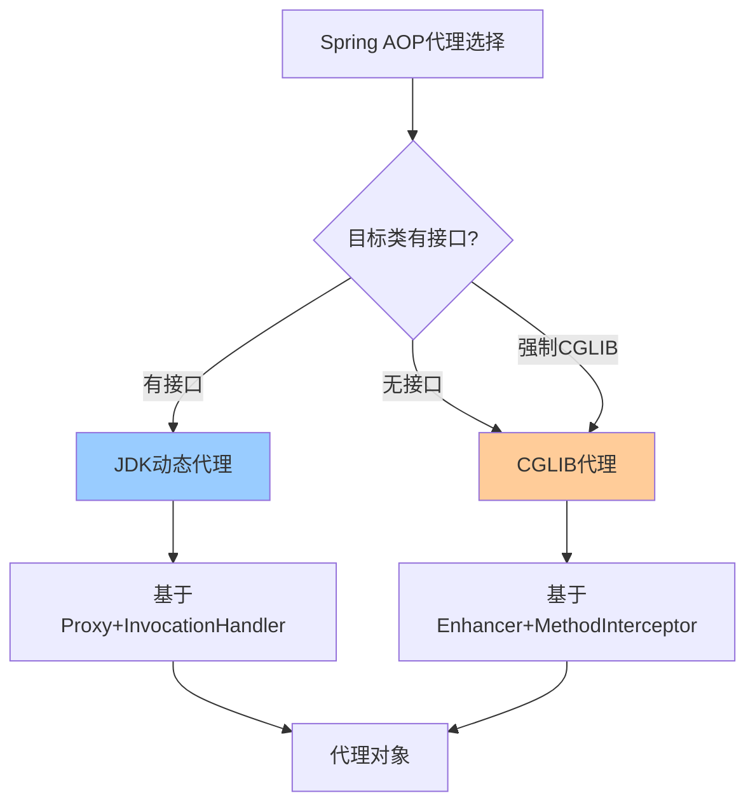

# Spring AOP详解

> 深入理解AOP核心概念、动态代理机制、@AspectJ注解编程与实战应用

---

## 📋 目录

1. [AOP核心概念](#1-aop核心概念)
2. [动态代理机制](#2-动态代理机制)
3. [@AspectJ注解编程](#3-aspectj注解编程)
4. [五种通知类型详解](#4-五种通知类型详解)
5. [切点表达式详解](#5-切点表达式详解)
6. [多切面执行顺序](#6-多切面执行顺序)
7. [AOP实战场景](#7-aop实战场景)
8. [AOP性能考量](#8-aop性能考量)
9. [面试题速查](#9-面试题速查)

---

## 1. AOP核心概念

AOP（Aspect-Oriented Programming，面向切面编程）通过将横切关注点（日志、事务、安全等）从业务逻辑中分离出来，实现代码的模块化。

### 1.1 核心术语

```
AOP核心概念关系图：

    ┌──────────────────────────────────────────┐
    │              Aspect (切面)                 │
    │  ┌─────────────┐  ┌──────────────────┐   │
    │  │ Pointcut     │  │ Advice (通知)    │   │
    │  │ (切点:在哪切) │  │ (通知:做什么)     │   │
    │  └──────┬──────┘  └────────┬─────────┘   │
    │         │                   │              │
    │         └───────┬───────────┘              │
    │           JoinPoint                          │
    │         (连接点:何时切)                       │
    └──────────────────────────────────────────┘
                        │
                        ▼
              Target (目标对象)
              Weaving (织入)
              Proxy (代理对象)
```

| 术语 | 说明 | 示例 |
|------|------|------|
| Aspect（切面） | 横切关注点的模块化 | 日志切面、事务切面 |
| JoinPoint（连接点） | 程序执行中的某个点 | 方法调用、异常抛出 |
| Pointcut（切点） | 连接点的筛选条件 | execution(* com.example.service.*.*(..)) |
| Advice（通知） | 在切点执行的动作 | @Before、@After、@Around |
| Target（目标对象） | 被代理的原始对象 | UserService |
| Weaving（织入） | 将切面应用到目标的过程 | 编译时/类加载时/运行时 |
| Proxy（代理对象） | 织入切面后生成的对象 | CGLIB/JDK动态代理 |

### 1.2 横切关注点

```
没有AOP时：
┌────────────────────────────────────┐
│ UserService.createUser()            │
│   ├─ log.info("开始创建用户")        │  ← 日志
│   ├─ checkPermission()              │  ← 权限
│   ├─ beginTransaction()             │  ← 事务
│   ├─ === 业务逻辑 ===               │
│   ├─ commitTransaction()            │  ← 事务
│   └─ log.info("创建用户完成")        │  ← 日志
└────────────────────────────────────┘

使用AOP后：
┌────────────────────────────────────┐
│ UserService.createUser()            │
│   └─ === 纯业务逻辑 ===             │  ← 干净！
└────────────────────────────────────┘
  ↑ 日志切面自动织入
  ↑ 权限切面自动织入
  ↑ 事务切面自动织入
```

---

## 2. 动态代理机制

### 2.1 JDK动态代理 vs CGLIB代理

| 维度 | JDK动态代理 | CGLIB代理 |
|------|------------|-----------|
| 原理 | 基于接口 | 基于子类继承 |
| 要求 | 目标类必须实现接口 | 目标类不能是final |
| 性能 | 创建快，执行稍慢 | 创建慢，执行快 |
| Spring默认 | 有接口时使用 | 无接口时使用 |



### 2.2 JDK动态代理实现

```java
// 接口
public interface UserService {
    User findById(Long id);
    void save(User user);
}

// 实现类（目标对象）
public class UserServiceImpl implements UserService {
    @Override
    public User findById(Long id) {
        return new User(id, "user" + id);
    }

    @Override
    public void save(User user) {
        System.out.println("保存用户: " + user);
    }
}

// JDK动态代理
public class JdkProxyFactory implements InvocationHandler {

    private final Object target;

    public JdkProxyFactory(Object target) {
        this.target = target;
    }

    @SuppressWarnings("unchecked")
    public <T> T getProxy() {
        return (T) Proxy.newProxyInstance(
                target.getClass().getClassLoader(),
                target.getClass().getInterfaces(),
                this
        );
    }

    @Override
    public Object invoke(Object proxy, Method method, Object[] args) throws Throwable {
        System.out.println("[日志] 方法开始: " + method.getName());

        long start = System.currentTimeMillis();
        try {
            Object result = method.invoke(target, args);
            long cost = System.currentTimeMillis() - start;
            System.out.println("[日志] 方法结束: " + method.getName() + " 耗时" + cost + "ms");
            return result;
        } catch (Exception e) {
            System.out.println("[日志] 方法异常: " + method.getName() + " " + e.getMessage());
            throw e;
        }
    }
}

// 使用
UserService proxy = new JdkProxyFactory(new UserServiceImpl()).getProxy();
proxy.findById(1L);
// 输出：
// [日志] 方法开始: findById
// [日志] 方法结束: findById 耗时2ms
```

### 2.3 CGLIB代理实现

```java
// 目标类（无需接口）
public class OrderService {
    public Order createOrder(Long userId, String product) {
        return new Order(userId, product);
    }
}

// CGLIB代理
public class CglibProxyFactory implements MethodInterceptor {

    @SuppressWarnings("unchecked")
    public <T> T getProxy(Class<T> targetClass) {
        Enhancer enhancer = new Enhancer();
        enhancer.setSuperclass(targetClass);
        enhancer.setCallback(this);
        return (T) enhancer.create();
    }

    @Override
    public Object intercept(Object obj, Method method, Object[] args,
                             MethodProxy methodProxy) throws Throwable {
        System.out.println("[CGLIB] 方法开始: " + method.getName());
        Object result = methodProxy.invokeSuper(obj, args);
        System.out.println("[CGLIB] 方法结束: " + method.getName());
        return result;
    }
}

// 使用
OrderService proxy = new CglibProxyFactory().getProxy(OrderService.class);
proxy.createOrder(1L, "iPhone");
```

### 2.4 Spring强制使用CGLIB

```java
// 方式一：注解配置
@Configuration
@EnableAspectJAutoProxy(proxyTargetClass = true)  // 强制CGLIB
public class AppConfig { }

// 方式二：Spring Boot 2.x+默认CGLIB
// Spring Boot 2.x之后默认proxyTargetClass=true
```

---

## 3. @AspectJ注解编程

### 3.1 开启AOP

```java
// 方式一：注解
@Configuration
@EnableAspectJAutoProxy
public class AppConfig { }

// 方式二：Spring Boot自动配置
// 引入spring-boot-starter-aop依赖即可自动开启
```

### 3.2 定义切面

```java
@Aspect       // 声明为切面
@Component    // 注册到Spring容器
@Order(1)     // 切面执行顺序（值越小优先级越高）
public class LogAspect {

    // 切点定义（可复用）
    @Pointcut("execution(* com.example.service.*.*(..))")
    public void servicePointcut() {}

    // 引用切点
    @Before("servicePointcut()")
    public void beforeLog(JoinPoint jp) {
        String method = jp.getSignature().getDeclaringTypeName() + "." + jp.getSignature().getName();
        Object[] args = jp.getArgs();
        log.info("[BEFORE] {} args={}", method, Arrays.toString(args));
    }

    @AfterReturning(pointcut = "servicePointcut()", returning = "result")
    public void afterReturnLog(JoinPoint jp, Object result) {
        String method = jp.getSignature().getName();
        log.info("[AFTER_RETURNING] {} result={}", method, result);
    }

    @AfterThrowing(pointcut = "servicePointcut()", throwing = "ex")
    public void afterThrowLog(JoinPoint jp, Exception ex) {
        String method = jp.getSignature().getName();
        log.error("[AFTER_THROWING] {} exception={}", method, ex.getMessage());
    }
}
```

---

## 4. 五种通知类型详解

### 4.1 五种通知对比

| 通知类型 | 注解 | 执行时机 | 能否中断 | 能获取返回值 | 能获取异常 |
|----------|------|----------|----------|------------|------------|
| 前置通知 | @Before | 方法执行前 | 否 | 否 | 否 |
| 后置通知 | @After | 方法执行后（finally） | 否 | 否 | 否 |
| 返回通知 | @AfterReturning | 方法正常返回后 | 否 | 是 | 否 |
| 异常通知 | @AfterThrowing | 方法抛出异常后 | 否 | 否 | 是 |
| 环绕通知 | @Around | 方法执行前后 | 是 | 是 | 是 |

### 4.2 执行顺序

```
正常情况：
  @Around(前半部分)
    → @Before
      → 目标方法执行
    → @AfterReturning
  @Around(后半部分)
  → @After

异常情况：
  @Around(前半部分)
    → @Before
      → 目标方法抛出异常
    → @AfterThrowing
  @After（finally，一定执行）
```

### 4.3 环绕通知（最强大）

```java
@Aspect
@Component
public class PerformanceAspect {

    @Around("execution(* com.example.service.*.*(..))")
    public Object measureTime(ProceedingJoinPoint pjp) throws Throwable {
        String className = pjp.getTarget().getClass().getSimpleName();
        String methodName = pjp.getSignature().getName();
        Object[] args = pjp.getArgs();

        long start = System.currentTimeMillis();
        log.info("[START] {}.{} args={}", className, methodName, Arrays.toString(args));

        try {
            // 执行目标方法
            Object result = pjp.proceed();

            long cost = System.currentTimeMillis() - start;
            log.info("[END] {}.{} cost={}ms result={}", className, methodName, cost, result);
            return result;

        } catch (Throwable e) {
            long cost = System.currentTimeMillis() - start;
            log.error("[ERROR] {}.{} cost={}ms exception={}", className, methodName, cost, e.getMessage());
            throw e;
        }
    }
}
```

### 4.4 获取方法注解信息

```java
@Aspect
@Component
public class AnnotationAspect {

    // 拦截带有@Log注解的方法
    @Around("@annotation(logAnnotation)")
    public Object aroundLog(ProceedingJoinPoint pjp, Log logAnnotation) throws Throwable {
        // 获取注解属性
        String operation = logAnnotation.value();
        String module = logAnnotation.module();

        log.info("操作: {}, 模块: {}", operation, module);

        // 获取方法信息
        MethodSignature signature = (MethodSignature) pjp.getSignature();
        Method method = signature.getMethod();
        String methodName = method.getDeclaringClass().getSimpleName() + "." + method.getName();

        // 获取参数
        String[] paramNames = signature.getParameterNames();
        Object[] args = pjp.getArgs();
        for (int i = 0; i < args.length; i++) {
            log.info("参数 {} = {}", paramNames[i], args[i]);
        }

        long start = System.currentTimeMillis();
        Object result = pjp.proceed();
        long cost = System.currentTimeMillis() - start;

        // 记录操作日志到数据库
        operationLogService.save(OperationLog.builder()
                .operation(operation)
                .method(methodName)
                .params(JsonUtils.toJson(args))
                .result(JsonUtils.toJson(result))
                .costMs(cost)
                .build());

        return result;
    }
}

// 自定义注解
@Target(ElementType.METHOD)
@Retention(RetentionPolicy.RUNTIME)
public @interface Log {
    String value() default "";
    String module() default "";
}

// 使用
@RestController
public class UserController {
    @Log(value = "创建用户", module = "用户管理")
    @PostMapping("/users")
    public User create(@RequestBody UserDTO dto) {
        return userService.create(dto);
    }
}
```

---

## 5. 切点表达式详解

### 5.1 execution表达式

```
execution语法：
execution(修饰符? 返回类型 包名.类名.方法名(参数类型) 异常?)

示例：
execution(public * com.example.service.*.*(..))
  │         │    │                     │ │  └─ 任意参数
  │         │    │                     │ └─ 任意方法名
  │         │    │                     └─ 任意类（service包下）
  │         │    └─ com.example.service包
  │         └─ 任意返回类型
  └─ public修饰符（可选）

常用模式：
execution(* com.example..*.*(..))          // com.example及子包所有方法
execution(public * *(..))                   // 所有public方法
execution(* save*(..))                      // 所有save开头的方法
execution(* com.example.service.UserService.*(..))  // UserService所有方法
execution(* *(String, ..))                  // 第一个参数为String的方法
```

### 5.2 其他切点指示器

```java
// within — 匹配类级别
@Pointcut("within(com.example.service..*)")
public void withinService() {}

// args — 匹配参数类型
@Pointcut("args(java.lang.String, ..)")
public void firstArgString() {}

// @annotation — 匹配带有特定注解的方法
@Pointcut("@annotation(org.springframework.transaction.annotation.Transactional)")
public void transactionalMethod() {}

// @within — 匹配带有特定注解的类
@Pointcut("@within(org.springframework.stereotype.Service)")
public void serviceClass() {}

// @target — 运行时目标对象有特定注解
@Pointcut("@target(org.springframework.stereotype.Repository)")
public void repositoryBean() {}

// @args — 参数有特定注解
@Pointcut("@args(com.example.annotation.Validated)")
public void validatedArg() {}

// bean — Spring Bean名称匹配
@Pointcut("bean(userService)")
public void userServiceBean() {}

// 组合切点
@Pointcut("servicePointcut() && !execution(* *.toString())")
public void serviceWithoutToString() {}
```

### 5.3 切点组合

```java
@Aspect
@Component
public class CombinedAspect {

    // &&（与）
    @Pointcut("within(com.example.service..*) && @annotation(org.springframework.transaction.annotation.Transactional)")
    public void serviceTransactional() {}

    // ||（或）
    @Pointcut("execution(* save*(..)) || execution(* update*(..)) || execution(* delete*(..))")
    public void writeOperation() {}

    // !（非）
    @Pointcut("servicePointcut() && !isGetter()")
    public void serviceWithoutGetter() {}

    @Pointcut("execution(* get*())")
    public void isGetter() {}
}
```

---

## 6. 多切面执行顺序

### 6.1 多切面场景

```java
// 日志切面（Order=1）
@Aspect
@Component
@Order(1)
public class LogAspect {
    @Before("servicePointcut()")
    public void before() { log.info("LogAspect before"); }
    @After("servicePointcut()")
    public void after() { log.info("LogAspect after"); }
}

// 事务切面（Order=2）
@Aspect
@Component
@Order(2)
public class TransactionAspect {
    @Before("servicePointcut()")
    public void before() { log.info("TransactionAspect before"); }
    @After("servicePointcut()")
    public void after() { log.info("TransactionAspect after"); }
}

// 权限切面（Order=3）
@Aspect
@Component
@Order(3)
public class SecurityAspect {
    @Before("servicePointcut()")
    public void before() { log.info("SecurityAspect before"); }
    @After("servicePointcut()")
    public void after() { log.info("SecurityAspect after"); }
}
```

### 6.2 执行顺序（洋葱模型）

```
请求 →
  ┌─ LogAspect.before (Order=1)
  │   ┌─ TransactionAspect.before (Order=2)
  │   │   ┌─ SecurityAspect.before (Order=3)
  │   │   │   ┌─ 目标方法执行 ─────────────────┐
  │   │   │   └────────────────────────────────┘
  │   │   └─ SecurityAspect.after (Order=3)
  │   └─ TransactionAspect.after (Order=2)
  └─ LogAspect.after (Order=1)
← 响应

@Around 等效于洋葱：
  Outer@Around.proceed前 → Inner@Around.proceed前 → 目标方法 → Inner@Around.proceed后 → Outer@Around.proceed后
```

### 6.3 同一切面内通知顺序

```
同一Aspect内通知执行顺序（Spring 5.2.7+）：
  @Around(前) → @Before → 目标方法 → @AfterReturning/@AfterThrowing → @After → @Around(后)

注意：@After 总是在 @AfterReturning/@AfterThrowing 之后执行
```

---

## 7. AOP实战场景

### 7.1 日志切面

```java
@Aspect
@Component
@Slf4j
public class LogAspect {

    @Around("@annotation(com.example.annotation.OperationLog)")
    public Object recordLog(ProceedingJoinPoint pjp) throws Throwable {
        MethodSignature signature = (MethodSignature) pjp.getSignature();
        Method method = signature.getMethod();
        OperationLog annotation = method.getAnnotation(OperationLog.class);

        long start = System.currentTimeMillis();
        Object result = pjp.proceed();
        long cost = System.currentTimeMillis() - start;

        // 异步记录操作日志
        CompletableFuture.runAsync(() -> {
            SysLog sysLog = new SysLog();
            sysLog.setModule(annotation.module());
            sysLog.setOperation(annotation.value());
            sysLog.setMethod(method.getDeclaringClass().getName() + "." + method.getName());
            sysLog.setParams(JsonUtils.toJson(pjp.getArgs()));
            sysLog.setResult(JsonUtils.toJson(result));
            sysLog.setCostMs(cost);
            sysLog.setOperator(UserContext.getCurrentUsername());
            sysLog.setIp(IpUtils.getClientIp());
            sysLog.setCreateTime(new Date());
            sysLogService.save(sysLog);
        });

        return result;
    }
}
```

### 7.2 性能监控切面

```java
@Aspect
@Component
@Slf4j
public class PerformanceAspect {

    private static final long SLOW_THRESHOLD = 1000; // 1秒

    @Around("@within(org.springframework.stereotype.Service)")
    public Object monitor(ProceedingJoinPoint pjp) throws Throwable {
        long start = System.currentTimeMillis();
        try {
            return pjp.proceed();
        } finally {
            long cost = System.currentTimeMillis() - start;
            String method = pjp.getSignature().getDeclaringTypeName() + "." + pjp.getSignature().getName();
            if (cost > SLOW_THRESHOLD) {
                log.warn("[慢方法] {} 耗时{}ms, 参数={}", method, cost, Arrays.toString(pjp.getArgs()));
                // 上报到监控系统
                metricsService.recordSlowMethod(method, cost);
            }
        }
    }
}
```

### 7.3 限流切面

```java
@Aspect
@Component
public class RateLimitAspect {

    @Autowired
    private RedisTemplate<String, String> redisTemplate;

    @Around("@annotation(rateLimit)")
    public Object limit(ProceedingJoinPoint pjp, RateLimit rateLimit) throws Throwable {
        String key = "rate_limit:" + pjp.getSignature().toShortString();
        int max = rateLimit.maxRequests();
        int window = rateLimit.windowSeconds();

        // Redis滑动窗口限流
        Long count = redisTemplate.opsForValue().increment(key);
        if (count == 1) {
            redisTemplate.expire(key, window, TimeUnit.SECONDS);
        }
        if (count > max) {
            throw new RateLimitException("请求过于频繁，请稍后重试");
        }

        return pjp.proceed();
    }
}

// 使用
@RateLimit(maxRequests = 10, windowSeconds = 1)
@PostMapping("/sendSms")
public Result<Void> sendSms(@RequestParam String phone) { ... }
```

### 7.4 权限校验切面

```java
@Aspect
@Component
public class PermissionAspect {

    @Around("@annotation(requirePermission)")
    public Object checkPermission(ProceedingJoinPoint pjp, RequirePermission requirePermission) throws Throwable {
        UserInfo currentUser = UserContext.getCurrentUser();
        if (currentUser == null) {
            throw new UnauthorizedException("未登录");
        }

        String permission = requirePermission.value();
        if (!currentUser.hasPermission(permission)) {
            throw new ForbiddenException("无权限: " + permission);
        }

        return pjp.proceed();
    }
}

// 使用
@RequirePermission("user:delete")
@DeleteMapping("/{id}")
public Result<Void> delete(@PathVariable Long id) { ... }
```

---

## 8. AOP性能考量

### 8.1 代理创建性能

```
JDK动态代理：
  创建速度：快（基于反射）
  执行速度：稍慢（每次调用走InvocationHandler）
  内存占用：低

CGLIB代理：
  创建速度：慢（生成字节码）
  执行速度：快（直接方法调用）
  内存占用：高（生成代理类字节码）
```

### 8.2 切点匹配优化

```java
// ✅ 好：精确的切点表达式
@Pointcut("execution(* com.example.service.UserService.*(..))")

// ❌ 差：过于宽泛，影响性能
@Pointcut("execution(* *(..))")

// ✅ 好：使用注解匹配，范围可控
@Pointcut("@annotation(com.example.annotation.Log)")

// 性能优化建议：
// 1. 避免过于宽泛的切点
// 2. Spring启动时已完成切点匹配，运行时无匹配开销
// 3. 切点表达式越精确，启动时匹配越快
```

### 8.3 代理失效场景

```java
// ❌ 内部方法调用不走代理（经典坑）
@Service
public class OrderService {

    public void createOrder(Order order) {
        // 内部调用，不经过代理，AOP不生效
        this.sendNotification(order);
    }

    @Log("发送通知")
    public void sendNotification(Order order) {
        // 此处切面不会执行！
    }
}

// ✅ 解决方案一：注入自身代理
@Service
public class OrderService {

    @Autowired
    @Lazy
    private OrderService self;  // 注入代理对象

    public void createOrder(Order order) {
        self.sendNotification(order);  // 通过代理调用
    }

    @Log("发送通知")
    public void sendNotification(Order order) { ... }
}

// ✅ 解决方案二：通过AopContext获取当前代理
@Service
public class OrderService {

    public void createOrder(Order order) {
        ((OrderService) AopContext.currentProxy()).sendNotification(order);
    }

    @Log("发送通知")
    public void sendNotification(Order order) { ... }
}
// 需要配置：@EnableAspectJAutoProxy(exposeProxy = true)
```

---

## 9. 面试题速查

**Q1: Spring AOP使用JDK代理还是CGLIB代理？**
```
默认策略：
- 目标类有接口 → JDK动态代理
- 目标类无接口 → CGLIB代理
- Spring Boot 2.x+默认proxyTargetClass=true → 强制CGLIB
可通过 @EnableAspectJAutoProxy(proxyTargetClass=true) 强制CGLIB
```

**Q2: Spring AOP和AspectJ的区别？**
```
Spring AOP:
  - 运行时织入（动态代理）
  - 只支持方法级连接点
  - 性能略低，但使用简单

AspectJ:
  - 编译时/加载时织入（字节码增强）
  - 支持字段、构造器、方法级连接点
  - 性能更高，但配置复杂
```

**Q3: 五种通知的执行顺序？**
```
正常：@Around前 → @Before → 目标方法 → @AfterReturning → @After → @Around后
异常：@Around前 → @Before → 目标方法 → @AfterThrowing → @After → @Around后
注意：@After相当于finally，始终执行
```

**Q4: @Transactional失效的根本原因？**
```
AOP代理失效导致：
1. 同类内部方法调用（不经过代理）
2. 方法不是public（CGLIB/JDK代理只代理public方法）
3. 异常被catch吞掉（@AfterThrowing无法感知）
4. 异常类型不匹配（默认只回滚RuntimeException）
5. 类没有被Spring管理（没有代理对象）
```

**Q5: 环绕通知为什么是最强大的？**
```
@Around可以：
1. 控制目标方法是否执行（proceed()）
2. 控制执行前后的逻辑
3. 修改方法参数
4. 修改返回值
5. 处理异常
6. 完全替代@Before + @After + @AfterReturning + @AfterThrowing
```

**Q6: 多个切面的执行顺序如何控制？**
```
通过@Order注解控制：
- @Order(1) 先执行pre、后执行post（洋葱模型）
- 数字越小，优先级越高（外层）
- @Around的proceed()是洋葱的分界点
```

---

*最后更新：2026-07-13*
