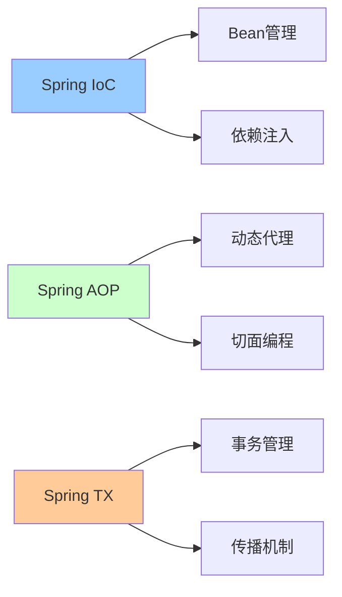
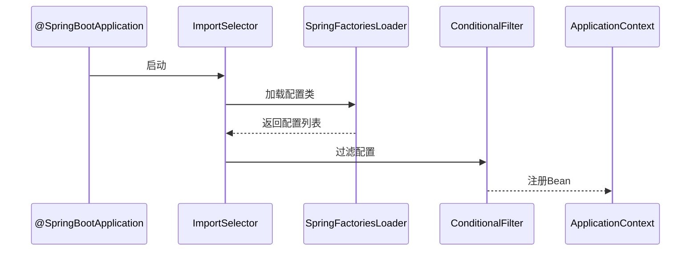
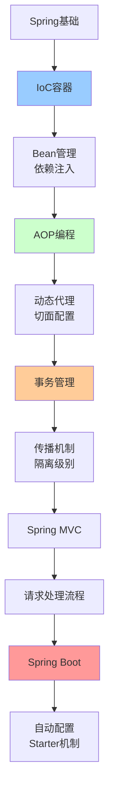

# Spring生态详解

> 深入理解Spring框架核心机制与Spring Boot原理

---

## 📋 文档列表

### 1. Spring核心源码解析 ⭐ 推荐
📄 [Spring核心源码解析.md](./Spring核心源码解析.md)

**核心内容**：
- ✅ **Spring IoC容器**：Bean定义、依赖注入、容器初始化流程
- ✅ **Spring AOP原理**：动态代理、切面编程、通知类型
- ✅ **Spring事务管理**：传播机制、隔离级别、事务实现原理
- ✅ **Spring MVC原理**：DispatcherServlet工作流程、请求处理
- ✅ **Bean生命周期**：完整的11步生命周期回调
- ✅ **常见问题解决**：循环依赖、事务失效、性能优化

**架构图**：


**适合场景**：
- Spring源码学习
- 面试准备
- 框架原理理解
- 问题排查

---

### 2. Spring Boot核心原理 ⭐ 推荐
📄 [Spring Boot核心原理.md](./Spring Boot核心原理.md)

**核心内容**：
- ✅ **自动配置原理**：@SpringBootApplication、Conditional装配
- ✅ **启动流程解析**：SpringApplication执行流程、Environment准备
- ✅ **Starter机制**：自定义Starter、依赖管理
- ✅ **配置管理**：Profile环境、配置优先级、配置加密
- ✅ **监控与管理**：Actuator端点、自定义监控、Prometheus集成
- ✅ **常见问题解决**：启动失败、配置不生效、性能优化

**自动配置流程**：


**适合场景**：
- Spring Boot开发
- 微服务架构
- 快速开发
- 自动配置理解

---

## 🎯 学习路径



**推荐顺序**：
1. 先学习《Spring核心源码解析》，理解Spring原理
2. 再学习《Spring Boot核心原理》，掌握快速开发
3. 结合实际项目应用

---

## 💡 核心知识点速查

### Spring IoC相关

**Q1: IoC容器初始化流程是怎样的？**
```
1. prepareRefresh() - 准备刷新
2. obtainFreshBeanFactory() - 获取BeanFactory
3. prepareBeanFactory() - 配置BeanFactory
4. postProcessBeanFactory() - 后置处理
5. invokeBeanFactoryPostProcessors() - 调用工厂后置处理器
6. registerBeanPostProcessors() - 注册Bean后置处理器
7. initMessageSource() - 初始化消息源
8. initApplicationEventMulticaster() - 初始化事件广播器
9. onRefresh() - 刷新钩子
10. registerListeners() - 注册监听器
11. finishBeanFactoryInitialization() - 实例化单例Bean
12. finishRefresh() - 完成刷新
```
- 详见：[Spring核心源码解析.md](./Spring核心源码解析.md#13-ioc容器初始化流程)

**Q2: Spring如何解决循环依赖？**
- 答：通过三级缓存（singletonObjects、earlySingletonObjects、singletonFactories）
- 详见：[Spring核心源码解析.md](./Spring核心源码解析.md#61-循环依赖问题)

**Q3: 依赖注入有哪几种方式？**
- 答：构造器注入（推荐）、Setter注入、字段注入
- 详见：[Spring核心源码解析.md](./Spring核心源码解析.md#14-依赖注入方式)

### Spring AOP相关

**Q4: Spring AOP使用JDK代理还是CGLIB代理？**
```
默认策略：
- 有接口 → JDK动态代理
- 无接口 → CGLIB代理

强制CGLIB：
@EnableAspectJAutoProxy(proxyTargetClass = true)
```
- 详见：[Spring核心源码解析.md](./Spring核心源码解析.md#22-动态代理机制)

**Q5: AOP通知有哪些类型？**
- 答：@Before、@After、@AfterReturning、@AfterThrowing、@Around
- 详见：[Spring核心源码解析.md](./Spring核心源码解析.md#21-aop核心概念)

### Spring事务相关

**Q6: 事务传播机制有哪几种？**
```
1. REQUIRED（默认）：支持当前事务，不存在则新建
2. REQUIRES_NEW：新建事务，挂起当前事务
3. SUPPORTS：支持当前事务，不存在则非事务执行
4. NOT_SUPPORTED：非事务执行，挂起当前事务
5. MANDATORY：必须在事务中，否则抛异常
6. NEVER：不能在事务中，否则抛异常
7. NESTED：嵌套事务（保存点）
```
- 详见：[Spring核心源码解析.md](./Spring核心源码解析.md#31-事务传播机制)

**Q7: 为什么@Transactional有时不生效？**
```
常见原因：
1. 方法不是public
2. 同类方法调用（不经过代理）
3. 异常被捕获
4. 异常类型不匹配
```
- 详见：[Spring核心源码解析.md](./Spring核心源码解析.md#62-事务不生效问题)

### Spring Boot相关

**Q8: Spring Boot自动配置原理是什么？**
```
1. @EnableAutoConfiguration
2. AutoConfigurationImportSelector
3. SpringFactoriesLoader加载META-INF/spring.factories
4. @Conditional条件过滤
5. 注册符合条件的配置类
```
- 详见：[Spring Boot核心原理.md](./Spring Boot核心原理.md#12-自动配置流程)

**Q9: 如何自定义Starter？**
```
1. 创建配置属性类（@ConfigurationProperties）
2. 创建自动配置类（@Configuration + @Conditional）
3. 配置META-INF/spring.factories
4. 打包发布
```
- 详见：[Spring Boot核心原理.md](./Spring Boot核心原理.md#32-自定义starter示例)

**Q10: Spring Boot配置加载顺序是怎样的？**
```
优先级从高到低：
1. 命令行参数
2. SPRING_APPLICATION_JSON
3. ServletConfig/ServletContext参数
4. JNDI属性
5. Java系统属性
6. 操作系统环境变量
7. RandomValuePropertySource
8. jar包外的profile配置
9. jar包内的profile配置
10. jar包外的application配置
11. jar包内的application配置
12. @PropertySource
13. 默认属性
```
- 详见：[Spring Boot核心原理.md](./Spring Boot核心原理.md#41-配置文件加载顺序)

---

## 🛠️ 实战工具箱

### Spring常用注解

**IoC注解**：
```java
@Component      // 通用组件
@Service        // 服务层
@Repository     // 持久层
@Controller     // 控制层
@Configuration  // 配置类

@Autowired      // 自动注入（by type）
@Resource       // 自动注入（by name）
@Qualifier      // 指定注入Bean
@Primary        // 优先注入
@Lazy           // 懒加载
```

**AOP注解**：
```java
@Aspect         // 切面
@Pointcut       // 切点
@Before         // 前置通知
@After          // 后置通知
@AfterReturning // 返回通知
@AfterThrowing  // 异常通知
@Around         // 环绕通知
```

**事务注解**：
```java
@Transactional  // 事务管理
@EnableTransactionManagement  // 启用事务
```

**Spring Boot注解**：
```java
@SpringBootApplication  // 启动类
@EnableAutoConfiguration  // 自动配置
@ComponentScan  // 组件扫描
@ConfigurationProperties  // 配置属性绑定
@EnableConfigurationProperties  // 启用配置属性
@ConditionalOnClass  // 条件装配
@ConditionalOnBean
@ConditionalOnProperty
```

### Spring配置示例

**Java配置**：
```java
@Configuration
public class AppConfig {
    
    @Bean
    public DataSource dataSource() {
        HikariDataSource ds = new HikariDataSource();
        ds.setJdbcUrl("jdbc:mysql://localhost:3306/mydb");
        ds.setUsername("root");
        ds.setPassword("password");
        return ds;
    }
    
    @Bean
    public JdbcTemplate jdbcTemplate(DataSource dataSource) {
        return new JdbcTemplate(dataSource);
    }
}
```

**Profile配置**：
```java
@Configuration
@Profile("dev")
public class DevConfig {
    // 开发环境配置
}

@Configuration
@Profile("prod")
public class ProdConfig {
    // 生产环境配置
}
```

### Spring Boot配置示例

**application.yml**：
```yaml
server:
  port: 8080
  servlet:
    context-path: /api

spring:
  application:
    name: myapp
  
  datasource:
    url: jdbc:mysql://localhost:3306/mydb
    username: root
    password: password
    hikari:
      minimum-idle: 10
      maximum-pool-size: 20
  
  jpa:
    show-sql: true
    hibernate:
      ddl-auto: update
  
  redis:
    host: localhost
    port: 6379
    database: 0

logging:
  level:
    root: INFO
    com.example: DEBUG
```

---

## 📊 性能优化

### Spring优化

**1. Bean作用域选择**
```java
// 无状态Service使用singleton（默认）
@Service
public class UserService {
    // 线程安全
}

// 有状态Bean使用prototype
@Service
@Scope("prototype")
public class StatefulService {
    private int state;
}
```

**2. 懒加载**
```java
@Component
@Lazy
public class HeavyService {
    // 首次使用时才初始化
}
```

**3. 异步处理**
```java
@Configuration
@EnableAsync
public class AsyncConfig {
    @Bean
    public Executor taskExecutor() {
        ThreadPoolTaskExecutor executor = new ThreadPoolTaskExecutor();
        executor.setCorePoolSize(10);
        executor.setMaxPoolSize(20);
        return executor;
    }
}

@Service
public class EmailService {
    @Async
    public void sendEmail(String to, String content) {
        // 异步执行
    }
}
```

### Spring Boot优化

**1. 排除不需要的自动配置**
```java
@SpringBootApplication(exclude = {
    DataSourceAutoConfiguration.class,
    RedisAutoConfiguration.class
})
public class Application {
}
```

**2. 启用缓存**
```java
@Configuration
@EnableCaching
public class CacheConfig {
    @Bean
    public CacheManager cacheManager() {
        return new ConcurrentMapCacheManager("users");
    }
}

@Service
public class UserService {
    @Cacheable("users")
    public User findById(Long id) {
        return userRepository.findById(id);
    }
}
```

**3. 连接池优化**
```yaml
spring:
  datasource:
    hikari:
      minimum-idle: 10
      maximum-pool-size: 20
      connection-timeout: 30000
      idle-timeout: 600000
```

---

## 🚨 常见问题

### 1️⃣ Bean注入失败

**问题**：NoSuchBeanDefinitionException
```
解决方法：
1. 检查@Component等注解
2. 检查包扫描路径
3. 检查@Conditional条件
4. 使用@Qualifier指定Bean
```

### 2️⃣ 循环依赖

**问题**：BeanCurrentlyInCreationException
```
解决方法：
1. 使用@Lazy延迟加载
2. 改用Setter注入
3. 重构代码，消除循环依赖
```

### 3️⃣ 事务不生效

**问题**：@Transactional不回滚
```
解决方法：
1. 确保方法是public
2. 避免同类方法调用
3. 不要捕获异常
4. 指定rollbackFor=Exception.class
```

### 4️⃣ AOP不生效

**问题**：切面没有执行
```
解决方法：
1. 添加@EnableAspectJAutoProxy
2. 检查切点表达式
3. 确保目标类是Spring管理的Bean
```

### 5️⃣ 配置不生效

**问题**：配置文件不加载
```
解决方法：
1. 检查配置文件位置
2. 检查Profile配置
3. 检查配置优先级
4. 使用@EnableConfigurationProperties
```

---

## 🔗 相关资源

### 官方文档
- 🔗 [Spring Framework官方文档](https://docs.spring.io/spring-framework/docs/current/reference/html/)
- 🔗 [Spring Boot官方文档](https://docs.spring.io/spring-boot/docs/current/reference/htmlsingle/)
- 🔗 [Spring源码](https://github.com/spring-projects/spring-framework)
- 🔗 [Spring Boot源码](https://github.com/spring-projects/spring-boot)

### 推荐书籍
- 📖 《Spring源码深度解析》- 郝佳
- 📖 《Spring实战（第5版）》- Craig Walls
- 📖 《Spring Boot实战》- Craig Walls
- 📖 《Spring Boot编程思想》- 小马哥

### 在线资源
- 🎥 [尚硅谷Spring源码解析](https://www.bilibili.com/video/BV1gW411W7wy)
- 🎥 [黑马程序员Spring Boot](https://www.bilibili.com/video/BV1BU4y1x7D3)

---

## 🔄 持续更新

- [ ] Spring Cloud微服务详解
- [ ] Spring Security安全框架
- [ ] Spring Data JPA详解
- [ ] Spring WebFlux响应式编程

---

*最后更新：2025-10-27*

