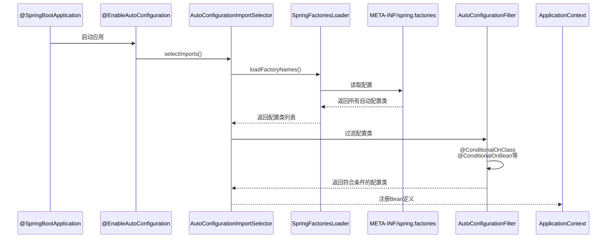
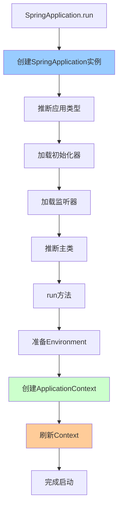

# Spring Boot核心原理

> 深入理解Spring Boot自动配置、启动流程、监控机制

---

## 📋 目录

1. [自动配置原理](#1-自动配置原理)
2. [启动流程解析](#2-启动流程解析)
3. [Starter机制](#3-starter机制)
4. [配置管理](#4-配置管理)
5. [监控与管理](#5-监控与管理)
6. [常见问题与解决方案](#6-常见问题与解决方案)

---

## 1. 自动配置原理

### 1.1 @SpringBootApplication注解

```java
/**
 * @SpringBootApplication是三个注解的组合
 */
@Target(ElementType.TYPE)
@Retention(RetentionPolicy.RUNTIME)
@Documented
@Inherited
@SpringBootConfiguration    // 1. 配置类
@EnableAutoConfiguration    // 2. 启用自动配置
@ComponentScan              // 3. 组件扫描
public @interface SpringBootApplication {
    // ...
}
```

**三大核心注解**：
```
1. @SpringBootConfiguration
   └─ @Configuration
      └─ 标识这是一个配置类

2. @EnableAutoConfiguration ⭐ 核心
   └─ @AutoConfigurationPackage
   └─ @Import(AutoConfigurationImportSelector.class)
      └─ 自动配置的关键

3. @ComponentScan
   └─ 扫描当前包及子包的组件
```

### 1.2 自动配置流程



**核心源码**：
```java
/**
 * AutoConfigurationImportSelector核心方法
 */
public class AutoConfigurationImportSelector implements DeferredImportSelector {
    
    @Override
    public String[] selectImports(AnnotationMetadata annotationMetadata) {
        // 1. 检查是否启用自动配置
        if (!isEnabled(annotationMetadata)) {
            return NO_IMPORTS;
        }
        
        // 2. 加载自动配置类
        AutoConfigurationEntry autoConfigurationEntry = 
            getAutoConfigurationEntry(annotationMetadata);
        
        return StringUtils.toStringArray(
            autoConfigurationEntry.getConfigurations()
        );
    }
    
    protected AutoConfigurationEntry getAutoConfigurationEntry(
            AnnotationMetadata annotationMetadata) {
        
        // 1. 获取候选配置类
        List<String> configurations = getCandidateConfigurations(
            annotationMetadata, 
            getAttributes(annotationMetadata)
        );
        
        // 2. 去重
        configurations = removeDuplicates(configurations);
        
        // 3. 获取排除的配置类
        Set<String> exclusions = getExclusions(
            annotationMetadata, 
            getAttributes(annotationMetadata)
        );
        
        // 4. 检查排除的配置类
        checkExcludedClasses(configurations, exclusions);
        
        // 5. 移除排除的配置类
        configurations.removeAll(exclusions);
        
        // 6. 过滤配置类（@Conditional注解）
        configurations = getConfigurationClassFilter()
            .filter(configurations);
        
        // 7. 触发自动配置导入事件
        fireAutoConfigurationImportEvents(configurations, exclusions);
        
        return new AutoConfigurationEntry(configurations, exclusions);
    }
    
    protected List<String> getCandidateConfigurations(
            AnnotationMetadata metadata, 
            AnnotationAttributes attributes) {
        
        // 加载META-INF/spring.factories中的配置
        List<String> configurations = SpringFactoriesLoader.loadFactoryNames(
            getSpringFactoriesLoaderFactoryClass(), 
            getBeanClassLoader()
        );
        
        return configurations;
    }
}
```

### 1.3 Conditional条件装配

```java
/**
 * 常用Conditional注解
 */
@Configuration
public class AutoConfigurationExample {
    
    // 1. @ConditionalOnClass：类路径存在指定类
    @Bean
    @ConditionalOnClass(DataSource.class)
    public DataSource dataSource() {
        return new HikariDataSource();
    }
    
    // 2. @ConditionalOnMissingBean：容器中不存在指定Bean
    @Bean
    @ConditionalOnMissingBean(DataSource.class)
    public DataSource defaultDataSource() {
        return new HikariDataSource();
    }
    
    // 3. @ConditionalOnProperty：配置文件存在指定属性
    @Bean
    @ConditionalOnProperty(name = "spring.datasource.enabled", havingValue = "true")
    public DataSourceInitializer dataSourceInitializer() {
        return new DataSourceInitializer();
    }
    
    // 4. @ConditionalOnBean：容器中存在指定Bean
    @Bean
    @ConditionalOnBean(DataSource.class)
    public JdbcTemplate jdbcTemplate(DataSource dataSource) {
        return new JdbcTemplate(dataSource);
    }
    
    // 5. @ConditionalOnMissingClass：类路径不存在指定类
    @Bean
    @ConditionalOnMissingClass("com.zaxxer.hikari.HikariDataSource")
    public DataSource basicDataSource() {
        return new BasicDataSource();
    }
    
    // 6. @ConditionalOnWebApplication：Web应用
    @Bean
    @ConditionalOnWebApplication
    public WebMvcConfigurer webMvcConfigurer() {
        return new WebMvcConfigurer() {};
    }
    
    // 7. 组合条件
    @Bean
    @ConditionalOnClass(DataSource.class)
    @ConditionalOnProperty(name = "spring.datasource.enabled")
    @ConditionalOnMissingBean
    public DataSource combinedDataSource() {
        return new HikariDataSource();
    }
}
```

**Conditional注解原理**：
```java
/**
 * Conditional注解处理
 */
@Target({ElementType.TYPE, ElementType.METHOD})
@Retention(RetentionPolicy.RUNTIME)
public @interface Conditional {
    Class<? extends Condition>[] value();
}

// Condition接口
@FunctionalInterface
public interface Condition {
    boolean matches(ConditionContext context, AnnotatedTypeMetadata metadata);
}

// 自定义Condition示例
public class OnLinuxCondition implements Condition {
    @Override
    public boolean matches(ConditionContext context, AnnotatedTypeMetadata metadata) {
        String os = context.getEnvironment().getProperty("os.name");
        return os != null && os.toLowerCase().contains("linux");
    }
}

@Bean
@Conditional(OnLinuxCondition.class)
public Service linuxService() {
    return new LinuxService();
}
```

### 1.4 spring.factories配置

```properties
# META-INF/spring.factories示例

# 自动配置类
org.springframework.boot.autoconfigure.EnableAutoConfiguration=\
com.example.autoconfigure.DataSourceAutoConfiguration,\
com.example.autoconfigure.RedisAutoConfiguration,\
com.example.autoconfigure.KafkaAutoConfiguration

# 应用监听器
org.springframework.context.ApplicationListener=\
com.example.listener.ApplicationStartedListener

# 初始化器
org.springframework.context.ApplicationContextInitializer=\
com.example.initializer.CustomInitializer
```

**自定义自动配置类**：
```java
/**
 * 自定义自动配置示例
 */
@Configuration
@ConditionalOnClass(MyService.class)
@EnableConfigurationProperties(MyProperties.class)
public class MyServiceAutoConfiguration {
    
    @Bean
    @ConditionalOnMissingBean
    public MyService myService(MyProperties properties) {
        MyService service = new MyService();
        service.setPrefix(properties.getPrefix());
        service.setTimeout(properties.getTimeout());
        return service;
    }
}

// 配置属性类
@ConfigurationProperties(prefix = "my.service")
public class MyProperties {
    private String prefix = "default";
    private int timeout = 30;
    
    // getters and setters
}
```

---

## 2. 启动流程解析

### 2.1 SpringApplication启动流程



**核心源码**：
```java
/**
 * SpringApplication核心启动流程
 */
public class SpringApplication {
    
    public static ConfigurableApplicationContext run(Class<?> primarySource, String... args) {
        return new SpringApplication(primarySource).run(args);
    }
    
    public SpringApplication(Class<?>... primarySources) {
        // 1. 推断应用类型（Servlet、Reactive、None）
        this.webApplicationType = WebApplicationType.deduceFromClasspath();
        
        // 2. 加载初始化器（ApplicationContextInitializer）
        setInitializers(getSpringFactoriesInstances(ApplicationContextInitializer.class));
        
        // 3. 加载监听器（ApplicationListener）
        setListeners(getSpringFactoriesInstances(ApplicationListener.class));
        
        // 4. 推断主类
        this.mainApplicationClass = deduceMainApplicationClass();
    }
    
    public ConfigurableApplicationContext run(String... args) {
        // 1. 创建StopWatch，记录启动时间
        StopWatch stopWatch = new StopWatch();
        stopWatch.start();
        
        // 2. 创建启动上下文
        DefaultBootstrapContext bootstrapContext = createBootstrapContext();
        ConfigurableApplicationContext context = null;
        
        // 3. 配置Headless属性
        configureHeadlessProperty();
        
        // 4. 获取并启动监听器
        SpringApplicationRunListeners listeners = getRunListeners(args);
        listeners.starting(bootstrapContext, this.mainApplicationClass);
        
        try {
            // 5. 准备应用参数
            ApplicationArguments applicationArguments = new DefaultApplicationArguments(args);
            
            // 6. 准备Environment
            ConfigurableEnvironment environment = prepareEnvironment(listeners, 
                bootstrapContext, applicationArguments);
            configureIgnoreBeanInfo(environment);
            
            // 7. 打印Banner
            Banner printedBanner = printBanner(environment);
            
            // 8. 创建ApplicationContext
            context = createApplicationContext();
            context.setApplicationStartup(this.applicationStartup);
            
            // 9. 准备Context
            prepareContext(bootstrapContext, context, environment, listeners,
                applicationArguments, printedBanner);
            
            // 10. 刷新Context（核心）
            refreshContext(context);
            
            // 11. 刷新后处理
            afterRefresh(context, applicationArguments);
            
            // 12. 停止计时
            stopWatch.stop();
            
            // 13. 打印启动日志
            if (this.logStartupInfo) {
                new StartupInfoLogger(this.mainApplicationClass)
                    .logStarted(getApplicationLog(), stopWatch);
            }
            
            // 14. 发布ApplicationStartedEvent
            listeners.started(context);
            
            // 15. 调用ApplicationRunner和CommandLineRunner
            callRunners(context, applicationArguments);
            
        } catch (Throwable ex) {
            handleRunFailure(context, ex, listeners);
            throw new IllegalStateException(ex);
        }
        
        try {
            // 16. 发布ApplicationReadyEvent
            listeners.running(context);
        } catch (Throwable ex) {
            handleRunFailure(context, ex, null);
            throw new IllegalStateException(ex);
        }
        
        return context;
    }
}
```

### 2.2 应用类型推断

```java
/**
 * WebApplicationType推断
 */
public enum WebApplicationType {
    
    NONE,      // 非Web应用
    SERVLET,   // Servlet Web应用
    REACTIVE;  // Reactive Web应用
    
    static WebApplicationType deduceFromClasspath() {
        // 1. 检查是否存在Reactive相关类
        if (ClassUtils.isPresent("org.springframework.web.reactive.DispatcherHandler", null)
            && !ClassUtils.isPresent("org.springframework.web.servlet.DispatcherServlet", null)
            && !ClassUtils.isPresent("org.glassfish.jersey.servlet.ServletContainer", null)) {
            return WebApplicationType.REACTIVE;
        }
        
        // 2. 检查是否存在Servlet相关类
        for (String className : SERVLET_INDICATOR_CLASSES) {
            if (!ClassUtils.isPresent(className, null)) {
                return WebApplicationType.NONE;
            }
        }
        
        return WebApplicationType.SERVLET;
    }
}
```

### 2.3 Environment准备

```java
/**
 * Environment准备流程
 */
private ConfigurableEnvironment prepareEnvironment(
        SpringApplicationRunListeners listeners,
        DefaultBootstrapContext bootstrapContext,
        ApplicationArguments applicationArguments) {
    
    // 1. 创建Environment
    ConfigurableEnvironment environment = getOrCreateEnvironment();
    
    // 2. 配置Environment（命令行参数、系统属性等）
    configureEnvironment(environment, applicationArguments.getSourceArgs());
    
    // 3. 附加ConfigurationPropertySources
    ConfigurationPropertySources.attach(environment);
    
    // 4. 发布ApplicationEnvironmentPreparedEvent
    listeners.environmentPrepared(bootstrapContext, environment);
    
    // 5. 绑定Environment到SpringApplication
    bindToSpringApplication(environment);
    
    // 6. 转换Environment类型（如果需要）
    if (!this.isCustomEnvironment) {
        environment = new EnvironmentConverter(getClassLoader())
            .convertEnvironmentIfNecessary(environment, deduceEnvironmentClass());
    }
    
    // 7. 再次附加ConfigurationPropertySources
    ConfigurationPropertySources.attach(environment);
    
    return environment;
}
```

### 2.4 Context刷新

```java
/**
 * Context刷新流程（调用AbstractApplicationContext.refresh()）
 */
private void refreshContext(ConfigurableApplicationContext context) {
    if (this.registerShutdownHook) {
        // 注册关闭钩子
        shutdownHook.registerApplicationContext(context);
    }
    refresh(context);
}

protected void refresh(ConfigurableApplicationContext applicationContext) {
    applicationContext.refresh();  // 调用Spring的refresh()方法
}
```

---

## 3. Starter机制

### 3.1 Starter原理

```
Starter = 自动配置 + 依赖管理

命名规范：
- 官方Starter：spring-boot-starter-{name}
- 第三方Starter：{name}-spring-boot-starter

目录结构：
my-spring-boot-starter/
├── src/main/java/
│   └── com/example/autoconfigure/
│       ├── MyAutoConfiguration.java
│       └── MyProperties.java
├── src/main/resources/
│   └── META-INF/
│       └── spring.factories
└── pom.xml
```

### 3.2 自定义Starter示例

**步骤1：创建配置属性类**
```java
/**
 * 配置属性
 */
@ConfigurationProperties(prefix = "my.service")
public class MyServiceProperties {
    
    private boolean enabled = true;
    private String prefix = "default";
    private int timeout = 30;
    
    // getters and setters
}
```

**步骤2：创建服务类**
```java
/**
 * 核心服务类
 */
public class MyService {
    
    private String prefix;
    private int timeout;
    
    public void doSomething(String input) {
        System.out.println(prefix + ": " + input);
    }
    
    // getters and setters
}
```

**步骤3：创建自动配置类**
```java
/**
 * 自动配置类
 */
@Configuration
@ConditionalOnClass(MyService.class)
@EnableConfigurationProperties(MyServiceProperties.class)
public class MyServiceAutoConfiguration {
    
    @Bean
    @ConditionalOnMissingBean
    @ConditionalOnProperty(prefix = "my.service", name = "enabled", havingValue = "true")
    public MyService myService(MyServiceProperties properties) {
        MyService service = new MyService();
        service.setPrefix(properties.getPrefix());
        service.setTimeout(properties.getTimeout());
        return service;
    }
}
```

**步骤4：配置spring.factories**
```properties
# src/main/resources/META-INF/spring.factories
org.springframework.boot.autoconfigure.EnableAutoConfiguration=\
com.example.autoconfigure.MyServiceAutoConfiguration
```

**步骤5：使用Starter**
```xml
<!-- pom.xml -->
<dependency>
    <groupId>com.example</groupId>
    <artifactId>my-spring-boot-starter</artifactId>
    <version>1.0.0</version>
</dependency>
```

```yaml
# application.yml
my:
  service:
    enabled: true
    prefix: "MyService"
    timeout: 60
```

```java
// 使用
@Service
public class BusinessService {
    
    @Autowired
    private MyService myService;
    
    public void process() {
        myService.doSomething("Hello");
    }
}
```

### 3.3 常用Starter

```
Web开发：
- spring-boot-starter-web：Web应用（Tomcat、Spring MVC）
- spring-boot-starter-webflux：Reactive Web应用

数据访问：
- spring-boot-starter-data-jpa：JPA（Hibernate）
- spring-boot-starter-data-mongodb：MongoDB
- spring-boot-starter-data-redis：Redis
- spring-boot-starter-jdbc：JDBC

消息队列：
- spring-boot-starter-amqp：RabbitMQ
- spring-boot-starter-kafka：Kafka

安全：
- spring-boot-starter-security：Spring Security

监控：
- spring-boot-starter-actuator：监控端点

测试：
- spring-boot-starter-test：测试（JUnit、Mockito）
```

---

## 4. 配置管理

### 4.1 配置文件加载顺序

```
配置文件优先级（从高到低）：
1. 命令行参数：java -jar app.jar --server.port=8081
2. SPRING_APPLICATION_JSON：环境变量或系统属性
3. ServletConfig初始化参数
4. ServletContext初始化参数
5. JNDI属性
6. Java系统属性：System.getProperties()
7. 操作系统环境变量
8. RandomValuePropertySource
9. jar包外的application-{profile}.properties/yml
10. jar包内的application-{profile}.properties/yml
11. jar包外的application.properties/yml
12. jar包内的application.properties/yml
13. @PropertySource注解指定的配置
14. 默认属性：SpringApplication.setDefaultProperties
```

### 4.2 配置文件位置

```
配置文件搜索路径（从高到低）：
1. file:./config/          # 项目根目录的config目录
2. file:./config/*/        # 项目根目录的config子目录
3. file:./                 # 项目根目录
4. classpath:/config/      # classpath的config目录
5. classpath:/             # classpath根目录

可通过spring.config.location自定义：
java -jar app.jar --spring.config.location=file:/opt/config/

可通过spring.config.additional-location追加：
java -jar app.jar --spring.config.additional-location=file:/opt/config/
```

### 4.3 Profile环境配置

```yaml
# application.yml（公共配置）
spring:
  application:
    name: myapp

---
# application-dev.yml（开发环境）
spring:
  config:
    activate:
      on-profile: dev
  datasource:
    url: jdbc:mysql://localhost:3306/dev_db
server:
  port: 8080

---
# application-test.yml（测试环境）
spring:
  config:
    activate:
      on-profile: test
  datasource:
    url: jdbc:mysql://test-server:3306/test_db
server:
  port: 8081

---
# application-prod.yml（生产环境）
spring:
  config:
    activate:
      on-profile: prod
  datasource:
    url: jdbc:mysql://prod-server:3306/prod_db
server:
  port: 80
```

**激活Profile**：
```bash
# 方式1：命令行参数
java -jar app.jar --spring.profiles.active=prod

# 方式2：环境变量
export SPRING_PROFILES_ACTIVE=prod

# 方式3：application.yml
spring:
  profiles:
    active: prod

# 方式4：IDE配置（IDEA）
Run/Debug Configurations -> Environment -> VM options:
-Dspring.profiles.active=dev
```

### 4.4 配置加密

```yaml
# application.yml
spring:
  datasource:
    url: jdbc:mysql://localhost:3306/mydb
    username: root
    password: ENC(encrypted_password)  # 加密的密码

# 使用Jasypt加密
jasypt:
  encryptor:
    password: ${JASYPT_ENCRYPTOR_PASSWORD}  # 加密密钥
    algorithm: PBEWithMD5AndDES
```

```java
/**
 * Jasypt配置
 */
@Configuration
@EnableEncryptableProperties
public class JasyptConfig {
    
    @Bean("jasyptStringEncryptor")
    public StringEncryptor stringEncryptor() {
        PooledPBEStringEncryptor encryptor = new PooledPBEStringEncryptor();
        SimpleStringPBEConfig config = new SimpleStringPBEConfig();
        config.setPassword(getEncryptorPassword());
        config.setAlgorithm("PBEWithMD5AndDES");
        config.setKeyObtentionIterations("1000");
        config.setPoolSize("1");
        config.setProviderName("SunJCE");
        config.setSaltGeneratorClassName("org.jasypt.salt.RandomSaltGenerator");
        config.setStringOutputType("base64");
        encryptor.setConfig(config);
        return encryptor;
    }
    
    private String getEncryptorPassword() {
        return System.getenv("JASYPT_ENCRYPTOR_PASSWORD");
    }
}
```

---

## 5. 监控与管理

### 5.1 Actuator监控端点

```xml
<!-- 添加依赖 -->
<dependency>
    <groupId>org.springframework.boot</groupId>
    <artifactId>spring-boot-starter-actuator</artifactId>
</dependency>
```

```yaml
# application.yml
management:
  endpoints:
    web:
      exposure:
        include: '*'  # 暴露所有端点
      base-path: /actuator  # 端点基础路径
  endpoint:
    health:
      show-details: always  # 显示健康检查详情
```

**常用端点**：
```
GET /actuator/health        # 健康检查
GET /actuator/info          # 应用信息
GET /actuator/metrics       # 度量指标
GET /actuator/env           # 环境变量
GET /actuator/beans         # Bean列表
GET /actuator/mappings      # 请求映射
GET /actuator/configprops   # 配置属性
GET /actuator/threaddump    # 线程转储
GET /actuator/heapdump      # 堆转储
GET /actuator/loggers       # 日志配置
POST /actuator/shutdown     # 关闭应用（需启用）
```

### 5.2 自定义健康检查

```java
/**
 * 自定义健康检查
 */
@Component
public class CustomHealthIndicator implements HealthIndicator {
    
    @Override
    public Health health() {
        // 检查自定义组件健康状态
        boolean isHealthy = checkCustomComponent();
        
        if (isHealthy) {
            return Health.up()
                .withDetail("component", "CustomComponent")
                .withDetail("status", "Running")
                .build();
        } else {
            return Health.down()
                .withDetail("component", "CustomComponent")
                .withDetail("error", "Not running")
                .build();
        }
    }
    
    private boolean checkCustomComponent() {
        // 实际检查逻辑
        return true;
    }
}
```

### 5.3 自定义监控指标

```java
/**
 * 自定义Metrics
 */
@Component
public class CustomMetrics {
    
    private final Counter requestCounter;
    private final Timer requestTimer;
    private final Gauge customGauge;
    
    public CustomMetrics(MeterRegistry meterRegistry) {
        // 计数器
        this.requestCounter = Counter.builder("custom.requests.total")
            .tag("type", "api")
            .description("Total API requests")
            .register(meterRegistry);
        
        // 计时器
        this.requestTimer = Timer.builder("custom.requests.duration")
            .tag("type", "api")
            .description("API request duration")
            .register(meterRegistry);
        
        // 仪表
        this.customGauge = Gauge.builder("custom.active.users", this, 
            CustomMetrics::getActiveUsers)
            .description("Active users count")
            .register(meterRegistry);
    }
    
    public void recordRequest() {
        requestCounter.increment();
    }
    
    public void recordDuration(long duration) {
        requestTimer.record(duration, TimeUnit.MILLISECONDS);
    }
    
    private double getActiveUsers() {
        // 获取活跃用户数
        return 100;
    }
}
```

### 5.4 集成监控工具

**Prometheus + Grafana**：
```xml
<!-- 添加Micrometer Prometheus依赖 -->
<dependency>
    <groupId>io.micrometer</groupId>
    <artifactId>micrometer-registry-prometheus</artifactId>
</dependency>
```

```yaml
# application.yml
management:
  endpoints:
    web:
      exposure:
        include: prometheus  # 暴露Prometheus端点
  metrics:
    export:
      prometheus:
        enabled: true
```

```yaml
# prometheus.yml
scrape_configs:
  - job_name: 'spring-boot-app'
    metrics_path: '/actuator/prometheus'
    static_configs:
      - targets: ['localhost:8080']
```

---

## 6. 常见问题与解决方案

### 6.1 启动失败问题

**问题1：端口被占用**
```
***************************
APPLICATION FAILED TO START
***************************

Description:
Web server failed to start. Port 8080 was already in use.

解决方法：
# 1. 修改端口
server.port=8081

# 2. 查找占用进程并杀掉
lsof -i:8080
kill -9 <pid>
```

**问题2：Bean循环依赖**
```
Error creating bean with name 'serviceA': 
Requested bean is currently in creation: Is there an unresolvable circular reference?

解决方法：
# 1. 使用@Lazy延迟加载
@Service
public class ServiceA {
    @Autowired
    @Lazy
    private ServiceB serviceB;
}

# 2. 使用Setter注入替代构造器注入
# 3. 重构代码，消除循环依赖
```

**问题3：自动配置不生效**
```
原因：
1. 未添加@EnableAutoConfiguration
2. 配置类未被扫描到
3. Conditional条件不满足
4. spring.factories配置错误

解决方法：
# 1. 检查@SpringBootApplication注解
@SpringBootApplication

# 2. 扫描额外的包
@SpringBootApplication(scanBasePackages = {"com.example", "com.other"})

# 3. 查看自动配置报告
java -jar app.jar --debug
或
logging.level.org.springframework.boot.autoconfigure=DEBUG
```

### 6.2 配置不生效问题

**问题1：配置优先级**
```yaml
# application.yml
server:
  port: 8080

# application-dev.yml
server:
  port: 8081

# 命令行
java -jar app.jar --spring.profiles.active=dev --server.port=8082

# 实际端口：8082（命令行参数优先级最高）
```

**问题2：配置绑定失败**
```java
// ❌ 错误：未启用配置属性
@Component
@ConfigurationProperties(prefix = "my.config")
public class MyConfig {
    private String name;
}

// ✅ 正确方法1：使用@EnableConfigurationProperties
@Configuration
@EnableConfigurationProperties(MyConfig.class)
public class AppConfig {
}

// ✅ 正确方法2：使用@Component + @ConfigurationPropertiesScan
@SpringBootApplication
@ConfigurationPropertiesScan
public class Application {
}
```

**问题3：Profile不生效**
```yaml
# ❌ 错误：使用了旧语法（Spring Boot 2.4+已废弃）
spring:
  profiles: dev

# ✅ 正确：使用新语法
spring:
  config:
    activate:
      on-profile: dev
```

### 6.3 性能优化

**1. 启动速度优化**
```yaml
# 懒加载
spring:
  main:
    lazy-initialization: true  # 所有Bean延迟加载

# 或针对特定Bean
@Bean
@Lazy
public MyService myService() {
    return new MyService();
}

# 排除不需要的自动配置
@SpringBootApplication(exclude = {
    DataSourceAutoConfiguration.class,
    RedisAutoConfiguration.class
})
```

**2. 内存优化**
```bash
# JVM参数优化
java -jar app.jar \
  -Xms512m -Xmx512m \
  -XX:+UseG1GC \
  -XX:MaxGCPauseMillis=200 \
  -XX:+HeapDumpOnOutOfMemoryError \
  -XX:HeapDumpPath=/var/log/heapdump.hprof
```

**3. 连接池优化**
```yaml
# HikariCP连接池配置
spring:
  datasource:
    hikari:
      minimum-idle: 10
      maximum-pool-size: 20
      connection-timeout: 30000
      idle-timeout: 600000
      max-lifetime: 1800000
```

**4. 异步处理**
```java
@Configuration
@EnableAsync
public class AsyncConfig {
    
    @Bean
    public Executor taskExecutor() {
        ThreadPoolTaskExecutor executor = new ThreadPoolTaskExecutor();
        executor.setCorePoolSize(10);
        executor.setMaxPoolSize(20);
        executor.setQueueCapacity(100);
        executor.setThreadNamePrefix("async-");
        executor.initialize();
        return executor;
    }
}

@Service
public class AsyncService {
    
    @Async
    public CompletableFuture<String> asyncMethod() {
        // 异步执行
        return CompletableFuture.completedFuture("result");
    }
}
```

### 6.4 日志问题

**1. 日志级别配置**
```yaml
# application.yml
logging:
  level:
    root: INFO
    com.example: DEBUG
    org.springframework.web: DEBUG
    org.hibernate.SQL: DEBUG
    org.hibernate.type.descriptor.sql.BasicBinder: TRACE  # 打印SQL参数
```

**2. 日志文件配置**
```yaml
logging:
  file:
    name: /var/log/myapp.log  # 日志文件
    max-size: 10MB            # 单个文件最大大小
    max-history: 30           # 保留天数
  pattern:
    console: "%d{yyyy-MM-dd HH:mm:ss} - %msg%n"
    file: "%d{yyyy-MM-dd HH:mm:ss} [%thread] %-5level %logger{36} - %msg%n"
```

**3. 自定义日志配置**
```xml
<!-- logback-spring.xml -->
<?xml version="1.0" encoding="UTF-8"?>
<configuration>
    <springProperty scope="context" name="appName" source="spring.application.name"/>
    
    <!-- 控制台输出 -->
    <appender name="CONSOLE" class="ch.qos.logback.core.ConsoleAppender">
        <encoder>
            <pattern>%d{yyyy-MM-dd HH:mm:ss.SSS} [%thread] %-5level %logger{36} - %msg%n</pattern>
        </encoder>
    </appender>
    
    <!-- 文件输出 -->
    <appender name="FILE" class="ch.qos.logback.core.rolling.RollingFileAppender">
        <file>/var/log/${appName}.log</file>
        <rollingPolicy class="ch.qos.logback.core.rolling.TimeBasedRollingPolicy">
            <fileNamePattern>/var/log/${appName}.%d{yyyy-MM-dd}.log</fileNamePattern>
            <maxHistory>30</maxHistory>
        </rollingPolicy>
        <encoder>
            <pattern>%d{yyyy-MM-dd HH:mm:ss.SSS} [%thread] %-5level %logger{36} - %msg%n</pattern>
        </encoder>
    </appender>
    
    <root level="INFO">
        <appender-ref ref="CONSOLE"/>
        <appender-ref ref="FILE"/>
    </root>
</configuration>
```

### 6.5 打包部署问题

**1. 可执行JAR**
```xml
<!-- pom.xml -->
<build>
    <plugins>
        <plugin>
            <groupId>org.springframework.boot</groupId>
            <artifactId>spring-boot-maven-plugin</artifactId>
            <configuration>
                <executable>true</executable>  <!-- 可执行JAR -->
            </configuration>
        </plugin>
    </plugins>
</build>
```

```bash
# 打包
mvn clean package

# 运行
java -jar target/myapp.jar

# 后台运行
nohup java -jar myapp.jar > /dev/null 2>&1 &

# 或作为服务（Linux）
ln -s /opt/myapp/myapp.jar /etc/init.d/myapp
service myapp start
```

**2. Docker部署**
```dockerfile
# Dockerfile
FROM openjdk:11-jre-slim
WORKDIR /app
COPY target/myapp.jar app.jar
EXPOSE 8080
ENTRYPOINT ["java", "-jar", "app.jar"]
```

```bash
# 构建镜像
docker build -t myapp:1.0 .

# 运行容器
docker run -d -p 8080:8080 \
  --name myapp \
  -e SPRING_PROFILES_ACTIVE=prod \
  myapp:1.0
```

---

## 📚 参考资料

- 📖 《Spring Boot实战》- Craig Walls
- 📖 《Spring Boot编程思想》- 小马哥
- 🔗 [Spring Boot官方文档](https://docs.spring.io/spring-boot/docs/current/reference/htmlsingle/)
- 🔗 [Spring Boot源码](https://github.com/spring-projects/spring-boot)

---

*最后更新：2025-10-27*
