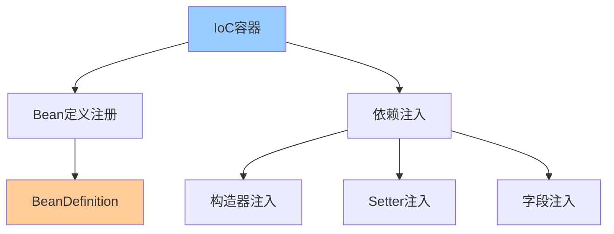
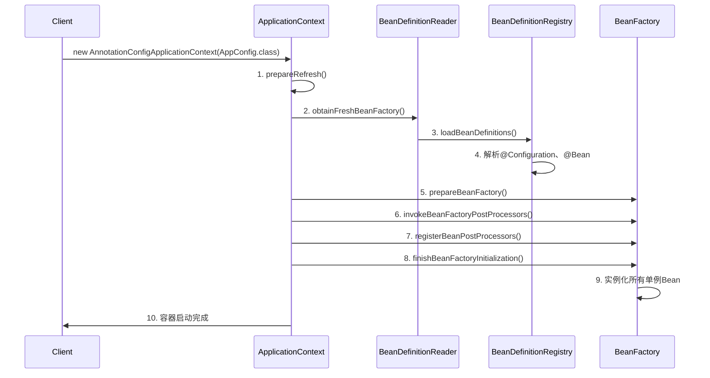
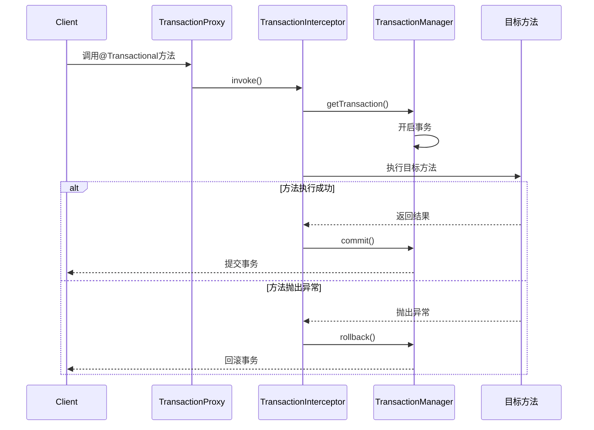
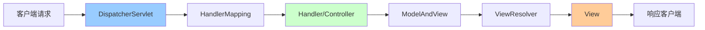

# Spring核心源码解析

> 深入理解Spring IoC、AOP、事务管理等核心机制

---

## 📋 目录

1. [Spring IoC容器](#1-spring-ioc容器)
2. [Spring AOP原理](#2-spring-aop原理)
3. [Spring事务管理](#3-spring事务管理)
4. [Spring MVC原理](#4-spring-mvc原理)
5. [Spring Bean生命周期](#5-spring-bean生命周期)
6. [常见问题与解决方案](#6-常见问题与解决方案)

---

## 1. Spring IoC容器

### 1.1 IoC核心概念



**核心思想**：
```
传统方式：对象主动创建依赖对象（正向）
IoC方式：容器负责创建和注入依赖（反转控制）

优点：
✅ 降低耦合度
✅ 提高可测试性
✅ 便于管理对象生命周期
```

### 1.2 BeanFactory vs ApplicationContext

```java
/**
 * Spring容器体系
 */
public class ContainerDemo {
    
    // BeanFactory：基础容器
    BeanFactory beanFactory = new XmlBeanFactory(
        new ClassPathResource("beans.xml")
    );
    
    // ApplicationContext：高级容器（推荐）
    ApplicationContext context = new ClassPathXmlApplicationContext(
        "applicationContext.xml"
    );
    
    // 或使用注解配置
    ApplicationContext annotationContext = 
        new AnnotationConfigApplicationContext(AppConfig.class);
}
```

**区别对比**：
```
┌──────────────────┬────────────┬──────────────────┐
│ 特性             │ BeanFactory│ ApplicationContext│
├──────────────────┼────────────┼──────────────────┤
│ Bean加载时机     │ 延迟加载   │ 立即加载         │
│ 国际化支持       │ ❌         │ ✅               │
│ 事件发布         │ ❌         │ ✅               │
│ AOP支持          │ 需手动配置 │ 自动支持         │
│ 适用场景         │ 资源受限   │ 企业应用（推荐） │
└──────────────────┴────────────┴──────────────────┘
```

### 1.3 IoC容器初始化流程



**核心步骤**：
```java
/**
 * AbstractApplicationContext.refresh()源码简化
 */
public void refresh() throws BeansException, IllegalStateException {
    synchronized (this.startupShutdownMonitor) {
        // 1. 准备刷新上下文
        prepareRefresh();
        
        // 2. 获取BeanFactory
        ConfigurableListableBeanFactory beanFactory = obtainFreshBeanFactory();
        
        // 3. 准备BeanFactory
        prepareBeanFactory(beanFactory);
        
        try {
            // 4. 后置处理BeanFactory
            postProcessBeanFactory(beanFactory);
            
            // 5. 调用BeanFactoryPostProcessor
            invokeBeanFactoryPostProcessors(beanFactory);
            
            // 6. 注册BeanPostProcessor
            registerBeanPostProcessors(beanFactory);
            
            // 7. 初始化消息源
            initMessageSource();
            
            // 8. 初始化事件广播器
            initApplicationEventMulticaster();
            
            // 9. 初始化其他特殊Bean
            onRefresh();
            
            // 10. 注册监听器
            registerListeners();
            
            // 11. 实例化所有非延迟加载的单例Bean
            finishBeanFactoryInitialization(beanFactory);
            
            // 12. 完成刷新
            finishRefresh();
        } catch (BeansException ex) {
            // 销毁已创建的Bean
            destroyBeans();
            cancelRefresh(ex);
            throw ex;
        }
    }
}
```

### 1.4 依赖注入方式

```java
/**
 * 三种依赖注入方式
 */
@Service
public class UserService {
    
    // 1. 构造器注入（推荐）⭐
    private final UserRepository userRepository;
    
    @Autowired
    public UserService(UserRepository userRepository) {
        this.userRepository = userRepository;
    }
    
    // 2. Setter注入
    private EmailService emailService;
    
    @Autowired
    public void setEmailService(EmailService emailService) {
        this.emailService = emailService;
    }
    
    // 3. 字段注入（不推荐，难以测试）
    @Autowired
    private SmsService smsService;
}

/**
 * 为什么推荐构造器注入？
 * ✅ 依赖明确，强制初始化
 * ✅ 支持final字段，线程安全
 * ✅ 便于单元测试
 * ✅ 避免循环依赖
 */
```

### 1.5 Bean作用域

```java
/**
 * Bean的五种作用域
 */
@Configuration
public class BeanScopeConfig {
    
    // 1. singleton（默认）：全局唯一实例
    @Bean
    @Scope("singleton")
    public UserService userService() {
        return new UserService();
    }
    
    // 2. prototype：每次获取创建新实例
    @Bean
    @Scope("prototype")
    public Order order() {
        return new Order();
    }
    
    // 3. request：每个HTTP请求一个实例（Web应用）
    @Bean
    @Scope(value = WebApplicationContext.SCOPE_REQUEST, proxyMode = ScopedProxyMode.TARGET_CLASS)
    public UserContext userContext() {
        return new UserContext();
    }
    
    // 4. session：每个HTTP会话一个实例
    @Bean
    @Scope(value = WebApplicationContext.SCOPE_SESSION, proxyMode = ScopedProxyMode.TARGET_CLASS)
    public ShoppingCart shoppingCart() {
        return new ShoppingCart();
    }
    
    // 5. application：ServletContext生命周期内唯一
    @Bean
    @Scope(value = WebApplicationContext.SCOPE_APPLICATION, proxyMode = ScopedProxyMode.TARGET_CLASS)
    public AppConfig appConfig() {
        return new AppConfig();
    }
}
```

---

## 2. Spring AOP原理

### 2.1 AOP核心概念

```
AOP（Aspect-Oriented Programming）面向切面编程

核心术语：
┌──────────────┬───────────────────────────────┐
│ 术语         │ 说明                          │
├──────────────┼───────────────────────────────┤
│ Aspect       │ 切面：横切关注点的模块化      │
│ Join Point   │ 连接点：程序执行的某个点      │
│ Pointcut     │ 切点：匹配连接点的表达式      │
│ Advice       │ 通知：在切点执行的动作        │
│ Target       │ 目标对象：被代理的对象        │
│ Proxy        │ 代理对象：AOP创建的对象       │
│ Weaving      │ 织入：将切面应用到目标对象    │
└──────────────┴───────────────────────────────┘

Advice类型：
- @Before：前置通知
- @After：后置通知
- @AfterReturning：返回通知
- @AfterThrowing：异常通知
- @Around：环绕通知（最强大）
```

### 2.2 动态代理机制

```java
/**
 * Spring AOP两种代理方式
 */
public class ProxyDemo {
    
    // JDK动态代理（基于接口）
    public static Object createJdkProxy(Object target) {
        return Proxy.newProxyInstance(
            target.getClass().getClassLoader(),
            target.getClass().getInterfaces(),
            (proxy, method, args) -> {
                System.out.println("Before method: " + method.getName());
                Object result = method.invoke(target, args);
                System.out.println("After method: " + method.getName());
                return result;
            }
        );
    }
    
    // CGLIB代理（基于继承）
    public static Object createCglibProxy(Class<?> targetClass) {
        Enhancer enhancer = new Enhancer();
        enhancer.setSuperclass(targetClass);
        enhancer.setCallback(new MethodInterceptor() {
            @Override
            public Object intercept(Object obj, Method method, Object[] args,
                                  MethodProxy proxy) throws Throwable {
                System.out.println("Before method: " + method.getName());
                Object result = proxy.invokeSuper(obj, args);
                System.out.println("After method: " + method.getName());
                return result;
            }
        });
        return enhancer.create();
    }
}
```

**代理选择逻辑**：
```
Spring AOP代理策略：
├── 目标对象实现了接口？
│   ├── 是 → JDK动态代理（默认）
│   └── 否 → CGLIB代理
└── 强制使用CGLIB：@EnableAspectJAutoProxy(proxyTargetClass = true)

JDK vs CGLIB：
┌──────────┬────────────┬────────────┐
│ 特性     │ JDK代理    │ CGLIB代理  │
├──────────┼────────────┼────────────┤
│ 实现方式 │ 基于接口   │ 基于继承   │
│ 性能     │ 快速       │ 较慢       │
│ 限制     │ 需要接口   │ 不能代理final│
│ 适用场景 │ 有接口     │ 无接口类   │
└──────────┴────────────┴────────────┘
```

### 2.3 AOP使用示例

```java
/**
 * AOP切面示例
 */
@Aspect
@Component
public class LoggingAspect {
    
    // 定义切点
    @Pointcut("execution(* com.example.service.*.*(..))")
    public void serviceLayer() {}
    
    // 前置通知
    @Before("serviceLayer()")
    public void logBefore(JoinPoint joinPoint) {
        String methodName = joinPoint.getSignature().getName();
        Object[] args = joinPoint.getArgs();
        System.out.println("Before: " + methodName + ", args: " + Arrays.toString(args));
    }
    
    // 返回通知
    @AfterReturning(pointcut = "serviceLayer()", returning = "result")
    public void logAfterReturning(JoinPoint joinPoint, Object result) {
        System.out.println("AfterReturning: " + joinPoint.getSignature().getName() 
            + ", result: " + result);
    }
    
    // 异常通知
    @AfterThrowing(pointcut = "serviceLayer()", throwing = "ex")
    public void logAfterThrowing(JoinPoint joinPoint, Exception ex) {
        System.out.println("AfterThrowing: " + joinPoint.getSignature().getName() 
            + ", exception: " + ex.getMessage());
    }
    
    // 环绕通知（最强大）⭐
    @Around("serviceLayer()")
    public Object logAround(ProceedingJoinPoint joinPoint) throws Throwable {
        long start = System.currentTimeMillis();
        
        try {
            // 执行目标方法
            Object result = joinPoint.proceed();
            
            long elapsedTime = System.currentTimeMillis() - start;
            System.out.println("Method: " + joinPoint.getSignature().getName() 
                + ", Time: " + elapsedTime + "ms");
            
            return result;
        } catch (Exception ex) {
            System.out.println("Exception in: " + joinPoint.getSignature().getName());
            throw ex;
        }
    }
}
```

### 2.4 切点表达式

```java
/**
 * Pointcut表达式语法
 */
@Aspect
@Component
public class PointcutExpressions {
    
    // 1. execution：最常用，匹配方法执行
    @Pointcut("execution(public * com.example.service.*.*(..))")
    public void publicServiceMethods() {}
    
    // execution语法：
    // execution(modifiers? return-type declaring-type? method-name(params) throws?)
    // 示例：
    @Pointcut("execution(* com.example..*Service.*(..))")  // 所有Service类的方法
    @Pointcut("execution(* com.example..*.get*(..))")      // 所有get开头的方法
    @Pointcut("execution(* com.example..*.*(..))")         // 所有方法
    
    // 2. within：匹配指定类型内的方法
    @Pointcut("within(com.example.service.*)")  // service包下所有类
    @Pointcut("within(com.example.service..*)")  // service包及子包
    
    // 3. @annotation：匹配带有指定注解的方法
    @Pointcut("@annotation(com.example.annotation.Log)")
    public void logAnnotation() {}
    
    // 4. @within：匹配带有指定注解的类中的方法
    @Pointcut("@within(org.springframework.stereotype.Service)")
    public void serviceAnnotation() {}
    
    // 5. args：匹配参数类型
    @Pointcut("args(java.lang.String, ..)")  // 第一个参数为String
    
    // 6. 组合表达式
    @Pointcut("execution(* com.example.service.*.*(..)) && @annotation(Log)")
    public void serviceWithLog() {}
    
    @Pointcut("execution(* com.example.service.*.*(..)) || execution(* com.example.controller.*.*(..))")
    public void serviceOrController() {}
}
```

---

## 3. Spring事务管理

### 3.1 事务传播机制

```java
/**
 * 七种事务传播行为
 */
@Service
public class TransactionPropagationDemo {
    
    // 1. REQUIRED（默认）：支持当前事务，不存在则创建新事务
    @Transactional(propagation = Propagation.REQUIRED)
    public void methodA() {
        // 如果已有事务，加入该事务；否则新建事务
    }
    
    // 2. REQUIRES_NEW：创建新事务，挂起当前事务
    @Transactional(propagation = Propagation.REQUIRES_NEW)
    public void methodB() {
        // 总是新建事务，当前事务挂起
    }
    
    // 3. SUPPORTS：支持当前事务，不存在则以非事务方式执行
    @Transactional(propagation = Propagation.SUPPORTS)
    public void methodC() {
        // 有事务就用，没有也不创建
    }
    
    // 4. NOT_SUPPORTED：以非事务方式执行，挂起当前事务
    @Transactional(propagation = Propagation.NOT_SUPPORTED)
    public void methodD() {
        // 总是非事务执行，挂起当前事务
    }
    
    // 5. MANDATORY：支持当前事务，不存在则抛异常
    @Transactional(propagation = Propagation.MANDATORY)
    public void methodE() {
        // 必须在事务中调用，否则抛异常
    }
    
    // 6. NEVER：以非事务方式执行，存在事务则抛异常
    @Transactional(propagation = Propagation.NEVER)
    public void methodF() {
        // 不能在事务中调用
    }
    
    // 7. NESTED：嵌套事务（保存点）
    @Transactional(propagation = Propagation.NESTED)
    public void methodG() {
        // 如果有事务，创建嵌套事务；否则创建新事务
        // 嵌套事务回滚不影响��部事务
    }
}
```

**传播行为场景**：
```
场景1：REQUIRED（最常用）
methodA() {
    // 事务A
    methodB(); // 加入事务A
}

场景2：REQUIRES_NEW
methodA() {
    // 事务A
    methodB(); // 新建事务B，挂起A
    // 继续事务A
}

场景3：NESTED
methodA() {
    // 事务A
    methodB(); // 嵌套事务B（保存点）
    // B回滚到保存点，A可以继续
}
```

### 3.2 事务隔离级别

```java
/**
 * 四种事务隔离级别
 */
@Service
public class TransactionIsolationDemo {
    
    // 1. READ_UNCOMMITTED：读未提交（脏读）
    @Transactional(isolation = Isolation.READ_UNCOMMITTED)
    public void readUncommitted() {
        // 可能读到未提交的数据
    }
    
    // 2. READ_COMMITTED：读已提交（不可重复读）
    @Transactional(isolation = Isolation.READ_COMMITTED)
    public void readCommitted() {
        // 只能读到已提交的数据
        // 同一事务内多次读取，结果可能不同
    }
    
    // 3. REPEATABLE_READ：可重复读（幻读）⭐ MySQL默认
    @Transactional(isolation = Isolation.REPEATABLE_READ)
    public void repeatableRead() {
        // 同一事务内多次读取，结果相同
        // 但可能出现幻读（新增的行）
    }
    
    // 4. SERIALIZABLE：串行化（最高级别）
    @Transactional(isolation = Isolation.SERIALIZABLE)
    public void serializable() {
        // 完全串行化执行，无并发问题
        // 性能最差
    }
}
```

**隔离级别对比**：
```
┌─────────────────┬──────┬────────────┬────────┬──────┐
│ 隔离级别        │ 脏读 │ 不可重复读 │ 幻读   │ 性能 │
├─────────────────┼──────┼────────────┼────────┼──────┤
│ READ_UNCOMMITTED│ ✗    │ ✗          │ ✗      │ 最高 │
│ READ_COMMITTED  │ ✓    │ ✗          │ ✗      │ 高   │
│ REPEATABLE_READ │ ✓    │ ✓          │ ✗(MySQL✓)│ 中   │
│ SERIALIZABLE    │ ✓    │ ✓          │ ✓      │ 最低 │
└─────────────────┴──────┴────────────┴────────┴──────┘

✓ 可避免   ✗ 不可避免
```

### 3.3 事务实现原理



**源码简化**：
```java
/**
 * TransactionInterceptor核心逻辑
 */
public class TransactionInterceptor extends TransactionAspectSupport {
    
    @Override
    public Object invoke(MethodInvocation invocation) throws Throwable {
        // 1. 获取目标类
        Class<?> targetClass = invocation.getThis().getClass();
        
        // 2. 执行事务方法
        return invokeWithinTransaction(
            invocation.getMethod(),
            targetClass,
            invocation::proceed
        );
    }
    
    protected Object invokeWithinTransaction(Method method, Class<?> targetClass,
                                            InvocationCallback invocation) throws Throwable {
        // 1. 获取事务属性
        TransactionAttribute txAttr = getTransactionAttributeSource()
            .getTransactionAttribute(method, targetClass);
        
        // 2. 获取事务管理器
        PlatformTransactionManager tm = determineTransactionManager(txAttr);
        
        // 3. 获取连接点标识
        String joinpointIdentification = methodIdentification(method, targetClass);
        
        try {
            // 4. 开启事务
            TransactionInfo txInfo = createTransactionIfNecessary(tm, txAttr, joinpointIdentification);
            
            Object retVal;
            try {
                // 5. 执行目标方法
                retVal = invocation.proceedWithInvocation();
            } catch (Throwable ex) {
                // 6. 异常回滚
                completeTransactionAfterThrowing(txInfo, ex);
                throw ex;
            }
            
            // 7. 提交事务
            commitTransactionAfterReturning(txInfo);
            return retVal;
            
        } finally {
            // 8. 清理事务信息
            cleanupTransactionInfo(txInfo);
        }
    }
}
```

### 3.4 事务回滚规则

```java
/**
 * 事务回滚配置
 */
@Service
public class TransactionRollbackDemo {
    
    // 默认：RuntimeException和Error回滚
    @Transactional
    public void defaultRollback() {
        throw new RuntimeException(); // 回滚
        throw new Exception();        // 不回滚！
    }
    
    // 指定回滚异常
    @Transactional(rollbackFor = Exception.class)
    public void rollbackForException() {
        throw new Exception(); // 回滚
    }
    
    // 指定不回滚异常
    @Transactional(noRollbackFor = BusinessException.class)
    public void noRollbackFor() {
        throw new BusinessException(); // 不回滚
    }
    
    // 编程式回滚
    @Transactional
    public void programmaticRollback() {
        try {
            // 业务逻辑
        } catch (Exception e) {
            // 手动标记回滚
            TransactionAspectSupport.currentTransactionStatus()
                .setRollbackOnly();
        }
    }
}
```

---

## 4. Spring MVC原理

### 4.1 MVC架构



### 4.2 DispatcherServlet工作流程

```java
/**
 * DispatcherServlet核心流程
 */
protected void doDispatch(HttpServletRequest request, HttpServletResponse response) {
    HttpServletRequest processedRequest = request;
    HandlerExecutionChain mappedHandler = null;
    ModelAndView mv = null;
    
    try {
        // 1. 检查是否文件上传请求
        processedRequest = checkMultipart(request);
        
        // 2. 根据请求找到Handler（Controller方法）
        mappedHandler = getHandler(processedRequest);
        if (mappedHandler == null) {
            noHandlerFound(processedRequest, response);
            return;
        }
        
        // 3. 根据Handler找到HandlerAdapter
        HandlerAdapter ha = getHandlerAdapter(mappedHandler.getHandler());
        
        // 4. 执行拦截器的preHandle方法
        if (!mappedHandler.applyPreHandle(processedRequest, response)) {
            return;
        }
        
        // 5. 执行Handler（Controller方法）
        mv = ha.handle(processedRequest, response, mappedHandler.getHandler());
        
        // 6. 执行拦截器的postHandle方法
        mappedHandler.applyPostHandle(processedRequest, response, mv);
        
        // 7. 处理返回结果（渲染视图）
        processDispatchResult(processedRequest, response, mappedHandler, mv, null);
        
    } catch (Exception ex) {
        // 异常处理
        processDispatchResult(processedRequest, response, mappedHandler, mv, ex);
    } finally {
        // 8. 执行拦截器的afterCompletion方法
        if (mappedHandler != null) {
            mappedHandler.triggerAfterCompletion(processedRequest, response, null);
        }
    }
}
```

**完整流程**：
```
1. 用户发送请求到DispatcherServlet
2. DispatcherServlet调用HandlerMapping查找Handler
3. HandlerMapping返回HandlerExecutionChain（Handler + 拦截器）
4. DispatcherServlet调用HandlerAdapter执行Handler
5. Handler执行完成返回ModelAndView
6. DispatcherServlet将ModelAndView传给ViewResolver
7. ViewResolver返回具体View
8. DispatcherServlet对View进行渲染
9. 返回响应给用户
```

### 4.3 常用注解

```java
/**
 * Spring MVC常用注解
 */
@RestController  // @Controller + @ResponseBody
@RequestMapping("/api/users")
public class UserController {
    
    // 1. 请求方法映射
    @GetMapping("/{id}")  // 等价于 @RequestMapping(value = "/{id}", method = RequestMethod.GET)
    public User getUser(@PathVariable Long id) {
        return userService.findById(id);
    }
    
    @PostMapping
    public User createUser(@RequestBody User user) {
        return userService.save(user);
    }
    
    @PutMapping("/{id}")
    public User updateUser(@PathVariable Long id, @RequestBody User user) {
        user.setId(id);
        return userService.update(user);
    }
    
    @DeleteMapping("/{id}")
    public void deleteUser(@PathVariable Long id) {
        userService.deleteById(id);
    }
    
    // 2. 参数绑定
    @GetMapping("/search")
    public List<User> search(
        @RequestParam String name,              // 请求参数
        @RequestParam(required = false) Integer age,  // 可选参数
        @RequestParam(defaultValue = "0") int page,   // 默认值
        @RequestHeader("User-Agent") String userAgent, // 请求头
        @CookieValue("sessionId") String sessionId     // Cookie
    ) {
        return userService.search(name, age, page);
    }
    
    // 3. 参数校验
    @PostMapping("/register")
    public User register(@Valid @RequestBody UserDTO userDTO) {
        return userService.register(userDTO);
    }
    
    // 4. 异常处理
    @ExceptionHandler(UserNotFoundException.class)
    @ResponseStatus(HttpStatus.NOT_FOUND)
    public ErrorResponse handleUserNotFound(UserNotFoundException ex) {
        return new ErrorResponse(ex.getMessage());
    }
}
```

---

## 5. Spring Bean生命周期

### 5.1 完整生命周期流程

```mermaid
graph TD
    A[实例化Bean] --> B[设置属性值]
    B --> C[BeanNameAware]
    C --> D[BeanFactoryAware]
    D --> E[ApplicationContextAware]
    E --> F[BeanPostProcessor.postProcessBeforeInitialization]
    F --> G[@PostConstruct]
    G --> H[InitializingBean.afterPropertiesSet]
    H --> I[init-method]
    I --> J[BeanPostProcessor.postProcessAfterInitialization]
    J --> K[Bean就绪]
    K --> L[容器关闭]
    L --> M[@PreDestroy]
    M --> N[DisposableBean.destroy]
    N --> O[destroy-method]
    
    style A fill:#99ccff
    style K fill:#ccffcc
    style O fill:#ff9999
```

### 5.2 生命周期回调示例

```java
/**
 * Bean生命周期完整示例
 */
@Component
public class LifecycleBean implements BeanNameAware, BeanFactoryAware,
        ApplicationContextAware, InitializingBean, DisposableBean {
    
    private String beanName;
    
    // 1. 构造器
    public LifecycleBean() {
        System.out.println("1. 构造器执行");
    }
    
    // 2. 设置属性
    @Autowired
    public void setDependency(Dependency dependency) {
        System.out.println("2. 设置属性");
    }
    
    // 3. BeanNameAware
    @Override
    public void setBeanName(String name) {
        this.beanName = name;
        System.out.println("3. BeanNameAware.setBeanName: " + name);
    }
    
    // 4. BeanFactoryAware
    @Override
    public void setBeanFactory(BeanFactory beanFactory) {
        System.out.println("4. BeanFactoryAware.setBeanFactory");
    }
    
    // 5. ApplicationContextAware
    @Override
    public void setApplicationContext(ApplicationContext applicationContext) {
        System.out.println("5. ApplicationContextAware.setApplicationContext");
    }
    
    // 6. @PostConstruct
    @PostConstruct
    public void postConstruct() {
        System.out.println("6. @PostConstruct");
    }
    
    // 7. InitializingBean
    @Override
    public void afterPropertiesSet() {
        System.out.println("7. InitializingBean.afterPropertiesSet");
    }
    
    // 8. init-method
    public void initMethod() {
        System.out.println("8. init-method");
    }
    
    // Bean使用中...
    
    // 9. @PreDestroy
    @PreDestroy
    public void preDestroy() {
        System.out.println("9. @PreDestroy");
    }
    
    // 10. DisposableBean
    @Override
    public void destroy() {
        System.out.println("10. DisposableBean.destroy");
    }
    
    // 11. destroy-method
    public void destroyMethod() {
        System.out.println("11. destroy-method");
    }
}

/**
 * BeanPostProcessor示例
 */
@Component
public class CustomBeanPostProcessor implements BeanPostProcessor {
    
    @Override
    public Object postProcessBeforeInitialization(Object bean, String beanName) {
        if (bean instanceof LifecycleBean) {
            System.out.println("BeanPostProcessor.postProcessBeforeInitialization");
        }
        return bean;
    }
    
    @Override
    public Object postProcessAfterInitialization(Object bean, String beanName) {
        if (bean instanceof LifecycleBean) {
            System.out.println("BeanPostProcessor.postProcessAfterInitialization");
        }
        return bean;
    }
}
```

**输出结果**：
```
1. 构造器执行
2. 设置属性
3. BeanNameAware.setBeanName: lifecycleBean
4. BeanFactoryAware.setBeanFactory
5. ApplicationContextAware.setApplicationContext
BeanPostProcessor.postProcessBeforeInitialization
6. @PostConstruct
7. InitializingBean.afterPropertiesSet
8. init-method
BeanPostProcessor.postProcessAfterInitialization
... Bean使用中 ...
9. @PreDestroy
10. DisposableBean.destroy
11. destroy-method
```

---

## 6. 常见问题与解决方案

### 6.1 循环依赖问题

**问题现象**：
```java
@Service
public class ServiceA {
    @Autowired
    private ServiceB serviceB;
}

@Service
public class ServiceB {
    @Autowired
    private ServiceA serviceA;
}
// A依赖B，B依赖A，形成循环依赖
```

**Spring解决方案：三级缓存**
```java
/**
 * DefaultSingletonBeanRegistry中的三级缓存
 */
public class DefaultSingletonBeanRegistry {
    
    // 一级缓存：存放完整的Bean实例
    private final Map<String, Object> singletonObjects = new ConcurrentHashMap<>(256);
    
    // 二级缓存：存放早期暴露的Bean实例（未完全初始化）
    private final Map<String, Object> earlySingletonObjects = new HashMap<>(16);
    
    // 三级缓存：存放Bean工厂对象
    private final Map<String, ObjectFactory<?>> singletonFactories = new HashMap<>(16);
}
```

**循环依赖解决流程**：
```
创建ServiceA：
1. 实例化ServiceA（未初始化）
2. 将ServiceA工厂放入三级缓存
3. 填充ServiceA的属性（发现依赖ServiceB）
4. 开始创建ServiceB

创建ServiceB：
5. 实例化ServiceB（未初始化）
6. 将ServiceB工厂放入三级缓存
7. 填充ServiceB的属性（发现依赖ServiceA）
8. 从三级缓存获取ServiceA（早期引用）
9. ServiceB创建完成，放入一级缓存

继续创建ServiceA：
10. 获取到ServiceB
11. ServiceA创建完成，放入一级缓存
```

**无法解决的情况**：
```java
// ❌ 构造器循环依赖（无法解决）
@Service
public class ServiceA {
    private final ServiceB serviceB;
    
    @Autowired
    public ServiceA(ServiceB serviceB) {
        this.serviceB = serviceB;
    }
}

@Service
public class ServiceB {
    private final ServiceA serviceA;
    
    @Autowired
    public ServiceB(ServiceA serviceA) {
        this.serviceA = serviceA;
    }
}

// 解决方法：
// 1. 使用@Lazy延迟加载
@Service
public class ServiceA {
    private final ServiceB serviceB;
    
    @Autowired
    public ServiceA(@Lazy ServiceB serviceB) {
        this.serviceB = serviceB;
    }
}

// 2. 改为setter注入
// 3. 重新设计，消除循环依赖
```

### 6.2 事务不生效问题

**问题1：方法不是public**
```java
// ❌ 事务不生效
@Service
public class UserService {
    @Transactional
    private void updateUser() {  // private方法
        // ...
    }
}

// ✅ 正确做法
@Service
public class UserService {
    @Transactional
    public void updateUser() {  // public方法
        // ...
    }
}
```

**问题2：同类方法调用**
```java
// ❌ 事务不生效
@Service
public class UserService {
    public void methodA() {
        methodB();  // 同类调用，不经过代理
    }
    
    @Transactional
    public void methodB() {
        // 事务不生效！
    }
}

// ✅ 解决方法1：注入自己
@Service
public class UserService {
    @Autowired
    private UserService self;
    
    public void methodA() {
        self.methodB();  // 通过代理调用
    }
    
    @Transactional
    public void methodB() {
        // 事务生效
    }
}

// ✅ 解决方法2：使用AopContext
@Service
@EnableAspectJAutoProxy(exposeProxy = true)
public class UserService {
    public void methodA() {
        ((UserService) AopContext.currentProxy()).methodB();
    }
    
    @Transactional
    public void methodB() {
        // 事务生效
    }
}
```

**问题3：异常被捕获**
```java
// ❌ 事务不回滚
@Transactional
public void updateUser() {
    try {
        // 更新操作
    } catch (Exception e) {
        // 异常被捕获，事务不回滚
        e.printStackTrace();
    }
}

// ✅ 正确做法
@Transactional
public void updateUser() {
    try {
        // 更新操作
    } catch (Exception e) {
        // 手动回滚
        TransactionAspectSupport.currentTransactionStatus().setRollbackOnly();
        throw e;  // 或重新抛出异常
    }
}
```

**问题4：异常类型不匹配**
```java
// ❌ 事务不回滚（Exception不在默认回滚范围）
@Transactional
public void updateUser() throws Exception {
    throw new Exception();  // 不回滚
}

// ✅ 指定回滚异常
@Transactional(rollbackFor = Exception.class)
public void updateUser() throws Exception {
    throw new Exception();  // 回滚
}
```

### 6.3 Bean注入失败问题

**问题1：多个实现类**
```java
public interface UserService {
    void save(User user);
}

@Service
public class UserServiceImpl1 implements UserService {
    // ...
}

@Service
public class UserServiceImpl2 implements UserService {
    // ...
}

// ❌ 注入失败：NoUniqueBeanDefinitionException
@Controller
public class UserController {
    @Autowired
    private UserService userService;  // 有两个实现，不知道注入哪个
}

// ✅ 解决方法1：使用@Qualifier
@Controller
public class UserController {
    @Autowired
    @Qualifier("userServiceImpl1")
    private UserService userService;
}

// ✅ 解决方法2：使用@Primary
@Service
@Primary  // 优先选择这个
public class UserServiceImpl1 implements UserService {
    // ...
}

// ✅ 解决方法3：使用@Resource（根据名称）
@Controller
public class UserController {
    @Resource(name = "userServiceImpl1")
    private UserService userService;
}
```

**问题2：@Autowired vs @Resource**
```
@Autowired：
- Spring提供
- 按类型注入
- 配合@Qualifier按名称注入
- required属性控制是否必须

@Resource：
- JDK提供（JSR-250）
- 按名称注入（name属性）
- 找不到名称再按类型注入

推荐：优先使用@Autowired（Spring原生）
```

### 6.4 AOP切面不生效问题

**问题1：切点表达式错误**
```java
// ❌ 表达式错误
@Pointcut("execution(* com.example.service.*.*(..))")  // 只匹配service包，不含子包

// ✅ 正确表达式
@Pointcut("execution(* com.example.service..*.*(..))")  // 匹配service及其子包
```

**问题2：未启用AOP**
```java
// ✅ 启用AOP
@Configuration
@EnableAspectJAutoProxy
public class AppConfig {
    // ...
}
```

**问题3：切面执行顺序**
```java
// 使用@Order控制顺序
@Aspect
@Component
@Order(1)  // 数字越小，优先级越高
public class LoggingAspect {
    // ...
}

@Aspect
@Component
@Order(2)
public class SecurityAspect {
    // ...
}
```

### 6.5 性能优化建议

**1. 懒加载**
```java
// 对于不常用的Bean，使用懒加载
@Component
@Lazy
public class HeavyService {
    // 第一次使用时才初始化
}
```

**2. Bean作用域选择**
```java
// 无状态Service使用singleton（默认）
@Service
public class UserService {
    // 线程安全，全局共享
}

// 有状态Bean使用prototype
@Component
@Scope("prototype")
public class Order {
    private List<Item> items = new ArrayList<>();
}
```

**3. 异步处理**
```java
@Configuration
@EnableAsync
public class AsyncConfig {
    @Bean
    public Executor taskExecutor() {
        ThreadPoolTaskExecutor executor = new ThreadPoolTaskExecutor();
        executor.setCorePoolSize(10);
        executor.setMaxPoolSize(20);
        executor.setQueueCapacity(100);
        return executor;
    }
}

@Service
public class EmailService {
    @Async
    public void sendEmail(String to, String content) {
        // 异步发送邮件
    }
}
```

**4. 缓存优化**
```java
@Configuration
@EnableCaching
public class CacheConfig {
    @Bean
    public CacheManager cacheManager() {
        return new ConcurrentMapCacheManager("users", "products");
    }
}

@Service
public class UserService {
    @Cacheable(value = "users", key = "#id")
    public User findById(Long id) {
        // 结果会被缓存
        return userRepository.findById(id);
    }
    
    @CacheEvict(value = "users", key = "#user.id")
    public void update(User user) {
        // 更新后清除缓存
        userRepository.save(user);
    }
}
```

---

## 📚 参考资料

- 📖 《Spring源码深度解析》- 郝佳
- 📖 《Spring实战（第5版）》- Craig Walls
- 🔗 [Spring官方文档](https://docs.spring.io/spring-framework/docs/current/reference/html/)
- 🔗 [Spring源码](https://github.com/spring-projects/spring-framework)

---

*最后更新：2025-10-27*
