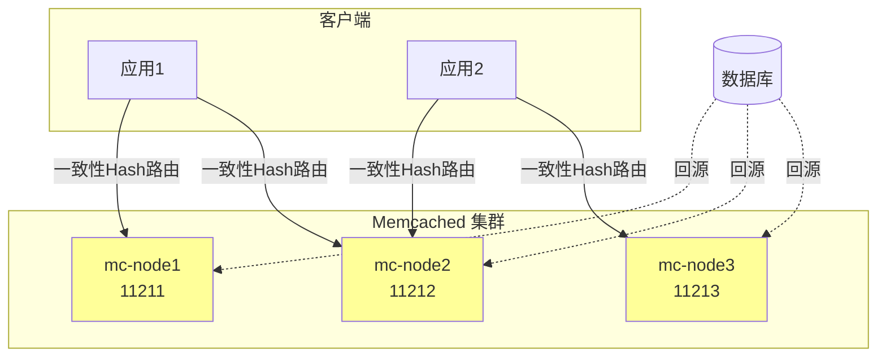
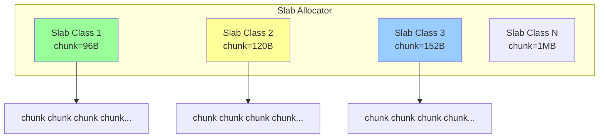
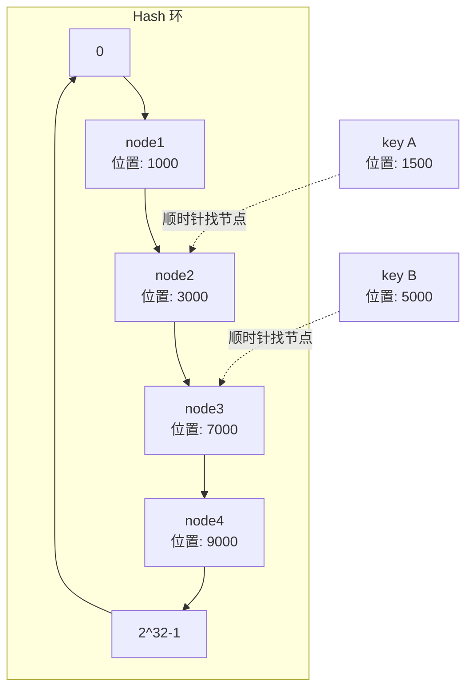

# Memcached 核心机制详解

> 高性能分布式内存缓存系统，深入理解 Slab Allocation、LRU 与一致性 Hash

---

## 📋 目录

- [1. Memcached 概述](#1-memcached-概述)
- [2. 内存管理（Slab Allocation）](#2-内存管理slab-allocation)
- [3. LRU 淘汰策略](#3-lru-淘汰策略)
- [4. 一致性 Hash 分布](#4-一致性-hash-分布)
- [5. 与 Redis 对比](#5-与-redis-对比)
- [6. 面试要点](#6-面试要点)

---

## 🎯 学习目标

通过本文档，你将掌握：
- ✅ Memcached 的 Slab Allocation 内存管理机制
- ✅ LRU 淘汰策略及其改进
- ✅ 一致性 Hash 在分布式缓存中的应用
- ✅ Memcached 与 Redis 的全面对比
- ✅ 面试高频考点

---

## 1. Memcached 概述

### 1.1 什么是 Memcached

**Memcached** 是一个高性能的、分布式内存对象缓存系统，通过缓存数据库查询结果、会话数据等减少数据库访问，提升动态 Web 应用性能。

### 1.2 核心特性

| 特性 | 说明 |
|------|------|
| **简单** | Key-Value 存储，协议简单 |
| **高性能** | 全内存操作，单机 QPS 可达 10 万+ |
| **分布式** | 客户端路由，服务端互不通信 |
| **多线程** | 主线程监听 + 工作线程处理 |
| **LRU 淘汰** | 满载时淘汰最少使用的数据 |

### 1.3 架构模型



**核心设计理念**：
- **服务端互不感知**：每个节点独立运行，不互相通信
- **客户端决定路由**：通过一致性 Hash 决定数据存储在哪个节点
- **纯内存**：不持久化、不复制，重启数据丢失

### 1.4 核心命令

```
# 存储命令
set key flags exptime bytes [noreply]  # 存储（覆盖）
add key flags exptime bytes           # 仅当key不存在时存储
replace key flags exptime bytes       # 仅当key存在时替换
cas key flags exptime bytes casunique # CAS乐观锁更新

# 读取命令
get key1 key2                         # 获取
gets key                              # 获取（带CAS标识）

# 删除命令
delete key

# 统计命令
stats                                 # 统计信息
stats items                           # slab统计
stats slabs                           # 内存分配统计
```

---

## 2. 内存管理（Slab Allocation）

### 2.1 为什么不用 malloc

传统内存分配（malloc/free）的问题：
- **内存碎片**：频繁分配释放产生大量碎片
- **分配效率低**：系统调用开销大
- **无法控制**：操作系统管理，不可预测

### 2.2 Slab Allocation 原理

Memcached 采用 **Slab Allocation** 机制，将内存按固定大小划分为**Slab Class**，每个 Class 内的 Chunk 大小相同。



**内存分配流程**：

```
1. 数据大小 100 字节
2. 找到 >= 100 字节的最小 chunk（如 120B 的 Slab Class 2）
3. 从该 Slab Class 分配一个空闲 chunk
4. 如果该 Slab 没有空闲 chunk，申请新的 Slab 页（1MB）
5. 切分为相同大小的 chunk 分配

注意：chunk 大小按 growth factor 增长（默认1.25倍）
```

### 2.3 Chunk 大小计算

```ini
# 启动参数配置
memcached -m 1024          # 总内存1GB
           -f 1.25          # chunk增长因子
           -n 48            # chunk初始大小+元数据(48字节)
           -I 1m            # 最大item大小
```

```
Slab Class 大小示例（growth_factor=1.25）：

Class 1:  96 bytes   (初始)
Class 2:  120 bytes  (96 × 1.25)
Class 3:  152 bytes  (120 × 1.25)
Class 4:  192 bytes
Class 5:  240 bytes
...
Class 42: 1MB (最大)

每个 chunk 包含：
- 数据本身
- 48 字节元数据（key、flags、指向链表的指针等）
```

### 2.4 Slab Allocation 的优缺点

**优点**：
- 无内存碎片（固定大小分配）
- 分配速度快（空闲链表）
- 内存利用率可控

**缺点**：
- **空间浪费**：100 字节数据放入 120 字节 chunk，浪费 20 字节
- **无法调整**：Slab Class 一旦分配，大小固定
- **chunk 固化**：某个 Slab 的 chunk 不能给其他 Slab 使用

### 2.5 查看 Slab 状态

```bash
# 查看各 slab 的统计
echo "stats slabs" | nc localhost 11211

# 输出示例：
# STAT 1:chunk_size 96
# STAT 1:chunks_per_page 10922
# STAT 1:total_pages 1
# STAT 1:total_chunks 10922
# STAT 1:used_chunks 5000
# STAT 1:free_chunks 5922
```

### 2.6 优化：调优增长因子

```bash
# 场景：缓存 value 大小差异大
# 默认 growth_factor=1.25 可能浪费空间
# 调小增长因子 → chunk 大小更密集，浪费少
memcached -f 1.05  # 增长因子调小

# 场景：缓存 value 大小接近（如会话）
# 使用默认即可
```

---

## 3. LRU 淘汰策略

### 3.1 LRU 基本原理

当内存满时，Memcached 采用 **LRU（Least Recently Used，最近最少使用）** 算法淘汰数据。

```mermaid
graph LR
    subgraph LRU 链表（按Slab Class独立）
        H[Head 最近访问] --> N1[key1]
        N1 --> N2[key2]
        N2 --> N3[key3]
        N3 --> N4[...]
        N4 --> T[Tail 最久未访问]
    end
    
    T -->|淘汰| DEL[删除]
    
    style H fill:#9f9
    style T fill:#f99
```

### 3.2 LRU 工作机制

```
访问数据时：
1. GET 命中 → 移到链表头部
2. SET 新数据 → 插入链表头部
3. 内存满 → 从链表尾部淘汰

关键：LRU 是按 Slab Class 独立维护的
     Class 1 满了只会淘汰 Class 1 的数据，不会影响其他 Class
```

### 3.3 LRU 的改进：Lazy Expiration + LRU

Memcached 采用**惰性过期**：不主动扫描过期 key，只在 GET 时检查时间戳。

```
过期检查流程：
1. GET key
2. 检查 exptime，若过期 → 当作未命中，返回空
3. 过期的 key 仍占空间，直到被 LRU 淘汰或被覆盖
```

### 3.4 现代 Memcached 的 LRU 改进

```c
// Memcached 1.5+ 引入分段 LRU：
// - TEMP_LRU：TTL 很短的数据（< 61秒）
// - HOT_LRU：刚写入的数据
// - WARM_LRU：访问过的数据
// - COLD_LRU：未被访问的数据

// 好处：避免短时数据冲刷长时缓存
```

### 3.5 Java 客户端示例

```java
public class MemcachedDemo {
    
    public static void main(String[] args) throws Exception {
        MemcachedClient client = new MemcachedClient(
            new InetSocketAddress("127.0.0.1", 11211));
        
        // 存储数据，TTL=3600秒
        Future<Boolean> f = client.set("user:1001", 3600, 
            "{\"name\":\"张三\",\"age\":25}");
        System.out.println("存储结果: " + f.get());
        
        // 读取数据
        Object value = client.get("user:1001");
        System.out.println("读取: " + value);
        
        // CAS 更新（乐观锁）
        CASValue<Object> cas = client.gets("user:1001");
        client.cas("user:1001", cas.getCas(), 3600, 
            "{\"name\":\"张三\",\"age\":26}");
        
        // 删除
        client.delete("user:1001");
        
        client.shutdown();
    }
}
```

---

## 4. 一致性 Hash 分布

### 4.1 普通 Hash 的问题

```
普通取模路由：hash(key) % N

问题：节点数 N 变化时，几乎所有 key 的路由都会改变
     → 大量缓存失效 → 缓存雪崩 → 数据库压力激增
```

### 4.2 一致性 Hash 原理

一致性 Hash 将整个 Hash 空间组织成虚拟的圆环（Hash 环）：



**路由规则**：计算 `hash(key)`，在环上**顺时针**找到的第一个节点。

### 4.3 虚拟节点解决数据倾斜

一致性 Hash 的问题：节点少时数据分布不均。

```
解决方案：虚拟节点（Virtual Node）

每个物理节点映射到多个虚拟节点（如 150 个）：

node1 → vnode1, vnode2, ..., vnode150
node2 → vnode151, vnode152, ..., vnode300
node3 → vnode301, vnode302, ..., vnode450

虚拟节点越多，数据分布越均匀
```

### 4.4 一致性 Hash 特性

| 特性 | 说明 |
|------|------|
| **单调性** | 增加节点只影响相邻区间的数据 |
| **平衡性** | 虚拟节点保证数据均匀分布 |
| **分散性** | 相同 key 路由到相同节点 |
| **负载均衡** | 节点宕机，其负载转移到相邻节点 |

**节点增减的影响**：

```
新增 node5（位置 5000）：
- 原本路由到 node3 的 key A（位置 1500）不受影响
- 位置在 3000-5000 之间的 key 从 node3 转移到 node5
- 影响范围：约 1/(N+1) 的数据

结论：节点变化只影响相邻区间，最小化缓存失效
```

### 4.5 Java 实现一致性 Hash

```java
public class ConsistentHash {
    
    private final TreeMap<Long, String> ring = new TreeMap<>();
    private final int virtualNodes = 150;  // 每个节点的虚拟节点数
    
    public void addNode(String node) {
        for (int i = 0; i < virtualNodes; i++) {
            long hash = hash(node + "-vn" + i);
            ring.put(hash, node);
        }
    }
    
    public void removeNode(String node) {
        for (int i = 0; i < virtualNodes; i++) {
            long hash = hash(node + "-vn" + i);
            ring.remove(hash);
        }
    }
    
    public String getNode(String key) {
        if (ring.isEmpty()) return null;
        long hash = hash(key);
        // 顺时针查找第一个 >= hash 的节点
        Map.Entry<Long, String> entry = ring.ceilingEntry(hash);
        if (entry == null) {
            entry = ring.firstEntry();  // 环回起点
        }
        return entry.getValue();
    }
    
    // 使用 MurmurHash 等分布均匀的哈希
    private long hash(String key) {
        return Hashing.murmur3_128().hashString(key, StandardCharsets.UTF_8).asLong();
    }
}
```

---

## 5. 与 Redis 对比

### 5.1 全面对比表

| 维度 | Memcached | Redis |
|------|-----------|-------|
| **数据结构** | 仅 Key-Value（String） | String/List/Hash/Set/ZSet 等 |
| **持久化** | 不支持 | RDB + AOF |
| **集群** | 客户端分片 | 原生 Cluster |
| **线程模型** | 多线程 | 单线程（6.0 多线程IO） |
| **内存管理** | Slab Allocation | jemalloc |
| **过期策略** | 惰性过期 + LRU | 惰性+定期过期，多种淘汰策略 |
| **事务** | 不支持（仅CAS） | 支持（MULTI/EXEC） |
| **发布订阅** | 不支持 | 支持 |
| **Lua脚本** | 不支持 | 支持 |
| **最大Value** | 1MB | 512MB |
| **性能** | 极高（多线程纯KV） | 高（丰富功能有额外开销） |

### 5.2 内存效率对比

```
存储相同数据（纯KV场景）：
- Memcached：Slab Allocation，元数据开销小，内存效率略高
- Redis：丰富的元数据（类型、引用计数、LRU字段等），开销略大

但 Redis 的数据结构（如 Hash 编码）在小数据场景可能更省内存
```

### 5.3 适用场景对比

```
选 Memcached：
✅ 纯 KV 缓存，无需复杂数据结构
✅ 多核利用率高（多线程）
✅ 极致简单，运维成本低
✅ 如：Session 缓存、简单查询结果缓存

选 Redis：
✅ 需要丰富数据结构（List、Set、ZSet）
✅ 需要持久化
✅ 需要发布订阅、Lua 脚本
✅ 需要分布式锁、限流
✅ 如：排行榜、计数器、消息队列、分布式锁
```

### 5.4 趋势

- Memcached 仍在使用，但新增项目多选 Redis
- Redis 功能丰富，逐步替代 Memcached 在多数场景
- Memcached 在纯 KV 极致性能场景仍有价值

---

## 6. 面试要点

### 6.1 高频问题

1. **Memcached 的内存管理机制是什么？**
   - Slab Allocation：按固定大小分组的 chunk 分配，避免碎片
   - 每个 Slab Class 的 chunk 大小按增长因子递增

2. **Slab Allocation 有什么缺点？**
   - 空间浪费：数据放入大于它的最小 chunk
   - chunk 固化：Slab 间不能共享 chunk
   - 需根据数据分布调优增长因子

3. **Memcached 如何实现分布式？**
   - 服务端互不通信，客户端通过一致性 Hash 路由
   - 一致性 Hash 保证节点增减时最小化缓存失效

4. **为什么需要虚拟节点？**
   - 节点少时数据分布不均，虚拟节点让分布更均匀

5. **Memcached 的过期策略是什么？**
   - 惰性过期：GET 时检查，不主动扫描
   - 满载时 LRU 淘汰（按 Slab Class 独立）

6. **Memcached 和 Redis 的核心区别？**
   - 数据结构、持久化、线程模型、集群方式（详见对比表）

7. **Memcached 为什么是多线程？**
   - 早期设计，利用多核；Redis 6.0 才引入多线程 IO

### 6.2 场景题

**Q：Memcached 集群某节点宕机，如何减少影响？**

答：①客户端一致性 Hash 自动将请求路由到下一个节点；②使用主从复制或客户端多写（一致性较低）；③结合本地缓存兜底；④监控告警快速恢复节点。注意 Memcached 本身不支持复制，需客户端或代理层实现。

### 6.3 知识延伸

- Memcached 的 Slab 思想影响了后续缓存系统设计
- 一致性 Hash 是分布式系统核心算法，广泛应用于 Redis Cluster、Dubbo 等

---

## 📚 相关阅读

- [Redis核心机制详解](./01_Redis核心机制详解.md)
- [缓存架构设计与实战](./02_缓存架构设计与实战.md)
- [Caffeine本地缓存](./04_Caffeine本地缓存.md)
- [多级缓存架构实战](./05_多级缓存架构实战.md)
- [MySQL核心机制详解](../03_数据库/04_MySQL核心机制详解.md)
- [分布式锁详解](../07_分布式系统/03_分布式锁详解.md)

---

**文档版本**: v1.0
**最后更新**: 2026-07-06
**关键词**：Memcached, Slab Allocation, LRU, 一致性Hash, 分布式缓存, Redis对比
