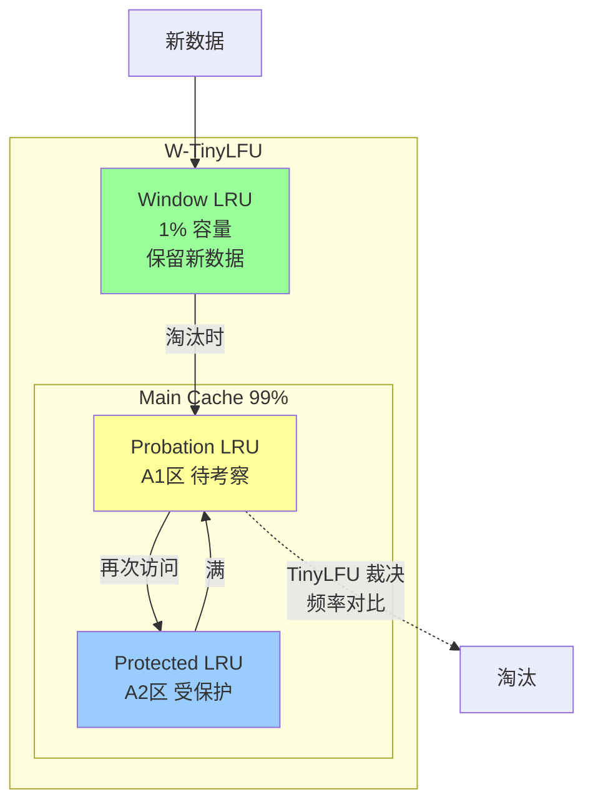

# Caffeine 本地缓存详解

> Java 8 时代最高性能的本地缓存库，深入理解 W-TinyLFU 算法与异步刷新机制

---

## 📋 目录

- [1. Caffeine 概述](#1-caffeine-概述)
- [2. W-TinyLFU 淘汰算法](#2-w-tinylfu-淘汰算法)
- [3. 异步刷新机制](#3-异步刷新机制)
- [4. 与 Guava Cache 对比](#4-与-guava-cache-对比)
- [5. Spring Boot 集成](#5-spring-boot-集成)
- [6. 性能基准测试](#6-性能基准测试)
- [7. 面试要点](#7-面试要点)

---

## 🎯 学习目标

通过本文档，你将掌握：
- ✅ Caffeine 的 W-TinyLFU 淘汰算法原理
- ✅ 异步刷新、异步加载机制
- ✅ Caffeine 与 Guava Cache 的对比与迁移
- ✅ Spring Boot 中集成 Caffeine 缓存
- ✅ 性能基准测试方法与调优
- ✅ 面试高频考点

---

## 1. Caffeine 概述

### 1.1 什么是 Caffeine

**Caffeine** 是一个基于 Java 8 的高性能本地缓存库，由 Guava Cache 的作者 Ben Manes 开发，被认为是 **Guava Cache 的继任者**，在读写性能、命中率上均有显著提升。

### 1.2 核心特性

| 特性 | 说明 |
|------|------|
| **高性能** | 读写性能优于 Guava Cache 约 30% |
| **高命中率** | W-TinyLFU 算法，命中率优于 LRU |
| **异步加载** | 基于 CompletableFuture 的异步刷新 |
| **灵活淘汰** | 基于容量/时间/权重 |
| **事件监听** | 写入/移除/驱逐事件回调 |
| **统计监控** | 命中率、加载耗时等指标 |

### 1.3 基本使用

```java
import com.github.benmanes.caffeine.cache.Cache;
import com.github.benmanes.caffeine.cache.Caffeine;

// 手动创建缓存
Cache<String, User> cache = Caffeine.newBuilder()
    .maximumSize(10_000)                    // 最大缓存条目
    .expireAfterWrite(10, TimeUnit.MINUTES) // 写入后10分钟过期
    .expireAfterAccess(5, TimeUnit.MINUTES) // 访问后5分钟过期
    .recordStats()                          // 开启统计
    .build();

// 写入
cache.put("user:1001", new User("张三", 25));

// 读取（不存在返回null）
User user = cache.getIfPresent("user:1001");

// 读取（不存在则加载）
User user2 = cache.get("user:1002", key -> loadFromDB(key));

// 删除
cache.invalidate("user:1001");

// 统计
CacheStats stats = cache.stats();
System.out.printf("命中率: %.2f%%, 平均加载时间: %.2fms%n",
    stats.hitRate() * 100, stats.averageLoadPenalty() / 1_000_000);
```

---

## 2. W-TinyLFU 淘汰算法

### 2.1 为什么不用传统 LRU

传统 LRU 的问题：

```
LRU 的两个经典失效场景：

1. 扫描访问（Scan Resistance）
   周期性全表扫描会冲刷热数据：
   缓存有 100 个热 key，扫描 1000 个冷 key 后，热 key 全被淘汰

2. 稀疏访问（Sparse Hits）
   偶尔访问的老数据占据缓存位置，真正的高频数据进不来

LRU 只看"最近"访问，无法识别"频率"，容易被一次性的冷数据冲刷
```

### 2.2 TinyLFU 与 Count-Min Sketch

Caffeine 的核心是 **W-TinyLFU（Window TinyLFU）** 算法，结合了**频率统计**和**近因性**。

**Count-Min Sketch 频率统计**：

```
Count-Min Sketch 是一种概率型数据结构，用多个哈希函数统计访问频率：

┌─────────────────────────────────────┐
│  哈希函数 h1: [0, 3, 1, 4, 2, ...]  │  ← 行1计数
│  哈希函数 h2: [2, 1, 4, 3, 0, ...]  │  ← 行2计数
│  哈希函数 h3: [1, 4, 2, 0, 3, ...]  │  ← 行3计数
│  哈希函数 h4: [3, 2, 0, 4, 1, ...]  │  ← 行4计数
└─────────────────────────────────────┘

查询 key 频率 = min(h1[key], h2[key], h3[key], h4[key])

优点：
- 空间极小（相比HashMap）
- 有自动衰减机制（定期减半），适应访问模式变化
```

### 2.3 W-TinyLFU 架构



**W-TinyLFU 工作流程**：

```
1. 新数据进入 Window LRU（1% 容量，保留近因性）
2. Window 满时，淘汰的数据进入 Probation（待考察区）
3. 当 Main Cache 满时，TinyLFU 比较：
   - 新进入者 vs Probation 尾部数据
   - 用 Count-Min Sketch 比较访问频率
   - 频率低的被淘汰
4. Probation 中被再次访问的数据晋升到 Protected（受保护区）
5. Protected 满时降级回 Probation

关键：结合 LRU（近因）+ LFU（频率），兼顾近期和长期热点
```

### 2.4 命中率对比

```
缓存命中率对比（相同工作负载）：

┌──────────────┬─────────┬──────────┬──────────┐
│ 算法         │ LRU     │ LFU      │ W-TinyLFU│
├──────────────┼─────────┼──────────┼──────────┤
│ 循环访问     │ 0%      │ 高       │ 高       │
│ 扫描+热点    │ 低      │ 中       │ 高       │
│ Zipf 分布    │ 中      │ 中高     │ 最高     │
│ 真实业务     │ 中      │ 中       │ 最高     │
└──────────────┴─────────┴──────────┴──────────┘

W-TinyLFU 在多数场景命中率优于 LRU 约 20-30%
```

---

## 3. 异步刷新机制

### 3.1 同步 vs 异步刷新

```
同步刷新（Guava Cache）：
1. 读请求发现 key 过期
2. 阻塞当前线程加载新值
3. 其他线程等待或返回旧值
→ 高并发下可能阻塞

异步刷新（Caffeine）：
1. 读请求发现 key 过过期的"软"时间
2. 立即返回旧值（如果有）
3. 后台异步加载新值
4. 加载完成后替换
→ 无阻塞，用户体验好
```

### 3.2 异步加载 API

```java
import com.github.benmanes.caffeine.cache.AsyncLoadingCache;

// 异步加载缓存
AsyncLoadingCache<String, User> asyncCache = Caffeine.newBuilder()
    .maximumSize(10_000)
    .refreshAfterWrite(1, TimeUnit.MINUTES)  // 写后1分钟刷新
    .buildAsync(key -> {
        // 返回 CompletableFuture
        return CompletableFuture.supplyAsync(() -> loadFromDB(key));
    });

// 异步获取
CompletableFuture<User> future = asyncCache.get("user:1001");
future.thenAccept(user -> System.out.println("获取到: " + user));

// 阻塞获取
User user = asyncCache.get("user:1001").join();
```

### 3.3 refreshAfterWrite vs expireAfterWrite

```java
Caffeine.newBuilder()
    // 写入后10分钟过期：到期后必须重新加载，期间返回null或阻塞
    .expireAfterWrite(10, TimeUnit.MINUTES)
    
    // 写入后10分钟刷新：到期后返回旧值，异步刷新
    // 永远不会返回null（除非第一次加载）
    .refreshAfterWrite(10, TimeUnit.MINUTES)
    .build(key -> loadFromDB(key));
```

| 机制 | 过期后行为 | 适用场景 |
|------|-----------|---------|
| `expireAfterWrite` | 删除，下次访问阻塞加载 | 数据变化敏感，能容忍延迟 |
| `refreshAfterWrite` | 返回旧值，后台异步刷新 | 允许短期脏数据，要求低延迟 |
| 两者组合 | 先刷新后过期，兼顾新鲜与可用 | 推荐生产实践 |

### 3.4 LoadingCache 完整示例

```java
public class UserCacheService {
    
    private final LoadingCache<String, User> userCache;
    
    public UserCacheService(UserRepository userRepo) {
        this.userCache = Caffeine.newBuilder()
            .maximumSize(10_000)
            .expireAfterWrite(30, TimeUnit.MINUTES)   // 30分钟过期
            .refreshAfterWrite(10, TimeUnit.MINUTES)  // 10分钟刷新
            .recordStats()
            .build(key -> userRepo.findById(key)
                .orElseThrow(() -> new RuntimeException("用户不存在: " + key)));
    }
    
    public User getUser(String userId) {
        return userCache.get(userId);
    }
    
    public void invalidateUser(String userId) {
        userCache.invalidate(userId);  // 主动失效
    }
    
    public void printStats() {
        CacheStats stats = userCache.stats();
        System.out.printf("命中率=%.2f%%, 加载次数=%d, 淘汰数=%d%n",
            stats.hitRate() * 100,
            stats.loadCount(),
            stats.evictionCount());
    }
}
```

---

## 4. 与 Guava Cache 对比

### 4.1 Caffeine 是 Guava Cache 的进化

Caffeine 由 Guava Cache 原作者开发，API 高度相似，迁移成本低。

### 4.2 核心对比

| 维度 | Guava Cache | Caffeine |
|------|-------------|----------|
| **淘汰算法** | LRU（Segmented LRU） | W-TinyLFU |
| **命中率** | 基准 | 高 20-30% |
| **读写性能** | 基准 | 快约 30% |
| **异步支持** | ListenableFuture | CompletableFuture |
| **并发模型** | Segment 分段锁 | RingBuffer + 无锁 |
| **Java 版本** | Java 6+ | Java 8+ |
| **维护状态** | 维护模式 | 活跃开发 |
| **统计** | 基础 | 更详细 |

### 4.3 API 迁移对照

```java
// Guava Cache
LoadingCache<String, User> guavaCache = CacheBuilder.newBuilder()
    .maximumSize(10_000)
    .expireAfterWrite(10, TimeUnit.MINUTES)
    .recordStats()
    .build(CacheLoader.from(key -> loadFromDB(key)));

// Caffeine（API几乎一致）
LoadingCache<String, User> caffeineCache = Caffeine.newBuilder()
    .maximumSize(10_000)
    .expireAfterWrite(10, TimeUnit.MINUTES)
    .recordStats()
    .build(key -> loadFromDB(key));
```

### 4.4 性能对比（读写吞吐）

```
读写吞吐对比（ops/s，越高越好）：

┌──────────────┬────────────┬────────────┐
│ 操作         │ Guava      │ Caffeine   │
├──────────────┼────────────┼────────────┤
│ 读（命中）   │ 35M        │ 60M+       │
│ 读（未命中） │ 5M         │ 8M         │
│ 写           │ 8M         │ 15M        │
└──────────────┴────────────┴────────────┘

Caffeine 利用 Java 8 的 RingBuffer 和优化后的并发策略，
减少锁竞争，显著提升吞吐量
```

### 4.5 迁移建议

```
迁移路径：
1. Maven 依赖替换：guava → caffeine
2. 导包替换：com.google.common.cache → com.github.benmanes.caffeine.cache
3. API 几乎无需改动
4. 建议迁移至 Caffeine（Guava 已不推荐用于新项目缓存）
```

---

## 5. Spring Boot 集成

### 5.1 依赖配置

```xml
<!-- pom.xml -->
<dependency>
    <groupId>org.springframework.boot</groupId>
    <artifactId>spring-boot-starter-cache</artifactId>
</dependency>
<dependency>
    <groupId>com.github.ben-manes.caffeine</groupId>
    <artifactId>caffeine</artifactId>
</dependency>
```

### 5.2 配置方式

**方式一：application.yml 配置**

```yaml
spring:
  cache:
    type: caffeine
    caffeine:
      spec: maximumSize=10000,expireAfterWrite=10m,recordStats
```

**方式二：Java Config（推荐，更灵活）**

```java
@Configuration
@EnableCaching
public class CacheConfig {
    
    @Bean
    public CaffeineCacheManager cacheManager() {
        CaffeineCacheManager manager = new CaffeineCacheManager();
        manager.setCaffeine(Caffeine.newBuilder()
            .maximumSize(10_000)
            .expireAfterWrite(30, TimeUnit.MINUTES)
            .refreshAfterWrite(10, TimeUnit.MINUTES)
            .recordStats());
        return manager;
    }
    
    // 多缓存空间配置（不同缓存不同策略）
    @Bean
    public CacheManager multiCacheManager() {
        CaffeineCacheManager manager = new CaffeineCacheManager();
        
        // 用户缓存：30分钟过期
        manager.registerCustomCache("users", Caffeine.newBuilder()
            .maximumSize(5_000)
            .expireAfterWrite(30, TimeUnit.MINUTES)
            .build());
        
        // 配置缓存：1小时过期
        manager.registerCustomCache("configs", Caffeine.newBuilder()
            .maximumSize(1_000)
            .expireAfterWrite(1, TimeUnit.HOURS)
            .build());
        
        return manager;
    }
}
```

### 5.3 注解使用

```java
@Service
public class UserService {
    
    // 查询时查缓存，不存在则执行方法并存入缓存
    @Cacheable(value = "users", key = "#userId")
    public User getUser(String userId) {
        return userRepository.findById(userId).orElse(null);
    }
    
    // 更新时刷新缓存
    @CachePut(value = "users", key = "#user.id")
    public User updateUser(User user) {
        return userRepository.save(user);
    }
    
    // 删除时清除缓存
    @CacheEvict(value = "users", key = "#userId")
    public void deleteUser(String userId) {
        userRepository.deleteById(userId);
    }
    
    // 清除该缓存空间所有
    @CacheEvict(value = "users", allEntries = true)
    public void clearAllUsers() {}
}
```

### 5.4 监控统计

```java
@RestController
@RequestMapping("/cache/stats")
public class CacheStatsController {
    
    @Autowired
    private CacheManager cacheManager;
    
    @GetMapping
    public Map<String, Object> stats() {
        Map<String, Object> result = new HashMap<>();
        cacheManager.getCacheNames().forEach(name -> {
            CaffeineCache cache = (CaffeineCache) cacheManager.getCache(name);
            CacheStats stats = cache.getNativeCache().stats();
            result.put(name, Map.of(
                "hitRate", stats.hitRate(),
                "hitCount", stats.hitCount(),
                "missCount", stats.missCount(),
                "evictionCount", stats.evictionCount(),
                "loadCount", stats.loadCount()
            ));
        });
        return result;
    }
}
```

---

## 6. 性能基准测试

### 6.1 JMH 基准测试

```java
@BenchmarkMode(Mode.Throughput)
@OutputTimeUnit(TimeUnit.SECONDS)
@State(Scope.Thread)
public class CacheBenchmark {
    
    private Cache<String, String> caffeineCache;
    private com.google.common.cache.Cache<String, String> guavaCache;
    private String[] keys;
    
    @Setup
    public void setup() {
        caffeineCache = Caffeine.newBuilder()
            .maximumSize(10_000)
            .build();
        
        guavaCache = com.google.common.cache.CacheBuilder.newBuilder()
            .maximumSize(10_000)
            .build();
        
        keys = new String[10_000];
        for (int i = 0; i < 10_000; i++) {
            keys[i] = "key-" + i;
            caffeineCache.put(keys[i], "value-" + i);
            guavaCache.put(keys[i], "value-" + i);
        }
    }
    
    @Benchmark
    public String caffeineRead() {
        return caffeineCache.getIfPresent(keys[ThreadLocalRandom.current().nextInt(10_000)]);
    }
    
    @Benchmark
    public String guavaRead() {
        return guavaCache.getIfPresent(keys[ThreadLocalRandom.current().nextInt(10_000)]);
    }
    
    @Benchmark
    public void caffeineWrite() {
        caffeineCache.put("bench-" + System.nanoTime(), "value");
    }
    
    @Benchmark
    public void guavaWrite() {
        guavaCache.put("bench-" + System.nanoTime(), "value");
    }
}
```

### 6.2 典型测试结果

```
8核16G 环境，10万条缓存，基准测试结果：

Caffeine 读：约 80M ops/s
Guava   读：约 50M ops/s
Caffeine 写：约 20M ops/s
Guava   写：约 12M ops/s

Caffeine 读写性能约为 Guava 的 1.5-1.6 倍
```

### 6.3 调优建议

```
1. 合理设置 maximumSize
   - 过大：占用内存，GC 压力
   - 过小：命中率低
   - 建议根据可用内存和数据大小估算

2. 组合使用 expireAfterWrite + refreshAfterWrite
   - expireAfterWrite > refreshAfterWrite
   - 既保证新鲜度又避免阻塞

3. 开启 recordStats 监控命中率
   - 命中率低于 80% 需调优容量或过期时间

4. 高并发场景考虑异步加载
   - 使用 AsyncLoadingCache 避免加载阻塞

5. 序列化优化
   - 本地缓存存对象引用，无需序列化
   - 但注意对象可变性，必要时返回副本
```

---

## 7. 面试要点

### 7.1 高频问题

1. **Caffeine 的 W-TinyLFU 算法是什么？**
   - 结合 LRU（近因）和 LFU（频率）的淘汰算法
   - 用 Count-Min Sketch 统计频率（空间小，有衰减）
   - Window LRU 保留新数据，Main Cache 按频率淘汰
   - 命中率比 LRU 高约 20-30%

2. **Count-Min Sketch 是什么？**
   - 概率型频率统计数据结构，多个哈希函数
   - 取最小值减少高估，定期衰减适应访问模式变化

3. **refreshAfterWrite 和 expireAfterWrite 的区别？**
   - refresh：返回旧值，异步刷新，不阻塞
   - expire：删除数据，下次访问阻塞加载
   - 推荐组合使用

4. **Caffeine 为什么比 Guava Cache 快？**
   - W-TinyLFU 命中率更高
   - RingBuffer + 无锁并发模型，减少锁竞争
   - Java 8 优化（CompletableFuture 等）

5. **Caffeine 和 Redis 的区别？**
   - Caffeine 是本地缓存（JVM 内存），Redis 是分布式缓存
   - Caffeine 速度更快但数据不共享
   - 生产中常组合使用（多级缓存）

6. **本地缓存有哪些常见问题？**
   - 数据不一致（多实例各自缓存）
   - 内存占用（需限制大小）
   - 重启丢失
   - 解决：多级缓存 + 消息通知失效

### 7.2 场景题

**Q：用户信息频繁读取，如何用 Caffeine 优化？**

答：①用 `@Cacheable` 注解 + Caffeine 缓存用户数据；②设置 `refreshAfterWrite=10m` + `expireAfterWrite=30m`，保证新鲜度且不阻塞；③开启 `recordStats` 监控命中率；④用户更新时用 `@CachePut` 刷新缓存；⑤容量根据用户量和内存估算。

### 7.3 知识延伸

- W-TinyLFU 论文：《TinyLFU: A Highly Efficient Cache Admission Policy》
- Caffeine 设计文档：https://github.com/ben-manes/caffeine/wiki
- 与多级缓存架构的关系：Caffeine 作为 L1 本地缓存

---

## 📚 相关阅读

- [Redis核心机制详解](./01_Redis核心机制详解.md)
- [缓存架构设计与实战](./02_缓存架构设计与实战.md)
- [Memcached核心机制](./03_Memcached核心机制.md)
- [多级缓存架构实战](./05_多级缓存架构实战.md)
- [JVM调优实战](../11_性能优化/01_JVM调优实战.md)
- [性能监控与系统优化](../11_性能优化/02_性能监控与系统优化.md)

---

**文档版本**: v1.0
**最后更新**: 2026-07-06
**关键词**：Caffeine, W-TinyLFU, Count-Min Sketch, 本地缓存, Guava Cache, Spring Boot缓存, 异步刷新
