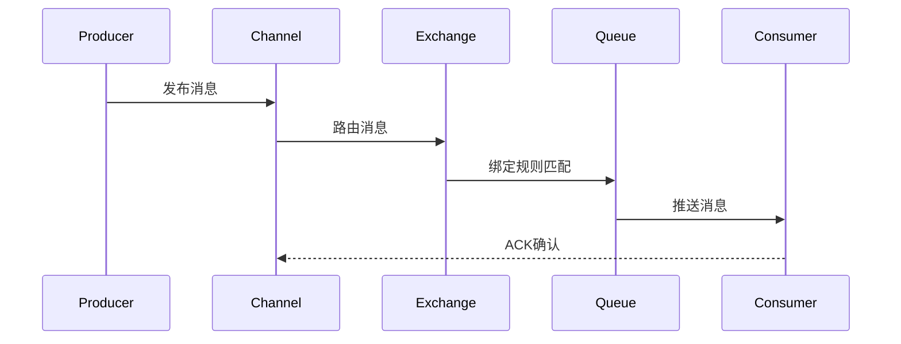

# RabbitMQ核心机制与实战

> 深入理解消息中间件的架构设计、交换机类型与高级特性

## 📋 目录

1. [RabbitMQ架构设计](#1-rabbitmq架构设计)
2. [核心概念解析](#2-核心概念解析)
3. [交换机类型详解](#3-交换机类型详解)
4. [消息路由机制](#4-消息路由机制)
5. [高级特性](#5-高级特性)
6. [可靠性保障](#6-可靠性保障)
7. [集群与高可用](#7-集群与高可用)
8. [性能优化实践](#8-性能优化实践)
9. [与Kafka对比分析](#9-与kafka对比分析)

---

## 1. RabbitMQ架构设计

### 1.1 整体架构

RabbitMQ基于AMQP协议实现，采用分层架构设计：

```
生产者 → 连接层(Connection/Channel) → 交换机(Exchange) → 队列(Queue) → 消费者
```

核心组件交互流程：


### 1.2 技术栈组成

- **服务器端**：Erlang语言开发，基于Open Telecom Platform框架
- **客户端**：多语言SDK支持（Java、Python、Go等）
- **协议支持**：AMQP 0-9-1、MQTT、STOMP
- **存储引擎**：默认使用RAM+磁盘持久化

---

## 2. 核心概念解析

### 2.1 核心组件

| 组件 | 说明 | 作用 |
|------|------|------|
| **Broker** | RabbitMQ服务器实例 | 接收和转发消息 |
| **Virtual Host** | 虚拟主机 | 实现多租户隔离 |
| **Connection** | TCP连接 | 客户端与Broker的连接 |
| **Channel** | 信道 | 轻量级连接，复用TCP连接 |
| **Exchange** | 交换机 | 接收消息并路由到队列 |
| **Queue** | 队列 | 存储消息的缓冲区 |
| **Binding** | 绑定 | 交换机与队列的关联规则 |
| **Routing Key** | 路由键 | 消息路由的匹配关键字 |
| **Message** | 消息 | 包含有效载荷和属性的数据包 |

### 2.2 消息结构

```java
// Java客户端消息结构示例
AMQP.BasicProperties properties = new AMQP.BasicProperties
    .Builder()
    .contentType("application/json") // 消息类型
    .deliveryMode(2) // 2=持久化,1=非持久化
    .priority(5) // 优先级(0-9)
    .expiration("60000") // 过期时间(ms)
    .messageId(UUID.randomUUID().toString())
    .timestamp(new Date())
    .build();

channel.basicPublish(exchange, routingKey, properties, messageBody.getBytes());
```

---

## 3. 交换机类型详解

### 3.1 Direct Exchange（直接交换机）

**特点**：精确匹配路由键

**适用场景**：一对一消息传递

```java
// 声明Direct交换机
channel.exchangeDeclare("direct.exchange", BuiltinExchangeType.DIRECT, true);

// 绑定队列到交换机（精确匹配路由键）
channel.queueBind("order.queue", "direct.exchange", "order.routing.key");

// 发送消息（指定路由键）
channel.basicPublish("direct.exchange", "order.routing.key", null, "订单消息".getBytes());
```

### 3.2 Topic Exchange（主题交换机）

**特点**：模糊匹配路由键，支持通配符
- `*`：匹配一个单词
- `#`：匹配零个或多个单词

**适用场景**：多条件路由、分类消息

```java
// 声明Topic交换机
channel.exchangeDeclare("topic.exchange", BuiltinExchangeType.TOPIC, true);

// 绑定队列（支持通配符）
channel.queueBind("log.error.queue", "topic.exchange", "log.error.*");
channel.queueBind("log.all.queue", "topic.exchange", "log.#");

// 发送消息
channel.basicPublish("topic.exchange", "log.error.order", null, "订单错误日志".getBytes());
channel.basicPublish("topic.exchange", "log.info.user", null, "用户信息日志".getBytes());
```

### 3.3 Fanout Exchange（扇形交换机）

**特点**：忽略路由键，广播消息到所有绑定队列

**适用场景**：一对多广播、发布订阅模式

```java
// 声明Fanout交换机
channel.exchangeDeclare("fanout.exchange", BuiltinExchangeType.FANOUT, true);

// 绑定多个队列
channel.queueBind("queue1", "fanout.exchange", ""); // 路由键可忽略
channel.queueBind("queue2", "fanout.exchange", "");
channel.queueBind("queue3", "fanout.exchange", "");

// 发送消息（路由键无效）
channel.basicPublish("fanout.exchange", "ignored.routing.key", null, "广播消息".getBytes());
```

### 3.4 Headers Exchange（头交换机）

**特点**：基于消息头属性匹配，忽略路由键

**适用场景**：复杂属性路由

```java
// 声明Headers交换机
channel.exchangeDeclare("headers.exchange", BuiltinExchangeType.HEADERS, true);

// 绑定队列（匹配消息头）
Map<String, Object> headers = new HashMap<>();
headers.put("type", "payment");
headers.put("priority", "high");
channel.queueBind("payment.queue", "headers.exchange", "", headers);

// 发送消息（设置消息头）
AMQP.BasicProperties properties = new AMQP.BasicProperties
    .Builder()
    .headers(headers)
    .build();
channel.basicPublish("headers.exchange", "", properties, "支付消息".getBytes());
```

---

## 4. 消息路由机制

### 4.1 路由流程

1. 生产者发送消息到交换机，指定路由键
2. 交换机根据类型和绑定规则匹配队列
3. 消息存入匹配的队列
4. 消费者从队列获取消息

### 4.2 绑定规则优先级

1. 直接匹配 > 通配符匹配 > 广播
2. 多个匹配规则时，消息会被路由到所有匹配队列
3. 未匹配任何队列的消息将被丢弃（可配置备份交换机）

### 4.3 死信路由

处理无法投递的消息：

```java
// 声明死信交换机和队列
channel.exchangeDeclare("dlx.exchange", BuiltinExchangeType.DIRECT, true);
channel.queueDeclare("dlx.queue", true, false, false, null);
channel.queueBind("dlx.queue", "dlx.exchange", "dlx.routing.key");

// 声明普通队列并关联死信交换机
Map<String, Object> queueArgs = new HashMap<>();
queueArgs.put("x-dead-letter-exchange", "dlx.exchange");
queueArgs.put("x-dead-letter-routing-key", "dlx.routing.key");
queueArgs.put("x-message-ttl", 60000); // 消息过期时间
channel.queueDeclare("normal.queue", true, false, false, queueArgs);
```

---

## 5. 高级特性

### 5.1 消息确认机制

**生产者确认**：

```java
// 开启确认模式
channel.confirmSelect();

// 单个确认
channel.basicPublish(exchange, routingKey, null, message.getBytes());
if (channel.waitForConfirms()) {
    // 消息成功投递
}

// 批量确认
channel.confirmSelect();
for (int i = 0; i < 100; i++) {
    channel.basicPublish(exchange, routingKey, null, ("消息" + i).getBytes());
}
if (channel.waitForConfirms()) {
    // 批量消息成功投递
}
```

**消费者确认**：

```java
// 手动确认模式
channel.basicConsume("queue.name", false, new DefaultConsumer(channel) {
    @Override
    public void handleDelivery(String consumerTag, Envelope envelope, 
                              AMQP.BasicProperties properties, byte[] body) throws IOException {
        try {
            // 处理消息
            String message = new String(body, StandardCharsets.UTF_8);
            System.out.println("收到消息: " + message);
            
            // 手动确认消息（第二个参数：是否批量确认）
            channel.basicAck(envelope.getDeliveryTag(), false);
        } catch (Exception e) {
            // 拒绝消息并重新入队（第三个参数：是否重新入队）
            channel.basicNack(envelope.getDeliveryTag(), false, true);
        }
    }
});
```

### 5.2 消息持久化

```java
// 1. 交换机持久化（durable=true）
channel.exchangeDeclare("persistent.exchange", BuiltinExchangeType.DIRECT, true);

// 2. 队列持久化（durable=true）
channel.queueDeclare("persistent.queue", true, false, false, null);

// 3. 消息持久化（deliveryMode=2）
AMQP.BasicProperties properties = new AMQP.BasicProperties
    .Builder()
    .deliveryMode(2) // 持久化消息
    .build();
channel.basicPublish("persistent.exchange", "persistent.key", properties, "持久化消息".getBytes());
```

### 5.3 流量控制

**消费者限流**：

```java
// 限流设置（prefetchCount=10：每次最多接收10条未确认消息）
channel.basicQos(10);

// 手动确认模式下生效
channel.basicConsume("queue.name", false, consumer);
```

---

## 6. 可靠性保障

### 6.1 消息不丢失方案

1. **生产者保障**：
   - 使用事务或确认机制
   - 重试机制
   - 备份交换机

2. **Broker保障**：
   - 交换机、队列、消息持久化
   - 集群部署

3. **消费者保障**：
   - 手动确认
   - 消息幂等处理

### 6.2 消息幂等性处理

**实现方案**：
- 唯一消息ID + Redis去重
- 数据库唯一约束
- 状态机控制

```java
// 消息幂等处理示例
String messageId = properties.getMessageId();
if (redisTemplate.opsForValue().setIfAbsent("msg:" + messageId, "processed", 24, TimeUnit.HOURS)) {
    // 处理消息
    processMessage(body);
} else {
    // 重复消息，直接确认
    channel.basicAck(envelope.getDeliveryTag(), false);
}
```

---

## 7. 集群与高可用

### 7.1 集群架构

**三种节点类型**：
- 磁盘节点（存储元数据和消息）
- 内存节点（仅存储元数据）
- 仲裁节点（仅参与投票，不存储数据）

**集群搭建**：
```bash
# 节点1
rabbitmq-server -detached
rabbitmqctl add_user admin password
rabbitmqctl set_user_tags admin administrator
rabbitmqctl set_permissions -p / admin ".*" ".*" ".*"

# 节点2（加入集群）
rabbitmq-server -detached
rabbitmqctl stop_app
rabbitmqctl reset
rabbitmqctl join_cluster rabbit@node1
rabbitmqctl start_app
```

### 7.2 镜像队列

实现队列高可用：

```bash
# 配置镜像队列策略
rabbitmqctl set_policy ha-all "^ha." '{"ha-mode":"all","ha-sync-mode":"automatic"}'
```

**策略参数**：
- `ha-mode: all`：所有节点都镜像
- `ha-mode: exactly`：指定数量节点镜像
- `ha-mode: nodes`：指定节点列表

---

## 8. 性能优化实践

### 8.1 连接优化
- 使用信道池复用TCP连接
- 合理设置连接超时时间
- 避免频繁创建销毁连接

### 8.2 队列优化
- 合理设置队列长度限制
- 使用惰性队列存储大量消息
- 定期清理无用队列

### 8.3 消息优化
- 消息体压缩
- 批量发送消息
- 避免超大消息（建议<128KB）

### 8.4 监控指标
- 消息吞吐量（messages/s）
- 队列长度
- 消费者数量
- 确认延迟

---

## 9. 与Kafka对比分析

| 特性 | RabbitMQ | Kafka |
|------|----------|-------|
| 消息模型 | 交换机-队列模型 | 主题-分区模型 |
| 吞吐量 | 中等（万级/秒） | 高（十万级/秒） |
| 延迟消息 | 原生支持 | 需要额外实现 |
| 消息顺序 | 单队列有序 | 分区内有序 |
| 持久化 | 磁盘持久化 | 日志文件持久化 |
| 适用场景 | 业务消息、即时通讯 | 日志收集、大数据处理 |
| 复杂度 | 中 | 高 |

---

## 📚 参考资源

- [RabbitMQ官方文档](https://www.rabbitmq.com/documentation.html)
- [RabbitMQ实战指南](https://book.douban.com/subject/27129006/)
- [Spring AMQP参考文档](https://docs.spring.io/spring-amqp/docs/current/reference/html/)