# RocketMQ 核心机制详解

## 目录
- [1. RocketMQ 架构概览](#1-rocketmq-架构概览)
- [2. 消息发送流程](#2-消息发送流程)
- [3. 消息存储机制](#3-消息存储机制)
- [4. 消息消费流程](#4-消息消费流程)
- [5. NameServer 路由机制](#5-nameserver-路由机制)
- [6. 主从同步机制](#6-主从同步机制)
- [7. 消息过滤机制](#7-消息过滤机制)
- [8. 事务消息机制](#8-事务消息机制)
- [9. 延迟消息机制](#9-延迟消息机制)
- [10. 消息重试与死信队列](#10-消息重试与死信队列)

---

## 1. RocketMQ 架构概览

### 1.1 核心组件

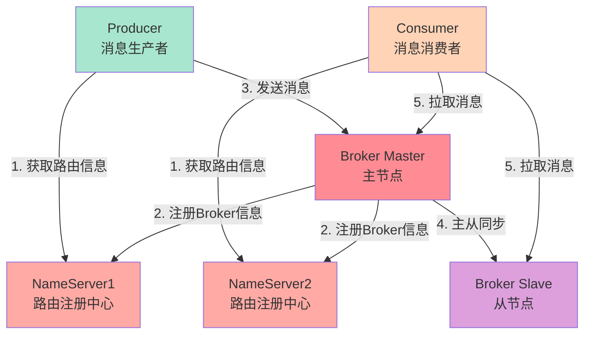
```mermaid
graph TB
    Producer[Producer<br/>消息生产者]
    Consumer[Consumer<br/>消息消费者]
    NameServer1[NameServer1<br/>路由注册中心]
    NameServer2[NameServer2<br/>路由注册中心]
    Broker-M[Broker Master<br/>主节点]
    Broker-S[Broker Slave<br/>从节点]
    
    Producer -->|1. 获取路由信息| NameServer1
    Consumer -->|1. 获取路由信息| NameServer2
    Broker-M -->|2. 注册Broker信息| NameServer1
    Broker-M -->|2. 注册Broker信息| NameServer2
    Producer -->|3. 发送消息| Broker-M
    Broker-M -->|4. 主从同步| Broker-S
    Consumer -->|5. 拉取消息| Broker-M
    Consumer -->|5. 拉取消息| Broker-S
    
    style Producer fill:#a8e6cf
    style Consumer fill:#ffd3b6
    style NameServer1 fill:#ffaaa5
    style NameServer2 fill:#ffaaa5
    style Broker-M fill:#ff8b94
    style Broker-S fill:#dda0dd
```

### 1.2 组件职责

| 组件 | 职责 | 特点 |
|------|------|------|
| **Producer** | 消息生产者 | 支持同步/异步/单向发送 |
| **Consumer** | 消息消费者 | 支持Push/Pull两种模式 |
| **Broker** | 消息存储与转发 | 负责消息存储、投递、查询 |
| **NameServer** | 路由注册中心 | 轻量级、无状态、集群部署 |

---

## 2. 消息发送流程

### 2.1 发送流程详解

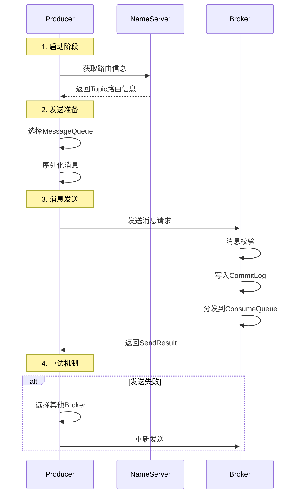
```mermaid
sequenceDiagram
    participant P as Producer
    participant NS as NameServer
    participant B as Broker
    
    Note over P: 1. 启动阶段
    P->>NS: 获取路由信息
    NS-->>P: 返回Topic路由信息
    
    Note over P: 2. 发送准备
    P->>P: 选择MessageQueue
    P->>P: 序列化消息
    
    Note over P: 3. 消息发送
    P->>B: 发送消息请求
    B->>B: 消息校验
    B->>B: 写入CommitLog
    B->>B: 分发到ConsumeQueue
    B-->>P: 返回SendResult
    
    Note over P: 4. 重试机制
    alt 发送失败
        P->>P: 选择其他Broker
        P->>B: 重新发送
    end
```

### 2.2 发送方式对比

| 发送方式 | 可靠性 | 性能 | 使用场景 |
|---------|-------|------|---------|
| **同步发送** | 高 | 低 | 重要通知、订单消息 |
| **异步发送** | 中 | 高 | 日志收集、监控数据 |
| **单向发送** | 低 | 最高 | 不重要的日志 |

### 2.3 消息发送核心代码流程

```java
// Producer发送消息核心流程
public class MessageSendingFlow {
    
    // 1. 路由选择
    private MessageQueue selectMessageQueue(TopicPublishInfo tpInfo) {
        // 轮询选择或故障规避选择
        return tpInfo.selectOneMessageQueue();
    }
    
    // 2. 消息发送
    public SendResult send(Message msg) {
        // 2.1 获取路由信息
        TopicPublishInfo topicInfo = getTopicPublishInfo(msg.getTopic());
        
        // 2.2 选择队列
        MessageQueue mq = selectMessageQueue(topicInfo);
        
        // 2.3 发送消息（带重试）
        for (int times = 0; times < retryTimes; times++) {
            try {
                SendResult result = sendMessage(mq, msg);
                return result;
            } catch (Exception e) {
                // 选择新队列重试
                mq = selectMessageQueue(topicInfo);
            }
        }
    }
}
```

---

## 3. 消息存储机制

### 3.1 存储架构

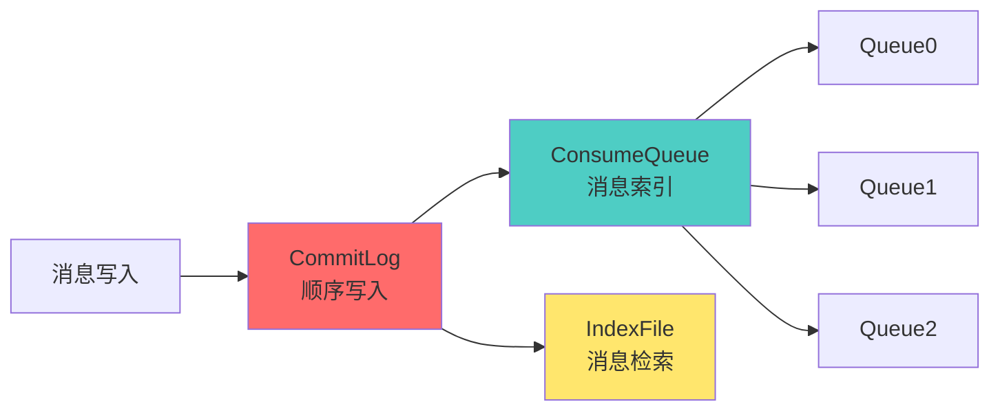
```mermaid
graph LR
    A[消息写入] --> B[CommitLog<br/>顺序写入]
    B --> C[ConsumeQueue<br/>消息索引]
    B --> D[IndexFile<br/>消息检索]
    
    C --> E[Queue0]
    C --> F[Queue1]
    C --> G[Queue2]
    
    style B fill:#ff6b6b
    style C fill:#4ecdc4
    style D fill:#ffe66d
```

### 3.2 三层存储结构

#### 3.2.1 CommitLog（核心）

```
特点：
├── 所有消息顺序写入同一个文件
├── 单个文件大小：1GB
├── 文件名：起始偏移量（20位，左补0）
├── 顺序写入，性能极高
└── 格式：[消息长度][消息体][CRC校验]
```

#### 3.2.2 ConsumeQueue（索引）

```
特点：
├── 每个Topic的每个Queue一个ConsumeQueue
├── 存储消息在CommitLog的偏移量
├── 单条记录：20字节（8字节偏移+4字节大小+8字节Tag哈希）
├── 加速消息消费
└── 文件大小：30万条记录
```

#### 3.2.3 IndexFile（检索）

```
特点：
├── 支持按Key或时间查询
├── Hash索引结构
├── 单文件：2000万条索引
└── 用于消息追踪和问题排查
```

### 3.3 存储流程

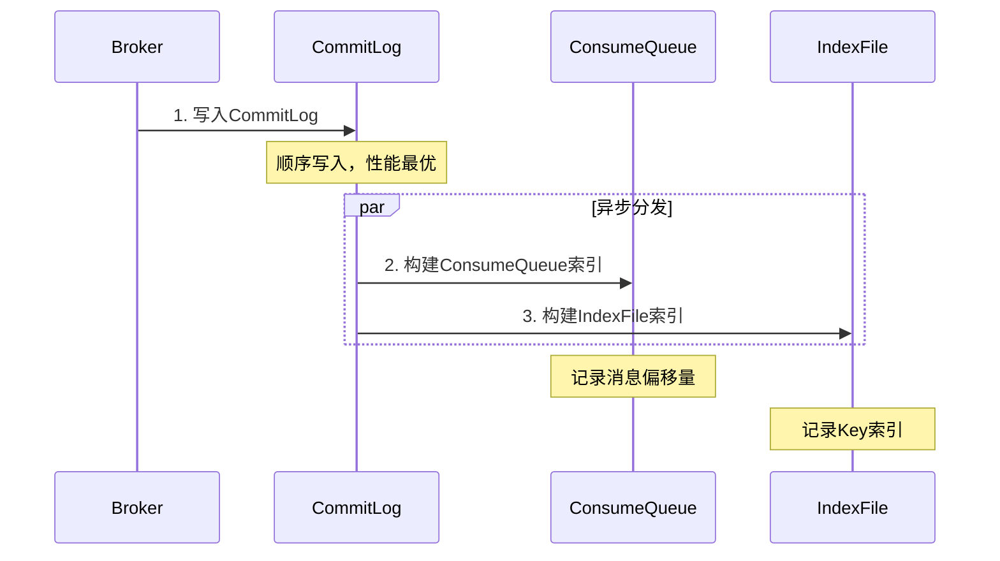
```mermaid
sequenceDiagram
    participant B as Broker
    participant CL as CommitLog
    participant CQ as ConsumeQueue
    participant IF as IndexFile
    
    B->>CL: 1. 写入CommitLog
    Note over CL: 顺序写入，性能最优
    
    par 异步分发
        CL->>CQ: 2. 构建ConsumeQueue索引
        CL->>IF: 3. 构建IndexFile索引
    end
    
    Note over CQ: 记录消息偏移量
    Note over IF: 记录Key索引
```

### 3.4 刷盘机制

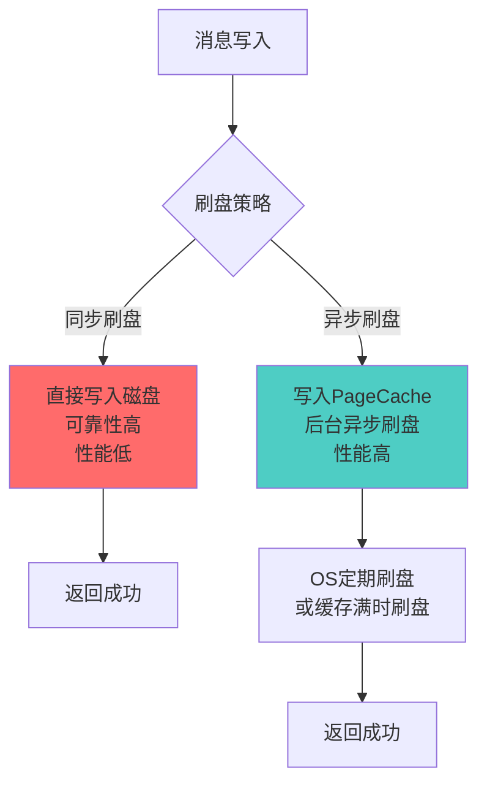
```mermaid
graph TD
    A[消息写入] --> B{刷盘策略}
    B -->|同步刷盘| C[直接写入磁盘<br/>可靠性高<br/>性能低]
    B -->|异步刷盘| D[写入PageCache<br/>后台异步刷盘<br/>性能高]
    
    C --> E[返回成功]
    D --> F[OS定期刷盘<br/>或缓存满时刷盘]
    F --> G[返回成功]
    
    style C fill:#ff6b6b
    style D fill:#4ecdc4
```

---

## 4. 消息消费流程

### 4.1 消费模式对比

| 模式 | 原理 | 优点 | 缺点 |
|------|------|------|------|
| **Push模式** | Broker主动推送 | 实时性高、使用简单 | 流量控制复杂 |
| **Pull模式** | Consumer主动拉取 | 灵活控制、流量可控 | 实时性差、编码复杂 |

> 注意：RocketMQ的Push模式本质是长轮询的Pull

### 4.2 消费流程详解

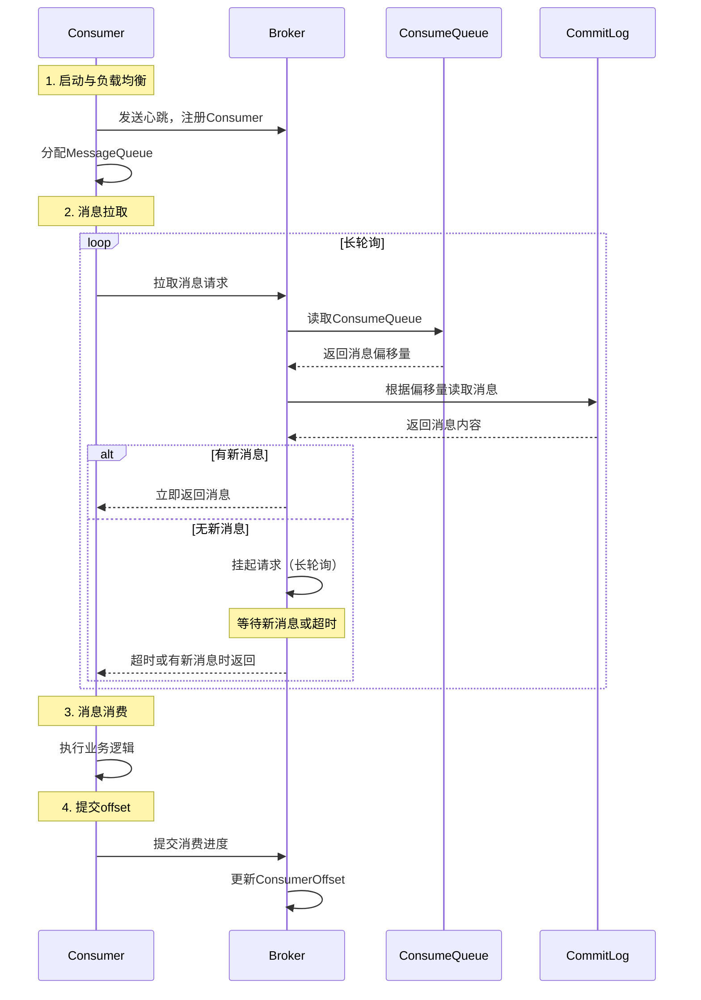
```mermaid
sequenceDiagram
    participant C as Consumer
    participant B as Broker
    participant CQ as ConsumeQueue
    participant CL as CommitLog
    
    Note over C: 1. 启动与负载均衡
    C->>B: 发送心跳，注册Consumer
    C->>C: 分配MessageQueue
    
    Note over C: 2. 消息拉取
    loop 长轮询
        C->>B: 拉取消息请求
        B->>CQ: 读取ConsumeQueue
        CQ-->>B: 返回消息偏移量
        B->>CL: 根据偏移量读取消息
        CL-->>B: 返回消息内容
        
        alt 有新消息
            B-->>C: 立即返回消息
        else 无新消息
            B->>B: 挂起请求（长轮询）
            Note over B: 等待新消息或超时
            B-->>C: 超时或有新消息时返回
        end
    end
    
    Note over C: 3. 消息消费
    C->>C: 执行业务逻辑
    
    Note over C: 4. 提交offset
    C->>B: 提交消费进度
    B->>B: 更新ConsumerOffset
```

### 4.3 消费模式

#### 4.3.1 集群消费（Clustering）

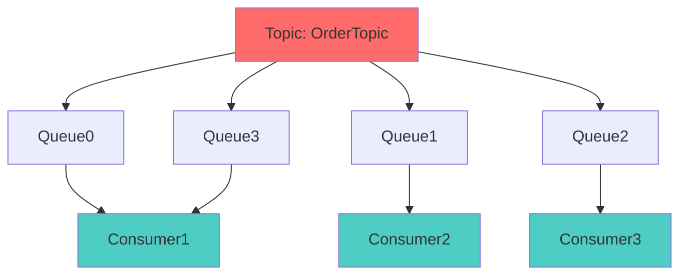
```mermaid
graph TB
    Topic[Topic: OrderTopic]
    Q1[Queue0]
    Q2[Queue1]
    Q3[Queue2]
    Q4[Queue3]
    
    C1[Consumer1]
    C2[Consumer2]
    C3[Consumer3]
    
    Topic --> Q1
    Topic --> Q2
    Topic --> Q3
    Topic --> Q4
    
    Q1 --> C1
    Q2 --> C2
    Q3 --> C3
    Q4 --> C1
    
    style Topic fill:#ff6b6b
    style C1 fill:#4ecdc4
    style C2 fill:#4ecdc4
    style C3 fill:#4ecdc4
```

**特点**：
- 每条消息只被消费组中的一个Consumer消费
- 负载均衡：Queue平均分配给Consumer
- Offset存储在Broker

#### 4.3.2 广播消费（Broadcasting）

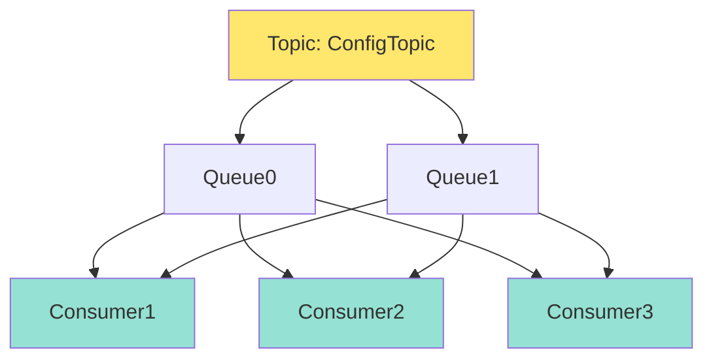
```mermaid
graph TB
    Topic[Topic: ConfigTopic]
    Q1[Queue0]
    Q2[Queue1]
    
    C1[Consumer1]
    C2[Consumer2]
    C3[Consumer3]
    
    Topic --> Q1
    Topic --> Q2
    
    Q1 --> C1
    Q1 --> C2
    Q1 --> C3
    Q2 --> C1
    Q2 --> C2
    Q2 --> C3
    
    style Topic fill:#ffe66d
    style C1 fill:#95e1d3
    style C2 fill:#95e1d3
    style C3 fill:#95e1d3
```

**特点**：
- 每条消息被所有Consumer消费
- Offset存储在Consumer本地
- 适用场景：配置更新、缓存刷新

---

## 5. NameServer 路由机制

### 5.1 路由注册流程

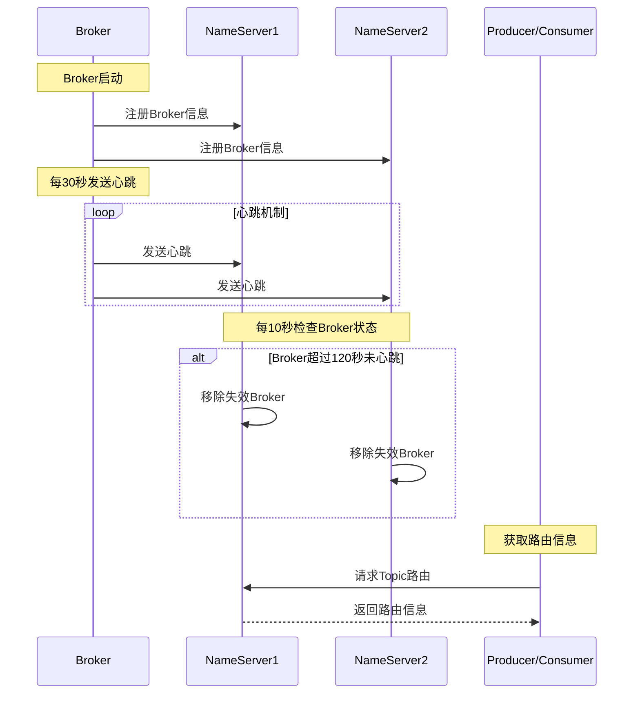
```mermaid
sequenceDiagram
    participant B as Broker
    participant NS1 as NameServer1
    participant NS2 as NameServer2
    participant P as Producer/Consumer
    
    Note over B: Broker启动
    B->>NS1: 注册Broker信息
    B->>NS2: 注册Broker信息
    
    Note over B: 每30秒发送心跳
    loop 心跳机制
        B->>NS1: 发送心跳
        B->>NS2: 发送心跳
    end
    
    Note over NS1,NS2: 每10秒检查Broker状态
    alt Broker超过120秒未心跳
        NS1->>NS1: 移除失效Broker
        NS2->>NS2: 移除失效Broker
    end
    
    Note over P: 获取路由信息
    P->>NS1: 请求Topic路由
    NS1-->>P: 返回路由信息
```

### 5.2 路由信息结构

```java
// NameServer存储的路由信息
public class RouteInfoManager {
    
    // 1. Topic与队列映射
    // Key: Topic名称
    // Value: QueueData（Broker名称、队列数量等）
    private Map<String, List<QueueData>> topicQueueTable;
    
    // 2. Broker信息
    // Key: BrokerName
    // Value: BrokerData（集群名、主从地址）
    private Map<String, BrokerData> brokerAddrTable;
    
    // 3. 集群信息
    // Key: ClusterName
    // Value: Set<BrokerName>
    private Map<String, Set<String>> clusterAddrTable;
    
    // 4. Broker存活信息
    // Key: BrokerAddr
    // Value: 最后心跳时间
    private Map<String, BrokerLiveInfo> brokerLiveTable;
    
    // 5. Filter服务器
    // Key: BrokerAddr
    private Map<String, List<String>> filterServerTable;
}
```

### 5.3 路由发现机制

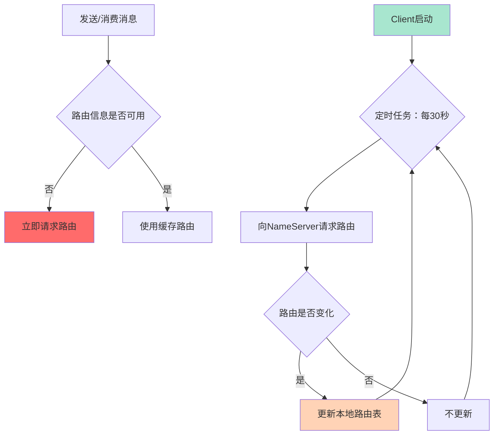
```mermaid
graph TD
    A[Client启动] --> B{定时任务：每30秒}
    B --> C[向NameServer请求路由]
    C --> D{路由是否变化}
    D -->|是| E[更新本地路由表]
    D -->|否| F[不更新]
    E --> B
    F --> B
    
    G[发送/消费消息] --> H{路由信息是否可用}
    H -->|否| I[立即请求路由]
    H -->|是| J[使用缓存路由]
    
    style A fill:#a8e6cf
    style E fill:#ffd3b6
    style I fill:#ff6b6b
```

---

## 6. 主从同步机制

### 6.1 同步方式对比

| 同步方式 | 原理 | 优点 | 缺点 | 适用场景 |
|---------|------|------|------|---------|
| **同步复制** | Master等待Slave确认 | 数据可靠性高 | 性能较低 | 金融、交易 |
| **异步复制** | Master不等待Slave | 性能高 | 可能丢失数据 | 日志、监控 |

### 6.2 主从同步流程

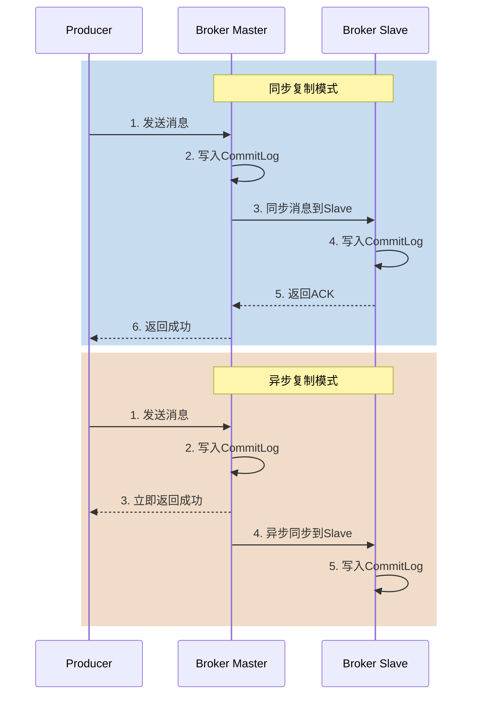
```mermaid
sequenceDiagram
    participant P as Producer
    participant M as Broker Master
    participant S as Broker Slave
    
    rect rgb(200, 220, 240)
        Note over M,S: 同步复制模式
        P->>M: 1. 发送消息
        M->>M: 2. 写入CommitLog
        M->>S: 3. 同步消息到Slave
        S->>S: 4. 写入CommitLog
        S-->>M: 5. 返回ACK
        M-->>P: 6. 返回成功
    end
    
    rect rgb(240, 220, 200)
        Note over M,S: 异步复制模式
        P->>M: 1. 发送消息
        M->>M: 2. 写入CommitLog
        M-->>P: 3. 立即返回成功
        M->>S: 4. 异步同步到Slave
        S->>S: 5. 写入CommitLog
    end
```

### 6.3 Slave同步机制

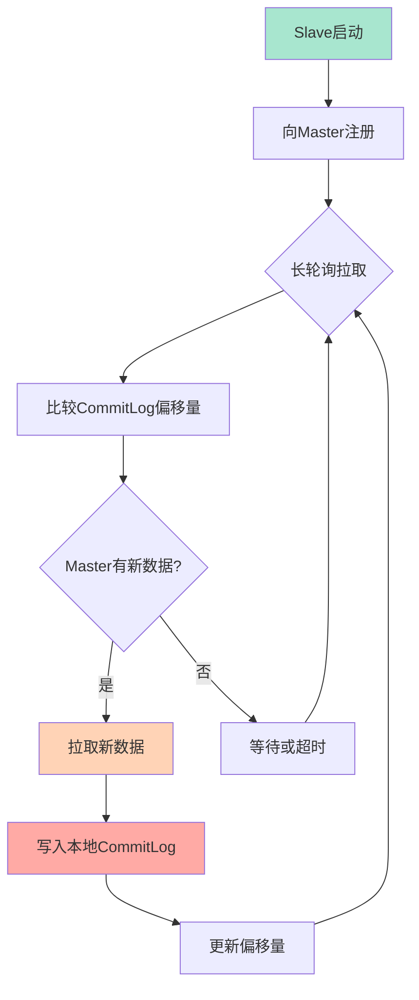
```mermaid
graph TD
    A[Slave启动] --> B[向Master注册]
    B --> C{长轮询拉取}
    
    C --> D[比较CommitLog偏移量]
    D --> E{Master有新数据?}
    
    E -->|是| F[拉取新数据]
    F --> G[写入本地CommitLog]
    G --> H[更新偏移量]
    H --> C
    
    E -->|否| I[等待或超时]
    I --> C
    
    style A fill:#a8e6cf
    style F fill:#ffd3b6
    style G fill:#ffaaa5
```

### 6.4 HA高可用机制

```java
// 主从切换核心逻辑
public class HAService {
    
    // Master端：接受Slave连接
    class AcceptSocketService {
        public void run() {
            while (!isStopped()) {
                Socket socket = serverSocket.accept();
                // 为每个Slave创建连接
                HAConnection conn = new HAConnection(socket);
                conn.start();
            }
        }
    }
    
    // Master端：向Slave推送数据
    class WriteSocketService {
        public void run() {
            while (!isStopped()) {
                // 读取CommitLog新数据
                SelectMappedBufferResult result = 
                    commitLog.getData(offset);
                // 发送给Slave
                socketChannel.write(result.getByteBuffer());
            }
        }
    }
    
    // Slave端：从Master拉取数据
    class HAClient {
        public void run() {
            while (!isStopped()) {
                // 上报当前偏移量
                reportOffset();
                // 接收Master数据
                ByteBuffer buffer = receive();
                // 写入本地CommitLog
                commitLog.appendData(buffer);
            }
        }
    }
}
```

---

## 7. 消息过滤机制

### 7.1 过滤方式对比

| 过滤方式 | 位置 | 性能 | 灵活性 | 使用场景 |
|---------|------|------|--------|---------|
| **Tag过滤** | Broker端 | 高 | 低 | 简单分类 |
| **SQL92过滤** | Broker端 | 中 | 高 | 复杂条件 |
| **Filter Server** | 单独服务 | 低 | 最高 | 自定义逻辑 |

### 7.2 Tag过滤流程

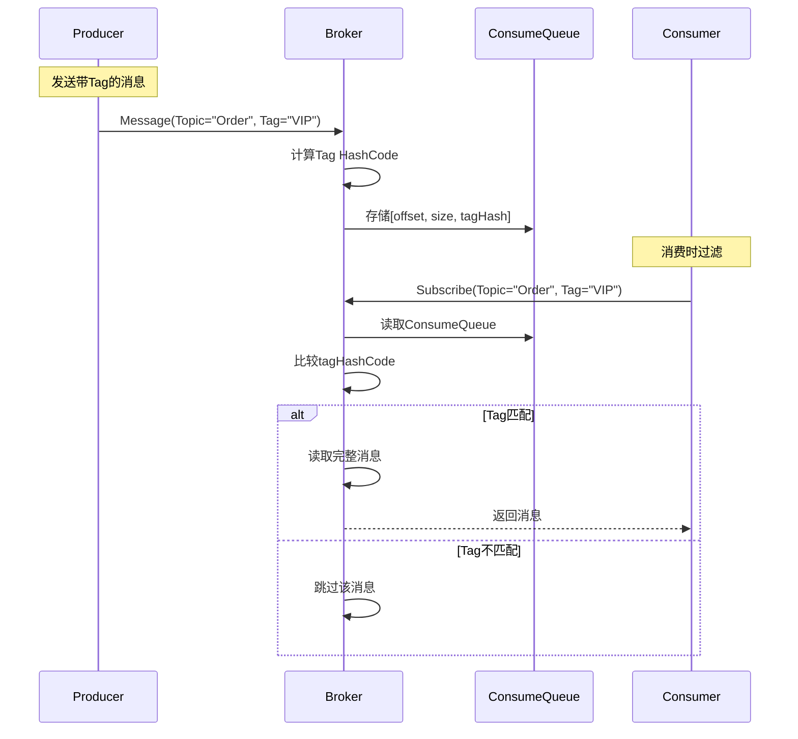
```mermaid
sequenceDiagram
    participant P as Producer
    participant B as Broker
    participant CQ as ConsumeQueue
    participant C as Consumer
    
    Note over P: 发送带Tag的消息
    P->>B: Message(Topic="Order", Tag="VIP")
    B->>B: 计算Tag HashCode
    B->>CQ: 存储[offset, size, tagHash]
    
    Note over C: 消费时过滤
    C->>B: Subscribe(Topic="Order", Tag="VIP")
    B->>CQ: 读取ConsumeQueue
    B->>B: 比较tagHashCode
    
    alt Tag匹配
        B->>B: 读取完整消息
        B-->>C: 返回消息
    else Tag不匹配
        B->>B: 跳过该消息
    end
```

### 7.3 SQL92过滤示例

```java
// Producer发送消息
Message msg = new Message("TopicTest", "TagA", "Hello RocketMQ".getBytes());
msg.putUserProperty("age", "18");
msg.putUserProperty("vip", "true");
producer.send(msg);

// Consumer订阅时设置SQL过滤
consumer.subscribe("TopicTest", 
    MessageSelector.bySql("age >= 18 AND vip = 'true'"));
```

**支持的SQL语法**：
- 数值比较：`>`、`>=`、`<`、`<=`、`=`
- 字符比较：`=`、`<>`
- 逻辑运算：`AND`、`OR`、`NOT`
- 区间判断：`BETWEEN`、`IN`

---

## 8. 事务消息机制

### 8.1 事务消息流程

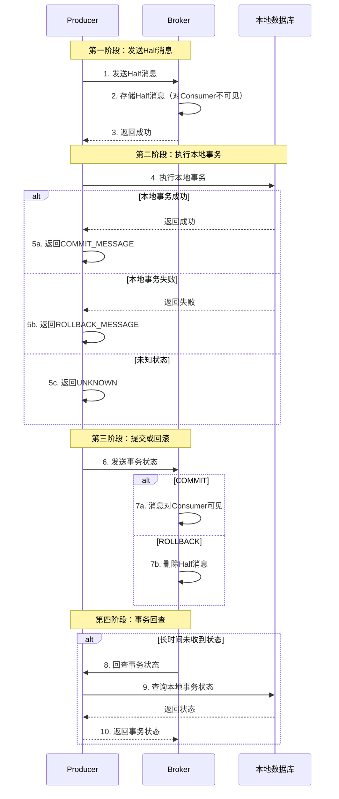
```mermaid
sequenceDiagram
    participant P as Producer
    participant B as Broker
    participant DB as 本地数据库
    
    Note over P,B: 第一阶段：发送Half消息
    P->>B: 1. 发送Half消息
    B->>B: 2. 存储Half消息（对Consumer不可见）
    B-->>P: 3. 返回成功
    
    Note over P,DB: 第二阶段：执行本地事务
    P->>DB: 4. 执行本地事务
    alt 本地事务成功
        DB-->>P: 返回成功
        P->>P: 5a. 返回COMMIT_MESSAGE
    else 本地事务失败
        DB-->>P: 返回失败
        P->>P: 5b. 返回ROLLBACK_MESSAGE
    else 未知状态
        P->>P: 5c. 返回UNKNOWN
    end
    
    Note over P,B: 第三阶段：提交或回滚
    P->>B: 6. 发送事务状态
    alt COMMIT
        B->>B: 7a. 消息对Consumer可见
    else ROLLBACK
        B->>B: 7b. 删除Half消息
    end
    
    Note over B,P: 第四阶段：事务回查
    alt 长时间未收到状态
        B->>P: 8. 回查事务状态
        P->>DB: 9. 查询本地事务状态
        DB-->>P: 返回状态
        P-->>B: 10. 返回事务状态
    end
```

### 8.2 事务消息实现原理

```java
// 事务消息发送核心代码
public class TransactionMessageFlow {
    
    public void sendTransactionMessage() {
        
        // 1. 发送Half消息
        TransactionSendResult result = producer.sendMessageInTransaction(msg, arg);
        
        // 2. 执行本地事务逻辑
        LocalTransactionState state = executeLocalTransaction(msg, arg);
        
        // 3. 提交事务状态
        if (state == LocalTransactionState.COMMIT_MESSAGE) {
            // Broker将消息对Consumer可见
            broker.commitTransaction(msg);
        } else if (state == LocalTransactionState.ROLLBACK_MESSAGE) {
            // Broker删除Half消息
            broker.rollbackTransaction(msg);
        }
        // UNKNOWN状态等待回查
    }
    
    // 本地事务执行
    public LocalTransactionState executeLocalTransaction(Message msg, Object arg) {
        try {
            // 执行业务逻辑（如：扣款、下单）
            database.executeUpdate(sql);
            return LocalTransactionState.COMMIT_MESSAGE;
        } catch (Exception e) {
            return LocalTransactionState.ROLLBACK_MESSAGE;
        }
    }
    
    // 事务回查接口
    public LocalTransactionState checkLocalTransaction(MessageExt msg) {
        // 查询本地事务执行结果
        boolean success = database.checkTransactionStatus(msg.getTransactionId());
        return success ? 
            LocalTransactionState.COMMIT_MESSAGE : 
            LocalTransactionState.ROLLBACK_MESSAGE;
    }
}
```

### 8.3 事务消息状态机

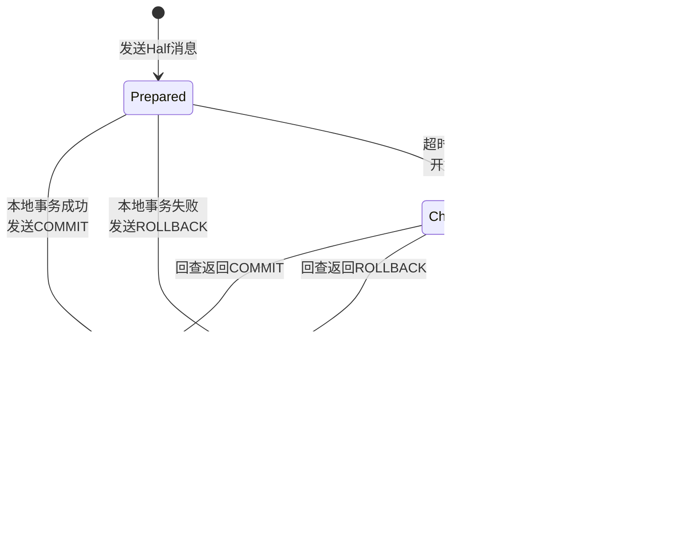
```mermaid
stateDiagram-v2
    [*] --> Prepared: 发送Half消息
    
    Prepared --> Committed: 本地事务成功<br/>发送COMMIT
    Prepared --> Rollback: 本地事务失败<br/>发送ROLLBACK
    Prepared --> Checking: 超时未响应<br/>开始回查
    
    Checking --> Committed: 回查返回COMMIT
    Checking --> Rollback: 回查返回ROLLBACK
    Checking --> Checking: 回查返回UNKNOWN<br/>继续回查
    
    Committed --> [*]: 消息可消费
    Rollback --> [*]: 消息删除
    
    note right of Checking
        最多回查15次
        间隔时间可配置
        默认60秒
    end note
```

---

## 9. 延迟消息机制

### 9.1 延迟级别

RocketMQ支持**18个固定的延迟级别**：

```
1s 5s 10s 30s 1m 2m 3m 4m 5m 6m 7m 8m 9m 10m 20m 30m 1h 2h
```

| 级别 | 延迟时间 | 级别 | 延迟时间 | 级别 | 延迟时间 |
|------|---------|------|---------|------|---------|
| 1 | 1秒 | 7 | 3分钟 | 13 | 9分钟 |
| 2 | 5秒 | 8 | 4分钟 | 14 | 10分钟 |
| 3 | 10秒 | 9 | 5分钟 | 15 | 20分钟 |
| 4 | 30秒 | 10 | 6分钟 | 16 | 30分钟 |
| 5 | 1分钟 | 11 | 7分钟 | 17 | 1小时 |
| 6 | 2分钟 | 12 | 8分钟 | 18 | 2小时 |

### 9.2 延迟消息实现原理

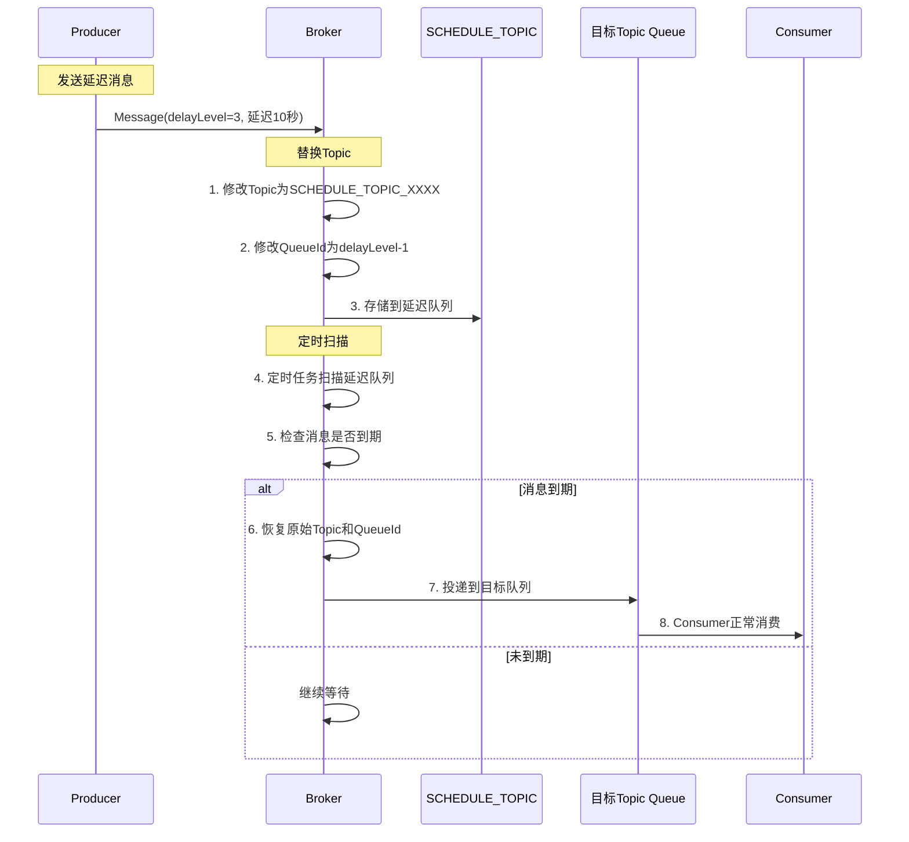
```mermaid
sequenceDiagram
    participant P as Producer
    participant B as Broker
    participant DQ as SCHEDULE_TOPIC
    participant TQ as 目标Topic Queue
    participant C as Consumer
    
    Note over P: 发送延迟消息
    P->>B: Message(delayLevel=3, 延迟10秒)
    
    Note over B: 替换Topic
    B->>B: 1. 修改Topic为SCHEDULE_TOPIC_XXXX
    B->>B: 2. 修改QueueId为delayLevel-1
    B->>DQ: 3. 存储到延迟队列
    
    Note over B: 定时扫描
    B->>B: 4. 定时任务扫描延迟队列
    B->>B: 5. 检查消息是否到期
    
    alt 消息到期
        B->>B: 6. 恢复原始Topic和QueueId
        B->>TQ: 7. 投递到目标队列
        TQ->>C: 8. Consumer正常消费
    else 未到期
        B->>B: 继续等待
    end
```

### 9.3 延迟消息调度

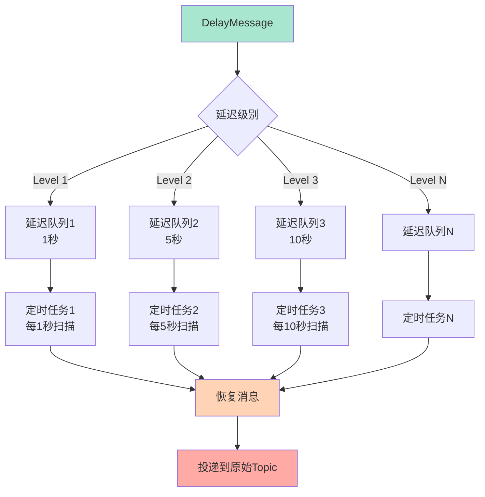
```mermaid
graph TD
    A[DelayMessage] --> B{延迟级别}
    
    B -->|Level 1| C1[延迟队列1<br/>1秒]
    B -->|Level 2| C2[延迟队列2<br/>5秒]
    B -->|Level 3| C3[延迟队列3<br/>10秒]
    B -->|Level N| CN[延迟队列N]
    
    C1 --> D1[定时任务1<br/>每1秒扫描]
    C2 --> D2[定时任务2<br/>每5秒扫描]
    C3 --> D3[定时任务3<br/>每10秒扫描]
    CN --> DN[定时任务N]
    
    D1 --> E[恢复消息]
    D2 --> E
    D3 --> E
    DN --> E
    
    E --> F[投递到原始Topic]
    
    style A fill:#a8e6cf
    style E fill:#ffd3b6
    style F fill:#ffaaa5
```

### 9.4 使用示例

```java
// 发送延迟消息
Message msg = new Message("TopicTest", "TagA", "Hello Delayed".getBytes());

// 设置延迟级别为3（10秒后消费）
msg.setDelayTimeLevel(3);

producer.send(msg);

// Consumer正常消费，无需特殊处理
consumer.subscribe("TopicTest", "*");
consumer.registerMessageListener(new MessageListenerConcurrently() {
    @Override
    public ConsumeConcurrentlyStatus consumeMessage(
            List<MessageExt> msgs, ConsumeConcurrentlyContext context) {
        // 10秒后才会收到消息
        System.out.println("Received: " + new String(msgs.get(0).getBody()));
        return ConsumeConcurrentlyStatus.CONSUME_SUCCESS;
    }
});
```

---

## 10. 消息重试与死信队列

### 10.1 消费重试机制

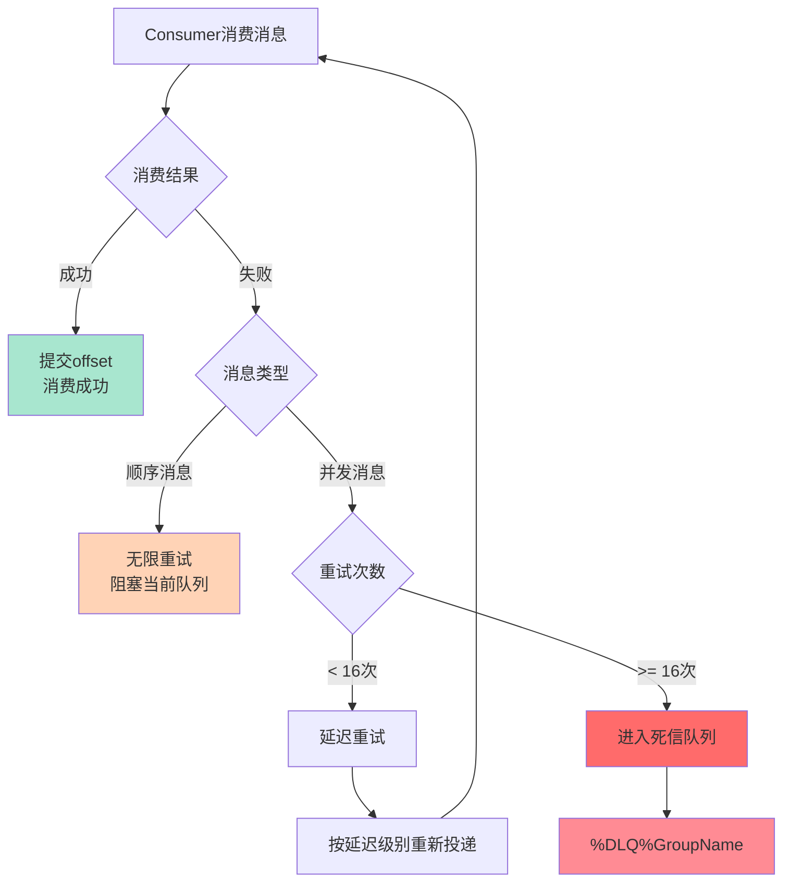
```mermaid
graph TD
    A[Consumer消费消息] --> B{消费结果}
    
    B -->|成功| C[提交offset<br/>消费成功]
    B -->|失败| D{消息类型}
    
    D -->|顺序消息| E[无限重试<br/>阻塞当前队列]
    D -->|并发消息| F{重试次数}
    
    F -->|< 16次| G[延迟重试]
    F -->|>= 16次| H[进入死信队列]
    
    G --> I[按延迟级别重新投递]
    I --> A
    
    H --> J[%DLQ%GroupName]
    
    style C fill:#a8e6cf
    style E fill:#ffd3b6
    style H fill:#ff6b6b
    style J fill:#ff8b94
```

### 10.2 重试时间间隔

| 重试次数 | 延迟时间 | 重试次数 | 延迟时间 | 重试次数 | 延迟时间 |
|---------|---------|---------|---------|---------|---------|
| 1 | 10秒 | 6 | 2分钟 | 11 | 7分钟 |
| 2 | 30秒 | 7 | 3分钟 | 12 | 8分钟 |
| 3 | 1分钟 | 8 | 4分钟 | 13 | 9分钟 |
| 4 | 2分钟 | 9 | 5分钟 | 14 | 10分钟 |
| 5 | 3分钟 | 10 | 6分钟 | 15 | 20分钟 |
|  |  |  |  | 16 | 30分钟 |

### 10.3 重试流程详解

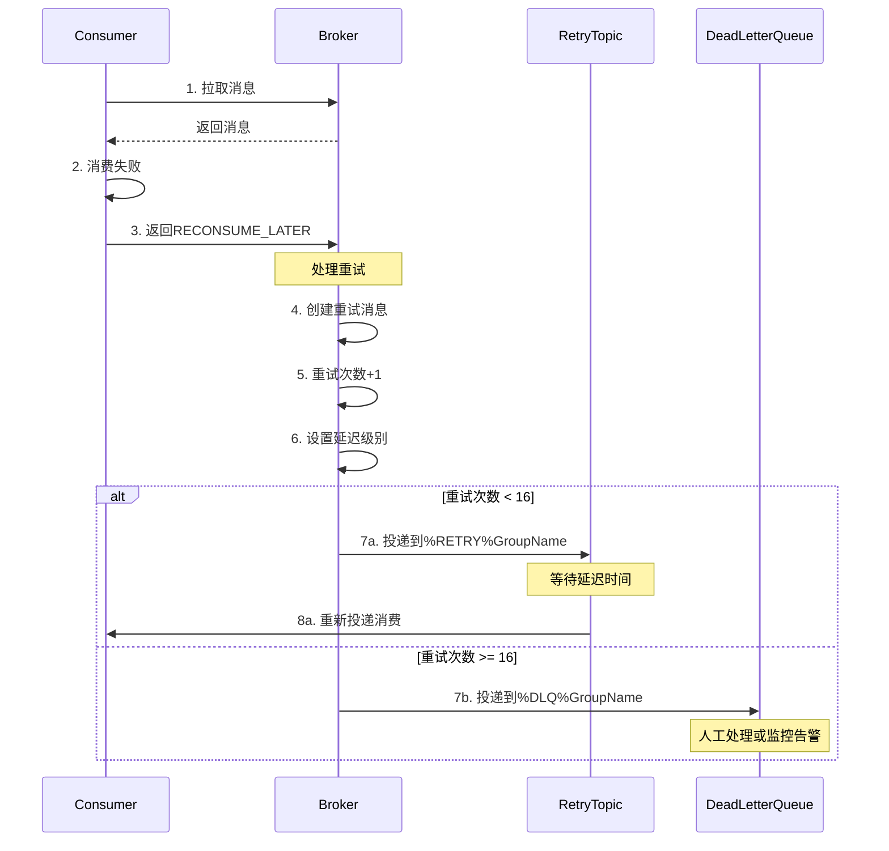
```mermaid
sequenceDiagram
    participant C as Consumer
    participant B as Broker
    participant RT as RetryTopic
    participant DLQ as DeadLetterQueue
    
    C->>B: 1. 拉取消息
    B-->>C: 返回消息
    
    C->>C: 2. 消费失败
    C->>B: 3. 返回RECONSUME_LATER
    
    Note over B: 处理重试
    B->>B: 4. 创建重试消息
    B->>B: 5. 重试次数+1
    B->>B: 6. 设置延迟级别
    
    alt 重试次数 < 16
        B->>RT: 7a. 投递到%RETRY%GroupName
        Note over RT: 等待延迟时间
        RT->>C: 8a. 重新投递消费
    else 重试次数 >= 16
        B->>DLQ: 7b. 投递到%DLQ%GroupName
        Note over DLQ: 人工处理或监控告警
    end
```

### 10.4 死信队列处理

```java
// 死信队列命名规则
String deadLetterTopic = "%DLQ%" + consumerGroup;

// 监听死信队列（需要单独Consumer）
DefaultMQPushConsumer dlqConsumer = new DefaultMQPushConsumer("DLQ_Monitor_Group");
dlqConsumer.subscribe("%DLQ%OrderConsumerGroup", "*");
dlqConsumer.registerMessageListener(new MessageListenerConcurrently() {
    @Override
    public ConsumeConcurrentlyStatus consumeMessage(
            List<MessageExt> msgs, ConsumeConcurrentlyContext context) {
        
        for (MessageExt msg : msgs) {
            // 1. 记录日志
            logger.error("Dead letter message: {}", msg);
            
            // 2. 发送告警
            alertService.sendAlert("发现死信消息", msg);
            
            // 3. 人工处理或重新投递
            manualHandle(msg);
        }
        return ConsumeConcurrentlyStatus.CONSUME_SUCCESS;
    }
});
```

### 10.5 重试策略配置

```java
// Consumer配置重试策略
DefaultMQPushConsumer consumer = new DefaultMQPushConsumer("ConsumerGroup");

// 设置最大重试次数（默认16次）
consumer.setMaxReconsumeTimes(10);

// 并发消费配置
consumer.registerMessageListener(new MessageListenerConcurrently() {
    @Override
    public ConsumeConcurrentlyStatus consumeMessage(
            List<MessageExt> msgs, ConsumeConcurrentlyContext context) {
        try {
            // 业务处理
            processMessage(msgs);
            return ConsumeConcurrentlyStatus.CONSUME_SUCCESS;
        } catch (Exception e) {
            // 返回RECONSUME_LATER触发重试
            return ConsumeConcurrentlyStatus.RECONSUME_LATER;
        }
    }
});

// 顺序消费配置
consumer.registerMessageListener(new MessageListenerOrderly() {
    @Override
    public ConsumeOrderlyStatus consumeMessage(
            List<MessageExt> msgs, ConsumeOrderlyContext context) {
        try {
            processMessage(msgs);
            return ConsumeOrderlyStatus.SUCCESS;
        } catch (Exception e) {
            // 顺序消息会无限重试（阻塞队列）
            return ConsumeOrderlyStatus.SUSPEND_CURRENT_QUEUE_A_MOMENT;
        }
    }
});
```

---

## 11. 性能优化最佳实践

### 11.1 Producer优化

```java
// 生产者性能优化配置
DefaultMQProducer producer = new DefaultMQProducer("ProducerGroup");

// 1. 异步发送（高吞吐）
producer.setRetryTimesWhenSendAsyncFailed(0);
producer.send(msg, new SendCallback() {
    @Override
    public void onSuccess(SendResult sendResult) {}
    @Override
    public void onException(Throwable e) {}
});

// 2. 批量发送
List<Message> messages = new ArrayList<>();
// ... 添加消息
producer.send(messages);

// 3. 压缩消息（>4KB）
producer.setCompressMsgBodyOverHowmuch(4096);

// 4. 增大发送队列
producer.setClientCallbackExecutorThreads(Runtime.getRuntime().availableProcessors());
```

### 11.2 Consumer优化

```java
// 消费者性能优化配置
DefaultMQPushConsumer consumer = new DefaultMQPushConsumer("ConsumerGroup");

// 1. 增加消费线程数
consumer.setConsumeThreadMin(20);
consumer.setConsumeThreadMax(64);

// 2. 批量消费
consumer.setConsumeMessageBatchMaxSize(16);

// 3. 调整拉取参数
consumer.setPullBatchSize(32);          // 单次拉取消息数
consumer.setPullInterval(0);            // 拉取间隔（毫秒）
consumer.setPullThresholdForQueue(1000); // 队列最大消息数

// 4. 流量控制
consumer.setPullThresholdForTopic(3000);     // Topic最大消息数
consumer.setPullThresholdSizeForQueue(100);  // 队列最大消息大小(MB)
```

### 11.3 Broker优化

```properties
# broker.conf

# 1. 刷盘策略
flushDiskType=ASYNC_FLUSH
# 异步刷盘间隔（毫秒）
flushIntervalCommitLog=1000

# 2. 存储配置
# CommitLog文件大小（默认1GB）
mapedFileSizeCommitLog=1073741824
# ConsumeQueue文件大小
mapedFileSizeConsumeQueue=6000000

# 3. 发送线程池
sendMessageThreadPoolNums=16
# 拉取线程池
pullMessageThreadPoolNums=16

# 4. 内存配置
# 是否开启堆外内存
transientStorePoolEnable=true
# 堆外内存大小
transientStorePoolSize=5

# 5. 文件预热
warmMapedFileEnable=true
```

---

## 12. 监控与运维

### 12.1 关键监控指标

| 类别 | 指标 | 说明 | 告警阈值 |
|------|------|------|---------|
| **生产** | 发送TPS | 每秒发送消息数 | - |
| **生产** | 发送延迟 | 消息发送耗时 | >100ms |
| **消费** | 消费TPS | 每秒消费消息数 | - |
| **消费** | 消息堆积 | 未消费消息数量 | >10000 |
| **消费** | 消费延迟 | 消息存储到消费时间差 | >1分钟 |
| **Broker** | 磁盘使用率 | 存储磁盘占用 | >85% |
| **Broker** | CommitLog落后 | Slave落后Master字节数 | >1GB |

### 12.2 监控架构

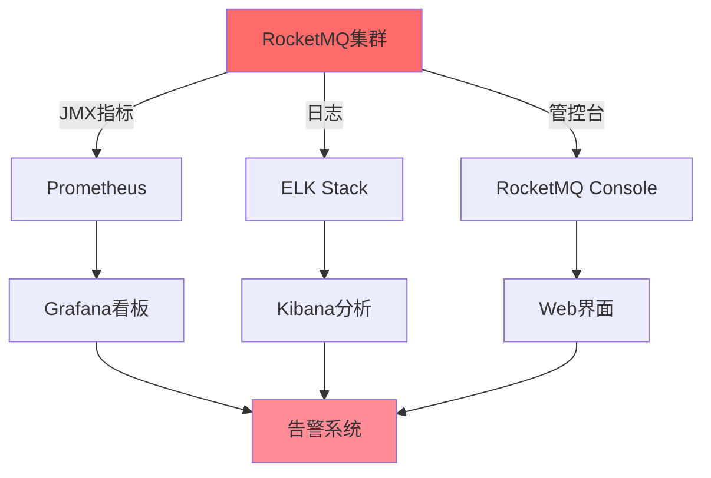
```mermaid
graph TB
    RMQ[RocketMQ集群]
    
    RMQ --> |JMX指标| M1[Prometheus]
    RMQ --> |日志| M2[ELK Stack]
    RMQ --> |管控台| M3[RocketMQ Console]
    
    M1 --> G1[Grafana看板]
    M2 --> G2[Kibana分析]
    M3 --> G3[Web界面]
    
    G1 --> A[告警系统]
    G2 --> A
    G3 --> A
    
    style RMQ fill:#ff6b6b
    style A fill:#ff8b94
```

### 12.3 常用运维命令

```bash
# 1. 查看集群状态
./mqadmin clusterList -n localhost:9876

# 2. 查看Topic信息
./mqadmin topicStatus -n localhost:9876 -t TopicTest

# 3. 查看消费进度
./mqadmin consumerProgress -n localhost:9876 -g ConsumerGroup

# 4. 重置消费位点
./mqadmin resetOffsetByTime -n localhost:9876 \
    -g ConsumerGroup -t TopicTest -s -1

# 5. 删除Topic
./mqadmin deleteTopic -n localhost:9876 -c ClusterName -t TopicTest

# 6. 查看消息详情
./mqadmin queryMsgById -n localhost:9876 -i <MsgId>

# 7. 查看Broker状态
./mqadmin brokerStatus -n localhost:9876 -b <BrokerAddr>
```

---

## 13. 故障排查

### 13.1 常见问题

#### 问题1：消息堆积

**现象**：Consumer消费速度跟不上Producer生产速度

**排查流程**：
```mermaid
graph TD
    A[消息堆积] --> B{检查Consumer}
    
    B --> C1[消费线程数不足]
    B --> C2[消费逻辑耗时]
    B --> C3[网络问题]
    B --> C4[Consumer挂掉]
    
    C1 --> S1[增加consumeThreadMax]
    C2 --> S2[优化业务代码<br/>使用异步处理]
    C3 --> S3[检查网络连接<br/>增加带宽]
    C4 --> S4[重启Consumer<br/>增加实例]
    
    style A fill:#ff6b6b
    style S1 fill:#a8e6cf
    style S2 fill:#a8e6cf
    style S3 fill:#a8e6cf
    style S4 fill:#a8e6cf
```

#### 问题2：消息丢失

**可能原因及解决方案**：

| 阶段 | 丢失原因 | 解决方案 |
|------|---------|---------|
| **生产** | 网络故障未重试 | 配置重试次数、使用同步发送 |
| **存储** | 异步刷盘机器宕机 | 使用同步刷盘、主从同步复制 |
| **消费** | 消费成功但未处理 | 先处理业务再返回成功 |

#### 问题3：消息重复

**原因**：
- 网络抖动导致重复发送
- Consumer重复消费（宕机重启）
- 消息重试

**解决方案**：
```java
// 消费端幂等性设计
public class IdempotentConsumer {
    
    private RedisTemplate redis;
    
    public ConsumeConcurrentlyStatus consumeMessage(MessageExt msg) {
        String msgId = msg.getMsgId();
        
        // 1. 检查是否已处理（Redis去重）
        if (redis.exists("msg:" + msgId)) {
            return ConsumeConcurrentlyStatus.CONSUME_SUCCESS;
        }
        
        try {
            // 2. 处理业务（使用分布式锁）
            String lockKey = "lock:msg:" + msgId;
            if (redis.setIfAbsent(lockKey, "1", 10, TimeUnit.SECONDS)) {
                processBusinessLogic(msg);
                
                // 3. 标记已处理
                redis.set("msg:" + msgId, "1", 1, TimeUnit.DAYS);
            }
            
            return ConsumeConcurrentlyStatus.CONSUME_SUCCESS;
        } catch (Exception e) {
            return ConsumeConcurrentlyStatus.RECONSUME_LATER;
        }
    }
}
```

---

## 14. 核心参数速查表

### 14.1 Producer关键参数

| 参数 | 默认值 | 说明 | 推荐值 |
|------|-------|------|-------|
| `sendMsgTimeout` | 3000ms | 发送超时时间 | 3000-10000 |
| `retryTimesWhenSendFailed` | 2 | 同步发送失败重试次数 | 2-3 |
| `retryTimesWhenSendAsyncFailed` | 2 | 异步发送失败重试次数 | 0（快速失败） |
| `compressMsgBodyOverHowmuch` | 4096 | 消息体压缩阈值(字节) | 4096 |
| `maxMessageSize` | 4MB | 最大消息大小 | 4MB |

### 14.2 Consumer关键参数

| 参数 | 默认值 | 说明 | 推荐值 |
|------|-------|------|-------|
| `consumeThreadMin` | 20 | 最小消费线程数 | 20-64 |
| `consumeThreadMax` | 20 | 最大消费线程数 | 64-128 |
| `pullBatchSize` | 32 | 单次拉取消息数 | 32 |
| `consumeMessageBatchMaxSize` | 1 | 批量消费最大数量 | 1-16 |
| `pullInterval` | 0 | 拉取间隔(ms) | 0 |
| `maxReconsumeTimes` | 16 | 最大重试次数 | 16 |

### 14.3 Broker关键参数

| 参数 | 默认值 | 说明 | 推荐值 |
|------|-------|------|-------|
| `flushDiskType` | ASYNC_FLUSH | 刷盘方式 | 异步/同步看业务 |
| `brokerRole` | ASYNC_MASTER | Broker角色 | SYNC_MASTER（高可用） |
| `deleteWhen` | 04 | 文件删除时间点 | 04 |
| `fileReservedTime` | 48 | 文件保留时间(小时) | 72-168 |
| `sendMessageThreadPoolNums` | 16 | 发送线程池大小 | CPU核数 |

---

## 15. 总结

### 15.1 RocketMQ核心优势

✅ **高性能**
- 百万级TPS
- 顺序写CommitLog
- 零拷贝技术

✅ **高可靠**
- 同步/异步刷盘
- 主从同步
- 消息重试机制

✅ **功能丰富**
- 事务消息
- 延迟消息
- 顺序消息
- 批量消息

✅ **易运维**
- 部署简单
- 监控完善
- 工具齐全

### 15.2 应用场景

| 场景 | 特性需求 | RocketMQ方案 |
|------|---------|-------------|
| **削峰填谷** | 高吞吐 | 异步发送、批量消费 |
| **异步解耦** | 可靠投递 | 消息重试、死信队列 |
| **分布式事务** | 最终一致性 | 事务消息 |
| **订单超时** | 延迟处理 | 延迟消息 |
| **日志收集** | 高性能 | 单向发送、批量发送 |

### 15.3 学习路线

```mermaid
graph LR
    A[基础概念] --> B[消息发送/消费]
    B --> C[存储机制]
    C --> D[高级特性]
    D --> E[性能优化]
    E --> F[运维实战]
    
    style A fill:#a8e6cf
    style F fill:#ff6b6b
```

---

## 附录：参考资料

- 📚 [RocketMQ官方文档](https://rocketmq.apache.org/docs/quick-start/)
- 💻 [GitHub仓库](https://github.com/apache/rocketmq)
- 📖 《RocketMQ技术内幕》
- 🎓 [RocketMQ源码解析系列](https://github.com/apache/rocketmq/tree/master/docs)

---

**文档版本**: v1.0  
**最后更新**: 2025-10-25  
**作者**: AI Assistant  
**适用版本**: RocketMQ 4.x / 5.x

