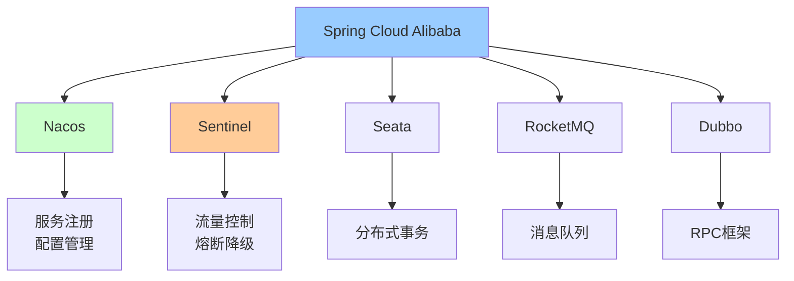

# Spring Cloud Alibaba全家桶

> 深入理解Spring Cloud Alibaba核心组件：Nacos、Sentinel、Seata、RocketMQ

---

## 📋 目录

1. [Spring Cloud Alibaba概述](#1-spring-cloud-alibaba概述)
2. [Nacos服务治理](#2-nacos服务治理)
3. [Sentinel流量控制](#3-sentinel流量控制)
4. [Seata分布式事务](#4-seata分布式事务)
5. [RocketMQ消息驱动](#5-rocketmq消息驱动)
6. [Gateway网关](#6-gateway网关)
7. [完整项目实战](#7-完整项目实战)

---

## 1. Spring Cloud Alibaba概述

### 1.1 核心组件



### 1.2 版本对应关系

```
Spring Cloud Alibaba版本适配：

Spring Boot 3.0.x → Spring Cloud 2022.x → SCA 2022.0.0.0
Spring Boot 2.7.x → Spring Cloud 2021.x → SCA 2021.0.5.0
Spring Boot 2.6.x → Spring Cloud 2021.x → SCA 2021.0.5.0

推荐组合（2025年）：
- Spring Boot 3.2.x
- Spring Cloud 2023.x
- Spring Cloud Alibaba 2023.x
```

### 1.3 快速开始
**Maven依赖**：
```xml
<properties>
    <spring-boot.version>3.2.0</spring-boot.version>
    <spring-cloud.version>2023.0.0</spring-cloud.version>
    <spring-cloud-alibaba.version>2023.0.0.0</spring-cloud-alibaba.version>
</properties>

<dependencyManagement>
    <dependencies>
        <!-- Spring Boot -->
        <dependency>
            <groupId>org.springframework.boot</groupId>
            <artifactId>spring-boot-dependencies</artifactId>
            <version>${spring-boot.version}</version>
            <type>pom</type>
            <scope>import</scope>
        </dependency>
        
        <!-- Spring Cloud -->
        <dependency>
            <groupId>org.springframework.cloud</groupId>
            <artifactId>spring-cloud-dependencies</artifactId>
            <version>${spring-cloud.version}</version>
            <type>pom</type>
            <scope>import</scope>
        </dependency>
        
        <!-- Spring Cloud Alibaba -->
        <dependency>
            <groupId>com.alibaba.cloud</groupId>
            <artifactId>spring-cloud-alibaba-dependencies</artifactId>
            <version>${spring-cloud-alibaba.version}</version>
            <type>pom</type>
            <scope>import</scope>
        </dependency>
    </dependencies>
</dependencyManagement>
```

---

## 2. Nacos服务治理

### 2.1 服务注册与发现

**引入依赖**：
```xml
<dependency>
    <groupId>com.alibaba.cloud</groupId>
    <artifactId>spring-cloud-starter-alibaba-nacos-discovery</artifactId>
</dependency>
```

**配置**：
```yaml
spring:
  application:
    name: order-service
  cloud:
    nacos:
      discovery:
        server-addr: localhost:8848
        namespace: dev
        group: DEFAULT_GROUP
        # 实例配置
        weight: 1                    # 权重（负载均衡）
        cluster-name: DEFAULT        # 集群名称
        metadata:                    # 元数据
          version: v1
          region: cn-hangzhou
```

**服务提供者**：
```java
@SpringBootApplication
@EnableDiscoveryClient
public class OrderServiceApplication {
    public static void main(String[] args) {
        SpringApplication.run(OrderServiceApplication.class, args);
    }
}

@RestController
@RequestMapping("/api/orders")
public class OrderController {
    
    @GetMapping("/{id}")
    public Order getOrder(@PathVariable Long id) {
        return orderService.getById(id);
    }
}
```

**服务消费者（OpenFeign）**：
```java
// 1. 引入依赖
<dependency>
    <groupId>org.springframework.cloud</groupId>
    <artifactId>spring-cloud-starter-openfeign</artifactId>
</dependency>
<dependency>
    <groupId>org.springframework.cloud</groupId>
    <artifactId>spring-cloud-starter-loadbalancer</artifactId>
</dependency>

// 2. 启用Feign
@SpringBootApplication
@EnableDiscoveryClient
@EnableFeignClients
public class PaymentServiceApplication {
    public static void main(String[] args) {
        SpringApplication.run(PaymentServiceApplication.class, args);
    }
}

// 3. 定义Feign客户端
@FeignClient(name = "order-service", path = "/api/orders")
public interface OrderFeignClient {
    
    @GetMapping("/{id}")
    Order getOrder(@PathVariable("id") Long id);
}

// 4. 使用
@Service
public class PaymentService {
    
    @Autowired
    private OrderFeignClient orderClient;
    
    public void processPayment(Long orderId) {
        // 远程调用订单服务
        Order order = orderClient.getOrder(orderId);
        
        // 处理支付逻辑
        doPayment(order);
    }
}
```

### 2.2 配置管理

**引入依赖**：
```xml
<dependency>
    <groupId>com.alibaba.cloud</groupId>
    <artifactId>spring-cloud-starter-alibaba-nacos-config</artifactId>
</dependency>
<dependency>
    <groupId>org.springframework.cloud</groupId>
    <artifactId>spring-cloud-starter-bootstrap</artifactId>
</dependency>
```

**bootstrap.yml**：
```yaml
spring:
  application:
    name: order-service
  cloud:
    nacos:
      config:
        server-addr: localhost:8848
        namespace: dev
        group: DEFAULT_GROUP
        file-extension: yaml
        # 共享配置
        shared-configs:
          - data-id: common-mysql.yaml
            group: COMMON_GROUP
            refresh: true
          - data-id: common-redis.yaml
            group: COMMON_GROUP
            refresh: true
        # 扩展配置
        extension-configs:
          - data-id: order-service-dev.yaml
            group: DEFAULT_GROUP
            refresh: true
```

**动态刷新配置**：
```java
@RestController
@RefreshScope  // 支持配置动态刷新
public class ConfigController {
    
    @Value("${business.max-retry:3}")
    private int maxRetry;
    
    @Value("${business.timeout:30}")
    private int timeout;
    
    @GetMapping("/config")
    public Map<String, Object> getConfig() {
        return Map.of(
            "maxRetry", maxRetry,
            "timeout", timeout
        );
    }
}
```

---

## 3. Sentinel流量控制

### 3.1 快速开始

**引入依赖**：
```xml
<dependency>
    <groupId>com.alibaba.cloud</groupId>
    <artifactId>spring-cloud-starter-alibaba-sentinel</artifactId>
</dependency>

<!-- Sentinel控制台 -->
<dependency>
    <groupId>com.alibaba.csp</groupId>
    <artifactId>sentinel-transport-simple-http</artifactId>
</dependency>
```

**配置**：
```yaml
spring:
  cloud:
    sentinel:
      transport:
        dashboard: localhost:8080  # Sentinel控制台地址
        port: 8719                 # 与控制台通信端口
      # 饥饿加载
      eager: true
      # Web配置
      web-context-unify: false
```

### 3.2 流量控制

**注解方式**：
```java
@RestController
@RequestMapping("/api/orders")
public class OrderController {
    
    /**
     * 限流：QPS=10
     */
    @GetMapping("/list")
    @SentinelResource(
        value = "getOrderList",
        blockHandler = "handleBlock",
        fallback = "handleFallback"
    )
    public List<Order> getOrderList() {
        return orderService.list();
    }
    
    /**
     * 限流后的处理
     */
    public List<Order> handleBlock(BlockException ex) {
        log.warn("触发限流", ex);
        return Collections.emptyList();
    }
    
    /**
     * 异常降级处理
     */
    public List<Order> handleFallback(Throwable ex) {
        log.error("业务异常", ex);
        return Collections.emptyList();
    }
}
```

**编程方式**：
```java
@Configuration
public class SentinelConfig {
    
    @PostConstruct
    public void initFlowRules() {
        List<FlowRule> rules = new ArrayList<>();
        
        // QPS限流规则
        FlowRule rule1 = new FlowRule();
        rule1.setResource("getOrderList");
        rule1.setGrade(RuleConstant.FLOW_GRADE_QPS);
        rule1.setCount(10);  // QPS=10
        rules.add(rule1);
        
        // 线程数限流规则
        FlowRule rule2 = new FlowRule();
        rule2.setResource("createOrder");
        rule2.setGrade(RuleConstant.FLOW_GRADE_THREAD);
        rule2.setCount(5);  // 最多5个线程
        rules.add(rule2);
        
        FlowRuleManager.loadRules(rules);
    }
}
```

### 3.3 熔断降级

```java
@Configuration
public class SentinelConfig {
    
    @PostConstruct
    public void initDegradeRules() {
        List<DegradeRule> rules = new ArrayList<>();
        
        // 慢调用比例熔断
        DegradeRule rule1 = new DegradeRule();
        rule1.setResource("remoteService");
        rule1.setGrade(CircuitBreakerStrategy.SLOW_REQUEST_RATIO.getType());
        rule1.setCount(0.5);        // 慢调用比例���值50%
        rule1.setTimeWindow(10);    // 熔断时长10秒
        rule1.setMinRequestAmount(5); // 最小请求数
        rule1.setSlowRatioThreshold(0.5); // 慢调用阈值
        rule1.setStatIntervalMs(1000);    // 统计时长1秒
        rules.add(rule1);
        
        // 异常比例熔断
        DegradeRule rule2 = new DegradeRule();
        rule2.setResource("paymentService");
        rule2.setGrade(CircuitBreakerStrategy.ERROR_RATIO.getType());
        rule2.setCount(0.3);        // 异常比例阈值30%
        rule2.setTimeWindow(10);    // 熔断时长10秒
        rule2.setMinRequestAmount(5);
        rules.add(rule2);
        
        DegradeRuleManager.loadRules(rules);
    }
}
```

### 3.4 Feign整合Sentinel

**配置**：
```yaml
feign:
  sentinel:
    enabled: true  # 开启Feign的Sentinel支持
```

**降级处理**：
```java
@FeignClient(
    name = "order-service",
    path = "/api/orders",
    fallback = OrderFeignClientFallback.class
)
public interface OrderFeignClient {
    
    @GetMapping("/{id}")
    Order getOrder(@PathVariable("id") Long id);
}

@Component
public class OrderFeignClientFallback implements OrderFeignClient {
    
    @Override
    public Order getOrder(Long id) {
        // 降级返回默认值
        Order order = new Order();
        order.setId(id);
        order.setStatus("FALLBACK");
        return order;
    }
}
```

### 3.5 热点参数限流

```java
@GetMapping("/product/{id}")
@SentinelResource(
    value = "getProduct",
    blockHandler = "handleHotBlock"
)
public Product getProduct(@PathVariable Long id) {
    return productService.getById(id);
}

// 配置热点规则
@PostConstruct
public void initParamFlowRules() {
    ParamFlowRule rule = new ParamFlowRule("getProduct")
        .setParamIdx(0)           // 第一个参数（id）
        .setGrade(RuleConstant.FLOW_GRADE_QPS)
        .setCount(10);            // QPS=10
    
    // 特殊参数限流（例如热门商品）
    ParamFlowItem item = new ParamFlowItem()
        .setObject("100")         // 商品ID=100
        .setClassType(Long.class.getName())
        .setCount(5);             // 单独限流QPS=5
    
    rule.setParamFlowItemList(Collections.singletonList(item));
    
    ParamFlowRuleManager.loadRules(Collections.singletonList(rule));
}
```

---

## 4. Seata分布式事务

### 4.1 快速开始

**引入依赖**：
```xml
<dependency>
    <groupId>com.alibaba.cloud</groupId>
    <artifactId>spring-cloud-starter-alibaba-seata</artifactId>
</dependency>
```

**配置**：
```yaml
seata:
  enabled: true
  application-id: ${spring.application.name}
  tx-service-group: my_tx_group
  service:
    vgroup-mapping:
      my_tx_group: default
  registry:
    type: nacos
    nacos:
      server-addr: localhost:8848
      namespace: public
      group: SEATA_GROUP
      application: seata-server
  config:
    type: nacos
    nacos:
      server-addr: localhost:8848
      namespace: public
      group: SEATA_GROUP
```

### 4.2 AT模式使用

**订单服务（TM）**：
```java
@Service
public class OrderService {
    
    @Autowired
    private OrderMapper orderMapper;
    
    @Autowired
    private InventoryFeignClient inventoryClient;
    
    @Autowired
    private AccountFeignClient accountClient;
    
    /**
     * 创建订单（全局事务）
     */
    @GlobalTransactional(
        name = "create-order-tx",
        timeoutMills = 300000,
        rollbackFor = Exception.class
    )
    public Long createOrder(OrderDTO orderDTO) {
        log.info("开始全局事务，XID: {}", RootContext.getXID());
        
        // 1. 创建订单
        Order order = new Order();
        BeanUtils.copyProperties(orderDTO, order);
        order.setStatus(OrderStatus.CREATED);
        orderMapper.insert(order);
        
        // 2. 扣减库存（远程调用）
        InventoryDTO inventoryDTO = new InventoryDTO();
        inventoryDTO.setProductId(orderDTO.getProductId());
        inventoryDTO.setCount(orderDTO.getCount());
        inventoryClient.deduct(inventoryDTO);
        
        // 3. 扣减余额（远程调用）
        AccountDTO accountDTO = new AccountDTO();
        accountDTO.setUserId(orderDTO.getUserId());
        accountDTO.setMoney(orderDTO.getMoney());
        accountClient.deduct(accountDTO);
        
        // 4. 更新订单状态
        order.setStatus(OrderStatus.SUCCESS);
        orderMapper.updateById(order);
        
        log.info("全局事务完成，XID: {}", RootContext.getXID());
        return order.getId();
    }
}
```

**库存服务（RM）**：
```java
@Service
public class InventoryService {
    
    @Autowired
    private InventoryMapper inventoryMapper;
    
    /**
     * 扣减库存（分支事务）
     */
    @Transactional(rollbackFor = Exception.class)
    public void deduct(InventoryDTO dto) {
        log.info("扣减库存，XID: {}", RootContext.getXID());
        
        Inventory inventory = inventoryMapper.selectByProductId(dto.getProductId());
        
        if (inventory == null) {
            throw new BusinessException("商品不存在");
        }
        
        if (inventory.getStock() < dto.getCount()) {
            throw new BusinessException("库存不足");
        }
        
        inventory.setStock(inventory.getStock() - dto.getCount());
        inventoryMapper.updateById(inventory);
    }
}
```

### 4.3 TCC模式

```java
/**
 * TCC接口定义
 */
public interface AccountTccService {
    
    @TwoPhaseBusinessAction(
        name = "accountTcc",
        commitMethod = "commit",
        rollbackMethod = "rollback"
    )
    boolean prepare(
        BusinessActionContext context,
        @BusinessActionContextParameter(paramName = "userId") Long userId,
        @BusinessActionContextParameter(paramName = "money") BigDecimal money
    );
    
    boolean commit(BusinessActionContext context);
    
    boolean rollback(BusinessActionContext context);
}

/**
 * TCC实现
 */
@Service
public class AccountTccServiceImpl implements AccountTccService {
    
    @Autowired
    private AccountMapper accountMapper;
    
    @Autowired
    private AccountFreezeMapper freezeMapper;
    
    @Override
    @Transactional
    public boolean prepare(BusinessActionContext context, Long userId, BigDecimal money) {
        String xid = context.getXid();
        
        // 1. 检查账户余额
        Account account = accountMapper.selectByUserId(userId);
        if (account.getBalance().compareTo(money) < 0) {
            throw new BusinessException("余额不足");
        }
        
        // 2. 冻结金额
        AccountFreeze freeze = new AccountFreeze();
        freeze.setXid(xid);
        freeze.setUserId(userId);
        freeze.setMoney(money);
        freeze.setState(FreezeState.TRY);
        freezeMapper.insert(freeze);
        
        // 3. 扣减可用余额
        account.setBalance(account.getBalance().subtract(money));
        accountMapper.updateById(account);
        
        return true;
    }
    
    @Override
    @Transactional
    public boolean commit(BusinessActionContext context) {
        String xid = context.getXid();
        
        // 1. 查询冻结记录
        AccountFreeze freeze = freezeMapper.selectByXid(xid);
        if (freeze == null) {
            return true;  // 幂等性
        }
        
        // 2. 删除冻结记录
        freezeMapper.deleteById(freeze.getId());
        
        return true;
    }
    
    @Override
    @Transactional
    public boolean rollback(BusinessActionContext context) {
        String xid = context.getXid();
        
        // 1. 查询冻结记录
        AccountFreeze freeze = freezeMapper.selectByXid(xid);
        if (freeze == null) {
            return true;  // 幂等性
        }
        
        // 2. 恢���余额
        Account account = accountMapper.selectByUserId(freeze.getUserId());
        account.setBalance(account.getBalance().add(freeze.getMoney()));
        accountMapper.updateById(account);
        
        // 3. 删除冻结记录
        freezeMapper.deleteById(freeze.getId());
        
        return true;
    }
}
```

---

## 5. RocketMQ消息驱动

### 5.1 快速开始

**引入依赖**：
```xml
<dependency>
    <groupId>com.alibaba.cloud</groupId>
    <artifactId>spring-cloud-starter-stream-rocketmq</artifactId>
</dependency>
```

**配置**：
```yaml
spring:
  cloud:
    stream:
      rocketmq:
        binder:
          name-server: localhost:9876
      bindings:
        # 输出通道（生产者）
        order-output:
          destination: order-topic
          content-type: application/json
          group: order-producer-group
        # 输入通道（消费者）
        order-input:
          destination: order-topic
          content-type: application/json
          group: inventory-consumer-group
```

### 5.2 生产者

```java
/**
 * 定义消息通道
 */
public interface OrderMessageChannel {
    
    String ORDER_OUTPUT = "order-output";
    
    @Output(ORDER_OUTPUT)
    MessageChannel orderOutput();
}

/**
 * 消息生产者
 */
@Service
@EnableBinding(OrderMessageChannel.class)
public class OrderMessageProducer {
    
    @Autowired
    private OrderMessageChannel messageChannel;
    
    /**
     * 发送订单消息
     */
    public void sendOrderMessage(Order order) {
        Message<Order> message = MessageBuilder
            .withPayload(order)
            .setHeader(MessageConst.PROPERTY_TAGS, "ORDER_CREATED")
            .setHeader(MessageConst.PROPERTY_KEYS, order.getId().toString())
            .build();
        
        boolean success = messageChannel.orderOutput().send(message);
        log.info("发送订单消息：{}, 结果：{}", order.getId(), success);
    }
    
    /**
     * 发送延迟消息
     */
    public void sendDelayMessage(Order order, int delayLevel) {
        Message<Order> message = MessageBuilder
            .withPayload(order)
            .setHeader(MessageConst.PROPERTY_DELAY_TIME_LEVEL, delayLevel)
            .build();
        
        messageChannel.orderOutput().send(message);
    }
    
    /**
     * 发送事务消息
     */
    @Transactional
    public void sendTransactionMessage(Order order) {
        // 1. 执行本地事务
        orderMapper.insert(order);
        
        // 2. 发送消息
        Message<Order> message = MessageBuilder
            .withPayload(order)
            .build();
        
        messageChannel.orderOutput().send(message);
    }
}
```

### 5.3 消费者

```java
/**
 * 定义消息通道
 */
public interface OrderMessageChannel {
    
    String ORDER_INPUT = "order-input";
    
    @Input(ORDER_INPUT)
    SubscribableChannel orderInput();
}

/**
 * 消息消费者
 */
@Service
@EnableBinding(OrderMessageChannel.class)
public class InventoryMessageConsumer {
    
    @Autowired
    private InventoryService inventoryService;
    
    /**
     * 消费订单消息
     */
    @StreamListener(OrderMessageChannel.ORDER_INPUT)
    public void handleOrderMessage(Order order) {
        log.info("收到订单消息：{}", order.getId());
        
        try {
            // 扣减库存
            inventoryService.deduct(order.getProductId(), order.getCount());
            log.info("库存扣减成功");
        } catch (Exception e) {
            log.error("库存扣减失败", e);
            throw e;  // 重试
        }
    }
    
    /**
     * 标签过滤
     */
    @StreamListener(
        target = OrderMessageChannel.ORDER_INPUT,
        condition = "headers['rocketmq_TAGS'] == 'ORDER_CREATED'"
    )
    public void handleOrderCreated(Order order) {
        log.info("处理订单创建：{}", order.getId());
    }
}
```

---

## 6. Gateway网关

### 6.1 快速开始

**引入依赖**：
```xml
<dependency>
    <groupId>org.springframework.cloud</groupId>
    <artifactId>spring-cloud-starter-gateway</artifactId>
</dependency>
<dependency>
    <groupId>com.alibaba.cloud</groupId>
    <artifactId>spring-cloud-starter-alibaba-nacos-discovery</artifactId>
</dependency>
```

**配置**：
```yaml
spring:
  cloud:
    gateway:
      discovery:
        locator:
          enabled: true                      # 开启服务发现
          lower-case-service-id: true        # 小写服务名
      routes:
        # 订单服务路由
        - id: order-service
          uri: lb://order-service            # lb://服务名
          predicates:
            - Path=/api/orders/**
          filters:
            - StripPrefix=1                  # 去掉第一层路径
            - AddRequestHeader=X-Request-Source, Gateway
        
        # 用户服务路由
        - id: user-service
          uri: lb://user-service
          predicates:
            - Path=/api/users/**
          filters:
            - StripPrefix=1
```

### 6.2 自定义过滤器

**全局过滤器**：
```java
@Component
@Slf4j
public class AuthGlobalFilter implements GlobalFilter, Ordered {
    
    @Override
    public Mono<Void> filter(ServerWebExchange exchange, GatewayFilterChain chain) {
        ServerHttpRequest request = exchange.getRequest();
        String path = request.getPath().toString();
        
        // 白名单检查
        if (isWhitelist(path)) {
            return chain.filter(exchange);
        }
        
        // Token验证
        String token = request.getHeaders().getFirst("Authorization");
        if (StringUtils.isEmpty(token)) {
            return unauthorized(exchange);
        }
        
        try {
            // 验证Token
            Claims claims = JwtUtil.parseToken(token);
            
            // 将用户信息添加到请求头
            ServerHttpRequest newRequest = request.mutate()
                .header("X-User-Id", claims.get("userId").toString())
                .header("X-Username", claims.get("username").toString())
                .build();
            
            return chain.filter(exchange.mutate().request(newRequest).build());
        } catch (Exception e) {
            log.error("Token验证失败", e);
            return unauthorized(exchange);
        }
    }
    
    private Mono<Void> unauthorized(ServerWebExchange exchange) {
        ServerHttpResponse response = exchange.getResponse();
        response.setStatusCode(HttpStatus.UNAUTHORIZED);
        response.getHeaders().setContentType(MediaType.APPLICATION_JSON);
        
        String body = "{\"code\":401,\"message\":\"未授权\"}";
        DataBuffer buffer = response.bufferFactory().wrap(body.getBytes());
        return response.writeWith(Mono.just(buffer));
    }
    
    @Override
    public int getOrder() {
        return -100;  // 优先级
    }
}
```

**局部过滤器**：
```java
@Component
public class RateLimitGatewayFilterFactory 
    extends AbstractGatewayFilterFactory<RateLimitGatewayFilterFactory.Config> {
    
    private final RedisTemplate<String, String> redisTemplate;
    
    @Override
    public GatewayFilter apply(Config config) {
        return (exchange, chain) -> {
            String key = "rate_limit:" + exchange.getRequest().getPath();
            
            // Redis限流
            Long count = redisTemplate.opsForValue().increment(key);
            if (count == 1) {
                redisTemplate.expire(key, 1, TimeUnit.SECONDS);
            }
            
            if (count > config.getLimit()) {
                exchange.getResponse().setStatusCode(HttpStatus.TOO_MANY_REQUESTS);
                return exchange.getResponse().setComplete();
            }
            
            return chain.filter(exchange);
        };
    }
    
    @Data
    public static class Config {
        private int limit = 100;  // QPS限制
    }
}
```

---

## 7. 完整项目实战

### 7.1 项目架构

```
电商微服务架构：

┌──────────────────────────────────────────────────┐
│                  Gateway网关                      │
│         认证、限流、路由、负载均衡                │
└────────────┬─────────────────────────────────────┘
             │
    ┌────────┴────────┬──────────┬──────────┐
    │                 │          │          │
┌───┴───┐    ┌───────┴───┐  ┌──┴────┐  ┌──┴────┐
│ Order │    │ Inventory │  │ User  │  │Payment│
│Service│    │  Service  │  │Service│  │Service│
└───┬───┘    └─────┬─────┘  └───┬───┘  └───┬───┘
    │              │            │          │
    └──────────────┴────────────┴──────────┘
                   │
        ┌──────────┴──────────┐
        │                     │
    ┌───┴───┐            ┌───┴────┐
    │ Nacos │            │ Seata  │
    │服务注册│            │分布式  │
    │配置中心│            │事务TC  │
    └───────┘            └────────┘
```

### 7.2 核心业务流程

```java
/**
 * 订单服务 - 创建订单
 */
@Service
public class OrderService {
    
    @Autowired
    private OrderMapper orderMapper;
    
    @Autowired
    private InventoryFeignClient inventoryClient;
    
    @Autowired
    private UserFeignClient userClient;
    
    @Autowired
    private OrderMessageProducer messageProducer;
    
    /**
     * 创建订单（分布式事务）
     */
    @GlobalTransactional(
        name = "create-order",
        rollbackFor = Exception.class
    )
    @SentinelResource(
        value = "createOrder",
        blockHandler = "handleBlock"
    )
    public Long createOrder(OrderDTO orderDTO) {
        // 1. 验证用户信息
        UserDTO user = userClient.getUser(orderDTO.getUserId());
        if (user == null) {
            throw new BusinessException("用户不存在");
        }
        
        // 2. 验证并扣减库存
        boolean deducted = inventoryClient.deduct(
            orderDTO.getProductId(),
            orderDTO.getCount()
        );
        if (!deducted) {
            throw new BusinessException("库存不足");
        }
        
        // 3. 创建订单
        Order order = new Order();
        BeanUtils.copyProperties(orderDTO, order);
        order.setStatus(OrderStatus.PENDING);
        order.setCreateTime(LocalDateTime.now());
        orderMapper.insert(order);
        
        // 4. 发送MQ消息（异步处理后续流程）
        messageProducer.sendOrderMessage(order);
        
        return order.getId();
    }
    
    /**
     * 限流降级处理
     */
    public Long handleBlock(OrderDTO orderDTO, BlockException ex) {
        log.warn("订单创建触发限流");
        throw new BusinessException("系统繁忙，请稍后重试");
    }
}
```

---

## 📚 参考资源

- 🔗 [Spring Cloud Alibaba官方文档](https://spring-cloud-alibaba-group.github.io/github-pages/2023/zh-cn/index.html)
- 🔗 [Sentinel官方文档](https://sentinelguard.io/zh-cn/)
- 🔗 [Seata官方文档](https://seata.io/zh-cn/)
- 📖 《Spring Cloud Alibaba微服务原理与实战》

---

*最后更新：2025-10-27*
