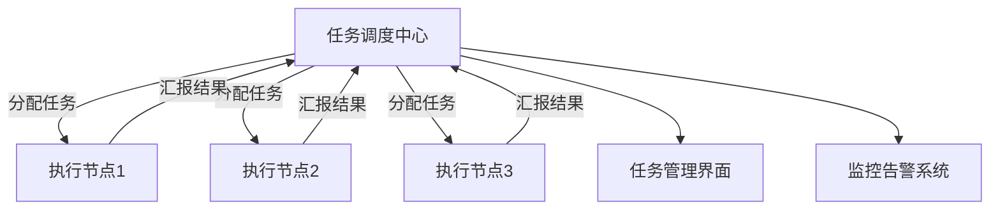
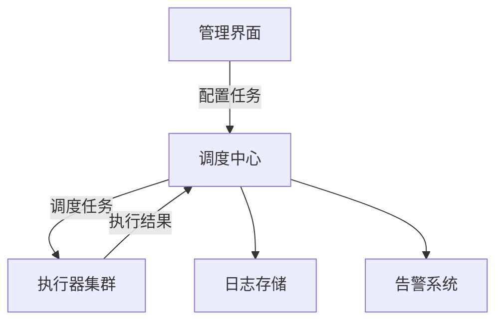
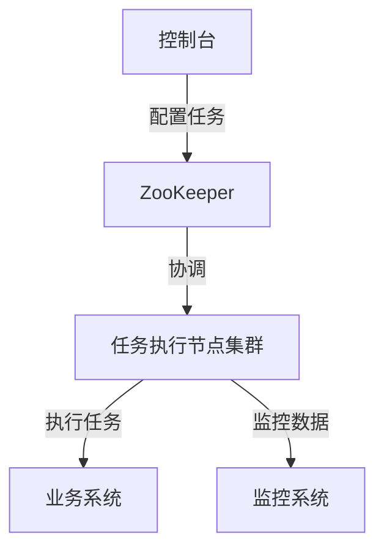

# 分布式任务调度实战

> 微服务架构下的定时任务统一管理与执行方案

## 📋 目录

1. [分布式任务调度概述](#1-分布式任务调度概述)
2. [核心架构与设计原理](#2-核心架构与设计原理)
3. [主流实现对比](#3-主流实现对比)
4. [XXL-Job实战](#4-xxl-job实战)
5. [Elastic-Job实战](#5-elastic-job实战)
6. [Quartz分布式改造实战](#6-quartz分布式改造实战)
7. [任务调度高级特性](#7-任务调度高级特性)
8. [最佳实践与性能优化](#8-最佳实践与性能优化)

---

## 1. 分布式任务调度概述

### 1.1 定义与价值

分布式任务调度是指在分布式系统环境下，对定时任务进行统一管理、调度和执行的一种机制。它解决了单体调度器的单点故障、资源限制和扩展性问题，确保任务在分布式环境中可靠、高效、公平地执行。

**解决的核心问题**：
- 单点故障风险：避免单机调度器故障导致所有任务失效
- 资源利用率低：充分利用集群资源执行任务
- 任务执行冲突：防止同一任务在多节点重复执行
- 负载均衡：任务在集群节点间合理分配
- 水平扩展：支持调度能力的线性扩展
- 任务监控与治理：统一的任务管理和监控平台

### 1.2 应用场景

- **定时任务**：如每日数据备份、月度报表生成
- **批量处理**：如大批量数据导入导出、日志分析
- **系统维护**：如缓存清理、临时文件删除
- **业务触发**：如下单后30分钟未支付自动取消
- **流计算**：如实时数据处理、指标统计
- **分布式事务**：如TCC模式中的补偿操作

### 1.3 技术挑战

- **任务分发**：如何将任务合理分配到集群节点
- **一致性保证**：确保任务执行状态的一致性
- **故障恢复**：任务执行失败后的重试与恢复机制
- **资源控制**：防止任务过度消耗系统资源
- **执行追踪**：任务执行过程的监控与追踪
- **时间精度**：不同节点间的时间同步问题



---

## 2. 核心架构与设计原理

### 2.1 架构模式

| 模式 | 描述 | 优点 | 缺点 |
|------|------|------|------|
| **中心调度式** | 中央调度节点分配任务给执行节点 | 控制集中、易于管理 | 调度中心可能成为瓶颈 |
| **去中心化调度** | 各节点自主决定是否执行任务 | 无单点瓶颈 | 一致性难以保证 |
| **混合调度** | 中心节点协调+节点自主决策 | 兼顾可靠性和扩展性 | 架构复杂 |

### 2.2 核心组件

- **任务注册中心**：存储任务元数据和执行状态
- **调度器**：负责任务触发和分配
- **执行器**：接收并执行任务
- **管理控制台**：任务配置和监控界面
- **日志系统**：记录任务执行日志
- **告警系统**：任务异常时触发告警

### 2.3 任务分发策略

| 策略 | 描述 | 适用场景 |
|------|------|----------|
| **轮询策略** | 任务按顺序分配到各节点 | 节点性能相近的场景 |
| **随机策略** | 随机选择执行节点 | 负载波动较小的场景 |
| **一致性哈希** | 基于任务ID哈希分配 | 任务与节点绑定的场景 |
| **负载均衡策略** | 根据节点负载动态分配 | 节点性能差异较大的场景 |
| **分片广播策略** | 所有节点执行任务的不同分片 | 大数据量并行处理 |

### 2.4 一致性保证机制

- **分布式锁**：基于Redis/ZooKeeper实现任务抢占
- **乐观锁**：通过版本号控制任务状态更新
- **状态机**：任务执行状态的严格流转控制
- **选主机制**：确保只有主节点执行特定任务

---

## 3. 主流实现对比

| 特性 | XXL-Job | Elastic-Job | Quartz | ScheduledExecutorService |
|------|---------|-------------|--------|--------------------------|
| **开发语言** | Java | Java | Java | Java |
| **架构模式** | 中心调度式 | 去中心化 | 中心调度式 | 单机 |
| **分布式支持** | 原生支持 | 原生支持 | 需改造 | 不支持 |
| **任务类型** | 丰富 | 丰富 | 基础 | 基础 |
| **负载均衡** | 支持 | 支持 | 有限 | 不支持 |
| **故障转移** | 支持 | 支持 | 不支持 | 不支持 |
| **任务分片** | 支持 | 支持 | 不支持 | 不支持 |
| **监控告警** | 完善 | 完善 | 基础 | 无 |
| **管理界面** | 有 | 有 | 第三方 | 无 |
| **易用性** | 高 | 中 | 中 | 高 |
| **社区活跃度** | 高 | 中 | 高 | 高 |
| **学习曲线** | 低 | 中 | 中 | 低 |

---

## 4. XXL-Job实战

### 4.1 XXL-Job架构



### 4.2 环境搭建

**1. 部署调度中心**：
```bash
# 1. 下载源码
git clone https://github.com/xuxueli/xxl-job.git
cd xxl-job

# 2. 初始化数据库
# 执行sql/xxl_job.sql

# 3. 配置调度中心
# 修改xxl-job-admin/src/main/resources/application.properties
# 主要配置数据库连接

# 4. 编译打包
mvn clean package -DskipTests

# 5. 启动调度中心
java -jar xxl-job-admin/target/xxl-job-admin-2.3.0.jar

# 6. 访问管理界面
open http://localhost:8080/xxl-job-admin
# 默认账号密码：admin/123456
```

**2. 集成执行器**：
```xml
<dependency>
    <groupId>com.xuxueli</groupId>
    <artifactId>xxl-job-core</artifactId>
    <version>2.3.0</version>
</dependency>
```

```yaml
xxl:
  job:
    admin:
      addresses: http://localhost:8080/xxl-job-admin
    executor:
      appname: order-executor
      port: 9999
      logpath: /data/applogs/xxl-job/jobhandler
      logretentiondays: 30
    accessToken: default_token
```

### 4.3 任务开发示例

**1. 编写任务处理器**：
```java
@Component
public class OrderTaskHandler {

    private static final Logger logger = LoggerFactory.getLogger(OrderTaskHandler.class);

    // 无参数任务
    @XxlJob("orderCancelJob")
    public void orderCancelJob() throws Exception {
        XxlJobHelper.log("订单取消任务开始执行");

        // 任务逻辑
        long timeout = 30 * 60 * 1000; // 30分钟
        Date cancelTime = new Date(System.currentTimeMillis() - timeout);
        int count = orderService.cancelTimeoutOrders(cancelTime);

        XxlJobHelper.log("订单取消任务执行完成，取消订单数量: {}", count);
        XxlJobHelper.handleSuccess("取消订单数量: " + count);
    }

    // 分片广播任务
    @XxlJob("orderStatisticsJob")
    public void orderStatisticsJob() throws Exception {
        // 获取分片信息
        int shardIndex = XxlJobHelper.getShardIndex();
        int shardTotal = XxlJobHelper.getShardTotal();

        XxlJobHelper.log("订单统计任务开始执行，分片索引: {}, 总分片数: {}", shardIndex, shardTotal);

        // 分片处理逻辑
        List<Date> dateList = getDateList();
        List<Date> shardDates = shardData(dateList, shardIndex, shardTotal);

        for (Date date : shardDates) {
            orderService.statisticsByDate(date);
        }

        XxlJobHelper.handleSuccess("分片任务执行完成");
    }

    // 分片逻辑
    private <T> List<T> shardData(List<T> dataList, int shardIndex, int shardTotal) {
        List<T> shardData = new ArrayList<>();
        for (int i = 0; i < dataList.size(); i++) {
            if (i % shardTotal == shardIndex) {
                shardData.add(dataList.get(i));
            }
        }
        return shardData;
    }
}
```

**2. 在调度中心配置任务**：
1. 登录XXL-Job管理界面
2. 进入"任务管理"页面，点击"新增"
3. 配置任务参数：
   - 任务描述：订单超时取消任务
   - 执行器：选择对应的执行器
   - 任务类型：BEAN模式
   - JobHandler：orderCancelJob
   - 调度类型：CRON
   - CRON表达式：0 0/5 * * * ?
   - 路由策略：轮询
   - 阻塞处理策略：单机串行
   - 任务超时时间：60秒

### 4.4 高可用部署

**1. 调度中心集群**：
- 部署多个调度中心实例
- 配置相同的数据库
- 前端配置负载均衡

**2. 执行器集群**：
- 部署多个执行器实例
- 确保appname一致
- 调度中心自动发现所有实例

---

## 5. Elastic-Job实战

### 5.1 Elastic-Job架构



### 5.2 环境搭建

**1. 添加依赖**：
```xml
<dependency>
    <groupId>com.dangdang</groupId>
    <artifactId>elastic-job-lite-core</artifactId>
    <version>2.1.5</version>
</dependency>
<dependency>
    <groupId>com.dangdang</groupId>
    <artifactId>elastic-job-lite-spring</artifactId>
    <version>2.1.5</version>
</dependency>
```

**2. 配置ZooKeeper**：
```java
@Configuration
public class ElasticJobConfig {

    @Bean
    public ZookeeperRegistryCenter registryCenter() {
        ZookeeperConfiguration zkConfig = new ZookeeperConfiguration("localhost:2181", "elastic-job-demo");
        zkConfig.setSessionTimeoutMilliseconds(10000);
        return new ZookeeperRegistryCenter(zkConfig);
    }
}
```

### 5.3 任务开发示例

**1. 简单任务**：
```java
@Component
public class InventoryCheckJob implements SimpleJob {

    private static final Logger logger = LoggerFactory.getLogger(InventoryCheckJob.class);

    @Autowired
    private InventoryService inventoryService;

    @Override
    public void execute(ShardingContext shardingContext) {
        logger.info("库存检查任务开始执行: {}", shardingContext);

        // 获取分片信息
        int shardingItem = shardingContext.getShardingItem();
        int shardingTotalCount = shardingContext.getShardingTotalCount();

        // 执行分片任务
        inventoryService.checkInventory(shardingItem, shardingTotalCount);

        logger.info("库存检查任务执行完成: {}", shardingContext);
    }
}
```

**2. 配置任务**：
```java
@Configuration
public class JobConfig {

    @Autowired
    private ZookeeperRegistryCenter registryCenter;

    @Autowired
    private InventoryCheckJob inventoryCheckJob;

    @Bean(initMethod = "init")
    public JobScheduler inventoryCheckJobScheduler() {
        // 作业配置
        JobCoreConfiguration coreConfig = JobCoreConfiguration.newBuilder(
            "inventoryCheckJob", "0 0 1 * * ?", 3)
            .shardingItemParameters("0=sharding0,1=sharding1,2=sharding2")
            .description("库存检查任务")
            .failover(true)
            .jobParameter("parameter")
            .misfire(true)
            .build();

        // 简单作业配置
        SimpleJobConfiguration simpleJobConfig = new SimpleJobConfiguration(
            coreConfig, InventoryCheckJob.class.getCanonicalName());

        // 作业调度器
        return new SpringJobScheduler(
            inventoryCheckJob,
            registryCenter,
            simpleJobConfig,
            new JobEventConfig(eventTraceDataSource()));
    }
}
```

**3. 控制台部署**：
```bash
# 下载控制台
wget https://github.com/elasticjob/elastic-job-console/releases/download/v2.1.5/elastic-job-console-2.1.5.tar.gz

tar -zxvf elastic-job-console-2.1.5.tar.gz
cd elastic-job-console-2.1.5

# 启动控制台
bin/start.sh

# 访问控制台
open http://localhost:8899
```

---

## 6. Quartz分布式改造实战

### 6.1 Quartz集群配置

**1. 添加依赖**：
```xml
<dependency>
    <groupId>org.quartz-scheduler</groupId>
    <artifactId>quartz</artifactId>
    <version>2.3.2</version>
</dependency>
<dependency>
    <groupId>org.quartz-scheduler</groupId>
    <artifactId>quartz-jobs</artifactId>
    <version>2.3.2</version>
</dependency>
```

**2. 数据库配置**：
```java
@Configuration
public class QuartzConfig {

    @Bean
    public SchedulerFactoryBean schedulerFactoryBean(DataSource dataSource) {
        SchedulerFactoryBean schedulerFactoryBean = new SchedulerFactoryBean();
        schedulerFactoryBean.setDataSource(dataSource);
        schedulerFactoryBean.setApplicationContextSchedulerContextKey("applicationContext");

        // 集群配置
        Properties properties = new Properties();
        properties.setProperty("org.quartz.scheduler.instanceName", "quartz-cluster");
        properties.setProperty("org.quartz.scheduler.instanceId", "AUTO");
        properties.setProperty("org.quartz.jobStore.class", "org.quartz.impl.jdbcjobstore.JobStoreTX");
        properties.setProperty("org.quartz.jobStore.driverDelegateClass", "org.quartz.impl.jdbcjobstore.StdJDBCDelegate");
        properties.setProperty("org.quartz.jobStore.tablePrefix", "QRTZ_");
        properties.setProperty("org.quartz.jobStore.isClustered", "true");
        properties.setProperty("org.quartz.jobStore.clusterCheckinInterval", "15000");
        properties.setProperty("org.quartz.threadPool.class", "org.quartz.simpl.SimpleThreadPool");
        properties.setProperty("org.quartz.threadPool.threadCount", "10");

        schedulerFactoryBean.setQuartzProperties(properties);
        schedulerFactoryBean.setOverwriteExistingJobs(true);
        schedulerFactoryBean.setAutoStartup(true);

        return schedulerFactoryBean;
    }
}
```

### 6.2 任务开发示例

**1. 创建Job类**：
```java
public class ReportJob implements Job {

    private static final Logger logger = LoggerFactory.getLogger(ReportJob.class);

    @Override
    public void execute(JobExecutionContext context) throws JobExecutionException {
        logger.info("报表生成任务开始执行");

        try {
            // 获取Job参数
            JobDataMap jobDataMap = context.getJobDetail().getJobDataMap();
            String reportType = jobDataMap.getString("reportType");
            Date reportDate = jobDataMap.getDate("reportDate");

            // 执行报表生成逻辑
            ReportService reportService = SpringContextHolder.getBean(ReportService.class);
            reportService.generateReport(reportType, reportDate);

            logger.info("报表生成任务执行完成");
        } catch (Exception e) {
            logger.error("报表生成任务执行失败", e);
            throw new JobExecutionException("报表生成任务执行失败", e, false);
        }
    }
}
```

**2. 调度任务**：
```java
@Service
public class QuartzJobService {

    @Autowired
    private Scheduler scheduler;

    public void scheduleReportJob(String jobName, String reportType, Date reportDate, String cronExpression) throws SchedulerException {
        // 创建JobDetail
        JobDetail jobDetail = JobBuilder.newJob(ReportJob.class)
            .withIdentity(jobName, "REPORT_GROUP")
            .usingJobData("reportType", reportType)
            .usingJobData("reportDate", reportDate)
            .storeDurably()
            .build();

        // 创建Trigger
        Trigger trigger = TriggerBuilder.newTrigger()
            .withIdentity(jobName + "_TRIGGER", "REPORT_TRIGGER_GROUP")
            .withSchedule(CronScheduleBuilder.cronSchedule(cronExpression))
            .startNow()
            .build();

        // 调度任务
        scheduler.scheduleJob(jobDetail, trigger);
    }
}
```

---

## 7. 分布式任务调度高级特性

### 7.1 任务分片策略实现

**1. 自定义分片策略**：
```java
public class CustomShardingStrategy implements JobShardingStrategy {
    @Override
    public Map<JobInstance, List<Integer>> sharding(List<JobInstance> jobInstances, JobConfiguration jobConfiguration) {
        Map<JobInstance, List<Integer>> result = new HashMap<>();
        int shardingTotalCount = jobConfiguration.getShardingTotalCount();

        // 实现自定义分片逻辑
        for (int i = 0; i < jobInstances.size(); i++) {
            JobInstance jobInstance = jobInstances.get(i);
            List<Integer> shardingItems = new ArrayList<>();
            for (int j = i; j < shardingTotalCount; j += jobInstances.size()) {
                shardingItems.add(j);
            }
            result.put(jobInstance, shardingItems);
        }

        return result;
    }
}
```

### 7.2 任务监控与追踪

**1. 任务执行监控**：
```java
@Component
public class JobMonitorListener extends JobListenerSupport {

    private static final Logger logger = LoggerFactory.getLogger(JobMonitorListener.class);

    @Autowired
    private JobMonitorService jobMonitorService;

    @Override
    public String getName() {
        return "jobMonitorListener";
    }

    @Override
    public void jobToBeExecuted(JobExecutionContext context) {
        // 任务执行前记录
        JobMonitorDTO monitorDTO = new JobMonitorDTO();
        monitorDTO.setJobName(context.getJobDetail().getKey().getName());
        monitorDTO.setJobGroup(context.getJobDetail().getKey().getGroup());
        monitorDTO.setStartTime(new Date());
        monitorDTO.setStatus(JobStatus.RUNNING);
        jobMonitorService.saveJobMonitor(monitorDTO);

        // 存储监控ID到JobExecutionContext
        context.getJobDetail().getJobDataMap().put("monitorId", monitorDTO.getId());
    }

    @Override
    public void jobWasExecuted(JobExecutionContext context, JobExecutionException jobException) {
        // 任务执行后更新状态
        Long monitorId = context.getJobDetail().getJobDataMap().getLong("monitorId");
        JobMonitorDTO monitorDTO = jobMonitorService.getJobMonitorById(monitorId);

        monitorDTO.setEndTime(new Date());
        monitorDTO.setDuration(monitorDTO.getEndTime().getTime() - monitorDTO.getStartTime().getTime());

        if (jobException != null) {
            monitorDTO.setStatus(JobStatus.FAILED);
            monitorDTO.setErrorMessage(jobException.getMessage());
        } else {
            monitorDTO.setStatus(JobStatus.SUCCESS);
        }

        jobMonitorService.updateJobMonitor(monitorDTO);

        // 异常告警
        if (jobException != null) {
            jobMonitorService.sendAlarm(monitorDTO);
        }
    }
}
```

### 7.3 动态任务管理

**1. 动态添加任务**：
```java
@Service
public class DynamicJobService {

    @Autowired
    private Scheduler scheduler;

    public void addJob(String jobName, String jobGroup, String cronExpression, Class<? extends Job> jobClass, Map<String, Object> params) throws SchedulerException {
        // 创建JobKey
        JobKey jobKey = new JobKey(jobName, jobGroup);

        // 检查任务是否已存在
        if (scheduler.checkExists(jobKey)) {
            throw new SchedulerException("任务已存在: " + jobName + "-" + jobGroup);
        }

        // 创建JobDetail
        JobDetail jobDetail = JobBuilder.newJob(jobClass)
            .withIdentity(jobKey)
            .storeDurably()
            .build();

        // 设置参数
        if (params != null && !params.isEmpty()) {
            JobDataMap jobDataMap = jobDetail.getJobDataMap();
            for (Map.Entry<String, Object> entry : params.entrySet()) {
                jobDataMap.put(entry.getKey(), entry.getValue());
            }
        }

        // 创建Trigger
        Trigger trigger = TriggerBuilder.newTrigger()
            .withIdentity(jobName + "_trigger", jobGroup)
            .withSchedule(CronScheduleBuilder.cronSchedule(cronExpression))
            .startNow()
            .build();

        // 调度任务
        scheduler.scheduleJob(jobDetail, trigger);
    }

    public void pauseJob(String jobName, String jobGroup) throws SchedulerException {
        JobKey jobKey = new JobKey(jobName, jobGroup);
        scheduler.pauseJob(jobKey);
    }

    public void resumeJob(String jobName, String jobGroup) throws SchedulerException {
        JobKey jobKey = new JobKey(jobName, jobGroup);
        scheduler.resumeJob(jobKey);
    }

    public void updateJobCron(String jobName, String jobGroup, String cronExpression) throws SchedulerException {
        TriggerKey triggerKey = new TriggerKey(jobName + "_trigger", jobGroup);
        CronTrigger trigger = (CronTrigger) scheduler.getTrigger(triggerKey);

        if (trigger == null) {
            throw new SchedulerException("触发器不存在: " + triggerKey);
        }

        // 如果cron表达式没有变化，则不更新
        if (trigger.getCronExpression().equals(cronExpression)) {
            return;
        }

        // 更新触发器
        trigger = trigger.getTriggerBuilder()
            .withIdentity(triggerKey)
            .withSchedule(CronScheduleBuilder.cronSchedule(cronExpression))
            .build();

        // 重新调度任务
        scheduler.rescheduleJob(triggerKey, trigger);
    }

    public void deleteJob(String jobName, String jobGroup) throws SchedulerException {
        JobKey jobKey = new JobKey(jobName, jobGroup);
        scheduler.deleteJob(jobKey);
    }
}
```

---

## 8. 最佳实践与性能优化

### 8.1 任务设计最佳实践

**1. 任务粒度控制**：
- 避免超大任务，拆分为小任务
- 单个任务执行时间控制在分钟级
- 大数据量任务采用分片处理

**2. 幂等性设计**：
```java
@Service
public class OrderService {
    // 基于唯一ID实现幂等
    public void processOrder(String orderId) {
        // 1. 检查是否已处理
        if (hasProcessed(orderId)) {
            log.info("订单已处理: {}", orderId);
            return;
        }

        // 2. 执行处理逻辑
        // ...

        // 3. 标记为已处理
        markAsProcessed(orderId);
    }
}
```

**3. 任务参数传递**：
- 避免传递大量数据，可传递ID后查询
- 使用序列化方式传递复杂对象
- 敏感参数需加密传输

### 8.2 性能优化策略

**1. 数据库优化**：
- 任务相关表添加合适索引
- 大表分区（按时间/任务ID）
- 定期清理历史任务数据

**2. 并发控制**：
- 合理设置线程池大小
- 控制任务并发度
- 使用异步处理非关键路径

**3. 网络优化**：
- 调度中心与执行器同机房部署
- 减少任务执行过程中的网络请求
- 批量处理远程调用

### 8.3 常见问题解决方案

**1. 任务执行超时**：
- 优化任务逻辑，减少执行时间
- 合理设置超时时间
- 实现任务断点续跑

**2. 任务数据不一致**：
- 采用分布式事务
- 实现最终一致性
- 定期数据校验与修复

**3. 集群负载不均**：
- 优化分片策略
- 实现动态负载均衡
- 避免任务依赖特定节点

**4. 任务监控告警**：
- 关键指标监控（成功率、执行时间）
- 多级告警机制（邮件、短信、钉钉）
- 告警抑制与聚合

---

## 📚 参考资源

- [XXL-Job官方文档](https://www.xuxueli.com/xxl-job/)
- [Elastic-Job官方文档](https://shardingsphere.apache.org/elasticjob/legacy/)
- [Quartz官方文档](http://www.quartz-scheduler.org/documentation/)
- [分布式任务调度平台设计与实现](https://time.geekbang.org/column/article/162858)
- [Java并发编程实战](https://book.douban.com/subject/10484692/)