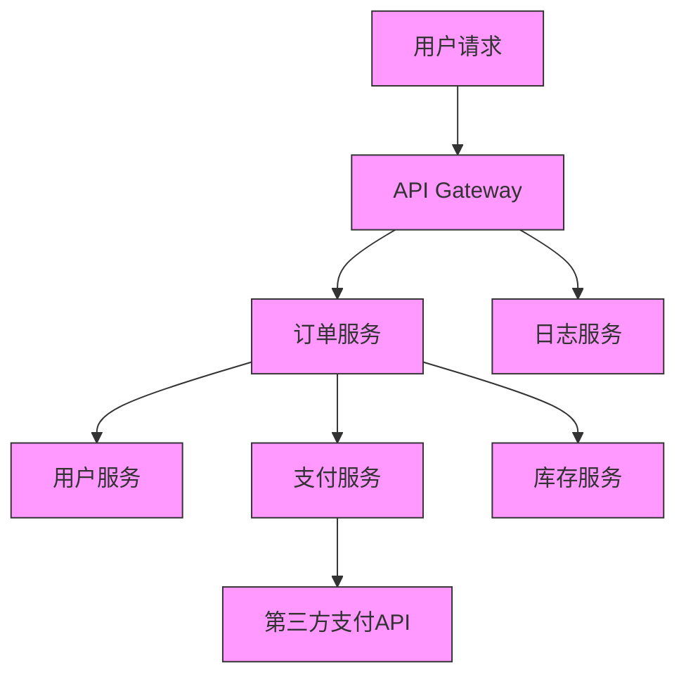

# 分布式追踪实战

> 微服务架构下的请求链路追踪与问题诊断方案

## 📋 目录

1. [分布式追踪概述](#1-分布式追踪概述)
2. [核心原理与数据模型](#2-核心原理与数据模型)
3. [主流实现对比](#3-主流实现对比)
4. [Spring Cloud Sleuth + Zipkin实战](#4-spring-cloud-sleuth--zipkin实战)
5. [Jaeger实战](#5-jaeger实战)
6. [SkyWalking实战](#6-skywalking实战)
7. [分布式追踪高级特性](#7-分布式追踪高级特性)
8. [最佳实践与性能优化](#8-最佳实践与性能优化)

---

## 1. 分布式追踪概述

### 1.1 定义与价值

分布式追踪（Distributed Tracing）是一种用于监控和诊断分布式系统的技术，通过追踪请求在多个服务间的传播路径，帮助开发人员理解系统行为、排查性能瓶颈和定位故障点。

**解决的核心问题**：
- 跨服务请求链路可视化
- 性能瓶颈定位
- 服务依赖关系分析
- 异常请求追踪
- 系统行为基线建立

### 1.2 发展历程

- 2010年：Google发表Dapper论文，奠定分布式追踪基础
- 2012年：Twitter开源Zipkin
- 2015年：Uber开源Jaeger
- 2017年：Apache SkyWalking开源
- 2019年：CNCF成立OpenTelemetry项目

### 1.3 典型应用场景

- 微服务架构下的请求追踪
- 分布式事务问题排查
- 全链路性能优化
- 服务依赖分析
- 容量规划与资源优化



---

## 2. 核心原理与数据模型

### 2.1 基本原理

分布式追踪通过在请求流经的各个服务间传递追踪标识（Trace ID）和跨度标识（Span ID），记录请求的路径、耗时和元数据，最终形成完整的调用链路视图。

### 2.2 核心概念

| 概念 | 描述 |
|------|------|
| **Trace ID** | 全局唯一的请求标识，贯穿整个分布式调用链路 |
| **Span ID** | 每个服务处理单元的唯一标识，形成父子关系 |
| **Span** | 基本工作单元，代表一个服务的处理过程 |
| **Annotation** | 时间点事件标记，如请求开始、请求结束等 |
| **Tag** | 键值对属性，用于存储额外信息 |
| **Context Propagation** | 跨进程传递追踪上下文信息 |

### 2.3 数据模型

```
Trace
├── Span (API Gateway)
│   ├── Annotation: cs, sr, ss, cr
│   ├── Tag: http.method=GET, http.url=/api/order
│   └── Span (订单服务)
│       ├── Tag: db.instance=order_db
│       ├── Span (用户服务)
│       └── Span (支付服务)
│           └── Span (第三方支付API)
└── Span (日志服务)
```

### 2.4 追踪流程

1. **追踪上下文生成**：请求进入系统时生成Trace ID
2. **上下文传递**：通过网络请求头传递Trace ID和Span ID
3. **本地追踪**：每个服务记录处理开始和结束时间
4. **数据收集**：将Span信息发送到追踪系统
5. **数据存储与分析**：存储追踪数据并提供查询分析能力
6. **可视化展示**：以图表形式展示完整调用链路

---

## 3. 主流实现对比

| 特性 | Zipkin | Jaeger | SkyWalking | OpenTelemetry |
|------|--------|--------|------------|---------------|
| **开发语言** | Java | Go | Java | 多语言 |
| **架构** | 传统架构 | 云原生架构 | 探针+后端架构 | 规范+SDK |
| **数据采集** | 主动上报 | 主动上报 | 字节码增强 | 多方式采集 |
| **存储** | 内存/MySQL/Cassandra/Elasticsearch | Cassandra/Elasticsearch | Elasticsearch/MySQL/TiDB | 多存储支持 |
| **UI** | 基础链路展示 | 丰富的可视化 | 全面的监控视图 | 依赖外部UI |
| **性能影响** | 较低 | 低 | 低 | 可配置 |
| **生态集成** | Spring Cloud/Sleuth | Kubernetes/OpenShift | 多语言/多框架 | 广泛集成 |
| **高级特性** | 基础 | 流量控制/自适应采样 | APM/服务网格支持 |  vendor中立 |
| **社区活跃度** | 中 | 高 | 高 | 高 |

---

## 4. Spring Cloud Sleuth + Zipkin实战

### 4.1 环境搭建

**1. 添加依赖**：
```xml
<!-- Spring Cloud Sleuth -->
<dependency>
    <groupId>org.springframework.cloud</groupId>
    <artifactId>spring-cloud-starter-sleuth</artifactId>
</dependency>

<!-- Zipkin客户端 -->
<dependency>
    <groupId>org.springframework.cloud</groupId>
    <artifactId>spring-cloud-sleuth-zipkin</artifactId>
</dependency>
```

**2. 配置文件**：
```yaml
spring:
  application:
    name: order-service
  zipkin:
    base-url: http://localhost:9411
  sleuth:
    sampler:
      probability: 1.0 # 采样率100%，生产环境建议0.1-0.01
    baggage:
      remote-fields: x-request-id, x-tenant-id
      correlation-fields: x-request-id, x-tenant-id
```

**3. 启动Zipkin**：
```bash
# 方式一：使用Docker
docker run -d -p 9411:9411 openzipkin/zipkin

# 方式二：使用Java
curl -sSL https://zipkin.io/quickstart.sh | bash -s
java -jar zipkin.jar

# 访问Zipkin UI
open http://localhost:9411
```

### 4.2 基本使用

**1. 自动追踪**：
Spring Cloud Sleuth会自动为以下组件生成追踪信息：
- RestTemplate
- WebClient
- Feign Client
- Spring MVC控制器
- 异步操作（@Async）
- 消息队列（RabbitMQ、Kafka等）

**2. 手动创建Span**：
```java
@Service
public class OrderServiceImpl implements OrderService {

    private static final Logger log = LoggerFactory.getLogger(OrderServiceImpl.class);

    @Autowired
    private UserService userService;

    @Override
    public OrderDTO createOrder(OrderRequest request) {
        // 手动创建Span
        try (Span span = tracer.nextSpan().name("order-processing").start()) {
            log.info("开始创建订单: {}", request.getOrderNo());

            // 添加自定义Tag
            span.tag("orderNo", request.getOrderNo());
            span.tag("userId", request.getUserId());

            // 调用用户服务
            UserDTO user = userService.getUserById(request.getUserId());

            // 添加事件标记
            span.addEvent("用户信息获取完成");

            // 创建订单逻辑
            OrderDTO order = new OrderDTO();
            // ...

            log.info("订单创建完成: {}", order.getId());
            return order;
        }
    }
}
```

### 4.3 自定义追踪上下文

```java
@Component
public class CustomTraceFilter extends OncePerRequestFilter {

    @Autowired
    private Tracer tracer;

    @Override
    protected void doFilterInternal(HttpServletRequest request, HttpServletResponse response, FilterChain filterChain) {
        // 从请求头获取自定义ID
        String requestId = request.getHeader("X-Request-ID");
        String tenantId = request.getHeader("X-Tenant-ID");

        // 将自定义ID添加到追踪上下文
        if (requestId != null) {
            tracer.currentSpan().tag("X-Request-ID", requestId);
        }
        if (tenantId != null) {
            tracer.currentSpan().tag("X-Tenant-ID", tenantId);
        }

        filterChain.doFilter(request, response);
    }
}
```

### 4.4 集成日志框架

```xml
<dependency>
    <groupId>net.logstash.logback</groupId>
    <artifactId>logstash-logback-encoder</artifactId>
    <version>6.6</version>
</dependency>
```

```xml
<!-- logback-spring.xml -->
<appender name="JSON_FILE" class="ch.qos.logback.core.rolling.RollingFileAppender">
    <file>logs/order-service.json</file>
    <encoder class="net.logstash.logback.encoder.LogstashEncoder">
        <includeMdcKeyName>traceId</includeMdcKeyName>
        <includeMdcKeyName>spanId</includeMdcKeyName>
        <includeMdcKeyName>X-Request-ID</includeMdcKeyName>
        <fieldNames>
            <timestamp>timestamp</timestamp>
            <message>message</message>
            <logger>logger</logger>
            <thread>thread</thread>
            <level>level</level>
        </fieldNames>
    </encoder>
</appender>
```

---

## 5. Jaeger实战

### 5.1 Jaeger部署

```bash
# Docker Compose部署
curl -O https://raw.githubusercontent.com/jaegertracing/jaeger/master/docker-compose.yml
 docker-compose up -d

# 访问Jaeger UI
open http://localhost:16686
```

### 5.2 Spring Boot集成Jaeger

**1. 添加依赖**：
```xml
<dependency>
    <groupId>io.opentracing.contrib</groupId>
    <artifactId>opentracing-spring-jaeger-cloud-starter</artifactId>
    <version>3.3.1</version>
</dependency>
```

**2. 配置文件**：
```yaml
opentracing:
  jaeger:
    service-name: order-service
    udp-sender:
      host: localhost
      port: 6831
    sampler:
      type: const
      param: 1
    logs:
      enabled: true
```

### 5.3 微服务集成示例

```java
@RestController
@RequestMapping("/orders")
public class OrderController {

    private static final Logger log = LoggerFactory.getLogger(OrderController.class);

    @Autowired
    private OrderService orderService;

    @Autowired
    private Tracer tracer;

    @PostMapping
    public ResponseEntity<OrderDTO> createOrder(@RequestBody @Valid OrderRequest request) {
        // 创建自定义Span
        Span span = tracer.buildSpan("createOrderController").start();
        try (Scope scope = tracer.scopeManager().activate(span)) {
            log.info("接收订单创建请求: {}", request.getOrderNo());
            OrderDTO order = orderService.createOrder(request);
            return ResponseEntity.ok(order);
        } catch (Exception e) {
            // 记录异常信息
            span.log(Map.of("error", e.getMessage()));
            span.setTag(Tags.ERROR, true);
            throw e;
        } finally {
            span.finish();
        }
    }
}
```

---

## 6. SkyWalking实战

### 6.1 SkyWalking部署

```bash
# 下载SkyWalking
wget https://archive.apache.org/dist/skywalking/8.7.0/apache-skywalking-apm-8.7.0.tar.gz

tar -zxvf apache-skywalking-apm-8.7.0.tar.gz
cd apache-skywalking-apm-bin

# 启动后端服务
bin/startup.sh

# 访问SkyWalking UI
open http://localhost:8080
```

### 6.2 应用接入

**1. 配置SkyWalking Agent**：
```bash
java -javaagent:/path/to/skywalking-agent/skywalking-agent.jar \
     -Dskywalking.agent.service_name=order-service \
     -Dskywalking.collector.backend_service=localhost:11800 \
     -jar order-service.jar
```

**2. Docker集成**：
```dockerfile
FROM openjdk:11-jre-slim
COPY skywalking-agent /usr/local/skywalking-agent
COPY target/order-service.jar app.jar
ENTRYPOINT [