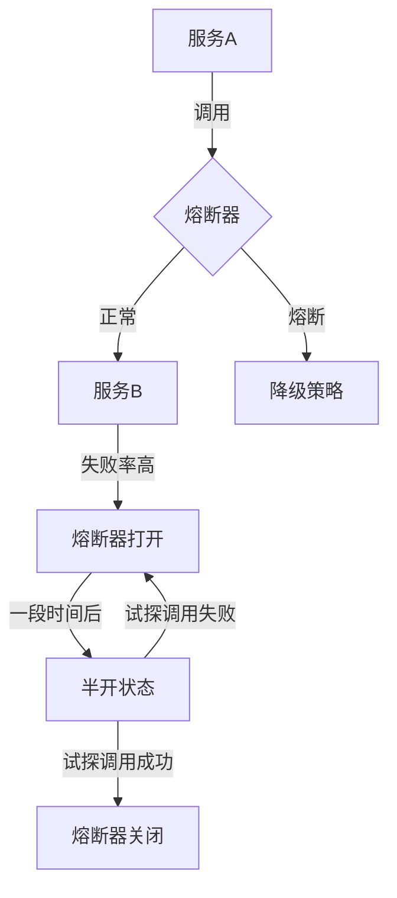

# 熔断器实战

> 微服务架构下的故障隔离与容错保护机制

## 📋 目录

1. [熔断器概述](#1-熔断器概述)
2. [核心原理与状态机](#2-核心原理与状态机)
3. [主流实现对比](#3-主流实现对比)
4. [Resilience4j实战](#4-resilience4j实战)
5. [Sentinel实战](#5-sentinel实战)
6. [Hystrix实战（ legacy ）](#6-hystrix实战-legacy-)
7. [熔断器模式与其他容错模式组合](#7-熔断器模式与其他容错模式组合)
8. [最佳实践与监控告警](#8-最佳实践与监控告警)

---

## 1. 熔断器概述

### 1.1 定义与价值

熔断器（Circuit Breaker）是一种故障隔离机制，用于保护分布式系统中的服务调用。当依赖服务出现故障时，熔断器能够快速失败并阻止故障级联传播，从而提高系统的弹性和稳定性。

**解决的核心问题**：
- 服务依赖故障导致的级联失败
- 资源耗尽与系统雪崩
- 缓慢响应导致的超时堆积
- 故障恢复自动化

### 1.2 应用场景

- 外部API调用保护
- 数据库访问熔断
- 缓存服务降级
- 第三方服务集成容错
- 高并发场景流量控制



---

## 2. 核心原理与状态机

### 2.1 工作原理

熔断器通过监控服务调用的失败率来决定是否触发熔断保护：
1. 记录调用成功/失败次数
2. 当失败率超过阈值时触发熔断
3. 熔断期间快速失败并执行降级策略
4. 经过恢复期后进入半开状态试探调用
5. 根据试探结果决定完全恢复或继续熔断

### 2.2 三态模型

| 状态 | 描述 | 转换条件 |
|------|------|----------|
| **关闭（Closed）** | 正常工作状态，所有请求正常转发 | 失败率超过阈值 → 打开状态 |
| **打开（Open）** | 熔断状态，所有请求被拦截 | 经过恢复期 → 半开状态 |
| **半开（Half-Open）** | 试探状态，允许部分请求通过 | 试探请求成功 → 关闭状态<br>试探请求失败 → 打开状态 |

### 2.3 核心参数

- **失败阈值**：触发熔断的失败率百分比（默认50%）
- **请求阈值**：统计失败率的最小请求数（默认20个）
- **熔断时间窗口**：熔断器打开状态持续时间（默认5秒）
- **半开试探请求数**：半开状态下允许的试探请求数量
- **超时阈值**：定义请求超时的时间界限

---

## 3. 主流实现对比

| 特性 | Resilience4j | Sentinel | Hystrix |
|------|-------------|----------|---------|
| **开发语言** | Java | Java | Java |
| **依赖** | 轻量级（仅vavr） | 轻量级 | 较重（依赖RxJava等） |
| **核心功能** | 熔断、限流、重试、舱壁 | 熔断、限流、降级、热点防护 | 熔断、限流、降级、舱壁 |
| **监控** | Micrometer/Prometheus | 自带Dashboard | Hystrix Dashboard/Turbine |
| **配置方式** | 注解、编程式、配置文件 | 注解、编程式、配置中心 | 注解、配置文件 |
| **线程模型** | 非阻塞（装饰器模式） | 混合模式 | 线程池隔离/信号量 |
| **学习曲线** | 低 | 中 | 中 |
| **社区活跃度** | 高（Spring Cloud推荐） | 高（Alibaba） | 低（已停止开发） |
| **Spring Cloud集成** | 原生支持 | Spring Cloud Alibaba | Spring Cloud Netflix |
| **熔断策略** | 失败率、慢调用率 | 响应时间、异常比例、异常数 | 失败率 |

---

## 4. Resilience4j实战

### 4.1 环境配置

**1. 添加依赖**：
```xml
<dependency>
    <groupId>io.github.resilience4j</groupId>
    <artifactId>resilience4j-spring-boot2</artifactId>
    <version>1.7.1</version>
</dependency>
<dependency>
    <groupId>org.springframework.boot</groupId>
    <artifactId>spring-boot-starter-actuator</artifactId>
</dependency>
```

**2. 基础配置**：
```yaml
resilience4j:
  circuitbreaker:
    instances:
      orderService:
        slidingWindowSize: 10
        failureRateThreshold: 50
        waitDurationInOpenState: 10000
        permittedNumberOfCallsInHalfOpenState: 3
        registerHealthIndicator: true
  retry:
    instances:
      orderService:
        maxRetryAttempts: 3
        waitDuration: 1000
        enableExponentialBackoff: true
        exponentialBackoffMultiplier: 2
  timeout:
    instances:
      orderService:
        timeoutDuration: 3000
```

### 4.2 熔断实现

**1. 注解式使用**：
```java
@RestController
public class OrderController {

    @Autowired
    private OrderService orderService;

    @GetMapping("/order/{id}")
    @CircuitBreaker(name = "orderService", fallbackMethod = "getOrderFallback")
    @Retry(name = "orderService")
    @Timeout(name = "orderService")
    public OrderDTO getOrder(@PathVariable Long id) {
        return orderService.getOrderById(id);
    }

    // 降级方法
    public OrderDTO getOrderFallback(Long id, Exception e) {
        log.warn("获取订单失败，执行降级策略: {}", e.getMessage());
        return new OrderDTO(id, "降级订单", LocalDateTime.now());
    }
}
```

**2. 编程式使用**：
```java
@Service
public class OrderServiceImpl implements OrderService {

    private final CircuitBreaker circuitBreaker;
    private final RestTemplate restTemplate;

    public OrderServiceImpl(CircuitBreakerRegistry registry, RestTemplate restTemplate) {
        this.circuitBreaker = registry.circuitBreaker("orderService");
        this.restTemplate = restTemplate;
    }

    @Override
    public OrderDTO getOrderById(Long id) {
        // 使用函数式编程包装远程调用
        return Try.ofSupplier(CircuitBreaker.decorateSupplier(circuitBreaker, () -> {
            String url = "http://order-service/orders/" + id;
            return restTemplate.getForObject(url, OrderDTO.class);
        }))
        .recover(e -> new OrderDTO(id, "降级订单", LocalDateTime.now()))
        .get();
    }
}
```

### 4.3 舱壁模式

```java
@Service
public class PaymentService {

    // 创建线程池隔离的舱壁
    @Bulkhead(name = "paymentService", fallbackMethod = "processPaymentFallback")
    public CompletableFuture<PaymentResult> processPayment(PaymentRequest request) {
        return CompletableFuture.supplyAsync(() -> {
            // 处理支付逻辑
            return paymentProvider.process(request);
        });
    }

    public CompletableFuture<PaymentResult> processPaymentFallback(PaymentRequest request, Exception e) {
        return CompletableFuture.supplyAsync(() -> {
            return new PaymentResult(false, "支付服务降级");
        });
    }
}
```

### 4.4 监控集成

```yaml
management:
  endpoints:
    web:
      exposure:
        include: health,info,circuitbreakerevents,metrics
  metrics:
    export:
      prometheus:
        enabled: true
  endpoint:
    health:
      show-details: always
      probes:
        enabled: true
```

**Grafana监控面板**：
- resilience4j_circuitbreaker_state (0=closed, 1=open, 2=half-open)
- resilience4j_circuitbreaker_failure_rate
- resilience4j_circuitbreaker_calls

---

## 5. Sentinel实战

### 5.1 环境搭建

**1. 添加依赖**：
```xml
<dependency>
    <groupId>com.alibaba.cloud</groupId>
    <artifactId>spring-cloud-starter-alibaba-sentinel</artifactId>
    <version>2.2.7.RELEASE</version>
</dependency>
<dependency>
    <groupId>com.alibaba.csp</groupId>
    <artifactId>sentinel-dashboard</artifactId>
    <version>1.8.2</version>
</dependency>
```

**2. 启动Sentinel Dashboard**：
```bash
java -jar sentinel-dashboard-1.8.2.jar --server.port=8080
open http://localhost:8080 # 默认账号密码：sentinel/sentinel
```

**3. 应用配置**：
```yaml
spring:
  application:
    name: order-service
  cloud:
    sentinel:
      transport:
        dashboard: localhost:8080
        port: 8719
      eager: true
      datasource:
        ds1:
          nacos:
            server-addr: localhost:8848
            dataId: ${spring.application.name}-sentinel-rules
            groupId: DEFAULT_GROUP
            rule-type: flow
```

### 5.2 流量控制规则

**1. 代码定义规则**：
```java
@Configuration
public class SentinelConfig {

    @PostConstruct
    public void initRules() {
        // 流控规则
        List<FlowRule> flowRules = new ArrayList<>();
        FlowRule rule = new FlowRule();
        rule.setResource("getOrder");
        rule.setGrade(RuleConstant.FLOW_GRADE_QPS);
        rule.setCount(10); // QPS阈值10
        flowRules.add(rule);
        FlowRuleManager.loadRules(flowRules);

        // 熔断规则
        List<DegradeRule> degradeRules = new ArrayList<>();
        DegradeRule degradeRule = new DegradeRule();
        degradeRule.setResource("getOrder");
        degradeRule.setGrade(RuleConstant.DEGRADE_GRADE_EXCEPTION_RATIO);
        degradeRule.setCount(0.5); // 异常比例阈值50%
        degradeRule.setTimeWindow(10); // 熔断时间窗口10秒
        degradeRules.add(degradeRule);
        DegradeRuleManager.loadRules(degradeRules);
    }
}
```

**2. 注解式使用**：
```java
@RestController
public class OrderController {

    @GetMapping("/order/{id}")
    @SentinelResource(value = "getOrder", fallback = "getOrderFallback", blockHandler = "getOrderBlockHandler")
    public OrderDTO getOrder(@PathVariable Long id) {
        if (id == 0) {
            throw new RuntimeException("模拟服务异常");
        }
        return orderService.getOrderById(id);
    }

    // 异常降级方法
    public OrderDTO getOrderFallback(Long id) {
        return new OrderDTO(id, "Sentinel异常降级订单", LocalDateTime.now());
    }

    // 流控降级方法
    public OrderDTO getOrderBlockHandler(Long id, BlockException e) {
        return new OrderDTO(id, "Sentinel流控降级订单", LocalDateTime.now());
    }
}
```

### 5.3 热点参数限流

```java
@SentinelResource(value = "getProduct", blockHandler = "getProductBlockHandler")
@GetMapping("/product/{id}")
public ProductDTO getProduct(@PathVariable Long id) {
    return productService.getProductById(id);
}

// 热点参数规则配置
@PostConstruct
public void initHotParamRules() {
    List<ParamFlowRule> rules = new ArrayList<>();
    ParamFlowRule rule = new ParamFlowRule();
    rule.setResource("getProduct");
    rule.setParamIdx(0); // 第0个参数
    rule.setGrade(RuleConstant.FLOW_GRADE_QPS);
    rule.setCount(5); // 基础阈值

    // 特殊参数值限流
    ParamFlowItem item = new ParamFlowItem();
    item.setObject(String.valueOf(100)); // 商品ID=100
    item.setCount(2); // 特殊阈值
    rule.setParamFlowItemList(Collections.singletonList(item));

    rules.add(rule);
    ParamFlowRuleManager.loadRules(rules);
}
```

---

## 6. Hystrix实战（ legacy ）

> 注意：Hystrix已停止开发，建议使用Resilience4j或Sentinel替代

### 6.1 基础配置

```xml
<dependency>
    <groupId>org.springframework.cloud</groupId>
    <artifactId>spring-cloud-starter-netflix-hystrix</artifactId>
</dependency>
```

```yaml
feign:
  hystrix:
    enabled: true

hystrix:
  command:
    default:
      circuitBreaker:
        requestVolumeThreshold: 20
        errorThresholdPercentage: 50
        sleepWindowInMilliseconds: 5000
      execution:
        isolation:
          thread:
            timeoutInMilliseconds: 3000
```

### 6.2 服务熔断实现

```java
@RestController
@EnableHystrix
public class ProductController {

    @Autowired
    private ProductService productService;

    @GetMapping("/product/{id}")
    @HystrixCommand(fallbackMethod = "getProductFallback",
                   commandProperties = {
                       @HystrixProperty(name = "circuitBreaker.requestVolumeThreshold", value = "10"),
                       @HystrixProperty(name = "circuitBreaker.errorThresholdPercentage", value = "50")
                   })
    public ProductDTO getProduct(@PathVariable Long id) {
        return productService.getProductById(id);
    }

    public ProductDTO getProductFallback(Long id) {
        return new ProductDTO(id, "Hystrix降级商品", BigDecimal.ZERO);
    }
}
```

### 6.3 Feign客户端集成

```java
@FeignClient(name = "order-service", fallback = OrderFeignFallback.class)
public interface OrderFeignClient {

    @GetMapping("/orders/{id}")
    OrderDTO getOrder(@PathVariable("id") Long id);
}

@Component
public class OrderFeignFallback implements OrderFeignClient {
    @Override
    public OrderDTO getOrder(Long id) {
        return new OrderDTO(id, "Feign降级订单", LocalDateTime.now());
    }
}
```

---

## 7. 熔断器模式与其他容错模式组合

### 7.1 熔断器 + 重试

```java
@CircuitBreaker(name = "paymentService", fallbackMethod = "paymentFallback")
@Retry(name = "paymentService", fallbackMethod = "paymentRetryFallback")
public PaymentResult processPayment(PaymentRequest request) {
    return paymentGateway.process(request);
}
```

### 7.2 熔断器 + 舱壁

```java
@Service
public class OrderService {
    // 订单查询使用A线程池
    @CircuitBreaker(name = "orderQueryService")
    @Bulkhead(name = "orderQueryPool")
    public OrderDTO queryOrder(Long id) { ... }

    // 订单创建使用B线程池
    @CircuitBreaker(name = "orderCreateService")
    @Bulkhead(name = "orderCreatePool")
    public OrderDTO createOrder(OrderRequest request) { ... }
}
```

### 7.3 熔断器 + 超时控制

```java
@CircuitBreaker(name = "remoteService")
@Timeout(name = "remoteService", fallbackMethod = "timeoutFallback")
public ResultDTO callRemoteService() {
    // 远程调用逻辑
}

public ResultDTO timeoutFallback(Exception e) {
    return new ResultDTO("超时降级响应");
}
```

---

## 8. 最佳实践与监控告警

### 8.1 熔断器配置最佳实践

- **合理设置阈值**：根据业务特性调整失败率和请求阈值
- **精细化资源定义**：按业务场景定义不同的熔断器资源
- **降级策略设计**：
  - 静态降级数据缓存
  - 备用服务调用
  - 部分功能降级
- **避免熔断器风暴**：不同服务使用独立的熔断器
- **熔断与限流结合**：流量控制在前，熔断保护在后

### 8.2 监控指标与告警

**关键监控指标**：
- 熔断器状态变化
- 调用成功率/失败率
- 降级次数统计
- 响应时间分布
- 线程池/信号量使用情况

**Prometheus告警规则**：
```yaml
groups:
- name: circuitbreaker_alerts
  rules:
  - alert: CircuitBreakerOpen
    expr: resilience4j_circuitbreaker_state{state="OPEN"} == 1
    for: 10s
    labels:
      severity: critical
    annotations:
      summary: "熔断器打开状态"
      description: "服务 {{ $labels.name }} 熔断器已打开超过10秒"

  - alert: HighFailureRate
    expr: sum(resilience4j_circuitbreaker_calls{status="failed"}) / sum(resilience4j_circuitbreaker_calls) > 0.3
    for: 5m
    labels:
      severity: warning
    annotations:
      summary: "服务调用失败率高"
      description: "服务调用失败率超过30%持续5分钟"
```

### 8.3 常见问题排查

**1. 熔断器不触发**：
- 检查请求量是否达到最小阈值
- 验证失败率计算是否准确
- 确认异常是否被正确捕获

**2. 熔断器无法关闭**：
- 检查半开状态试探请求是否成功
- 验证恢复期设置是否合理
- 排查依赖服务是否真正恢复

**3. 降级策略不执行**：
- 确认降级方法签名是否匹配
- 检查异常类型是否正确
- 验证熔断状态是否正确

**4. 性能问题**：
- 避免降级方法执行耗时操作
- 合理设置线程池参数
- 优化熔断判断逻辑

---

## 📚 参考资源

- [Resilience4j官方文档](https://resilience4j.readme.io/docs)
- [Sentinel官方文档](https://sentinelguard.io/zh-cn/docs/introduction.html)
- [Spring Cloud Circuit Breaker文档](https://docs.spring.io/spring-cloud-circuitbreaker/docs/current/reference/html/)
- [Martin Fowler的熔断器模式](https://martinfowler.com/bliki/CircuitBreaker.html)
- [Resilience4j与Sentinel性能对比](https://github.com/resilience4j/resilience4j/wiki/Comparisons)