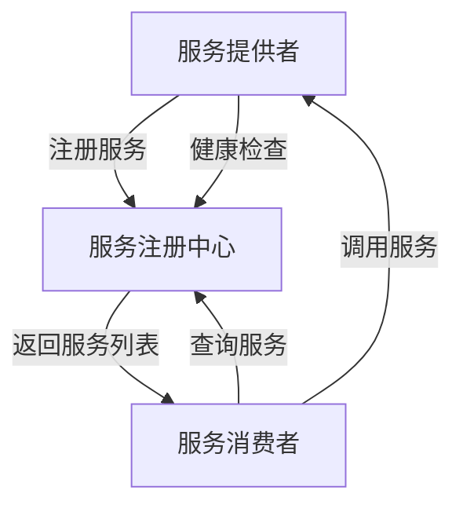
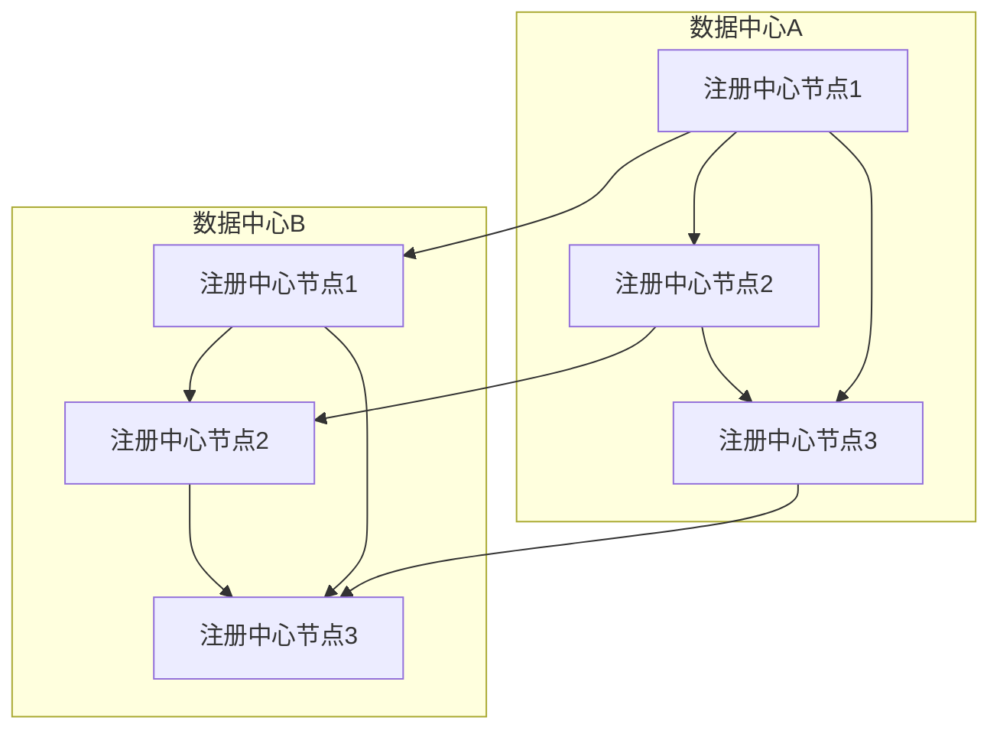

# 服务注册与发现实战

> 微服务架构下的服务治理核心技术

## 📋 目录

1. [服务注册与发现概述](#1-服务注册与发现概述)
2. [核心原理](#2-核心原理)
3. [主流实现对比](#3-主流实现对比)
4. [Eureka实战](#4-eureka实战)
5. [Consul实战](#5-consul实战)
6. [Nacos实战](#6-nacos实战)
7. [高可用部署策略](#7-高可用部署策略)
8. [最佳实践与问题排查](#8-最佳实践与问题排查)

---

## 1. 服务注册与发现概述

### 1.1 定义与价值

服务注册与发现是微服务架构中的核心组件，负责自动检测和跟踪可用服务实例，实现服务位置的动态管理。

**解决的核心问题**：
- 微服务实例动态扩缩容导致的地址变化
- 服务间通信的负载均衡
- 服务健康状态监控
- 故障自动转移

### 1.2 应用场景

- 微服务架构下的服务通信
- 云原生环境中的动态服务管理
- 容器化部署的服务协调
- DevOps持续部署流程集成



---

## 2. 核心原理

### 2.1 工作流程

1. **服务注册**：服务启动时将自身信息（地址、端口、服务名等）注册到注册中心
2. **健康检查**：注册中心定期检查服务健康状态
3. **服务发现**：消费者从注册中心查询可用服务列表
4. **负载均衡**：消费者根据负载均衡策略选择服务实例
5. **服务下线**：服务关闭前从注册中心注销

### 2.2 核心组件

| 组件 | 功能 |
|------|------|
| **服务注册中心** | 存储服务元数据，提供服务注册与查询接口 |
| **服务提供者** | 注册自身服务，提供服务功能 |
| **服务消费者** | 查询服务列表，调用服务 |
| **健康检查器** | 监控服务健康状态 |
| **负载均衡器** | 在多个服务实例间分配请求 |

### 2.3 服务元数据

服务注册中心存储的关键信息：
- 服务名称（Service Name）
- 实例ID（Instance ID）
- 网络地址（Host、Port）
- 健康检查地址
- 元数据标签（Metadata）
- 状态（UP/DOWN/STARTING/OUT_OF_SERVICE）

---

## 3. 主流实现对比

| 特性 | Eureka | Consul | Nacos | ZooKeeper | etcd |
|------|--------|--------|-------|-----------|------|
| **开发语言** | Java | Go | Java | Java | Go |
| **一致性协议** | AP | CP+AP | CP+AP | CP | CP |
| **服务发现** | 支持 | 支持 | 支持 | 支持 | 支持 |
| **健康检查** | 客户端心跳 | HTTP/gRPC/TCP | 客户端心跳/HTTP/MySQL | 客户端心跳 | 客户端心跳 |
| **配置管理** | 不支持 | 支持 | 支持 | 支持 | 支持 |
| **多数据中心** | 支持 | 支持 | 支持 | 有限 | 有限 |
| **易用性** | 高 | 中 | 高 | 低 | 中 |
| **性能** | 高 | 中 | 高 | 中 | 高 |
| **生态集成** | Spring Cloud | 多语言支持 | Spring Cloud/Dubbo | 多语言支持 | 多语言支持 |
| **社区活跃度** | 中 | 高 | 高 | 高 | 高 |

---

## 4. Eureka实战

### 4.1 服务端搭建

**1. 添加依赖**：
```xml
<dependency>
    <groupId>org.springframework.cloud</groupId>
    <artifactId>spring-cloud-starter-netflix-eureka-server</artifactId>
</dependency>
```

**2. 配置文件**：
```yaml
server:
  port: 8761

eureka:
  instance:
    hostname: localhost
  client:
    registerWithEureka: false
    fetchRegistry: false
    serviceUrl:
      defaultZone: http://${eureka.instance.hostname}:${server.port}/eureka/
  server:
    enableSelfPreservation: false # 关闭自我保护模式
    evictionIntervalTimerInMs: 30000 # 清理间隔（毫秒）
```

**3. 启动类**：
```java
@SpringBootApplication
@EnableEurekaServer
public class EurekaServerApplication {
    public static void main(String[] args) {
        SpringApplication.run(EurekaServerApplication.class, args);
    }
}
```

### 4.2 客户端配置

**1. 添加依赖**：
```xml
<dependency>
    <groupId>org.springframework.cloud</groupId>
    <artifactId>spring-cloud-starter-netflix-eureka-client</artifactId>
</dependency>
```

**2. 配置文件**：
```yaml
spring:
  application:
    name: user-service

eureka:
  client:
    serviceUrl:
      defaultZone: http://localhost:8761/eureka/
  instance:
    preferIpAddress: true # 优先使用IP地址注册
    lease-renewal-interval-in-seconds: 30 # 心跳间隔
    lease-expiration-duration-in-seconds: 90 # 过期时间
```

**3. 启动类**：
```java
@SpringBootApplication
@EnableDiscoveryClient
public class UserServiceApplication {
    public static void main(String[] args) {
        SpringApplication.run(UserServiceApplication.class, args);
    }
}
```

### 4.3 高可用集群配置

```yaml
# 节点1配置
eureka:
  instance:
    hostname: eureka-server1
  client:
    serviceUrl:
      defaultZone: http://eureka-server2:8762/eureka/,http://eureka-server3:8763/eureka/

# 节点2配置
eureka:
  instance:
    hostname: eureka-server2
  client:
    serviceUrl:
      defaultZone: http://eureka-server1:8761/eureka/,http://eureka-server3:8763/eureka/

# 节点3配置
eureka:
  instance:
    hostname: eureka-server3
  client:
    serviceUrl:
      defaultZone: http://eureka-server1:8761/eureka/,http://eureka-server2:8762/eureka/
```

---

## 5. Consul实战

### 5.1 安装与启动

```bash
# 下载Consul
brew install consul # MacOS
# 或从官网下载：https://www.consul.io/downloads

# 启动开发模式
consul agent -dev -client=0.0.0.0

# 访问Web界面
open http://localhost:8500
```

### 5.2 服务注册

**1. 配置文件方式**：
```json
// service.json
{
  "service": {
    "name": "user-service",
    "id": "user-service-1",
    "address": "127.0.0.1",
    "port": 8080,
    "check": {
      "http": "http://127.0.0.1:8080/actuator/health",
      "interval": "10s",
      "timeout": "5s"
    },
    "tags": ["microservice", "user"]
  }
}

# 注册服务
consul services register service.json
```

**2. Spring Cloud集成**：
```xml
<dependency>
    <groupId>org.springframework.cloud</groupId>
    <artifactId>spring-cloud-starter-consul-discovery</artifactId>
</dependency>
```

```yaml
spring:
  application:
    name: user-service
  cloud:
    consul:
      host: localhost
      port: 8500
      discovery:
        service-name: ${spring.application.name}
        health-check-path: /actuator/health
        health-check-interval: 10s
        tags: microservice,user
```

### 5.3 服务发现与调用

```java
@RestController
public class UserController {

    @Autowired
    private LoadBalancerClient loadBalancerClient;

    @GetMapping("/call-order-service")
    public String callOrderService() {
        // 通过服务名获取服务实例
        ServiceInstance instance = loadBalancerClient.choose("order-service");
        if (instance == null) {
            return "Order service not available";
        }

        // 调用服务
        String url = String.format("http://%s:%s/orders", instance.getHost(), instance.getPort());
        RestTemplate restTemplate = new RestTemplate();
        return restTemplate.getForObject(url, String.class);
    }
}
```

---

## 6. Nacos实战

### 6.1 Nacos安装与启动

```bash
# 下载Nacos
wget https://github.com/alibaba/nacos/releases/download/2.0.3/nacos-server-2.0.3.tar.gz

tar -zxvf nacos-server-2.0.3.tar.gz
cd nacos/bin

# 启动单机模式
sh startup.sh -m standalone

# 访问控制台
open http://localhost:8848/nacos
# 默认账号密码：nacos/nacos
```

### 6.2 服务注册与发现

**1. 添加依赖**：
```xml
<dependency>
    <groupId>com.alibaba.cloud</groupId>
    <artifactId>spring-cloud-starter-alibaba-nacos-discovery</artifactId>
    <version>2.2.7.RELEASE</version>
</dependency>
```

**2. 配置文件**：
```yaml
spring:
  application:
    name: user-service
  cloud:
    nacos:
      discovery:
        server-addr: localhost:8848
        namespace: public
        group: DEFAULT_GROUP
        service: ${spring.application.name}
        weight: 1
        cluster-name: DEFAULT
```

**3. 启动类**：
```java
@SpringBootApplication
@EnableDiscoveryClient
public class UserServiceApplication {
    public static void main(String[] args) {
        SpringApplication.run(UserServiceApplication.class, args);
    }
}
```

### 6.3 配置管理

**1. 添加配置依赖**：
```xml
<dependency>
    <groupId>com.alibaba.cloud</groupId>
    <artifactId>spring-cloud-starter-alibaba-nacos-config</artifactId>
    <version>2.2.7.RELEASE</version>
</dependency>
```

**2. 配置文件**：
```yaml
# bootstrap.yml
spring:
  application:
    name: user-service
  cloud:
    nacos:
      config:
        server-addr: localhost:8848
        file-extension: yaml
        namespace: public
        group: DEFAULT_GROUP
        extension-configs:
          - data-id: common.yaml
            group: COMMON_GROUP
            refresh: true
```

**3. 使用配置**：
```java
@RestController
@RefreshScope // 支持配置动态刷新
public class ConfigController {

    @Value("${user.service.version:1.0.0}")
    private String version;

    @Value("${user.service.timeout:3000}")
    private int timeout;

    @GetMapping("/config")
    public Map<String, Object> getConfig() {
        Map<String, Object> config = new HashMap<>();
        config.put("version", version);
        config.put("timeout", timeout);
        return config;
    }
}
```

---

## 7. 高可用部署策略

### 7.1 集群部署模式

**1. 主从复制模式**：
- 一个主节点，多个从节点
- 主节点故障时从节点升级为主节点
- 适用于中小规模集群

**2. 集群分片模式**：
- 多个主节点，每个主节点负责一部分数据
- 提高并发处理能力
- 适用于大规模集群

### 7.2 多数据中心部署



### 7.3 容灾策略

- 异地多活部署
- 熔断降级机制
- 服务健康检查与自动剔除
- 数据备份与恢复
- 流量控制与过载保护

---

## 8. 最佳实践与问题排查

### 8.1 最佳实践

**1. 服务设计**：
- 使用有意义的服务名
- 实现健康检查接口
- 设置合理的超时和重试机制
- 配置适当的元数据标签

**2. 性能优化**：
- 客户端缓存服务列表
- 批量注册与心跳优化
- 合理设置健康检查间隔
- 避免注册中心成为瓶颈

**3. 安全措施**：
- 启用注册中心认证
- 加密服务通信
- 限制访问IP
- 定期轮换密钥

### 8.2 常见问题排查

**1. 服务注册不上**：
- 检查网络连通性
- 验证端口是否开放
- 查看服务日志和注册中心日志
- 检查健康检查配置

**2. 服务调用失败**：
- 检查服务状态是否正常
- 验证服务发现配置
- 查看负载均衡策略
- 检查防火墙规则

**3. 注册中心集群问题**：
- 检查节点间通信
- 验证数据一致性
- 查看选举日志
- 检查持久化配置

### 8.3 监控与告警

- 监控注册中心健康状态
- 监控服务实例数量变化
- 监控服务调用成功率
- 设置关键指标告警阈值

---

## 📚 参考资源

- [Spring Cloud Eureka官方文档](https://docs.spring.io/spring-cloud-netflix/docs/current/reference/html/)
- [Consul官方文档](https://www.consul.io/docs)
- [Nacos官方文档](https://nacos.io/zh-cn/docs/what-is-nacos.html)
- [Spring Cloud Alibaba文档](https://github.com/alibaba/spring-cloud-alibaba/wiki)
- [服务注册与发现模式](https://microservices.io/patterns/service-discovery.html)