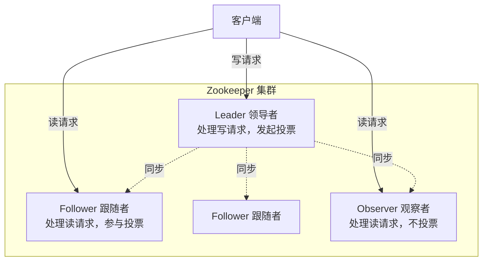
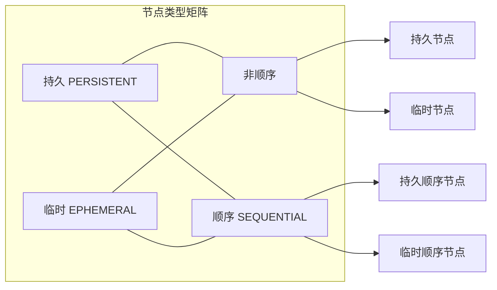
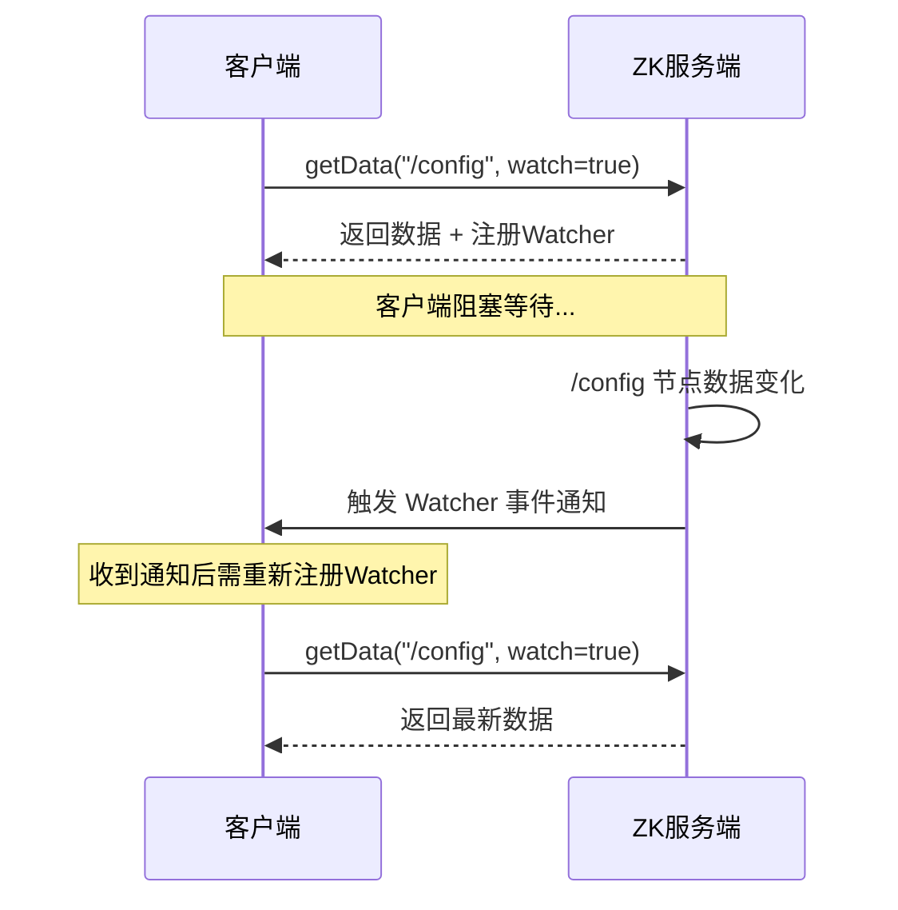
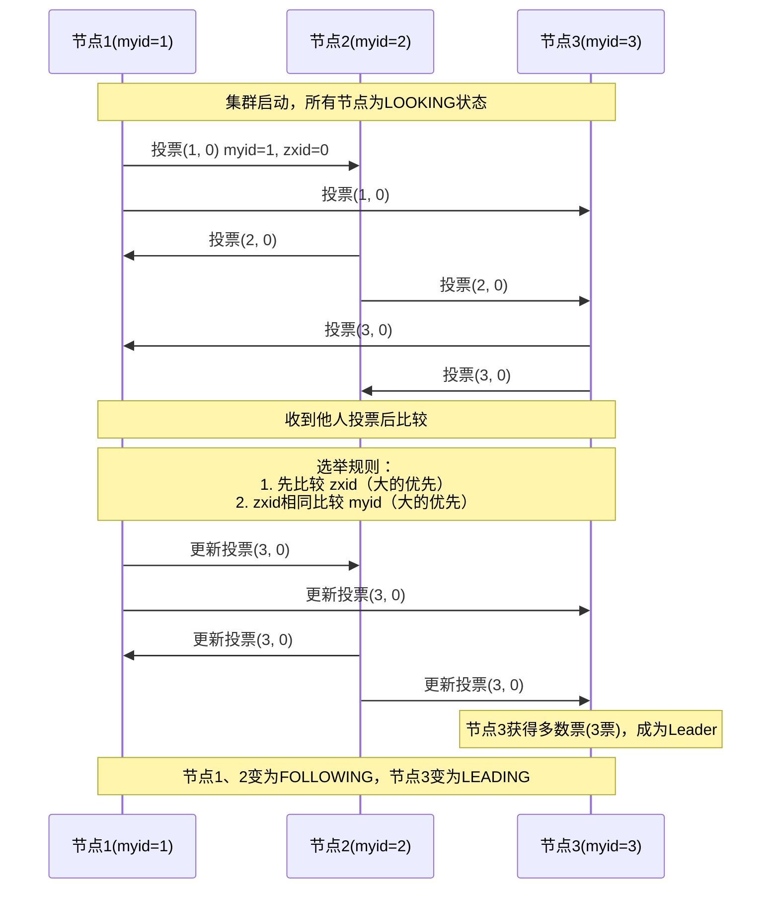
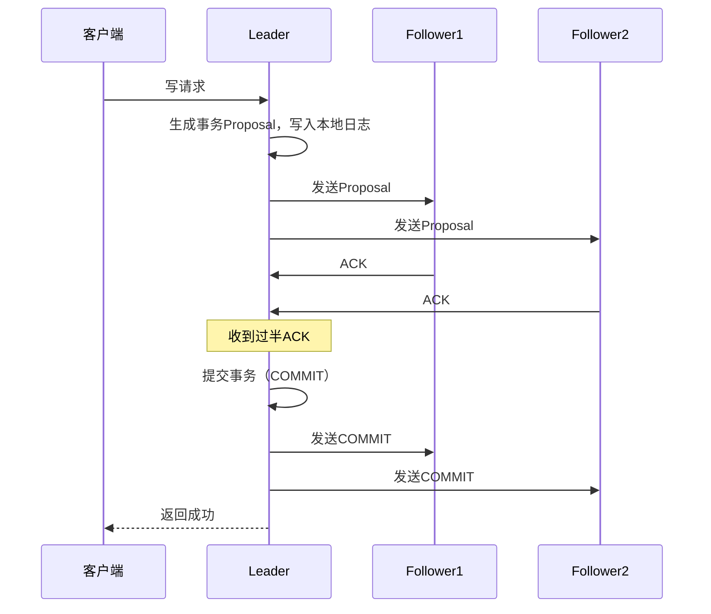

# Zookeeper 核心原理详解

> 分布式协调服务的基石，深入理解 ZNode、Watcher、ZAB 协议与分布式锁实现

---

## 📋 目录

- [1. Zookeeper 概述](#1-zookeeper-概述)
- [2. 数据模型](#2-数据模型)
- [3. Watcher 机制](#3-watcher-机制)
- [4. ZAB 协议](#4-zab-协议)
- [5. 分布式锁实现](#5-分布式锁实现)
- [6. 与 Nacos / Eureka 对比](#6-与-nacos--eureka-对比)
- [7. 面试要点](#7-面试要点)

---

## 🎯 学习目标

通过本文档，你将掌握：
- ✅ Zookeeper 的数据模型与节点类型
- ✅ Watcher 监听机制的工作原理
- ✅ ZAB 协议的 Leader 选举与数据同步
- ✅ 基于 ZK 的分布式锁实现
- ✅ ZK 与 Nacos、Eureka 的对比选型
- ✅ 面试高频考点

---

## 1. Zookeeper 概述

### 1.1 什么是 Zookeeper

**Zookeeper** 是 Apache 提供的**分布式协调服务**，最初由雅虎研究院开发，用于解决分布式应用中的统一命名、状态同步、配置管理、集群管理等问题。

```
Zookeeper 在分布式系统中的定位：

┌─────────────────────────────────────────────┐
│           分布式应用集群                      │
│  App1    App2    App3    App4               │
│   │       │       │       │                 │
│   └───────┴───────┴───────┘                 │
│              │                              │
│       ┌──────▼──────┐                       │
│       │ Zookeeper   │  ← 协调者              │
│       │  集群        │     配置/选举/锁/命名  │
│       └─────────────┘                       │
└─────────────────────────────────────────────┘
```

### 1.2 核心特性

| 特性 | 说明 |
|------|------|
| **顺序一致性** | 客户端请求按发送顺序执行 |
| **原子性** | 操作要么成功要么失败，无中间状态 |
| **单一视图** | 无论连到哪个节点，看到的数据一致 |
| **可靠性** | 写操作一旦成功便持久化 |
| **实时性** | 客户端能在一定时间内读到最新数据 |
| **高可用** | 集群半数以上节点存活即可服务 |

### 1.3 典型应用场景

```
1. 分布式配置中心     —— 配置变更实时推送
2. 服务注册与发现     —— 临时节点 + Watcher
3. 分布式锁           —— 顺序临时节点
4. Leader 选举        —— 选举主节点
5. 分布式队列         —— 顺序节点实现
6. 集群管理           —— 节点上下线感知
```

### 1.4 集群角色



| 角色 | 处理读 | 处理写 | 参与投票 | 参与选主 |
|------|--------|--------|---------|---------|
| Leader | ✅ | ✅ | ❌（发起者） | - |
| Follower | ✅ | 转发 | ✅ | ✅ |
| Observer | ✅ | 转发 | ❌ | ❌ |

> Observer 的引入是为了在不影响写性能的前提下扩展读能力。

---

## 2. 数据模型

### 2.1 ZNode 树结构

Zookeeper 的数据模型类似文件系统的树形结构，每个节点称为 **ZNode（数据节点）**。

```
/
├── /app1
│   ├── /app1/config        (配置数据)
│   ├── /app1/leader        (临时节点，标识Leader)
│   └── /app1/members
│       ├── /app1/members/node_0001   (临时顺序节点)
│       ├── /app1/members/node_0002
│       └── /app1/members/node_0003
├── /app2
│   └── /app2/locks
│       └── /app2/locks/lock_0001
└── /zookeeper               (ZK内置管理节点)
```

**ZNode 的核心属性**：

| 属性 | 说明 |
|------|------|
| `data` | 节点存储的数据（默认 1MB 上限） |
| `czxid` | 创建该节点的事务 ID |
| `mzxid` | 最后修改该节点的事务 ID |
| `version` | 数据版本号（乐观锁） |
| `cversion` | 子节点版本号 |
| `ephemeralOwner` | 临时节点的会话 ID |
| `dataLength` | 数据长度 |
| `numChildren` | 子节点数量 |

### 2.2 节点类型

ZooKeeper 节点按**生命周期**和**顺序性**两个维度分为四种类型：

| 类型 | 标志 | 说明 | 示例场景 |
|------|------|------|---------|
| **持久节点** | `PERSISTENT` | 客户端断开后节点仍存在 | 配置信息 |
| **持久顺序节点** | `PERSISTENT_SEQUENTIAL` | 持久 + 自动追加递增序号 | 分布式队列 |
| **临时节点** | `EPHEMERAL` | 客户端会话失效后自动删除 | 服务注册、Leader选举 |
| **临时顺序节点** | `EPHEMERAL_SEQUENTIAL` | 临时 + 顺序序号 | 分布式锁 |



**Java 操作示例**：

```java
public class ZkNodeDemo {
    
    private static final String CONNECT_STRING = "127.0.0.1:2181";
    private static ZooKeeper zk;
    
    public static void main(String[] args) throws Exception {
        zk = new ZooKeeper(CONNECT_STRING, 30000, event -> {
            System.out.println("收到事件: " + event);
        });
        
        // 1. 创建持久节点
        zk.create("/app1/config", "version=1.0".getBytes(),
            ZooDefs.Ids.OPEN_ACL_UNSAFE, CreateMode.PERSISTENT);
        
        // 2. 创建临时节点（会话失效后自动删除）
        zk.create("/app1/leader", "node-1".getBytes(),
            ZooDefs.Ids.OPEN_ACL_UNSAFE, CreateMode.EPHEMERAL);
        
        // 3. 创建临时顺序节点（用于分布式锁）
        String lockNode = zk.create("/app1/locks/lock-", "lock".getBytes(),
            ZooDefs.Ids.OPEN_ACL_UNSAFE, CreateMode.EPHEMERAL_SEQUENTIAL);
        // 返回 /app1/locks/lock-0000000001
        
        // 4. 读取数据（带版本号实现乐观锁）
        Stat stat = new Stat();
        byte[] data = zk.getData("/app1/config", false, stat);
        System.out.println("数据: " + new String(data) + ", 版本: " + stat.getVersion());
        
        // 5. 更新数据（CAS，版本号必须匹配）
        zk.setData("/app1/config", "version=2.0".getBytes(), stat.getVersion());
        
        // 6. 获取子节点
        List<String> children = zk.getChildren("/app1", false);
        System.out.println("子节点: " + children);
    }
}
```

---

## 3. Watcher 机制

### 3.1 工作原理

Watcher 是 ZooKeeper 的**发布订阅机制**，客户端注册监听后，节点发生变化时会通知客户端。



### 3.2 Watcher 特性

| 特性 | 说明 |
|------|------|
| **一次性触发** | 事件触发后 Watcher 失效，需重新注册 |
| **轻量** | 只通知事件类型和路径，不传数据内容 |
| **顺序性** | 客户端收到的事件与 ZK 服务端变更顺序一致 |
| **客户端串行** | 同一客户端的 Watcher 回调串行执行 |

### 3.3 事件类型

| 事件类型 | 触发条件 | 注册方法 |
|---------|---------|---------|
| `NodeCreated` | 节点创建 | exists |
| `NodeDeleted` | 节点删除 | exists / getData |
| `NodeDataChanged` | 节点数据变化 | exists / getData |
| `NodeChildrenChanged` | 子节点变化 | getChildren |

### 3.4 Curator Cache（永久监听）

原生 ZK 的 Watcher 是一次性的，使用 Curator 的 `NodeCache` / `PathChildrenCache` 可实现永久监听：

```java
public class ZkWatcherDemo {
    
    public static void main(String[] args) throws Exception {
        CuratorFramework client = CuratorFrameworkFactory.builder()
            .connectString("127.0.0.1:2181")
            .retryPolicy(new ExponentialBackoffRetry(1000, 3))
            .build();
        client.start();
        
        // NodeCache：监听单个节点变化
        NodeCache nodeCache = new NodeCache(client, "/app1/config");
        nodeCache.getListenable().addListener(() -> {
            ChildData data = nodeCache.getCurrentData();
            if (data != null) {
                System.out.println("配置变更: " + new String(data.getData()));
            } else {
                System.out.println("节点被删除");
            }
        });
        nodeCache.start(true);
        
        // PathChildrenCache：监听子节点变化
        PathChildrenCache pathCache = new PathChildrenCache(client, "/app1/members", true);
        pathCache.getListenable().addListener((client1, event) -> {
            switch (event.getType()) {
                case CHILD_ADDED:
                    System.out.println("新成员上线: " + event.getData().getPath());
                    break;
                case CHILD_REMOVED:
                    System.out.println("成员下线: " + event.getData().getPath());
                    break;
            }
        });
        pathCache.start();
    }
}
```

---

## 4. ZAB 协议

### 4.1 ZAB 协议概述

**ZAB（ZooKeeper Atomic Broadcast）协议** 是 ZooKeeper 专用的**原子广播协议**，保证主备集群的数据一致性。它不是 Paxos，而是一种专为主备模式设计的崩溃可恢复原子广播算法。

ZAB 协议包含两个核心阶段：
1. **崩溃恢复**：Leader 选举
2. **消息广播**：数据同步

### 4.2 Leader 选举



**选举核心规则**：
1. 每个节点投票 `(myid, zxid)`
2. 收到其他节点投票后比较：**优先选 zxid 大的**（数据更新），**zxid 相同选 myid 大的**
3. 获得过半数选票的节点成为 Leader

**选举状态机**：

| 状态 | 说明 |
|------|------|
| `LOOKING` | 正在选举中 |
| `FOLLOWING` | 跟随者状态 |
| `LEADING` | 领导者状态 |
| `OBSERVING` | 观察者状态 |

### 4.3 数据同步（两阶段提交）

Leader 选举完成后进入消息广播阶段，采用类似两阶段提交的机制：



**ZXID（事务ID）结构**：

```
ZXID = 64位
├── epoch（32位）：选举周期，每次Leader切换+1
└── counter（32位）：事务计数器，每个事务+1
```

epoch 保证新 Leader 不会被旧 Leader 的残留事务干扰。

### 4.4 崩溃恢复

当 Leader 崩溃或网络分区时，集群进入崩溃恢复模式：

1. **检测 Leader 失效**：Follower 超时未收到心跳
2. **变更状态**：Follower → LOOKING，发起新一轮选举
3. **数据同步**：新 Leader 选出后，确保所有 Follower 与 Leader 数据一致
   - 已提交的事务必须保留
   - 未提交的事务必须丢弃

**ZXID 在崩溃恢复中的作用**：通过比较 zxid 确保选出的 Leader 拥有最新数据，避免数据丢失。

---

## 5. 分布式锁实现

### 5.1 排他锁的演进

**方案一：创建节点（简单但有羊群效应）**

```
所有客户端抢占创建 /lock 节点：
- 创建成功 → 获得锁
- 创建失败 → 监听 /lock，删除时再次抢占

问题：当锁释放时，所有等待客户端同时被唤醒去竞争，产生"惊群效应"
```

**方案二：临时顺序节点（推荐）**

```mermaid
graph TB
    L[/locks]
    L1[lock_0001 持有锁]
    L2[lock_0002 监听 lock_0001]
    L3[lock_0003 监听 lock_0002]
    L4[lock_0004 监听 lock_0003]
    
    L --> L1
    L --> L2
    L --> L3
    L --> L4
    
    style L1 fill:#9f9
    style L2 fill:#ff9
    style L3 fill:#ff9
    style L4 fill:#ff9
```

每个客户端创建顺序节点，只监听**前一个节点**，避免惊群效应。

### 5.2 Java 实现

```java
public class ZkDistributedLock {
    
    private final CuratorFramework client;
    private final String lockPath;
    private String currentLockPath;
    
    public ZkDistributedLock(CuratorFramework client, String lockPath) {
        this.client = client;
        this.lockPath = lockPath;
    }
    
    public void lock() throws Exception {
        // 1. 创建临时顺序节点
        currentLockPath = client.create()
            .creatingParentsIfNeeded()
            .withMode(CreateMode.EPHEMERAL_SEQUENTIAL)
            .forPath(lockPath + "/lock-");
        
        while (true) {
            // 2. 获取所有子节点并排序
            List<String> children = client.getChildren().forPath(lockPath);
            Collections.sort(children);
            
            // 3. 判断自己是否是最小的
            String currentNode = currentLockPath.substring(lockPath.length() + 1);
            int currentIndex = children.indexOf(currentNode);
            
            if (currentIndex == 0) {
                // 是最小节点，获得锁
                return;
            }
            
            // 4. 监听前一个节点
            String prevNode = children.get(currentIndex - 1);
            String prevPath = lockPath + "/" + prevNode;
            
            CountDownLatch latch = new CountDownLatch(1);
            Stat stat = client.checkExists().usingWatcher((WatchedEvent event) -> {
                if (event.getType() == Watcher.Event.EventType.NodeDeleted) {
                    latch.countDown();
                }
            }).forPath(prevPath);
            
            if (stat == null) {
                // 前一个节点已删除，重新尝试获取
                continue;
            }
            
            // 5. 阻塞等待前一个节点删除
            latch.await(30, TimeUnit.SECONDS);
        }
    }
    
    public void unlock() {
        try {
            if (currentLockPath != null) {
                client.delete().forPath(currentLockPath);
            }
        } catch (Exception e) {
            // 忽略删除异常（节点可能已因会话失效被删除）
        }
    }
}
```

### 5.3 使用 Curator InterProcessMutex

生产环境推荐直接使用 Curator 封装好的分布式锁：

```java
public class CuratorLockDemo {
    
    public static void main(String[] args) throws Exception {
        CuratorFramework client = CuratorFrameworkFactory.builder()
            .connectString("127.0.0.1:2181")
            .retryPolicy(new ExponentialBackoffRetry(1000, 3))
            .build();
        client.start();
        
        // 可重入的排他锁
        InterProcessMutex lock = new InterProcessMutex(client, "/locks/order");
        
        try {
            // 尝试获取锁，最多等待3秒
            if (lock.acquire(3, TimeUnit.SECONDS)) {
                try {
                    System.out.println("获得锁，执行业务逻辑");
                    // 业务操作...
                } finally {
                    lock.release();
                }
            }
        } finally {
            client.close();
        }
    }
}
```

### 5.4 ZK 分布式锁 vs Redis 分布式锁

| 维度 | ZK 分布式锁 | Redis 分布式锁 |
|------|-----------|--------------|
| 一致性 | CP，强一致 | AP/CP（Redlock），最终一致 |
| 可靠性 | 客户端宕机会话失效自动释放锁 | 依赖过期时间，需处理续期 |
| 性能 | 较低（每次写需集群同步） | 高（内存操作） |
| 公平性 | 顺序节点实现公平锁 | 默认非公平 |
| 复杂度 | 实现较复杂 | 实现简单 |
| 适用场景 | 对一致性要求高 | 对性能要求高 |

---

## 6. 与 Nacos / Eureka 对比

### 6.1 CAP 模型对比

| 注册中心 | CAP 模型 | 一致性算法 | 说明 |
|---------|---------|-----------|------|
| **Zookeeper** | CP | ZAB | 写操作需过半节点确认，保证强一致 |
| **Eureka** | AP | 无（去中心化复制） | 优先可用性，分区时可读写 |
| **Nacos** | AP/CP（可切换） | Raft（CP）/ Distro（AP） | 同时支持两种模式 |

### 6.2 功能对比

| 维度 | Zookeeper | Eureka | Nacos |
|------|-----------|--------|-------|
| **定位** | 通用协调服务 | 服务注册发现 | 注册中心+配置中心 |
| **一致性** | CP 强一致 | AP 高可用 | AP/CP 可切换 |
| **健康检查** | 会话心跳 | 心跳续约 | 心跳+TCP+HTTP |
| **配置中心** | 支持（弱） | 不支持 | ✅ 原生支持 |
| **推送方式** | Watcher 推送 | 客户端轮询 | 长轮询推送 |
| **管理控制台** | 弱 | 简单 | 功能完善 |
| **多数据中心** | 不支持 | 支持 | 支持 |
| **权重路由** | 不支持 | 不支持 | 支持 |

### 6.3 选型建议

```
选型决策树：

是否需要强一致性？（如金融场景配置）
├── 是 → Zookeeper 或 Nacos(CP模式)
└── 否 → 是否需要配置中心？
         ├── 是 → Nacos（推荐，一体化方案）
         └── 否 → Eureka（已停止维护，不推荐新项目）
```

**实际生产建议**：
- 微服务注册发现 + 配置中心：**Nacos**（Spring Cloud Alibaba 生态）
- 纯分布式协调（Kafka、HBase 依赖）：**Zookeeper**
- Eureka 2.x 已停止维护，新项目不推荐

---

## 7. 面试要点

### 7.1 高频问题

1. **Zookeeper 的数据模型是什么？**
   - 树形结构，类似文件系统，每个节点 ZNode 可存储数据（默认1MB）并有子节点

2. **Zookeeper 有哪些节点类型？**
   - 持久节点、持久顺序节点、临时节点、临时顺序节点
   - 临时节点在客户端会话失效后自动删除，顺序节点自动追加递增序号

3. **ZAB 协议和 Paxos 的区别？**
   - ZAB 是专为 ZK 主备模式设计的原子广播协议，强调崩溃恢复
   - Paxos 是通用的一致性算法，ZAB 在 Leader 选举上更高效

4. **Zookeeper 如何保证一致性？**
   - Leader 处理所有写请求，通过两阶段提交广播到 Follower
   - 过半 Follower ACK 后才提交，保证多数派一致
   - 通过 ZXID（epoch + counter）保证事务顺序

5. **Zookeeper 的 Watcher 机制有什么特点？**
   - 一次性触发：事件触发后需重新注册
   - 轻量：只通知事件类型，不传数据
   - 顺序性：事件顺序与变更顺序一致

6. **基于 ZK 的分布式锁如何实现？**
   - 临时顺序节点 + 监听前一个节点，避免惊群效应
   - 会话失效自动释放锁，避免死锁

7. **Zookeeper 是 CP 还是 AP？**
   - CP。Leader 选举期间集群不可写（但可读旧数据），保证强一致性

8. **Zookeeper 集群为什么推荐奇数节点？**
   - 奇数节点与偶数节点容错能力相同（3台和4台都只能容忍1台宕机）
   - 奇数节点更节省资源

### 7.2 场景题

**Q：ZK 集群 5 个节点挂了 2 个，还能正常服务吗？**

答：能。ZK 需要**过半数节点存活**才能提供服务。5 个节点过半数是 3，挂了 2 个还剩 3 个，满足条件，可以继续提供读写服务。但如果再挂 1 个（剩 2 个，不足过半），集群将无法处理写请求。

### 7.3 常见坑

1. **临时节点的生命周期是会话而非连接**：会话失效才删除，网络抖动重连不会删
2. **Watcher 是一次性的**：忘记重新注册会导致漏掉后续事件
3. **避免直接监听同一个节点**：大量客户端监听同一节点会触发惊群效应，用顺序节点分散

---

## 📚 相关阅读

- [分布式锁详解](./03_分布式锁详解.md)
- [分布式事务详解](./02_分布式事务详解.md)
- [Nacos核心机制详解](../06_微服务/01_核心组件/02_Nacos核心机制详解.md)
- [服务注册与发现实战](../06_微服务/01_核心组件/05_服务注册与发现实战.md)
- [Redis核心机制详解](../04_缓存/01_Redis核心机制详解.md)
- [微服务设计模式详解](../06_微服务/06_设计模式/01_微服务设计模式详解.md)

---

**文档版本**: v1.0
**最后更新**: 2026-07-06
**关键词**：Zookeeper, ZAB协议, ZNode, Watcher, 分布式锁, Leader选举, 服务注册, CAP
