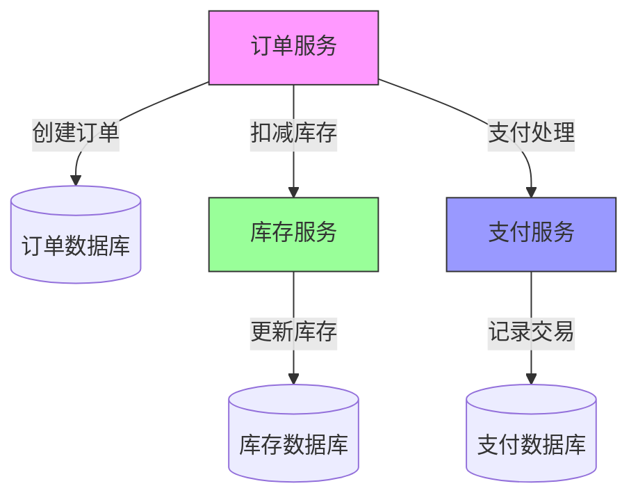
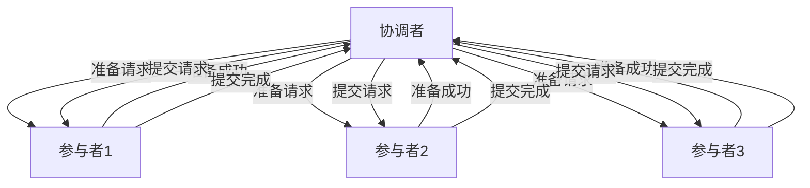

# 分布式事务框架详解

> 深入理解分布式环境下的数据一致性解决方案

## 📋 目录

1. [分布式事务概述](#1-分布式事务概述)
2. [核心理论基础](#2-核心理论基础)
3. [主流解决方案](#3-主流解决方案)
4. [框架实现对比](#4-框架实现对比)
5. [Seata实战](#5-seata实战)
6. [Hmily实战](#6-hmily实战)
7. [最佳实践](#7-最佳实践)
8. [性能优化](#8-性能优化)

---

## 1. 分布式事务概述

### 1.1 定义与挑战

分布式事务是指事务的参与者、支持事务的服务器、资源服务器以及事务管理器分别位于不同的分布式系统的不同节点之上。

**核心挑战**：
- 网络通信不确定性
- 节点故障恢复
- 数据一致性保障
- 性能与一致性平衡

### 1.2 典型应用场景

- 跨数据库事务（分库分表）
- 微服务间数据同步
- 支付系统资金流转
- 订单库存联动操作



---

## 2. 核心理论基础

### 2.1 CAP定理

- **一致性（Consistency）**：所有节点在同一时间具有相同的数据
- **可用性（Availability）**：保证每个请求不管成功或失败都有响应
- **分区容错性（Partition tolerance）**：系统中任意信息的丢失或失败不会影响系统的继续运作

**结论**：分布式系统只能同时满足两项，必须放弃一项。在网络分区存在的前提下，只能在一致性和可用性之间权衡。

### 2.2 BASE理论

BASE是对CAP中一致性和可用性权衡的结果，是面向大型分布式系统的实践总结：
- **基本可用（Basically Available）**：系统出现故障时，允许损失部分可用性
- **软状态（Soft State）**：允许系统存在中间状态，该状态不影响系统整体可用性
- **最终一致性（Eventually Consistent）**：系统经过一定时间后，所有节点数据将达到一致

### 2.3 事务ACID特性

| 特性 | 说明 | 分布式环境挑战 |
|------|------|----------------|
| **原子性（Atomicity）** | 事务要么全部完成，要么全部不完成 | 部分节点失败导致部分提交 |
| **一致性（Consistency）** | 事务执行前后数据保持一致 | 多副本数据同步延迟 |
| **隔离性（Isolation）** | 事务间相互隔离 | 分布式锁实现复杂 |
| **持久性（Durability）** | 事务提交后数据永久保存 | 数据备份与恢复机制 |

---

## 3. 主流解决方案

### 3.1 2PC（两阶段提交）

**流程**：
1. **准备阶段**：协调者向所有参与者发送准备请求，参与者执行事务但不提交
2. **提交阶段**：协调者根据参与者反馈，决定提交或回滚



**优缺点**：
- 优点：强一致性，实现简单
- 缺点：协调者单点故障风险，性能差，阻塞问题

### 3.2 3PC（三阶段提交）

**改进点**：
- 引入超时机制
- 将准备阶段拆分为CanCommit和PreCommit
- 增加了参与者的自主性

### 3.3 TCC（Try-Confirm-Cancel）

**流程**：
1. **Try**：资源检查和预留
2. **Confirm**：确认执行业务操作
3. **Cancel**：取消执行业务操作

**适用场景**：核心业务系统，如支付、订单等

### 3.4 SAGA模式

**流程**：将分布式事务拆分为本地事务序列，每个步骤有对应的补偿操作

**实现方式**：
- **编排式**：中央协调器控制所有步骤
- **协同式**：每个服务决定自己的下一步

```java
// SAGA模式伪代码示例
public class OrderSaga {
    // 创建订单
    public void createOrder(Order order) {
        try {
            // 本地事务1：创建订单
            orderService.create(order);
            
            // 本地事务2：扣减库存
            inventoryService.deduct(order.getProductId(), order.getQuantity());
            
            // 本地事务3：支付处理
            paymentService.process(order.getUserId(), order.getAmount());
        } catch (InventoryException e) {
            // 补偿操作：取消订单
            orderService.cancel(order.getId());
        } catch (PaymentException e) {
            // 补偿操作：恢复库存 + 取消订单
            inventoryService.restore(order.getProductId(), order.getQuantity());
            orderService.cancel(order.getId());
        }
    }
}
```

### 3.5 本地消息表

**流程**：
1. 本地事务与消息表写入在同一事务中
2. 消息表异步发送消息
3. 接收方处理消息并回复确认

### 3.6 最大努力通知

**特点**：
- 定期重试机制
- 消息最终一致性
- 适用于非核心业务，如通知、日志等

---

## 4. 框架实现对比

| 特性 | Seata | Hmily | TCC-Transaction | ByteTCC |
|------|-------|-------|-----------------|---------|
| **支持模式** | AT/TCC/SAGA/XA | TCC/SAGA | TCC | TCC/XA |
| **开发侵入性** | 低(AT) | 中 | 高 | 中 |
| **性能** | 高 | 中 | 高 | 中 |
| **事务补偿** | 自动(AT) | 手动 | 手动 | 手动 |
| **适用场景** | 微服务全场景 | 核心业务系统 | 高性能场景 | 复杂业务场景 |
| **社区活跃度** | 高 | 中 | 中 | 低 |
| **集成能力** | 强(Spring Cloud/Dubbo) | 中 | 中 | 中 |

---

## 5. Seata实战

### 5.1 环境部署

```bash
# 下载Seata Server
wget https://github.com/seata/seata/releases/download/v1.6.1/seata-server-1.6.1.tar.gz

tar -zxvf seata-server-1.6.1.tar.gz
cd seata-server-1.6.1

# 修改配置文件 registry.conf
# 设置registry.type=file/nacos/eureka等

# 启动Seata Server
sh bin/seata-server.sh -p 8091 -h 127.0.0.1 -m file
```

### 5.2 AT模式配置

**1. 引入依赖**：
```xml
<dependency>
    <groupId>io.seata</groupId>
    <artifactId>seata-spring-boot-starter</artifactId>
    <version>1.6.1</version>
</dependency>
<dependency>
    <groupId>io.seata</groupId>
    <artifactId>seata-all</artifactId>
    <version>1.6.1</version>
</dependency>
```

**2. 配置文件**：
```yaml
seata:
  enabled: true
  application-id: order-service
  tx-service-group: my_test_tx_group
  service:
    vgroup-mapping:
      my_test_tx_group: default
    grouplist:
      default: 127.0.0.1:8091
  registry:
    type: file
```

**3. 使用注解**：
```java
@Service
public class OrderServiceImpl implements OrderService {
    @Autowired
    private OrderMapper orderMapper;
    
    @Autowired
    private InventoryFeignClient inventoryFeignClient;
    
    @Autowired
    private PaymentFeignClient paymentFeignClient;
    
    // 分布式事务注解
    @GlobalTransactional(rollbackFor = Exception.class)
    @Override
    public void createOrder(Order order) {
        // 本地事务：创建订单
        orderMapper.insert(order);
        
        // 远程事务：扣减库存
        inventoryFeignClient.deduct(order.getProductId(), order.getQuantity());
        
        // 远程事务：处理支付
        paymentFeignClient.processPayment(order.getUserId(), order.getAmount());
    }
}
```

---

## 6. Hmily实战

### 6.1 核心配置

```yaml
hmily:
  service: 
    app-name: order-service
  serializer: kryo
  recover:
    scheduledDelay: 60
    scheduledThreadMax: 10
  repository:
    database:
      driverClassName: com.mysql.cj.jdbc.Driver
      url: jdbc:mysql://localhost:3306/hmily
      username: root
      password: 123456
```

### 6.2 TCC模式实现

**1. Try/Confirm/Cancel接口**：
```java
@HmilyTCC
public interface InventoryService {
    // Try阶段
    @Hmily
    boolean deduct(String productId, int quantity);
    
    // Confirm阶段
    boolean confirmDeduct(String productId, int quantity);
    
    // Cancel阶段
    boolean cancelDeduct(String productId, int quantity);
}
```

**2. 实现类**：
```java
@Service
public class InventoryServiceImpl implements InventoryService {
    @Autowired
    private InventoryMapper inventoryMapper;
    
    @Override
    @Transactional
    public boolean deduct(String productId, int quantity) {
        // 资源检查和预留
        return inventoryMapper.deductLock(productId, quantity) > 0;
    }
    
    @Override
    @Transactional
    public boolean confirmDeduct(String productId, int quantity) {
        // 确认扣减库存
        return inventoryMapper.deduct(productId, quantity) > 0;
    }
    
    @Override
    @Transactional
    public boolean cancelDeduct(String productId, int quantity) {
        // 取消扣减，释放库存
        return inventoryMapper.restoreLock(productId, quantity) > 0;
    }
}
```

---

## 7. 最佳实践

### 7.1 方案选择策略

- **强一致性需求**：金融核心系统 → 2PC/XA
- **高性能需求**：电商订单系统 → TCC/SAGA
- **低侵入需求**：快速开发场景 → Seata AT模式
- **非核心业务**：通知/日志 → 最大努力通知

### 7.2 避坑指南

- 避免长事务，控制事务执行时间
- 合理设置重试机制和超时时间
- 做好事务状态监控和报警
- 设计幂等接口，防止重复提交
- 补偿逻辑必须可重入

### 7.3 监控与运维

- 事务状态追踪
- 性能指标监控（响应时间、吞吐量）
- 异常事务自动恢复
- 定期数据一致性校验

---

## 8. 性能优化

### 8.1 优化方向

- **异步化**：非关键路径异步处理
- **并行化**：多事务分支并行执行
- **缓存**：热点数据缓存
- **分库分表**：减轻单库压力
- **批量处理**：合并小事务

### 8.2 性能测试指标

- 事务响应时间
- 吞吐量（TPS）
- 资源占用（CPU/内存）
- 失败率

---

## 📚 参考资源

- [Seata官方文档](https://seata.io/zh-cn/docs/overview/what-is-seata.html)
- [Hmily官方文档](https://dromara.org/zh-CN/docs/hmily/quick-start.html)
- [分布式事务实践指南](https://martinfowler.com/articles/patterns-of-distributed-systems/saga.html)
- [数据库事务与分布式事务详解](https://time.geekbang.org/column/intro/100020801)