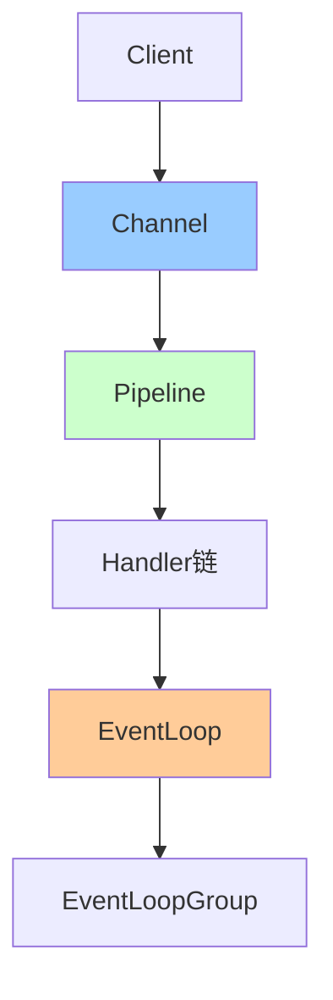

# Netty核心原理详解

> 深入理解Netty架构、Reactor模型、零拷贝、编解码器

---

## 📋 目录

1. [Netty架构设计](#1-netty架构设计)
2. [Reactor线程模型](#2-reactor线程模型)
3. [核心组件详解](#3-核心组件详解)
4. [零拷贝机制](#4-零拷贝机制)
5. [编解码器](#5-编解码器)
6. [常见问题与解决方案](#6-常见问题与解决方案)

---

## 1. Netty架构设计

### 1.1 Netty核心架构



**核心组件**：
```
1. Channel：网络通道，封装了Socket
2. EventLoop：事件循环，处理I/O操作
3. EventLoopGroup：EventLoop池
4. ChannelPipeline：处理器链
5. ChannelHandler：处理器，处理I/O事件
6. ByteBuf：字节缓冲区
```

### 1.2 Netty整体架构

```
                      Netty Architecture
┌─────────────────────────────────────────────────────────┐
│                    Application Layer                     │
│                  (Business Logic)                        │
├─────────────────────────────────────────────────────────┤
│                    Codec Layer                           │
│   (Encoder/Decoder, Protocol Handler)                   │
├─────────────────────────────────────────────────────────┤
│                    Transport Layer                       │
│  ┌─────────┐  ┌─────────┐  ┌─────────┐  ┌─────────┐   │
│  │  NIO    │  │  OIO    │  │  Local  │  │ Embedded│   │
│  │Transport│  │Transport│  │Transport│  │Transport│   │
│  └─────────┘  └─────────┘  └─────────┘  └─────────┘   │
├─────────────────────────────────────────────────────────┤
│                    Network Layer                         │
│              (Socket, TCP/UDP, HTTP)                     │
└─────────────────────────────────────────────────────────┘
```

### 1.3 Hello World示例

**服务端**：
```java
/**
 * Netty服务端示例
 */
public class NettyServer {
    
    public void start(int port) throws Exception {
        // 1. 创建EventLoopGroup
        EventLoopGroup bossGroup = new NioEventLoopGroup(1);      // 接收连接
        EventLoopGroup workerGroup = new NioEventLoopGroup();     // 处理I/O
        
        try {
            // 2. 创建ServerBootstrap
            ServerBootstrap bootstrap = new ServerBootstrap();
            bootstrap.group(bossGroup, workerGroup)
                .channel(NioServerSocketChannel.class)            // 使用NIO
                .option(ChannelOption.SO_BACKLOG, 128)           // TCP队列长度
                .childOption(ChannelOption.SO_KEEPALIVE, true)   // 保持连接
                .childHandler(new ChannelInitializer<SocketChannel>() {
                    @Override
                    protected void initChannel(SocketChannel ch) {
                        ChannelPipeline pipeline = ch.pipeline();
                        // 添加处理器
                        pipeline.addLast(new StringDecoder());
                        pipeline.addLast(new StringEncoder());
                        pipeline.addLast(new ServerHandler());
                    }
                });
            
            // 3. 绑定端口，启动服务
            ChannelFuture future = bootstrap.bind(port).sync();
            System.out.println("Server started on port: " + port);
            
            // 4. 等待服务关闭
            future.channel().closeFuture().sync();
            
        } finally {
            // 5. 优雅关闭
            bossGroup.shutdownGracefully();
            workerGroup.shutdownGracefully();
        }
    }
    
    // 服务端处理器
    static class ServerHandler extends SimpleChannelInboundHandler<String> {
        
        @Override
        protected void channelRead0(ChannelHandlerContext ctx, String msg) {
            System.out.println("Received: " + msg);
            ctx.writeAndFlush("Server: " + msg);
        }
        
        @Override
        public void exceptionCaught(ChannelHandlerContext ctx, Throwable cause) {
            cause.printStackTrace();
            ctx.close();
        }
    }
}
```

**客户端**：
```java
/**
 * Netty客户端示例
 */
public class NettyClient {
    
    public void connect(String host, int port) throws Exception {
        EventLoopGroup group = new NioEventLoopGroup();
        
        try {
            Bootstrap bootstrap = new Bootstrap();
            bootstrap.group(group)
                .channel(NioSocketChannel.class)
                .handler(new ChannelInitializer<SocketChannel>() {
                    @Override
                    protected void initChannel(SocketChannel ch) {
                        ChannelPipeline pipeline = ch.pipeline();
                        pipeline.addLast(new StringDecoder());
                        pipeline.addLast(new StringEncoder());
                        pipeline.addLast(new ClientHandler());
                    }
                });
            
            // 连接服务器
            ChannelFuture future = bootstrap.connect(host, port).sync();
            System.out.println("Connected to server: " + host + ":" + port);
            
            // 发送数据
            future.channel().writeAndFlush("Hello Netty!");
            
            // 等待连接关闭
            future.channel().closeFuture().sync();
            
        } finally {
            group.shutdownGracefully();
        }
    }
    
    // 客户端处理器
    static class ClientHandler extends SimpleChannelInboundHandler<String> {
        
        @Override
        protected void channelRead0(ChannelHandlerContext ctx, String msg) {
            System.out.println("Received: " + msg);
        }
        
        @Override
        public void exceptionCaught(ChannelHandlerContext ctx, Throwable cause) {
            cause.printStackTrace();
            ctx.close();
        }
    }
}
```

---

## 2. Reactor线程模型

### 2.1 三种Reactor模型

#### 单Reactor单线程
```
┌──────────────────────────────────┐
│          Reactor Thread          │
│  ┌────────┐  ┌────────────────┐ │
│  │Acceptor│  │  EventHandler  │ │
│  └────────┘  └────────────────┘ │
└──────────────────────────────────┘

特点：
- 所有I/O操作在一个线程中
- 简单，但性能受限
- 适合小规模连接
```

#### 单Reactor多线程
```
┌──────────────────────────────────┐
│          Reactor Thread          │
│  ┌────────┐                      │
│  │Acceptor│                      │
│  └────────┘                      │
└─────────┬────────────────────────┘
          │
          ├──> Worker Thread 1
          ├──> Worker Thread 2
          └──> Worker Thread N

特点：
- Reactor负责I/O检测和分发
- 工作线程池处理业务逻辑
- 性能较好
```

#### 主从Reactor多线程（Netty使用）⭐
```
┌──────────────────────────────────┐
│      Main Reactor (Boss)         │
│         ┌────────┐                │
│         │Acceptor│                │
│         └────────┘                │
└──────────┬───────────────────────┘
           │
           │ dispatch
           ▼
┌──────────────────────────────────┐
│     Sub Reactor (Worker)         │
│  ┌────────┐  ┌────────┐         │
│  │ Handler│  │ Handler│  ...    │
│  └────────┘  └────────┘         │
└──────────────────────────────────┘

特点：
- MainReactor负责接收连接
- SubReactor负责I/O读写
- 工作线程池处理业务
- 高性能，适合高并发
```

### 2.2 Netty线程模型实现

```java
/**
 * Netty的Reactor模型配置
 */
public class ReactorModelDemo {
    
    // 1. 单线程模型（不推荐）
    public void singleThreadModel() {
        EventLoopGroup group = new NioEventLoopGroup(1);
        ServerBootstrap bootstrap = new ServerBootstrap();
        bootstrap.group(group)  // boss和worker使用同一个group
            .channel(NioServerSocketChannel.class);
    }
    
    // 2. 多线程模型
    public void multiThreadModel() {
        EventLoopGroup bossGroup = new NioEventLoopGroup(1);
        EventLoopGroup workerGroup = new NioEventLoopGroup();  // 默认CPU核心数*2
        ServerBootstrap bootstrap = new ServerBootstrap();
        bootstrap.group(bossGroup, workerGroup)
            .channel(NioServerSocketChannel.class);
    }
    
    // 3. 主从多线程模型（推荐）⭐
    public void mainSubReactorModel() {
        EventLoopGroup bossGroup = new NioEventLoopGroup(1);      // 1个线程接收连接
        EventLoopGroup workerGroup = new NioEventLoopGroup(8);    // 8个线程处理I/O
        ServerBootstrap bootstrap = new ServerBootstrap();
        bootstrap.group(bossGroup, workerGroup)
            .channel(NioServerSocketChannel.class)
            .childHandler(new ChannelInitializer<SocketChannel>() {
                @Override
                protected void initChannel(SocketChannel ch) {
                    // 业务处理可以使用独立的线程池
                    ch.pipeline().addLast(
                        new DefaultEventExecutorGroup(16),  // 业务线程池
                        new BusinessHandler()
                    );
                }
            });
    }
}
```

### 2.3 EventLoop工作机制

```java
/**
 * EventLoop核心流程
 */
protected void run() {
    for (;;) {
        try {
            // 1. 检查是否有任务
            switch (selectStrategy.calculateStrategy(selectNowSupplier, hasTasks())) {
                case SelectStrategy.CONTINUE:
                    continue;
                case SelectStrategy.SELECT:
                    // 2. 执行select操作（阻塞）
                    select(wakenUp.getAndSet(false));
                    
                    // 3. 处理I/O事件
                    if (ioRatio == 100) {
                        processSelectedKeys();
                        runAllTasks();
                    } else {
                        // 4. 按比例分配I/O和任务处理时间
                        final long ioStartTime = System.nanoTime();
                        processSelectedKeys();
                        final long ioTime = System.nanoTime() - ioStartTime;
                        runAllTasks(ioTime * (100 - ioRatio) / ioRatio);
                    }
                    break;
                default:
            }
        } catch (Throwable t) {
            handleLoopException(t);
        }
    }
}
```

---

## 3. 核心组件详解

### 3.1 Channel详解

```java
/**
 * Channel核心概念
 */
public class ChannelDemo {
    
    // Channel常用方法
    public void channelMethods(Channel channel) {
        // 1. 判断Channel状态
        boolean isActive = channel.isActive();      // 是否激活
        boolean isOpen = channel.isOpen();          // 是否打开
        boolean isWritable = channel.isWritable();  // 是否可写
        
        // 2. 获取相关组件
        ChannelPipeline pipeline = channel.pipeline();
        EventLoop eventLoop = channel.eventLoop();
        ChannelConfig config = channel.config();
        
        // 3. 写数据
        channel.write("Hello");           // 写到缓冲区
        channel.flush();                  // 刷新到网络
        channel.writeAndFlush("Hello");  // 写并刷新
        
        // 4. 关闭Channel
        channel.close();                  // 异步关闭
        channel.closeFuture().sync();    // 同步等待关闭
    }
    
    // Channel类型
    // - NioSocketChannel：客户端TCP Channel
    // - NioServerSocketChannel：服务端TCP Channel
    // - NioDatagramChannel：UDP Channel
    // - EpollSocketChannel：Linux Epoll
}
```

### 3.2 ChannelPipeline详解

```java
/**
 * ChannelPipeline：处理器链
 */
public class PipelineDemo {
    
    public void setupPipeline(ChannelPipeline pipeline) {
        // Pipeline是双向链表结构
        // Head <-> Handler1 <-> Handler2 <-> ... <-> Tail
        
        // 1. 添加处理器
        pipeline.addFirst("decoder", new StringDecoder());  // 添加到头部
        pipeline.addLast("encoder", new StringEncoder());   // 添加到尾部
        pipeline.addBefore("encoder", "handler", new MyHandler());  // 插入
        pipeline.addAfter("decoder", "logger", new LoggingHandler());
        
        // 2. 移除处理器
        pipeline.remove("handler");
        pipeline.remove(MyHandler.class);
        
        // 3. 替换处理器
        pipeline.replace("decoder", "newDecoder", new StringDecoder());
        
        // 4. 获取处理器
        ChannelHandler handler = pipeline.get("encoder");
        
        // 5. 触发事件（从Head开始）
        pipeline.fireChannelRead("data");
        pipeline.fireChannelActive();
        pipeline.fireExceptionCaught(new Exception());
    }
}
```

**Pipeline事件传播**：
```
Inbound事件（从Head到Tail）：
channelRegistered
channelActive
channelRead
channelReadComplete
channelInactive
channelUnregistered
exceptionCaught

Outbound事件（从Tail到Head）：
bind
connect
write
flush
read
disconnect
close
```

### 3.3 ChannelHandler详解

```java
/**
 * ChannelHandler处理器
 */
// 1. Inbound处理器（处理入站事件）
public class MyInboundHandler extends ChannelInboundHandlerAdapter {
    
    @Override
    public void channelActive(ChannelHandlerContext ctx) {
        System.out.println("Channel激活");
        ctx.fireChannelActive();  // 传递给下一个handler
    }
    
    @Override
    public void channelRead(ChannelHandlerContext ctx, Object msg) {
        System.out.println("接收数据: " + msg);
        ctx.fireChannelRead(msg);
    }
    
    @Override
    public void channelInactive(ChannelHandlerContext ctx) {
        System.out.println("Channel关闭");
        ctx.fireChannelInactive();
    }
    
    @Override
    public void exceptionCaught(ChannelHandlerContext ctx, Throwable cause) {
        cause.printStackTrace();
        ctx.close();
    }
}

// 2. Outbound处理器（处理出站事件）
public class MyOutboundHandler extends ChannelOutboundHandlerAdapter {
    
    @Override
    public void write(ChannelHandlerContext ctx, Object msg, ChannelPromise promise) {
        System.out.println("发送数据: " + msg);
        ctx.write(msg, promise);
    }
    
    @Override
    public void flush(ChannelHandlerContext ctx) {
        System.out.println("刷新数据");
        ctx.flush();
    }
    
    @Override
    public void close(ChannelHandlerContext ctx, ChannelPromise promise) {
        System.out.println("关闭连接");
        ctx.close(promise);
    }
}

// 3. 双向处理器（同时处理入站和出站）
public class MyDuplexHandler extends ChannelDuplexHandler {
    
    @Override
    public void channelRead(ChannelHandlerContext ctx, Object msg) {
        // 处理入站
        ctx.fireChannelRead(msg);
    }
    
    @Override
    public void write(ChannelHandlerContext ctx, Object msg, ChannelPromise promise) {
        // 处理出站
        ctx.write(msg, promise);
    }
}

// 4. SimpleChannelInboundHandler（推荐）⭐
public class MySimpleHandler extends SimpleChannelInboundHandler<String> {
    
    @Override
    protected void channelRead0(ChannelHandlerContext ctx, String msg) {
        // 自动释放ByteBuf，无需手动release
        System.out.println("Received: " + msg);
    }
}
```

### 3.4 ByteBuf详解

```java
/**
 * ByteBuf：Netty的字节缓冲区
 */
public class ByteBufDemo {
    
    public void byteBufUsage() {
        // 1. 创建ByteBuf
        ByteBuf buffer = Unpooled.buffer(10);  // 初始容量10，最大容量Integer.MAX_VALUE
        ByteBuf directBuffer = Unpooled.directBuffer(10);  // 堆外内存
        
        // 2. 写数据
        buffer.writeByte(1);
        buffer.writeInt(100);
        buffer.writeLong(1000L);
        buffer.writeBytes("Hello".getBytes());
        
        // 3. 读数据
        byte b = buffer.readByte();
        int i = buffer.readInt();
        long l = buffer.readLong();
        
        // 4. 随机访问
        buffer.setByte(0, 2);
        byte value = buffer.getByte(0);
        
        // 5. 切片（共享内存）
        ByteBuf slice = buffer.slice(0, 5);
        
        // 6. 复制
        ByteBuf copy = buffer.copy();
        
        // 7. 释放
        buffer.release();  // 引用计数-1
        
        // ByteBuf结构：
        // ┌──────────┬──────────┬──────────┐
        // │discardable│ readable │ writable │
        // │  bytes   │  bytes   │  bytes   │
        // └──────────┴──────────┴──────────┘
        // 0      readerIndex  writerIndex  capacity
    }
    
    public void byteBufAdvanced() {
        ByteBuf buffer = Unpooled.buffer(10);
        
        // 1. 标记和重置
        buffer.markReaderIndex();   // 标记当前readerIndex
        buffer.readInt();
        buffer.resetReaderIndex();  // 重置到标记位置
        
        // 2. 可读字节数
        int readable = buffer.readableBytes();
        
        // 3. 可写字节数
        int writable = buffer.writableBytes();
        
        // 4. 清空
        buffer.clear();  // readerIndex=0, writerIndex=0
        
        // 5. 引用计数
        int refCnt = buffer.refCnt();
        buffer.retain();   // 引用计数+1
        buffer.release();  // 引用计数-1
    }
}
```

**ByteBuf vs JDK ByteBuffer**：
```
┌──────────────┬───────────┬─────────────────┐
│ 特性         │ ByteBuf   │ ByteBuffer      │
├──────────────┼───────────┼─────────────────┤
│ 读写模式     │ 双指针    │ 单指针（需flip）│
│ 动态扩容     │ ✅        │ ❌              │
│ 零拷贝       │ ✅        │ ❌              │
│ 内存池       │ ✅        │ ❌              │
│ 引用计数     │ ✅        │ ❌              │
│ 使用难度     │ 简单      │ 复杂            │
└──────────────┴───────────┴─────────────────┘
```

---

## 4. 零拷贝机制

### 4.1 传统拷贝 vs 零拷贝

**传统拷贝（4次拷贝，4次上下文切换）**：
```
1. 用户态 -> read() -> 内核态
2. DMA拷贝：磁盘 -> 内核缓冲区
3. CPU拷贝：内核缓冲区 -> 用户缓冲区
4. 内核态 -> 用户态
5. 用户态 -> write() -> 内核态
6. CPU拷贝：用户缓冲区 -> Socket缓冲区
7. DMA拷贝：Socket缓冲区 -> 网卡
8. 内核态 -> 用户态

总共：4次拷贝（2次DMA + 2次CPU），4次上下文切换
```

**零拷贝（2次拷贝，2次上下文切换）**：
```
使用sendfile()系统调用：

1. 用户态 -> sendfile() -> 内核态
2. DMA拷贝：磁盘 -> 内核缓冲区
3. CPU拷贝：内核缓冲区 -> Socket缓冲区（优化后可省略）
4. DMA拷贝：Socket缓冲区 -> 网卡
5. 内核态 -> 用户态

总共：2次拷贝（2次DMA），2次上下文切换
```

### 4.2 Netty零拷贝实现

```java
/**
 * Netty零拷贝技术
 */
public class ZeroCopyDemo {
    
    // 1. FileRegion：文件传输零拷贝
    public void fileRegionDemo(ChannelHandlerContext ctx, File file) throws IOException {
        RandomAccessFile raf = new RandomAccessFile(file, "r");
        FileChannel fileChannel = raf.getChannel();
        
        // 使用FileRegion零拷贝传输文件
        FileRegion region = new DefaultFileRegion(
            fileChannel, 
            0,                    // position
            fileChannel.size()    // count
        );
        
        ctx.writeAndFlush(region).addListener(future -> {
            if (future.isSuccess()) {
                System.out.println("文件传输完成");
            }
            raf.close();
        });
    }
    
    // 2. CompositeByteBuf：组合ByteBuf，避免拷贝
    public void compositeByteBufDemo() {
        ByteBuf header = Unpooled.buffer(5);
        ByteBuf body = Unpooled.buffer(10);
        
        // 传统方式：需要拷贝
        ByteBuf traditional = Unpooled.buffer(header.readableBytes() + body.readableBytes());
        traditional.writeBytes(header);
        traditional.writeBytes(body);
        
        // 零拷贝方式：不拷贝，只是组合
        CompositeByteBuf composite = Unpooled.compositeBuffer();
        composite.addComponents(true, header, body);
    }
    
    // 3. ByteBuf.slice()：切片，共享内存
    public void sliceDemo() {
        ByteBuf buffer = Unpooled.buffer(10);
        buffer.writeBytes("HelloWorld".getBytes());
        
        // 切片：不拷贝，共享原ByteBuf的内存
        ByteBuf slice1 = buffer.slice(0, 5);  // Hello
        ByteBuf slice2 = buffer.slice(5, 5);  // World
        
        // 修改slice会影响原buffer
        slice1.setByte(0, 'h');  // buffer的第0个字节也变成'h'
    }
    
    // 4. ByteBuf.duplicate()：复制，共享内存
    public void duplicateDemo() {
        ByteBuf buffer = Unpooled.buffer(10);
        
        // duplicate：不拷贝，共享内存，但有独立的读写索引
        ByteBuf duplicate = buffer.duplicate();
        
        // 修改duplicate会影响原buffer
        duplicate.writeByte(1);
    }
    
    // 5. DirectByteBuf：堆外内存
    public void directByteBufDemo() {
        // 使用堆外内存，避免从用户态到内核态的拷贝
        ByteBuf directBuffer = Unpooled.directBuffer(1024);
        
        // 优点：
        // - 减少一次内存拷贝
        // - 不受GC影响
        
        // 缺点：
        // - 分配和释放开销大
        // - 不能直接访问数组
    }
}
```

### 4.3 Netty零拷贝总结

```
Netty的零拷贝包含三个层面：

1. OS级别（减少拷贝次数）：
   - FileRegion：使用sendfile()系统调用
   - DirectByteBuf：使用堆外内存

2. Netty级别（减少用户态拷贝）：
   - CompositeByteBuf：组合多个ByteBuf
   - slice()：切片共享内存
   - duplicate()：复制共享内存
   - wrap()：包装字节数组

3. 应用级别：
   - 使用Direct Memory
   - 使用内存池（PooledByteBuf）
```

---

## 5. 编解码器

### 5.1 编解码器概述

```
编码器（Encoder）：将消息对象转换为字节流
解码器（Decoder）：将字节流转换为消息对象

Netty编解码器体系：
┌────────────────────────────────────┐
│       ByteToMessageDecoder         │  解码器基类
├────────────────────────────────────┤
│      MessageToByteEncoder          │  编码器基类
├────────────────────────────────────┤
│    MessageToMessageDecoder         │  消息到消息解码器
├────────────────────────────────────┤
│    MessageToMessageEncoder         │  消息到消息编码器
└────────────────────────────────────┘
```

### 5.2 自定义编解码器

```java
/**
 * 自定义协议：
 * ┌────────┬────────┬────────┬──────────┐
 * │ Magic  │ Length │  Type  │   Data   │
 * │ 2byte  │ 4byte  │ 1byte  │  N byte  │
 * └────────┴────────┴────────┴──────────┘
 */

// 1. 自定义解码器
public class CustomDecoder extends ByteToMessageDecoder {
    
    private static final int MAGIC_NUMBER = 0xCAFE;
    private static final int HEADER_LENGTH = 7;  // 2+4+1
    
    @Override
    protected void decode(ChannelHandlerContext ctx, ByteBuf in, List<Object> out) {
        // 1. 可读字节数不足，等待更多数据
        if (in.readableBytes() < HEADER_LENGTH) {
            return;
        }
        
        // 2. 标记当前读位置
        in.markReaderIndex();
        
        // 3. 读取Magic Number
        short magic = in.readShort();
        if (magic != MAGIC_NUMBER) {
            throw new IllegalStateException("Invalid magic number: " + magic);
        }
        
        // 4. 读取数据长度
        int dataLength = in.readInt();
        
        // 5. 数据不完整，重置读位置，等待更多数据
        if (in.readableBytes() < dataLength + 1) {  // +1: type字段
            in.resetReaderIndex();
            return;
        }
        
        // 6. 读取类型
        byte type = in.readByte();
        
        // 7. 读取数据
        byte[] data = new byte[dataLength];
        in.readBytes(data);
        
        // 8. 构造消息对象
        CustomMessage message = new CustomMessage(type, data);
        out.add(message);
    }
}

// 2. 自定义编码器
public class CustomEncoder extends MessageToByteEncoder<CustomMessage> {
    
    private static final int MAGIC_NUMBER = 0xCAFE;
    
    @Override
    protected void encode(ChannelHandlerContext ctx, CustomMessage msg, ByteBuf out) {
        // 1. 写入Magic Number
        out.writeShort(MAGIC_NUMBER);
        
        // 2. 写入数据长度
        out.writeInt(msg.getData().length);
        
        // 3. 写入类型
        out.writeByte(msg.getType());
        
        // 4. 写入数据
        out.writeBytes(msg.getData());
    }
}

// 消息类
@Data
@AllArgsConstructor
public class CustomMessage {
    private byte type;
    private byte[] data;
}
```

### 5.3 常用编解码器

```java
/**
 * Netty内置编解码器
 */
public class BuiltinCodecsDemo {
    
    public void setupCodecs(ChannelPipeline pipeline) {
        // 1. 字符串编解码器
        pipeline.addLast(new StringDecoder(CharsetUtil.UTF_8));
        pipeline.addLast(new StringEncoder(CharsetUtil.UTF_8));
        
        // 2. 行分隔符解码器
        pipeline.addLast(new LineBasedFrameDecoder(1024));  // 按\n或\r\n分割
        
        // 3. 固定长度解码器
        pipeline.addLast(new FixedLengthFrameDecoder(10));  // 每10个字节一帧
        
        // 4. 分隔符解码器
        ByteBuf delimiter = Unpooled.copiedBuffer("$$".getBytes());
        pipeline.addLast(new DelimiterBasedFrameDecoder(1024, delimiter));
        
        // 5. 长度字段解码器（最常用）⭐
        pipeline.addLast(new LengthFieldBasedFrameDecoder(
            1024,    // maxFrameLength：最大帧长度
            0,       // lengthFieldOffset：长度字段偏移量
            4,       // lengthFieldLength：长度字段长度
            0,       // lengthAdjustment：长度调整值
            4        // initialBytesToStrip：跳过的字节数
        ));
        
        // 6. HTTP编解码器
        pipeline.addLast(new HttpServerCodec());
        pipeline.addLast(new HttpObjectAggregator(65536));
        
        // 7. WebSocket编解码器
        pipeline.addLast(new WebSocketServerProtocolHandler("/ws"));
        
        // 8. Protobuf编解码器
        pipeline.addLast(new ProtobufVarint32FrameDecoder());
        pipeline.addLast(new ProtobufDecoder(MyProto.Message.getDefaultInstance()));
        pipeline.addLast(new ProtobufVarint32LengthFieldPrepender());
        pipeline.addLast(new ProtobufEncoder());
    }
}
```

### 5.4 粘包拆包问题

**问题描述**：
```
TCP是流式协议，没有消息边界

粘包：多个小包合并成一个包
发送：[A][B]  接收：[AB]

拆包：大包被拆分成多个包
发送：[ABC]  接收：[A][BC] 或 [AB][C]

半包：包不完整
发送：[ABCD]  接收：[AB][CD]
```

**解决方案**：
```java
/**
 * 粘包拆包解决方案
 */
public class StickyPacketSolution {
    
    // 方案1：固定长度（不推荐）
    public void fixedLength(ChannelPipeline pipeline) {
        pipeline.addLast(new FixedLengthFrameDecoder(10));
        // 优点：简单
        // 缺点：浪费空间
    }
    
    // 方案2：分隔符（常用）
    public void delimiter(ChannelPipeline pipeline) {
        ByteBuf delimiter = Unpooled.copiedBuffer("\n".getBytes());
        pipeline.addLast(new DelimiterBasedFrameDecoder(1024, delimiter));
        // 优点：灵活
        // 缺点：数据中不能包含分隔符
    }
    
    // 方案3：长度字段（推荐）⭐
    public void lengthField(ChannelPipeline pipeline) {
        // 协议格式：[Length(4字节)][Data]
        pipeline.addLast(new LengthFieldBasedFrameDecoder(
            1024,  // 最大帧长度
            0,     // 长度字段起始位置
            4,     // 长度字段占用字节数
            0,     // 长度值调整（长度包含其他字段）
            4      // 跳过长度字段
        ));
        // 优点：可靠、高效
        // 缺点：需要额外字段
    }
    
    // 方案4：自定义协议
    public void customProtocol(ChannelPipeline pipeline) {
        pipeline.addLast(new CustomDecoder());
        pipeline.addLast(new CustomEncoder());
    }
}
```

---

## 6. 常见问题与解决方案

### 6.1 内存泄漏问题

**问题原因**：
```
ByteBuf使用引用计数管理内存，未正确释放会导致内存泄漏

��见场景：
1. Handler中获取ByteBuf但未release
2. SimpleChannelInboundHandler未正确使用
3. write()后的ByteBuf未释放
```

**解决方案**：
```java
/**
 * 内存泄漏解决方案
 */
public class MemoryLeakSolution {
    
    // ❌ 错误：未释放ByteBuf
    public class BadHandler extends ChannelInboundHandlerAdapter {
        @Override
        public void channelRead(ChannelHandlerContext ctx, Object msg) {
            ByteBuf buf = (ByteBuf) msg;
            // 处理数据
            // 忘记释放！内存泄漏
        }
    }
    
    // ✅ 正确方法1：手动释放
    public class GoodHandler1 extends ChannelInboundHandlerAdapter {
        @Override
        public void channelRead(ChannelHandlerContext ctx, Object msg) {
            ByteBuf buf = (ByteBuf) msg;
            try {
                // 处理数据
            } finally {
                ReferenceCountUtil.release(msg);  // 释放
            }
        }
    }
    
    // ✅ 正确方法2：使用SimpleChannelInboundHandler（推荐）⭐
    public class GoodHandler2 extends SimpleChannelInboundHandler<ByteBuf> {
        @Override
        protected void channelRead0(ChannelHandlerContext ctx, ByteBuf msg) {
            // 自动释放，无需手动release
        }
    }
    
    // ✅ 正确方法3：传递给下一个Handler
    public class GoodHandler3 extends ChannelInboundHandlerAdapter {
        @Override
        public void channelRead(ChannelHandlerContext ctx, Object msg) {
            // 处理数据
            ctx.fireChannelRead(msg);  // 传递给下一个Handler，由它释放
        }
    }
    
    // 检测内存泄漏
    // JVM参数：-Dio.netty.leakDetection.level=PARANOID
    // 级别：DISABLED、SIMPLE、ADVANCED、PARANOID
}
```

### 6.2 高并发场景优化

**优化策略**：
```java
/**
 * Netty高并发优化
 */
public class HighConcurrencyOptimization {
    
    // 1. 使用内存池
    public void usePooledByteBuf() {
        ServerBootstrap bootstrap = new ServerBootstrap();
        bootstrap.option(ChannelOption.ALLOCATOR, PooledByteBufAllocator.DEFAULT);
        bootstrap.childOption(ChannelOption.ALLOCATOR, PooledByteBufAllocator.DEFAULT);
    }
    
    // 2. 调整EventLoop线程数
    public void tuneEventLoopThreads() {
        // boss线程：1个足够
        EventLoopGroup bossGroup = new NioEventLoopGroup(1);
        
        // worker线程：CPU核心数 * 2
        int workerThreads = Runtime.getRuntime().availableProcessors() * 2;
        EventLoopGroup workerGroup = new NioEventLoopGroup(workerThreads);
    }
    
    // 3. 设置TCP参数
    public void tuneTcpOptions(ServerBootstrap bootstrap) {
        bootstrap
            .option(ChannelOption.SO_BACKLOG, 1024)        // 连接队列大小
            .option(ChannelOption.SO_REUSEADDR, true)      // 地址重用
            .childOption(ChannelOption.SO_KEEPALIVE, true) // 保持连接
            .childOption(ChannelOption.TCP_NODELAY, true)  // 禁用Nagle算法
            .childOption(ChannelOption.SO_SNDBUF, 32 * 1024)  // 发送缓冲区
            .childOption(ChannelOption.SO_RCVBUF, 32 * 1024); // 接收缓冲区
    }
    
    // 4. 业务逻辑异步处理
    public void asyncBusinessLogic(ChannelPipeline pipeline) {
        // 创建业务线程池
        EventExecutorGroup businessGroup = new DefaultEventExecutorGroup(16);
        
        // 将耗时业务放到独立线程池
        pipeline.addLast(businessGroup, new BusinessHandler());
    }
    
    // 5. 使用零拷贝
    public void useZeroCopy() {
        // 使用DirectByteBuf
        ByteBuf directBuf = Unpooled.directBuffer(1024);
        
        // 使用FileRegion传输文件
        // 使用CompositeByteBuf组合数据
    }
    
    // 6. 合理设置水位线
    public void setWriteBufferWaterMark(ServerBootstrap bootstrap) {
        bootstrap.childOption(ChannelOption.WRITE_BUFFER_WATER_MARK,
            new WriteBufferWaterMark(32 * 1024, 64 * 1024));
    }
}
```

### 6.3 连接管理问题

**心跳检测**：
```java
/**
 * 心跳检测，防止连接假死
 */
public class HeartbeatDemo {
    
    public void setupHeartbeat(ChannelPipeline pipeline) {
        // IdleStateHandler：空闲检测
        pipeline.addLast(new IdleStateHandler(
            60,  // readerIdleTime：60秒未读取触发
            30,  // writerIdleTime：30秒未写入触发
            0    // allIdleTime：读写都空闲时触发
        ));
        
        pipeline.addLast(new HeartbeatHandler());
    }
    
    // 心跳处理器
    static class HeartbeatHandler extends ChannelInboundHandlerAdapter {
        
        @Override
        public void userEventTriggered(ChannelHandlerContext ctx, Object evt) {
            if (evt instanceof IdleStateEvent) {
                IdleStateEvent event = (IdleStateEvent) evt;
                
                switch (event.state()) {
                    case READER_IDLE:
                        // 读空闲：客户端长时间未发送数据
                        System.out.println("读空闲，关闭连接");
                        ctx.close();
                        break;
                    case WRITER_IDLE:
                        // 写空闲：发送心跳包
                        System.out.println("写空闲，发送心跳");
                        ctx.writeAndFlush("PING");
                        break;
                    case ALL_IDLE:
                        System.out.println("读写空闲");
                        break;
                }
            } else {
                super.userEventTriggered(ctx, evt);
            }
        }
    }
}
```

**连接重连**：
```java
/**
 * 客户端断线重连
 */
public class ReconnectDemo {
    
    private Bootstrap bootstrap;
    private String host;
    private int port;
    
    public void connect() {
        bootstrap.connect(host, port).addListener((ChannelFutureListener) future -> {
            if (future.isSuccess()) {
                System.out.println("连接成功");
            } else {
                System.out.println("连接失败，5秒后重连");
                future.channel().eventLoop().schedule(() -> {
                    connect();  // 重连
                }, 5, TimeUnit.SECONDS);
            }
        });
    }
    
    // 连接断开时重连
    static class ReconnectHandler extends ChannelInboundHandlerAdapter {
        
        private final ReconnectDemo client;
        
        public ReconnectHandler(ReconnectDemo client) {
            this.client = client;
        }
        
        @Override
        public void channelInactive(ChannelHandlerContext ctx) {
            System.out.println("连接断开，5秒后重连");
            ctx.channel().eventLoop().schedule(() -> {
                client.connect();
            }, 5, TimeUnit.SECONDS);
        }
    }
}
```

### 6.4 性能监控

```java
/**
 * Netty性能监控
 */
public class PerformanceMonitoring {
    
    // 1. 流量统计
    public void trafficMonitoring(ChannelPipeline pipeline) {
        // 统计流量
        ChannelTrafficShapingHandler trafficHandler = 
            new ChannelTrafficShapingHandler(1000);  // 每秒统计一次
        pipeline.addFirst("traffic", trafficHandler);
        
        // 获取统计信息
        TrafficCounter counter = trafficHandler.trafficCounter();
        long bytesRead = counter.cumulativeReadBytes();
        long bytesWritten = counter.cumulativeWrittenBytes();
    }
    
    // 2. 连接数统计
    private final AtomicInteger connectionCount = new AtomicInteger(0);
    
    static class ConnectionCountHandler extends ChannelInboundHandlerAdapter {
        
        private final AtomicInteger counter;
        
        public ConnectionCountHandler(AtomicInteger counter) {
            this.counter = counter;
        }
        
        @Override
        public void channelActive(ChannelHandlerContext ctx) {
            int count = counter.incrementAndGet();
            System.out.println("当前连接数: " + count);
            ctx.fireChannelActive();
        }
        
        @Override
        public void channelInactive(ChannelHandlerContext ctx) {
            int count = counter.decrementAndGet();
            System.out.println("当前连接数: " + count);
            ctx.fireChannelInactive();
        }
    }
    
    // 3. 日志监控
    public void loggingMonitoring(ChannelPipeline pipeline) {
        // 添加日志处理器
        pipeline.addFirst("logger", new LoggingHandler(LogLevel.DEBUG));
    }
}
```

---

## 📚 参考资料

- 📖 《Netty实战》- Norman Maurer
- 📖 《Netty权威指南》- 李林锋
- 🔗 [Netty官方文档](https://netty.io/wiki/)
- 🔗 [Netty源码](https://github.com/netty/netty)

---

*最后更新：2025-10-27*
