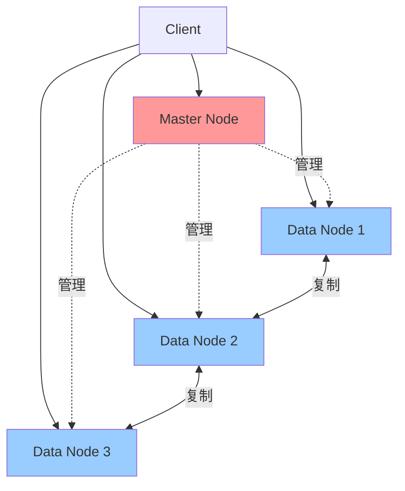
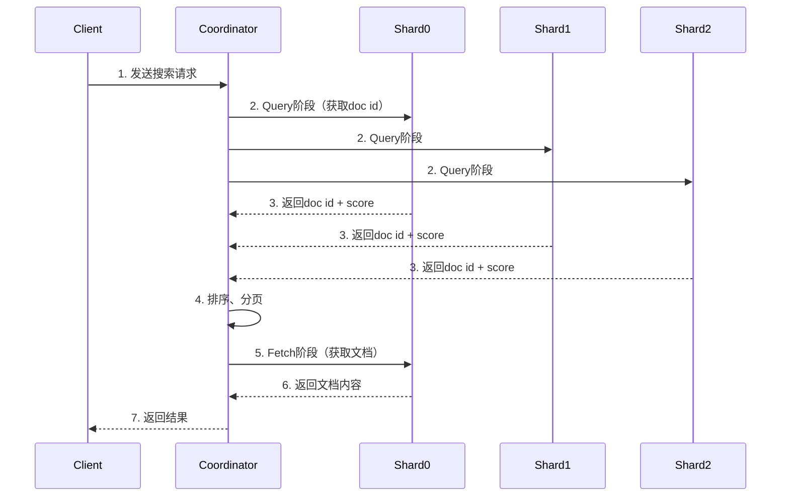

# Elasticsearch核心原理

> 深入理解Elasticsearch架构、倒排索引、查询DSL、集群机制

---

## 📋 目录

1. [Elasticsearch架构](#1-elasticsearch架构)
2. [倒排索引原理](#2-倒排索引原理)
3. [查询DSL](#3-查询dsl)
4. [聚合分析](#4-聚合分析)
5. [集群与分片](#5-集群与分片)
6. [常见问题与解决方案](#6-常见问题与解决方案)

---

## 1. Elasticsearch架构

### 1.1 核心概念

```
ES核心概念对比：
┌───────────────┬──────────────┬──────────────┐
│ ES            │ MySQL        │ 说明         │
├───────────────┼──────────────┼──────────────┤
│ Index(索引)   │ Database     │ 数据库       │
│ Type(类型)    │ Table        │ 表(7.x已废弃)│
│ Document(文档)│ Row          │ 行数据       │
│ Field(字段)   │ Column       │ 列           │
│ Mapping(映射) │ Schema       │ 表结构       │
└───────────────┴──────────────┴──────────────┘
```

### 1.2 集群架构



**节点类型**：
```
1. Master Node（主节点）：
   - 管理集群状态
   - 创建/删除索引
   - 分配分片
   - 不处理数据和搜索

2. Data Node（数据节点）：
   - 存储数据
   - 执行搜索和聚合
   - CRUD操作

3. Coordinating Node（协调节点）：
   - 路由请求
   - 合并结果
   - 负载均衡

4. Ingest Node（摄取节点）：
   - 数据预处理
   - 文档转换

配置示例：
node.master: true   # 可以成为主节点
node.data: true     # 数据节点
node.ingest: true   # 摄取节点
```

### 1.3 文档CRUD

**Java API示例**：
```java
/**
 * Elasticsearch文档操作
 */
@Service
public class ElasticsearchService {
    
    @Autowired
    private RestHighLevelClient client;
    
    // 1. 创建文档
    public void createDocument(User user) throws IOException {
        IndexRequest request = new IndexRequest("users")
            .id(user.getId().toString())
            .source(JSON.toJSONString(user), XContentType.JSON);
        
        IndexResponse response = client.index(request, RequestOptions.DEFAULT);
        System.out.println("创建文档: " + response.getId());
    }
    
    // 2. 获取文档
    public User getDocument(String id) throws IOException {
        GetRequest request = new GetRequest("users", id);
        GetResponse response = client.get(request, RequestOptions.DEFAULT);
        
        if (response.isExists()) {
            return JSON.parseObject(response.getSourceAsString(), User.class);
        }
        return null;
    }
    
    // 3. 更新文档
    public void updateDocument(String id, Map<String, Object> updates) throws IOException {
        UpdateRequest request = new UpdateRequest("users", id)
            .doc(updates);
        
        client.update(request, RequestOptions.DEFAULT);
    }
    
    // 4. 删除文档
    public void deleteDocument(String id) throws IOException {
        DeleteRequest request = new DeleteRequest("users", id);
        client.delete(request, RequestOptions.DEFAULT);
    }
    
    // 5. 批量操作
    public void bulkOperation(List<User> users) throws IOException {
        BulkRequest request = new BulkRequest();
        
        for (User user : users) {
            request.add(new IndexRequest("users")
                .id(user.getId().toString())
                .source(JSON.toJSONString(user), XContentType.JSON));
        }
        
        BulkResponse response = client.bulk(request, RequestOptions.DEFAULT);
        System.out.println("批量操作完成，失败: " + response.hasFailures());
    }
}
```

---

## 2. 倒排索引原理

### 2.1 正排索引 vs 倒排索引

```
正排索引（Forward Index）：
文档ID → 内容
Doc1 → "Java is a programming language"
Doc2 → "Python is easy to learn"
Doc3 → "Java and Python are popular"

查询"Java"：需要扫描所有文档 ❌

倒排索引（Inverted Index）：
词项 → 文档ID列表
java      → [Doc1, Doc3]
python    → [Doc2, Doc3]
programming → [Doc1]
language  → [Doc1]
easy      → [Doc2]
learn     → [Doc2]
popular   → [Doc3]

查询"Java"：直接获取[Doc1, Doc3] ✅
```

### 2.2 倒排索引结构

```
倒排索引 = Term Dictionary + Posting List

┌─────────────────────────────────────────┐
│         Term Dictionary (词典)          │
├──────────┬──────────────────────────────┤
│ Term     │ Posting List Pointer         │
├──────────┼──────────────────────────────┤
│ java     │ ─────────────────────┐       │
│ python   │ ─────────┐           │       │
│ easy     │ ────┐    │           │       │
└──────────┴─────┼────┼───────────┼───────┘
                 │    │           │
                 ▼    ▼           ▼
        ┌────────────┬───────────┬──────────────┐
        │ Posting    │ Posting   │ Posting      │
        │ List       │ List      │ List         │
        ├────────────┼───────────┼──────────────┤
        │ Doc2:      │ Doc2:     │ Doc1:        │
        │   pos:3    │   pos:1   │   pos:1      │
        │   freq:1   │   freq:1  │   freq:1     │
        │            │ Doc3:     │ Doc3:        │
        │            │   pos:2   │   pos:1      │
        │            │   freq:1  │   freq:1     │
        └────────────┴───────────┴──────────────┘

Posting List包含：
- 文档ID
- 词频（Term Frequency）
- 位置（Position）
- 偏移量（Offset）
```

### 2.3 分词器（Analyzer）

```java
/**
 * ES分词器
 */
public class AnalyzerDemo {
    
    // 1. Standard Analyzer（默认）
    // 输入：The 2 QUICK Brown-Foxes jumped over the lazy dog's bone.
    // 输出：[the, 2, quick, brown, foxes, jumped, over, the, lazy, dog's, bone]
    
    // 2. Simple Analyzer
    // 输入：The 2 QUICK Brown-Foxes jumped over the lazy dog's bone.
    // 输出：[the, quick, brown, foxes, jumped, over, the, lazy, dog, s, bone]
    
    // 3. Whitespace Analyzer
    // 输入：The 2 QUICK Brown-Foxes jumped over the lazy dog's bone.
    // 输出：[The, 2, QUICK, Brown-Foxes, jumped, over, the, lazy, dog's, bone.]
    
    // 4. IK中文分词器（常用）⭐
    // ik_max_word：最细粒度
    // 输入：中华人民共和国国歌
    // 输出：[中华人民共和国, 中华人民, 中华, 华人, 人民共和国, 人民, 共和国, 共和, 国国, 国歌]
    
    // ik_smart：最粗粒度
    // 输入：中华人民共和国国歌
    // 输出：[中华人民共和国, 国歌]
}
```

**自定义分词器**：
```json
PUT /my_index
{
  "settings": {
    "analysis": {
      "analyzer": {
        "my_analyzer": {
          "type": "custom",
          "tokenizer": "standard",
          "filter": [
            "lowercase",
            "my_stop",
            "my_synonym"
          ]
        }
      },
      "filter": {
        "my_stop": {
          "type": "stop",
          "stopwords": ["a", "an", "the"]
        },
        "my_synonym": {
          "type": "synonym",
          "synonyms": [
            "quick,fast",
            "jumps,leaps"
          ]
        }
      }
    }
  }
}
```

### 2.4 评分算法（TF-IDF/BM25）

**TF-IDF算法**：
```
TF（词频）：Term Frequency
TF = 词在文档中出现的次数 / 文档总词数

IDF（逆文档频率）：Inverse Document Frequency
IDF = log(文档总数 / 包含该词的文档数 + 1)

TF-IDF = TF × IDF

示例：
文档1："Java is a programming language"
文档2："Python is easy"
文档3："Java and Python"

查询"Java"：
Doc1: TF = 1/5 = 0.2, IDF = log(3/2) = 0.176, Score = 0.035
Doc3: TF = 1/3 = 0.333, IDF = log(3/2) = 0.176, Score = 0.059
Doc3得分更高 ✅
```

**BM25算法（ES 5.0+默认）**：
```
BM25 = IDF × (TF × (k1 + 1)) / (TF + k1 × (1 - b + b × (文档长度 / 平均文档长度)))

参数：
- k1：词频饱和度（默认1.2）
- b：长度归一化（默认0.75）

优点：
✅ 考虑文档长度
✅ 词频饱和（避免词频过高主导得分）
✅ 更符合实际搜索需求
```

---

## 3. 查询DSL

### 3.1 查询类型

**Query vs Filter**：
```
Query（查询）：
- 计算相关性得分
- 不缓存
- 用于：全文检索、模糊匹配

Filter（过滤）：
- 不计算得分
- 可缓存
- 用于：精确匹配、范围查询

示例：
{
  "query": {
    "bool": {
      "must": [
        { "match": { "title": "elasticsearch" }}  // Query
      ],
      "filter": [
        { "term": { "status": "published" }}      // Filter
      ]
    }
  }
}
```

### 3.2 全文检索

```java
/**
 * 全文检索查询
 */
public class FullTextSearch {
    
    // 1. match查询：最常用
    public void matchQuery() throws IOException {
        SearchRequest request = new SearchRequest("articles");
        SearchSourceBuilder builder = new SearchSourceBuilder();
        
        builder.query(QueryBuilders.matchQuery("content", "elasticsearch tutorial"));
        request.source(builder);
        
        SearchResponse response = client.search(request, RequestOptions.DEFAULT);
    }
    
    // 2. match_phrase查询：短语匹配
    public void matchPhraseQuery() throws IOException {
        builder.query(QueryBuilders.matchPhraseQuery("content", "quick brown fox"));
        // 必须完全匹配短语顺序
    }
    
    // 3. multi_match查询：多字段查询
    public void multiMatchQuery() throws IOException {
        builder.query(QueryBuilders.multiMatchQuery("elasticsearch", "title", "content"));
    }
    
    // 4. query_string查询：支持查询语法
    public void queryStringQuery() throws IOException {
        builder.query(QueryBuilders.queryStringQuery(
            "(elasticsearch OR solr) AND tutorial"
        ));
    }
}
```

### 3.3 精确匹配

```java
/**
 * 精确匹配查询
 */
public class TermLevelSearch {
    
    // 1. term查询：精确值匹配
    public void termQuery() throws IOException {
        builder.query(QueryBuilders.termQuery("status", "published"));
    }
    
    // 2. terms查询：多个精确值
    public void termsQuery() throws IOException {
        builder.query(QueryBuilders.termsQuery("status", "published", "draft"));
    }
    
    // 3. range查询：范围查询
    public void rangeQuery() throws IOException {
        builder.query(QueryBuilders.rangeQuery("price")
            .gte(10)   // >=
            .lte(100)  // <=
        );
    }
    
    // 4. exists查询：字段存在
    public void existsQuery() throws IOException {
        builder.query(QueryBuilders.existsQuery("email"));
    }
    
    // 5. prefix查询：前缀匹配
    public void prefixQuery() throws IOException {
        builder.query(QueryBuilders.prefixQuery("name", "java"));
    }
    
    // 6. wildcard查询：通配符
    public void wildcardQuery() throws IOException {
        builder.query(QueryBuilders.wildcardQuery("name", "java*"));
    }
    
    // 7. fuzzy查询：模糊查询（编辑距离）
    public void fuzzyQuery() throws IOException {
        builder.query(QueryBuilders.fuzzyQuery("name", "javva")
            .fuzziness(Fuzziness.ONE));  // 允许1个字符差异
    }
}
```

### 3.4 复合查询

```java
/**
 * 布尔查询
 */
public void boolQuery() throws IOException {
    BoolQueryBuilder boolQuery = QueryBuilders.boolQuery();
    
    // must：必须匹配（AND，计算得分）
    boolQuery.must(QueryBuilders.matchQuery("title", "elasticsearch"));
    
    // should：应该匹配（OR，计算得分）
    boolQuery.should(QueryBuilders.matchQuery("content", "tutorial"));
    
    // filter：必须匹配（AND，不计算得分，可缓存）
    boolQuery.filter(QueryBuilders.termQuery("status", "published"));
    boolQuery.filter(QueryBuilders.rangeQuery("price").gte(10).lte(100));
    
    // must_not：必须不匹配（NOT，不计算得分）
    boolQuery.mustNot(QueryBuilders.termQuery("category", "spam"));
    
    builder.query(boolQuery);
}
```

**DSL示例**：
```json
GET /articles/_search
{
  "query": {
    "bool": {
      "must": [
        { "match": { "title": "elasticsearch" }}
      ],
      "should": [
        { "match": { "content": "tutorial" }}
      ],
      "filter": [
        { "term": { "status": "published" }},
        { "range": { "price": { "gte": 10, "lte": 100 }}}
      ],
      "must_not": [
        { "term": { "category": "spam" }}
      ]
    }
  },
  "from": 0,
  "size": 10,
  "sort": [
    { "created_at": "desc" }
  ],
  "_source": ["title", "author", "created_at"]
}
```

---

## 4. 聚合分析

### 4.1 聚合类型

```
聚合（Aggregation）三大类：

1. Metric Aggregation（指标聚合）：
   - sum、avg、min、max
   - stats、extended_stats
   - percentiles、cardinality

2. Bucket Aggregation（桶聚合）：
   - terms、range、date_range
   - histogram、date_histogram
   - filters

3. Pipeline Aggregation（管道聚合）：
   - derivative、cumulative_sum
   - moving_avg、bucket_sort
```

### 4.2 指标聚合

```java
/**
 * 指标聚合示例
 */
public void metricAggregation() throws IOException {
    SearchSourceBuilder builder = new SearchSourceBuilder();
    
    // 1. 求和
    builder.aggregation(AggregationBuilders.sum("total_price").field("price"));
    
    // 2. 平均值
    builder.aggregation(AggregationBuilders.avg("avg_price").field("price"));
    
    // 3. 最小/最大值
    builder.aggregation(AggregationBuilders.min("min_price").field("price"));
    builder.aggregation(AggregationBuilders.max("max_price").field("price"));
    
    // 4. 统计（count、sum、avg、min、max）
    builder.aggregation(AggregationBuilders.stats("price_stats").field("price"));
    
    // 5. 扩展统计（增加方差、标准差等）
    builder.aggregation(AggregationBuilders.extendedStats("price_extended_stats").field("price"));
    
    // 6. 百分位数
    builder.aggregation(AggregationBuilders.percentiles("price_percentiles").field("price"));
    
    // 7. 去重计数
    builder.aggregation(AggregationBuilders.cardinality("unique_users").field("user_id"));
}
```

### 4.3 桶聚合

```java
/**
 * 桶聚合示例
 */
public void bucketAggregation() throws IOException {
    SearchSourceBuilder builder = new SearchSourceBuilder();
    
    // 1. terms聚合：分组统计
    builder.aggregation(AggregationBuilders.terms("by_category")
        .field("category")
        .size(10));  // 返回前10个桶
    
    // 2. range聚合：范围分桶
    builder.aggregation(AggregationBuilders.range("price_ranges")
        .field("price")
        .addUnboundedTo(50)      // <50
        .addRange(50, 100)       // 50-100
        .addUnboundedFrom(100)); // >100
    
    // 3. date_histogram聚合：时间直方图
    builder.aggregation(AggregationBuilders.dateHistogram("sales_over_time")
        .field("created_at")
        .calendarInterval(DateHistogramInterval.DAY));
    
    // 4. 嵌套聚合：每个分类的平均价格
    builder.aggregation(
        AggregationBuilders.terms("by_category")
            .field("category")
            .subAggregation(
                AggregationBuilders.avg("avg_price").field("price")
            )
    );
}
```

**DSL示例**：
```json
GET /products/_search
{
  "size": 0,
  "aggs": {
    "by_category": {
      "terms": {
        "field": "category",
        "size": 10
      },
      "aggs": {
        "avg_price": {
          "avg": { "field": "price" }
        },
        "price_stats": {
          "stats": { "field": "price" }
        }
      }
    },
    "price_ranges": {
      "range": {
        "field": "price",
        "ranges": [
          { "to": 50 },
          { "from": 50, "to": 100 },
          { "from": 100 }
        ]
      }
    },
    "sales_over_time": {
      "date_histogram": {
        "field": "created_at",
        "calendar_interval": "day"
      },
      "aggs": {
        "total_sales": {
          "sum": { "field": "amount" }
        }
      }
    }
  }
}
```

---

## 5. 集群与分片

### 5.1 分片机制

```
索引 = 主分片 + 副本分片

┌─────────────────────────────────────┐
│ Index: products (3 primary, 1 replica)│
├─────────────────────────────────────┤
│ Node 1                              │
│ ├─ Primary Shard 0                  │
│ └─ Replica Shard 1                  │
├─────────────────────────────────────┤
│ Node 2                              │
│ ├─ Primary Shard 1                  │
│ └─ Replica Shard 2                  │
├─────────────────────────────────────┤
│ Node 3                              │
│ ├─ Primary Shard 2                  │
│ └─ Replica Shard 0                  │
└─────────────────────────────────────┘

主分片（Primary Shard）：
- 创建索引时指定，不可修改
- 每个文档只属于一个主分片
- 决定索引的存储容量

副本分片（Replica Shard）：
- 可动态调整
- 提高查询性能（并行查询）
- 提供高可用（主分片故障时顶替）
```

**分片配置**：
```json
PUT /products
{
  "settings": {
    "number_of_shards": 3,      // 主分片数（创建后不可改）
    "number_of_replicas": 1     // 每个主分片的副本数（可动态调整）
  }
}

// 动态修改副本数
PUT /products/_settings
{
  "number_of_replicas": 2
}
```

### 5.2 文档路由

```
文档存储在哪个分片？
shard_num = hash(routing_value) % number_of_primary_shards

routing_value：
- 默认：文档ID
- 自定义：routing参数

示例：
PUT /users/_doc/1?routing=user123
{
  "name": "John",
  "email": "john@example.com"
}

好处：
✅ 相关文档存储在同一分片
✅ 提高查询性能
```

### 5.3 搜索流程

**Query Then Fetch流程**：


**详细步骤**：
```
1. Query阶段：
   - 协调节点将请求转发到所有分片
   - 每个分片执行查询，返回doc id和score
   - 协调节点合并结果，排序

2. Fetch阶段：
   - 协调节点根据doc id获取文档内容
   - 只获取需要的文档（from + size）

3. 返回结果：
   - 协调节点返回最终结果给客户端
```

### 5.4 集群健康

```bash
# 查看集群健康
GET /_cluster/health

{
  "cluster_name": "my-cluster",
  "status": "green",        # green/yellow/red
  "number_of_nodes": 3,
  "number_of_data_nodes": 3,
  "active_primary_shards": 15,
  "active_shards": 30,
  "relocating_shards": 0,
  "initializing_shards": 0,
  "unassigned_shards": 0
}

状态说明：
✅ Green：所有主分片和副本分片都已分配
⚠️ Yellow：所有主分片已分配，部分副本分片未分配
❌ Red：部分主分片未分配（数据丢失）
```

---

## 6. 常见问题与解决方案

### 6.1 深度分页问题

**问题**：
```
GET /products/_search
{
  "from": 10000,
  "size": 10
}

性能问题：
- 每个分片返回from + size条数据
- 协调节点需要排序(from + size) × 分片数条数据
- 内存消耗大，性能差

示例：3个分片，from=10000, size=10
每个分片返回10010条 → 协调节点排序30030条 → 返回10条
```

**解决方案**：
```java
/**
 * 深度分页解决方案
 */
public class DeepPaginationSolution {
    
    // 方案1：scroll API（不推荐，7.x后不推荐用于分页）
    public void scrollApi() throws IOException {
        // 初始化scroll
        SearchRequest request = new SearchRequest("products");
        request.scroll(TimeValue.timeValueMinutes(1));
        SearchSourceBuilder builder = new SearchSourceBuilder().size(100);
        request.source(builder);
        
        SearchResponse response = client.search(request, RequestOptions.DEFAULT);
        String scrollId = response.getScrollId();
        
        // 滚动获取数据
        while (response.getHits().getHits().length > 0) {
            // 处理数据
            
            SearchScrollRequest scrollRequest = new SearchScrollRequest(scrollId);
            scrollRequest.scroll(TimeValue.timeValueMinutes(1));
            response = client.scroll(scrollRequest, RequestOptions.DEFAULT);
        }
        
        // 清除scroll
        ClearScrollRequest clearRequest = new ClearScrollRequest();
        clearRequest.addScrollId(scrollId);
        client.clearScroll(clearRequest, RequestOptions.DEFAULT);
    }
    
    // 方案2：search_after（推荐）⭐
    public void searchAfter() throws IOException {
        SearchSourceBuilder builder = new SearchSourceBuilder()
            .size(10)
            .sort("created_at", SortOrder.DESC)
            .sort("_id", SortOrder.ASC);  // 唯一排序字段
        
        SearchRequest request = new SearchRequest("products").source(builder);
        SearchResponse response = client.search(request, RequestOptions.DEFAULT);
        
        // 第一页数据
        SearchHit[] hits = response.getHits().getHits();
        
        // 获取下一页
        if (hits.length > 0) {
            SearchHit lastHit = hits[hits.length - 1];
            Object[] sortValues = lastHit.getSortValues();
            
            builder.searchAfter(sortValues);  // 使用最后一条的排序值
            response = client.search(request, RequestOptions.DEFAULT);
        }
    }
    
    // 方案3：限制分页深度
    // index.max_result_window: 10000（默认）
    PUT /products/_settings
    {
      "index.max_result_window": 20000
    }
}
```

### 6.2 脑裂问题

**问题**：
```
网络分区导致集群分裂成多个独立集群

场景：
Node1(Master) ←✗→ Node2、Node3
由于网络故障，Node1与其他节点失联
Node2、Node3选举新Master
结果：存在两个Master节点 → 数据不一致
```

**解决方案**：
```yaml
# elasticsearch.yml

# 1. 设置最小主节点数（防止脑裂）
discovery.zen.minimum_master_nodes: (master_eligible_nodes / 2) + 1

# 示例：3个主节点
# minimum_master_nodes = (3 / 2) + 1 = 2

# 2. 设置选举超时
discovery.zen.ping_timeout: 30s

# 3. 使用专用主节点
node.master: true
node.data: false
node.ingest: false

# ES 7.x后改进（不再需要手动配置）
cluster.initial_master_nodes: ["node-1", "node-2", "node-3"]
```

### 6.3 数据倾斜

**问题**：
```
某些分片数据量远大于其他分片

原因：
1. 路由不均匀
2. 文档大小差异大
3. 更新集中在某些分片

影响：
- 查询性能差
- 内存占用不均
- 磁盘使用不均
```

**解决方案**：
```java
/**
 * 数据倾斜解决方案
 */
public class DataSkewSolution {
    
    // 1. 合理设置分片数
    // 单分片大小：20-50GB
    // 分片数 = 数据总量 / 单分片大小
    
    // 2. 使用自定义routing
    PUT /users/_doc/1?routing=user_region
    {
      "name": "John",
      "region": "asia"
    }
    
    // 3. 使用index.routing_partition_size
    PUT /users
    {
      "settings": {
        "number_of_shards": 6,
        "index.routing_partition_size": 2
      }
    }
    
    // 4. 监控分片状态
    GET /_cat/shards/users?v&s=store:desc
    
    // 5. 重新索引（reindex）
    POST /_reindex
    {
      "source": { "index": "old_index" },
      "dest": { "index": "new_index" }
    }
}
```

### 6.4 性能优化

**索引优化**：
```json
// 1. 禁用_source（节省空间）
PUT /logs
{
  "mappings": {
    "properties": {
      "message": { "type": "text" }
    },
    "_source": {
      "enabled": false
    }
  }
}

// 2. 禁用不需要的字段
PUT /products
{
  "mappings": {
    "properties": {
      "description": {
        "type": "text",
        "index": false,      // 不索引
        "doc_values": false  // 不存储doc_values
      }
    }
  }
}

// 3. 合并段（segment）
POST /products/_forcemerge?max_num_segments=1

// 4. 调整refresh间隔
PUT /products/_settings
{
  "index.refresh_interval": "30s"  // 默认1s
}

// 5. 批量写入
POST /_bulk
{ "index": { "_index": "products", "_id": "1" }}
{ "name": "Product 1", "price": 100 }
{ "index": { "_index": "products", "_id": "2" }}
{ "name": "Product 2", "price": 200 }
```

**查询优化**：
```java
/**
 * 查询性能优化
 */
public class QueryOptimization {
    
    // 1. 使用filter代替query（可缓存）
    builder.query(QueryBuilders.boolQuery()
        .filter(QueryBuilders.termQuery("status", "published"))  // 缓存
        .must(QueryBuilders.matchQuery("title", "elasticsearch"))  // 计算得分
    );
    
    // 2. 限制返回字段
    builder.fetchSource(new String[]{"title", "author"}, null);
    
    // 3. 使用routing
    request.routing("user123");
    
    // 4. 设置超时
    builder.timeout(TimeValue.timeValueSeconds(5));
    
    // 5. 使用profile分析
    builder.profile(true);
}
```

**硬件优化**：
```
1. 内存：
   - 堆内存：不超过32GB
   - 操作系统缓存：50%内存
   - 推荐：64GB内存机器，ES堆内存30GB

2. CPU：
   - 推荐：16-32核

3. 磁盘：
   - 使用SSD
   - RAID 0（性能）或RAID 10（可靠性）

4. 网络：
   - 万兆网卡
   - 低延迟交换机
```

---

## 📚 参考资料

- 📖 《Elasticsearch权威指南》
- 📖 《Elasticsearch实战》
- 🔗 [Elasticsearch官方文档](https://www.elastic.co/guide/en/elasticsearch/reference/current/index.html)
- 🔗 [Elasticsearch源码](https://github.com/elastic/elasticsearch)

---

*最后更新：2025-10-27*
