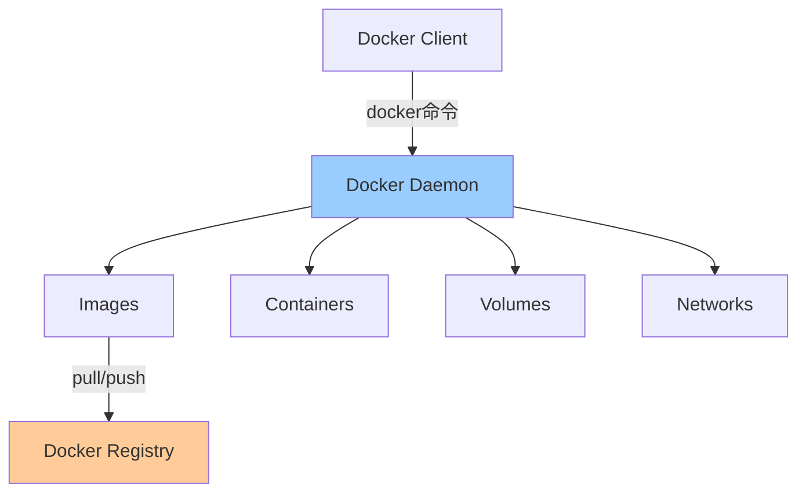
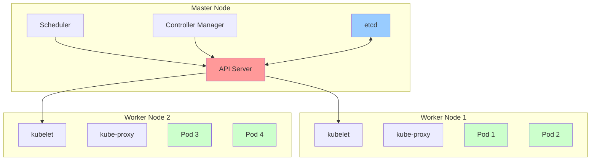

# Docker与Kubernetes详解

> 深入理解容器化技术、Docker原理、Kubernetes编排

---

## 📋 目录

1. [Docker核心原理](#1-docker核心原理)
2. [Docker实战](#2-docker实战)
3. [Kubernetes架构](#3-kubernetes架构)
4. [K8s核心资源](#4-k8s核心资源)
5. [K8s服务发现与负载均衡](#5-k8s服务发现与负载均衡)
6. [常见问题与解决方案](#6-常见问题与解决方案)

---

## 1. Docker核心原理

### 1.1 容器vs虚拟机

```
虚拟机（VM）：
┌────────────────────────────────┐
│ App A │ App B │ App C          │ 应用层
├───────┼───────┼───────┤        
│ Bins/Libs │ Bins/Libs │ Bins/│ 依赖层
├───────┴───────┴───────┤        
│ Guest OS │ Guest OS │ Guest │ 操作系统
├─────────────────────────────────┤
│        Hypervisor              │ 虚拟化层
├─────────────────────────────────┤
│        Host OS                 │ 宿主系统
├─────────────────────────────────┤
│        Infrastructure          │ 物理机
└─────────────────────────────────┘

容器（Container）：
┌────────────────────────────────┐
│ App A │ App B │ App C          │ 应用层
├───────┼───────┼───────┤        
│ Bins/Libs │ Bins/Libs │ Bins/│ 依赖层
├─────────────────────────────────┤
│        Docker Engine           │ 容器引擎
├─────────────────────────────────┤
│        Host OS                 │ 宿主系统
├─────────────────────────────────┤
│        Infrastructure          │ 物理机
└─────────────────────────────────┘

对比：
┌──────────┬────────┬────────┐
│ 特性     │ 虚拟机 │ 容器   │
├──────────┼────────┼────────┤
│ 启动速度 │ 分钟级 │ 秒级   │
│ 性能     │ 较差   │ 接近原生│
│ 体积     │ GB级   │ MB级   │
│ 隔离性   │ 强     │ 较弱   │
│ 资源占用 │ 高     │ 低     │
└──────────┴────────┴────────┘
```

### 1.2 Docker架构



**核心组件**：
```
1. Docker Client：
   - 用户交互界面
   - 发送命令给Daemon

2. Docker Daemon：
   - 核心后台进程
   - 管理容器、镜像、网络、卷

3. Docker Registry：
   - 镜像仓库
   - Docker Hub、阿里云等

4. Image（镜像）：
   - 只读模板
   - 分层存储

5. Container（容器）：
   - 镜像的运行实例
   - 可读写层
```

### 1.3 Docker底层技术

```
Docker核心技术：

1. Namespace（命名空间）- 隔离：
   - PID：进程隔离
   - NET：网络隔离
   - IPC：进程间通信隔离
   - MNT：文件系统挂载点隔离
   - UTS：主机名隔离
   - User：用户隔离

2. Cgroups（控制组）- 资源限制：
   - CPU限制
   - 内存限制
   - 磁盘I/O限制
   - 网络带宽限制

3. UnionFS（联合文件系统）- 分层存储：
   - AUFS、OverlayFS
   - 镜像分层
   - 写时复制（Copy-on-Write）
```

### 1.4 镜像分层

```
Docker镜像分层结构：

┌─────────────────────────────┐
│ Container Layer (R/W)       │ 可读写层（容器运行时）
├─────────────────────────────┤
│ Layer 4: ADD app.jar        │ ↑
├─────────────────────────────┤ │
│ Layer 3: RUN apt install    │ │
├─────────────────────────────┤ │ 只读层（镜像）
│ Layer 2: COPY ./app         │ │
├─────────────────────────────┤ │
│ Layer 1: FROM ubuntu:20.04  │ ↓
└─────────────────────────────┘

优点：
✅ 共享层（多个镜像共享相同的层）
✅ 快速构建（只重建修改的层）
✅ 节省空间
```

---

## 2. Docker实战

### 2.1 Dockerfile最佳实践

```dockerfile
# 1. 使用官方基础镜像
FROM openjdk:11-jre-slim

# 2. 设置工作目录
WORKDIR /app

# 3. 复制依赖文件（利用缓存）
COPY pom.xml .
COPY mvnw .
COPY .mvn .mvn
RUN ./mvnw dependency:go-offline

# 4. 复制源码并构建
COPY src src
RUN ./mvnw package -DskipTests

# 5. 多阶段构建（减小镜像体积）
FROM openjdk:11-jre-slim
WORKDIR /app
COPY --from=0 /app/target/app.jar app.jar

# 6. 创建非root用户
RUN addgroup --system appgroup && adduser --system --ingroup appgroup appuser
USER appuser

# 7. 暴露端口
EXPOSE 8080

# 8. 健康检查
HEALTHCHECK --interval=30s --timeout=3s \
  CMD curl -f http://localhost:8080/actuator/health || exit 1

# 9. 启动命令
ENTRYPOINT ["java", "-jar", "app.jar"]
CMD ["--spring.profiles.active=prod"]
```

**Dockerfile优化技巧**：
```dockerfile
# ❌ 错误：每条RUN创建一个层
RUN apt-get update
RUN apt-get install -y curl
RUN apt-get install -y vim

# ✅ 正确：合并命令
RUN apt-get update && \
    apt-get install -y curl vim && \
    rm -rf /var/lib/apt/lists/*

# ❌ 错误：复制整个目录
COPY . .

# ✅ 正确：只复制需要的文件
COPY src/ src/
COPY pom.xml .

# ❌ 错误：使用latest标签
FROM node:latest

# ✅ 正确：使用具体版本
FROM node:16.14.0-alpine

# ✅ 使用.dockerignore排除不需要的文件
# .dockerignore
node_modules
.git
.gitignore
README.md
```

### 2.2 Docker Compose

```yaml
# docker-compose.yml
version: '3.8'

services:
  # 应用服务
  app:
    build:
      context: .
      dockerfile: Dockerfile
    ports:
      - "8080:8080"
    environment:
      - SPRING_PROFILES_ACTIVE=prod
      - SPRING_DATASOURCE_URL=jdbc:mysql://db:3306/mydb
      - SPRING_REDIS_HOST=redis
    depends_on:
      - db
      - redis
    networks:
      - app-network
    volumes:
      - ./logs:/app/logs
    restart: unless-stopped
    healthcheck:
      test: ["CMD", "curl", "-f", "http://localhost:8080/actuator/health"]
      interval: 30s
      timeout: 10s
      retries: 3
  
  # MySQL数据库
  db:
    image: mysql:8.0
    environment:
      MYSQL_ROOT_PASSWORD: root123
      MYSQL_DATABASE: mydb
    ports:
      - "3306:3306"
    volumes:
      - mysql-data:/var/lib/mysql
      - ./init.sql:/docker-entrypoint-initdb.d/init.sql
    networks:
      - app-network
    restart: unless-stopped
  
  # Redis缓存
  redis:
    image: redis:7-alpine
    ports:
      - "6379:6379"
    networks:
      - app-network
    restart: unless-stopped
  
  # Nginx反向代理
  nginx:
    image: nginx:alpine
    ports:
      - "80:80"
      - "443:443"
    volumes:
      - ./nginx.conf:/etc/nginx/nginx.conf
      - ./ssl:/etc/nginx/ssl
    depends_on:
      - app
    networks:
      - app-network
    restart: unless-stopped

networks:
  app-network:
    driver: bridge

volumes:
  mysql-data:
```

**常用命令**：
```bash
# 启动所有服务
docker-compose up -d

# 查看服务状态
docker-compose ps

# 查看日志
docker-compose logs -f app

# 停止服务
docker-compose stop

# 停止并删除容器
docker-compose down

# 停止并删除容器和数据卷
docker-compose down -v

# 重启服务
docker-compose restart app

# 进入容器
docker-compose exec app bash

# 扩容
docker-compose up -d --scale app=3
```

### 2.3 Docker网络

```bash
# 1. 默认网络模式
docker run --network bridge myapp    # 桥接模式（默认）
docker run --network host myapp      # 主机模式
docker run --network none myapp      # 无网络模式
docker run --network container:id myapp  # 容器模式

# 2. 自定义网络
docker network create my-network
docker run --network my-network --name app1 myapp
docker run --network my-network --name app2 myapp
# app1和app2可以通过容器名互相访问

# 3. 网络管理
docker network ls
docker network inspect my-network
docker network rm my-network
```

### 2.4 Docker数据持久化

```bash
# 1. 数据卷（Volume）- 推荐
docker volume create my-data
docker run -v my-data:/app/data myapp

# 2. 绑定挂载（Bind Mount）
docker run -v /host/path:/container/path myapp

# 3. 临时文件系统（tmpfs）
docker run --tmpfs /app/cache myapp

# 数据卷管理
docker volume ls
docker volume inspect my-data
docker volume rm my-data
docker volume prune  # 清理未使用的卷
```

---

## 3. Kubernetes架构

### 3.1 K8s架构图



### 3.2 核心组件

**Master节点组件**：
```
1. API Server：
   - 集群的统一入口
   - RESTful API
   - 认证、授权、准入控制

2. Scheduler：
   - Pod调度
   - 资源匹配
   - 负载均衡

3. Controller Manager：
   - 控制器管理
   - Node Controller、Replication Controller等
   - 维护集群状态

4. etcd：
   - 分布式KV存储
   - 存储集群配置和状态
   - 高可用
```

**Node节点组件**：
```
1. kubelet：
   - 节点代理
   - 管理Pod生命周期
   - 上报节点状态

2. kube-proxy：
   - 网络代理
   - 服务发现
   - 负载均衡

3. Container Runtime：
   - Docker、containerd、CRI-O
   - 运行容器
```

---

## 4. K8s核心资源

### 4.1 Pod

```yaml
# pod.yaml
apiVersion: v1
kind: Pod
metadata:
  name: myapp-pod
  labels:
    app: myapp
spec:
  containers:
  - name: myapp
    image: myapp:1.0
    ports:
    - containerPort: 8080
    env:
    - name: SPRING_PROFILES_ACTIVE
      value: "prod"
    resources:
      requests:
        memory: "256Mi"
        cpu: "500m"
      limits:
        memory: "512Mi"
        cpu: "1000m"
    livenessProbe:       # 存活探针
      httpGet:
        path: /actuator/health
        port: 8080
      initialDelaySeconds: 30
      periodSeconds: 10
    readinessProbe:      # 就绪探针
      httpGet:
        path: /actuator/health
        port: 8080
      initialDelaySeconds: 10
      periodSeconds: 5
```

### 4.2 Deployment

```yaml
# deployment.yaml
apiVersion: apps/v1
kind: Deployment
metadata:
  name: myapp-deployment
spec:
  replicas: 3           # 副本数
  selector:
    matchLabels:
      app: myapp
  strategy:
    type: RollingUpdate  # 滚动更新
    rollingUpdate:
      maxSurge: 1        # 最多增加1个Pod
      maxUnavailable: 1  # 最多不可用1个Pod
  template:
    metadata:
      labels:
        app: myapp
    spec:
      containers:
      - name: myapp
        image: myapp:1.0
        ports:
        - containerPort: 8080
        resources:
          requests:
            memory: "256Mi"
            cpu: "500m"
          limits:
            memory: "512Mi"
            cpu: "1000m"
```

**常用命令**：
```bash
# 创建Deployment
kubectl apply -f deployment.yaml

# 查看Deployment
kubectl get deployments
kubectl describe deployment myapp-deployment

# 扩容/缩容
kubectl scale deployment myapp-deployment --replicas=5

# 更新镜像
kubectl set image deployment/myapp-deployment myapp=myapp:2.0

# 查看滚动更新状态
kubectl rollout status deployment/myapp-deployment

# 查看历史版本
kubectl rollout history deployment/myapp-deployment

# 回滚到上一版本
kubectl rollout undo deployment/myapp-deployment

# 回滚到指定版本
kubectl rollout undo deployment/myapp-deployment --to-revision=2
```

### 4.3 Service

```yaml
# service.yaml
apiVersion: v1
kind: Service
metadata:
  name: myapp-service
spec:
  type: ClusterIP      # ClusterIP、NodePort、LoadBalancer
  selector:
    app: myapp
  ports:
  - port: 80           # Service端口
    targetPort: 8080   # 容器端口
    protocol: TCP
```

**Service类型**：
```yaml
# 1. ClusterIP（默认）- 集群内部访问
spec:
  type: ClusterIP
  ports:
  - port: 80
    targetPort: 8080

# 2. NodePort - 通过节点IP+端口访问
spec:
  type: NodePort
  ports:
  - port: 80
    targetPort: 8080
    nodePort: 30080  # 30000-32767

# 3. LoadBalancer - 云厂商负载均衡器
spec:
  type: LoadBalancer
  ports:
  - port: 80
    targetPort: 8080

# 4. ExternalName - 映射到外部服务
spec:
  type: ExternalName
  externalName: example.com
```

### 4.4 ConfigMap和Secret

```yaml
# configmap.yaml
apiVersion: v1
kind: ConfigMap
metadata:
  name: myapp-config
data:
  application.properties: |
    server.port=8080
    spring.datasource.url=jdbc:mysql://mysql:3306/mydb
  log-level: "INFO"

---
# secret.yaml
apiVersion: v1
kind: Secret
metadata:
  name: myapp-secret
type: Opaque
data:
  username: YWRtaW4=  # base64编码
  password: cGFzc3dvcmQ=

---
# 使用ConfigMap和Secret
apiVersion: v1
kind: Pod
metadata:
  name: myapp-pod
spec:
  containers:
  - name: myapp
    image: myapp:1.0
    env:
    # 从ConfigMap读取
    - name: LOG_LEVEL
      valueFrom:
        configMapKeyRef:
          name: myapp-config
          key: log-level
    # 从Secret读取
    - name: DB_USERNAME
      valueFrom:
        secretKeyRef:
          name: myapp-secret
          key: username
    volumeMounts:
    # 挂载ConfigMap为文件
    - name: config-volume
      mountPath: /app/config
  volumes:
  - name: config-volume
    configMap:
      name: myapp-config
```

### 4.5 Ingress

```yaml
# ingress.yaml
apiVersion: networking.k8s.io/v1
kind: Ingress
metadata:
  name: myapp-ingress
  annotations:
    nginx.ingress.kubernetes.io/rewrite-target: /
    cert-manager.io/cluster-issuer: "letsencrypt-prod"
spec:
  tls:
  - hosts:
    - example.com
    secretName: example-tls
  rules:
  - host: example.com
    http:
      paths:
      - path: /api
        pathType: Prefix
        backend:
          service:
            name: api-service
            port:
              number: 80
      - path: /web
        pathType: Prefix
        backend:
          service:
            name: web-service
            port:
              number: 80
```

---

## 5. K8s服务发现与负载均衡

### 5.1 服务发现

```
K8s服务发现方式：

1. 环境变量：
   - Pod启动时自动注入Service信息
   - MYAPP_SERVICE_HOST=10.0.0.10
   - MYAPP_SERVICE_PORT=80

2. DNS（推荐）：
   - CoreDNS
   - 服务名.命名空间.svc.cluster.local
   - 示例：myapp-service.default.svc.cluster.local
```

### 5.2 负载均衡

```
kube-proxy三种模式：

1. Userspace（已废弃）：
   - 用户空间代理
   - 性能差

2. iptables（默认）：
   - 基于iptables规则
   - 性能较好
   - 规则多时性能下降

3. IPVS（推荐）：
   - 基于内核IPVS
   - 性能好
   - 支持更多负载均衡算法

负载均衡算法：
- Round Robin（轮询）
- Least Connection（最少连接）
- Source IP Hash（源IP哈希）
```

---

## 6. 常见问题与解决方案

### 6.1 镜像拉取失败

**问题**：
```
Failed to pull image "myapp:1.0": rpc error: code = Unknown 
desc = Error response from daemon: pull access denied
```

**解决方案**：
```bash
# 1. 使用阿里云镜像加速
mkdir -p /etc/docker
cat > /etc/docker/daemon.json <<EOF
{
  "registry-mirrors": ["https://xxx.mirror.aliyuncs.com"]
}
EOF
systemctl restart docker

# 2. 配置私有仓库认证
kubectl create secret docker-registry my-registry-secret \
  --docker-server=registry.example.com \
  --docker-username=admin \
  --docker-password=password \
  --docker-email=admin@example.com

# 3. Pod中使用Secret
spec:
  imagePullSecrets:
  - name: my-registry-secret
  containers:
  - name: myapp
    image: registry.example.com/myapp:1.0
```

### 6.2 Pod一直Pending

**问题**：Pod状态一直为Pending

**原因**：
```
1. 资源不足（CPU/内存）
2. 节点选择器不匹配
3. PVC无法绑定
4. 污点和容忍度不匹配
```

**排查**：
```bash
# 查看Pod事件
kubectl describe pod myapp-pod

# 查看节点资源
kubectl top nodes
kubectl describe node node1

# 查看调度失败原因
kubectl get events --field-selector involvedObject.name=myapp-pod
```

**解决方案**：
```yaml
# 1. 降低资源请求
resources:
  requests:
    memory: "128Mi"
    cpu: "250m"

# 2. 添加节点容忍度
spec:
  tolerations:
  - key: "key1"
    operator: "Equal"
    value: "value1"
    effect: "NoSchedule"

# 3. 添加节点选择器
spec:
  nodeSelector:
    disktype: ssd
```

### 6.3 容器重启循环

**问题**：CrashLoopBackOff

**原因**：
```
1. 应用启动失败
2. 健康检查失败
3. OOM（内存溢出）
4. 资源限制过低
```

**排查**：
```bash
# 查看Pod日志
kubectl logs myapp-pod
kubectl logs myapp-pod --previous  # 查看上次重启前的日志

# 查看Pod事件
kubectl describe pod myapp-pod

# 进入容器调试
kubectl exec -it myapp-pod -- /bin/bash
```

**解决方案**：
```yaml
# 1. 增加内存限制
resources:
  limits:
    memory: "1Gi"

# 2. 调整健康检查
livenessProbe:
  httpGet:
    path: /health
    port: 8080
  initialDelaySeconds: 60  # 增加初始延迟
  periodSeconds: 10
  timeoutSeconds: 5
  failureThreshold: 3      # 失败3次才重启

# 3. 查看OOM情况
kubectl describe pod myapp-pod | grep -i oom
```

### 6.4 Service无法访问

**问题**：无法访问Service

**排查**：
```bash
# 1. 检查Service
kubectl get svc
kubectl describe svc myapp-service

# 2. 检查Endpoints
kubectl get endpoints myapp-service

# 3. 检查Pod标签
kubectl get pods --show-labels

# 4. 测试Service
kubectl run -it --rm debug --image=busybox --restart=Never -- sh
wget -O- http://myapp-service:80
```

**解决方案**：
```yaml
# 1. 确保selector匹配
# Service
spec:
  selector:
    app: myapp  # 必须匹配Pod标签

# Pod
metadata:
  labels:
    app: myapp

# 2. 检查端口映射
spec:
  ports:
  - port: 80          # Service端口
    targetPort: 8080  # 容器端口（必须一致）
```

### 6.5 资源不足优化

**CPU优化**：
```yaml
# 1. 合理设置requests和limits
resources:
  requests:
    cpu: "500m"    # 保证资源
  limits:
    cpu: "1000m"   # 限制资源

# 2. 使用HPA自动扩容
apiVersion: autoscaling/v2
kind: HorizontalPodAutoscaler
metadata:
  name: myapp-hpa
spec:
  scaleTargetRef:
    apiVersion: apps/v1
    kind: Deployment
    name: myapp-deployment
  minReplicas: 2
  maxReplicas: 10
  metrics:
  - type: Resource
    resource:
      name: cpu
      target:
        type: Utilization
        averageUtilization: 70
```

**内存优化**：
```yaml
# 1. 设置JVM内存
env:
- name: JAVA_OPTS
  value: "-Xms512m -Xmx512m"

# 2. 容器内存限制
resources:
  limits:
    memory: "1Gi"
  requests:
    memory: "512Mi"

# 注意：容器内存 > JVM最大堆内存
```

---

## 📚 参考资料

- 📖 《Docker技术入门与实战》
- 📖 《Kubernetes权威指南》
- 🔗 [Docker官方文档](https://docs.docker.com/)
- 🔗 [Kubernetes官方文档](https://kubernetes.io/docs/)

---

*最后更新：2025-10-27*
