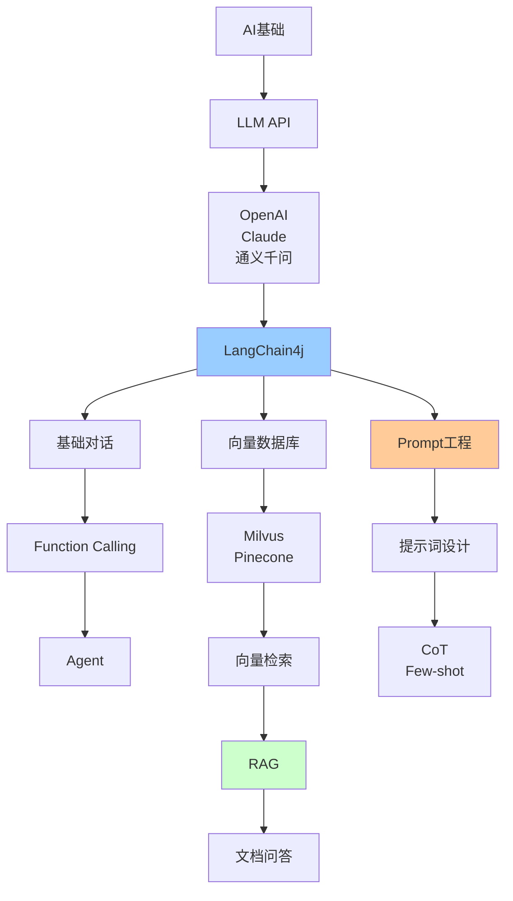

# AI集成技术详解

> AI时代Java工程师必备：LangChain4j、向量数据库、RAG、Prompt工程

---

## 📋 文档列表

### 1. Java AI开发实战 ⭐⭐⭐ 必学
📄 [Java AI开发实战.md](./Java%20AI开发实战.md)

**核心内容**：
- ✅ **LangChain4j框架**：快速集成LLM、Function Calling、对话记忆
- ✅ **向量数据库**：Milvus集成、向量检索、相似度搜索
- ✅ **RAG检索增强生成**：文档处理、向量化、混合检索
- ✅ **Prompt工程**：提示词模板、Chain of Thought、Few-shot学习
- ✅ **AI应用架构**：Controller层、异步处理、缓存优化
- ✅ **实战案例**：智能客服、文档问答、代码助手

**适合场景**：
- AI应用开发
- 智能客服系统
- 知识库问答
- 代码辅助工具

---

## 🎯 AI技术学习路线



**推荐顺序**：
1. 了解LLM基础概念
2. 学习LangChain4j框架
3. 掌握向量数据库（Milvus）
4. 实现RAG应用
5. 深入Prompt工程
6. 构建AI Agent

---

## 💡 核心知识点速查

**Q1: 什么是LangChain4j？**
```
LangChain4j：
- Java的LLM集成框架
- 类似Python的LangChain
- 支持多种LLM（OpenAI、Claude等）
- 提供RAG、Agent等高级功能
```

**Q2: 什么是向量数据库？**
```
向量数据库：
- 存储和检索向量（embeddings）
- 快速相似度搜索
- 常用：Milvus、Pinecone、Weaviate

应用场景：
✅ 语义搜索
✅ 推荐系统
✅ 图像检索
✅ RAG系统
```

**Q3: 什么是RAG？**
```
RAG（Retrieval-Augmented Generation）：
检索增强生成

流程：
1. 用户查询
2. 向量检索相关文档
3. 构建上下文
4. LLM生成答案

优点：
✅ 减少幻觉
✅ 答案可追溯
✅ 实时更新知识
✅ 成本低
```
- 详见：[Java AI开发实战.md](./Java%20AI开发实战.md#4-rag检索增强生成)

**Q4: Function Calling是什么？**
```
Function Calling：
- LLM调用外部工具/API
- 实现Agent功能

示例：
用户："北京天气怎么样？"
→ LLM识别需要调用天气API
→ 调用getWeather("北京")
→ 返回结果给LLM
→ LLM生成自然语言回答
```
- 详见：[Java AI开发实战.md](./Java%20AI开发实战.md#23-function-calling)

**Q5: 如何优化RAG效果？**
```
优化策略：
1. 文档切分优化
   - 合理的chunk size
   - 语义边界切分

2. 混合检索
   - 向量检索 + 关键词检索
   - Reranking重排序

3. 查询优化
   - Query改写
   - 多查询融合

4. 上下文优化
   - 相关性过滤
   - 上下文压缩
```

**Q6: Prompt工程有哪些技巧？**
```
1. Clear Instructions（清晰指令）
2. Few-shot Learning（少样本学习）
3. Chain of Thought（思维链）
4. Role Playing（角色扮演）
5. Format Control（格式控制）
```
- 详见：[Java AI开发实战.md](./Java%20AI开发实战.md#5-prompt工程)

---

## 🛠️ 快速开始

### 1. 引入依赖

```xml
<dependencies>
    <!-- LangChain4j核心 -->
    <dependency>
        <groupId>dev.langchain4j</groupId>
        <artifactId>langchain4j</artifactId>
        <version>0.28.0</version>
    </dependency>
    
    <!-- OpenAI集成 -->
    <dependency>
        <groupId>dev.langchain4j</groupId>
        <artifactId>langchain4j-open-ai</artifactId>
        <version>0.28.0</version>
    </dependency>
    
    <!-- Spring Boot启动器 -->
    <dependency>
        <groupId>dev.langchain4j</groupId>
        <artifactId>langchain4j-spring-boot-starter</artifactId>
        <version>0.28.0</version>
    </dependency>
</dependencies>
```

### 2. 配置

```yaml
langchain4j:
  open-ai:
    api-key: ${OPENAI_API_KEY}
    model-name: gpt-4
    temperature: 0.7
```

### 3. 基础使用

```java
@Service
public class ChatService {
    
    @Autowired
    private ChatLanguageModel chatModel;
    
    public String chat(String message) {
        return chatModel.generate(message);
    }
}
```

---

## 📊 技术选型

### LLM选择

| 模型 | 优点 | 缺点 | 适用场景 |
|------|------|------|----------|
| GPT-4 | 能力强、推理好 | 贵、慢 | 复杂任务 |
| GPT-3.5 | 快、便宜 | 能力较弱 | 简单对话 |
| Claude | 长文本、安全 | API限制 | 文档分析 |
| 通义千问 | 中文好、便宜 | 国内模型 | 中文应用 |

### 向量数据库选择

| 数据库 | 优点 | 缺点 | 适用场景 |
|--------|------|------|----------|
| Milvus | 开源、性能好 | 部署复杂 | 大规模 |
| Pinecone | 托管、易用 | 收费 | 快速开发 |
| Weaviate | 功能全 | 社区小 | 特定场景 |
| Qdrant | Rust实现、快 | 较新 | 性能要求高 |

### Embedding模型选择

| 模型 | 维度 | 优点 | 缺点 |
|------|------|------|------|
| text-embedding-ada-002 | 1536 | 效果好 | OpenAI收费 |
| text-embedding-3-small | 1536 | 便宜 | 稍弱 |
| text-embedding-3-large | 3072 | 效果最好 | 贵 |
| 本地模型 | 可变 | 免费 | 效果较弱 |

---

## 🚨 常见问题

### 1️⃣ API超时

**问题**：LLM API调用超时

**解决**：
```java
OpenAiChatModel.builder()
    .timeout(Duration.ofSeconds(60))
    .maxRetries(3)
    .build();
```

### 2️⃣ Token超限

**问题**：上下文超过模型限制

**解决**：
- 使用滑动窗口
- 压缩上下文
- 选择更大上下文的模型

### 3️⃣ 向量检索不准

**问题**：检索结果不相关

**解决**：
- 优化文档切分
- 使用混合检索
- 添加Reranking
- 调整top-k参数

### 4️⃣ 成本过高

**问题**：API调用成本高

**解决**：
- 使用缓存
- 选择便宜模型
- 优化Prompt长度
- 批量处理

### 5️⃣ 响应速度慢

**问题**：用户等待时间长

**解决**：
- 使用流式响应
- 异步处理
- 缓存常见问题
- 预加载向量

---

## 📈 最佳实践

### 1. 安全性

```java
// ❌ 不要硬编码API Key
String apiKey = "sk-xxxx";

// ✅ 使用环境变量
String apiKey = System.getenv("OPENAI_API_KEY");

// ✅ 使用Spring配置
@Value("${langchain4j.open-ai.api-key}")
private String apiKey;
```

### 2. 错误处理

```java
try {
    String response = chatModel.generate(message);
    return response;
} catch (Exception e) {
    log.error("AI调用失败", e);
    return "抱歉，系统暂时无法处理您的请求";
}
```

### 3. 限流

```java
@RateLimiter(name = "ai-api", fallbackMethod = "fallback")
public String chat(String message) {
    return chatModel.generate(message);
}
```

### 4. 监控

```java
@Timed(value = "ai.chat.duration")
@Counted(value = "ai.chat.requests")
public String chat(String message) {
    return chatModel.generate(message);
}
```

---

## 🔗 学习资源

- 🔗 [LangChain4j官方文档](https://docs.langchain4j.dev/)
- 🔗 [OpenAI API文档](https://platform.openai.com/docs)
- 🔗 [Milvus文档](https://milvus.io/docs)
- 📖 《大语言模型应用开发实战》
- 📖 《Prompt Engineering Guide》
- 🎥 [Andrew Ng的Prompt Engineering课程](https://www.deeplearning.ai/short-courses/)

---

## 🌟 进阶方向

1. **多模态AI**：图像、音频、视频处理
2. **AI Agent**：自主决策、多步推理
3. **Fine-tuning**：模型微调
4. **本地部署**：私有化部署LLM
5. **AI安全**：越狱防护、内容审核

---

*最后更新：2025-10-27*
