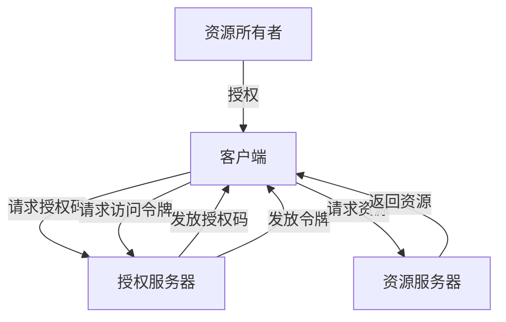
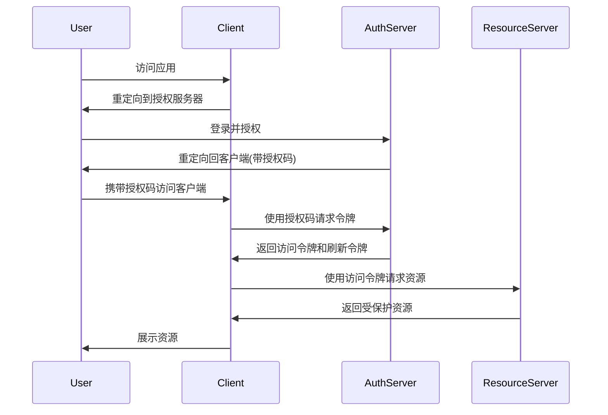

# OAuth2.0实战案例与最佳实践

> 深入理解授权框架的实现方式与应用场景

## 📋 目录

1. [OAuth2.0核心概念](#1-oauth20核心概念)
2. [授权流程详解](#2-授权流程详解)
3. [Spring Security OAuth2集成](#3-spring-security-oauth2集成)
4. [第三方登录实战](#4-第三方登录实战)
5. [资源服务器保护](#5-资源服务器保护)
6. [安全最佳实践](#6-安全最佳实践)
7. [常见问题解决方案](#7-常见问题解决方案)
8. [OAuth2.0 vs OAuth1.0 vs OpenID Connect](#8-oauth20-vs-oauth10-vs-openid-connect)

---

## 1. OAuth2.0核心概念

### 1.1 角色定义

| 角色 | 说明 |
|------|------|
| **资源所有者(Resource Owner)** | 授权客户端访问受保护资源的用户 |
| **客户端(Client)** | 请求访问资源的应用程序 |
| **授权服务器(Authorization Server)** | 验证资源所有者身份并发放令牌 |
| **资源服务器(Resource Server)** | 存储和提供受保护资源的服务器 |

### 1.2 核心术语

- **授权码(Authorization Code)**：授权服务器发放的临时凭证
- **访问令牌(Access Token)**：用于访问受保护资源的令牌
- **刷新令牌(Refresh Token)**：用于获取新访问令牌的令牌
- **作用域(Scope)**：客户端请求的资源访问范围
- **客户端ID(Client ID)**：客户端的唯一标识
- **客户端密钥(Client Secret)**：客户端与授权服务器之间的密钥



---

## 2. 授权流程详解

### 2.1 授权码流程(Authorization Code Flow)

**适用场景**：服务器端应用

**流程**：
1. 客户端重定向用户到授权服务器
2. 用户同意授权
3. 授权服务器重定向回客户端并附带授权码
4. 客户端使用授权码请求访问令牌
5. 授权服务器发放访问令牌和刷新令牌



### 2.2 简化流程(Implicit Flow)

**适用场景**：纯前端应用

**特点**：
- 不通过第三方应用程序的服务器，直接在浏览器中向授权服务器申请令牌
- 不支持刷新令牌
- 安全性较低

### 2.3 密码流程(Resource Owner Password Flow)

**适用场景**：高度信任的应用

**特点**：
- 用户直接向客户端提供用户名和密码
- 客户端使用这些凭据获取令牌
- 仅适用于用户对客户端高度信任的场景

### 2.4 客户端凭证流程(Client Credentials Flow)

**适用场景**：服务器间通信

**特点**：
- 没有用户参与
- 客户端使用自己的凭据获取令牌
- 用于访问客户端自己的资源

---

## 3. Spring Security OAuth2集成

### 3.1 授权服务器配置

**1. 引入依赖**：
```xml
<dependency>
    <groupId>org.springframework.security.oauth</groupId>
    <artifactId>spring-security-oauth2</artifactId>
    <version>2.3.8.RELEASE</version>
</dependency>
<dependency>
    <groupId>org.springframework.security</groupId>
    <artifactId>spring-security-jwt</artifactId>
    <version>1.1.1.RELEASE</version>
</dependency>
```

**2. 配置授权服务器**：
```java
@Configuration
@EnableAuthorizationServer
public class AuthServerConfig extends AuthorizationServerConfigurerAdapter {

    @Autowired
    private AuthenticationManager authenticationManager;

    @Autowired
    private UserDetailsService userDetailsService;

    @Override
    public void configure(ClientDetailsServiceConfigurer clients) throws Exception {
        clients.inMemory()
            .withClient("client-id")
            .secret(passwordEncoder.encode("client-secret"))
            .authorizedGrantTypes("authorization_code", "password", "refresh_token")
            .scopes("read", "write")
            .accessTokenValiditySeconds(3600)
            .refreshTokenValiditySeconds(86400)
            .redirectUris("http://localhost:8080/callback");
    }

    @Override
    public void configure(AuthorizationServerEndpointsConfigurer endpoints) throws Exception {
        endpoints
            .authenticationManager(authenticationManager)
            .userDetailsService(userDetailsService)
            .tokenStore(tokenStore())
            .accessTokenConverter(jwtAccessTokenConverter());
    }

    @Bean
    public TokenStore tokenStore() {
        return new JwtTokenStore(jwtAccessTokenConverter());
    }

    @Bean
    public JwtAccessTokenConverter jwtAccessTokenConverter() {
        JwtAccessTokenConverter converter = new JwtAccessTokenConverter();
        converter.setSigningKey("secret-key"); // 实际生产环境使用更安全的密钥管理
        return converter;
    }
}
```

### 3.2 安全配置

```java
@Configuration
@EnableWebSecurity
public class SecurityConfig extends WebSecurityConfigurerAdapter {

    @Autowired
    private UserDetailsService userDetailsService;

    @Bean
    public PasswordEncoder passwordEncoder() {
        return new BCryptPasswordEncoder();
    }

    @Override
    @Bean
    public AuthenticationManager authenticationManagerBean() throws Exception {
        return super.authenticationManagerBean();
    }

    @Override
    protected void configure(AuthenticationManagerBuilder auth) throws Exception {
        auth.userDetailsService(userDetailsService)
            .passwordEncoder(passwordEncoder());
    }

    @Override
    protected void configure(HttpSecurity http) throws Exception {
        http
            .csrf().disable()
            .authorizeRequests()
            .antMatchers("/oauth/**", "/login/**").permitAll()
            .anyRequest().authenticated()
            .and()
            .formLogin().permitAll();
    }
}
```

---

## 4. 第三方登录实战

### 4.1 GitHub登录集成

**1. 应用配置**：
在GitHub创建OAuth应用，获取Client ID和Client Secret

**2. Spring Social配置**：
```xml
<dependency>
    <groupId>org.springframework.social</groupId>
    <artifactId>spring-social-config</artifactId>
</dependency>
<dependency>
    <groupId>org.springframework.social</groupId>
    <artifactId>spring-social-core</artifactId>
</dependency>
<dependency>
    <groupId>org.springframework.social</groupId>
    <artifactId>spring-social-security</artifactId>
</dependency>
<dependency>
    <groupId>org.springframework.social</groupId>
    <artifactId>spring-social-github</artifactId>
</dependency>
```

**3. GitHub连接配置**：
```java
@Configuration
@EnableSocial
public class SocialConfig extends SocialConfigurerAdapter {

    @Override
    public void addConnectionFactories(ConnectionFactoryConfigurer connectionFactoryConfigurer,
                                      Environment environment) {
        connectionFactoryConfigurer.addConnectionFactory(
            new GitHubConnectionFactory(
                environment.getProperty("spring.social.github.app-id"),
                environment.getProperty("spring.social.github.app-secret")
            )
        );
    }

    @Bean
    public ProviderSignInController providerSignInController(ConnectionFactoryLocator connectionFactoryLocator,
                                                             UsersConnectionRepository usersConnectionRepository) {
        return new ProviderSignInController(
            connectionFactoryLocator,
            usersConnectionRepository,
            new SocialSignInAdapter() {
                @Override
                public String signIn(String userId, Connection<?> connection, NativeWebRequest request) {
                    // 处理登录逻辑
                    return "/home";
                }
            }
        );
    }
}
```

### 4.2 微信登录集成

**1. 添加依赖**：
```xml
<dependency>
    <groupId>me.chanjar</groupId>
    <artifactId>weixin-java-mp</artifactId>
    <version>4.4.0</version>
</dependency>
<dependency>
    <groupId>me.chanjar</groupId>
    <artifactId>weixin-java-open</artifactId>
    <version>4.4.0</version>
</dependency>
```

**2. 微信配置**：
```java
@Configuration
public class WxConfig {

    @Value("${wx.app-id}")
    private String appId;

    @Value("${wx.app-secret}")
    private String appSecret;

    @Bean
    public WxMpService wxMpService() {
        WxMpServiceImpl wxMpService = new WxMpServiceImpl();
        wxMpService.setWxMpConfigStorage(wxMpConfigStorage());
        return wxMpService;
    }

    @Bean
    public WxMpConfigStorage wxMpConfigStorage() {
        WxMpInMemoryConfigStorage configStorage = new WxMpInMemoryConfigStorage();
        configStorage.setAppId(appId);
        configStorage.setSecret(appSecret);
        return configStorage;
    }
}
```

---

## 5. 资源服务器保护

### 5.1 资源服务器配置

```java
@Configuration
@EnableResourceServer
public class ResourceServerConfig extends ResourceServerConfigurerAdapter {

    @Override
    public void configure(ResourceServerSecurityConfigurer resources) throws Exception {
        resources
            .resourceId("resource-id")
            .tokenStore(tokenStore());
    }

    @Override
    public void configure(HttpSecurity http) throws Exception {
        http
            .authorizeRequests()
            .antMatchers("/api/public/**").permitAll()
            .antMatchers("/api/user/**").access("#oauth2.hasScope('read')")
            .antMatchers("/api/admin/**").access("#oauth2.hasScope('write') and hasRole('ADMIN')")
            .anyRequest().authenticated();
    }

    @Bean
    public TokenStore tokenStore() {
        return new JwtTokenStore(jwtAccessTokenConverter());
    }

    @Bean
    public JwtAccessTokenConverter jwtAccessTokenConverter() {
        JwtAccessTokenConverter converter = new JwtAccessTokenConverter();
        converter.setSigningKey("secret-key");
        return converter;
    }
}
```

### 5.2 控制器实现

```java
@RestController
@RequestMapping("/api")
public class ResourceController {

    @GetMapping("/public/info")
    public String publicInfo() {
        return "This is public information";
    }

    @GetMapping("/user/profile")
    public Map<String, Object> userProfile(Principal principal) {
        OAuth2Authentication authentication = (OAuth2Authentication) principal;
        Map<String, Object> details = (Map<String, Object>) authentication.getUserAuthentication().getDetails();
        Map<String, Object> profile = new HashMap<>();
        profile.put("username", details.get("username"));
        profile.put("email", details.get("email"));
        profile.put("authorities", authentication.getAuthorities());
        return profile;
    }

    @PostMapping("/admin/data")
    @PreAuthorize("hasRole('ADMIN')")
    public String adminData() {
        return "Sensitive admin data";
    }
}
```

---

## 6. 安全最佳实践

### 6.1 令牌安全

- **使用HTTPS**：所有OAuth通信必须使用HTTPS
- **短期访问令牌**：减少令牌被盗用风险
- **安全存储刷新令牌**：服务器端存储，不要存储在客户端
- **令牌轮换**：刷新令牌时生成新的刷新令牌
- **适当的令牌长度**：至少128位

### 6.2 客户端安全

- **保护客户端密钥**：不要在前端暴露客户端密钥
- **限制重定向URI**：只允许预注册的重定向URI
- **使用PKCE**：在移动应用和单页应用中使用Proof Key for Code Exchange
- **客户端认证**：对于机密客户端，使用安全的客户端认证方法

### 6.3 授权服务器安全

- **强认证**：对资源所有者使用多因素认证
- **授权码有效期短**：通常设为10分钟以内
- **限制授权码使用**：每个授权码只能使用一次
- **CSRF保护**：对授权请求使用CSRF令牌

---

## 7. 常见问题解决方案

### 7.1 跨域问题

```java
@Configuration
public class CorsConfig {

    @Bean
    public FilterRegistrationBean<CorsFilter> corsFilter() {
        UrlBasedCorsConfigurationSource source = new UrlBasedCorsConfigurationSource();
        CorsConfiguration config = new CorsConfiguration();
        config.setAllowCredentials(true);
        config.addAllowedOrigin("http://localhost:8080");
        config.addAllowedHeader("*");
        config.addAllowedMethod("*");
        source.registerCorsConfiguration("/**", config);
        FilterRegistrationBean<CorsFilter> bean = new FilterRegistrationBean<>(new CorsFilter(source));
        bean.setOrder(Ordered.HIGHEST_PRECEDENCE);
        return bean;
    }
}
```

### 7.2 令牌过期处理

```java
@Component
public class TokenExpiryHandler implements AuthenticationFailureHandler {

    @Override
    public void onAuthenticationFailure(HttpServletRequest request, HttpServletResponse response,
                                        AuthenticationException exception) throws IOException {
        if (exception instanceof InsufficientAuthenticationException) {
            response.setStatus(HttpServletResponse.SC_UNAUTHORIZED);
            response.setContentType("application/json");
            Map<String, String> error = new HashMap<>();
            error.put("error", "invalid_token");
            error.put("error_description", "Token has expired or is invalid");
            error.put("error_uri", "/refresh-token");
            response.getWriter().write(new ObjectMapper().writeValueAsString(error));
        }
    }
}
```

### 7.3 刷新令牌实现

```java
@RestController
@RequestMapping("/oauth")
public class TokenController {

    @Autowired
    private TokenEndpoint tokenEndpoint;

    @PostMapping("/refresh-token")
    public ResponseEntity<?> refreshToken(@RequestParam String refreshToken) throws Exception {
        MultiValueMap<String, String> params = new LinkedMultiValueMap<>();
        params.add("grant_type", "refresh_token");
        params.add("refresh_token", refreshToken);
        params.add("client_id", "client-id");
        params.add("client_secret", "client-secret");

        return tokenEndpoint.postAccessToken(
            new UsernamePasswordAuthenticationToken("client-id", "client-secret"),
            params
        );
    }
}
```

---

## 8. OAuth2.0 vs OAuth1.0 vs OpenID Connect

### 8.1 技术对比

| 特性 | OAuth2.0 | OAuth1.0 | OpenID Connect |
|------|----------|----------|----------------|
| **安全性** | 依赖HTTPS | 内置签名机制 | 基于OAuth2.0 + JWT |
| **复杂度** | 低 | 高 | 中 |
| **签名要求** | 可选 | 必须 | 可选 |
| **令牌类型** | Bearer令牌 | HMAC-SHA1签名 | JWT ID令牌 |
| **适用场景** | 移动应用、Web应用 | 安全性要求极高的场景 | 身份认证 |
| **扩展能力** | 强 | 弱 | 强 |

### 8.2 OpenID Connect实现

**1. 添加依赖**：
```xml
<dependency>
    <groupId>org.springframework.security</groupId>
    <artifactId>spring-security-oauth2-jose</artifactId>
</dependency>
```

**2. OIDC配置**：
```java
@Configuration
public class OidcConfig {

    @Bean
    public SecurityFilterChain filterChain(HttpSecurity http) throws Exception {
        http
            .authorizeRequests(authorize -> authorize
                .anyRequest().authenticated()
            )
            .oauth2ResourceServer(oauth2 -> oauth2
                .jwt(jwt -> jwt
                    .jwtAuthenticationConverter(jwtAuthenticationConverter())
                )
            );
        return http.build();
    }

    private Converter<Jwt, AbstractAuthenticationToken> jwtAuthenticationConverter() {
        JwtAuthenticationConverter converter = new JwtAuthenticationConverter();
        converter.setJwtGrantedAuthoritiesConverter(jwt -> {
            List<String> roles = jwt.getClaimAsStringList("roles");
            if (roles == null) {
                roles = Collections.emptyList();
            }
            return roles.stream()
                .map(role -> new SimpleGrantedAuthority("ROLE_" + role))
                .collect(Collectors.toList());
        });
        return converter;
    }
}
```

---

## 📚 参考资源

- [OAuth2.0官方规范](https://tools.ietf.org/html/rfc6749)
- [Spring Security OAuth2文档](https://docs.spring.io/spring-security-oauth2-boot/docs/current/reference/html5/)
- [OpenID Connect规范](https://openid.net/specs/openid-connect-core-1_0.html)
- [OAuth2.0实战](https://book.douban.com/subject/27186027/)