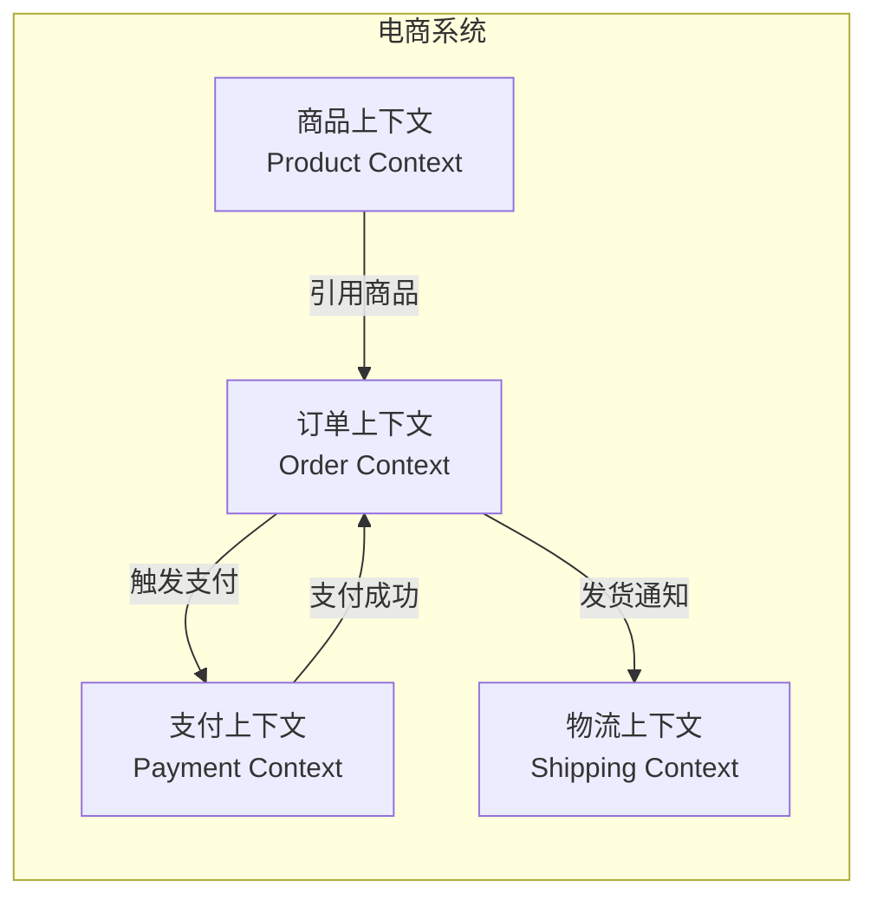
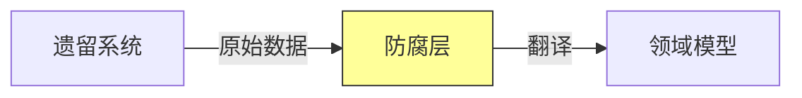
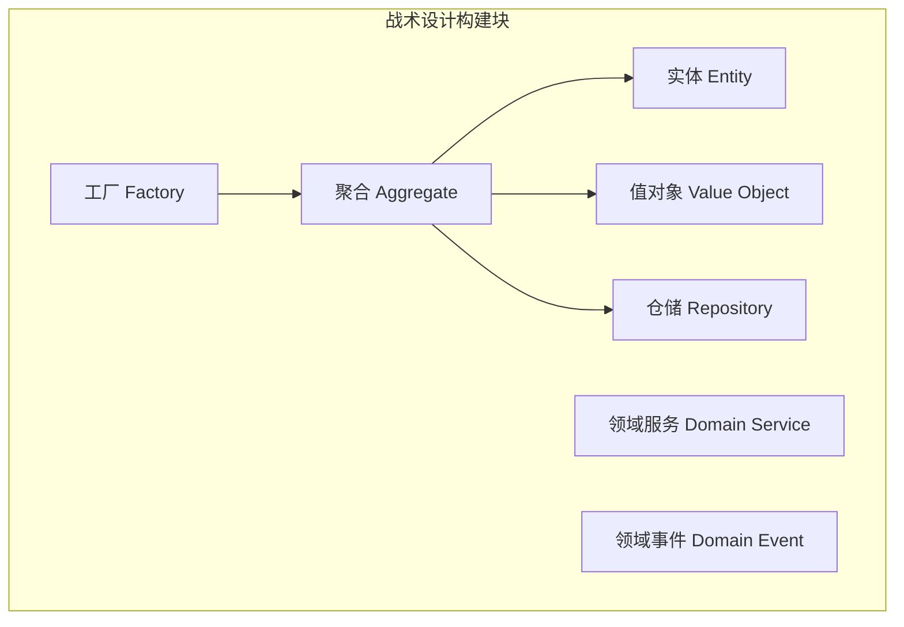
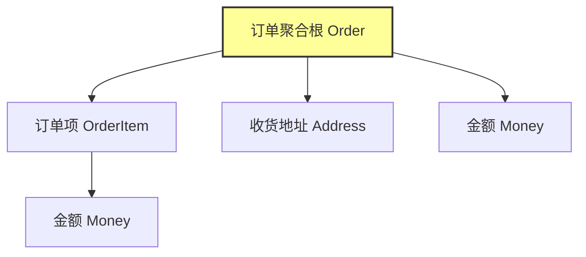
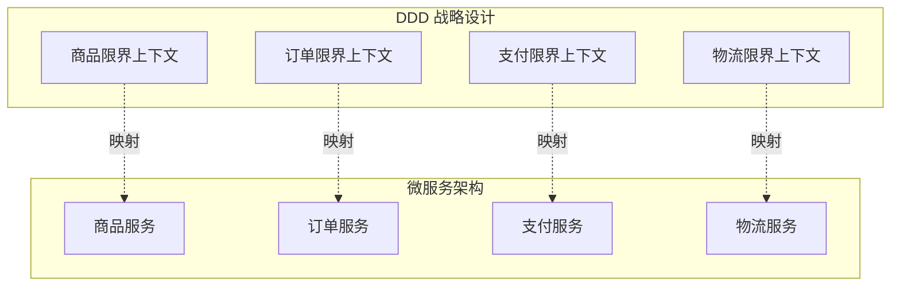

# DDD 领域驱动设计详解

> 从战略设计到战术设计，构建复杂业务系统的核心方法论

---

## 📋 目录

- [1. DDD 概述](#1-ddd-概述)
- [2. 战略设计](#2-战略设计)
- [3. 战术设计](#3-战术设计)
- [4. DDD 与微服务架构的关系](#4-ddd-与微服务架构的关系)
- [5. Spring Boot + DDD 代码示例](#5-spring-boot--ddd-代码示例)
- [6. 落地实践与常见误区](#6-落地实践与常见误区)
- [7. 面试要点](#7-面试要点)

---

## 🎯 学习目标

通过本文档，你将掌握：
- ✅ DDD 的核心思想与解决的问题
- ✅ 战略设计：限界上下文、上下文映射
- ✅ 战术设计：实体、值对象、聚合、领域服务、领域事件
- ✅ DDD 与微服务架构的对应关系
- ✅ Spring Boot 项目中落地 DDD 的代码结构
- ✅ 面试高频考点与实战经验

---

## 1. DDD 概述

### 1.1 什么是 DDD

**领域驱动设计（Domain-Driven Design，DDD）** 是由 Eric Evans 在 2003 年同名著作中提出的一套软件设计方法论，其核心思想是：**以业务领域为核心，通过建立统一的领域模型来驱动软件设计与实现**。

### 1.2 为什么需要 DDD

传统开发模式的核心痛点：

```
传统贫血模型开发的问题：

┌──────────────────────────────────────────────┐
│  Controller → Service → DAO → Database       │
│                                              │
│  问题：                                       │
│  1. 业务逻辑散落在 Service 中，难以理解        │
│  2. 领域知识没有被显式建模                     │
│  3. 随着业务复杂度增加，Service 膨胀成"大泥球" │
│  4. 修改一个功能需要改动多层代码               │
│  5. 业务专家与开发人员使用不同语言，沟通成本高  │
└──────────────────────────────────────────────┘
```

DDD 的核心价值：

| 价值 | 说明 |
|------|------|
| **统一语言** | 业务专家与开发人员使用同一套领域语言 |
| **业务聚焦** | 将复杂业务逻辑沉淀到领域模型中 |
| **边界清晰** | 通过限界上下文划分系统边界 |
| **可维护性** | 模型与代码一致，易于演进 |
| **可测试性** | 领域逻辑独立于基础设施，易于单元测试 |

### 1.3 DDD 的两大设计阶段

```
┌─────────────────────────────────────────────┐
│              领域驱动设计                     │
├──────────────────┬──────────────────────────┤
│   战略设计        │      战术设计             │
├──────────────────┼──────────────────────────┤
│ - 限界上下文      │ - 实体 (Entity)           │
│ - 上下文映射      │ - 值对象 (Value Object)   │
│ - 子域划分        │ - 聚合 (Aggregate)        │
│ - 通用语言        │ - 领域服务 (Domain Service)│
│                  │ - 领域事件 (Domain Event)  │
│                  │ - 仓储 (Repository)        │
│                  │ - 工厂 (Factory)           │
└──────────────────┴──────────────────────────┘
```

---

## 2. 战略设计

### 2.1 领域与子域

**领域（Domain）** 指业务系统所解决的问题空间。一个大型业务领域通常被拆分为多个**子域（Subdomain）**：

| 子域类型 | 说明 | 示例 |
|---------|------|------|
| **核心域** | 业务核心竞争力，需投入最优资源 | 电商的交易、推荐系统 |
| **支撑域** | 支撑核心业务，非核心竞争力 | 物流跟踪、库存管理 |
| **通用域** | 通用功能，可采购成熟方案 | 认证、权限、消息通知 |

### 2.2 限界上下文（Bounded Context）

限界上下文是 DDD 战略设计最核心的概念，它定义了**模型的适用边界**。



**关键理解：同一个概念在不同上下文中含义不同**

```
"商品" 在不同上下文中的含义：

商品上下文：商品名称、类目、规格、详情 → 完整商品模型
订单上下文：商品ID、商品名称、购买数量、单价 → 快照商品
物流上下文：商品重量、体积、是否易碎 → 物流属性
支付上下文：商品金额、分账规则 → 结算属性
```

### 2.3 上下文映射（Context Mapping）

上下文映射描述限界上下文之间的协作关系：

| 映射模式 | 说明 | 示例 |
|---------|------|------|
| **合作关系** | 两个团队紧密协作 | 新业务联合开发 |
| **共享内核** | 共享部分模型代码 | 共享用户基础模型 |
| **客户-供应商** | 上游供应，下游消费 | 商品服务供订单服务调用 |
| **遵奉者** | 下游完全服从上游模型 | 订单遵循支付模型 |
| **防腐层（ACL）** | 下游做模型翻译，隔离上游变化 | 集成遗留系统 |
| **开放主机服务（OHS）** | 上游提供标准 API | 商品服务对外 REST API |
| **发布语言（PL）** | 公开的协议格式 | OpenAPI、Protobuf |

**防腐层（Anti-Corruption Layer）是最常用的模式**：



---

## 3. 战术设计

### 3.1 战术设计构建块总览



### 3.2 实体（Entity）

**实体**有唯一标识，即使其他属性相同也是不同对象。

```java
/**
 * 订单实体 —— 有唯一标识 orderId
 */
public class Order {
    private OrderId orderId;       // 唯一标识（值对象）
    private CustomerId customerId;
    private List<OrderItem> items;
    private OrderStatus status;
    private Money totalAmount;
    
    // 实体的行为应该封装在内部，而不是被外部直接修改
    public void addItem(ProductId productId, int quantity, Money price) {
        if (status != OrderStatus.CREATED && status != OrderStatus.PENDING) {
            throw new IllegalStateException("订单状态不允许添加商品");
        }
        OrderItem item = new OrderItem(productId, quantity, price);
        this.items.add(item);
        recalculateTotal();
    }
    
    public void submit() {
        if (items.isEmpty()) {
            throw new IllegalStateException("订单不能为空");
        }
        this.status = OrderStatus.SUBMITTED;
        // 发布领域事件
        DomainEvents.publish(new OrderSubmittedEvent(this.orderId, this.totalAmount));
    }
    
    private void recalculateTotal() {
        this.totalAmount = items.stream()
            .map(OrderItem::getSubTotal)
            .reduce(Money.ZERO, Money::add);
    }
}
```

### 3.3 值对象（Value Object）

**值对象**没有唯一标识，由其属性值决定相等性，且不可变。

```java
/**
 * 金额值对象 —— 不可变，由 amount 和 currency 共同决定相等性
 */
public final class Money {
    private final BigDecimal amount;
    private final String currency;
    
    public Money(BigDecimal amount, String currency) {
        if (amount == null || amount.compareTo(BigDecimal.ZERO) < 0) {
            throw new IllegalArgumentException("金额不能为负");
        }
        if (currency == null || currency.trim().isEmpty()) {
            throw new IllegalArgumentException("币种不能为空");
        }
        this.amount = amount.setScale(2, RoundingMode.HALF_UP);
        this.currency = currency;
    }
    
    public static final Money ZERO = new Money(BigDecimal.ZERO, "CNY");
    
    public Money add(Money other) {
        requireSameCurrency(other);
        return new Money(this.amount.add(other.amount), this.currency);
    }
    
    public Money multiply(int quantity) {
        return new Money(this.amount.multiply(BigDecimal.valueOf(quantity)), this.currency);
    }
    
    // 值对象基于属性判断相等
    @Override
    public boolean equals(Object o) {
        if (this == o) return true;
        if (!(o instanceof Money)) return false;
        Money money = (Money) o;
        return amount.equals(money.amount) && currency.equals(money.currency);
    }
    
    @Override
    public int hashCode() {
        return Objects.hash(amount, currency);
    }
}
```

**实体 vs 值对象**：

| 维度 | 实体 | 值对象 |
|------|------|-------|
| 唯一标识 | 有 | 无 |
| 可变性 | 可变 | 不可变 |
| 相等性 | 标识相等 | 属性相等 |
| 生命周期 | 独立生命周期 | 依附于实体 |
| 示例 | 订单、用户 | 金额、地址 |

### 3.4 聚合（Aggregate）

**聚合**是一组相关对象的集合，作为数据修改和一致性的基本单元。每个聚合有一个**聚合根（Aggregate Root）**，外部只能通过聚合根访问聚合内部对象。



**聚合设计原则**：
1. 尽量设计小聚合（保证一致性边界小）
2. 聚合之间通过 ID 引用，而非对象引用
3. 一个事务只修改一个聚合
4. 跨聚合一致性通过领域事件实现最终一致

```java
/**
 * 订单聚合根 —— 一致性边界
 */
public class Order {  // 聚合根
    private OrderId orderId;
    private CustomerId customerId;  // 引用其他聚合的 ID
    private List<OrderItem> items;  // 聚合内部实体
    private Address shippingAddress; // 聚合内部值对象
    private OrderStatus status;
    
    // 聚合内部对象不能直接暴露，避免外部破坏一致性
    public List<OrderItem> getItems() {
        return Collections.unmodifiableList(items);
    }
    
    // 所有修改操作都必须经过聚合根
    public void cancel(String reason) {
        if (status == OrderStatus.SHIPPED || status == OrderStatus.COMPLETED) {
            throw new IllegalStateException("已发货订单不可取消");
        }
        this.status = OrderStatus.CANCELLED;
        DomainEvents.publish(new OrderCancelledEvent(orderId, reason));
    }
}
```

### 3.5 领域服务（Domain Service）

**领域服务**用于封装不属于任何单一实体的领域逻辑。

```java
/**
 * 转账领域服务 —— 跨账户逻辑，不属于单个 Account 实体
 */
public class TransferService {
    
    private final AccountRepository accountRepository;
    
    public TransferService(AccountRepository accountRepository) {
        this.accountRepository = accountRepository;
    }
    
    @Transactional
    public void transfer(AccountId fromId, AccountId toId, Money amount) {
        Account from = accountRepository.findById(fromId)
            .orElseThrow(() -> new AccountNotFoundException(fromId));
        Account to = accountRepository.findById(toId)
            .orElseThrow(() -> new AccountNotFoundException(toId));
        
        from.withdraw(amount);   // 实体行为
        to.deposit(amount);      // 实体行为
        
        accountRepository.save(from);
        accountRepository.save(to);
        
        DomainEvents.publish(new MoneyTransferredEvent(fromId, toId, amount));
    }
}
```

> 注意：领域服务 ≠ 应用服务。应用服务编排流程（事务、安全、调用领域服务），领域服务承载纯领域逻辑。

### 3.6 领域事件（Domain Event）

**领域事件**表示领域中发生的有意义的事情，用于解耦聚合之间的协作。

```java
/**
 * 领域事件：订单已提交
 */
public record OrderSubmittedEvent(
    OrderId orderId,
    CustomerId customerId,
    Money totalAmount,
    Instant occurredOn
) implements DomainEvent {
    @Override
    public Instant occurredOn() { return occurredOn; }
}

/**
 * 事件处理器：库存扣减
 */
@Component
public class InventoryEventHandler {
    
    @EventListener
    @Async
    public void onOrderSubmitted(OrderSubmittedEvent event) {
        // 扣减库存、发送通知等
        inventoryService.deductStock(event.orderId());
    }
}
```

### 3.7 仓储（Repository）

**仓储**为聚合根提供持久化抽象，让领域层不感知存储细节。

```java
/**
 * 仓储接口定义在领域层
 */
public interface OrderRepository {
    Order findById(OrderId id);
    void save(Order order);
    List<Order> findByCustomerId(CustomerId customerId);
}

/**
 * 实现放在基础设施层
 */
@Repository
public class JpaOrderRepository implements OrderRepository {
    
    private final OrderJpaRepository jpaRepository;
    private final OrderMapper mapper;
    
    @Override
    public Order findById(OrderId id) {
        return jpaRepository.findById(id.value())
            .map(mapper::toDomain)
            .orElseThrow(() -> new OrderNotFoundException(id));
    }
    
    @Override
    public void save(Order order) {
        OrderPO po = mapper.toPO(order);
        jpaRepository.save(po);
    }
}
```

---

## 4. DDD 与微服务架构的关系

### 4.1 限界上下文 = 微服务边界

DDD 的限界上下文是划分微服务边界的天然依据：



### 4.2 DDD 分层架构与微服务

```
┌─────────────────────────────────────────────┐
│           用户接口层 (Interface)              │
│   Controller / DTO / Assembler              │
├─────────────────────────────────────────────┤
│           应用层 (Application)               │
│   ApplicationService / CommandHandler        │
│   事务编排、安全、调用领域服务                 │
├─────────────────────────────────────────────┤
│           领域层 (Domain)                    │
│   Entity / ValueObject / Aggregate          │
│   DomainService / DomainEvent / Repository  │
│   ★ 核心业务逻辑，不依赖任何技术框架          │
├─────────────────────────────────────────────┤
│           基础设施层 (Infrastructure)         │
│   Repository实现 / MQ / Cache / 第三方       │
└─────────────────────────────────────────────┘
```

### 4.3 上下文映射模式对应微服务集成方式

| DDD 映射模式 | 微服务实现方式 |
|-------------|--------------|
| 防腐层 ACL | 适配器、翻译层，隔离第三方服务 |
| 开放主机服务 OHS | REST API、gRPC、GraphQL |
| 发布语言 PL | OpenAPI Spec、Protobuf |
| 共享内核 | 共享库（谨慎使用） |

---

## 5. Spring Boot + DDD 代码示例

### 5.1 推荐的工程目录结构

```
order-service/
├── src/main/java/com/example/order/
│   ├── interfaces/          # 用户接口层
│   │   ├── rest/
│   │   │   ├── OrderController.java
│   │   │   └── dto/
│   │   │       ├── CreateOrderRequest.java
│   │   │       └── OrderResponse.java
│   │   └── assembler/
│   │       └── OrderAssembler.java
│   ├── application/         # 应用层
│   │   ├── service/
│   │   │   └── OrderApplicationService.java
│   │   ├── command/
│   │   │   └── CreateOrderCommand.java
│   │   └── query/
│   │       └── OrderQueryService.java
│   ├── domain/              # 领域层（核心）
│   │   ├── model/           # 聚合
│   │   │   ├── Order.java
│   │   │   ├── OrderItem.java
│   │   │   └── OrderStatus.java
│   │   ├── event/           # 领域事件
│   │   │   ├── OrderSubmittedEvent.java
│   │   │   └── OrderCancelledEvent.java
│   │   ├── service/         # 领域服务
│   │   │   └── OrderDomainService.java
│   │   └── repository/      # 仓储接口
│   │       └── OrderRepository.java
│   └── infrastructure/      # 基础设施层
│       ├── persistence/
│       │   ├── JpaOrderRepository.java
│       │   ├── po/
│       │   │   └── OrderPO.java
│       │   └── mapper/
│       │       └── OrderMapper.java
│       ├── mq/
│       │   └── RocketMQEventPublisher.java
│       └── config/
│           └── RedisConfig.java
```

### 5.2 完整代码示例

**领域层 - 聚合根与值对象**：

```java
// 领域层：订单聚合根
public class Order {
    private final OrderId id;
    private final CustomerId customerId;
    private final List<OrderItem> items = new ArrayList<>();
    private OrderStatus status;
    private Money totalAmount;
    private final Instant createdAt;
    
    // 工厂方法保证聚合创建时的不变量
    public static Order create(CustomerId customerId) {
        Order order = new Order(OrderId.next(), customerId);
        order.status = OrderStatus.CREATED;
        order.totalAmount = Money.ZERO;
        order.createdAt = Instant.now();
        return order;
    }
    
    public void addItem(ProductId productId, String productName, 
                        int quantity, Money unitPrice) {
        ensureEditable();
        OrderItem item = OrderItem.create(productId, productName, quantity, unitPrice);
        this.items.add(item);
        recalculate();
    }
    
    public void submit() {
        ensureEditable();
        if (items.isEmpty()) {
            throw new DomainException("订单不能为空");
        }
        this.status = OrderStatus.SUBMITTED;
        DomainEventPublisher.publish(new OrderSubmittedEvent(id, customerId, totalAmount));
    }
    
    private void ensureEditable() {
        if (status != OrderStatus.CREATED) {
            throw new DomainException("当前状态不允许修改: " + status);
        }
    }
    
    private void recalculate() {
        this.totalAmount = items.stream()
            .map(OrderItem::subTotal)
            .reduce(Money.ZERO, Money::add);
    }
}

// 领域层：仓储接口
public interface OrderRepository {
    Order findById(OrderId id);
    void save(Order order);
}
```

**应用层 - 编排领域逻辑**：

```java
@Service
@Transactional
public class OrderApplicationService {
    
    private final OrderRepository orderRepository;
    private final CustomerRepository customerRepository;
    
    public OrderApplicationService(OrderRepository orderRepository,
                                    CustomerRepository customerRepository) {
        this.orderRepository = orderRepository;
        this.customerRepository = customerRepository;
    }
    
    public OrderResponse createOrder(CreateOrderCommand cmd) {
        // 校验客户存在
        customerRepository.findById(cmd.customerId())
            .orElseThrow(() -> new BizException("客户不存在"));
        
        // 创建聚合根
        Order order = Order.create(cmd.customerId());
        
        // 添加订单项
        for (CreateOrderCommand.Item item : cmd.items()) {
            order.addItem(item.productId(), item.productName(),
                          item.quantity(), new Money(item.price(), "CNY"));
        }
        
        // 提交订单
        order.submit();
        
        // 持久化
        orderRepository.save(order);
        
        return OrderResponse.from(order);
    }
}
```

**接口层 - Controller**：

```java
@RestController
@RequestMapping("/api/orders")
public class OrderController {
    
    private final OrderApplicationService orderService;
    
    @PostMapping
    public ResponseEntity<OrderResponse> create(@RequestBody CreateOrderRequest request) {
        CreateOrderCommand cmd = request.toCommand();
        OrderResponse response = orderService.createOrder(cmd);
        return ResponseEntity.status(HttpStatus.CREATED).body(response);
    }
    
    @GetMapping("/{id}")
    public OrderResponse get(@PathVariable String id) {
        return orderService.getOrder(new OrderId(id));
    }
}
```

### 5.3 充血模型 vs 贫血模型

```
贫血模型（传统）：
Order 类只有 getter/setter，业务逻辑全在 OrderService 中
→ 业务逻辑分散，模型只是数据载体

充血模型（DDD）：
Order 类封装业务行为（addItem / submit / cancel）
→ 业务逻辑内聚，模型表达业务语义
```

---

## 6. 落地实践与常见误区

### 6.1 何时该用 DDD

| 场景 | 是否推荐 DDD |
|------|-------------|
| 业务逻辑复杂的系统（金融、电商核心） | ✅ 推荐 |
| 业务规则简单、CRUD 为主 | ❌ 不推荐，过度设计 |
| 需要长期演进的大型系统 | ✅ 推荐 |
| 短期项目或 MVP | ❌ 不推荐 |

### 6.2 常见误区

1. **把 Service 当领域服务**：应用服务（编排）和领域服务（纯领域逻辑）混淆
2. **聚合设计过大**：把整个业务流程塞进一个聚合，导致性能与并发问题
3. **跨聚合强一致**：试图在一个事务中修改多个聚合，违背聚合设计原则
4. **忽视值对象**：全部用基本类型，丢失领域语义
5. **领域层依赖框架**：在 Entity 上加 `@Entity` `@Table` 注解，污染领域模型

### 6.3 渐进式引入 DDD

```
建议路径：
1. 先在核心域试点（如订单、交易）
2. 引入值对象和聚合根概念
3. 抽离领域服务与领域事件
4. 完整分层架构落地
5. 推广到其他子域
```

---

## 7. 面试要点

### 7.1 高频问题

1. **DDD 的核心思想是什么？解决什么问题？**
   - 以领域为核心驱动设计，通过统一语言和领域模型应对复杂业务
   - 解决传统贫血模型业务逻辑分散、维护困难的问题

2. **实体和值对象的区别？**
   - 实体有唯一标识、可变；值对象无标识、不可变、由属性决定相等性

3. **聚合和聚合根是什么？为什么需要聚合？**
   - 聚合是一致性边界，聚合根是唯一入口
   - 保证业务不变量，简化并发控制

4. **聚合设计原则有哪些？**
   - 尽量小、跨聚合用 ID 引用、一个事务一个聚合、跨聚合用最终一致

5. **限界上下文有什么作用？如何划分？**
   - 定义模型边界，同一概念在不同上下文含义不同
   - 按业务能力、团队组织、语言边界划分

6. **DDD 与微服务的关系？**
   - 限界上下文是微服务边界的天然依据
   - DDD 提供业务建模，微服务提供技术落地

7. **领域服务和应用服务的区别？**
   - 领域服务承载纯领域逻辑，应用服务负责编排、事务、安全

8. **防腐层（ACL）解决什么问题？**
   - 隔离外部系统模型变化，保护本地领域模型不被"腐蚀"

### 7.2 实战题

**Q：电商系统下单时需要扣减库存，订单和库存是两个聚合，如何保证一致性？**

答：采用最终一致性方案。订单聚合提交后发布 `OrderSubmittedEvent`，库存服务消费事件扣减库存；若扣减失败发布 `InventoryDeductFailedEvent`，订单服务消费后取消订单并退款。强一致场景可用 Saga 模式编排。

### 7.3 学习路径建议

```
入门：《领域驱动设计》Eric Evans 原著
进阶：《实现领域驱动设计》Vaughn Vernon
实战：《领域驱动设计精粹》+ 开源项目（如 cola、ddd-by-examples）
```

---

## 📚 相关阅读

- [架构设计与技术选型方法论](./01_架构设计与技术选型方法论.md)
- [微服务设计模式详解](../06_微服务/设计模式/01_微服务设计模式详解.md)
- [事件驱动架构实战](../06_微服务/事件驱动/01_事件驱动架构实战.md)
- [Saga模式与分布式事务实战](../06_微服务/数据一致性/01_Saga模式与分布式事务实战.md)
- [分布式事务详解](../07_分布式系统/02_分布式事务详解.md)
- [Spring Cloud Alibaba全家桶](../06_微服务/核心组件/03_Spring Cloud Alibaba全家桶.md)

---

**文档版本**: v1.0
**最后更新**: 2026-07-06
**关键词**：DDD, 领域驱动设计, 限界上下文, 聚合, 领域事件, 微服务架构, 充血模型
