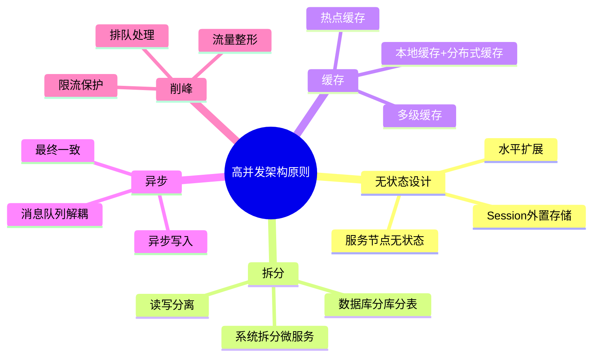
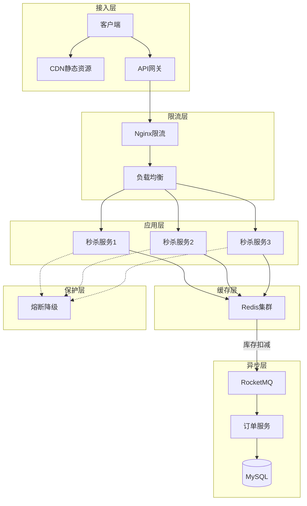
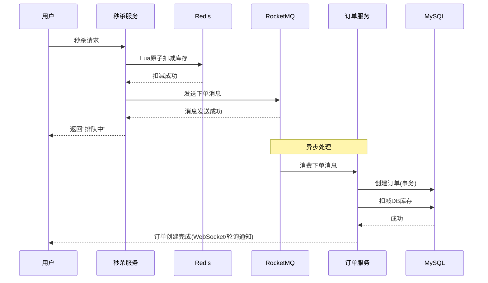
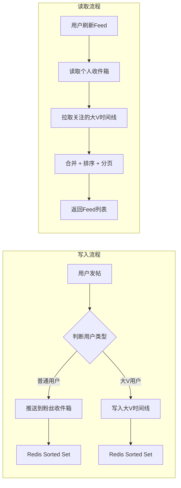
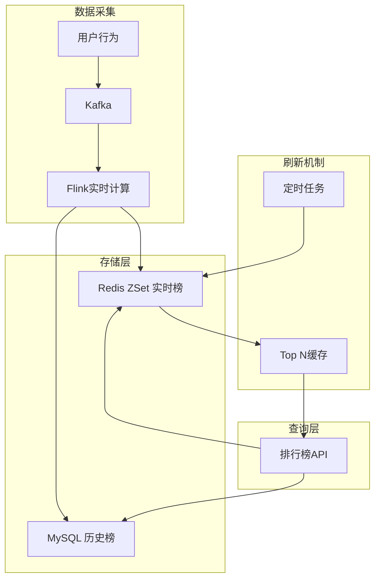
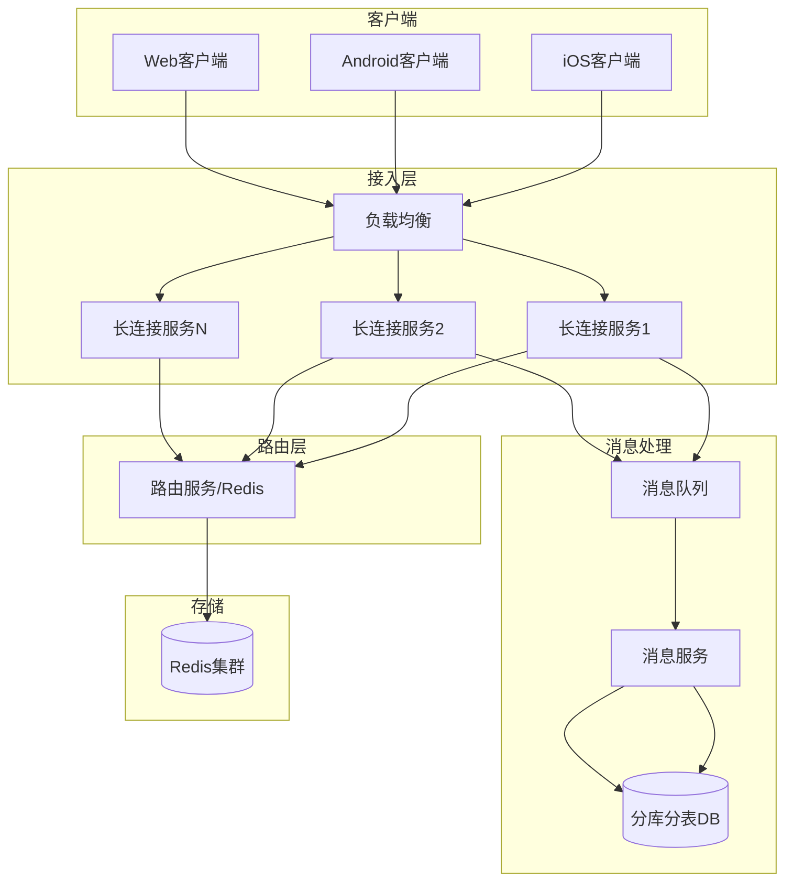
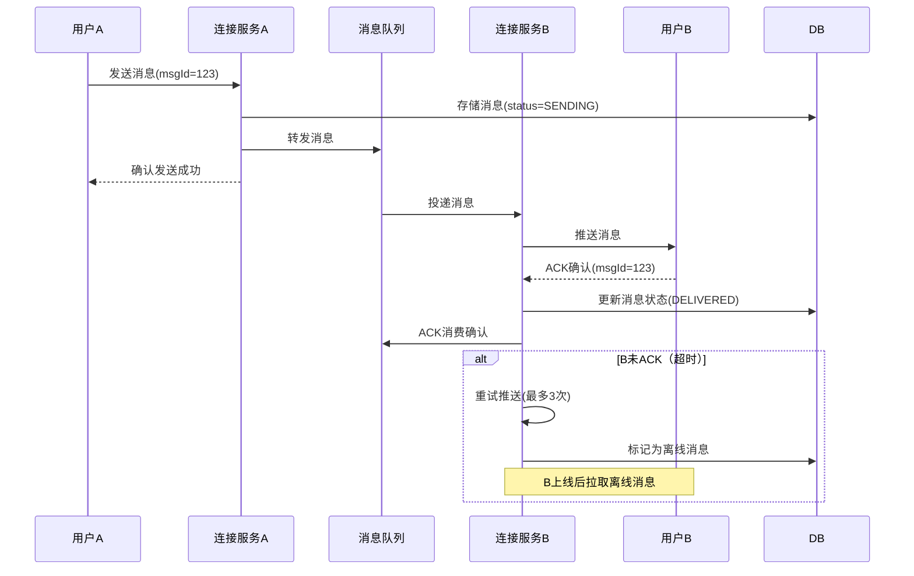
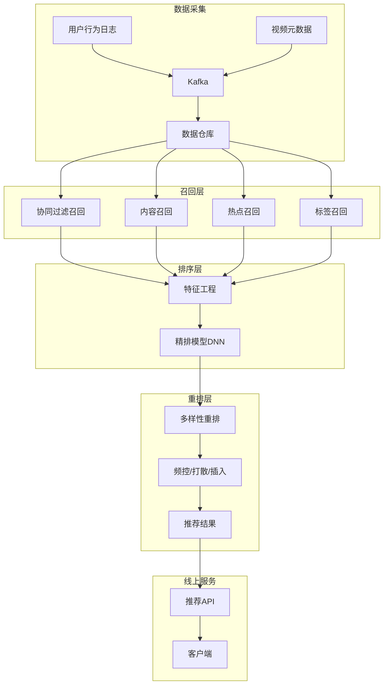
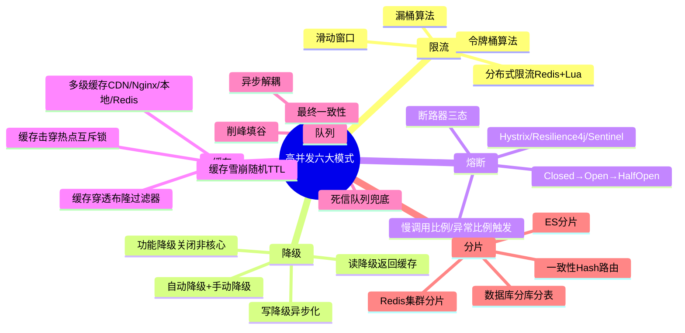

# 高并发架构实战案例

> 从核心指标到五大经典高并发场景（秒杀/Feed流/排行榜/分布式IM/短视频推荐），系统总结限流、降级、熔断、缓存、队列、分片等通用架构模式

---

## 📋 目录

- [1. 高并发核心指标](#1-高并发核心指标)
- [2. 高并发架构原则](#2-高并发架构原则)
- [3. 案例一：秒杀系统架构](#3-案例一秒杀系统架构)
- [4. 案例二：消息Feed流架构](#4-案例二消息feed流架构)
- [5. 案例三：实时排行榜架构](#5-案例三实时排行榜架构)
- [6. 案例四：分布式IM架构](#6-案例四分布式im架构)
- [7. 案例五：短视频推荐架构](#7-案例五短视频推荐架构)
- [8. 通用高并发模式总结](#8-通用高并发模式总结)
- [9. 总结](#9-总结)

---

## 1. 高并发核心指标

### 1.1 核心指标定义

```
┌─────────────────────────────────────────────────────────────┐
│                    高并发核心指标                             │
│                                                             │
│  QPS (Queries Per Second)                                   │
│    每秒查询数 — 衡量系统读请求处理能力                        │
│    例: 电商首页 10万 QPS                                     │
│                                                             │
│  TPS (Transactions Per Second)                              │
│    每秒事务数 — 衡量系统写请求处理能力                        │
│    例: 秒杀下单 5000 TPS                                     │
│                                                             │
│  RT (Response Time)                                         │
│    响应时间 — 从请求发出到收到响应的时间                      │
│    P50: 50%的请求响应时间                                    │
│    P99: 99%的请求响应时间                                    │
│    例: P50 < 50ms, P99 < 200ms                              │
│                                                             │
│  并发数 (Concurrent)                                         │
│    同时在线/同时处理的请求数                                  │
│    并发数 = QPS × RT                                         │
│                                                             │
│  吞吐量 (Throughput)                                        │
│    单位时间内系统处理的数据量或请求量                         │
│    网络吞吐量: Gbps                                          │
│    业务吞吐量: TPS / QPS                                     │
└─────────────────────────────────────────────────────────────┘
```

### 1.2 指标关系与计算

```
Little's Law（利特尔法则）:
  并发数 = 到达率 × 平均响应时间
  L = λ × W

  例: 
    λ = 10000 QPS, W = 0.05s (50ms)
    L = 10000 × 0.05 = 500 并发

性能指标参考标准:

  ┌──────────────┬───────────┬───────────┬───────────┐
  │   指标       │  良好     │  一般     │  差       │
  ├──────────────┼───────────┼───────────┼───────────┤
  │  P50 RT      │  < 50ms   │  < 200ms  │  > 500ms  │
  │  P99 RT      │  < 200ms  │  < 500ms  │  > 1000ms │
  │  可用性      │  99.99%   │  99.9%    │  < 99%    │
  │  错误率      │  < 0.01%  │  < 0.1%   │  > 1%     │
  └──────────────┴───────────┴───────────┴───────────┘
```

### 1.3 容量评估方法

```
容量评估四步法:

  Step 1: 预估总流量
    日PV × 峰值系数 / 86400
    例: 1000万日PV × 5倍峰值 / 86400 ≈ 579 QPS

  Step 2: 预估峰值QPS
    日常QPS × 峰值系数（通常3~10倍）
    例: 579 × 5 = 2895 QPS

  Step 3: 单机容量评估
    压测获取单机最大QPS
    例: 单机 2000 QPS

  Step 4: 机器数量计算
    所需机器数 = 峰值QPS / 单机QPS × 冗余系数(1.5)
    例: 2895 / 2000 × 1.5 ≈ 3台 → 向上取整为4台
```

---

## 2. 高并发架构原则

### 2.1 核心原则



### 2.2 架构演进路径

```
单体架构 → 垂直拆分 → 分布式服务 → 微服务 → 云原生

  单体: 所有功能在一个WAR包
    ↓ QPS瓶颈
  垂直拆分: 按业务拆分为独立应用
    ↓ 数据库瓶颈
  分布式服务: 服务化 + 读写分离 + 分库分表
    ↓ 系统复杂度
  微服务: 服务治理 + 容器化 + 自动扩缩容
    ↓ 弹性需求
  云原生: K8s + Service Mesh + Serverless
```

### 2.3 分层缓存策略

```
请求链路:
  Client → CDN → Nginx缓存 → 应用本地缓存 → Redis → DB

  ┌────────────┬──────────────┬───────────────────┐
  │  缓存层     │  命中率目标   │  典型TTL          │
  ├────────────┼──────────────┼───────────────────┤
  │  CDN       │  90%+        │  小时级           │
  │  Nginx     │  60%+        │  分钟级           │
  │  本地缓存   │  20%+        │  秒级(10-60s)     │
  │  Redis     │  95%+        │  分钟级           │
  │  DB        │  —           │  实时             │
  └────────────┴──────────────┴───────────────────┘
  最终DB命中率: < 1% (99%请求被缓存拦截)
```

---

## 3. 案例一：秒杀系统架构

### 3.1 架构全景



### 3.2 流量削峰

```java
// 多层限流策略

// 1. Nginx层限流 — IP级别
// nginx.conf
// limit_req_zone $binary_remote_addr zone=seckill:10m rate=10r/s;
// limit_req zone=seckill burst=20 nodelay;

// 2. 网关层限流 — 用户级别
@Component
public class GatewayRateLimiter {
    // 每用户每秒最多1次请求
    private final RateLimiter rateLimiter = RateLimiter.create(1);
    
    public boolean tryAcquire(String userId) {
        // Redis + Lua 实现分布式限流
        String key = "rate_limit:seckill:" + userId;
        String luaScript = 
            "local current = redis.call('incr', KEYS[1]) " +
            "if current == 1 then " +
            "    redis.call('expire', KEYS[1], 1) " +
            "end " +
            "return current";
        
        Long count = redisTemplate.execute(
            new DefaultRedisScript<>(luaScript, Long.class),
            Collections.singletonList(key)
        );
        return count != null && count <= 1;
    }
}

// 3. 应用层限流 — 全局限流
@SentinelResource(value = "seckill", blockHandler = "seckillBlockHandler")
public Result doSeckill(Long userId, Long itemId) {
    // 业务逻辑
}
```

### 3.3 库存防超卖

```java
// 方案: Redis + Lua 原子扣减库存

/**
 * Lua脚本 — 原子检查并扣减库存
 */
private static final String DEDUCT_STOCK_LUA = 
    "local stock = tonumber(redis.call('get', KEYS[1])) " +
    "if stock == nil or stock <= 0 then " +
    "    return -1  -- 库存不存在或已售罄 " +
    "end " +
    "local userKey = KEYS[2] .. ':' .. ARGV[1] " +
    "if redis.call('sismember', KEYS[3], ARGV[1]) == 1 then " +
    "    return -2  -- 重复下单 " +
    "end " +
    "redis.call('decr', KEYS[1]) " +
    "redis.call('sadd', KEYS[3], ARGV[1]) " +
    "return 1  -- 扣减成功";

public SeckillResult deductStock(Long itemId, Long userId) {
    String stockKey = "seckill:stock:" + itemId;
    String userKey = "seckill:user:" + itemId;
    String boughtSetKey = "seckill:bought:" + itemId;
    
    Long result = redisTemplate.execute(
        new DefaultRedisScript<>(DEDUCT_STOCK_LUA, Long.class),
        Arrays.asList(stockKey, userKey, boughtSetKey),
        userId.toString()
    );
    
    if (result == -1) return SeckillResult.fail("商品已售罄");
    if (result == -2) return SeckillResult.fail("请勿重复下单");
    
    // 扣减成功，发送MQ异步创建订单
    mqProducer.send("seckill_order_topic", 
        new SeckillOrderMessage(itemId, userId, LocalDateTime.now()));
    
    return SeckillResult.success("抢购成功，订单创建中");
}
```

### 3.4 异步下单流程



```java
// 订单消费者 — 异步创建订单
@RocketMQMessageListener(
    topic = "seckill_order_topic",
    consumerGroup = "order_consumer_group"
)
public class OrderConsumer implements RocketMQListener<SeckillOrderMessage> {
    
    @Override
    @Transactional
    public void onMessage(SeckillOrderMessage message) {
        // 1. 幂等检查
        if (orderMapper.existsByItemIdAndUserId(
                message.getItemId(), message.getUserId())) {
            return; // 已处理，幂等返回
        }
        
        // 2. 创建订单
        Order order = new Order();
        order.setOrderId(IdWorker.getId());
        order.setItemId(message.getItemId());
        order.setUserId(message.getUserId());
        order.setStatus(OrderStatus.CREATED);
        order.setCreateTime(message.getCreateTime());
        orderMapper.insert(order);
        
        // 3. 扣减DB库存
        int rows = itemMapper.deductStock(message.getItemId(), 1);
        if (rows == 0) {
            // DB库存不足，回滚 + Redis回补
            throw new RuntimeException("DB库存扣减失败");
        }
    }
}
```

### 3.5 秒杀架构要点总结

```
✅ 前置拦截
  ├── 静态资源CDN化，减少服务端压力
  ├── 答题/验证码错峰，延缓请求到达
  └── 动态URL隐藏，防止刷单

✅ 流量控制
  ├── Nginx限流（IP维度）
  ├── 网关限流（用户维度）
  ├── 应用层Sentinel熔断降级
  └── 队列削峰填谷

✅ 库存安全
  ├── Redis + Lua原子扣减
  ├── 防重复下单（Set去重）
  └── DB乐观锁兜底

✅ 异步解耦
  ├── MQ异步下单
  ├── 订单状态异步通知
  └── 最终一致性
```

---

## 4. 案例二：消息Feed流架构

### 4.1 Feed流模式对比

```
┌─────────────────────────────────────────────────────────────┐
│                Feed流三种模式对比                             │
│                                                             │
│  推模式（Fan-out on Write）                                  │
│    发布时: 将内容推送到所有粉丝的收件箱                       │
│    优点: 读快（直接读收件箱）                                │
│    缺点: 写慢（大V发帖推送量大），存储膨胀                    │
│    适用: 粉丝数少，读频繁                                    │
│                                                             │
│  拉模式（Fan-out on Read）                                   │
│    读取时: 拉取所有关注人最新内容，排序合并                   │
│    优点: 写快（只存一份），存储省                             │
│    缺点: 读慢（聚合计算量大）                                │
│    适用: 粉丝数多，读不频繁                                  │
│                                                             │
│  推拉结合（Hybrid）                                          │
│    普通用户: 推模式（粉丝少，推送快）                        │
│    大V用户: 拉模式（粉丝多，避免推送风暴）                    │
│    读Feed: 收件箱（推）+ 大V时间线（拉）合并排序              │
│    适用: 混合场景（微博/朋友圈）                             │
└─────────────────────────────────────────────────────────────┘
```

### 4.2 推拉结合架构



### 4.3 核心实现

```java
// 发帖 — 推拉结合
public class FeedService {
    
    private static final int BIG_V_THRESHOLD = 10000;  // 粉丝>1万为大V
    
    // 发帖处理
    public void publishPost(Post post) {
        // 1. 存储帖子原文
        postMapper.insert(post);
        
        // 2. 获取粉丝列表
        List<Long> followerIds = followMapper.getFollowers(post.getUserId());
        
        // 3. 判断是否大V
        if (followerIds.size() > BIG_V_THRESHOLD) {
            // 大V: 只写大V时间线，不推送到粉丝收件箱
            String timelineKey = "timeline:bigv:" + post.getUserId();
            redisTemplate.opsForZSet().add(
                timelineKey, post.getId().toString(), 
                post.getCreateTime().toEpochSecond(ZoneOffset.UTC)
            );
        } else {
            // 普通用户: 推送到所有粉丝收件箱
            String postJson = JSON.toJSONString(post);
            double score = post.getCreateTime().toEpochSecond(ZoneOffset.UTC);
            
            // 批量推送到粉丝收件箱（Pipeline提升性能）
            redisTemplate.executePipelined((RedisCallback<Object>) connection -> {
                for (Long followerId : followerIds) {
                    String inboxKey = "feed:inbox:" + followerId;
                    connection.zAdd(inboxKey.getBytes(), score, 
                        post.getId().toString().getBytes());
                    // 保留最近1000条
                    connection.zRemRangeByRank(inboxKey.getBytes(), 0, -1001);
                }
                return null;
            });
        }
    }
    
    // 读取Feed流
    public List<Post> getFeed(Long userId, long maxScore, int size) {
        Set<String> postIds = new LinkedHashSet<>();
        
        // 1. 读取个人收件箱（推模式数据）
        String inboxKey = "feed:inbox:" + userId;
        Set<Object> inboxPostIds = redisTemplate.opsForZSet()
            .reverseRangeByScore(inboxKey, 0, maxScore, 0, size);
        
        // 2. 获取关注的大V列表
        List<Long> bigVIds = followMapper.getFollowingBigVs(userId);
        
        // 3. 拉取大V时间线（拉模式数据）
        Set<Object> bigvPostIds = new HashSet<>();
        for (Long bigVId : bigVIds) {
            String timelineKey = "timeline:bigv:" + bigVId;
            bigvPostIds.addAll(
                redisTemplate.opsForZSet()
                    .reverseRangeByScore(timelineKey, 0, maxScore, 0, 50)
            );
        }
        
        // 4. 合并排序
        postIds.addAll(inboxPostIds.stream().map(Object::toString)
            .collect(Collectors.toSet()));
        postIds.addAll(bigvPostIds.stream().map(Object::toString)
            .collect(Collectors.toSet()));
        
        // 5. 分页获取
        List<Post> posts = postMapper.selectByIds(
            postIds.stream().limit(size).collect(Collectors.toList())
        );
        
        // 6. 按时间排序
        posts.sort(Comparator.comparing(Post::getCreateTime).reversed());
        
        return posts.stream().limit(size).collect(Collectors.toList());
    }
}
```

### 4.4 收件箱优化

```
Redis Sorted Set 作为收件箱:

  Key:   feed:inbox:{userId}
  Member: postId
  Score:  publishTimestamp

  优化策略:
    ├── 每个收件箱只保留最近1000条
    ├── 超过1000条自动删除最旧的（zRemRangeByRank）
    ├── 使用Pipeline批量推送
    ├── 冷数据落DB，热数据在Redis
    └── 收件箱设置TTL（如7天不活跃自动清理）
```

---

## 5. 案例三：实时排行榜架构

### 5.1 架构设计



### 5.2 Redis ZSet实现排行榜

```java
public class RankingService {
    
    // 更新分数
    public void updateScore(String rankingKey, Long memberId, double score) {
        redisTemplate.opsForZSet().add(rankingKey, memberId.toString(), score);
    }
    
    // 增量更新分数
    public void incrementScore(String rankingKey, Long memberId, double delta) {
        redisTemplate.opsForZSet().incrementScore(rankingKey, memberId.toString(), delta);
    }
    
    // 获取Top N
    public List<RankItem> getTopN(String rankingKey, int n) {
        Set<ZSetOperations.TypedTuple<String>> tuples = 
            redisTemplate.opsForZSet().reverseRangeWithScores(rankingKey, 0, n - 1);
        
        List<RankItem> result = new ArrayList<>();
        int rank = 1;
        for (ZSetOperations.TypedTuple<String> tuple : tuples) {
            RankItem item = new RankItem();
            item.setRank(rank++);
            item.setMemberId(Long.parseLong(tuple.getValue()));
            item.setScore(tuple.getScore());
            result.add(item);
        }
        return result;
    }
    
    // 获取用户排名
    public RankItem getUserRank(String rankingKey, Long memberId) {
        Long rank = redisTemplate.opsForZSet().reverseRank(
            rankingKey, memberId.toString());
        Double score = redisTemplate.opsForZSet().score(
            rankingKey, memberId.toString());
        
        if (rank == null || score == null) {
            return null;
        }
        
        RankItem item = new RankItem();
        item.setRank(rank.intValue() + 1);  // ZSet排名从0开始
        item.setMemberId(memberId);
        item.setScore(score);
        return item;
    }
}
```

### 5.3 多维度排行榜

```java
// 多维度排行榜设计
public class RankingManager {
    
    // 日榜、周榜、月榜、总榜
    private static final String DAILY_RANK = "rank:daily:{date}";
    private static final String WEEKLY_RANK = "rank:weekly:{week}";
    private static final String MONTHLY_RANK = "rank:monthly:{month}";
    private static final String TOTAL_RANK = "rank:total";
    
    // 定时任务: 每日凌晨生成本日榜单
    @Scheduled(cron = "0 0 1 * * ?")
    public void generateDailyRanking() {
        String today = LocalDate.now().format(DateTimeFormatter.ISO_DATE);
        String yesterday = LocalDate.now().minusDays(1)
            .format(DateTimeFormatter.ISO_DATE);
        
        // 方式1: 合并昨日各时段数据
        String destKey = DAILY_RANK.replace("{date}", yesterday);
        String[] hourKeys = IntStream.range(0, 24)
            .mapToObj(h -> "rank:hourly:" + yesterday + ":" + h)
            .toArray(String[]::new);
        
        // ZUNIONSTORE 合并24小时榜为日榜
        redisTemplate.opsForZSet().unionAndStore(
            hourKeys[0], Arrays.asList(Arrays.copyOfRange(hourKeys, 1, 24)), 
            destKey);
        
        // 设置TTL（日榜保留30天）
        redisTemplate.expire(destKey, 30, TimeUnit.DAYS);
    }
    
    // 热更新: 实时维护小时榜
    public void onUserAction(Long userId, String action, int score) {
        String hourKey = "rank:hourly:" + 
            LocalDate.now().format(DateTimeFormatter.ISO_DATE) + ":" +
            LocalTime.now().getHour();
        
        redisTemplate.opsForZSet().incrementScore(hourKey, 
            userId.toString(), score);
        redisTemplate.expire(hourKey, 48, TimeUnit.HOURS);
        
        // 同时更新总榜
        redisTemplate.opsForZSet().incrementScore(TOTAL_RANK, 
            userId.toString(), score);
    }
}
```

### 5.4 排行榜优化策略

```
✅ 性能优化
  ├── Top N结果缓存（本地缓存10秒 + Redis缓存1分钟）
  ├── ZSet数据预热（提前加载到Redis）
  └── 冷热分离（实时榜Redis，历史榜MySQL）

✅ 数据一致性
  ├── Redis为主（实时性），MySQL为辅（持久化）
  ├── 定时同步Redis数据到MySQL
  └── 定时补偿（对比Redis和MySQL，修复差异）

✅ 防刷策略
  ├── 单用户每日积分上限
  ├── 异常行为检测（短时间大量行为）
  └── 积分来源审计
```

---

## 6. 案例四：分布式IM架构

### 6.1 架构全景



### 6.2 长连接管理

```java
// Netty WebSocket长连接服务
@Component
public class IMServer {
    
    // 用户连接表: userId → Channel
    private final ConcurrentHashMap<Long, Channel> userChannels = new ConcurrentHashMap<>();
    
    // 本机连接的userId集合
    private final Set<Long> onlineUsers = ConcurrentHashMap.newKeySet();
    
    public void start() {
        EventLoopGroup bossGroup = new NioEventLoopGroup(2);
        EventLoopGroup workerGroup = new NioEventLoopGroup();
        
        ServerBootstrap bootstrap = new ServerBootstrap();
        bootstrap.group(bossGroup, workerGroup)
            .channel(NioServerSocketChannel.class)
            .childHandler(new ChannelInitializer<SocketChannel>() {
                @Override
                protected void initChannel(SocketChannel ch) {
                    ChannelPipeline pipeline = ch.pipeline();
                    // 心跳检测
                    pipeline.addLast(new IdleStateHandler(60, 30, 0));
                    // 编解码
                    pipeline.addLast(new ProtobufDecoder());
                    pipeline.addLast(new ProtobufEncoder());
                    // 业务处理
                    pipeline.addLast(new IMMessageHandler());
                }
            })
            .option(ChannelOption.SO_BACKLOG, 1024)
            .childOption(ChannelOption.TCP_NODELAY, true)
            .childOption(ChannelOption.SO_KEEPALIVE, true);
        
        bootstrap.bind(8081).sync();
        
        // 注册到路由服务
        registerToRouter();
    }
    
    // 用户上线 — 注册路由
    private void onUserOnline(Long userId, Channel channel) {
        userChannels.put(userId, channel);
        onlineUsers.add(userId);
        
        // 注册到Redis: userId → serverId
        String routeKey = "im:route:" + userId;
        redisTemplate.opsForValue().set(routeKey, getServerId());
        redisTemplate.expire(routeKey, 120, TimeUnit.SECONDS);  // 2分钟心跳续期
    }
    
    // 发送消息
    public void sendMessage(Long fromUserId, Long toUserId, String content) {
        String routeKey = "im:route:" + toUserId;
        String targetServerId = redisTemplate.opsForValue().get(routeKey);
        
        if (targetServerId == null) {
            // 用户离线，存储离线消息
            saveOfflineMessage(toUserId, content);
            return;
        }
        
        if (getServerId().equals(targetServerId)) {
            // 目标用户在本机，直接发送
            Channel channel = userChannels.get(toUserId);
            if (channel != null && channel.isActive()) {
                channel.writeAndFlush(new Message(fromUserId, content));
            }
        } else {
            // 目标用户在其他节点，通过MQ转发
            mqProducer.send("im_message_topic", 
                new MessageRoute(targetServerId, fromUserId, toUserId, content));
        }
    }
}
```

### 6.3 消息分库分表

```java
// IM消息分库分表策略
// 分片键: fromUserId 或 conversationId
// 分片规则: hash(conversationId) % 64
// 单表数据量: 控制在5000万以内

// 分表配置（ShardingSphere）
// actual-data-nodes: ds${0..3}.im_message_${0..15}
// database-strategy: hash_mod(conversation_id, 4)
// table-strategy: hash_mod(conversation_id, 16)

public class MessageRepository {
    
    // 会话ID生成: 小用户ID在前 + 大用户ID在后
    // 保证同一会话的消息路由到同一分片
    public String generateConversationId(Long userIdA, Long userIdB) {
        Long smaller = Math.min(userIdA, userIdB);
        Long larger = Math.max(userIdA, userIdB);
        return smaller + "_" + larger;
    }
    
    // 保存消息
    @ShardingKey("conversationId")
    public void saveMessage(ImMessage message) {
        messageMapper.insert(message);
        // 同时写入发件箱和收件箱
        messageMapper.insertOutbox(message);
        messageMapper.insertInbox(message);
    }
    
    // 分页查询会话消息
    public List<ImMessage> getMessages(String conversationId, 
            Long lastMessageId, int size) {
        return messageMapper.selectByConversation(
            conversationId, lastMessageId, size);
    }
}
```

### 6.4 消息可靠投递



---

## 7. 案例五：短视频推荐架构

### 7.1 推荐系统架构



### 7.2 召回层设计

```java
public class RecommendationService {
    
    // 多路召回
    public List<Video> recommend(Long userId, int size) {
        // 并行多路召回
        CompletableFuture<List<Video>> cfRecall = CompletableFuture.supplyAsync(
            () -> collaborativeFilteringRecall(userId, 200));
        CompletableFuture<List<Video>> contentRecall = CompletableFuture.supplyAsync(
            () -> contentBasedRecall(userId, 200));
        CompletableFuture<List<Video>> hotRecall = CompletableFuture.supplyAsync(
            () -> hotRecall(userId, 100));
        CompletableFuture<List<Video>> tagRecall = CompletableFuture.supplyAsync(
            () -> tagBasedRecall(userId, 200));
        
        // 合并召回结果
        CompletableFuture.allOf(cfRecall, contentRecall, hotRecall, tagRecall).join();
        
        List<Video> candidates = new ArrayList<>();
        candidates.addAll(cfRecall.join());
        candidates.addAll(contentRecall.join());
        candidates.addAll(hotRecall.join());
        candidates.addAll(tagRecall.join());
        
        // 去重
        candidates = candidates.stream()
            .distinct()
            .collect(Collectors.toList());
        
        // 精排
        List<Video> ranked = rankingService.rank(userId, candidates);
        
        // 重排
        return rerank(ranked, size);
    }
    
    // 协同过滤召回
    private List<Video> collaborativeFilteringRecall(Long userId, int n) {
        // 基于用户-视频交互矩阵，找到相似用户喜欢的视频
        // 使用Redis/FAISS加速向量检索
        return recallService.cfRecall(userId, n);
    }
    
    // 内容召回
    private List<Video> contentBasedRecall(Long userId, int n) {
        // 基于用户兴趣画像，召回相似内容
        return recallService.contentRecall(userId, n);
    }
    
    // 热点召回
    private List<Video> hotRecall(Long userId, int n) {
        // 热点视频榜单，补充冷启动
        String hotKey = "video:hot:today";
        Set<Object> hotIds = redisTemplate.opsForZSet()
            .reverseRange(hotKey, 0, n - 1);
        return videoMapper.selectByIds(
            hotIds.stream().map(Object::toString).collect(Collectors.toList()));
    }
}
```

### 7.3 排序层与重排

```java
// 精排 — 基于特征预测点击率
public class RankingService {
    
    public List<Video> rank(Long userId, List<Video> candidates) {
        if (candidates.isEmpty()) return candidates;
        
        // 1. 特征提取
        List<VideoFeatures> features = candidates.stream()
            .map(v -> extractFeatures(userId, v))
            .collect(Collectors.toList());
        
        // 2. 模型预测（调用模型服务）
        List<Double> scores = modelClient.predictBatch(features);
        
        // 3. 按分数排序
        for (int i = 0; i < candidates.size(); i++) {
            candidates.get(i).setScore(scores.get(i));
        }
        
        candidates.sort(Comparator.comparing(Video::getScore).reversed());
        
        return candidates;
    }
    
    private VideoFeatures extractFeatures(Long userId, Video video) {
        VideoFeatures feat = new VideoFeatures();
        // 用户特征
        feat.setUserFeatures(userProfileService.getFeatures(userId));
        // 视频特征
        feat.setVideoFeatures(videoFeatureService.getFeatures(video.getId()));
        // 上下文特征
        feat.setContextFeatures(getContextFeatures());
        // 交叉特征
        feat.setCrossFeatures(computeCrossFeatures(userId, video.getId()));
        return feat;
    }
}

// 重排 — 多样性 + 频控
public List<Video> rerank(List<Video> ranked, int size) {
    List<Video> result = new ArrayList<>();
    Set<String> seenAuthors = new HashSet<>();
    Set<String> seenCategories = new HashSet<>();
    
    for (Video video : ranked) {
        if (result.size() >= size) break;
        
        // 频控: 同一作者最多出现2次
        if (seenAuthors.stream().filter(a -> a.equals(video.getAuthorId()))
                .count() >= 2) continue;
        
        // 打散: 相邻3个不同类目
        if (result.size() >= 2) {
            String lastCat = result.get(result.size() - 1).getCategory();
            String lastCat2 = result.get(result.size() - 2).getCategory();
            if (lastCat.equals(video.getCategory()) && 
                lastCat2.equals(video.getCategory())) continue;
        }
        
        result.add(video);
        seenAuthors.add(video.getAuthorId());
    }
    
    // 插入广告（每5条插入1个广告）
    return insertAds(result);
}
```

### 7.4 推荐架构关键点

```
✅ 召回层
  ├── 多路召回（协同过滤/内容/热点/标签）
  ├── 并行召回提升性能
  ├── 召回数量 500~1000
  └── 快速粗筛（毫秒级）

✅ 排序层
  ├── 特征工程（用户/视频/上下文/交叉特征）
  ├── 精排模型（DNN/DeepFM/DIN）
  ├── 在线预测（模型服务化）
  └── 排序后取Top 50~100

✅ 重排层
  ├── 多样性打散（类目/作者）
  ├── 频控（已看过不推）
  ├── 商业插入（广告/运营）
  └── 最终输出 20~50条

✅ 冷启动
  ├── 新用户: 热点内容 + 注册兴趣
  ├── 新视频: 流量扶持 + 内容分析
  └── 探索与利用平衡（EE算法）
```

---

## 8. 通用高并发模式总结

### 8.1 六大核心模式



### 8.2 模式对比与应用场景

| 模式 | 解决问题 | 典型实现 | 适用场景 |
|------|---------|---------|---------|
| 限流 | 请求过载 | Sentinel/Guava RateLimiter | API网关、秒杀 |
| 降级 | 依赖故障 | Hystrix fallback | 非核心服务降级 |
| 熔断 | 雪崩传播 | Resilience4j/Sentinel | 服务调用链保护 |
| 缓存 | 读性能 | Redis/Caffeine | 热点数据读取 |
| 队列 | 削峰解耦 | RocketMQ/Kafka | 异步写入、流量削峰 |
| 分片 | 数据水平扩展 | ShardingSphere | 海量数据存储 |

### 8.3 组合使用策略

```
高并发系统典型组合:

  秒杀系统:
    限流(Nginx+Sentinel) + 缓存(Redis库存) + 队列(异步下单) + 分片(订单分表)
  
  Feed流系统:
    缓存(Redis ZSet) + 队列(异步推送) + 分片(内容分片存储)
  
  排行榜系统:
    缓存(Redis ZSet) + 限流(查询限流)
  
  IM系统:
    队列(消息异步) + 分片(消息分库分表) + 缓存(在线状态/路由)
  
  推荐系统:
    缓存(召回结果) + 队列(行为日志) + 分片(特征存储)

通用防护链路:
  请求 → 限流 → 熔断 → 降级 → 缓存 → 队列 → 分片 → DB
  
  每一层都是一道防线，层层过滤，确保核心链路稳定
```

---

## 9. 总结

### 9.1 高并发架构核心思想

```
高并发 = 高吞吐 + 低延迟 + 高可用

核心公式:
  性能 = 1 / (1 - 缓存命中率) × 单机性能 × 机器数 × (1 - 故障率)

架构设计三板斧:
  1. 缓存 — 拦截80%+读请求，减少DB压力
  2. 异步 — 非核心链路异步化，缩短响应时间
  3. 分片 — 数据水平拆分，突破单机瓶颈

稳定性三板斧:
  1. 限流 — 控制流量在系统承受范围内
  2. 降级 — 牺牲非核心功能保全核心功能
  3. 熔断 — 快速失败防止级联雪崩

容量规划:
  峰值QPS × 冗余系数(1.5~2) = 系统设计容量
  核心服务多机房部署，确保单机房故障不影响整体
```

### 9.2 架构演进建议

```
阶段1: 日QPS < 1万
  → 单体 + 主从DB + Redis缓存
  → 关注: 快速迭代

阶段2: 日QPS 1万~50万
  → 微服务 + 读写分离 + 分库分表
  → 关注: 服务治理

阶段3: 日QPS 50万~500万
  → 多级缓存 + 异步化 + 消息队列
  → 关注: 性能优化

阶段4: 日QPS > 500万
  → 多机房 + 弹性扩缩容 + Service Mesh
  → 关注: 稳定性与容灾
```
