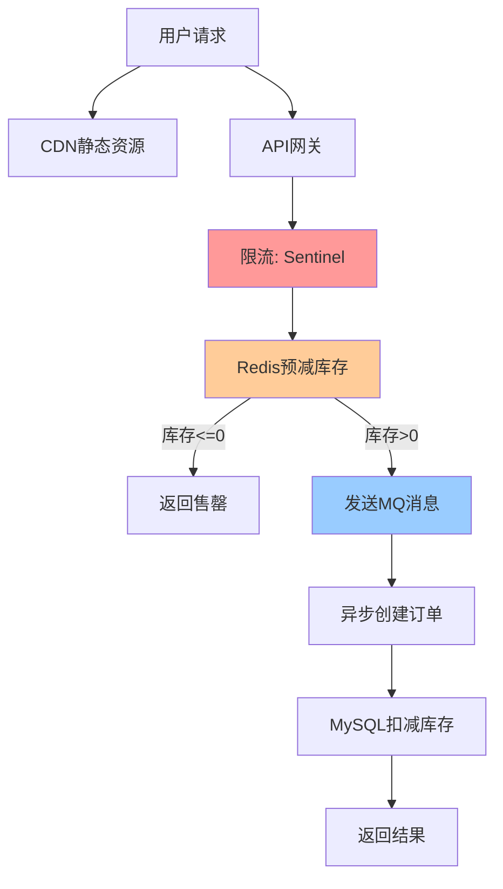
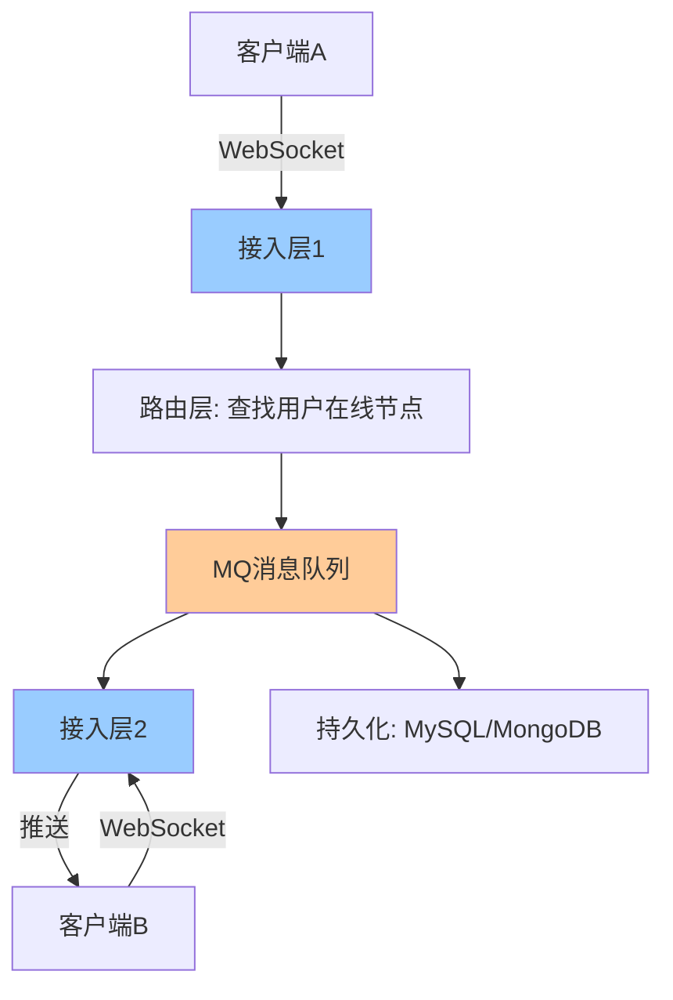

# 高并发架构实战案例

> 从秒杀到推荐Feed流：五大高并发场景架构设计与通用模式总结

---

## 📋 目录

1. [高并发核心指标](#1-高并发核心指标)
2. [高并发架构原则](#2-高并发架构原则)
3. [案例一：秒杀系统](#3-案例一秒杀系统)
4. [案例二：消息Feed流](#4-案例二消息feed流)
5. [案例三：实时排行榜](#5-案例三实时排行榜)
6. [案例四：分布式IM](#6-案例四分布式im)
7. [案例五：短视频推荐](#7-案例五短视频推荐)
8. [通用高并发模式总结](#8-通用高并发模式总结)

---

## 1. 高并发核心指标

| 指标 | 含义 | 高并发标准 |
|------|------|-----------|
| QPS | 每秒请求数 | > 10000 |
| RT | 响应时间 | P99 < 200ms |
| 并发数 | 同时处理请求数 | 根据QPS×RT计算 |
| 吞吐量 | 单位时间处理量 | 越高越好 |
| 可用性 | 系统可用率 | 99.99% |

---

## 2. 高并发架构原则

```
高并发六大原则：
┌─────────────────────────────────────────┐
│ 1. 无状态  — 应用服务无状态，可水平扩展   │
│ 2. 拆分    — 服务拆分、数据拆分、读写分离  │
│ 3. 缓存    — 多级缓存，热点缓存，本地缓存  │
│ 4. 异步    — 消息队列削峰，异步解耦       │
│ 5. 削峰    — 限流、熔断、降级            │
│ 6. 分片    — 数据分片，流量分片          │
└─────────────────────────────────────────┘
```

---

## 3. 案例一：秒杀系统

### 3.1 架构设计



### 3.2 防超卖方案

```java
// 方案1：Redis原子操作（Lua脚本）
private static final String DEDUCT_SCRIPT = 
    "if redis.call('get', KEYS[1]) >= ARGV[1] then " +
    "  return redis.call('decrby', KEYS[1], ARGV[1]) " +
    "else " +
    "  return -1 " +
    "end";

public boolean deductStock(Long productId, int quantity) {
    Long result = redisTemplate.execute(
            new DefaultRedisScript<>(DEDUCT_SCRIPT, Long.class),
            Collections.singletonList("stock:" + productId),
            String.valueOf(quantity));
    return result != null && result >= 0;
}

// 方案2：MySQL乐观锁
@Update("UPDATE product SET stock = stock - #{quantity} " +
        "WHERE id = #{id} AND stock >= #{quantity}")
int deductStock(@Param("id") Long id, @Param("quantity") int quantity);
// 返回影响行数=1成功，=0失败（库存不足）
```

### 3.3 秒杀核心流程

```java
@Service
public class SeckillService {

    @Autowired
    private RedisTemplate<String, String> redisTemplate;
    @Autowired
    private RocketMQTemplate mqTemplate;

    // 1. 活动前预热库存到Redis
    public void preheatStock(Long productId, int stock) {
        redisTemplate.opsForValue().set("stock:" + productId, String.valueOf(stock));
    }

    // 2. 秒杀入口
    @SentinelResource(value = "seckill", blockHandler = "rateLimitHandler")
    public String seckill(Long userId, Long productId) {
        // 2.1 防重复（Redis SETNX）
        Boolean firstTime = redisTemplate.opsForValue()
                .setIfAbsent("seckill:" + userId + ":" + productId, "1", 1, TimeUnit.HOURS);
        if (!firstTime) {
            return "已参与过秒杀";
        }

        // 2.2 预减库存
        Long stock = redisTemplate.execute(new DefaultRedisScript<>(
                "if redis.call('get', KEYS[1]) > '0' then " +
                "  return redis.call('decr', KEYS[1]) " +
                "else return -1 end", Long.class),
                Collections.singletonList("stock:" + productId));
        if (stock == null || stock < 0) {
            return "商品已售罄";
        }

        // 2.3 发送MQ异步创建订单
        SeckillMessage msg = new SeckillMessage(userId, productId);
        mqTemplate.asyncSend("seckill-topic", msg, ...);

        return "秒杀成功，订单创建中";
    }

    // 3. MQ消费者异步创建订单
    @RocketMQMessageListener(topic = "seckill-topic", consumerGroup = "seckill-group")
    public void onSeckillMessage(SeckillMessage msg) {
        try {
            // 数据库扣减库存 + 创建订单
            orderService.createOrder(msg.getUserId(), msg.getProductId());
        } catch (Exception e) {
            // 失败回滚Redis库存
            redisTemplate.opsForValue().increment("stock:" + msg.getProductId());
        }
    }
}
```

---

## 4. 案例二：消息Feed流

### 4.1 三种方案对比

| 方案 | 写入 | 读取 | 适用场景 |
|------|------|------|----------|
| 推模式 | 发帖时推到所有粉丝收件箱 | 直接读收件箱 | 粉丝少（大V不适用） |
| 拉模式 | 只存发帖箱 | 拉取关注人发帖箱合并 | 大V多、实时性要求高 |
| 推拉结合 | 大V用拉，普通用户用推 | 普通用户读收件箱+大V拉取 | 综合最优（微博方案） |

```
推拉结合方案：

  普通用户发帖 → 推到所有粉丝收件箱（粉丝少，推得动）
  大V发帖     → 只写入发帖箱（粉丝百万，推不动）
  
  粉丝刷新Feed：
  1. 读自己的收件箱（普通用户发的帖）
  2. 拉取关注的大V发帖箱
  3. 按时间线合并排序
```

### 4.2 Redis实现

```java
// 收件箱：Redis Sorted Set（按时间戳排序）
public void pushFeed(Long userId, Post post) {
    String inboxKey = "feed:inbox:" + userId;
    redisTemplate.opsForZSet().add(inboxKey, 
            JSON.toJSONString(post), post.getCreateTime());
    
    // 限制收件箱大小（只保留最新1000条）
    redisTemplate.opsForZSet().removeRange(inboxKey, 0, -1001);
}

// 拉取Feed
public List<Post> getFeed(Long userId, long maxTime, int count) {
    // 1. 读收件箱
    Set<ZSetOperations.TypedTuple<String>> inbox = 
            redisTemplate.opsForZSet().reverseRangeByScoreWithScores(
                    "feed:inbox:" + userId, 0, maxTime, 0, count);

    // 2. 拉取关注的大V发帖箱
    Set<Long> bigVIds = getFollowingBigV(userId);
    for (Long bigVId : bigVIds) {
        Set<ZSetOperations.TypedTuple<String>> outbox = 
                redisTemplate.opsForZSet().reverseRangeByScoreWithScores(
                        "feed:outbox:" + bigVId, 0, maxTime, 0, count);
        inbox.addAll(outbox);
    }

    // 3. 合并排序取Top N
    return inbox.stream()
            .sorted((a, b) -> Long.compare(b.getScore(), a.getScore()))
            .limit(count)
            .map(t -> JSON.parseObject(t.getValue(), Post.class))
            .collect(Collectors.toList());
}
```

---

## 5. 案例三：实时排行榜

### 5.1 Redis ZSet方案

```java
@Service
public class RankingService {

    @Autowired
    private RedisTemplate<String, String> redisTemplate;

    // 更新分数
    public void updateScore(String rankKey, Long userId, double score) {
        redisTemplate.opsForZSet().add(rankKey, userId.toString(), score);
    }

    // 增加分数
    public void incrementScore(String rankKey, Long userId, double delta) {
        redisTemplate.opsForZSet().incrementScore(rankKey, userId.toString(), delta);
    }

    // 获取Top N
    public List<RankItem> getTopN(String rankKey, int n) {
        Set<ZSetOperations.TypedTuple<String>> set = 
                redisTemplate.opsForZSet().reverseRangeWithScores(rankKey, 0, n - 1);
        List<RankItem> result = new ArrayList<>();
        int rank = 1;
        for (ZSetOperations.TypedTuple<String> tuple : set) {
            result.add(new RankItem(rank++, 
                    Long.parseLong(tuple.getValue()), tuple.getScore()));
        }
        return result;
    }

    // 获取用户排名
    public RankItem getUserRank(String rankKey, Long userId) {
        Long rank = redisTemplate.opsForZSet().reverseRank(rankKey, userId.toString());
        Double score = redisTemplate.opsForZSet().score(rankKey, userId.toString());
        return new RankItem(rank == null ? -1 : rank + 1, userId, 
                score == null ? 0 : score);
    }

    // 分段排行榜（分桶优化，避免大ZSet）
    // 按分数范围分桶：0-1000, 1000-2000, ...
    public void updateScoreBucketed(Long userId, double score) {
        int bucket = (int) (score / 1000);
        String bucketKey = "rank:bucket:" + bucket;
        redisTemplate.opsForZSet().add(bucketKey, userId.toString(), score);
    }
}
```

---

## 6. 案例四：分布式IM

### 6.1 架构设计



### 6.2 核心设计

```
IM系统核心挑战：
├── 连接管理：百万级长连接
│   ├── Netty + WebSocket
│   ├── 连接注册到Redis（userId → serverId）
│   └── 心跳保活
├── 消息投递
│   ├── 在线推送：WebSocket直推
│   ├── 离线推送：消息存库，上线后拉取
│   └── 消息可靠投递（ACK机制）
├── 消息顺序
│   ├── 单聊：同一会话消息路由到同一MQ分区
│   └── 全局序列号（Snowflake）
├── 消息存储
│   ├── 写扩散：存到每人收件箱（小群适用）
│   ├── 读扩散：只存消息表，拉取时合并（大群适用）
│   └── 分库分表：按会话ID分片
└── 群消息优化
    ├── 超大群用读扩散
    ├── 普通群用写扩散
    └── 群消息只推在线成员
```

---

## 7. 案例五：短视频推荐

### 7.1 推荐架构

```
推荐系统三层架构：

  ┌─────────────────────────────────────────┐
  │            召回层                         │
  │  从百万视频中筛选出几千个候选              │
  │  ├── 协同过滤召回                         │
  │  ├── 内容召回（标签/分类）                 │
  │  ├── 热门召回                             │
  │  └── 向量召回（Embedding相似度）           │
  └───────────────┬─────────────────────────┘
                  │ 候选集（~1000个）
  ┌───────────────┴─────────────────────────┐
  │            排序层                         │
  │  对候选视频打分排序                        │
  │  ├── 精排模型（DeepFM/DIN）              │
  │  ├── 特征工程                             │
  │  └── CTR预估（点击率）                    │
  └───────────────┬─────────────────────────┘
                  │ Top 50
  ┌───────────────┴─────────────────────────┐
  │            重排层                         │
  │  多样性/新鲜度/广告插入                    │
  │  ├── 去重（已看过）                       │
  │  ├── 多样性打散                           │
  │  └── 广告混排                             │
  └─────────────────────────────────────────┘
                  │
              最终推荐列表
```

### 7.2 高并发设计

```
推荐系统高并发要点：
├── 召回层并行
│   ├── 多路召回并行执行（CompletableFuture）
│   └── 向量检索用专用引擎（Faiss/Milvus）
├── 特征缓存
│   ├── 用户特征缓存到Redis
│   └── 物品特征预计算+缓存
├── 模型推理优化
│   ├── 批量推理（Batch Inference）
│   ├── 模型量化（FP32→INT8）
│   └── GPU加速
├── 结果缓存
│   ├── 推荐结果缓存5分钟
│   └── 用户维度缓存
└── 降级策略
    ├── 模型超时 → 返回热门列表
    └── 召回失败 → 返回缓存结果
```

---

## 8. 通用高并发模式总结

### 8.1 六大通用模式

```
┌─────────────────────────────────────────────────────┐
│  模式            │  适用场景        │  核心组件       │
├──────────────────┼─────────────────┼────────────────┤
│  限流             │  保护系统不被压垮 │  Sentinel/网关  │
│  降级             │  非核心功能牺牲   │  熔断器/开关     │
│  熔断             │  防止级联故障     │  Hystrix/Sentinel│
│  缓存             │  减少DB压力      │  Redis/Caffeine │
│  队列削峰         │  异步处理突发流量 │  RocketMQ/Kafka │
│  分片             │  水平扩展        │  分库分表/分片   │
└─────────────────────────────────────────────────────┘
```

### 8.2 架构演进路线

```
单体 → 读写分离 → 缓存 → 微服务 → 分库分表 → 消息队列 → 弹性伸缩

各阶段QPS参考：
  单体：          ~1,000 QPS
  +读写分离：     ~3,000 QPS
  +缓存：         ~10,000 QPS
  +微服务：       ~30,000 QPS
  +分库分表：     ~100,000 QPS
  +弹性伸缩：     ~500,000+ QPS
```

---

*最后更新：2026-07-13*
