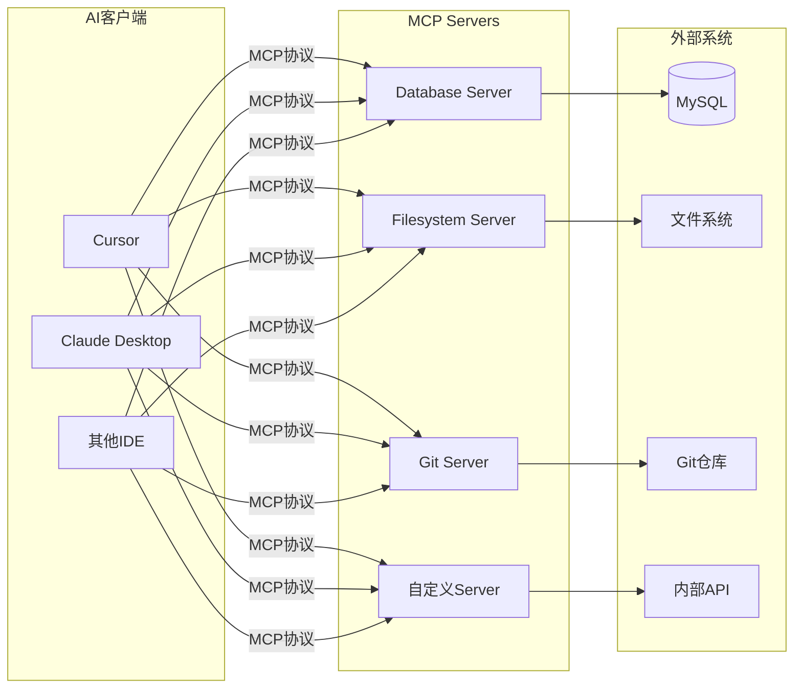
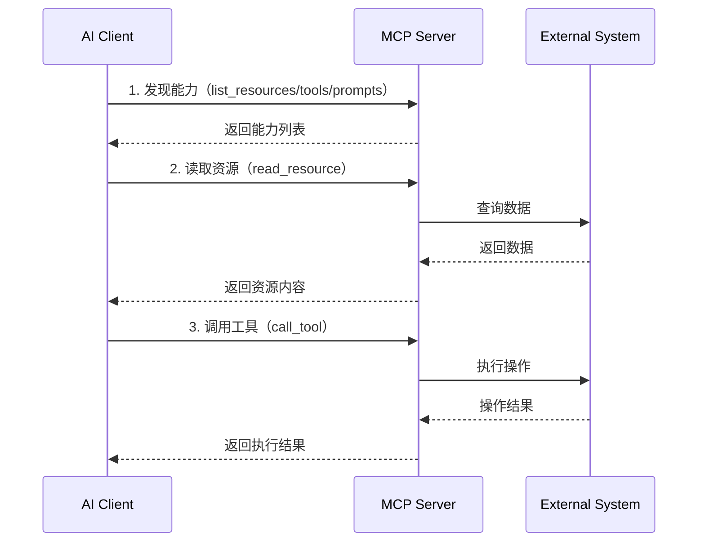

# MCP（Model Context Protocol）核心原理与实战

> 🚀 Claude官方推出的AI与外部系统交互的标准化协议，打通AI应用开发的"最后一公里"

---

## 📖 目录

1. [MCP简介](#1-mcp简介)
2. [核心概念](#2-核心概念)
3. [架构设计](#3-架构设计)
4. [协议详解](#4-协议详解)
5. [MCP Server开发](#5-mcp-server开发)
6. [MCP Client集成](#6-mcp-client集成)
7. [实战案例](#7-实战案例)
8. [最佳实践](#8-最佳实践)
9. [常见问题](#9-常见问题)

---

## 1. MCP简介

### 1.1 什么是MCP？

**MCP（Model Context Protocol）** 是由Anthropic（Claude开发公司）推出的**开放标准协议**，用于：
- **连接AI模型与外部数据源**（数据库、文件系统、API等）
- **赋予AI工具调用能力**（执行命令、操作文件等）
- **标准化AI应用开发**（统一接口、插件化架构）

### 1.2 为什么需要MCP？

#### 传统问题

```
问题1：每个AI应用都要重复开发数据连接
- ChatGPT插件：自己的格式
- Cursor MCP：自己的格式
- LangChain工具：自己的格式
→ 重复造轮子，不兼容

问题2：AI无法访问私有数据
- AI训练数据是公开的
- 企业数据在内网数据库
- 本地文件无法读取
→ AI能力受限

问题3：工具调用标准不统一
- OpenAI Function Calling
- Claude Tool Use
- 各家格式不同
→ 开发成本高
```

#### MCP解决方案

```
✅ 统一标准协议
- 一次开发，到处使用
- MCP Server可以在多个AI客户端复用
- 类似USB接口标准化

✅ 打通数据孤岛
- 连接数据库（MySQL、PostgreSQL）
- 读取文件系统
- 调用内部API
- 访问私有知识库

✅ 插件化架构
- AI客户端（Cursor、Claude Desktop）
- MCP Server（提供能力）
- 松耦合、易扩展
```

### 1.3 MCP生态



**关键点**：
- **AI客户端**：只需实现MCP Client，就能使用所有MCP Server
- **MCP Server**：一次开发，所有支持MCP的AI客户端都能用
- **外部系统**：通过MCP Server暴露能力给AI

---

## 2. 核心概念

### 2.1 MCP三大核心组件

#### ① Resources（资源）

**定义**：AI可以读取的数据源

**特点**：
- **只读**（Read-only）
- 结构化数据
- 可以是文件、数据库记录、API响应等

**示例**：
```typescript
// 文件资源
{
  "uri": "file:///path/to/document.txt",
  "name": "项目文档",
  "mimeType": "text/plain",
  "description": "项目需求文档"
}

// 数据库资源
{
  "uri": "mysql://localhost/users/123",
  "name": "用户信息",
  "mimeType": "application/json",
  "description": "用户ID 123的详细信息"
}
```

**使用场景**：
- 读取本地文件
- 查询数据库记录
- 获取API数据
- 访问知识库

#### ② Prompts（提示词模板）

**定义**：预定义的提示词模板，包含占位符

**特点**：
- 可复用
- 可参数化
- 提高AI响应质量

**示例**：
```typescript
{
  "name": "code_review",
  "description": "代码审查提示词",
  "arguments": [
    {
      "name": "language",
      "description": "编程语言",
      "required": true
    },
    {
      "name": "code",
      "description": "要审查的代码",
      "required": true
    }
  ]
}

// 使用时：
"""
请审查以下{{language}}代码：

{{code}}

重点检查：
1. 代码规范
2. 潜在bug
3. 性能问题
4. 安全隐患
"""
```

**使用场景**：
- 代码审查
- 文档生成
- 数据分析
- 知识问答

#### ③ Tools（工具）

**定义**：AI可以调用的函数/命令

**特点**：
- **可执行**（有副作用）
- 参数化
- 返回结果

**示例**：
```typescript
{
  "name": "create_file",
  "description": "创建文件",
  "inputSchema": {
    "type": "object",
    "properties": {
      "path": {
        "type": "string",
        "description": "文件路径"
      },
      "content": {
        "type": "string",
        "description": "文件内容"
      }
    },
    "required": ["path", "content"]
  }
}

// AI调用：
create_file({
  path: "/tmp/test.txt",
  content: "Hello MCP!"
})
```

**使用场景**：
- 文件操作（创建、修改、删除）
- 执行命令
- 调用API
- 数据库写入

### 2.2 三者对比

| 特性 | Resources | Prompts | Tools |
|------|-----------|---------|-------|
| **作用** | 提供数据 | 提供模板 | 执行操作 |
| **读写** | 只读 | 只读 | 读写 |
| **副作用** | ❌ 无 | ❌ 无 | ✅ 有 |
| **参数化** | URI | 占位符 | 函数参数 |
| **返回值** | 数据内容 | 填充后的提示词 | 执行结果 |
| **示例** | 读取文件 | 代码审查模板 | 创建文件 |

### 2.3 MCP协议栈

```
┌─────────────────────────────────┐
│      AI Application Layer       │  ← Cursor、Claude Desktop
│  (MCP Client SDK Integration)   │
├─────────────────────────────────┤
│      MCP Protocol Layer         │  ← JSON-RPC 2.0消息格式
│  (Request/Response/Notification)│
├─────────────────────────────────┤
│      Transport Layer            │  ← stdio、HTTP、WebSocket
│   (Message Transmission)        │
├─────────────────────────────────┤
│      MCP Server Layer           │  ← 具体实现（Filesystem、DB等）
│  (Resources/Prompts/Tools)      │
└─────────────────────────────────┘
```

**分层说明**：
1. **Application Layer**：AI应用（Cursor、Claude Desktop等）
2. **Protocol Layer**：MCP协议（基于JSON-RPC 2.0）
3. **Transport Layer**：传输层（stdio、HTTP、WebSocket）
4. **Server Layer**：MCP Server实现

---

## 3. 架构设计

### 3.1 整体架构



### 3.2 MCP Client架构

```typescript
class MCPClient {
  // 连接到MCP Server
  async connect(serverConfig: ServerConfig): Promise<void>
  
  // 能力发现
  async listResources(): Promise<Resource[]>
  async listPrompts(): Promise<Prompt[]>
  async listTools(): Promise<Tool[]>
  
  // 资源操作
  async readResource(uri: string): Promise<ResourceContent>
  
  // 提示词操作
  async getPrompt(name: string, args: Record<string, any>): Promise<string>
  
  // 工具调用
  async callTool(name: string, args: Record<string, any>): Promise<ToolResult>
  
  // 断开连接
  async disconnect(): Promise<void>
}
```

### 3.3 MCP Server架构

```typescript
class MCPServer {
  // 注册资源
  registerResource(resource: ResourceDefinition): void
  
  // 注册提示词
  registerPrompt(prompt: PromptDefinition): void
  
  // 注册工具
  registerTool(tool: ToolDefinition): void
  
  // 处理请求
  async handleRequest(request: JSONRPCRequest): Promise<JSONRPCResponse>
  
  // 启动服务器
  async start(): Promise<void>
  
  // 停止服务器
  async stop(): Promise<void>
}
```

---

## 4. 协议详解

### 4.1 JSON-RPC 2.0基础

MCP基于**JSON-RPC 2.0**协议。

#### 请求格式

```json
{
  "jsonrpc": "2.0",
  "id": 1,
  "method": "tools/call",
  "params": {
    "name": "read_file",
    "arguments": {
      "path": "/tmp/test.txt"
    }
  }
}
```

#### 响应格式

```json
{
  "jsonrpc": "2.0",
  "id": 1,
  "result": {
    "content": "Hello MCP!",
    "metadata": {
      "size": 10,
      "mimeType": "text/plain"
    }
  }
}
```

#### 错误响应

```json
{
  "jsonrpc": "2.0",
  "id": 1,
  "error": {
    "code": -32600,
    "message": "Invalid Request",
    "data": {
      "details": "Missing required parameter: path"
    }
  }
}
```

### 4.2 MCP核心方法

#### Resources相关

**1. 列出资源**
```json
// Request
{
  "method": "resources/list",
  "params": {}
}

// Response
{
  "result": {
    "resources": [
      {
        "uri": "file:///project/README.md",
        "name": "README",
        "description": "项目说明文档",
        "mimeType": "text/markdown"
      }
    ]
  }
}
```

**2. 读取资源**
```json
// Request
{
  "method": "resources/read",
  "params": {
    "uri": "file:///project/README.md"
  }
}

// Response
{
  "result": {
    "contents": [
      {
        "uri": "file:///project/README.md",
        "mimeType": "text/markdown",
        "text": "# Project README\n..."
      }
    ]
  }
}
```

#### Prompts相关

**1. 列出提示词**
```json
// Request
{
  "method": "prompts/list",
  "params": {}
}

// Response
{
  "result": {
    "prompts": [
      {
        "name": "code_review",
        "description": "代码审查提示词",
        "arguments": [
          {
            "name": "code",
            "description": "要审查的代码",
            "required": true
          }
        ]
      }
    ]
  }
}
```

**2. 获取提示词**
```json
// Request
{
  "method": "prompts/get",
  "params": {
    "name": "code_review",
    "arguments": {
      "code": "function hello() { console.log('hi') }"
    }
  }
}

// Response
{
  "result": {
    "description": "代码审查提示词",
    "messages": [
      {
        "role": "user",
        "content": {
          "type": "text",
          "text": "请审查以下代码：\nfunction hello() { console.log('hi') }"
        }
      }
    ]
  }
}
```

#### Tools相关

**1. 列出工具**
```json
// Request
{
  "method": "tools/list",
  "params": {}
}

// Response
{
  "result": {
    "tools": [
      {
        "name": "create_file",
        "description": "创建文件",
        "inputSchema": {
          "type": "object",
          "properties": {
            "path": { "type": "string" },
            "content": { "type": "string" }
          },
          "required": ["path", "content"]
        }
      }
    ]
  }
}
```

**2. 调用工具**
```json
// Request
{
  "method": "tools/call",
  "params": {
    "name": "create_file",
    "arguments": {
      "path": "/tmp/hello.txt",
      "content": "Hello MCP!"
    }
  }
}

// Response
{
  "result": {
    "content": [
      {
        "type": "text",
        "text": "文件创建成功：/tmp/hello.txt"
      }
    ]
  }
}
```

### 4.3 传输层

MCP支持多种传输方式：

#### ① stdio传输（最常用）

```json
// MCP Server配置（claude_desktop_config.json）
{
  "mcpServers": {
    "filesystem": {
      "command": "npx",
      "args": ["-y", "@modelcontextprotocol/server-filesystem", "/Users/username"]
    }
  }
}
```

**特点**：
- 简单易用
- 本地通信
- 低延迟
- Cursor、Claude Desktop默认使用

**通信方式**：
```
AI Client ←→ stdin/stdout ←→ MCP Server
```

#### ② HTTP传输

```typescript
// MCP Server配置
{
  "mcpServers": {
    "remote-api": {
      "url": "http://localhost:3000/mcp",
      "headers": {
        "Authorization": "Bearer token123"
      }
    }
  }
}
```

**特点**：
- 远程访问
- 跨网络
- 需要处理认证

#### ③ WebSocket传输

```typescript
{
  "mcpServers": {
    "realtime-data": {
      "url": "ws://localhost:3000/mcp",
      "protocol": "websocket"
    }
  }
}
```

**特点**：
- 双向通信
- 实时推送
- 适合长连接

---

## 5. MCP Server开发

### 5.1 开发环境准备

#### 安装依赖（TypeScript）

```bash
# 创建项目
mkdir my-mcp-server
cd my-mcp-server
npm init -y

# 安装MCP SDK
npm install @modelcontextprotocol/sdk

# 安装TypeScript（如果需要）
npm install -D typescript @types/node
npx tsc --init
```

#### 安装依赖（Python）

```bash
# 创建虚拟环境
python3 -m venv venv
source venv/bin/activate

# 安装MCP SDK
pip install mcp
```

### 5.2 最简单的MCP Server（TypeScript）

```typescript
// src/index.ts
import { Server } from "@modelcontextprotocol/sdk/server/index.js";
import { StdioServerTransport } from "@modelcontextprotocol/sdk/server/stdio.js";
import {
  CallToolRequestSchema,
  ListToolsRequestSchema,
} from "@modelcontextprotocol/sdk/types.js";

// 创建MCP Server
const server = new Server(
  {
    name: "my-first-mcp-server",
    version: "1.0.0",
  },
  {
    capabilities: {
      tools: {},
    },
  }
);

// 注册工具列表处理
server.setRequestHandler(ListToolsRequestSchema, async () => {
  return {
    tools: [
      {
        name: "hello",
        description: "Say hello to someone",
        inputSchema: {
          type: "object",
          properties: {
            name: {
              type: "string",
              description: "Name of the person",
            },
          },
          required: ["name"],
        },
      },
    ],
  };
});

// 注册工具调用处理
server.setRequestHandler(CallToolRequestSchema, async (request) => {
  if (request.params.name === "hello") {
    const name = String(request.params.arguments?.name || "World");
    return {
      content: [
        {
          type: "text",
          text: `Hello, ${name}! Welcome to MCP!`,
        },
      ],
    };
  }
  
  throw new Error(`Unknown tool: ${request.params.name}`);
});

// 启动Server（使用stdio传输）
async function main() {
  const transport = new StdioServerTransport();
  await server.connect(transport);
  console.error("MCP Server running on stdio");
}

main().catch(console.error);
```

### 5.3 文件系统MCP Server（完整示例）

```typescript
// src/filesystem-server.ts
import { Server } from "@modelcontextprotocol/sdk/server/index.js";
import { StdioServerTransport } from "@modelcontextprotocol/sdk/server/stdio.js";
import {
  CallToolRequestSchema,
  ListResourcesRequestSchema,
  ListToolsRequestSchema,
  ReadResourceRequestSchema,
} from "@modelcontextprotocol/sdk/types.js";
import * as fs from "fs/promises";
import * as path from "path";

const ALLOWED_DIRECTORY = process.argv[2] || process.cwd();

const server = new Server(
  {
    name: "filesystem-mcp-server",
    version: "1.0.0",
  },
  {
    capabilities: {
      resources: {},
      tools: {},
    },
  }
);

// ==================== Resources ====================

// 列出资源（列出目录下的所有文件）
server.setRequestHandler(ListResourcesRequestSchema, async () => {
  const files = await fs.readdir(ALLOWED_DIRECTORY);
  
  return {
    resources: files.map((file) => ({
      uri: `file://${path.join(ALLOWED_DIRECTORY, file)}`,
      name: file,
      description: `File: ${file}`,
      mimeType: file.endsWith(".md") ? "text/markdown" : "text/plain",
    })),
  };
});

// 读取资源（读取文件内容）
server.setRequestHandler(ReadResourceRequestSchema, async (request) => {
  const uri = request.params.uri;
  const filePath = uri.replace("file://", "");
  
  // 安全检查：只允许访问指定目录
  if (!filePath.startsWith(ALLOWED_DIRECTORY)) {
    throw new Error("Access denied");
  }
  
  const content = await fs.readFile(filePath, "utf-8");
  
  return {
    contents: [
      {
        uri,
        mimeType: "text/plain",
        text: content,
      },
    ],
  };
});

// ==================== Tools ====================

// 列出工具
server.setRequestHandler(ListToolsRequestSchema, async () => {
  return {
    tools: [
      {
        name: "read_file",
        description: "读取文件内容",
        inputSchema: {
          type: "object",
          properties: {
            path: {
              type: "string",
              description: "文件路径（相对于允许的目录）",
            },
          },
          required: ["path"],
        },
      },
      {
        name: "write_file",
        description: "写入文件",
        inputSchema: {
          type: "object",
          properties: {
            path: {
              type: "string",
              description: "文件路径",
            },
            content: {
              type: "string",
              description: "文件内容",
            },
          },
          required: ["path", "content"],
        },
      },
      {
        name: "list_directory",
        description: "列出目录内容",
        inputSchema: {
          type: "object",
          properties: {
            path: {
              type: "string",
              description: "目录路径（默认为当前目录）",
            },
          },
        },
      },
    ],
  };
});

// 调用工具
server.setRequestHandler(CallToolRequestSchema, async (request) => {
  const { name, arguments: args } = request.params;
  
  switch (name) {
    case "read_file": {
      const filePath = path.join(ALLOWED_DIRECTORY, String(args?.path || ""));
      const content = await fs.readFile(filePath, "utf-8");
      return {
        content: [{ type: "text", text: content }],
      };
    }
    
    case "write_file": {
      const filePath = path.join(ALLOWED_DIRECTORY, String(args?.path || ""));
      const content = String(args?.content || "");
      await fs.writeFile(filePath, content, "utf-8");
      return {
        content: [{ type: "text", text: `文件写入成功：${filePath}` }],
      };
    }
    
    case "list_directory": {
      const dirPath = path.join(ALLOWED_DIRECTORY, String(args?.path || ""));
      const files = await fs.readdir(dirPath);
      const fileList = files.join("\n");
      return {
        content: [{ type: "text", text: fileList }],
      };
    }
    
    default:
      throw new Error(`Unknown tool: ${name}`);
  }
});

// 启动服务器
async function main() {
  const transport = new StdioServerTransport();
  await server.connect(transport);
  console.error(`Filesystem MCP Server running on stdio`);
  console.error(`Allowed directory: ${ALLOWED_DIRECTORY}`);
}

main().catch(console.error);
```

### 5.4 数据库MCP Server（MySQL示例）

```typescript
// src/database-server.ts
import { Server } from "@modelcontextprotocol/sdk/server/index.js";
import { StdioServerTransport } from "@modelcontextprotocol/sdk/server/stdio.js";
import {
  CallToolRequestSchema,
  ListToolsRequestSchema,
} from "@modelcontextprotocol/sdk/types.js";
import mysql from "mysql2/promise";

// 数据库连接配置
const dbConfig = {
  host: process.env.DB_HOST || "localhost",
  user: process.env.DB_USER || "root",
  password: process.env.DB_PASSWORD || "",
  database: process.env.DB_NAME || "test",
};

let connection: mysql.Connection;

const server = new Server(
  {
    name: "database-mcp-server",
    version: "1.0.0",
  },
  {
    capabilities: {
      tools: {},
    },
  }
);

// 初始化数据库连接
async function initDatabase() {
  connection = await mysql.createConnection(dbConfig);
  console.error("Database connected successfully");
}

// 列出工具
server.setRequestHandler(ListToolsRequestSchema, async () => {
  return {
    tools: [
      {
        name: "query",
        description: "执行SQL查询（SELECT）",
        inputSchema: {
          type: "object",
          properties: {
            sql: {
              type: "string",
              description: "SQL查询语句",
            },
          },
          required: ["sql"],
        },
      },
      {
        name: "execute",
        description: "执行SQL语句（INSERT/UPDATE/DELETE）",
        inputSchema: {
          type: "object",
          properties: {
            sql: {
              type: "string",
              description: "SQL语句",
            },
          },
          required: ["sql"],
        },
      },
      {
        name: "show_tables",
        description: "显示所有表",
        inputSchema: {
          type: "object",
          properties: {},
        },
      },
      {
        name: "describe_table",
        description: "查看表结构",
        inputSchema: {
          type: "object",
          properties: {
            table: {
              type: "string",
              description: "表名",
            },
          },
          required: ["table"],
        },
      },
    ],
  };
});

// 调用工具
server.setRequestHandler(CallToolRequestSchema, async (request) => {
  const { name, arguments: args } = request.params;
  
  try {
    switch (name) {
      case "query": {
        const sql = String(args?.sql || "");
        
        // 安全检查：只允许SELECT
        if (!sql.trim().toLowerCase().startsWith("select")) {
          throw new Error("只允许SELECT查询");
        }
        
        const [rows] = await connection.execute(sql);
        return {
          content: [
            {
              type: "text",
              text: JSON.stringify(rows, null, 2),
            },
          ],
        };
      }
      
      case "execute": {
        const sql = String(args?.sql || "");
        
        // 安全检查：不允许DROP、TRUNCATE
        const forbidden = ["drop", "truncate"];
        if (forbidden.some((keyword) => sql.toLowerCase().includes(keyword))) {
          throw new Error("禁止使用危险操作");
        }
        
        const [result] = await connection.execute(sql);
        return {
          content: [
            {
              type: "text",
              text: `执行成功：${JSON.stringify(result)}`,
            },
          ],
        };
      }
      
      case "show_tables": {
        const [rows] = await connection.execute("SHOW TABLES");
        return {
          content: [
            {
              type: "text",
              text: JSON.stringify(rows, null, 2),
            },
          ],
        };
      }
      
      case "describe_table": {
        const table = String(args?.table || "");
        const [rows] = await connection.execute(`DESCRIBE ${table}`);
        return {
          content: [
            {
              type: "text",
              text: JSON.stringify(rows, null, 2),
            },
          ],
        };
      }
      
      default:
        throw new Error(`Unknown tool: ${name}`);
    }
  } catch (error: any) {
    return {
      content: [
        {
          type: "text",
          text: `错误：${error.message}`,
        },
      ],
      isError: true,
    };
  }
});

// 启动服务器
async function main() {
  await initDatabase();
  
  const transport = new StdioServerTransport();
  await server.connect(transport);
  console.error("Database MCP Server running on stdio");
}

main().catch(console.error);
```

### 5.5 编译和发布

#### package.json配置

```json
{
  "name": "my-mcp-server",
  "version": "1.0.0",
  "type": "module",
  "bin": {
    "my-mcp-server": "./dist/index.js"
  },
  "scripts": {
    "build": "tsc",
    "watch": "tsc --watch",
    "prepare": "npm run build"
  },
  "dependencies": {
    "@modelcontextprotocol/sdk": "^0.5.0"
  },
  "devDependencies": {
    "typescript": "^5.0.0",
    "@types/node": "^20.0.0"
  }
}
```

#### 编译

```bash
# 编译TypeScript
npm run build

# 测试运行
node dist/index.js

# 发布到npm
npm publish
```

---

## 6. MCP Client集成

### 6.1 Cursor配置MCP Server

#### 配置文件位置

**macOS/Linux**：
```bash
~/.cursor/mcp.json
```

**Windows**：
```bash
%APPDATA%\Cursor\mcp.json
```

#### 配置示例

```json
{
  "mcpServers": {
    "filesystem": {
      "command": "npx",
      "args": [
        "-y",
        "@modelcontextprotocol/server-filesystem",
        "/Users/username/projects"
      ]
    },
    "database": {
      "command": "node",
      "args": ["/path/to/database-server/dist/index.js"],
      "env": {
        "DB_HOST": "localhost",
        "DB_USER": "root",
        "DB_PASSWORD": "password",
        "DB_NAME": "mydb"
      }
    },
    "custom-server": {
      "command": "python",
      "args": ["/path/to/my_server.py"]
    }
  }
}
```

### 6.2 Claude Desktop配置

#### 配置文件位置

**macOS**：
```bash
~/Library/Application Support/Claude/claude_desktop_config.json
```

**Windows**：
```bash
%APPDATA%\Claude\claude_desktop_config.json
```

#### 配置示例

```json
{
  "mcpServers": {
    "git": {
      "command": "npx",
      "args": ["-y", "@modelcontextprotocol/server-git", "/Users/username/projects"]
    },
    "brave-search": {
      "command": "npx",
      "args": ["-y", "@modelcontextprotocol/server-brave-search"],
      "env": {
        "BRAVE_API_KEY": "your-api-key"
      }
    }
  }
}
```

### 6.3 自定义Client开发（TypeScript）

```typescript
import { Client } from "@modelcontextprotocol/sdk/client/index.js";
import { StdioClientTransport } from "@modelcontextprotocol/sdk/client/stdio.js";
import { spawn } from "child_process";

async function main() {
  // 1. 创建Client
  const client = new Client(
    {
      name: "my-mcp-client",
      version: "1.0.0",
    },
    {
      capabilities: {},
    }
  );
  
  // 2. 连接到MCP Server（通过stdio）
  const serverProcess = spawn("node", ["./dist/server.js"]);
  
  const transport = new StdioClientTransport({
    command: serverProcess,
  });
  
  await client.connect(transport);
  console.log("Connected to MCP Server");
  
  // 3. 列出可用工具
  const toolsResponse = await client.request(
    {
      method: "tools/list",
    },
    "ListToolsResultSchema"
  );
  
  console.log("Available tools:", toolsResponse.tools);
  
  // 4. 调用工具
  const result = await client.request(
    {
      method: "tools/call",
      params: {
        name: "read_file",
        arguments: {
          path: "test.txt",
        },
      },
    },
    "CallToolResultSchema"
  );
  
  console.log("Tool result:", result.content);
  
  // 5. 列出资源
  const resourcesResponse = await client.request(
    {
      method: "resources/list",
    },
    "ListResourcesResultSchema"
  );
  
  console.log("Available resources:", resourcesResponse.resources);
  
  // 6. 读取资源
  const resourceContent = await client.request(
    {
      method: "resources/read",
      params: {
        uri: "file:///path/to/file.txt",
      },
    },
    "ReadResourceResultSchema"
  );
  
  console.log("Resource content:", resourceContent.contents);
  
  // 7. 断开连接
  await client.close();
  serverProcess.kill();
}

main().catch(console.error);
```

---

## 7. 实战案例

### 案例1：智能代码审查MCP Server

**功能**：
- 读取代码文件
- 分析代码质量
- 提供改进建议

**实现**：

```typescript
// src/code-review-server.ts
import { Server } from "@modelcontextprotocol/sdk/server/index.js";
import { StdioServerTransport } from "@modelcontextprotocol/sdk/server/stdio.js";
import {
  CallToolRequestSchema,
  ListPromptsRequestSchema,
  GetPromptRequestSchema,
  ListToolsRequestSchema,
} from "@modelcontextprotocol/sdk/types.js";
import * as fs from "fs/promises";
import * as path from "path";

const server = new Server(
  {
    name: "code-review-server",
    version: "1.0.0",
  },
  {
    capabilities: {
      prompts: {},
      tools: {},
    },
  }
);

// 列出提示词
server.setRequestHandler(ListPromptsRequestSchema, async () => {
  return {
    prompts: [
      {
        name: "code_review",
        description: "代码审查提示词",
        arguments: [
          {
            name: "language",
            description: "编程语言",
            required: true,
          },
          {
            name: "code",
            description: "要审查的代码",
            required: true,
          },
        ],
      },
      {
        name: "bug_analysis",
        description: "Bug分析提示词",
        arguments: [
          {
            name: "error",
            description: "错误信息",
            required: true,
          },
          {
            name: "code",
            description: "相关代码",
            required: true,
          },
        ],
      },
    ],
  };
});

// 获取提示词
server.setRequestHandler(GetPromptRequestSchema, async (request) => {
  const { name, arguments: args } = request.params;
  
  if (name === "code_review") {
    const language = String(args?.language || "");
    const code = String(args?.code || "");
    
    return {
      messages: [
        {
          role: "user",
          content: {
            type: "text",
            text: `请审查以下${language}代码：

\`\`\`${language}
${code}
\`\`\`

重点检查：
1. **代码规范**：命名、格式、注释
2. **潜在Bug**：空指针、边界条件、异常处理
3. **性能问题**：循环嵌套、重复计算、资源泄漏
4. **安全隐患**：SQL注入、XSS、权限校验
5. **设计问题**：职责单一、高内聚低耦合

请提供：
- 问题列表（按严重程度排序）
- 修改建议
- 优化后的代码
`,
          },
        },
      ],
    };
  }
  
  if (name === "bug_analysis") {
    const error = String(args?.error || "");
    const code = String(args?.code || "");
    
    return {
      messages: [
        {
          role: "user",
          content: {
            type: "text",
            text: `分析以下Bug：

**错误信息**：
\`\`\`
${error}
\`\`\`

**相关代码**：
\`\`\`
${code}
\`\`\`

请提供：
1. **根本原因**：为什么会出现这个错误？
2. **修复方案**：如何修复？
3. **预防措施**：如何避免类似问题？
`,
          },
        },
      ],
    };
  }
  
  throw new Error(`Unknown prompt: ${name}`);
});

// 列出工具
server.setRequestHandler(ListToolsRequestSchema, async () => {
  return {
    tools: [
      {
        name: "analyze_file",
        description: "分析代码文件质量",
        inputSchema: {
          type: "object",
          properties: {
            file_path: {
              type: "string",
              description: "代码文件路径",
            },
          },
          required: ["file_path"],
        },
      },
      {
        name: "count_lines",
        description: "统计代码行数",
        inputSchema: {
          type: "object",
          properties: {
            directory: {
              type: "string",
              description: "目录路径",
            },
          },
          required: ["directory"],
        },
      },
    ],
  };
});

// 调用工具
server.setRequestHandler(CallToolRequestSchema, async (request) => {
  const { name, arguments: args } = request.params;
  
  if (name === "analyze_file") {
    const filePath = String(args?.file_path || "");
    const code = await fs.readFile(filePath, "utf-8");
    const lines = code.split("\n");
    
    // 简单的代码质量分析
    const stats = {
      totalLines: lines.length,
      codeLines: lines.filter((line) => line.trim() && !line.trim().startsWith("//")).length,
      commentLines: lines.filter((line) => line.trim().startsWith("//")).length,
      blankLines: lines.filter((line) => !line.trim()).length,
      longFunctions: [],
      todos: lines.filter((line) => line.includes("TODO")).length,
    };
    
    return {
      content: [
        {
          type: "text",
          text: `代码质量分析：
- 总行数：${stats.totalLines}
- 代码行：${stats.codeLines}
- 注释行：${stats.commentLines}
- 空白行：${stats.blankLines}
- 注释率：${((stats.commentLines / stats.codeLines) * 100).toFixed(2)}%
- TODO数量：${stats.todos}
`,
        },
      ],
    };
  }
  
  if (name === "count_lines") {
    const directory = String(args?.directory || "");
    const files = await fs.readdir(directory);
    
    let totalLines = 0;
    let totalFiles = 0;
    
    for (const file of files) {
      const filePath = path.join(directory, file);
      const stat = await fs.stat(filePath);
      
      if (stat.isFile() && (file.endsWith(".ts") || file.endsWith(".js"))) {
        const content = await fs.readFile(filePath, "utf-8");
        const lines = content.split("\n").length;
        totalLines += lines;
        totalFiles++;
      }
    }
    
    return {
      content: [
        {
          type: "text",
          text: `代码统计：
- 文件数：${totalFiles}
- 总行数：${totalLines}
- 平均行数：${Math.round(totalLines / totalFiles)}
`,
        },
      ],
    };
  }
  
  throw new Error(`Unknown tool: ${name}`);
});

async function main() {
  const transport = new StdioServerTransport();
  await server.connect(transport);
  console.error("Code Review MCP Server running");
}

main().catch(console.error);
```

**使用场景**：
```
1. AI调用analyze_file工具分析代码质量
2. AI使用code_review提示词生成详细审查报告
3. 开发者根据建议修改代码
4. 重复循环直到代码质量达标
```

---

### 案例2：智能SQL助手MCP Server

**功能**：
- 查询数据库表结构
- 生成SQL查询
- 执行SQL并返回结果

**配置和使用**（见5.4数据库MCP Server示例）

**使用流程**：
```
用户：帮我查询销量前10的商品
  ↓
AI调用工具：show_tables() → 发现products表
  ↓
AI调用工具：describe_table("products") → 了解表结构
  ↓
AI生成SQL：
SELECT name, sales FROM products 
ORDER BY sales DESC 
LIMIT 10
  ↓
AI调用工具：query(sql) → 返回结果
  ↓
AI总结：销量前10的商品是...
```

---

## 8. 最佳实践

### 8.1 安全最佳实践

#### ① 目录访问控制

```typescript
// ❌ 不安全：允许访问任意路径
async function readFile(filePath: string) {
  return await fs.readFile(filePath, "utf-8");
}

// ✅ 安全：限制访问范围
const ALLOWED_DIRECTORY = "/Users/username/projects";

async function readFile(filePath: string) {
  const fullPath = path.resolve(ALLOWED_DIRECTORY, filePath);
  
  // 检查是否在允许的目录内
  if (!fullPath.startsWith(ALLOWED_DIRECTORY)) {
    throw new Error("Access denied: path outside allowed directory");
  }
  
  return await fs.readFile(fullPath, "utf-8");
}
```

#### ② SQL注入防护

```typescript
// ❌ 不安全：直接拼接SQL
async function query(table: string, id: string) {
  const sql = `SELECT * FROM ${table} WHERE id = ${id}`;
  return await connection.execute(sql);
}

// ✅ 安全：使用参数化查询
async function query(table: string, id: string) {
  // 白名单校验表名
  const allowedTables = ["users", "products", "orders"];
  if (!allowedTables.includes(table)) {
    throw new Error("Invalid table name");
  }
  
  // 使用参数化查询
  const sql = `SELECT * FROM ?? WHERE id = ?`;
  return await connection.execute(sql, [table, id]);
}
```

#### ③ 命令注入防护

```typescript
// ❌ 不安全：直接执行用户输入
import { exec } from "child_process";

async function runCommand(cmd: string) {
  return new Promise((resolve, reject) => {
    exec(cmd, (error, stdout) => {
      if (error) reject(error);
      else resolve(stdout);
    });
  });
}

// ✅ 安全：白名单 + 参数校验
async function runCommand(cmd: string, args: string[]) {
  const allowedCommands = ["ls", "cat", "grep"];
  
  if (!allowedCommands.includes(cmd)) {
    throw new Error("Command not allowed");
  }
  
  // 校验参数（不包含特殊字符）
  const safeArgs = args.filter((arg) => /^[a-zA-Z0-9_\-./]+$/.test(arg));
  
  return new Promise((resolve, reject) => {
    exec(`${cmd} ${safeArgs.join(" ")}`, (error, stdout) => {
      if (error) reject(error);
      else resolve(stdout);
    });
  });
}
```

### 8.2 性能最佳实践

#### ① 资源缓存

```typescript
// 缓存文件列表，避免重复读取
const resourceCache = new Map<string, any>();
const CACHE_TTL = 5000; // 5秒

server.setRequestHandler(ListResourcesRequestSchema, async () => {
  const cacheKey = "resource_list";
  const cached = resourceCache.get(cacheKey);
  
  if (cached && Date.now() - cached.timestamp < CACHE_TTL) {
    return cached.data;
  }
  
  const files = await fs.readdir(ALLOWED_DIRECTORY);
  const resources = files.map((file) => ({
    uri: `file://${path.join(ALLOWED_DIRECTORY, file)}`,
    name: file,
  }));
  
  const result = { resources };
  resourceCache.set(cacheKey, {
    data: result,
    timestamp: Date.now(),
  });
  
  return result;
});
```

#### ② 流式传输（大文件）

```typescript
// 对于大文件，分块读取
async function readLargeFile(filePath: string) {
  const stream = fs.createReadStream(filePath, {
    encoding: "utf-8",
    highWaterMark: 64 * 1024, // 64KB chunks
  });
  
  const chunks: string[] = [];
  
  for await (const chunk of stream) {
    chunks.push(chunk);
  }
  
  return chunks.join("");
}
```

#### ③ 并发控制

```typescript
import pLimit from "p-limit";

// 限制并发数
const limit = pLimit(5);

async function processFiles(files: string[]) {
  const tasks = files.map((file) =>
    limit(async () => {
      const content = await fs.readFile(file, "utf-8");
      return analyzeCode(content);
    })
  );
  
  return await Promise.all(tasks);
}
```

### 8.3 错误处理最佳实践

#### ① 统一错误格式

```typescript
class MCPError extends Error {
  constructor(
    public code: number,
    message: string,
    public data?: any
  ) {
    super(message);
    this.name = "MCPError";
  }
}

// 错误码定义
const ErrorCodes = {
  PARSE_ERROR: -32700,
  INVALID_REQUEST: -32600,
  METHOD_NOT_FOUND: -32601,
  INVALID_PARAMS: -32602,
  INTERNAL_ERROR: -32603,
  
  // 自定义错误码
  FILE_NOT_FOUND: -32001,
  ACCESS_DENIED: -32002,
  DATABASE_ERROR: -32003,
};

// 使用
throw new MCPError(
  ErrorCodes.FILE_NOT_FOUND,
  "File not found",
  { path: filePath }
);
```

#### ② 优雅降级

```typescript
server.setRequestHandler(CallToolRequestSchema, async (request) => {
  try {
    // 尝试执行工具
    return await executeTool(request.params);
  } catch (error: any) {
    // 记录错误日志
    console.error("Tool execution failed:", error);
    
    // 返回友好的错误信息
    return {
      content: [
        {
          type: "text",
          text: `执行失败：${error.message}\n\n建议：请检查参数是否正确`,
        },
      ],
      isError: true,
    };
  }
});
```

### 8.4 日志最佳实践

```typescript
import winston from "winston";

// 配置日志
const logger = winston.createLogger({
  level: "info",
  format: winston.format.json(),
  transports: [
    new winston.transports.File({ filename: "error.log", level: "error" }),
    new winston.transports.File({ filename: "combined.log" }),
  ],
});

// 在Server中使用
server.setRequestHandler(CallToolRequestSchema, async (request) => {
  const startTime = Date.now();
  
  logger.info("Tool call started", {
    tool: request.params.name,
    args: request.params.arguments,
  });
  
  try {
    const result = await executeTool(request.params);
    
    logger.info("Tool call succeeded", {
      tool: request.params.name,
      duration: Date.now() - startTime,
    });
    
    return result;
  } catch (error: any) {
    logger.error("Tool call failed", {
      tool: request.params.name,
      error: error.message,
      stack: error.stack,
      duration: Date.now() - startTime,
    });
    
    throw error;
  }
});
```

---

## 9. 常见问题

### Q1：MCP Server启动失败

**问题**：
```
Error: spawn ENOENT
```

**原因**：
- 命令路径不正确
- 依赖未安装

**解决**：
```json
// 检查配置文件
{
  "mcpServers": {
    "my-server": {
      // ❌ 错误：相对路径
      "command": "./dist/index.js",
      
      // ✅ 正确：使用node运行
      "command": "node",
      "args": ["/absolute/path/to/dist/index.js"]
      
      // 或者使用npx
      "command": "npx",
      "args": ["-y", "my-mcp-server"]
    }
  }
}
```

### Q2：工具调用超时

**问题**：
```
Tool call timeout after 30s
```

**原因**：
- 操作耗时太长
- 网络请求慢
- 数据库查询慢

**解决**：
```typescript
// 方案1：增加超时时间（Client配置）
const client = new Client(
  { name: "my-client", version: "1.0.0" },
  {
    capabilities: {},
    timeout: 60000, // 60秒
  }
);

// 方案2：异步任务 + 轮询
{
  name: "long_task",
  description: "长时间任务",
  async handler(args) {
    const taskId = generateId();
    
    // 后台执行
    executeLongTask(taskId, args).catch(console.error);
    
    // 立即返回任务ID
    return {
      content: [{
        type: "text",
        text: `任务已提交，ID: ${taskId}\n使用 check_task_status 查询进度`
      }]
    };
  }
}
```

### Q3：如何调试MCP Server？

**方法1：日志调试**
```typescript
// Server代码中添加日志
console.error("Debug: tool called", request.params);

// 日志会输出到AI客户端的控制台
```

**方法2：独立测试**
```typescript
// test-server.ts
import { Client } from "@modelcontextprotocol/sdk/client/index.js";
import { spawn } from "child_process";

async function test() {
  const client = new Client({ name: "test", version: "1.0.0" }, {});
  
  const serverProcess = spawn("node", ["./dist/index.js"]);
  await client.connect(serverProcess);
  
  // 测试工具
  const result = await client.callTool("read_file", { path: "test.txt" });
  console.log(result);
  
  await client.close();
}

test();
```

**方法3：使用MCP Inspector**
```bash
# 安装MCP Inspector
npm install -g @modelcontextprotocol/inspector

# 启动Inspector
mcp-inspector node ./dist/index.js

# 在浏览器中打开 http://localhost:5173
# 可视化测试MCP Server
```

### Q4：资源和工具如何选择？

**Resources（资源）**：
- ✅ 只读数据
- ✅ 文件内容
- ✅ 数据库记录
- ✅ API响应

**Tools（工具）**：
- ✅ 写操作（创建、修改、删除）
- ✅ 执行命令
- ✅ 调用API
- ✅ 复杂逻辑

**示例**：
```
读取文件 → Resource
写入文件 → Tool

查询数据库 → Resource
更新数据库 → Tool

获取天气 → Resource
发送邮件 → Tool
```

### Q5：如何实现认证和授权？

**方案1：环境变量（推荐）**
```json
{
  "mcpServers": {
    "api-server": {
      "command": "node",
      "args": ["./dist/index.js"],
      "env": {
        "API_KEY": "your-secret-key"
      }
    }
  }
}
```

```typescript
// Server中使用
const API_KEY = process.env.API_KEY;

server.setRequestHandler(CallToolRequestSchema, async (request) => {
  if (!API_KEY) {
    throw new Error("API_KEY not configured");
  }
  
  // 使用API_KEY访问外部服务
});
```

**方案2：HTTP Header（HTTP传输）**
```typescript
// HTTP Server
app.use((req, res, next) => {
  const token = req.headers.authorization;
  
  if (!token || !validateToken(token)) {
    return res.status(401).json({ error: "Unauthorized" });
  }
  
  next();
});
```

---

## 10. MCP生态与未来

### 10.1 官方MCP Servers

**Anthropic官方提供**：
```bash
# 文件系统
npx -y @modelcontextprotocol/server-filesystem /path/to/directory

# Git
npx -y @modelcontextprotocol/server-git /path/to/repo

# GitHub
npx -y @modelcontextprotocol/server-github
# 需要配置GITHUB_TOKEN

# Google Drive
npx -y @modelcontextprotocol/server-gdrive
# 需要配置OAuth

# Brave Search
npx -y @modelcontextprotocol/server-brave-search
# 需要配置BRAVE_API_KEY

# PostgreSQL
npx -y @modelcontextprotocol/server-postgres
# 需要配置DATABASE_URL
```

### 10.2 社区MCP Servers

**流行的第三方Servers**：
```
- mcp-server-docker：Docker容器管理
- mcp-server-k8s：Kubernetes集群管理
- mcp-server-aws：AWS服务集成
- mcp-server-jira：Jira项目管理
- mcp-server-slack：Slack消息发送
```

### 10.3 MCP未来发展

**当前（2024）**：
- ✅ stdio传输（本地）
- ✅ 基础Resources/Prompts/Tools
- ✅ Cursor、Claude Desktop支持

**未来方向**：
- 🔜 HTTP/WebSocket传输（远程）
- 🔜 流式响应（Streaming）
- 🔜 更多AI客户端支持（VS Code、JetBrains）
- 🔜 MCP Marketplace（Server市场）
- 🔜 企业级功能（认证、审计、监控）

---

## 总结

### MCP核心价值

**1. 统一标准**
```
不再需要为每个AI应用重复开发数据连接
一次开发，到处使用
```

**2. 打通数据孤岛**
```
AI可以访问本地文件、数据库、内部API
真正实现AI +私有数据
```

**3. 插件化架构**
```
AI客户端 ←→ MCP协议 ←→ MCP Server ←→ 外部系统
松耦合、易扩展
```

### 学习路线

```
1. 理解MCP核心概念
   → Resources、Prompts、Tools
   → JSON-RPC 2.0协议

2. 配置现有MCP Server
   → Cursor/Claude Desktop配置
   → 使用官方Filesystem Server

3. 开发简单MCP Server
   → Hello World Server
   → 文件读写Server

4. 开发实战MCP Server
   → 数据库Server
   → 代码审查Server
   → 自定义业务Server

5. 掌握最佳实践
   → 安全控制
   → 性能优化
   → 错误处理

6. 发布和分享
   → npm发布
   → 开源贡献
```

### 核心技能清单

- [ ] 理解MCP架构和核心概念
- [ ] 会配置MCP Server（Cursor/Claude Desktop）
- [ ] 会开发基础MCP Server（TypeScript/Python）
- [ ] 掌握Resources/Prompts/Tools三大组件
- [ ] 了解JSON-RPC 2.0协议
- [ ] 掌握安全最佳实践
- [ ] 了解MCP生态和官方Servers

---

**相关链接**：
- [MCP官方文档](https://modelcontextprotocol.io/)
- [MCP GitHub](https://github.com/modelcontextprotocol)
- [MCP SDK (TypeScript)](https://github.com/modelcontextprotocol/typescript-sdk)
- [MCP SDK (Python)](https://github.com/modelcontextprotocol/python-sdk)

*最后更新：2025-10-27*

