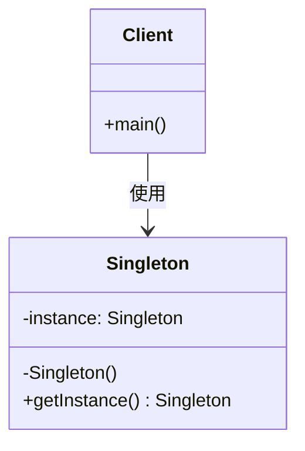

# 单例模式（Singleton Pattern）

> 确保一个类只有一个实例，并提供全局访问点

---

## 📋 基本信息

- **类型**: 创建型模式
- **难度**: ⭐⭐
- **使用频率**: ⭐⭐⭐⭐⭐
- **关键词**: 唯一实例、全局访问、延迟加载、线程安全

---

## 🎯 模式意图

**核心思想**：保证一个类在整个应用程序中只有一个实例，并提供一个全局访问点来访问该实例。

**解决的问题**：
- 避免创建多个实例造成资源浪费
- 确保全局只有一个实例，避免数据不一致
- 提供统一的访问入口，便于管理和控制

**适用场景**：
- 📝 **日志记录器**：全局统一的日志记录入口
- ⚙️ **配置管理器**：应用程序配置信息的管理
- 🗃️ **数据库连接池**：统一管理数据库连接
- 🔄 **线程池**：管理线程资源
- 🏭 **工厂对象**：统一创建和管理对象
- 📊 **计数器**：全局计数功能
- 🌐 **Web应用的ServletContext**：Servlet上下文对象

---

## 🏗️ UML类图



**类图说明**：
- `Singleton`：单例类，包含私有构造函数和静态获取实例方法
- `Client`：客户端，通过`getInstance()`方法获取单例实例
- `instance`：私有静态成员，保存唯一的实例引用

---

## 💻 代码实现

### 基本实现

#### 1. 饿汉式（Eager Initialization）

**特点**：类加载时就创建实例，线程安全但可能造成资源浪费。

```java
public class EagerSingleton {
    // 1. 私有静态成员，在类加载时就创建实例
    private static final EagerSingleton instance = new EagerSingleton();

    // 2. 私有构造函数，防止外部创建实例
    private EagerSingleton() {
        // 防止通过反射创建实例
        if (instance != null) {
            throw new IllegalStateException("Singleton already initialized");
        }
    }

    // 3. 公共静态方法，返回唯一实例
    public static EagerSingleton getInstance() {
        return instance;
    }

    // 业务方法
    public void doSomething() {
        System.out.println("Eager Singleton is working");
    }
}
```

**优点**：
- ✅ 实现简单，线程安全
- ✅ 没有加锁，执行效率高
- ✅ 在类加载时就完成实例化，避免了线程同步问题

**缺点**：
- ❌ 如果实例从未使用，会造成内存浪费
- ❌ 无法实现延迟加载

---

#### 2. 懒汉式（Lazy Initialization）

**特点**：延迟加载，第一次调用时创建实例，但线程不安全。

```java
public class LazySingleton {
    // 1. 私有静态成员，初始为null
    private static LazySingleton instance;

    // 2. 私有构造函数
    private LazySingleton() {
        // 防止反射创建实例
        if (instance != null) {
            throw new IllegalStateException("Singleton already initialized");
        }
    }

    // 3. 公共静态方法，延迟创建实例
    public static LazySingleton getInstance() {
        if (instance == null) {
            instance = new LazySingleton();
        }
        return instance;
    }

    // 业务方法
    public void doSomething() {
        System.out.println("Lazy Singleton is working");
    }
}
```

**优点**：
- ✅ 实现了延迟加载，节省资源
- ✅ 代码简单易懂

**缺点**：
- ❌ **线程不安全**：多线程环境下可能创建多个实例
- ❌ 需要额外处理线程安全问题

---

### 进阶实现

#### 3. 同步方法懒汉式（Thread-safe Lazy）

**特点**：通过`synchronized`关键字保证线程安全，但性能较差。

```java
public class SynchronizedSingleton {
    private static SynchronizedSingleton instance;

    private SynchronizedSingleton() {
        if (instance != null) {
            throw new IllegalStateException("Singleton already initialized");
        }
    }

    // 使用synchronized关键字保证线程安全
    public static synchronized SynchronizedSingleton getInstance() {
        if (instance == null) {
            instance = new SynchronizedSingleton();
        }
        return instance;
    }

    public void doSomething() {
        System.out.println("Synchronized Singleton is working");
    }
}
```

**优点**：
- ✅ 线程安全
- ✅ 实现了延迟加载

**缺点**：
- ❌ **性能差**：每次获取实例都需要同步
- ❌ 同步范围过大，影响并发性能

---

#### 4. 双重检查锁定（Double-Checked Locking）

**特点**：结合懒加载和线程安全，性能最优的懒加载实现。

```java
public class DoubleCheckedSingleton {
    // 使用volatile关键字防止指令重排序
    private static volatile DoubleCheckedSingleton instance;

    private DoubleCheckedSingleton() {
        if (instance != null) {
            throw new IllegalStateException("Singleton already initialized");
        }
    }

    public static DoubleCheckedSingleton getInstance() {
        // 第一次检查，避免不必要的同步
        if (instance == null) {
            synchronized (DoubleCheckedSingleton.class) {
                // 第二次检查，确保只有一个实例
                if (instance == null) {
                    instance = new DoubleCheckedSingleton();
                }
            }
        }
        return instance;
    }

    public void doSomething() {
        System.out.println("Double-Checked Singleton is working");
    }
}
```

**优点**：
- ✅ 线程安全
- ✅ 延迟加载
- ✅ **性能优秀**：只有在第一次创建实例时才同步

**缺点**：
- ❌ 实现相对复杂
- ❌ 需要理解volatile关键字的作用

**关键点说明**：
- `volatile`关键字：防止指令重排序，确保`instance = new DoubleCheckedSingleton()`的原子性
- 双重检查：外层检查避免不必要的同步，内层检查确保单例

---

#### 5. 静态内部类（Static Inner Class）

**特点**：利用类加载机制保证线程安全，同时实现延迟加载。

```java
public class StaticInnerClassSingleton {
    // 私有构造函数
    private StaticInnerClassSingleton() {
        // 防止反射创建实例
        if (SingletonHolder.instance != null) {
            throw new IllegalStateException("Singleton already initialized");
        }
    }

    // 静态内部类，在第一次调用getInstance()时加载
    private static class SingletonHolder {
        private static final StaticInnerClassSingleton instance = new StaticInnerClassSingleton();
    }

    // 公共静态方法
    public static StaticInnerClassSingleton getInstance() {
        return SingletonHolder.instance;
    }

    public void doSomething() {
        System.out.println("Static Inner Class Singleton is working");
    }
}
```

**优点**：
- ✅ 线程安全（由JVM保证）
- ✅ 延迟加载（静态内部类在使用时才加载）
- ✅ **性能优秀**：没有同步开销
- ✅ 实现简洁

**缺点**：
- ❌ 无法传递参数给构造函数
- ❌ 不适用于需要复杂初始化逻辑的场景

---

#### 6. 枚举单例（Enum Singleton）

**特点**：使用枚举实现单例，最安全、最简洁的实现方式。

```java
public enum EnumSingleton {
    INSTANCE;

    // 业务方法
    public void doSomething() {
        System.out.println("Enum Singleton is working");
    }

    // 其他方法
    public void doWork() {
        System.out.println("Doing work with enum singleton");
    }
}

// 使用方式
public class Client {
    public static void main(String[] args) {
        EnumSingleton singleton = EnumSingleton.INSTANCE;
        singleton.doSomething();
        singleton.doWork();
    }
}
```

**优点**：
- ✅ **绝对线程安全**：由JVM保证
- ✅ **防止反射攻击**：枚举类型无法通过反射创建实例
- ✅ **防止序列化破坏**：枚举的序列化机制由JVM特殊处理
- ✅ **代码简洁**：实现最简单
- ✅ **单例最佳实践**：《Effective Java》作者推荐

**缺点**：
- ❌ 不够灵活，无法延迟加载（枚举在类加载时就初始化）
- ❌ 无法继承其他类（枚举已继承Enum类）

---

## 🔍 源码应用

### JDK中的应用

#### 1. `Runtime`类

```java
public class Runtime {
    private static Runtime currentRuntime = new Runtime();

    // 私有构造函数
    private Runtime() {}

    // 获取Runtime实例
    public static Runtime getRuntime() {
        return currentRuntime;
    }

    // 其他方法...
    public void addShutdownHook(Thread hook) {
        // ...
    }

    public Process exec(String command) throws IOException {
        // ...
    }
}
```

**使用示例**：
```java
public class RuntimeExample {
    public static void main(String[] args) {
        Runtime runtime = Runtime.getRuntime();

        // 获取JVM内存信息
        long totalMemory = runtime.totalMemory();
        long freeMemory = runtime.freeMemory();
        long maxMemory = runtime.maxMemory();

        System.out.println("Total Memory: " + totalMemory / 1024 / 1024 + " MB");
        System.out.println("Free Memory: " + freeMemory / 1024 / 1024 + " MB");
        System.out.println("Max Memory: " + maxMemory / 1024 / 1024 + " MB");
    }
}
```

#### 2. `Desktop`类

```java
public class Desktop {
    private static Desktop desktop;

    // 私有构造函数
    private Desktop() {}

    // 获取Desktop实例
    public static synchronized Desktop getDesktop() {
        if (desktop == null) {
            desktop = new Desktop();
        }
        return desktop;
    }

    // 其他方法...
    public void browse(URI uri) throws IOException {
        // ...
    }

    public void open(File file) throws IOException {
        // ...
    }
}
```

#### 3. `System`类中的`getSecurityManager()`

```java
public class System {
    private static volatile SecurityManager security;

    public static SecurityManager getSecurityManager() {
        return security;
    }

    public static void setSecurityManager(final SecurityManager s) {
        security = s;
    }
}
```

---

### Spring中的应用

#### 1. `ApplicationContext`

Spring的`ApplicationContext`本质上是一个单例，但Spring通过IoC容器管理Bean的生命周期。

```java
// Spring配置
@Configuration
public class AppConfig {
    @Bean
    @Scope("singleton") // 默认就是singleton
    public MyService myService() {
        return new MyServiceImpl();
    }
}

// 使用
public class Main {
    public static void main(String[] args) {
        ApplicationContext context = new AnnotationConfigApplicationContext(AppConfig.class);

        // 获取的始终是同一个实例
        MyService service1 = context.getBean(MyService.class);
        MyService service2 = context.getBean(MyService.class);

        System.out.println(service1 == service2); // true
    }
}
```

#### 2. Spring中的单例Bean注册

Spring通过`DefaultSingletonBeanRegistry`类管理单例Bean：

```java
public class DefaultSingletonBeanRegistry extends SimpleAliasRegistry implements SingletonBeanRegistry {

    /** Cache of singleton objects: bean name to bean instance */
    private final Map<String, Object> singletonObjects = new ConcurrentHashMap<>(256);

    /** Cache of singleton factories: bean name to ObjectFactory */
    private final Map<String, ObjectFactory<?>> singletonFactories = new HashMap<>(16);

    /** Cache of early singleton objects: bean name to bean instance */
    private final Map<String, Object> earlySingletonObjects = new HashMap<>(16);

    @Override
    public Object getSingleton(String beanName) {
        return getSingleton(beanName, true);
    }

    protected Object getSingleton(String beanName, boolean allowEarlyReference) {
        Object singletonObject = this.singletonObjects.get(beanName);
        if (singletonObject == null && isSingletonCurrentlyInCreation(beanName)) {
            synchronized (this.singletonObjects) {
                singletonObject = this.earlySingletonObjects.get(beanName);
                if (singletonObject == null && allowEarlyReference) {
                    ObjectFactory<?> singletonFactory = this.singletonFactories.get(beanName);
                    if (singletonFactory != null) {
                        singletonObject = singletonFactory.getObject();
                        this.earlySingletonObjects.put(beanName, singletonObject);
                        this.singletonFactories.remove(beanName);
                    }
                }
            }
        }
        return singletonObject;
    }
}
```

---

## ⚠️ 注意事项

### 1. 线程安全问题

**问题**：多线程环境下，懒汉式单例可能创建多个实例。

**解决方案**：
- 使用`synchronized`关键字（性能较差）
- 使用双重检查锁定（推荐）
- 使用静态内部类（推荐）
- 使用枚举（最安全）

### 2. 反射攻击

**问题**：通过反射可以调用私有构造函数创建新实例。

```java
public class ReflectionAttack {
    public static void main(String[] args) throws Exception {
        // 正常获取单例
        Singleton instance1 = Singleton.getInstance();

        // 通过反射创建新实例
        Constructor<Singleton> constructor = Singleton.class.getDeclaredConstructor();
        constructor.setAccessible(true);
        Singleton instance2 = constructor.newInstance();

        System.out.println(instance1 == instance2); // false，破坏了单例
    }
}
```

**解决方案**：
```java
private Singleton() {
    // 在构造函数中检查是否已存在实例
    if (instance != null) {
        throw new IllegalStateException("Singleton already initialized");
    }
}
```

### 3. 序列化破坏

**问题**：序列化和反序列化会创建新的实例。

```java
public class SerializationAttack {
    public static void main(String[] args) throws Exception {
        Singleton instance1 = Singleton.getInstance();

        // 序列化
        ByteArrayOutputStream bos = new ByteArrayOutputStream();
        ObjectOutputStream oos = new ObjectOutputStream(bos);
        oos.writeObject(instance1);
        oos.close();

        // 反序列化
        ByteArrayInputStream bis = new ByteArrayInputStream(bos.toByteArray());
        ObjectInputStream ois = new ObjectInputStream(bis);
        Singleton instance2 = (Singleton) ois.readObject();
        ois.close();

        System.out.println(instance1 == instance2); // false，破坏了单例
    }
}
```

**解决方案**：
```java
public class Singleton implements Serializable {
    private static final long serialVersionUID = 1L;
    private static volatile Singleton instance;

    private Singleton() {}

    public static Singleton getInstance() {
        if (instance == null) {
            synchronized (Singleton.class) {
                if (instance == null) {
                    instance = new Singleton();
                }
            }
        }
        return instance;
    }

    // 添加readResolve方法，防止序列化破坏
    protected Object readResolve() {
        return getInstance();
    }
}
```

### 4. 类加载器问题

**问题**：不同的类加载器可能会加载同一个类的多个实例。

**解决方案**：
- 确保使用相同的类加载器
- 在获取实例时指定类加载器

---

## 🎓 最佳实践

### 1. 选择合适的实现方式

| 实现方式 | 线程安全 | 延迟加载 | 性能 | 推荐度 | 适用场景 |
|---------|---------|---------|------|--------|---------|
| 饿汉式 | ✅ | ❌ | ⭐⭐⭐⭐⭐ | ⭐⭐⭐ | 实例一定会使用，内存充足 |
| 懒汉式 | ❌ | ✅ | ⭐⭐⭐⭐⭐ | ⭐ | 单线程环境 |
| 同步方法 | ✅ | ✅ | ⭐⭐ | ⭐⭐ | 对性能要求不高的场景 |
| 双重检查 | ✅ | ✅ | ⭐⭐⭐⭐ | ⭐⭐⭐⭐⭐ | 大多数场景推荐 |
| 静态内部类 | ✅ | ✅ | ⭐⭐⭐⭐⭐ | ⭐⭐⭐⭐ | 不需要传参的场景 |
| 枚举 | ✅ | ❌ | ⭐⭐⭐⭐⭐ | ⭐⭐⭐⭐⭐ | **最推荐**，安全性最高 |

### 2. 推荐实现方案

#### 方案一：静态内部类（推荐）
```java
public class RecommendedSingleton {
    private RecommendedSingleton() {
        if (SingletonHolder.instance != null) {
            throw new IllegalStateException("Singleton already initialized");
        }
    }

    private static class SingletonHolder {
        private static final RecommendedSingleton instance = new RecommendedSingleton();
    }

    public static RecommendedSingleton getInstance() {
        return SingletonHolder.instance;
    }
}
```

#### 方案二：枚举（最安全）
```java
public enum SafeSingleton {
    INSTANCE;

    public void doSomething() {
        System.out.println("Safe singleton working");
    }
}
```

#### 方案三：双重检查（需要延迟加载且传参）
```java
public class ParametricSingleton {
    private static volatile ParametricSingleton instance;
    private final String config;

    private ParametricSingleton(String config) {
        this.config = config;
    }

    public static ParametricSingleton getInstance(String config) {
        if (instance == null) {
            synchronized (ParametricSingleton.class) {
                if (instance == null) {
                    instance = new ParametricSingleton(config);
                }
            }
        }
        return instance;
    }

    public String getConfig() {
        return config;
    }
}
```

### 3. 避免滥用单例

**不要使用单例的场景**：
- ❌ 需要多个实例的业务逻辑
- ❌ 需要继承的场景（枚举单例）
- ❌ 需要复杂初始化参数的场景
- ❌ 测试困难的场景（单例难以mock）

**使用单例的判断标准**：
- ✅ 确实只需要一个实例
- ✅ 该实例需要被多个地方访问
- ✅ 创建实例的成本较高
- ✅ 需要统一管理和控制

---

## 📚 相关模式

### 1. 工厂方法模式（Factory Method）
**关系**：工厂方法模式可以用来创建单例对象。
**示例**：
```java
public class SingletonFactory {
    private static Singleton instance;

    public static Singleton createSingleton() {
        if (instance == null) {
            instance = new Singleton();
        }
        return instance;
    }
}
```

### 2. 抽象工厂模式（Abstract Factory）
**关系**：抽象工厂模式中的具体工厂类通常使用单例模式。
**示例**：
```java
public class DatabaseFactory {
    private static DatabaseFactory instance;

    private DatabaseFactory() {}

    public static DatabaseFactory getInstance() {
        if (instance == null) {
            instance = new DatabaseFactory();
        }
        return instance;
    }

    public Connection createConnection() {
        return new DatabaseConnection();
    }
}
```

### 3. 建造者模式（Builder）
**关系**：复杂对象的构建过程中，建造者本身可以使用单例模式。
**示例**：
```java
public enum ConfigurationBuilder {
    INSTANCE;

    private Configuration config;

    public Configuration build() {
        if (config == null) {
            config = new Configuration();
            // 构建配置...
        }
        return config;
    }
}
```

### 4. 代理模式（Proxy）
**关系**：代理模式可以用来控制对单例对象的访问。
**示例**：
```java
public class SingletonProxy implements SingletonInterface {
    private SingletonInterface realSingleton;

    @Override
    public void doSomething() {
        if (realSingleton == null) {
            realSingleton = RealSingleton.getInstance();
        }
        realSingleton.doSomething();
    }
}
```

### 5. 观察者模式（Observer）
**关系**：单例对象可以作为被观察者，多个观察者监听其状态变化。
**示例**：
```java
public class EventManager implements Observable {
    private static EventManager instance;
    private List<Observer> observers = new ArrayList<>();

    private EventManager() {}

    public static EventManager getInstance() {
        if (instance == null) {
            instance = new EventManager();
        }
        return instance;
    }

    @Override
    public void addObserver(Observer observer) {
        observers.add(observer);
    }

    @Override
    public void notifyObservers(String event) {
        for (Observer observer : observers) {
            observer.update(event);
        }
    }
}
```

---

## ?? 总结

单例模式是最简单也是最常用的设计模式之一，但在实际应用中需要注意：

**核心要点**：
1. **确保唯一性**：通过私有构造函数和静态方法控制实例创建
2. **线程安全**：选择合适的线程安全实现方式
3. **防止破坏**：防范反射攻击和序列化破坏
4. **合理使用**：避免滥用单例模式

**最佳实践**：
- 优先使用**枚举单例**（最安全）
- 其次选择**静态内部类**（性能优秀）
- 需要延迟加载时使用**双重检查锁定**
- 避免使用基本的懒汉式和同步方法实现

单例模式虽然简单，但要正确实现并保证在各种情况下的安全性，需要深入理解Java的内存模型、类加载机制和并发编程知识。

---

