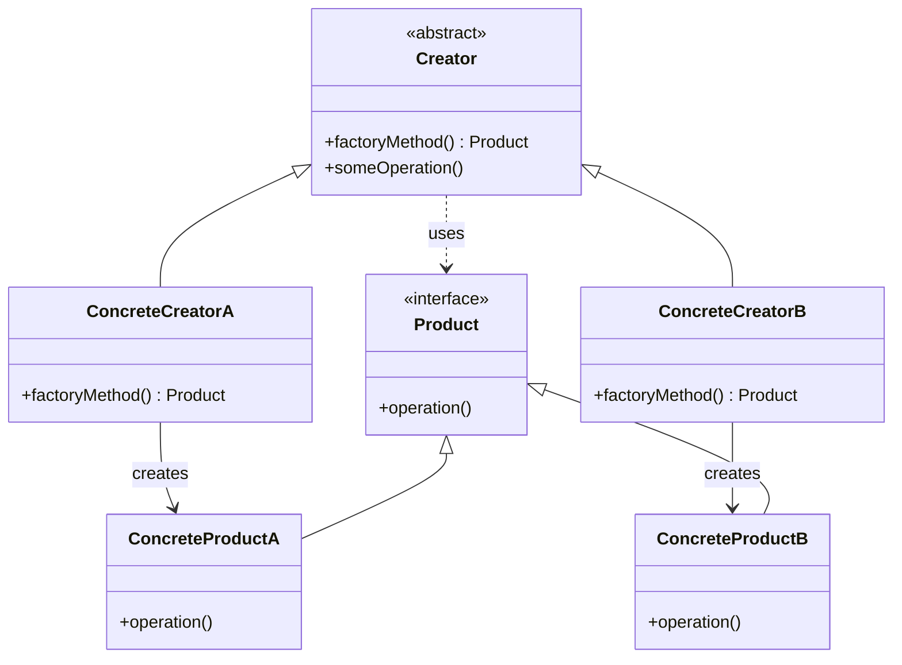

# 工厂方法模式（Factory Method Pattern）

> 定义创建对象的接口，让子类决定实例化哪个类

---

## 📋 基本信息

- **类型**: 创建型模式
- **难度**: ⭐⭐⭐
- **使用频率**: ⭐⭐⭐⭐⭐
- **关键词**: 工厂接口、延迟实例化、解耦创建

---

## 🎯 模式意图

**核心思想**：定义一个创建对象的接口，但由子类决定要实例化的类是哪一个。工厂方法让类的实例化推迟到子类进行。

**解决的问题**：
- 将对象的创建与使用分离，客户端不需要知道具体产品类的类名
- 通过引入工厂等级结构，解决简单工厂模式中工厂类职责过重的问题
- 提供系统的灵活性，使得在不修改现有代码的情况下可以引入新的产品

**适用场景**：
- 当一个类不知道它所必须创建的对象的类时
- 当一个类希望由它的子类来指定它所创建的对象时
- 当类将创建对象的职责委托给多个帮助子类中的某一个，并且你希望将哪一个帮助子类是代理者这一信息局部化时

## 🏗️ UML类图



**类图说明**：
- `Product`：产品接口，定义产品的公共方法
- `ConcreteProductA/B`：具体产品实现
- `Creator`：抽象工厂类，声明工厂方法
- `ConcreteCreatorA/B`：具体工厂类，实现工厂方法创建具体产品

## 💻 代码实现

### 基本实现

#### 1. 产品接口

```java
// 产品接口
public interface Product {
    void operation();
}
```

#### 2. 具体产品

```java
// 具体产品A
public class ConcreteProductA implements Product {
    @Override
    public void operation() {
        System.out.println("ConcreteProductA operation");
    }
}

// 具体产品B
public class ConcreteProductB implements Product {
    @Override
    public void operation() {
        System.out.println("ConcreteProductB operation");
    }
}
```

#### 3. 抽象工厂

```java
// 抽象工厂类
public abstract class Creator {
    // 工厂方法
    public abstract Product factoryMethod();
    
    // 其他业务方法
    public void someOperation() {
        Product product = factoryMethod();
        product.operation();
    }
}
```

#### 4. 具体工厂

```java
// 具体工厂A，创建产品A
public class ConcreteCreatorA extends Creator {
    @Override
    public Product factoryMethod() {
        return new ConcreteProductA();
    }
}

// 具体工厂B，创建产品B
public class ConcreteCreatorB extends Creator {
    @Override
    public Product factoryMethod() {
        return new ConcreteProductB();
    }
}
```

#### 5. 客户端使用

```java
public class Client {
    public static void main(String[] args) {
        Creator creatorA = new ConcreteCreatorA();
        creatorA.someOperation(); // 输出: ConcreteProductA operation
        
        Creator creatorB = new ConcreteCreatorB();
        creatorB.someOperation(); // 输出: ConcreteProductB operation
    }
}
```

### 实际应用示例：日志记录器

```java
// 日志产品接口
public interface Logger {
    void log(String message);
}

// 文件日志
public class FileLogger implements Logger {
    @Override
    public void log(String message) {
        System.out.println("File logging: " + message);
    }
}

// 控制台日志
public class ConsoleLogger implements Logger {
    @Override
    public void log(String message) {
        System.out.println("Console logging: " + message);
    }
}

// 日志工厂接口
public abstract class LoggerFactory {
    public abstract Logger createLogger();
}

// 文件日志工厂
public class FileLoggerFactory extends LoggerFactory {
    @Override
    public Logger createLogger() {
        // 可能包含复杂的初始化逻辑
        return new FileLogger();
    }
}

// 控制台日志工厂
public class ConsoleLoggerFactory extends LoggerFactory {
    @Override
    public Logger createLogger() {
        // 可能包含复杂的初始化逻辑
        return new ConsoleLogger();
    }
}

// 客户端
public class LoggerClient {
    public static void main(String[] args) {
        LoggerFactory factory;
        Logger logger;
        
        // 根据配置决定使用哪个工厂
        String loggerType = "console"; // 可从配置文件读取
        
        if ("file".equals(loggerType)) {
            factory = new FileLoggerFactory();
        } else {
            factory = new ConsoleLoggerFactory();
        }
        
        logger = factory.createLogger();
        logger.log("Application started");
    }
}
```

## 🔍 源码应用

### 1. Java集合框架

```java
// Collection接口中的iterator()方法就是一个工厂方法
List<String> list = new ArrayList<>();
Iterator<String> iterator = list.iterator(); // ArrayList实现了iterator()工厂方法
```

### 2. Spring框架

Spring中的BeanFactory使用工厂方法模式创建和管理Bean：

```java
// ApplicationContext作为工厂
ApplicationContext context = new ClassPathXmlApplicationContext("applicationContext.xml");
// 通过工厂方法获取Bean
UserService userService = context.getBean(UserService.class);
```

### 3. Java EE

Servlet中的`ServletContext.getRequestDispatcher()`方法：

```java
RequestDispatcher dispatcher = servletContext.getRequestDispatcher("/index.jsp");
```

## ⚠️ 注意事项

1. **不要过度使用**：简单对象创建不需要使用工厂方法模式
2. **平衡复杂度**：引入工厂方法会增加系统的类和对象数量
3. **抽象工厂选择**：客户端需要知道要实例化哪个具体工厂
4. **工厂职责单一**：工厂类应该只负责对象创建，不应该包含太多业务逻辑
5. **命名规范**：工厂方法通常命名为`createXxx()`、`newXxx()`或`getXxx()`

## 🎓 最佳实践

1. **参数化工厂方法**：可以通过参数决定创建哪种产品
   ```java
   public Product factoryMethod(String type) {
       if ("A".equals(type)) return new ConcreteProductA();
       else if ("B".equals(type)) return new ConcreteProductB();
       return null;
   }
   ```

2. **默认工厂方法**：在抽象工厂中提供默认实现
   ```java
   public abstract class Creator {
       public Product factoryMethod() {
           return new DefaultProduct(); // 默认产品
       }
   }
   ```

3. **结合依赖注入**：将具体工厂注入到客户端，提高灵活性

4. **使用枚举**：对于简单的工厂方法，可以使用枚举实现

## 📚 相关模式

- **抽象工厂模式**：工厂方法模式创建一种产品，抽象工厂创建一族产品
- **单例模式**：可以在工厂方法中实现单例
- **原型模式**：当创建对象成本高时，可以结合原型模式使用
- **模板方法模式**：工厂方法通常在模板方法中被调用
- **依赖注入**：都用于解耦对象创建和使用

