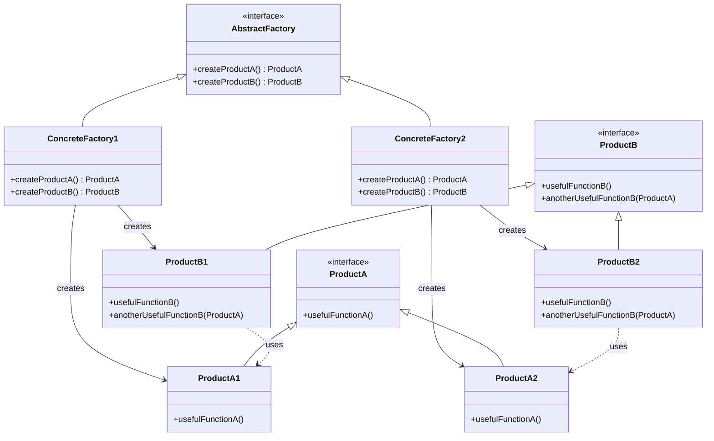

# 抽象工厂模式（Abstract Factory Pattern）

> 提供接口创建相关或依赖对象的家族，无需指定具体类

---

## 📋 基本信息

- **类型**: 创建型模式
- **难度**: ⭐⭐⭐⭐
- **使用频率**: ⭐⭐⭐
- **关键词**: 产品族、工厂族、跨平台

---

## 🎯 模式意图

**核心思想**：提供一个接口，用于创建相关或依赖对象的家族，而不需要明确指定具体类。

**解决的问题**：
- 当需要创建的对象是一系列相互关联或相互依赖的产品族时
- 当系统需要独立于产品的创建、组合和表示时
- 当强调一系列相关的产品对象的设计以便进行联合使用时

**适用场景**：
- 🌐 **跨平台应用**：需要为不同平台创建不同实现的组件
- 🎨 **UI组件库**：为不同风格创建配套的UI组件
- 🗄️ **数据库访问层**：为不同数据库提供统一接口
- 📱 **设备驱动程序**：为不同设备提供统一的驱动接口
- 🏭 **产品族生产**：需要同时创建多个相关产品

## 🏗️ UML类图



**类图说明**：
- `AbstractFactory`：抽象工厂接口，声明创建产品的方法
- `ConcreteFactory1/2`：具体工厂，实现创建产品的方法
- `ProductA/B`：产品接口，定义产品功能
- `ProductA1/A2/B1/B2`：具体产品实现
- 同一工厂创建的产品（如ProductA1和ProductB1）构成产品族

## 💻 代码实现

### 基本实现

#### 1. 产品接口

```java
// 产品A接口
public interface ProductA {
    void usefulFunctionA();
}

// 产品B接口
public interface ProductB {
    void usefulFunctionB();
    void anotherUsefulFunctionB(ProductA collaborator);
}
```

#### 2. 具体产品

```java
// 具体产品A1
public class ProductA1 implements ProductA {
    @Override
    public void usefulFunctionA() {
        System.out.println("Product A1 functionality");
    }
}

// 具体产品A2
public class ProductA2 implements ProductA {
    @Override
    public void usefulFunctionA() {
        System.out.println("Product A2 functionality");
    }
}

// 具体产品B1
public class ProductB1 implements ProductB {
    @Override
    public void usefulFunctionB() {
        System.out.println("Product B1 functionality");
    }

    @Override
    public void anotherUsefulFunctionB(ProductA collaborator) {
        collaborator.usefulFunctionA();
        System.out.println("Product B1 collaborating with " + collaborator.getClass().getSimpleName());
    }
}

// 具体产品B2
public class ProductB2 implements ProductB {
    @Override
    public void usefulFunctionB() {
        System.out.println("Product B2 functionality");
    }

    @Override
    public void anotherUsefulFunctionB(ProductA collaborator) {
        collaborator.usefulFunctionA();
        System.out.println("Product B2 collaborating with " + collaborator.getClass().getSimpleName());
    }
}
```

#### 3. 抽象工厂接口

```java
// 抽象工厂接口
public interface AbstractFactory {
    ProductA createProductA();
    ProductB createProductB();
}
```

#### 4. 具体工厂

```java
// 具体工厂1：生产产品族1
public class ConcreteFactory1 implements AbstractFactory {
    @Override
    public ProductA createProductA() {
        return new ProductA1();
    }

    @Override
    public ProductB createProductB() {
        return new ProductB1();
    }
}

// 具体工厂2：生产产品族2
public class ConcreteFactory2 implements AbstractFactory {
    @Override
    public ProductA createProductA() {
        return new ProductA2();
    }

    @Override
    public ProductB createProductB() {
        return new ProductB2();
    }
}
```

#### 5. 客户端使用

```java
public class Client {
    private final ProductA productA;
    private final ProductB productB;

    // 客户端依赖于抽象工厂
    public Client(AbstractFactory factory) {
        productA = factory.createProductA();
        productB = factory.createProductB();
    }

    public void doSomething() {
        productB.usefulFunctionB();
        productB.anotherUsefulFunctionB(productA);
    }

    public static void main(String[] args) {
        // 根据配置选择具体工厂
        AbstractFactory factory;
        String config = "factory1"; // 可从配置文件读取

        if ("factory1".equals(config)) {
            factory = new ConcreteFactory1();
        } else {
            factory = new ConcreteFactory2();
        }

        Client client = new Client(factory);
        client.doSomething();
    }
}
```

### 实际应用示例：UI组件库

```java
// 按钮接口
public interface Button {
    void paint();
}

// 复选框接口
public interface Checkbox {
    void paint();
}

// Windows按钮
public class WindowsButton implements Button {
    @Override
    public void paint() {
        System.out.println("Rendering Windows style button");
    }
}

// Mac按钮
public class MacButton implements Button {
    @Override
    public void paint() {
        System.out.println("Rendering Mac style button");
    }
}

// Windows复选框
public class WindowsCheckbox implements Checkbox {
    @Override
    public void paint() {
        System.out.println("Rendering Windows style checkbox");
    }
}

// Mac复选框
public class MacCheckbox implements Checkbox {
    @Override
    public void paint() {
        System.out.println("Rendering Mac style checkbox");
    }
}

// UI工厂接口
public interface GUIFactory {
    Button createButton();
    Checkbox createCheckbox();
}

// Windows工厂
public class WindowsFactory implements GUIFactory {
    @Override
    public Button createButton() {
        return new WindowsButton();
    }

    @Override
    public Checkbox createCheckbox() {
        return new WindowsCheckbox();
    }
}

// Mac工厂
public class MacFactory implements GUIFactory {
    @Override
    public Button createButton() {
        return new MacButton();
    }

    @Override
    public Checkbox createCheckbox() {
        return new MacCheckbox();
    }
}

// 应用程序
public class Application {
    private final Button button;
    private final Checkbox checkbox;

    public Application(GUIFactory factory) {
        button = factory.createButton();
        checkbox = factory.createCheckbox();
    }

    public void paint() {
        button.paint();
        checkbox.paint();
    }

    public static void main(String[] args) {
        GUIFactory factory;

        // 根据操作系统选择工厂
        String os = System.getProperty("os.name").toLowerCase();
        if (os.contains("win")) {
            factory = new WindowsFactory();
        } else {
            factory = new MacFactory();
        }

        Application app = new Application(factory);
        app.paint();
    }
}
```

## 🔍 源码应用

### 1. Java AWT

Java的AWT工具包使用抽象工厂模式处理不同平台的UI组件：

```java
// Toolkit作为抽象工厂
Toolkit toolkit = Toolkit.getDefaultToolkit();
// 创建平台相关的组件
Button button = new Button("Click me");
```

### 2. Spring框架

Spring的`org.springframework.beans.factory.FactoryBean`接口：

```java
// 抽象工厂
public interface FactoryBean<T> {
    T getObject() throws Exception;
    Class<?> getObjectType();
    boolean isSingleton();
}
```

### 3. MyBatis

MyBatis的`SqlSessionFactory`使用抽象工厂模式创建`SqlSession`：

```java
SqlSessionFactory factory = new SqlSessionFactoryBuilder().build(inputStream);
SqlSession session = factory.openSession(); // 创建会话
```

### 4. 数据库连接

JDBC中的数据库连接工厂：

```java
// 不同数据库有不同的Driver实现
Connection connection = DriverManager.getConnection(url, username, password);
Statement statement = connection.createStatement(); // 创建语句对象
```

## ⚠️ 注意事项

1. **增加新产品困难**：添加新产品族容易，但添加新种类的产品需要修改所有工厂接口
2. **复杂性较高**：会导致系统中类的数量急剧增加，增加理解难度
3. **抽象工厂选择**：客户端需要知道并选择哪个工厂实现
4. **产品族限制**：只适用于相关产品组成的产品族
5. **避免过度设计**：简单对象创建不需要使用抽象工厂模式

## 🎓 最佳实践

1. **产品族清晰**：确保产品族中的产品确实存在关联
2. **工厂接口稳定**：一旦确定，避免频繁修改抽象工厂接口
3. **参数化工厂**：可以通过参数化创建不同产品族
   ```java
   public interface AbstractFactory {
       <T extends Product> T createProduct(Class<T> productClass);
   }
   ```

4. **单例工厂**：工厂实例通常设计为单例

5. **默认实现**：为抽象工厂提供默认实现

6. **结合依赖注入**：通过DI容器管理工厂和产品

## 📚 相关模式

- **工厂方法模式**：抽象工厂模式包含多个工厂方法
- **建造者模式**：强调对象的分步构建，抽象工厂强调产品族创建
- **原型模式**：当产品创建成本高时，可以结合原型模式
- **单例模式**：工厂类通常实现为单例
- **桥接模式**：都处理对象的抽象与实现分离

