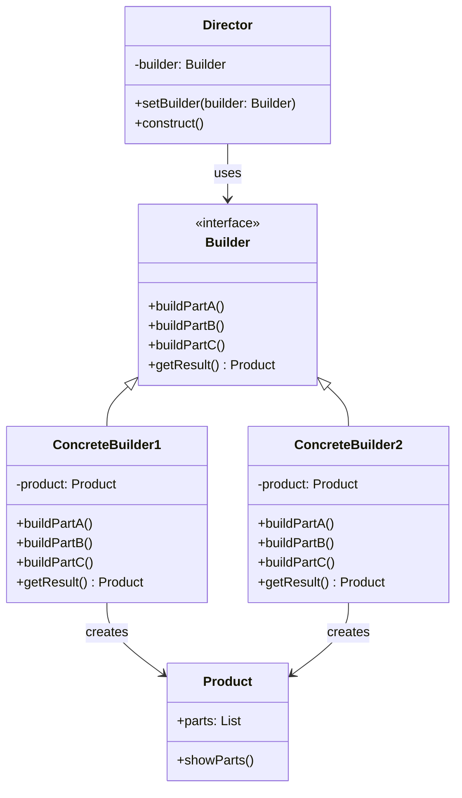

# 建造者模式（Builder Pattern）

> 将复杂对象的构建与表示分离，同样的构建过程可以创建不同的表示

---

## 📋 基本信息

- **类型**: 创建型模式
- **难度**: ⭐⭐⭐
- **使用频率**: ⭐⭐⭐⭐
- **关键词**: 链式调用、分步构建、参数过多

---

## 🎯 模式意图

**核心思想**：将一个复杂对象的构建与它的表示分离，使得同样的构建过程可以创建不同的表示。

**解决的问题**：
- 当创建复杂对象的算法应该独立于该对象的组成部分以及它们的装配方式时
- 当构造过程必须允许被构造的对象有不同的表示时
- 当对象具有复杂的内部结构且需要多个步骤才能完成构建时

**适用场景**：
- 🚗 **对象具有复杂结构**：如汽车、电脑等包含多个组件的对象
- 📝 **分步构建**：需要分步骤构建对象，且允许步骤顺序变化
- 🎨 **多种表示形式**：同一构建过程需要创建不同表示的产品
- ✅ **验证构建过程**：需要在对象使用前验证其完整性
- 📊 **不可变对象**：构建不可变对象，确保对象创建后状态不被修改

## 🏗️ UML类图



**类图说明**：
- `Product`：产品类，包含多个组件
- `Builder`：抽象建造者接口，定义构建步骤和获取结果方法
- `ConcreteBuilder1/2`：具体建造者，实现构建步骤，创建具体产品
- `Director`：指挥者，负责控制构建过程

## 💻 代码实现

### 基本实现

#### 1. 产品类

```java
import java.util.ArrayList;
import java.util.List;

// 产品类
public class Product {
    private List<String> parts = new ArrayList<>();

    public void addPart(String part) {
        parts.add(part);
    }

    public void showParts() {
        System.out.println("Product Parts: ");
        for (String part : parts) {
            System.out.println("- " + part);
        }
    }
}
```

#### 2. 抽象建造者

```java
// 抽象建造者接口
public interface Builder {
    void buildPartA();
    void buildPartB();
    void buildPartC();
    Product getResult();
}
```

#### 3. 具体建造者

```java
// 具体建造者1
public class ConcreteBuilder1 implements Builder {
    private Product product = new Product();

    @Override
    public void buildPartA() {
        product.addPart("Part A1");
    }

    @Override
    public void buildPartB() {
        product.addPart("Part B1");
    }

    @Override
    public void buildPartC() {
        product.addPart("Part C1");
    }

    @Override
    public Product getResult() {
        return product;
    }
}

// 具体建造者2
public class ConcreteBuilder2 implements Builder {
    private Product product = new Product();

    @Override
    public void buildPartA() {
        product.addPart("Part A2");
    }

    @Override
    public void buildPartB() {
        product.addPart("Part B2");
    }

    @Override
    public void buildPartC() {
        product.addPart("Part C2");
    }

    @Override
    public Product getResult() {
        return product;
    }
}
```

#### 4. 指挥者

```java
// 指挥者类
public class Director {
    private Builder builder;

    public Director(Builder builder) {
        this.builder = builder;
    }

    public void setBuilder(Builder builder) {
        this.builder = builder;
    }

    // 构建不同产品的方法
    public void constructMinimalViableProduct() {
        builder.buildPartA();
    }

    public void constructFullFeaturedProduct() {
        builder.buildPartA();
        builder.buildPartB();
        builder.buildPartC();
    }
}
```

#### 5. 客户端使用

```java
public class Client {
    public static void main(String[] args) {
        // 创建具体建造者
        Builder builder1 = new ConcreteBuilder1();
        Builder builder2 = new ConcreteBuilder2();

        // 创建指挥者
        Director director = new Director(builder1);

        // 构建不同产品
        director.constructMinimalViableProduct();
        Product product1 = builder1.getResult();
        System.out.println("Minimal Product from Builder1:");
        product1.showParts();

        director.setBuilder(builder2);
        director.constructFullFeaturedProduct();
        Product product2 = builder2.getResult();
        System.out.println("Full Product from Builder2:");
        product2.showParts();

        // 也可以不使用指挥者，直接使用建造者
        Builder builder3 = new ConcreteBuilder1();
        builder3.buildPartA();
        builder3.buildPartB();
        Product product3 = builder3.getResult();
        System.out.println("Custom Product from Builder1:");
        product3.showParts();
    }
}
```

### 实际应用示例：复杂对象构建

#### 1. 电脑构建器

```java
// 产品：电脑
public class Computer {
    private String cpu;
    private String ram;
    private String storage;
    private String gpu;
    private String motherboard;

    // 私有构造函数，只能通过Builder创建
    private Computer(Builder builder) {
        this.cpu = builder.cpu;
        this.ram = builder.ram;
        this.storage = builder.storage;
        this.gpu = builder.gpu;
        this.motherboard = builder.motherboard;
    }

    @Override
    public String toString() {
        return "Computer{" +
               "cpu='" + cpu + '\'' +
               ", ram='" + ram + '\'' +
               ", storage='" + storage + '\'' +
               ", gpu='" + gpu + '\'' +
               ", motherboard='" + motherboard + '\'' +
               '}';
    }

    // 静态内部建造者类
    public static class Builder {
        private String cpu;  // 必须参数
        private String ram;  // 必须参数
        private String storage;  // 可选参数
        private String gpu;  // 可选参数
        private String motherboard;  // 可选参数

        // 构造函数接收必须参数
        public Builder(String cpu, String ram) {
            this.cpu = cpu;
            this.ram = ram;
        }

        // 链式调用设置可选参数
        public Builder storage(String storage) {
            this.storage = storage;
            return this;
        }

        public Builder gpu(String gpu) {
            this.gpu = gpu;
            return this;
        }

        public Builder motherboard(String motherboard) {
            this.motherboard = motherboard;
            return this;
        }

        // 构建产品
        public Computer build() {
            return new Computer(this);
        }
    }
}

// 客户端
public class ComputerClient {
    public static void main(String[] args) {
        // 使用建造者构建电脑
        Computer gamingPc = new Computer.Builder("Intel i9", "32GB")
                .storage("1TB SSD")
                .gpu("NVIDIA RTX 3080")
                .motherboard("ASUS ROG")
                .build();

        Computer officePc = new Computer.Builder("AMD Ryzen 5", "16GB")
                .storage("512GB SSD")
                .build();

        System.out.println("Gaming PC: " + gamingPc);
        System.out.println("Office PC: " + officePc);
    }
}
```

## 🔍 源码应用

### 1. Lombok的@Builder注解

Lombok提供了@Builder注解自动生成建造者模式代码：

```java
import lombok.Builder;
import lombok.ToString;

@Builder
@ToString
public class User {
    private String name;
    private int age;
    private String email;
    private String address;
}

// 使用自动生成的建造者
User user = User.builder()
        .name("John Doe")
        .age(30)
        .email("john@example.com")
        .build();
```

### 2. MyBatis的SqlSessionBuilder

```java
SqlSession session = new SqlSessionBuilder().build(inputStream);
```

### 3. Java的StringBuilder

```java
StringBuilder builder = new StringBuilder();
builder.append("Hello");
builder.append(" ");
builder.append("World");
String result = builder.toString();
```

### 4. Spring的BeanDefinitionBuilder

```java
BeanDefinitionBuilder builder = BeanDefinitionBuilder.rootBeanDefinition(MyBean.class);
builder.addPropertyValue("name", "example");
builder.addPropertyValue("age", 25);
BeanDefinition beanDefinition = builder.getBeanDefinition();
```

### 5. Guava的ImmutableList.Builder

```java
List<String> list = ImmutableList.<String>builder()
        .add("a")
        .add("b")
        .addAll(Arrays.asList("c", "d"))
        .build();
```

## ⚠️ 注意事项

1. **避免过度使用**：简单对象不需要使用建造者模式
2. **建造者与产品关联**：一个建造者实例只应创建一个产品实例
3. **线程安全**：建造者通常不是线程安全的，多线程环境需注意同步
4. **指挥者角色**：可根据复杂度决定是否使用指挥者
5. **不可变产品**：推荐将产品设计为不可变对象，构建完成后不能修改
6. **参数验证**：应在build()方法中进行参数验证
7. **命名规范**：建造者方法通常使用链式调用，返回this指针

## 🎓 最佳实践

1. **内部建造者**：将建造者作为产品类的静态内部类
   ```java
   public class Product {
       private Product(Builder builder) { ... }
       
       public static class Builder { ... }
   }
   ```

2. **必填参数验证**：在建造者构造函数中接收必填参数
   ```java
   public Builder(String requiredParam) {
       if (requiredParam == null) {
           throw new IllegalArgumentException("Required parameter cannot be null");
       }
       this.requiredParam = requiredParam;
   }
   ```

3. **链式调用**：所有设置方法返回this，支持链式调用
   ```java
   public Builder setProperty(String value) {
       this.property = value;
       return this;
   }
   ```

4. **不可变产品**：产品类不提供setter方法

5. **默认值设置**：为可选参数提供合理的默认值

6. **构建前验证**：在build()方法中验证参数完整性
   ```java
   public Product build() {
       if (someParam == null) {
           throw new IllegalStateException("Some parameter is not set");
       }
       return new Product(this);
   }
   ```

7. **多个建造者**：为复杂产品提供多个建造者，每个负责不同配置

## 📚 相关模式

- **工厂方法模式**：建造者模式强调分步构建复杂对象，工厂方法强调对象类型选择
- **抽象工厂模式**：都创建复杂对象，但抽象工厂侧重于产品族
- **原型模式**：当创建对象成本高时，可以结合原型模式复制对象
- **单例模式**：建造者可以用于构建单例对象
- **组合模式**：建造者经常创建使用组合模式的复杂对象层次结构

