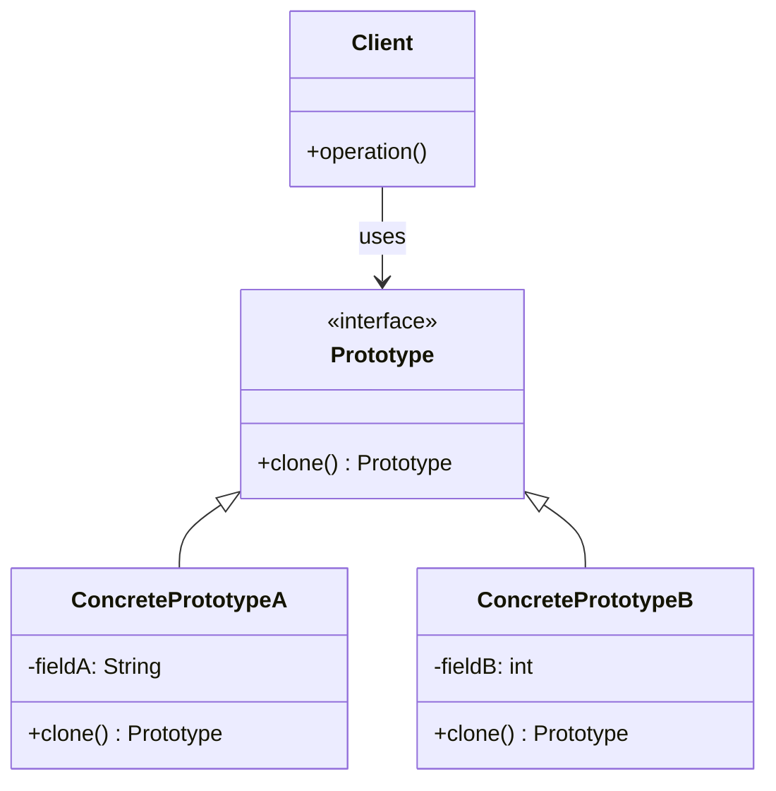

# 原型模式（Prototype Pattern）

> 通过复制现有对象来创建新对象，而非通过new

---

## 📋 基本信息

- **类型**: 创建型模式
- **难度**: ⭐⭐
- **使用频率**: ⭐⭐⭐
- **关键词**: 对象克隆、深拷贝、浅拷贝

---

## 🎯 模式意图

**核心思想**：用原型实例指定创建对象的种类，并且通过拷贝这些原型创建新的对象。

**解决的问题**：
- 当创建新对象的成本过高时（如初始化需要消耗大量资源或时间）
- 当需要避免创建与产品类层次平行的工厂类层次时
- 当一个类的实例只能有几个不同状态组合中的一种时
- 当实例化的类在运行时指定时

**适用场景**：
- 📄 **文档编辑器**：创建文档元素（段落、图片、表格）的副本
- 👥 **用户配置**：复制基础用户配置创建新用户
- 🎮 **游戏开发**：复制游戏角色、道具等对象
- 🧪 **实验模拟**：复制初始实验环境进行多组对比实验
- 📊 **复杂对象**：复制包含多个组件的复杂对象

## 🏗️ UML类图



**类图说明**：
- `Prototype`：声明克隆方法的接口
- `ConcretePrototype`：实现克隆方法的具体原型类
- `Client`：使用原型对象的客户端

## 💻 代码实现

### 基本实现

#### 1. 原型接口

```java
// 原型接口
public interface Prototype {
    Prototype clone();
}
```

#### 2. 具体原型类

```java
// 具体原型类A
public class ConcretePrototypeA implements Prototype {
    private String fieldA;

    public ConcretePrototypeA(String fieldA) {
        this.fieldA = fieldA;
    }

    @Override
    public Prototype clone() {
        // 浅拷贝
        return new ConcretePrototypeA(this.fieldA);
    }

    public String getFieldA() {
        return fieldA;
    }

    public void setFieldA(String fieldA) {
        this.fieldA = fieldA;
    }

    @Override
    public String toString() {
        return "ConcretePrototypeA{fieldA='" + fieldA + "'}";
    }
}

// 具体原型类B
public class ConcretePrototypeB implements Prototype {
    private int fieldB;

    public ConcretePrototypeB(int fieldB) {
        this.fieldB = fieldB;
    }

    @Override
    public Prototype clone() {
        // 浅拷贝
        return new ConcretePrototypeB(this.fieldB);
    }

    public int getFieldB() {
        return fieldB;
    }

    public void setFieldB(int fieldB) {
        this.fieldB = fieldB;
    }

    @Override
    public String toString() {
        return "ConcretePrototypeB{fieldB=" + fieldB + "}";
    }
}
```

#### 3. 客户端使用

```java
public class Client {
    public static void main(String[] args) {
        // 创建原型对象
        Prototype prototypeA = new ConcretePrototypeA("Initial Value A");
        Prototype prototypeB = new ConcretePrototypeB(100);

        // 克隆对象
        Prototype cloneA = prototypeA.clone();
        Prototype cloneB = prototypeB.clone();

        System.out.println("Original A: " + prototypeA);
        System.out.println("Cloned A: " + cloneA);
        System.out.println("Original B: " + prototypeB);
        System.out.println("Cloned B: " + cloneB);

        // 修改克隆对象的属性
        ((ConcretePrototypeA) cloneA).setFieldA("Modified Value A");
        ((ConcretePrototypeB) cloneB).setFieldB(200);

        System.out.println("After modification:");
        System.out.println("Original A: " + prototypeA);
        System.out.println("Modified Cloned A: " + cloneA);
        System.out.println("Original B: " + prototypeB);
        System.out.println("Modified Cloned B: " + cloneB);
    }
}
```

### 深拷贝与浅拷贝

#### 1. 浅拷贝示例

```java
// 包含引用类型的原型类
public class ShallowCopyPrototype implements Prototype {
    private String name;
    private List<String> tags;

    public ShallowCopyPrototype(String name, List<String> tags) {
        this.name = name;
        this.tags = tags;
    }

    @Override
    public Prototype clone() {
        // 浅拷贝：引用类型只复制引用
        return new ShallowCopyPrototype(this.name, this.tags);
    }

    // Getters and setters
    public String getName() { return name; }
    public void setName(String name) { this.name = name; }
    public List<String> getTags() { return tags; }

    @Override
    public String toString() {
        return "ShallowCopyPrototype{name='" + name + "', tags=" + tags + "}";
    }
}
```

#### 2. 深拷贝示例

```java
import java.util.ArrayList;
import java.util.List;

// 实现深拷贝的原型类
public class DeepCopyPrototype implements Prototype {
    private String name;
    private List<String> tags;

    public DeepCopyPrototype(String name, List<String> tags) {
        this.name = name;
        this.tags = tags;
    }

    @Override
    public Prototype clone() {
        // 深拷贝：引用类型也创建新的实例
        List<String> clonedTags = new ArrayList<>(this.tags);
        return new DeepCopyPrototype(this.name, clonedTags);
    }

    // Getters and setters
    public String getName() { return name; }
    public void setName(String name) { this.name = name; }
    public List<String> getTags() { return tags; }

    @Override
    public String toString() {
        return "DeepCopyPrototype{name='" + name + "', tags=" + tags + "}";
    }
}
```

#### 3. 客户端测试拷贝差异

```java
import java.util.ArrayList;
import java.util.List;

public class CopyTestClient {
    public static void main(String[] args) {
        // 测试浅拷贝
        List<String> tags = new ArrayList<>();
        tags.add("java");
        tags.add("design-pattern");

        ShallowCopyPrototype shallowOriginal = new ShallowCopyPrototype("Shallow", tags);
        ShallowCopyPrototype shallowClone = (ShallowCopyPrototype) shallowOriginal.clone();

        // 修改克隆对象的引用类型属性
        shallowClone.getTags().add("shallow-copy");

        System.out.println("Shallow Copy Original: " + shallowOriginal);
        System.out.println("Shallow Copy Clone: " + shallowClone);
        System.out.println("Shallow Original == Clone? " + (shallowOriginal.getTags() == shallowClone.getTags()));

        // 测试深拷贝
        List<String> deepTags = new ArrayList<>();
        deepTags.add("java");
        deepTags.add("design-pattern");

        DeepCopyPrototype deepOriginal = new DeepCopyPrototype("Deep", deepTags);
        DeepCopyPrototype deepClone = (DeepCopyPrototype) deepOriginal.clone();

        // 修改克隆对象的引用类型属性
        deepClone.getTags().add("deep-copy");

        System.out.println("Deep Copy Original: " + deepOriginal);
        System.out.println("Deep Copy Clone: " + deepClone);
        System.out.println("Deep Original == Clone? " + (deepOriginal.getTags() == deepClone.getTags()));
    }
}
```

### Java中的克隆实现

Java提供了Cloneable接口和Object.clone()方法：

```java
import java.util.ArrayList;
import java.util.List;

// 使用Java内置机制实现克隆
public class JavaCloneablePrototype implements Cloneable {
    private String name;
    private List<String> attributes;

    public JavaCloneablePrototype(String name) {
        this.name = name;
        this.attributes = new ArrayList<>();
    }

    // 添加属性
    public void addAttribute(String attribute) {
        this.attributes.add(attribute);
    }

    // 重写clone方法
    @Override
    public JavaCloneablePrototype clone() {
        try {
            JavaCloneablePrototype clone = (JavaCloneablePrototype) super.clone();
            // 深拷贝需要手动复制引用类型
            clone.attributes = new ArrayList<>(this.attributes);
            return clone;
        } catch (CloneNotSupportedException e) {
            throw new AssertionError();
        }
    }

    @Override
    public String toString() {
        return "JavaCloneablePrototype{name='" + name + "', attributes=" + attributes + "}";
    }
}
```

## 🔍 源码应用

### 1. Java中的Cloneable接口

```java
// Java标准库中的Cloneable接口
public interface Cloneable {
}

// Object类中的clone方法
protected native Object clone() throws CloneNotSupportedException;
```

### 2. ArrayList的克隆实现

```java
// ArrayList的clone方法实现
public Object clone() {
    try {
        ArrayList<?> v = (ArrayList<?>) super.clone();
        v.elementData = Arrays.copyOf(elementData, size);
        v.modCount = 0;
        return v;
    } catch (CloneNotSupportedException e) {
        // 这应该永远不会发生，因为我们是Cloneable的
        throw new InternalError(e);
    }
}
```

### 3. Spring中的原型作用域

Spring框架中的原型作用域bean：

```xml
<!-- Spring配置文件 -->
<bean id="prototypeBean" class="com.example.PrototypeBean" scope="prototype">
    <!-- 属性配置 -->
</bean>
```

每次请求都会创建新的实例：

```java
// Spring中获取原型bean
ApplicationContext context = new ClassPathXmlApplicationContext("applicationContext.xml");
PrototypeBean bean1 = context.getBean(PrototypeBean.class);
PrototypeBean bean2 = context.getBean(PrototypeBean.class);

System.out.println(bean1 == bean2); // false，每次获取都是新实例
```

### 4. 设计工具中的原型模式

许多设计工具（如Figma、Sketch）使用原型模式：
- 创建元素副本
- 保留原始属性
- 修改副本不影响原始

## ⚠️ 注意事项

1. **深拷贝vs浅拷贝**：
   - 浅拷贝：只复制基本类型，引用类型只复制引用
   - 深拷贝：所有类型都创建新实例
   - 根据需求选择合适的拷贝方式

2. **Cloneable接口**：
   - Java中的Cloneable只是标记接口，不包含任何方法
   - 必须重写Object.clone()方法才能实现克隆
   - 未实现Cloneable调用clone()会抛出异常

3. **构造函数不执行**：
   - 通过clone()创建对象时不会执行构造函数
   - 初始化逻辑需在专门的初始化方法中实现

4. **循环引用**：
   - 深拷贝处理循环引用时需特别小心
   - 可能导致无限递归或内存溢出

5. **性能考量**：
   - 克隆复杂对象可能比新建对象更高效
   - 但深拷贝可能比浅拷贝性能开销大

6. **不可变对象**：
   - 不可变对象无需克隆，可安全共享
   - 如String、Integer等包装类

## 🎓 最佳实践

1. **使用接口定义原型**：
   ```java
   public interface Prototype<T> {
       T clone();
   }
   ```

2. **提供清晰的拷贝语义**：
   - 明确说明是深拷贝还是浅拷贝
   - 提供两种拷贝方式的实现（如需要）

3. **使用工厂管理原型**：
   ```java
   public class PrototypeFactory {
       private Map<String, Prototype> prototypes = new HashMap<>();

       public void registerPrototype(String key, Prototype prototype) {
           prototypes.put(key, prototype);
       }

       public Prototype createPrototype(String key) {
           return prototypes.get(key).clone();
       }
   }
   ```

4. **结合序列化实现深拷贝**：
   ```java
   import java.io.*;

   public class SerializationUtils {
       @SuppressWarnings("unchecked")
       public static <T extends Serializable> T deepClone(T object) {
           try {
               ByteArrayOutputStream baos = new ByteArrayOutputStream();
               ObjectOutputStream oos = new ObjectOutputStream(baos);
               oos.writeObject(object);

               ByteArrayInputStream bais = new ByteArrayInputStream(baos.toByteArray());
               ObjectInputStream ois = new ObjectInputStream(bais);
               return (T) ois.readObject();
           } catch (Exception e) {
               throw new RuntimeException(e);
           }
       }
   }
   ```

5. **原型注册表**：
   - 维护常用原型实例
   - 通过键快速获取并克隆

6. **避免过度使用**：
   - 简单对象直接使用构造函数更清晰
   - 考虑是否真的需要克隆

## 📚 相关模式

- **工厂方法模式**：原型模式创建对象不需要知道具体类，工厂方法需要
- **抽象工厂模式**：都用于创建复杂对象，但实现方式不同
- **单例模式**：原型模式创建多个相似对象，单例确保只有一个实例
- **建造者模式**：都用于创建复杂对象，建造者强调分步构建
- **备忘录模式**：都涉及对象状态的复制，备忘录更关注状态保存与恢复

原型模式适合创建成本高、结构复杂或需要频繁复制的对象，而工厂模式更适合创建不同类型的对象族。

