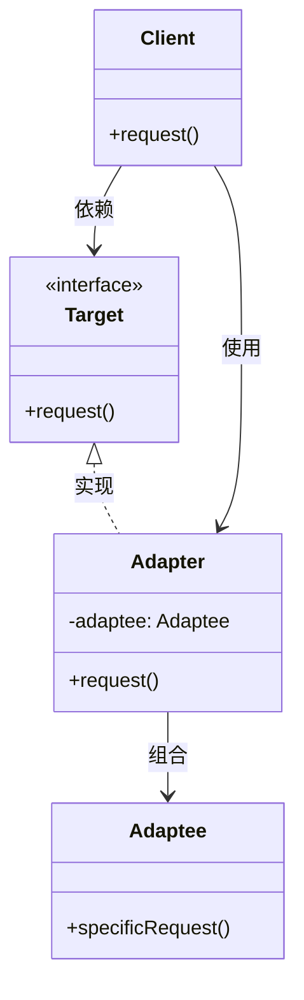

# 适配器模式（Adapter Pattern）

> 将一个类的接口转换成客户期望的另一个接口

---

## 📋 基本信息

- **类型**: 结构型模式
- **难度**: ⭐⭐
- **使用频率**: ⭐⭐⭐⭐
- **关键词**: 接口转换、类适配器、对象适配器

---

## 🎯 模式意图

**核心思想**：将一个类的接口转换成客户端期望的另一个接口，使得原本由于接口不兼容而不能一起工作的那些类可以一起工作。

**解决的问题**：
- 系统需要使用现有的类，但该类的接口不符合系统的需要
- 希望创建一个可以复用的类，用于与一些彼此之间没有太大关联的类或可能在将来引进的类一起工作
- 需要一个统一的输出接口，而输入端的类型不可预知

**适用场景**：
- 🍃 **第三方库集成**：当需要集成一个外部库，但它的接口与你的系统不匹配时
- 🔄 **旧系统改造**：在不修改原有代码的情况下，为旧系统提供新的接口
- 🧩 **适配不同数据格式**：如JSON与XML之间的转换
- 🖥️ **跨平台开发**：为不同平台提供统一接口
- 📱 **设备驱动程序**：为不同设备提供统一的接口

## 🏗️ UML类图



**类图说明**：
- `Target`：目标接口，客户端期望的接口
- `Adaptee`：需要适配的类，拥有特殊功能但接口不兼容
- `Adapter`：适配器类，实现Target接口并包装一个Adaptee对象
- `Client`：客户端，使用Target接口

## 💻 代码实现

### 1. 类适配器（继承方式）

```java
// 目标接口
public interface Target {
    void request();
}

// 需要适配的类
public class Adaptee {
    public void specificRequest() {
        System.out.println("Adaptee: 执行特殊请求");
    }
}

// 类适配器（继承Adaptee并实现Target接口）
public class ClassAdapter extends Adaptee implements Target {
    @Override
    public void request() {
        // 调用被适配者的特殊方法
        specificRequest();
    }
}

// 客户端代码
public class Client {
    public static void main(String[] args) {
        Target target = new ClassAdapter();
        target.request(); // 输出: Adaptee: 执行特殊请求
    }
}
```

### 2. 对象适配器（组合方式）

```java
// 目标接口
public interface Target {
    void request();
}

// 需要适配的类
public class Adaptee {
    public void specificRequest() {
        System.out.println("Adaptee: 执行特殊请求");
    }
}

// 对象适配器（组合Adaptee对象）
public class ObjectAdapter implements Target {
    private Adaptee adaptee;

    public ObjectAdapter(Adaptee adaptee) {
        this.adaptee = adaptee;
    }

    @Override
    public void request() {
        if (adaptee != null) {
            adaptee.specificRequest();
        }
    }
}

// 客户端代码
public class Client {
    public static void main(String[] args) {
        Adaptee adaptee = new Adaptee();
        Target target = new ObjectAdapter(adaptee);
        target.request(); // 输出: Adaptee: 执行特殊请求
    }
}
```

### 3. 接口适配器（缺省适配器）

```java
// 多个方法的接口
public interface MultipleMethodsInterface {
    void method1();
    void method2();
    void method3();
}

// 抽象适配器类，空实现所有方法
public abstract class AbstractAdapter implements MultipleMethodsInterface {
    @Override
    public void method1() {}

    @Override
    public void method2() {}

    @Override
    public void method3() {}
}

// 具体适配器，只实现需要的方法
public class ConcreteAdapter extends AbstractAdapter {
    @Override
    public void method2() {
        System.out.println("只实现需要的方法");
    }
}
```

## 🔍 源码应用

### Java核心库
- **`java.util.Arrays.asList()`**：将数组适配为List接口
- **`java.io.InputStreamReader`**：将InputStream适配为Reader
- **`java.io.OutputStreamWriter`**：将OutputStream适配为Writer
- **`javax.xml.bind.annotation.adapters.XmlAdapter`**：XML序列化和反序列化的适配器

### Spring框架
- **`org.springframework.web.servlet.HandlerAdapter`**：Spring MVC中的处理器适配器
- **`org.springframework.jdbc.support.JdbcAccessor`**：JDBC适配器
- **`org.springframework.cache.support.NoOpCacheManager`**：缓存适配器

### MyBatis
- **`org.apache.ibatis.type.TypeAdapter`**：类型转换适配器
- **`org.apache.ibatis.session.Configuration`**：为不同的日志框架提供适配器

## ⚠️ 注意事项

1. **选择合适的适配器类型**：
   - 类适配器：当需要继承多个类时不适用（Java单继承）
   - 对象适配器：更灵活，符合合成复用原则
   - 接口适配器：当接口方法较多而只需实现部分时使用

2. **避免过度使用**：适配器模式会增加系统复杂性，如非必要，应优先考虑重构而非适配

3. **命名规范**：适配器类名建议以`Adapter`结尾，便于识别

4. **考虑默认适配**：为接口提供默认实现，简化适配器开发

5. **双向适配**：可以实现双向适配器，使两个不兼容的接口可以互相调用

## 🎓 最佳实践

1. **单一职责**：适配器应只负责接口转换，不应添加额外业务逻辑

2. **开闭原则**：通过新增适配器扩展功能，而非修改现有代码

3. **适配抽象**：尽量适配接口或抽象类，而非具体实现类

4. **合理使用委托**：适配器中尽量使用委托而非继承，提高灵活性

5. **设计接口时预留适配空间**：在系统设计初期考虑未来可能的适配需求

## 📚 相关模式

- **装饰器模式**：适配器改变接口，装饰器增强功能
- **外观模式**：为复杂系统提供简化接口，不改变原有接口
- **桥接模式**：分离抽象与实现，允许两者独立变化
- **代理模式**：控制对象访问，不改变接口
- **策略模式**：定义算法族，允许算法替换

